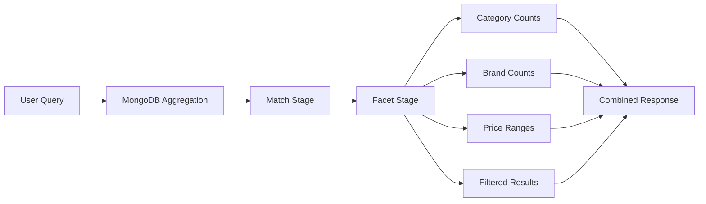
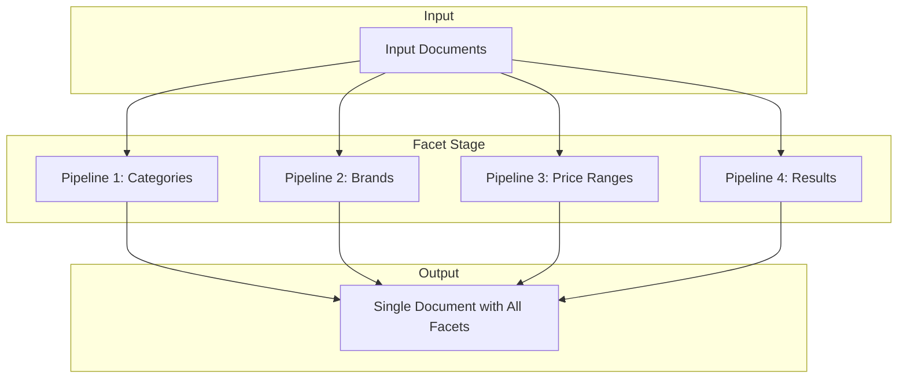
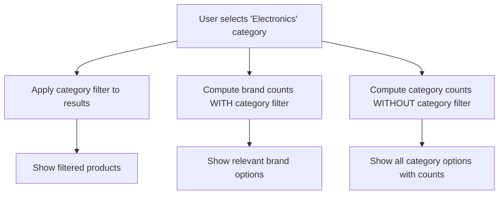
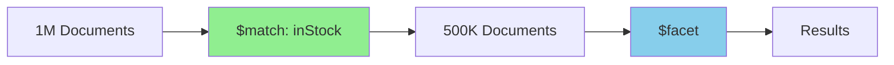

# How to Create MongoDB Faceted Navigation

Author: [nawazdhandala](https://github.com/nawazdhandala)

Tags: MongoDB, Faceted Navigation, Search, E-commerce

Description: Learn to implement faceted navigation with aggregation pipelines, facet counts, and filter combinations for rich search experiences.

---

Faceted navigation is a cornerstone of modern search interfaces. Whether you are building an e-commerce platform, a job board, or a content management system, users expect to filter results by multiple criteria while seeing real-time counts for each option. MongoDB's aggregation framework provides powerful tools to implement this functionality efficiently.

## What is Faceted Navigation?

Faceted navigation allows users to refine search results by selecting filters from multiple categories (facets). Each facet displays available options with their corresponding counts, enabling users to understand the data distribution before applying filters.



## Sample Data Model

Let us work with a product catalog for an e-commerce application. Here is our sample schema:

```javascript
// Product document structure
{
  _id: ObjectId("..."),
  name: "Wireless Bluetooth Headphones",
  category: "Electronics",
  brand: "AudioTech",
  price: 79.99,
  rating: 4.5,
  inStock: true,
  tags: ["wireless", "bluetooth", "audio"],
  specifications: {
    color: "Black",
    weight: "250g",
    batteryLife: "30 hours"
  },
  createdAt: ISODate("2025-06-15T10:30:00Z")
}
```

Insert some sample data to follow along:

```javascript
db.products.insertMany([
  {
    name: "Wireless Bluetooth Headphones",
    category: "Electronics",
    brand: "AudioTech",
    price: 79.99,
    rating: 4.5,
    inStock: true,
    tags: ["wireless", "bluetooth", "audio"]
  },
  {
    name: "Running Shoes",
    category: "Sports",
    brand: "SpeedRun",
    price: 129.99,
    rating: 4.8,
    inStock: true,
    tags: ["running", "athletic", "comfortable"]
  },
  {
    name: "Laptop Stand",
    category: "Electronics",
    brand: "DeskPro",
    price: 45.00,
    rating: 4.2,
    inStock: false,
    tags: ["ergonomic", "adjustable", "aluminum"]
  },
  {
    name: "Yoga Mat",
    category: "Sports",
    brand: "FlexFit",
    price: 35.00,
    rating: 4.6,
    inStock: true,
    tags: ["yoga", "exercise", "non-slip"]
  },
  {
    name: "Mechanical Keyboard",
    category: "Electronics",
    brand: "TypeMaster",
    price: 149.99,
    rating: 4.7,
    inStock: true,
    tags: ["mechanical", "rgb", "gaming"]
  }
]);
```

## Understanding the $facet Stage

The `$facet` stage is the heart of faceted navigation in MongoDB. It allows you to run multiple aggregation pipelines within a single stage, processing the same set of input documents.



## Basic Faceted Search Implementation

Here is a complete faceted search query that returns category counts, brand counts, price ranges, and paginated results:

```javascript
db.products.aggregate([
  // Stage 1: Initial match (apply user filters)
  {
    $match: {
      inStock: true
    }
  },

  // Stage 2: Faceted aggregation
  {
    $facet: {
      // Facet 1: Category counts
      categories: [
        {
          $group: {
            _id: "$category",
            count: { $sum: 1 }
          }
        },
        {
          $sort: { count: -1 }
        }
      ],

      // Facet 2: Brand counts
      brands: [
        {
          $group: {
            _id: "$brand",
            count: { $sum: 1 }
          }
        },
        {
          $sort: { count: -1 }
        }
      ],

      // Facet 3: Price ranges
      priceRanges: [
        {
          $bucket: {
            groupBy: "$price",
            boundaries: [0, 50, 100, 200, 500],
            default: "500+",
            output: {
              count: { $sum: 1 }
            }
          }
        }
      ],

      // Facet 4: Rating distribution
      ratings: [
        {
          $bucket: {
            groupBy: "$rating",
            boundaries: [0, 2, 3, 4, 5],
            default: "5",
            output: {
              count: { $sum: 1 }
            }
          }
        }
      ],

      // Facet 5: Paginated results
      results: [
        { $sort: { rating: -1 } },
        { $skip: 0 },
        { $limit: 10 },
        {
          $project: {
            name: 1,
            category: 1,
            brand: 1,
            price: 1,
            rating: 1
          }
        }
      ],

      // Facet 6: Total count for pagination
      totalCount: [
        { $count: "total" }
      ]
    }
  }
]);
```

## Dynamic Filter Application

In real applications, users apply multiple filters simultaneously. Here is how to build a dynamic query based on user selections:

```javascript
function buildFacetedSearch(filters, pagination) {
  const { category, brand, minPrice, maxPrice, minRating, inStock } = filters;
  const { page = 1, limit = 10, sortBy = "rating", sortOrder = -1 } = pagination;

  // Build the match conditions dynamically
  const matchConditions = {};

  if (category) {
    matchConditions.category = category;
  }

  if (brand) {
    matchConditions.brand = { $in: Array.isArray(brand) ? brand : [brand] };
  }

  if (minPrice !== undefined || maxPrice !== undefined) {
    matchConditions.price = {};
    if (minPrice !== undefined) matchConditions.price.$gte = minPrice;
    if (maxPrice !== undefined) matchConditions.price.$lte = maxPrice;
  }

  if (minRating !== undefined) {
    matchConditions.rating = { $gte: minRating };
  }

  if (inStock !== undefined) {
    matchConditions.inStock = inStock;
  }

  const skip = (page - 1) * limit;
  const sortOptions = { [sortBy]: sortOrder };

  return db.products.aggregate([
    // Apply filters
    { $match: matchConditions },

    // Generate facets
    {
      $facet: {
        categories: [
          { $group: { _id: "$category", count: { $sum: 1 } } },
          { $sort: { count: -1 } }
        ],
        brands: [
          { $group: { _id: "$brand", count: { $sum: 1 } } },
          { $sort: { count: -1 } }
        ],
        priceRanges: [
          {
            $bucket: {
              groupBy: "$price",
              boundaries: [0, 50, 100, 200, 500],
              default: "500+",
              output: { count: { $sum: 1 } }
            }
          }
        ],
        results: [
          { $sort: sortOptions },
          { $skip: skip },
          { $limit: limit }
        ],
        totalCount: [
          { $count: "total" }
        ]
      }
    }
  ]);
}

// Example usage
buildFacetedSearch(
  { category: "Electronics", minPrice: 50, inStock: true },
  { page: 1, limit: 10, sortBy: "price", sortOrder: 1 }
);
```

## Computing Facet Counts with Filters

A common requirement is showing facet counts that reflect what would happen if a user selected that option. This requires computing counts both with and without certain filters:



```javascript
function buildSmartFacetedSearch(filters) {
  const { category, brand, minPrice, maxPrice } = filters;

  // Base match without category filter - for category facet
  const baseCategoryMatch = {};
  if (brand) baseCategoryMatch.brand = brand;
  if (minPrice !== undefined) baseCategoryMatch.price = { $gte: minPrice };
  if (maxPrice !== undefined) {
    baseCategoryMatch.price = baseCategoryMatch.price || {};
    baseCategoryMatch.price.$lte = maxPrice;
  }

  // Base match without brand filter - for brand facet
  const baseBrandMatch = {};
  if (category) baseBrandMatch.category = category;
  if (minPrice !== undefined) baseBrandMatch.price = { $gte: minPrice };
  if (maxPrice !== undefined) {
    baseBrandMatch.price = baseBrandMatch.price || {};
    baseBrandMatch.price.$lte = maxPrice;
  }

  // Full match for results
  const fullMatch = { ...baseCategoryMatch };
  if (category) fullMatch.category = category;
  if (brand) fullMatch.brand = brand;

  return db.products.aggregate([
    {
      $facet: {
        // Category counts - exclude category filter
        categories: [
          { $match: baseCategoryMatch },
          { $group: { _id: "$category", count: { $sum: 1 } } },
          { $sort: { count: -1 } }
        ],

        // Brand counts - exclude brand filter
        brands: [
          { $match: baseBrandMatch },
          { $group: { _id: "$brand", count: { $sum: 1 } } },
          { $sort: { count: -1 } }
        ],

        // Price ranges - apply all non-price filters
        priceRanges: [
          { $match: { category, brand } },
          {
            $bucket: {
              groupBy: "$price",
              boundaries: [0, 50, 100, 200, 500],
              default: "500+",
              output: { count: { $sum: 1 } }
            }
          }
        ],

        // Results - apply all filters
        results: [
          { $match: fullMatch },
          { $sort: { rating: -1 } },
          { $limit: 10 }
        ],

        totalCount: [
          { $match: fullMatch },
          { $count: "total" }
        ]
      }
    }
  ]);
}
```

## Tag-Based Faceting

For products with multiple tags, you need to unwind the array before grouping:

```javascript
db.products.aggregate([
  { $match: { inStock: true } },
  {
    $facet: {
      // Tag counts - unwind first
      tags: [
        { $unwind: "$tags" },
        { $group: { _id: "$tags", count: { $sum: 1 } } },
        { $sort: { count: -1 } },
        { $limit: 20 }
      ],

      // Other facets
      categories: [
        { $group: { _id: "$category", count: { $sum: 1 } } }
      ],

      results: [
        { $limit: 10 }
      ]
    }
  }
]);
```

## Hierarchical Category Facets

For nested categories, you can use `$graphLookup` or store the path:

```javascript
// Document structure with category path
{
  name: "Gaming Mouse",
  categoryPath: ["Electronics", "Computers", "Peripherals", "Mice"],
  // ... other fields
}

// Aggregation for hierarchical facets
db.products.aggregate([
  {
    $facet: {
      // Top-level categories
      topCategories: [
        {
          $group: {
            _id: { $arrayElemAt: ["$categoryPath", 0] },
            count: { $sum: 1 }
          }
        }
      ],

      // Second-level categories (filtered by top level)
      subCategories: [
        { $match: { "categoryPath.0": "Electronics" } },
        {
          $group: {
            _id: { $arrayElemAt: ["$categoryPath", 1] },
            count: { $sum: 1 }
          }
        }
      ],

      results: [
        { $limit: 10 }
      ]
    }
  }
]);
```

## Performance Optimization

### 1. Create Appropriate Indexes

Indexes are critical for faceted search performance:

```javascript
// Compound index for common filter combinations
db.products.createIndex({
  category: 1,
  brand: 1,
  price: 1,
  rating: -1
});

// Index for in-stock queries
db.products.createIndex({
  inStock: 1,
  category: 1
});

// Text index for search
db.products.createIndex({
  name: "text",
  tags: "text"
});

// Index for tag-based queries
db.products.createIndex({ tags: 1 });
```

### 2. Use $match Before $facet

Always filter documents before the `$facet` stage to reduce the working set:



```javascript
// Good - filter first
db.products.aggregate([
  { $match: { inStock: true, category: "Electronics" } },
  { $facet: { /* ... */ } }
]);

// Bad - processing all documents
db.products.aggregate([
  {
    $facet: {
      results: [
        { $match: { inStock: true, category: "Electronics" } },
        // ...
      ]
    }
  }
]);
```

### 3. Limit Facet Results

Prevent memory issues by limiting facet outputs:

```javascript
db.products.aggregate([
  {
    $facet: {
      categories: [
        { $group: { _id: "$category", count: { $sum: 1 } } },
        { $sort: { count: -1 } },
        { $limit: 50 }  // Limit to top 50 categories
      ],
      brands: [
        { $group: { _id: "$brand", count: { $sum: 1 } } },
        { $sort: { count: -1 } },
        { $limit: 100 }  // Limit to top 100 brands
      ]
    }
  }
]);
```

### 4. Consider Caching

For high-traffic applications, cache facet counts:

```javascript
// Store pre-computed facet counts
const facetCache = {
  key: "facets:inStock:true",
  ttl: 300, // 5 minutes
  data: {
    categories: [
      { _id: "Electronics", count: 1523 },
      { _id: "Sports", count: 892 }
    ],
    brands: [/* ... */]
  }
};

// Update cache on write operations or periodically
async function updateFacetCache() {
  const facets = await db.products.aggregate([
    { $match: { inStock: true } },
    {
      $facet: {
        categories: [
          { $group: { _id: "$category", count: { $sum: 1 } } }
        ]
      }
    }
  ]).toArray();

  await cache.set("facets:inStock:true", facets[0], 300);
}
```

### 5. Use allowDiskUse for Large Datasets

For operations exceeding the 100MB memory limit:

```javascript
db.products.aggregate([
  { $match: { /* filters */ } },
  { $facet: { /* facets */ } }
], { allowDiskUse: true });
```

## Complete Node.js Implementation

Here is a production-ready implementation using Node.js and the MongoDB driver:

```javascript
const { MongoClient } = require('mongodb');

class FacetedSearchService {
  constructor(db) {
    this.collection = db.collection('products');
  }

  async search(filters = {}, options = {}) {
    const {
      query,
      category,
      brands,
      minPrice,
      maxPrice,
      minRating,
      inStock,
      tags
    } = filters;

    const {
      page = 1,
      limit = 20,
      sortBy = 'rating',
      sortOrder = -1
    } = options;

    // Build match stage
    const matchStage = this.buildMatchStage({
      query,
      category,
      brands,
      minPrice,
      maxPrice,
      minRating,
      inStock,
      tags
    });

    const skip = (page - 1) * limit;

    const pipeline = [
      ...(Object.keys(matchStage).length > 0 ? [{ $match: matchStage }] : []),
      {
        $facet: {
          categories: [
            { $group: { _id: '$category', count: { $sum: 1 } } },
            { $sort: { count: -1 } },
            { $limit: 50 }
          ],
          brands: [
            { $group: { _id: '$brand', count: { $sum: 1 } } },
            { $sort: { count: -1 } },
            { $limit: 100 }
          ],
          priceRanges: [
            {
              $bucket: {
                groupBy: '$price',
                boundaries: [0, 25, 50, 100, 200, 500, 1000],
                default: '1000+',
                output: {
                  count: { $sum: 1 },
                  minPrice: { $min: '$price' },
                  maxPrice: { $max: '$price' }
                }
              }
            }
          ],
          ratings: [
            {
              $group: {
                _id: { $floor: '$rating' },
                count: { $sum: 1 }
              }
            },
            { $sort: { _id: -1 } }
          ],
          availability: [
            {
              $group: {
                _id: '$inStock',
                count: { $sum: 1 }
              }
            }
          ],
          results: [
            { $sort: { [sortBy]: sortOrder } },
            { $skip: skip },
            { $limit: limit },
            {
              $project: {
                name: 1,
                category: 1,
                brand: 1,
                price: 1,
                rating: 1,
                inStock: 1,
                tags: 1
              }
            }
          ],
          totalCount: [{ $count: 'total' }]
        }
      },
      {
        $project: {
          categories: 1,
          brands: 1,
          priceRanges: 1,
          ratings: 1,
          availability: 1,
          results: 1,
          total: { $arrayElemAt: ['$totalCount.total', 0] }
        }
      }
    ];

    const [result] = await this.collection
      .aggregate(pipeline, { allowDiskUse: true })
      .toArray();

    return {
      facets: {
        categories: result.categories,
        brands: result.brands,
        priceRanges: result.priceRanges,
        ratings: result.ratings,
        availability: result.availability
      },
      results: result.results,
      pagination: {
        page,
        limit,
        total: result.total || 0,
        totalPages: Math.ceil((result.total || 0) / limit)
      }
    };
  }

  buildMatchStage(filters) {
    const match = {};

    if (filters.query) {
      match.$text = { $search: filters.query };
    }

    if (filters.category) {
      match.category = filters.category;
    }

    if (filters.brands && filters.brands.length > 0) {
      match.brand = { $in: filters.brands };
    }

    if (filters.minPrice !== undefined || filters.maxPrice !== undefined) {
      match.price = {};
      if (filters.minPrice !== undefined) {
        match.price.$gte = filters.minPrice;
      }
      if (filters.maxPrice !== undefined) {
        match.price.$lte = filters.maxPrice;
      }
    }

    if (filters.minRating !== undefined) {
      match.rating = { $gte: filters.minRating };
    }

    if (filters.inStock !== undefined) {
      match.inStock = filters.inStock;
    }

    if (filters.tags && filters.tags.length > 0) {
      match.tags = { $all: filters.tags };
    }

    return match;
  }
}

// Usage example
async function main() {
  const client = new MongoClient('mongodb://localhost:27017');
  await client.connect();

  const db = client.db('ecommerce');
  const searchService = new FacetedSearchService(db);

  const results = await searchService.search(
    {
      category: 'Electronics',
      minPrice: 50,
      inStock: true
    },
    {
      page: 1,
      limit: 10,
      sortBy: 'price',
      sortOrder: 1
    }
  );

  console.log('Facets:', JSON.stringify(results.facets, null, 2));
  console.log('Results:', results.results);
  console.log('Pagination:', results.pagination);

  await client.close();
}

main().catch(console.error);
```

## Response Format

Structure your API response for easy frontend consumption:

```javascript
{
  "facets": {
    "categories": [
      { "value": "Electronics", "count": 156 },
      { "value": "Sports", "count": 89 }
    ],
    "brands": [
      { "value": "AudioTech", "count": 45 },
      { "value": "TypeMaster", "count": 32 }
    ],
    "priceRanges": [
      { "min": 0, "max": 50, "count": 23 },
      { "min": 50, "max": 100, "count": 67 },
      { "min": 100, "max": 200, "count": 45 }
    ],
    "ratings": [
      { "value": 5, "count": 12 },
      { "value": 4, "count": 89 },
      { "value": 3, "count": 34 }
    ]
  },
  "results": [
    {
      "_id": "...",
      "name": "Wireless Bluetooth Headphones",
      "category": "Electronics",
      "brand": "AudioTech",
      "price": 79.99,
      "rating": 4.5
    }
  ],
  "pagination": {
    "page": 1,
    "limit": 20,
    "total": 156,
    "totalPages": 8
  }
}
```

## Summary

MongoDB's `$facet` stage provides a powerful foundation for building faceted navigation systems. Key takeaways:

1. Use `$facet` to run multiple aggregation pipelines in a single query
2. Apply `$match` before `$facet` to reduce the document set
3. Create appropriate indexes for your filter combinations
4. Consider caching facet counts for high-traffic applications
5. Use `$bucket` for range-based facets like price and rating
6. Implement smart facet counting that shows relevant options based on current filters
7. Always limit facet outputs to prevent memory issues

With these techniques, you can build responsive search interfaces that help users find exactly what they are looking for while understanding the available options at each step.
