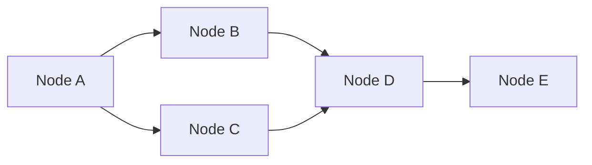
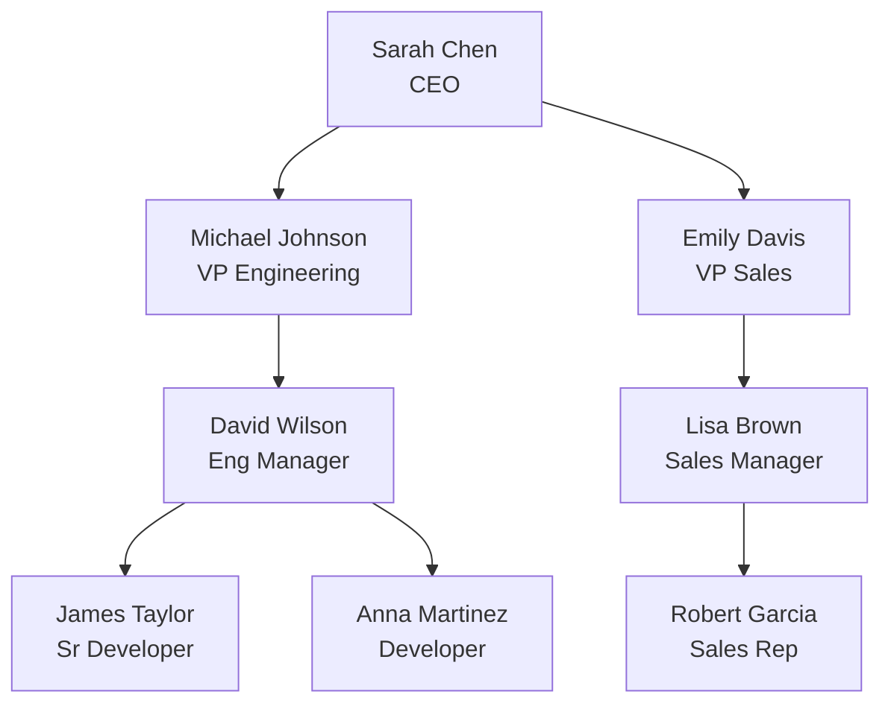
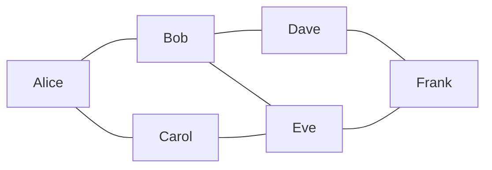
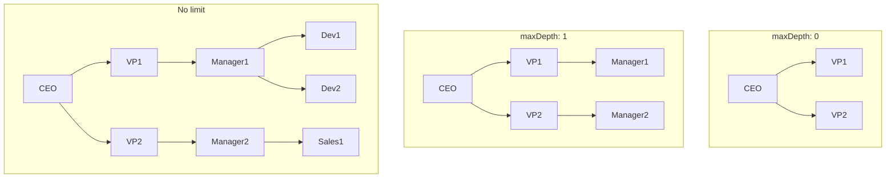
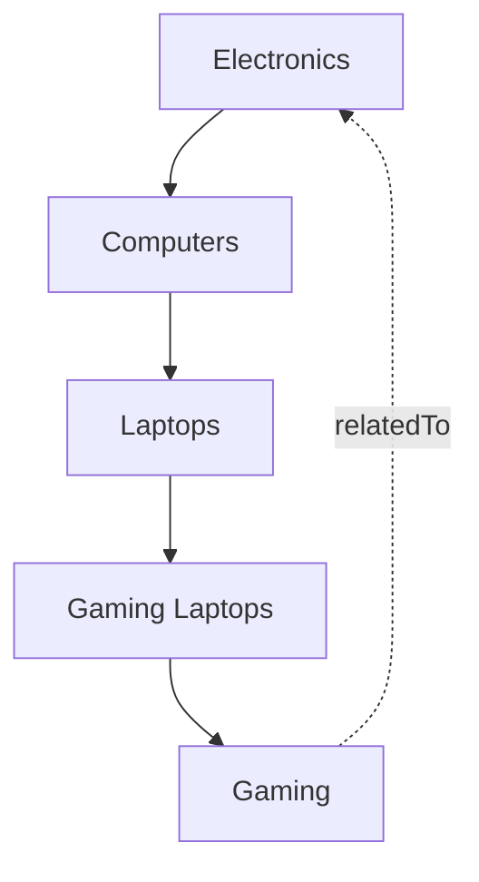
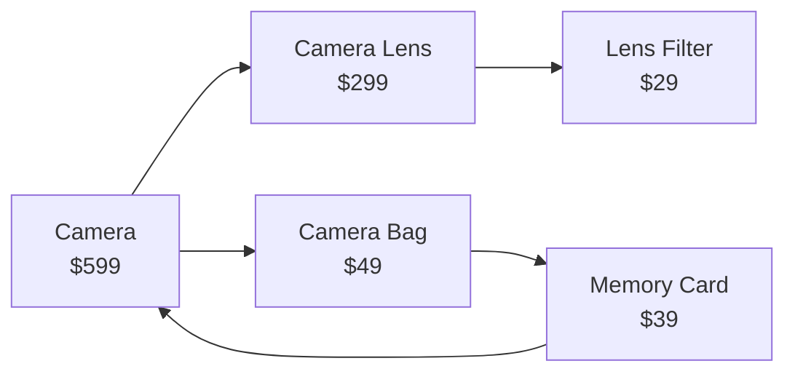

# How to Implement MongoDB Graph Lookups

Author: [nawazdhandala](https://github.com/nawazdhandala)

Tags: MongoDB, Graph Queries, Aggregation, Data Modeling

Description: Learn how to use $graphLookup for recursive graph traversal in MongoDB.

---

## Introduction

Graph data structures are everywhere. From social networks to organizational hierarchies, many real-world relationships are naturally represented as graphs. While dedicated graph databases exist, MongoDB offers a powerful alternative with the `$graphLookup` aggregation stage. This operator enables recursive traversal of graph-like structures stored in your collections, making it possible to query hierarchical and networked data without switching databases.

In this post, we will explore how to implement graph lookups in MongoDB, covering syntax, depth limiting, cycle detection, and practical examples.

## Understanding Graph Data in MongoDB

Before diving into `$graphLookup`, let us understand how graph data is typically stored in MongoDB. A graph consists of nodes (vertices) and edges (connections). In MongoDB, we can represent this in several ways:



The most common approach is to store references within documents:

```javascript
// Example: Employee document with manager reference
{
  "_id": ObjectId("employee1"),
  "name": "Alice",
  "role": "Software Engineer",
  "reportsTo": ObjectId("manager1")  // Reference to another document
}
```

## The $graphLookup Syntax

The `$graphLookup` stage performs a recursive search on a collection. Here is the complete syntax:

```javascript
{
  $graphLookup: {
    // The collection to search
    from: "collectionName",

    // The starting point for the graph traversal
    startWith: "$fieldExpression",

    // The field in documents from "from" collection to match against
    connectFromField: "fieldName",

    // The field to match connectFromField values
    connectToField: "fieldName",

    // The output array field containing the traversed documents
    as: "outputFieldName",

    // Optional: Maximum recursion depth (0 = unlimited)
    maxDepth: number,

    // Optional: Field name for depth of each result
    depthField: "fieldName",

    // Optional: Additional filter conditions
    restrictSearchWithMatch: { query }
  }
}
```

## Example 1: Organizational Chart Traversal

Let us build a practical example using an organizational hierarchy. First, we will set up our employee collection:

```javascript
// Create the employees collection with hierarchical data
db.employees.insertMany([
  {
    _id: "ceo1",
    name: "Sarah Chen",
    title: "CEO",
    department: "Executive",
    reportsTo: null  // CEO has no manager
  },
  {
    _id: "vp1",
    name: "Michael Johnson",
    title: "VP of Engineering",
    department: "Engineering",
    reportsTo: "ceo1"
  },
  {
    _id: "vp2",
    name: "Emily Davis",
    title: "VP of Sales",
    department: "Sales",
    reportsTo: "ceo1"
  },
  {
    _id: "mgr1",
    name: "David Wilson",
    title: "Engineering Manager",
    department: "Engineering",
    reportsTo: "vp1"
  },
  {
    _id: "mgr2",
    name: "Lisa Brown",
    title: "Sales Manager",
    department: "Sales",
    reportsTo: "vp2"
  },
  {
    _id: "dev1",
    name: "James Taylor",
    title: "Senior Developer",
    department: "Engineering",
    reportsTo: "mgr1"
  },
  {
    _id: "dev2",
    name: "Anna Martinez",
    title: "Developer",
    department: "Engineering",
    reportsTo: "mgr1"
  },
  {
    _id: "sales1",
    name: "Robert Garcia",
    title: "Sales Representative",
    department: "Sales",
    reportsTo: "mgr2"
  }
]);
```

The organizational structure looks like this:



### Finding All Reports Under a Manager

Now let us use `$graphLookup` to find all employees who report to the VP of Engineering, directly or indirectly:

```javascript
// Find all employees reporting to the VP of Engineering (recursively)
db.employees.aggregate([
  {
    // Start with the VP of Engineering
    $match: { _id: "vp1" }
  },
  {
    $graphLookup: {
      // Search within the employees collection
      from: "employees",

      // Start traversal from this employee's _id
      startWith: "$_id",

      // Each document's reportsTo field points to its manager
      connectFromField: "_id",

      // Match against the reportsTo field to find subordinates
      connectToField: "reportsTo",

      // Store results in the "allReports" array
      as: "allReports",

      // Include depth information for each result
      depthField: "reportingLevel"
    }
  },
  {
    // Project only the fields we need
    $project: {
      name: 1,
      title: 1,
      allReports: {
        name: 1,
        title: 1,
        reportingLevel: 1
      }
    }
  }
]);
```

**Output:**

```javascript
{
  "_id": "vp1",
  "name": "Michael Johnson",
  "title": "VP of Engineering",
  "allReports": [
    {
      "name": "David Wilson",
      "title": "Engineering Manager",
      "reportingLevel": NumberLong(0)  // Direct report
    },
    {
      "name": "James Taylor",
      "title": "Senior Developer",
      "reportingLevel": NumberLong(1)  // Reports to David
    },
    {
      "name": "Anna Martinez",
      "title": "Developer",
      "reportingLevel": NumberLong(1)  // Reports to David
    }
  ]
}
```

### Finding the Management Chain

We can also traverse upward to find an employee's complete management chain:

```javascript
// Find the complete management chain for a developer
db.employees.aggregate([
  {
    // Start with a specific developer
    $match: { _id: "dev1" }
  },
  {
    $graphLookup: {
      from: "employees",

      // Start from this employee's manager
      startWith: "$reportsTo",

      // Follow the reportsTo field upward
      connectFromField: "reportsTo",

      // Match against _id to find the next manager
      connectToField: "_id",

      // Store the management chain
      as: "managementChain",

      // Track how many levels up each manager is
      depthField: "levelAbove"
    }
  },
  {
    $project: {
      name: 1,
      title: 1,
      managementChain: {
        name: 1,
        title: 1,
        levelAbove: 1
      }
    }
  }
]);
```

**Output:**

```javascript
{
  "_id": "dev1",
  "name": "James Taylor",
  "title": "Senior Developer",
  "managementChain": [
    {
      "name": "David Wilson",
      "title": "Engineering Manager",
      "levelAbove": NumberLong(0)  // Direct manager
    },
    {
      "name": "Michael Johnson",
      "title": "VP of Engineering",
      "levelAbove": NumberLong(1)  // Skip-level manager
    },
    {
      "name": "Sarah Chen",
      "title": "CEO",
      "levelAbove": NumberLong(2)  // Top of chain
    }
  ]
}
```

## Example 2: Social Network Friend Connections

Social networks are classic graph use cases. Let us model a simple friend network:

```javascript
// Create a social network users collection
db.users.insertMany([
  {
    _id: "user1",
    name: "Alice",
    interests: ["photography", "hiking"],
    friends: ["user2", "user3"]
  },
  {
    _id: "user2",
    name: "Bob",
    interests: ["gaming", "hiking"],
    friends: ["user1", "user4", "user5"]
  },
  {
    _id: "user3",
    name: "Carol",
    interests: ["music", "photography"],
    friends: ["user1", "user5"]
  },
  {
    _id: "user4",
    name: "Dave",
    interests: ["gaming", "cooking"],
    friends: ["user2", "user6"]
  },
  {
    _id: "user5",
    name: "Eve",
    interests: ["hiking", "music"],
    friends: ["user2", "user3", "user6"]
  },
  {
    _id: "user6",
    name: "Frank",
    interests: ["cooking", "photography"],
    friends: ["user4", "user5"]
  }
]);
```

The social network looks like this:



### Finding Friends of Friends

Let us find all users within two degrees of connection from Alice:

```javascript
// Find friends and friends-of-friends for Alice
db.users.aggregate([
  {
    $match: { _id: "user1" }  // Start with Alice
  },
  {
    $graphLookup: {
      from: "users",

      // Start with Alice's direct friends
      startWith: "$friends",

      // From each friend, follow their friends array
      connectFromField: "friends",

      // Match against user _id
      connectToField: "_id",

      // Store all connected users
      as: "socialNetwork",

      // Limit to 2 degrees of separation
      maxDepth: 1,

      // Track connection distance
      depthField: "connectionDegree"
    }
  },
  {
    // Filter out the starting user from results
    $project: {
      name: 1,
      directFriends: "$friends",
      socialNetwork: {
        $filter: {
          input: "$socialNetwork",
          as: "connection",
          cond: { $ne: ["$$connection._id", "$_id"] }
        }
      }
    }
  },
  {
    // Format the output nicely
    $project: {
      name: 1,
      socialNetwork: {
        name: 1,
        connectionDegree: 1
      }
    }
  }
]);
```

**Output:**

```javascript
{
  "_id": "user1",
  "name": "Alice",
  "socialNetwork": [
    { "name": "Bob", "connectionDegree": NumberLong(0) },      // Direct friend
    { "name": "Carol", "connectionDegree": NumberLong(0) },   // Direct friend
    { "name": "Dave", "connectionDegree": NumberLong(1) },    // Friend of Bob
    { "name": "Eve", "connectionDegree": NumberLong(1) }      // Friend of Bob and Carol
  ]
}
```

### Finding Mutual Friends

We can combine `$graphLookup` with other aggregation stages to find mutual friends:

```javascript
// Find mutual friends between two users
db.users.aggregate([
  {
    $match: { _id: "user1" }  // Alice
  },
  {
    $graphLookup: {
      from: "users",
      startWith: "$friends",
      connectFromField: "friends",
      connectToField: "_id",
      as: "aliceNetwork",
      maxDepth: 0  // Only direct friends
    }
  },
  {
    // Lookup the other user's friends
    $lookup: {
      from: "users",
      pipeline: [
        { $match: { _id: "user4" } },  // Dave
        {
          $graphLookup: {
            from: "users",
            startWith: "$friends",
            connectFromField: "friends",
            connectToField: "_id",
            as: "daveNetwork",
            maxDepth: 0
          }
        }
      ],
      as: "daveData"
    }
  },
  {
    // Find intersection of friend networks
    $project: {
      aliceName: "$name",
      daveName: { $arrayElemAt: ["$daveData.name", 0] },
      mutualFriends: {
        $setIntersection: [
          "$aliceNetwork._id",
          { $arrayElemAt: ["$daveData.daveNetwork._id", 0] }
        ]
      }
    }
  }
]);
```

## Depth Limiting with maxDepth

The `maxDepth` parameter controls how many recursive steps the traversal takes. This is essential for:

1. **Performance**: Preventing runaway queries on large graphs
2. **Relevance**: Limiting results to meaningful connections
3. **Resource management**: Avoiding memory exhaustion

```javascript
// Compare different depth limits
// Depth 0: Only direct connections
db.employees.aggregate([
  { $match: { _id: "ceo1" } },
  {
    $graphLookup: {
      from: "employees",
      startWith: "$_id",
      connectFromField: "_id",
      connectToField: "reportsTo",
      as: "directReports",
      maxDepth: 0,  // Only immediate subordinates
      depthField: "level"
    }
  }
]);
// Returns: VP of Engineering, VP of Sales

// Depth 1: Two levels of connections
db.employees.aggregate([
  { $match: { _id: "ceo1" } },
  {
    $graphLookup: {
      from: "employees",
      startWith: "$_id",
      connectFromField: "_id",
      connectToField: "reportsTo",
      as: "twoLevelReports",
      maxDepth: 1,  // VPs and their direct reports
      depthField: "level"
    }
  }
]);
// Returns: VPs + Engineering Manager, Sales Manager

// No depth limit (use carefully!)
db.employees.aggregate([
  { $match: { _id: "ceo1" } },
  {
    $graphLookup: {
      from: "employees",
      startWith: "$_id",
      connectFromField: "_id",
      connectToField: "reportsTo",
      as: "allSubordinates"
      // No maxDepth means unlimited traversal
    }
  }
]);
// Returns: Everyone in the company
```

The depth behavior visualized:



## Handling Cycles in Graph Data

Graphs can contain cycles, where a path eventually returns to a previously visited node. MongoDB's `$graphLookup` automatically detects and handles cycles by tracking visited documents.

### Example: Category Hierarchy with Circular Reference

```javascript
// Create categories with an intentional cycle
db.categories.insertMany([
  { _id: "cat1", name: "Electronics", parent: null },
  { _id: "cat2", name: "Computers", parent: "cat1" },
  { _id: "cat3", name: "Laptops", parent: "cat2" },
  { _id: "cat4", name: "Gaming Laptops", parent: "cat3" },
  // Circular reference: Gaming relates back to Electronics
  { _id: "cat5", name: "Gaming", parent: "cat4", relatedTo: "cat1" }
]);
```



```javascript
// MongoDB automatically prevents infinite loops
db.categories.aggregate([
  { $match: { _id: "cat1" } },
  {
    $graphLookup: {
      from: "categories",
      startWith: "$_id",
      connectFromField: "_id",
      connectToField: "parent",
      as: "allSubcategories",
      depthField: "depth"
    }
  }
]);

// The query completes successfully because MongoDB tracks visited documents
// Each document appears only once in the results, regardless of cycles
```

### Best Practices for Cycle Handling

1. **Use depthField**: Always include `depthField` to understand traversal paths
2. **Set maxDepth**: Even with cycle detection, limit depth for predictable performance
3. **Validate data**: Consider adding application-level cycle detection when inserting data

```javascript
// Defensive query with cycle-safe settings
db.categories.aggregate([
  { $match: { _id: "cat1" } },
  {
    $graphLookup: {
      from: "categories",
      startWith: "$_id",
      connectFromField: "_id",
      connectToField: "parent",
      as: "subcategories",
      maxDepth: 10,  // Reasonable limit for category depth
      depthField: "level",
      // Only include active categories
      restrictSearchWithMatch: { isActive: { $ne: false } }
    }
  }
]);
```

## Filtering Results with restrictSearchWithMatch

The `restrictSearchWithMatch` parameter allows you to filter which documents are considered during traversal:

```javascript
// Find only Engineering department employees under CEO
db.employees.aggregate([
  { $match: { _id: "ceo1" } },
  {
    $graphLookup: {
      from: "employees",
      startWith: "$_id",
      connectFromField: "_id",
      connectToField: "reportsTo",
      as: "engineeringTeam",
      // Only include Engineering department
      restrictSearchWithMatch: {
        department: "Engineering"
      },
      depthField: "level"
    }
  },
  {
    $project: {
      name: 1,
      engineeringTeam: {
        name: 1,
        title: 1,
        level: 1
      }
    }
  }
]);
```

**Important**: `restrictSearchWithMatch` filters which documents can be traversed to, but it does not affect the starting point. Documents that do not match the restriction are skipped, and traversal continues through matching documents only.

## Performance Considerations

When using `$graphLookup`, keep these performance tips in mind:

### 1. Index the Connection Fields

```javascript
// Create indexes for efficient traversal
db.employees.createIndex({ reportsTo: 1 });
db.employees.createIndex({ _id: 1, reportsTo: 1 });

db.users.createIndex({ friends: 1 });
```

### 2. Limit Result Set Size

```javascript
// Use $match early and limit depth
db.employees.aggregate([
  { $match: { department: "Engineering" } },  // Filter first
  {
    $graphLookup: {
      from: "employees",
      startWith: "$reportsTo",
      connectFromField: "reportsTo",
      connectToField: "_id",
      as: "chain",
      maxDepth: 5  // Reasonable limit
    }
  },
  { $limit: 100 }  // Limit final results
]);
```

### 3. Project Only Needed Fields

```javascript
// Reduce memory usage by projecting early
db.employees.aggregate([
  { $match: { _id: "vp1" } },
  {
    $graphLookup: {
      from: "employees",
      startWith: "$_id",
      connectFromField: "_id",
      connectToField: "reportsTo",
      as: "team"
    }
  },
  {
    // Only keep essential fields
    $project: {
      name: 1,
      "team.name": 1,
      "team.title": 1
    }
  }
]);
```

### 4. Consider Collection Size

For very large graphs (millions of nodes), consider:

- Breaking queries into smaller, targeted traversals
- Using `maxDepth` to limit scope
- Implementing pagination with `$skip` and `$limit`
- Caching frequently accessed graph paths

## Advanced Example: Product Recommendations

Let us combine multiple concepts for a product recommendation system:

```javascript
// Products with related products (like "frequently bought together")
db.products.insertMany([
  {
    _id: "prod1",
    name: "Camera",
    category: "Electronics",
    price: 599,
    relatedProducts: ["prod2", "prod3"]
  },
  {
    _id: "prod2",
    name: "Camera Lens",
    category: "Electronics",
    price: 299,
    relatedProducts: ["prod1", "prod4"]
  },
  {
    _id: "prod3",
    name: "Camera Bag",
    category: "Accessories",
    price: 49,
    relatedProducts: ["prod1", "prod5"]
  },
  {
    _id: "prod4",
    name: "Lens Filter",
    category: "Accessories",
    price: 29,
    relatedProducts: ["prod2"]
  },
  {
    _id: "prod5",
    name: "Memory Card",
    category: "Electronics",
    price: 39,
    relatedProducts: ["prod1", "prod3"]
  }
]);

// Find product recommendations with price filtering
db.products.aggregate([
  { $match: { _id: "prod1" } },
  {
    $graphLookup: {
      from: "products",
      startWith: "$relatedProducts",
      connectFromField: "relatedProducts",
      connectToField: "_id",
      as: "recommendations",
      maxDepth: 1,  // Direct relations and one level deeper
      depthField: "relevance",
      // Only recommend products under $200
      restrictSearchWithMatch: {
        price: { $lt: 200 }
      }
    }
  },
  {
    // Sort recommendations by relevance (closer = more relevant)
    $project: {
      name: 1,
      recommendations: {
        $sortArray: {
          input: "$recommendations",
          sortBy: { relevance: 1, price: -1 }
        }
      }
    }
  }
]);
```



## Summary

MongoDB's `$graphLookup` provides a powerful way to query graph-like data structures without requiring a dedicated graph database. Key takeaways:

1. **Syntax**: Use `startWith`, `connectFromField`, and `connectToField` to define traversal paths
2. **Depth Control**: Always consider using `maxDepth` for predictable performance
3. **Cycle Safety**: MongoDB automatically handles cycles, but use `depthField` to understand paths
4. **Filtering**: Use `restrictSearchWithMatch` to limit which documents participate in traversal
5. **Performance**: Index connection fields and project only needed data

Whether you are modeling organizational hierarchies, social networks, product relationships, or any other connected data, `$graphLookup` offers a flexible and efficient solution within your existing MongoDB infrastructure.

## Further Reading

- [MongoDB $graphLookup Documentation](https://www.mongodb.com/docs/manual/reference/operator/aggregation/graphLookup/)
- [MongoDB Aggregation Pipeline](https://www.mongodb.com/docs/manual/core/aggregation-pipeline/)
- [Data Modeling for Graph-Like Structures](https://www.mongodb.com/docs/manual/applications/data-models-tree-structures/)
