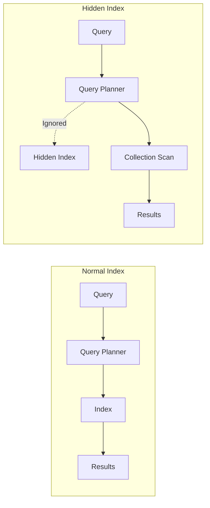
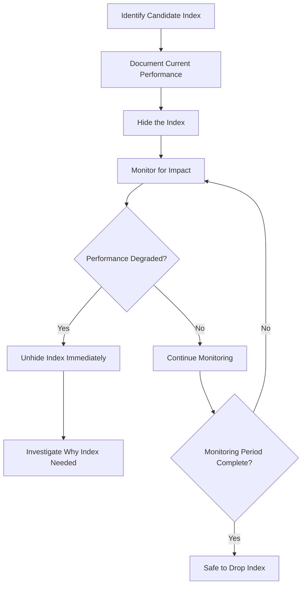
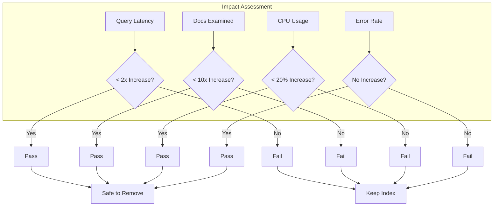
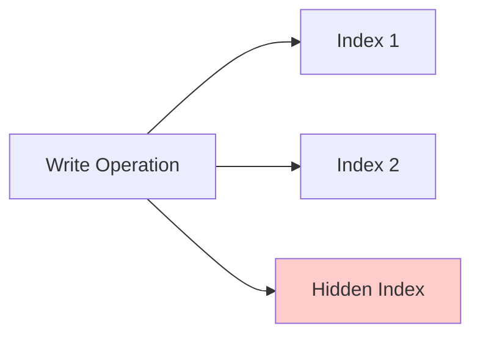
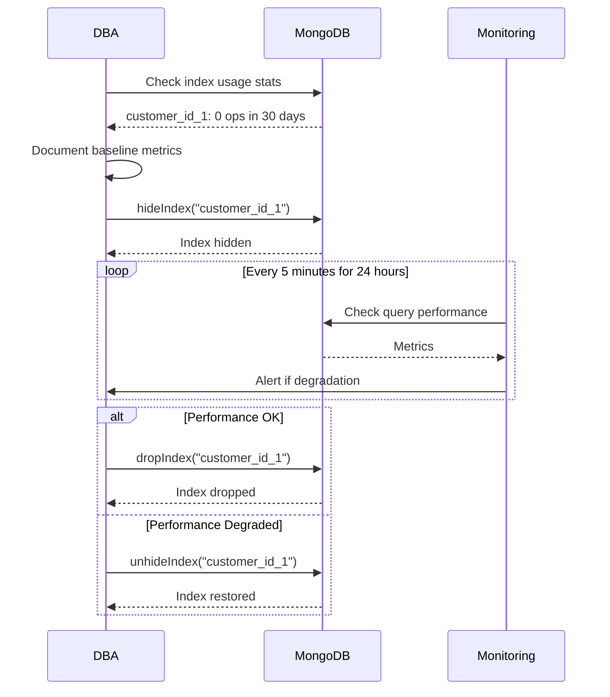

# How to Create MongoDB Hidden Index Testing

Author: [nawazdhandala](https://github.com/nawazdhandala)

Tags: MongoDB, Hidden Index, Index Testing, Performance

Description: Learn to implement hidden indexes for safe index testing and removal with impact analysis before dropping indexes in production.

---

Dropping an index in production is terrifying. You think it is unused, you run `dropIndex()`, and suddenly your most critical query goes from 10ms to 10 seconds. MongoDB hidden indexes solve this problem by letting you test the impact of removing an index without actually removing it.

## What Are Hidden Indexes?

Hidden indexes exist in the database but are invisible to the query planner. MongoDB still maintains them during write operations, but queries will not use them. This gives you a safe way to test what happens when an index is removed.



### Why Hidden Indexes Matter

- **Safe testing**: Verify index removal impact without committing to it
- **Reversible**: Unhide in seconds if performance degrades
- **Zero downtime**: No index rebuild required to restore functionality
- **Maintenance overhead**: Index is still updated on writes while hidden

## Prerequisites

Hidden indexes require MongoDB 4.4 or later. Check your version:

```javascript
db.version()
// "7.0.4"
```

## Hiding an Existing Index

The `hideIndex()` method makes an index invisible to the query planner.

```javascript
// First, identify your indexes
db.orders.getIndexes()

// Hide an index by name
db.orders.hideIndex("customer_id_1")

// Or hide by index specification
db.orders.hideIndex({ customer_id: 1 })
```

Verify the index is hidden:

```javascript
db.orders.getIndexes()
// Output shows: { "hidden": true } for the index
```

```json
{
  "v": 2,
  "key": { "customer_id": 1 },
  "name": "customer_id_1",
  "hidden": true
}
```

## Unhiding an Index

If you detect performance problems, restore the index instantly:

```javascript
// Unhide by name
db.orders.unhideIndex("customer_id_1")

// Or unhide by specification
db.orders.unhideIndex({ customer_id: 1 })
```

The index becomes active immediately - no rebuild needed.

## Creating a New Hidden Index

You can also create indexes as hidden from the start. This is useful for testing new indexes in production without affecting current query plans.

```javascript
// Create a hidden index
db.orders.createIndex(
  { status: 1, created_at: -1 },
  { hidden: true, name: "status_created_idx" }
)
```

This approach lets you:
1. Build the index (which takes time and resources)
2. Verify the index is built correctly
3. Unhide it when ready to use

## The Hidden Index Testing Workflow

Here is a systematic approach to safely test index removal:



### Step 1: Document Baseline Performance

Before hiding any index, capture your baseline metrics:

```javascript
// Get current query execution stats
db.orders.find({ customer_id: "cust_12345" }).explain("executionStats")
```

Record these key metrics:
- `executionTimeMillis`
- `totalDocsExamined`
- `totalKeysExamined`
- `nReturned`

### Step 2: Hide the Index

```javascript
db.orders.hideIndex("customer_id_1")
```

### Step 3: Run Impact Analysis

Execute the same query and compare:

```javascript
// Run the query again
const result = db.orders.find({ customer_id: "cust_12345" }).explain("executionStats")

// Check the execution stats
print("Execution time: " + result.executionStats.executionTimeMillis + "ms")
print("Docs examined: " + result.executionStats.totalDocsExamined)
print("Keys examined: " + result.executionStats.totalKeysExamined)
```

### Step 4: Monitor Production Impact

Watch these metrics during the testing period:

```javascript
// Check current operations for slow queries
db.currentOp({ "secs_running": { $gt: 1 } })

// Review the profiler for slow operations
db.setProfilingLevel(1, { slowms: 100 })
db.system.profile.find().sort({ ts: -1 }).limit(10)
```

## Query Plan Analysis

Understanding query plans is crucial for impact assessment.

### Before Hiding (Using Index)

```javascript
db.orders.find({ customer_id: "cust_12345" }).explain("executionStats")
```

```json
{
  "queryPlanner": {
    "winningPlan": {
      "stage": "FETCH",
      "inputStage": {
        "stage": "IXSCAN",
        "indexName": "customer_id_1",
        "direction": "forward"
      }
    }
  },
  "executionStats": {
    "executionTimeMillis": 2,
    "totalDocsExamined": 15,
    "totalKeysExamined": 15
  }
}
```

### After Hiding (Collection Scan)

```json
{
  "queryPlanner": {
    "winningPlan": {
      "stage": "COLLSCAN",
      "direction": "forward"
    }
  },
  "executionStats": {
    "executionTimeMillis": 2847,
    "totalDocsExamined": 1250000,
    "totalKeysExamined": 0
  }
}
```

The difference is dramatic - from 2ms examining 15 documents to 2847ms examining 1.25 million documents.

## Impact Assessment Framework

Use this framework to evaluate whether an index can be safely removed:



### Metrics to Track

| Metric | Acceptable Change | Action if Exceeded |
|--------|------------------|-------------------|
| P50 Latency | < 2x increase | Unhide immediately |
| P99 Latency | < 3x increase | Unhide immediately |
| Docs Examined | < 10x increase | Review query patterns |
| CPU Usage | < 20% increase | Monitor closely |
| Memory Usage | < 15% increase | Monitor closely |

## Automated Impact Testing Script

Here is a script to automate hidden index testing:

```javascript
// hidden-index-test.js
function testHiddenIndex(collection, indexName, testQueries, durationMinutes) {
    const db = collection.getDB();
    const collName = collection.getName();

    print("=== Starting Hidden Index Test ===");
    print("Collection: " + collName);
    print("Index: " + indexName);
    print("Duration: " + durationMinutes + " minutes");

    // Step 1: Capture baseline metrics
    print("\n--- Capturing Baseline ---");
    const baselineResults = [];

    testQueries.forEach((query, i) => {
        const explain = collection.find(query).explain("executionStats");
        baselineResults.push({
            query: query,
            timeMs: explain.executionStats.executionTimeMillis,
            docsExamined: explain.executionStats.totalDocsExamined,
            keysExamined: explain.executionStats.totalKeysExamined,
            stage: explain.queryPlanner.winningPlan.stage
        });
        print("Query " + i + ": " + explain.executionStats.executionTimeMillis + "ms");
    });

    // Step 2: Hide the index
    print("\n--- Hiding Index ---");
    collection.hideIndex(indexName);
    print("Index hidden: " + indexName);

    // Step 3: Run impact test
    print("\n--- Running Impact Test ---");
    const hiddenResults = [];

    testQueries.forEach((query, i) => {
        const explain = collection.find(query).explain("executionStats");
        hiddenResults.push({
            query: query,
            timeMs: explain.executionStats.executionTimeMillis,
            docsExamined: explain.executionStats.totalDocsExamined,
            keysExamined: explain.executionStats.totalKeysExamined,
            stage: explain.queryPlanner.winningPlan.stage
        });
        print("Query " + i + ": " + explain.executionStats.executionTimeMillis + "ms");
    });

    // Step 4: Generate report
    print("\n=== Impact Report ===");
    let safeToRemove = true;

    for (let i = 0; i < testQueries.length; i++) {
        const baseline = baselineResults[i];
        const hidden = hiddenResults[i];
        const timeIncrease = hidden.timeMs / Math.max(baseline.timeMs, 1);
        const docsIncrease = hidden.docsExamined / Math.max(baseline.docsExamined, 1);

        print("\nQuery " + i + ":");
        print("  Time: " + baseline.timeMs + "ms -> " + hidden.timeMs + "ms (" + timeIncrease.toFixed(1) + "x)");
        print("  Docs: " + baseline.docsExamined + " -> " + hidden.docsExamined + " (" + docsIncrease.toFixed(1) + "x)");
        print("  Stage: " + baseline.stage + " -> " + hidden.stage);

        if (timeIncrease > 2 || docsIncrease > 10) {
            print("  WARNING: Significant performance impact detected");
            safeToRemove = false;
        }
    }

    // Step 5: Decision
    print("\n=== Recommendation ===");
    if (safeToRemove) {
        print("Index appears safe to remove after extended monitoring.");
    } else {
        print("Index should be KEPT - significant performance impact detected.");
        print("Unhiding index now...");
        collection.unhideIndex(indexName);
        print("Index restored: " + indexName);
    }

    return {
        baseline: baselineResults,
        hidden: hiddenResults,
        safeToRemove: safeToRemove
    };
}

// Usage example
const testQueries = [
    { customer_id: "cust_12345" },
    { customer_id: "cust_67890", status: "pending" },
    { customer_id: { $in: ["cust_11111", "cust_22222", "cust_33333"] } }
];

testHiddenIndex(db.orders, "customer_id_1", testQueries, 30);
```

## Best Practices

### 1. Test During Representative Traffic

Hide indexes during normal business hours to capture real query patterns:

```javascript
// Schedule hide for peak hours
// Monday 10:00 AM - typical high traffic period
db.orders.hideIndex("customer_id_1")

// Monitor for at least 1 hour during peak
// Then unhide if issues detected
```

### 2. Use Monitoring Alerts

Set up alerts before hiding indexes:

```javascript
// Example: Create a monitoring query
function checkSlowQueries(thresholdMs) {
    const slowOps = db.currentOp({
        "secs_running": { $gt: thresholdMs / 1000 },
        "op": { $in: ["query", "getmore"] }
    });

    if (slowOps.inprog.length > 0) {
        print("WARNING: " + slowOps.inprog.length + " slow queries detected");
        return false;
    }
    return true;
}
```

### 3. Document Everything

Keep a log of your testing:

```javascript
// Insert test record
db.index_tests.insertOne({
    collection: "orders",
    index: "customer_id_1",
    hidden_at: new Date(),
    baseline_p50: 2,
    baseline_p99: 15,
    tester: "your-name",
    reason: "Suspected unused index from index stats",
    status: "in_progress"
});
```

### 4. Gradual Rollout for Sharded Clusters

On sharded clusters, test on one shard first:

```javascript
// Connect to primary of shard0
// Hide index only on this shard
db.orders.hideIndex("customer_id_1")

// Monitor shard0 specifically
// If successful, proceed to other shards
```

## Common Pitfalls

### Pitfall 1: Ignoring Compound Index Dependencies

Hiding a compound index affects all queries that use any prefix of it:

```javascript
// This compound index
db.orders.createIndex({ customer_id: 1, status: 1, created_at: -1 })

// Supports these queries:
// - { customer_id: "x" }
// - { customer_id: "x", status: "y" }
// - { customer_id: "x", status: "y", created_at: { $gt: date } }

// Hiding it breaks ALL of them
```

### Pitfall 2: Not Testing All Query Patterns

Index usage varies by query pattern. Test comprehensively:

```javascript
const allQueryPatterns = [
    // Equality
    { customer_id: "cust_12345" },

    // Range
    { customer_id: "cust_12345", created_at: { $gt: new Date("2024-01-01") } },

    // $in operator
    { customer_id: { $in: ["cust_1", "cust_2", "cust_3"] } },

    // Sort operations
    db.orders.find({ customer_id: "cust_12345" }).sort({ created_at: -1 }),

    // Aggregation pipelines
    db.orders.aggregate([
        { $match: { customer_id: "cust_12345" } },
        { $group: { _id: "$status", count: { $sum: 1 } } }
    ])
];
```

### Pitfall 3: Forgetting About Background Operations

Hidden indexes still impact write performance because MongoDB maintains them:



Consider this when evaluating whether to drop the index entirely.

## Integration with MongoDB Atlas

If you are using MongoDB Atlas, you can hide indexes through the UI or CLI:

```bash
# Using Atlas CLI
atlas clusters indexes update myCluster \
    --db myDatabase \
    --collection orders \
    --indexName customer_id_1 \
    --hidden true
```

Atlas also provides index suggestions and usage statistics:

```javascript
// Check index usage stats
db.orders.aggregate([{ $indexStats: {} }])
```

Output shows usage frequency:

```json
{
  "name": "customer_id_1",
  "accesses": {
    "ops": 0,
    "since": ISODate("2024-01-15T00:00:00Z")
  }
}
```

An index with zero operations since creation is a candidate for hiding and eventual removal.

## Complete Workflow Example

Here is a complete example putting it all together:



```javascript
// Step 1: Check if index is unused
const stats = db.orders.aggregate([{ $indexStats: {} }]).toArray();
const customerIdIndex = stats.find(s => s.name === "customer_id_1");
print("Index ops since restart: " + customerIdIndex.accesses.ops);

// Step 2: If unused, proceed with hidden test
if (customerIdIndex.accesses.ops === 0) {
    // Capture baseline
    const baseline = db.orders.find({ customer_id: "test" }).explain("executionStats");

    // Hide index
    db.orders.hideIndex("customer_id_1");

    // Wait and monitor (in production, this would be hours or days)
    print("Index hidden. Monitor for 24 hours before proceeding.");

    // After monitoring period with no issues:
    // db.orders.dropIndex("customer_id_1")
}
```

---

Hidden indexes transform risky index management into a safe, reversible process. Instead of guessing whether an index is needed, you can test in production with a safety net. Hide first, monitor carefully, and only drop when you have confidence. Your future self - and your on-call rotation - will thank you.
