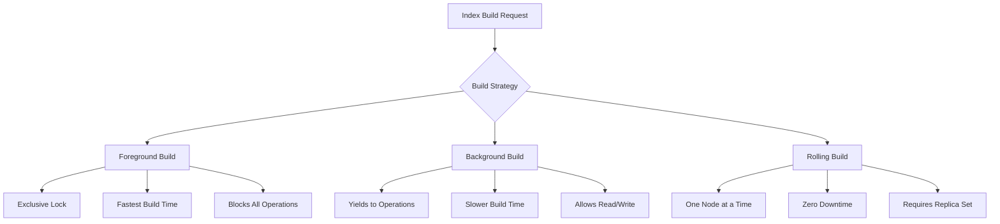
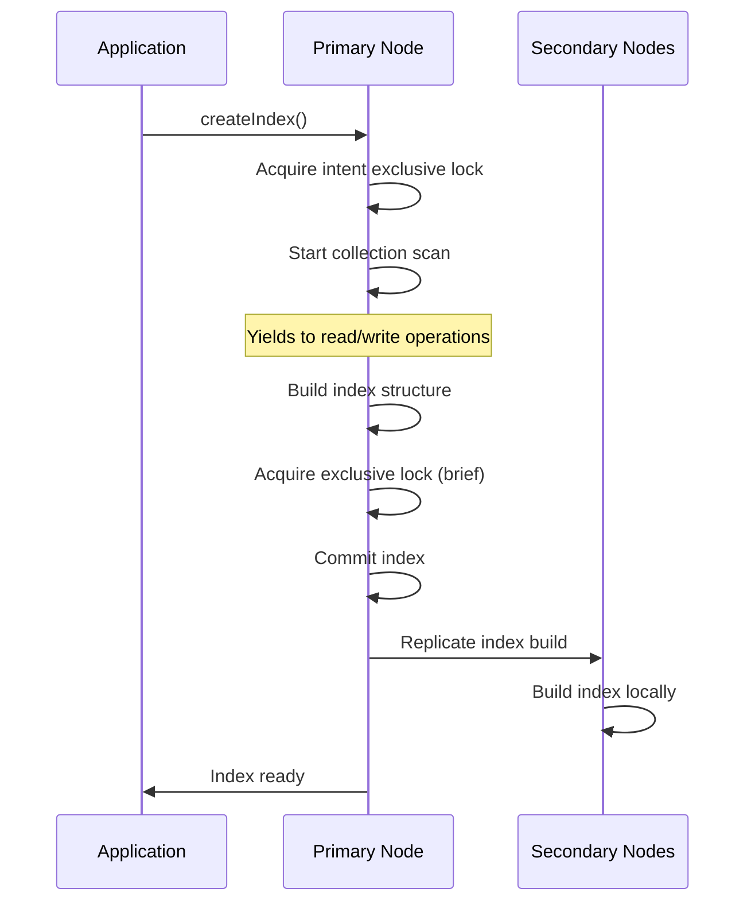
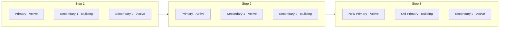
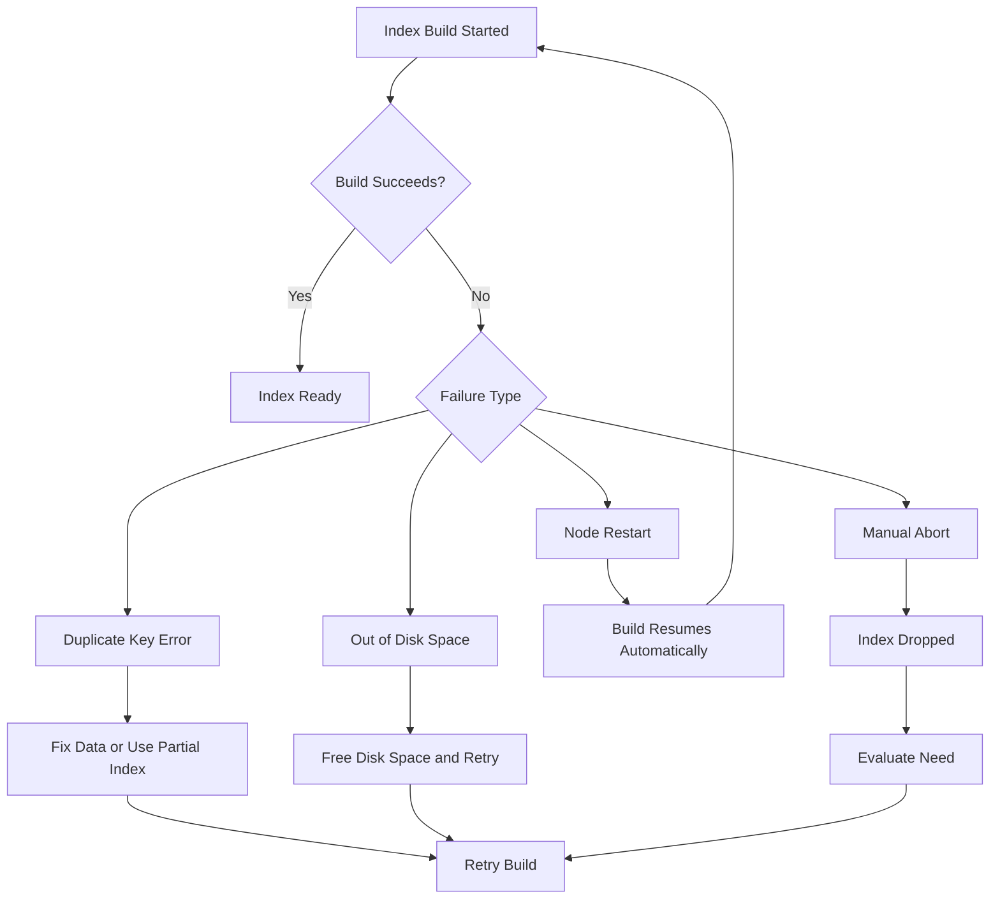

# How to Build MongoDB Index Build Strategies

Author: [nawazdhandala](https://github.com/nawazdhandala)

Tags: MongoDB, Index Building, Background Index, Performance

Description: Learn to implement index build strategies with background builds, rolling builds, and resource management for production environments.

---

Building indexes on MongoDB collections in production requires careful planning. A poorly executed index build can lock your database, consume excessive resources, and degrade application performance. This guide covers practical strategies for building indexes safely in production environments.

## Understanding Index Build Modes

MongoDB offers different approaches for building indexes, each with distinct trade-offs between build speed and system impact.



### Foreground vs Background Builds

Before MongoDB 4.2, you had to explicitly choose between foreground and background index builds. Starting with MongoDB 4.2, all index builds use an optimized process that holds an exclusive lock only at the beginning and end of the build.

Here is how index builds behave across MongoDB versions:

```javascript
// MongoDB 4.0 and earlier - explicit background option
db.orders.createIndex(
    { customerId: 1, orderDate: -1 },
    { background: true }  // Deprecated in 4.2+
);

// MongoDB 4.2+ - optimized build process (background option ignored)
db.orders.createIndex(
    { customerId: 1, orderDate: -1 }
);
```

The modern index build process works as follows:



## Resource Management for Index Builds

Index builds consume CPU, memory, and disk I/O. Controlling these resources prevents index builds from starving your application.

### Setting Memory Limits

Configure the maximum memory available for index builds:

```javascript
// Check current memory limit (in bytes)
db.adminCommand({ getParameter: 1, maxIndexBuildMemoryUsageMegabytes: 1 });

// Set memory limit to 500MB (requires admin privileges)
db.adminCommand({
    setParameter: 1,
    maxIndexBuildMemoryUsageMegabytes: 500
});
```

When the index build exceeds this memory limit, MongoDB spills data to temporary files on disk. This slows down the build but prevents memory exhaustion.

### Monitoring Resource Usage During Builds

Track index build progress and resource consumption:

```javascript
// Check current index build operations
db.currentOp({ "command.createIndexes": { $exists: true } });

// More detailed view of index build progress
db.adminCommand({
    currentOp: true,
    $or: [
        { op: "command", "command.createIndexes": { $exists: true } },
        { op: "none", "msg": /^Index Build/ }
    ]
});
```

Here is a script to monitor index build progress:

```javascript
function monitorIndexBuild(dbName, collectionName) {
    const checkInterval = 5000; // 5 seconds

    const interval = setInterval(() => {
        const ops = db.getSiblingDB("admin").aggregate([
            { $currentOp: { allUsers: true } },
            {
                $match: {
                    "command.createIndexes": collectionName,
                    "ns": `${dbName}.${collectionName}`
                }
            }
        ]).toArray();

        if (ops.length === 0) {
            print("Index build completed or not found");
            clearInterval(interval);
            return;
        }

        ops.forEach(op => {
            const progress = op.progress || {};
            const pct = progress.total ?
                ((progress.done / progress.total) * 100).toFixed(2) : "N/A";

            print(`Build progress: ${pct}%`);
            print(`Phase: ${op.msg || "Unknown"}`);
            print(`Duration: ${op.secs_running || 0} seconds`);
            print("---");
        });
    }, checkInterval);

    return interval;
}

// Usage
const monitor = monitorIndexBuild("myDatabase", "orders");
// To stop monitoring: clearInterval(monitor);
```

## Rolling Index Builds for Replica Sets

Rolling builds minimize production impact by building indexes one replica set member at a time.



### Rolling Build Procedure

Follow these steps for a rolling index build:

**Step 1: Build on each secondary**

```bash
# Connect to a secondary node
mongosh --host secondary1.example.com:27017

# In the mongo shell
rs.status()  // Verify this is a secondary

// Create the index - this only affects this node
db.orders.createIndex(
    { customerId: 1, orderDate: -1 },
    { name: "idx_customer_date" }
);
```

**Step 2: Wait for build completion**

```javascript
// Monitor build progress on the secondary
db.currentOp({ "command.createIndexes": "orders" });

// Verify index exists
db.orders.getIndexes();
```

**Step 3: Repeat for remaining secondaries**

Before moving to the next secondary, ensure the current one has caught up with replication:

```javascript
// Check replication lag
rs.printSecondaryReplicationInfo();
```

**Step 4: Step down the primary and build on it**

```javascript
// On the primary
rs.stepDown(300);  // Step down for 5 minutes

// After stepdown, this node becomes a secondary
// Create the index
db.orders.createIndex(
    { customerId: 1, orderDate: -1 },
    { name: "idx_customer_date" }
);
```

### Automated Rolling Build Script

Here is a more complete script for automated rolling builds:

```javascript
async function rollingIndexBuild(indexSpec, indexOptions, dbName, collName) {
    const db = connect("mongodb://localhost:27017/admin");

    // Get replica set configuration
    const rsConfig = db.adminCommand({ replSetGetConfig: 1 }).config;
    const members = rsConfig.members;

    // Separate secondaries and primary
    const rsStatus = db.adminCommand({ replSetGetStatus: 1 });
    const primary = rsStatus.members.find(m => m.stateStr === "PRIMARY");
    const secondaries = rsStatus.members.filter(m => m.stateStr === "SECONDARY");

    print(`Primary: ${primary.name}`);
    print(`Secondaries: ${secondaries.map(s => s.name).join(", ")}`);

    // Build on each secondary first
    for (const secondary of secondaries) {
        print(`\nBuilding index on secondary: ${secondary.name}`);

        const conn = new Mongo(secondary.name);
        const targetDb = conn.getDB(dbName);

        // Create index
        const result = targetDb.getCollection(collName).createIndex(
            indexSpec,
            indexOptions
        );

        print(`Result: ${JSON.stringify(result)}`);

        // Wait for replication to catch up
        print("Waiting for replication to catch up...");
        sleep(5000);
    }

    // Step down primary and build
    print(`\nStepping down primary: ${primary.name}`);

    try {
        db.adminCommand({ replSetStepDown: 300 });
    } catch (e) {
        // Expected - connection closes during stepdown
        print("Stepdown initiated");
    }

    // Wait for new primary election
    sleep(10000);

    // Connect to old primary (now secondary) and build
    const oldPrimaryConn = new Mongo(primary.name);
    const oldPrimaryDb = oldPrimaryConn.getDB(dbName);

    print(`Building index on old primary: ${primary.name}`);
    const finalResult = oldPrimaryDb.getCollection(collName).createIndex(
        indexSpec,
        indexOptions
    );

    print(`Final result: ${JSON.stringify(finalResult)}`);
    print("\nRolling index build complete!");
}

// Usage
rollingIndexBuild(
    { customerId: 1, orderDate: -1 },
    { name: "idx_customer_date" },
    "ecommerce",
    "orders"
);
```

## Handling Build Failures

Index builds can fail due to various reasons. Here is how to handle common scenarios:



### Aborting a Running Index Build

If an index build is causing problems, you can abort it:

```javascript
// Find the operation ID
const ops = db.currentOp({ "command.createIndexes": { $exists: true } });
const opId = ops.inprog[0].opid;

// Kill the operation
db.killOp(opId);

// Or use the dropIndexes command with the index name
db.orders.dropIndex("idx_customer_date");
```

### Handling Duplicate Key Errors

When creating a unique index on data with duplicates:

```javascript
// Find duplicates first
db.orders.aggregate([
    { $group: {
        _id: "$email",
        count: { $sum: 1 },
        docs: { $push: "$_id" }
    }},
    { $match: { count: { $gt: 1 } }}
]);

// Option 1: Clean up duplicates
db.orders.deleteMany({
    _id: { $in: duplicateIds }
});

// Option 2: Use a partial index to exclude duplicates
db.orders.createIndex(
    { email: 1 },
    {
        unique: true,
        partialFilterExpression: {
            email: { $exists: true, $ne: null }
        }
    }
);
```

## Best Practices for Production Index Builds

### Pre-Build Checklist

```javascript
// 1. Check collection size and document count
db.orders.stats();

// 2. Estimate index size
const avgDocSize = db.orders.stats().avgObjSize;
const docCount = db.orders.countDocuments();
const estimatedIndexSize = docCount * 50; // rough estimate for single field
print(`Estimated index size: ${(estimatedIndexSize / 1024 / 1024).toFixed(2)} MB`);

// 3. Check available disk space
db.adminCommand({ dbStats: 1 });

// 4. Check current index build memory setting
db.adminCommand({ getParameter: 1, maxIndexBuildMemoryUsageMegabytes: 1 });

// 5. Review existing indexes to avoid redundancy
db.orders.getIndexes();
```

### Timing Your Index Builds

Schedule index builds during low-traffic periods:

```javascript
// Check operation patterns
db.orders.aggregate([
    { $collStats: { latencyStats: { histograms: true } } }
]);

// Monitor real-time operations
db.currentOp({ active: true });
```

### Index Build Configuration Summary

| Factor | Recommendation |
|--------|----------------|
| Collection Size | Under 10GB - Direct build; Over 10GB - Consider rolling build |
| Traffic Level | High traffic - Rolling build or maintenance window |
| Replica Set | Always use rolling builds in production |
| Sharded Cluster | Build on each shard independently |
| Memory Limit | Set to 10-20% of available RAM |
| Disk Space | Ensure 2x index size available for temp files |

## Monitoring and Alerting

Set up monitoring for index build operations:

```javascript
// Create a function to check for long-running index builds
function checkLongRunningIndexBuilds(thresholdSeconds) {
    const builds = db.adminCommand({
        currentOp: true,
        $or: [
            { "command.createIndexes": { $exists: true } },
            { "msg": /^Index Build/ }
        ]
    });

    const longRunning = builds.inprog.filter(
        op => op.secs_running > thresholdSeconds
    );

    if (longRunning.length > 0) {
        longRunning.forEach(op => {
            print(`WARNING: Long-running index build detected`);
            print(`  Collection: ${op.ns}`);
            print(`  Duration: ${op.secs_running} seconds`);
            print(`  Progress: ${JSON.stringify(op.progress || {})}`);
        });
        return true;
    }

    return false;
}

// Check for builds running longer than 1 hour
checkLongRunningIndexBuilds(3600);
```

## Conclusion

Building indexes in production MongoDB deployments requires balancing build speed against system impact. Key takeaways:

1. **Use rolling builds** for replica sets to maintain availability
2. **Configure memory limits** to prevent resource exhaustion
3. **Monitor build progress** and resource usage throughout the process
4. **Plan for failures** with proper error handling and recovery procedures
5. **Schedule strategically** during low-traffic periods when possible

By following these strategies, you can build indexes safely without disrupting your production workloads.
