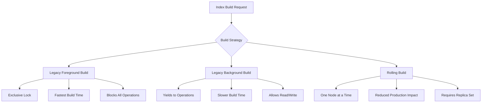
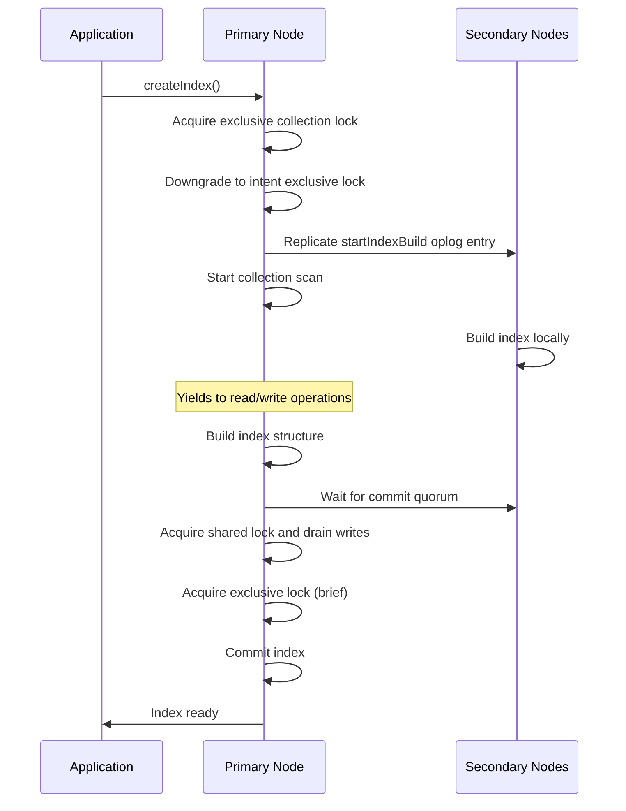
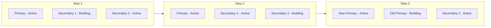
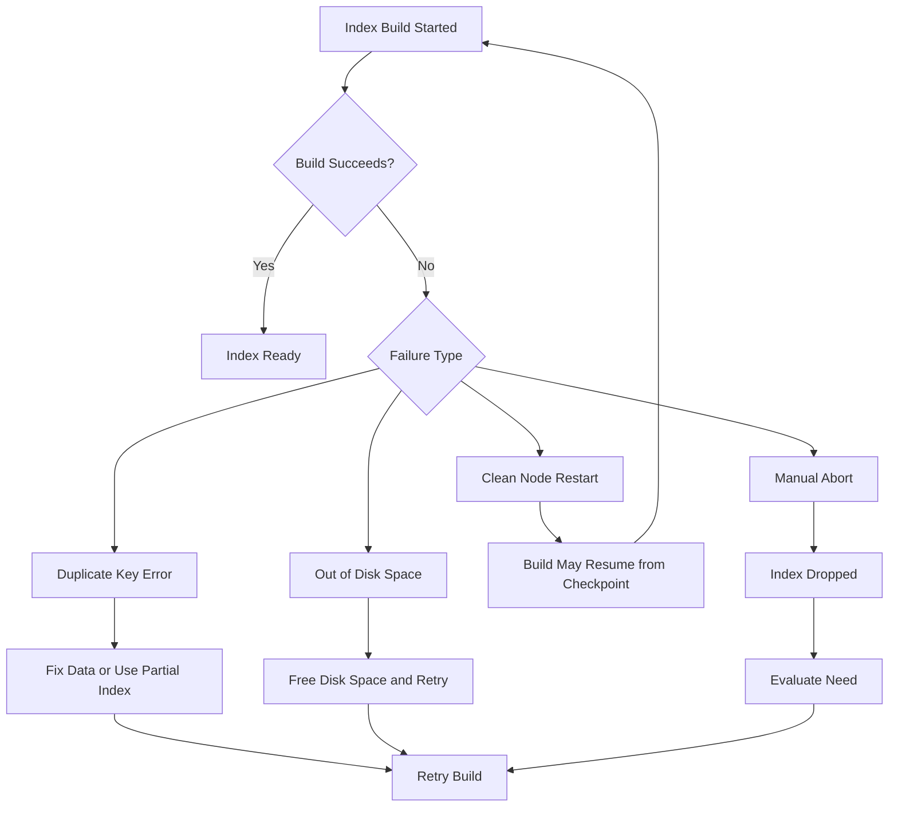

# How to Build MongoDB Index Build Strategies

Author: [nawazdhandala](https://github.com/nawazdhandala)

Tags: MongoDB, Index Building, Background Index, Performance

Description: Learn to implement index build strategies with background builds, rolling builds, and resource management for production environments.

---

Building indexes on MongoDB collections in production requires careful planning. A poorly executed index build can block collection operations, consume excessive resources, and degrade application performance. This guide covers practical strategies for building indexes safely in production environments.

## Understanding Index Build Modes

MongoDB has legacy foreground and background index build behavior, and modern operational strategies such as default replicated builds and rolling builds. Each approach has distinct trade-offs between build speed and system impact.


```mermaid
flowchart TD
    A[Index Build Request] --> B{Build Strategy}
    B --> C[Legacy Foreground Build]
    B --> D[Legacy Background Build]
    B --> E[Rolling Build]

    C --> F[Exclusive Lock]
    C --> G[Fastest Build Time]
    C --> H[Blocks All Operations]

    D --> I[Yields to Operations]
    D --> J[Slower Build Time]
    D --> K[Allows Read/Write]

    E --> L[One Node at a Time]
    E --> M[Reduced Production Impact]
    E --> N[Requires Replica Set]
```

### Foreground vs Background Builds

Before MongoDB 4.2, you had to explicitly choose between foreground and background index builds. Starting with MongoDB 4.2, all index builds use an optimized process that holds an exclusive collection lock only at the beginning and end of the build and permits interleaving reads and writes during most of the build.

Here is how index builds behave across MongoDB versions:

```javascript
// MongoDB 4.0 and earlier - explicit background option
db.orders.createIndex(
    { customerId: 1, orderDate: -1 },
    { background: true }  // Deprecated in 4.2+
);

// MongoDB 4.2+ - optimized build process
db.orders.createIndex(
    { customerId: 1, orderDate: -1 }
);
```

The modern index build process works as follows:


```mermaid
sequenceDiagram
    participant App as Application
    participant Primary as Primary Node
    participant Secondary as Secondary Nodes

    App->>Primary: createIndex()
    Primary->>Primary: Acquire exclusive collection lock
    Primary->>Primary: Downgrade to intent exclusive lock
    Primary->>Secondary: Replicate startIndexBuild oplog entry
    Primary->>Primary: Start collection scan
    Secondary->>Secondary: Build index locally
    Note over Primary: Yields to read/write operations
    Primary->>Primary: Build index structure
    Primary->>Secondary: Wait for commit quorum
    Primary->>Primary: Acquire shared lock and drain writes
    Primary->>Primary: Acquire exclusive lock (brief)
    Primary->>Primary: Commit index
    Primary->>App: Index ready
```

## Resource Management for Index Builds

Index builds consume CPU, memory, and disk I/O. Controlling these resources prevents index builds from starving your application.

### Setting Memory Limits

Configure the maximum memory available for index builds:

```javascript
// Check current memory limit (in megabytes)
db.adminCommand({ getParameter: 1, maxIndexBuildMemoryUsageMegabytes: 1 });

// Set memory limit to 500MB (requires admin privileges)
db.adminCommand({
    setParameter: 1,
    maxIndexBuildMemoryUsageMegabytes: 500
});
```

When the index build exceeds this memory limit, MongoDB spills data to temporary files on disk. This slows down the build but prevents memory exhaustion.

### Monitoring Resource Usage During Builds

Track index build progress and resource consumption:

```javascript
// Check current index build operations
db.getSiblingDB("admin").aggregate([
    { $currentOp: { idleConnections: true, allUsers: true } },
    {
        $match: {
            $or: [
                { op: "command", "command.createIndexes": { $exists: true } },
                { op: "none", msg: /^Index Build/ }
            ]
        }
    }
]);
```

Here is a script to monitor index build progress:

```javascript
function monitorIndexBuild(dbName, collectionName) {
    const checkInterval = 5000; // 5 seconds

    const interval = setInterval(() => {
        const ops = db.getSiblingDB("admin").aggregate([
            { $currentOp: { idleConnections: true, allUsers: true } },
            {
                $match: {
                    "command.createIndexes": collectionName,
                    "ns": `${dbName}.${collectionName}`
                }
            }
        ]).toArray();

        if (ops.length === 0) {
            print("Index build completed or not found");
            clearInterval(interval);
            return;
        }

        ops.forEach(op => {
            const progress = op.progress || {};
            const pct = progress.total ?
                ((progress.done / progress.total) * 100).toFixed(2) : "N/A";

            print(`Build progress: ${pct}%`);
            print(`Phase: ${op.msg || "Unknown"}`);
            print(`Duration: ${op.secs_running || 0} seconds`);
            print("---");
        });
    }, checkInterval);

    return interval;
}

// Usage
const monitor = monitorIndexBuild("myDatabase", "orders");
// To stop monitoring: clearInterval(monitor);
```

## Rolling Index Builds for Replica Sets

Rolling builds minimize production impact by taking one replica set member out at a time and building the index on that member as a standalone.


```mermaid
flowchart LR
    subgraph Step1[Step 1]
        S1A[Primary - Active]
        S1B[Secondary 1 - Building]
        S1C[Secondary 2 - Active]
    end

    subgraph Step2[Step 2]
        S2A[Primary - Active]
        S2B[Secondary 1 - Active]
        S2C[Secondary 2 - Building]
    end

    subgraph Step3[Step 3]
        S3A[New Primary - Active]
        S3B[Old Primary - Building]
        S3C[Secondary 2 - Active]
    end

    Step1 --> Step2 --> Step3
```

### Rolling Build Procedure

Follow these steps for a rolling index build:

**Step 1: Build on each secondary**

```bash
# Stop a secondary, then restart it as a standalone on a different port.
# Omit --replSet and keep the same dbPath.
mongod --port 27217 \
  --dbpath /var/lib/mongodb \
  --bind_ip localhost,secondary1.example.com \
  --setParameter disableLogicalSessionCacheRefresh=true

# Connect directly to the standalone and build the index.
mongosh --host secondary1.example.com:27217
```

```javascript
db.orders.createIndex(
    { customerId: 1, orderDate: -1 },
    { name: "idx_customer_date" }
);
```

**Step 2: Wait for build completion**

```javascript
// Monitor build progress on the standalone
db.getSiblingDB("admin").aggregate([
    { $currentOp: { idleConnections: true, allUsers: true } },
    { $match: { "command.createIndexes": "orders" } }
]);

// Verify index exists
db.orders.getIndexes();
```

After the build completes, shut down the standalone and restart it as a replica set member using its original port and replica set configuration.

**Step 3: Repeat for remaining secondaries**

Before moving to the next secondary, ensure the current one has caught up with replication:

```javascript
// Check replication lag after the member rejoins the replica set
rs.printSecondaryReplicationInfo();
```

**Step 4: Step down the primary and build on it**

```javascript
// On the primary
rs.stepDown(300);  // Step down for 5 minutes

// After stepdown, restart the old primary as a standalone on a different port,
// then connect directly to the standalone and create the index
db.orders.createIndex(
    { customerId: 1, orderDate: -1 },
    { name: "idx_customer_date" }
);
```

### Rolling Build Command Checklist

Rolling builds require process control outside of `mongosh` because each member must be stopped and restarted as a standalone. Here is a checklist-style helper that prints the commands to run for each member:

```javascript
function printRollingIndexBuildPlan(indexSpec, indexOptions, dbName, collName) {
    const db = connect("mongodb://localhost:27017/admin");

    // Get replica set configuration
    const rsStatus = db.adminCommand({ replSetGetStatus: 1 });
    const primary = rsStatus.members.find(m => m.stateStr === "PRIMARY");
    const secondaries = rsStatus.members.filter(m => m.stateStr === "SECONDARY");

    print(`Primary: ${primary.name}`);
    print(`Secondaries: ${secondaries.map(s => s.name).join(", ")}`);

    const members = [...secondaries, primary];

    members.forEach((member, i) => {
        print(`\nStep ${i + 1}: ${member.name}`);
        if (member.stateStr === "PRIMARY") {
            print("1. Run rs.stepDown(300) on the current primary first.");
        }
        print("2. Stop this mongod process.");
        print("3. Restart it as a standalone on a different port:");
        print("   mongod --port 27217 --dbpath <same-dbpath> --bind_ip localhost,<host> --setParameter disableLogicalSessionCacheRefresh=true");
        print("4. Connect directly to the standalone:");
        print("   mongosh --host <host>:27217");
        print("5. Build the index:");
        print(`   db.getSiblingDB("${dbName}").getCollection("${collName}").createIndex(`);
        print(`       ${JSON.stringify(indexSpec)},`);
        print(`       ${JSON.stringify(indexOptions)}`);
        print("   );");
        print("6. Restart the node with its original replica set configuration.");
        print("7. Wait for replication to catch up before moving to the next member.");
    });

    print("\nFor unique indexes, stop writes to the collection during the entire rolling build.");
}

// Usage
printRollingIndexBuildPlan(
    { customerId: 1, orderDate: -1 },
    { name: "idx_customer_date" },
    "ecommerce",
    "orders"
);
```

For a standard replicated index build, run `createIndex()` on the primary and let MongoDB coordinate the build across the replica set:

```javascript
db.orders.createIndex(
    { customerId: 1, orderDate: -1 },
    { name: "idx_customer_date" }
);
```

## Handling Build Failures

Index builds can fail due to various reasons. Here is how to handle common scenarios:


```mermaid
flowchart TD
    A[Index Build Started] --> B{Build Succeeds?}
    B -->|Yes| C[Index Ready]
    B -->|No| D{Failure Type}

    D --> E[Duplicate Key Error]
    D --> F[Out of Disk Space]
    D --> G[Clean Node Restart]
    D --> H[Manual Abort]

    E --> I[Fix Data or Use Partial Index]
    F --> J[Free Disk Space and Retry]
    G --> K[Build May Resume from Checkpoint]
    H --> L[Index Dropped]

    I --> M[Retry Build]
    J --> M
    K --> A
    L --> N[Evaluate Need]
    N --> M
```

### Aborting a Running Index Build

If an index build is causing problems, you can abort it with `dropIndex()` or `dropIndexes()`:

```javascript
// Stop an in-progress build by dropping the index being built
db.orders.dropIndex("idx_customer_date");

// Or stop all in-progress index builds on the collection
db.orders.dropIndexes();
```

### Handling Duplicate Key Errors

When creating a unique index on data with duplicates:

```javascript
// Find duplicates first
db.orders.aggregate([
    { $group: {
        _id: "$email",
        count: { $sum: 1 },
        docs: { $push: "$_id" }
    }},
    { $match: { count: { $gt: 1 } }}
]);

// Option 1: Clean up duplicates
db.orders.deleteMany({
    _id: { $in: duplicateIds }
});

// Option 2: Use a partial unique index to exclude missing and null emails
db.orders.createIndex(
    { email: 1 },
    {
        unique: true,
        partialFilterExpression: {
            email: { $type: "string" }
        }
    }
);
```

## Best Practices for Production Index Builds

### Pre-Build Checklist

```javascript
// 1. Check collection size and document count
db.orders.stats();

// 2. Estimate index size
const avgDocSize = db.orders.stats().avgObjSize;
const docCount = db.orders.countDocuments();
const estimatedIndexSize = docCount * 50; // rough estimate for single field
print(`Estimated index size: ${(estimatedIndexSize / 1024 / 1024).toFixed(2)} MB`);

// 3. Check database storage statistics
db.stats();

// 4. Check current index build memory setting
db.adminCommand({ getParameter: 1, maxIndexBuildMemoryUsageMegabytes: 1 });

// 5. Review existing indexes to avoid redundancy
db.orders.getIndexes();
```

### Timing Your Index Builds

Schedule index builds during low-traffic periods:

```javascript
// Check operation patterns
db.orders.aggregate([
    { $collStats: { latencyStats: { histograms: true } } }
]);

// Monitor real-time operations
db.getSiblingDB("admin").aggregate([
    { $currentOp: { allUsers: true } },
    { $match: { active: true } }
]);
```

### Index Build Configuration Summary

| Factor | Recommendation |
|--------|----------------|
| Collection Size | Under 10GB - Direct build; Over 10GB - Consider rolling build |
| Traffic Level | High traffic - Rolling build or maintenance window |
| Replica Set | Prefer normal replicated builds; use rolling builds only when the production impact justifies the operational risk |
| Sharded Cluster | Use the rolling index build procedure for sharded clusters when building one shard at a time |
| Memory Limit | Keep the default unless you have measured pressure or very large/many concurrent builds |
| Disk Space | Ensure 2x index size available for temp files |

## Monitoring and Alerting

Set up monitoring for index build operations:

```javascript
// Create a function to check for long-running index builds
function checkLongRunningIndexBuilds(thresholdSeconds) {
    const builds = db.getSiblingDB("admin").aggregate([
        { $currentOp: { idleConnections: true, allUsers: true } },
        {
            $match: {
                $or: [
                    { "command.createIndexes": { $exists: true } },
                    { msg: /^Index Build/ }
                ]
            }
        }
    ]).toArray();

    const longRunning = builds.filter(
        op => op.secs_running > thresholdSeconds
    );

    if (longRunning.length > 0) {
        longRunning.forEach(op => {
            print(`WARNING: Long-running index build detected`);
            print(`  Collection: ${op.ns}`);
            print(`  Duration: ${op.secs_running} seconds`);
            print(`  Progress: ${JSON.stringify(op.progress || {})}`);
        });
        return true;
    }

    return false;
}

// Check for builds running longer than 1 hour
checkLongRunningIndexBuilds(3600);
```

## Conclusion

Building indexes in production MongoDB deployments requires balancing build speed against system impact. Key takeaways:

1. **Use rolling builds selectively** for replica sets when the reduced build impact is worth the operational complexity
2. **Configure memory limits** to prevent resource exhaustion
3. **Monitor build progress** and resource usage throughout the process
4. **Plan for failures** with proper error handling and recovery procedures
5. **Schedule strategically** during low-traffic periods when possible

By following these strategies, you can build indexes safely without disrupting your production workloads.
