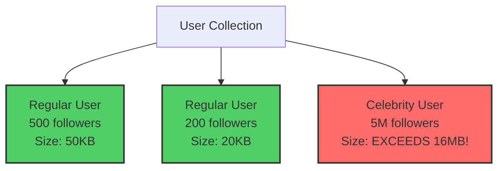
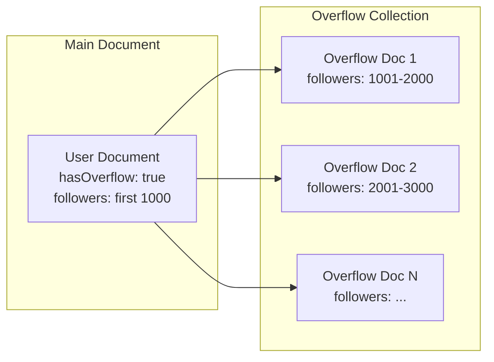
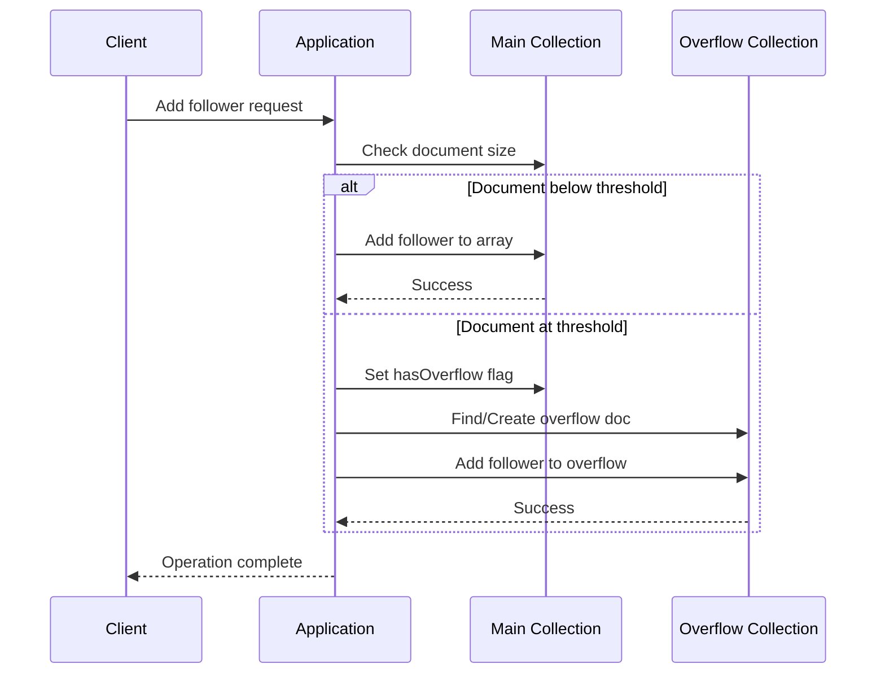
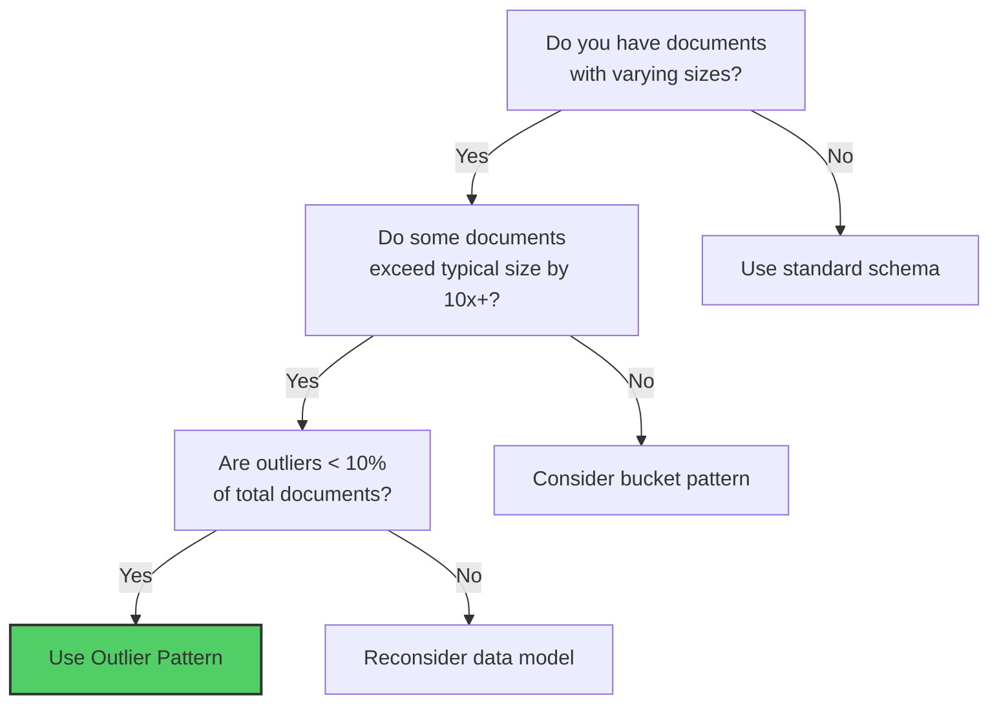

# How to Create MongoDB Outlier Patterns

Author: [nawazdhandala](https://github.com/nawazdhandala)

Tags: MongoDB, Outlier Pattern, Schema Design, Exception Handling

Description: Learn to implement outlier patterns for handling documents with exceptional data sizes using overflow documents and linking strategies.

---

## Introduction

When designing MongoDB schemas, most documents follow a predictable pattern. However, some documents can grow significantly larger than others - these are called outliers. The Outlier Pattern helps you handle these exceptional cases without degrading performance for the majority of your data.

Consider a social media platform where most users have a few hundred followers, but celebrities might have millions. Storing all followers in a single document would hit MongoDB's 16MB document size limit and cause performance issues for queries.

## Understanding the Problem

Let's visualize a typical scenario where outliers cause problems:



## The Outlier Pattern Solution

The Outlier Pattern involves:
1. Flagging documents that exceed a threshold
2. Moving excess data to overflow documents
3. Linking overflow documents to the parent



## Implementation

### Step 1: Define Your Schema with Outlier Flag

First, design your schema with an outlier flag and a threshold:

```javascript
// User schema with outlier pattern support
const userSchema = {
  _id: ObjectId,
  username: String,
  email: String,
  followers: [ObjectId],        // Array with limited size
  followerCount: Number,        // Total count including overflow
  hasOverflow: Boolean,         // Flag indicating overflow exists
  overflowCount: Number         // Number of overflow documents
};

// Overflow schema for excess followers
const followerOverflowSchema = {
  _id: ObjectId,
  userId: ObjectId,             // Reference to parent user
  batchNumber: Number,          // Sequential batch number
  followers: [ObjectId],        // Overflow followers
  createdAt: Date
};
```

### Step 2: Create the Insert Function with Threshold Detection

```javascript
const FOLLOWER_THRESHOLD = 1000;  // Max followers in main document
const BATCH_SIZE = 1000;          // Followers per overflow document

async function addFollower(userId, followerId) {
  const user = await db.users.findOne({ _id: userId });

  if (!user) {
    throw new Error('User not found');
  }

  // Check if main document can accommodate more followers
  if (user.followers.length < FOLLOWER_THRESHOLD) {
    // Add to main document
    await db.users.updateOne(
      { _id: userId },
      {
        $push: { followers: followerId },
        $inc: { followerCount: 1 }
      }
    );
  } else {
    // Document is at threshold - use overflow
    await handleOverflow(userId, followerId, user);
  }
}

async function handleOverflow(userId, followerId, user) {
  // Find or create overflow document
  const currentBatch = Math.ceil(
    (user.followerCount - FOLLOWER_THRESHOLD + 1) / BATCH_SIZE
  );

  const overflow = await db.followerOverflow.findOne({
    userId: userId,
    batchNumber: currentBatch
  });

  if (!overflow || overflow.followers.length >= BATCH_SIZE) {
    // Create new overflow document
    const newBatch = overflow ? currentBatch + 1 : currentBatch;

    await db.followerOverflow.insertOne({
      userId: userId,
      batchNumber: newBatch,
      followers: [followerId],
      createdAt: new Date()
    });

    // Update main document flags
    await db.users.updateOne(
      { _id: userId },
      {
        $set: { hasOverflow: true },
        $inc: {
          followerCount: 1,
          overflowCount: overflow ? 0 : 1
        }
      }
    );
  } else {
    // Add to existing overflow document
    await db.followerOverflow.updateOne(
      { userId: userId, batchNumber: currentBatch },
      { $push: { followers: followerId } }
    );

    await db.users.updateOne(
      { _id: userId },
      { $inc: { followerCount: 1 } }
    );
  }
}
```

### Step 3: Query Strategies for Outlier Documents

When querying, you need to handle both regular and outlier documents:

```javascript
async function getAllFollowers(userId) {
  const user = await db.users.findOne({ _id: userId });

  if (!user) {
    return [];
  }

  // Start with followers from main document
  let allFollowers = [...user.followers];

  // Check if we need to fetch overflow documents
  if (user.hasOverflow) {
    const overflowDocs = await db.followerOverflow
      .find({ userId: userId })
      .sort({ batchNumber: 1 })
      .toArray();

    for (const doc of overflowDocs) {
      allFollowers = allFollowers.concat(doc.followers);
    }
  }

  return allFollowers;
}

// Paginated query for large follower lists
async function getFollowersPaginated(userId, page, pageSize) {
  const user = await db.users.findOne({ _id: userId });
  const skip = page * pageSize;

  // If within main document range
  if (skip + pageSize <= user.followers.length) {
    return user.followers.slice(skip, skip + pageSize);
  }

  // Need to query overflow documents
  if (!user.hasOverflow) {
    return user.followers.slice(skip, skip + pageSize);
  }

  // Calculate which batch contains our page
  const overflowSkip = Math.max(0, skip - FOLLOWER_THRESHOLD);
  const batchNumber = Math.floor(overflowSkip / BATCH_SIZE) + 1;

  const overflow = await db.followerOverflow.findOne({
    userId: userId,
    batchNumber: batchNumber
  });

  if (!overflow) {
    return [];
  }

  const localSkip = overflowSkip % BATCH_SIZE;
  return overflow.followers.slice(localSkip, localSkip + pageSize);
}
```

## Architecture Overview

Here is the complete flow for handling outlier documents:



## Detecting Existing Outliers

For existing data, you can identify and migrate outliers:

```javascript
async function detectAndMigrateOutliers() {
  // Find documents that exceed the threshold
  const outliers = await db.users.find({
    $expr: { $gt: [{ $size: "$followers" }, FOLLOWER_THRESHOLD] }
  }).toArray();

  console.log(`Found ${outliers.length} outlier documents`);

  for (const user of outliers) {
    await migrateToOverflow(user);
  }
}

async function migrateToOverflow(user) {
  const excessFollowers = user.followers.slice(FOLLOWER_THRESHOLD);
  const batches = [];

  // Split excess followers into batches
  for (let i = 0; i < excessFollowers.length; i += BATCH_SIZE) {
    batches.push(excessFollowers.slice(i, i + BATCH_SIZE));
  }

  // Create overflow documents
  const overflowDocs = batches.map((batch, index) => ({
    userId: user._id,
    batchNumber: index + 1,
    followers: batch,
    createdAt: new Date()
  }));

  if (overflowDocs.length > 0) {
    await db.followerOverflow.insertMany(overflowDocs);
  }

  // Update main document
  await db.users.updateOne(
    { _id: user._id },
    {
      $set: {
        followers: user.followers.slice(0, FOLLOWER_THRESHOLD),
        hasOverflow: true,
        overflowCount: overflowDocs.length
      }
    }
  );

  console.log(`Migrated user ${user._id}: ${overflowDocs.length} overflow docs created`);
}
```

## Indexing Strategy

Proper indexing is critical for outlier pattern performance:

```javascript
// Index on main collection for overflow queries
db.users.createIndex({ hasOverflow: 1 });

// Compound index on overflow collection
db.followerOverflow.createIndex(
  { userId: 1, batchNumber: 1 },
  { unique: true }
);

// Index for cleanup and maintenance queries
db.followerOverflow.createIndex({ createdAt: 1 });
```

## When to Use the Outlier Pattern



## Best Practices

1. **Choose appropriate thresholds** - Set thresholds based on your document size limits and query patterns. Consider both the 16MB document limit and working set memory.

2. **Monitor overflow growth** - Track the number of overflow documents per parent to identify potential issues early.

3. **Batch size optimization** - Balance between too many small overflow documents (more queries) and too few large ones (approaching size limits).

4. **Use projections** - When querying, only retrieve the fields you need:

```javascript
// Efficient query - only fetch needed fields
const user = await db.users.findOne(
  { _id: userId },
  { projection: { username: 1, followerCount: 1, hasOverflow: 1 } }
);
```

5. **Consider read vs write patterns** - If reads are more frequent than writes, pre-compute counts and summary data.

## Conclusion

The Outlier Pattern is a powerful technique for handling exceptional documents in MongoDB without compromising performance for the majority of your data. By flagging outliers, using overflow documents, and implementing smart query strategies, you can build schemas that scale gracefully from typical to extreme cases.

Key takeaways:
- Flag documents that exceed thresholds with a boolean field
- Store excess data in linked overflow documents
- Query both main and overflow collections when the flag is set
- Use proper indexing on both collections
- Monitor and maintain overflow documents regularly

This pattern works especially well when outliers represent a small percentage of your total documents but would otherwise cause significant performance issues if handled uniformly.
