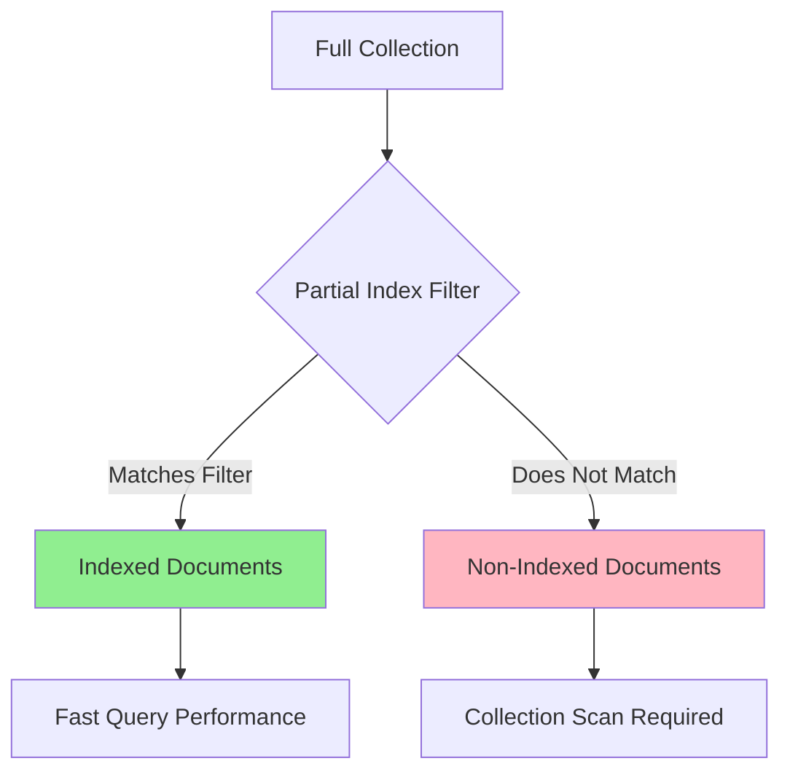
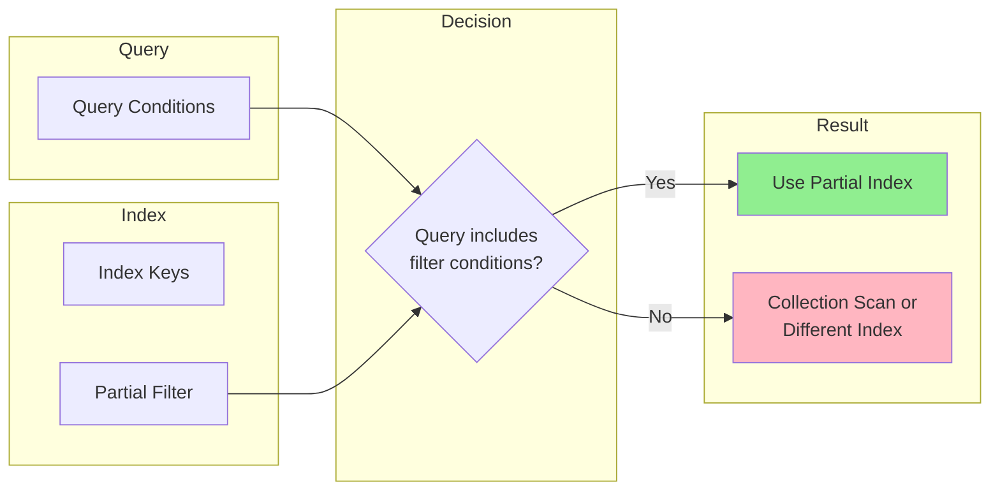
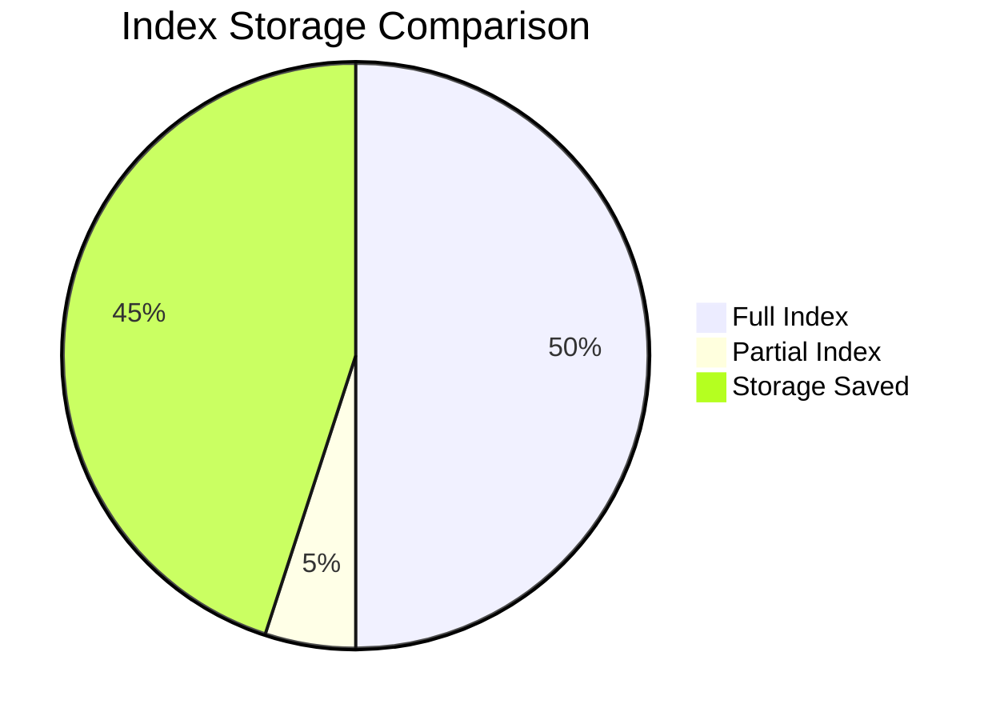
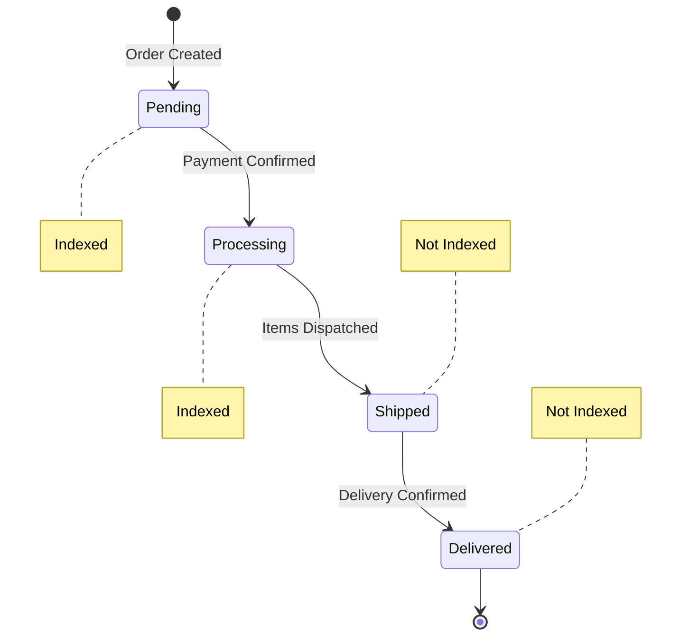
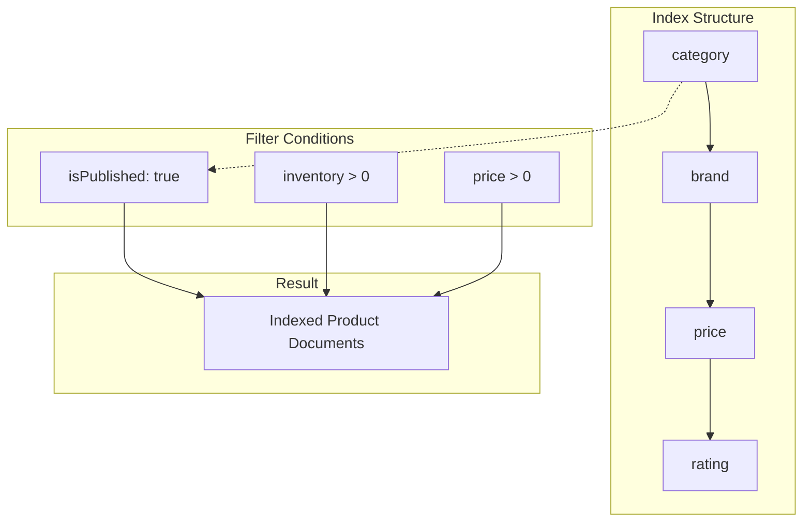
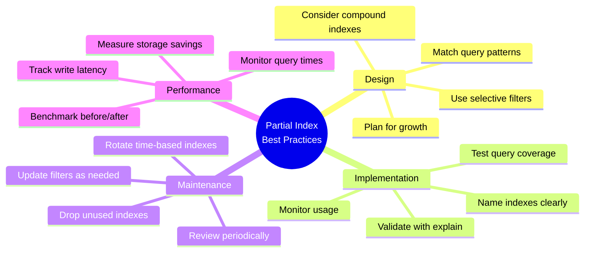

# How to Build MongoDB Partial Index Optimization

Author: [nawazdhandala](https://github.com/nawazdhandala)

Tags: MongoDB, Partial Index, Performance, Selective Indexing

Description: Learn to implement partial indexes for selective indexing with filter expressions, storage optimization, and query coverage.

---

## Introduction

MongoDB partial indexes are a powerful optimization technique that allows you to index only a subset of documents in a collection. Instead of indexing every document, you define a filter expression that determines which documents get included in the index. This approach can dramatically reduce storage requirements and improve write performance while maintaining fast query execution for targeted workloads.

In this guide, we will explore how to design, implement, and optimize partial indexes for real-world scenarios.

## Understanding Partial Indexes

A partial index indexes only documents that match a specified filter condition. This is particularly useful when:

- You frequently query a specific subset of documents
- A large portion of your collection contains data you rarely query
- You want to reduce index maintenance overhead on writes
- Storage optimization is a priority



## Basic Syntax and Structure

The basic syntax for creating a partial index uses the `partialFilterExpression` option:

```javascript
db.collection.createIndex(
  { field: 1 },                           // Index keys
  { partialFilterExpression: { ... } }    // Filter condition
)
```

### Supported Filter Operators

Partial indexes support the following operators in filter expressions:

| Operator | Description | Example |
|----------|-------------|---------|
| `$eq` | Equality match | `{ status: "active" }` |
| `$gt`, `$gte` | Greater than | `{ age: { $gte: 18 } }` |
| `$lt`, `$lte` | Less than | `{ priority: { $lt: 5 } }` |
| `$type` | Type check | `{ email: { $type: "string" } }` |
| `$exists` | Field existence | `{ deletedAt: { $exists: false } }` |
| `$and` | Logical AND | Combine multiple conditions |
| `$or` | Logical OR | Alternative conditions |

## Practical Examples

### Example 1: Active Users Index

Index only users who are currently active:

```javascript
// Create a partial index for active users only
db.users.createIndex(
  { email: 1, createdAt: -1 },
  {
    partialFilterExpression: {
      status: "active",
      emailVerified: true
    },
    name: "idx_active_verified_users"
  }
)
```

```javascript
// This query WILL use the partial index
db.users.find({
  email: "user@example.com",
  status: "active",
  emailVerified: true
})

// This query will NOT use the partial index
// (missing the required filter conditions)
db.users.find({
  email: "user@example.com"
})
```

### Example 2: Recent Orders Index

Index only orders from the last 30 days:

```javascript
// Create a partial index for recent orders
const thirtyDaysAgo = new Date(Date.now() - 30 * 24 * 60 * 60 * 1000)

db.orders.createIndex(
  { customerId: 1, orderDate: -1 },
  {
    partialFilterExpression: {
      orderDate: { $gte: thirtyDaysAgo },
      status: { $in: ["pending", "processing", "shipped"] }
    },
    name: "idx_recent_active_orders"
  }
)
```

### Example 3: Non-Deleted Documents (Soft Delete Pattern)

```javascript
// Index only documents that have not been soft-deleted
db.documents.createIndex(
  { title: "text", content: "text" },
  {
    partialFilterExpression: {
      deletedAt: { $exists: false }
    },
    name: "idx_text_search_active"
  }
)
```

## Query Coverage and Matching

For MongoDB to use a partial index, your query must include the partial filter expression conditions. The query planner evaluates whether the query is a subset of the indexed documents.



### Query Coverage Rules

```javascript
// Partial index definition
db.products.createIndex(
  { category: 1, price: 1 },
  {
    partialFilterExpression: {
      inStock: true,
      price: { $gt: 0 }
    }
  }
)

// Query 1: COVERED - includes all filter conditions
db.products.find({
  category: "electronics",
  inStock: true,
  price: { $gt: 100 }  // $gt: 100 implies $gt: 0
}).explain("executionStats")

// Query 2: NOT COVERED - missing inStock condition
db.products.find({
  category: "electronics",
  price: { $gt: 100 }
}).explain("executionStats")

// Query 3: NOT COVERED - inStock is false
db.products.find({
  category: "electronics",
  inStock: false,
  price: { $gt: 100 }
}).explain("executionStats")
```

## Storage Savings Analysis

Partial indexes can provide significant storage savings. Here is how to measure the impact:

```javascript
// Compare index sizes: full vs partial

// Full index (all documents)
db.events.createIndex(
  { eventType: 1, timestamp: -1 },
  { name: "idx_events_full" }
)

// Partial index (only error events)
db.events.createIndex(
  { eventType: 1, timestamp: -1 },
  {
    partialFilterExpression: {
      severity: "error"
    },
    name: "idx_events_errors_only"
  }
)

// Check index sizes
db.events.stats().indexSizes
// Output:
// {
//   "idx_events_full": 52428800,       // 50 MB
//   "idx_events_errors_only": 5242880  // 5 MB (90% savings!)
// }
```



### Calculating Expected Savings

```javascript
// Helper function to estimate partial index savings
function estimatePartialIndexSavings(collection, filterExpression) {
  const totalDocs = db[collection].countDocuments({})
  const matchingDocs = db[collection].countDocuments(filterExpression)

  const percentageIndexed = (matchingDocs / totalDocs) * 100
  const estimatedSavings = 100 - percentageIndexed

  return {
    totalDocuments: totalDocs,
    indexedDocuments: matchingDocs,
    percentageIndexed: percentageIndexed.toFixed(2) + "%",
    estimatedStorageSavings: estimatedSavings.toFixed(2) + "%"
  }
}

// Usage
estimatePartialIndexSavings("orders", { status: "pending" })
// {
//   totalDocuments: 1000000,
//   indexedDocuments: 50000,
//   percentageIndexed: "5.00%",
//   estimatedStorageSavings: "95.00%"
// }
```

## Design Patterns

### Pattern 1: Status-Based Indexing

Index documents based on their lifecycle status:

```javascript
// E-commerce order processing
db.orders.createIndex(
  { customerId: 1, createdAt: -1 },
  {
    partialFilterExpression: {
      status: { $in: ["pending", "processing"] }
    },
    name: "idx_orders_in_progress"
  }
)
```



### Pattern 2: Time-Based Partitioning

Index only recent data for time-sensitive queries:

```javascript
// Monitoring and alerting system
db.alerts.createIndex(
  { severity: 1, service: 1, timestamp: -1 },
  {
    partialFilterExpression: {
      resolved: false,
      timestamp: {
        $gte: new Date(Date.now() - 7 * 24 * 60 * 60 * 1000)
      }
    },
    name: "idx_unresolved_recent_alerts"
  }
)
```

### Pattern 3: Feature Flag Indexing

Index documents with specific feature flags enabled:

```javascript
// A/B testing and feature rollouts
db.users.createIndex(
  { region: 1, signupDate: -1 },
  {
    partialFilterExpression: {
      "features.newDashboard": true,
      "features.betaTester": true
    },
    name: "idx_beta_users"
  }
)
```

### Pattern 4: Sparse Data Optimization

Index only documents where optional fields exist:

```javascript
// User profiles with optional premium features
db.profiles.createIndex(
  { "subscription.plan": 1, "subscription.expiresAt": 1 },
  {
    partialFilterExpression: {
      "subscription.plan": { $exists: true },
      "subscription.plan": { $ne: "free" }
    },
    name: "idx_premium_subscriptions"
  }
)
```

### Pattern 5: Multi-Tenant Isolation

Create indexes scoped to specific tenants:

```javascript
// High-priority tenant optimization
db.requests.createIndex(
  { endpoint: 1, responseTime: 1 },
  {
    partialFilterExpression: {
      tenantId: { $in: ["tenant_enterprise_1", "tenant_enterprise_2"] },
      responseTime: { $gt: 1000 }  // Slow requests only
    },
    name: "idx_enterprise_slow_requests"
  }
)
```

## Compound Partial Indexes

Combine multiple index keys with partial filtering for complex query patterns:

```javascript
// E-commerce product search
db.products.createIndex(
  {
    category: 1,
    brand: 1,
    price: 1,
    rating: -1
  },
  {
    partialFilterExpression: {
      isPublished: true,
      inventory: { $gt: 0 },
      price: { $gt: 0 }
    },
    name: "idx_available_products"
  }
)
```



## Performance Benchmarking

### Measuring Query Performance

```javascript
// Benchmark function for comparing index performance
async function benchmarkQuery(collection, query, iterations = 100) {
  const times = []

  for (let i = 0; i < iterations; i++) {
    const start = Date.now()
    await db[collection].find(query).toArray()
    times.push(Date.now() - start)
  }

  return {
    avgTime: times.reduce((a, b) => a + b) / times.length,
    minTime: Math.min(...times),
    maxTime: Math.max(...times),
    p95Time: times.sort((a, b) => a - b)[Math.floor(iterations * 0.95)]
  }
}

// Compare full index vs partial index
const query = {
  status: "active",
  category: "electronics"
}

// Test with full index
db.products.dropIndexes()
db.products.createIndex({ category: 1, status: 1 })
const fullIndexResults = await benchmarkQuery("products", query)

// Test with partial index
db.products.dropIndexes()
db.products.createIndex(
  { category: 1 },
  { partialFilterExpression: { status: "active" } }
)
const partialIndexResults = await benchmarkQuery("products", query)

console.log("Full Index:", fullIndexResults)
console.log("Partial Index:", partialIndexResults)
```

### Write Performance Impact

```javascript
// Measure write performance improvement
async function benchmarkWrites(collection, documents, indexType) {
  const start = Date.now()

  for (const doc of documents) {
    await db[collection].insertOne(doc)
  }

  return {
    indexType,
    totalTime: Date.now() - start,
    avgWriteTime: (Date.now() - start) / documents.length
  }
}
```

## Common Pitfalls and Solutions

### Pitfall 1: Query Not Using Partial Index

```javascript
// Problem: Query does not include filter conditions
db.orders.createIndex(
  { customerId: 1 },
  { partialFilterExpression: { status: "active" } }
)

// This query will NOT use the partial index
db.orders.find({ customerId: "123" })

// Solution: Include the filter condition in your query
db.orders.find({
  customerId: "123",
  status: "active"  // Required for index usage
})
```

### Pitfall 2: Overly Restrictive Filters

```javascript
// Problem: Filter too restrictive - index rarely used
db.logs.createIndex(
  { level: 1, timestamp: -1 },
  {
    partialFilterExpression: {
      level: "fatal",
      source: "payment-service",
      environment: "production"
    }
  }
)

// Solution: Use broader filters with query-time refinement
db.logs.createIndex(
  { level: 1, source: 1, timestamp: -1 },
  {
    partialFilterExpression: {
      level: { $in: ["error", "fatal"] }
    }
  }
)
```

### Pitfall 3: Stale Date-Based Filters

```javascript
// Problem: Date in filter becomes stale
db.events.createIndex(
  { type: 1 },
  {
    partialFilterExpression: {
      createdAt: { $gte: ISODate("2025-01-01") }  // Hard-coded date
    }
  }
)

// Solution: Use TTL indexes for automatic cleanup
// or implement index rotation strategy
function rotatePartialIndex(collection, indexName, newDate) {
  // Drop old index
  db[collection].dropIndex(indexName)

  // Create new index with updated date
  db[collection].createIndex(
    { type: 1 },
    {
      partialFilterExpression: {
        createdAt: { $gte: newDate }
      },
      name: indexName
    }
  )
}
```

## Monitoring and Maintenance

### Index Usage Statistics

```javascript
// Check index usage
db.collection.aggregate([
  { $indexStats: {} },
  {
    $match: {
      name: { $regex: /^idx_partial/ }
    }
  },
  {
    $project: {
      name: 1,
      accesses: "$accesses.ops",
      since: "$accesses.since"
    }
  }
])
```

### Identifying Candidates for Partial Indexes

```javascript
// Find fields with high selectivity for partial indexing
function analyzeFieldSelectivity(collection, field) {
  return db[collection].aggregate([
    { $group: { _id: `$${field}`, count: { $sum: 1 } } },
    { $sort: { count: -1 } },
    { $limit: 10 }
  ]).toArray()
}

// Example: Find status distribution
analyzeFieldSelectivity("orders", "status")
// [
//   { _id: "completed", count: 950000 },
//   { _id: "pending", count: 30000 },
//   { _id: "processing", count: 15000 },
//   { _id: "cancelled", count: 5000 }
// ]
// Insight: Index only pending/processing for active order queries
```

## Best Practices Summary



### Quick Reference Checklist

1. **Analyze your queries** - Identify frequently accessed subsets of data
2. **Calculate selectivity** - Ensure the filter excludes a significant portion of documents
3. **Verify query coverage** - Queries must include partial filter conditions
4. **Test with explain()** - Confirm the index is being used
5. **Monitor index usage** - Track access patterns over time
6. **Plan for maintenance** - Establish index review schedules

## Conclusion

MongoDB partial indexes are a powerful tool for optimizing database performance when you need to query specific subsets of your data. By carefully designing filter expressions that match your query patterns, you can achieve significant storage savings and improved write performance while maintaining fast query execution.

Key takeaways:

- Use partial indexes when you frequently query a specific subset of documents
- Always include the partial filter conditions in your queries
- Monitor index usage and storage savings to validate your optimization
- Consider time-based index rotation for date-filtered partial indexes
- Combine with compound indexes for complex query patterns

Start with a thorough analysis of your query patterns, implement partial indexes for high-impact scenarios, and continuously monitor their effectiveness as your application evolves.
