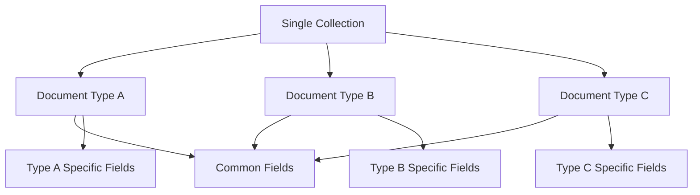
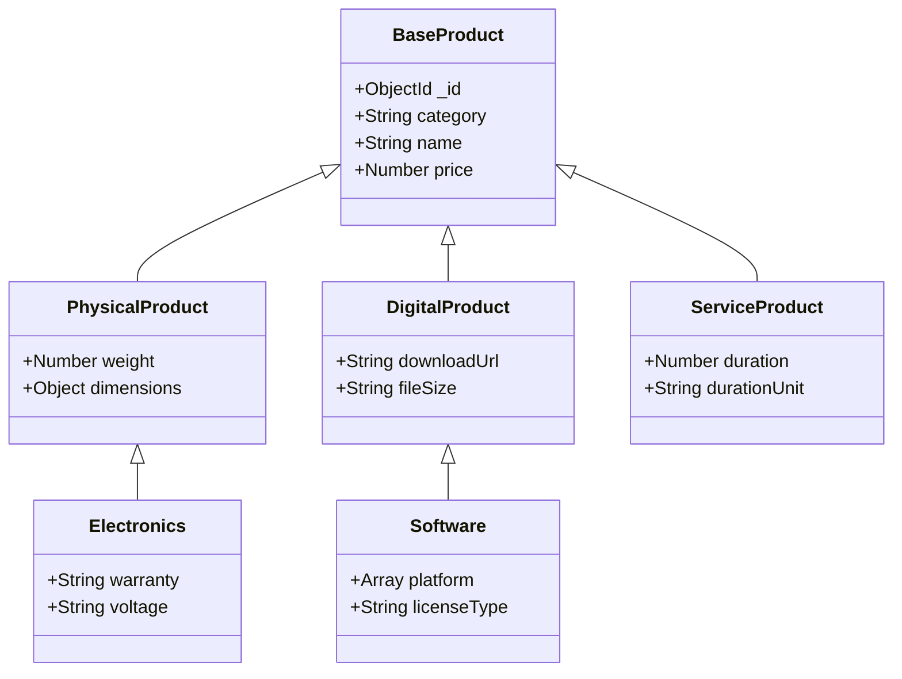
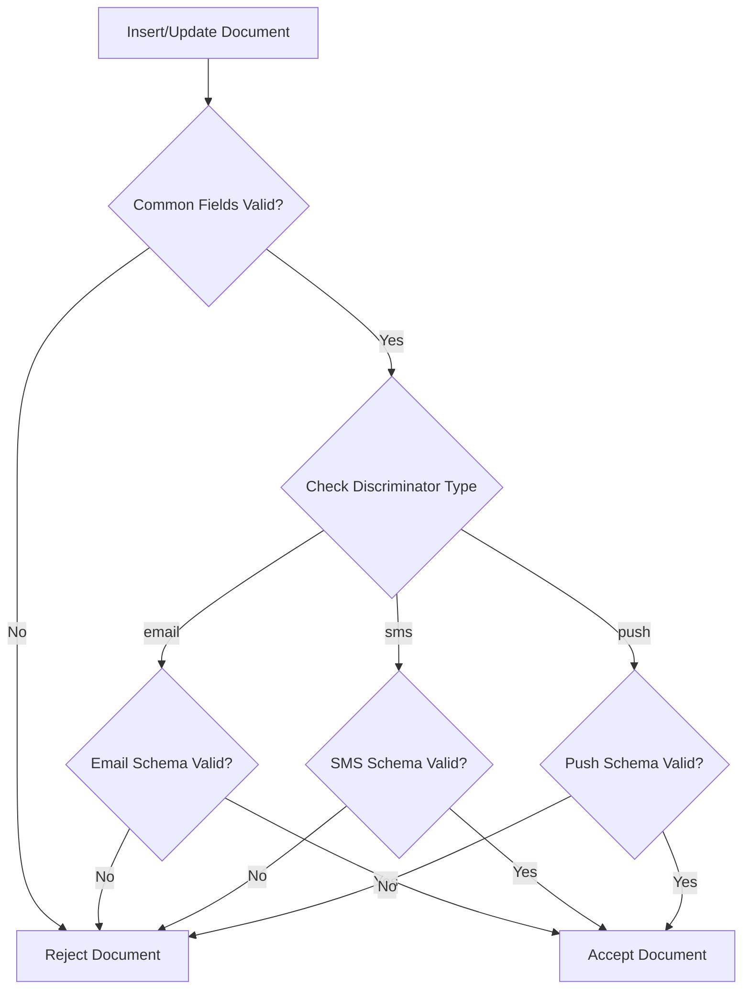
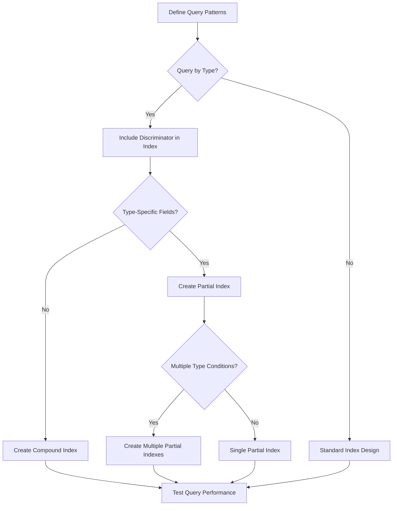
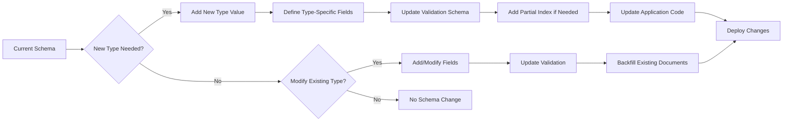

# How to Implement MongoDB Polymorphic Patterns

Author: [nawazdhandala](https://github.com/nawazdhandala)

Tags: MongoDB, Polymorphic Pattern, Schema Design, Inheritance

Description: Learn to implement polymorphic patterns for storing different document types in a single collection with discriminators and flexible schemas.

---

## Introduction

The polymorphic pattern is one of the most powerful schema design patterns in MongoDB. It allows you to store documents with different shapes and structures in a single collection while maintaining query efficiency and data integrity. This pattern is particularly useful when you have related entities that share some common attributes but also have type-specific fields.

In this guide, we will explore how to implement polymorphic patterns effectively, covering discriminator fields, schema validation, indexing strategies, and query patterns.

## Understanding the Polymorphic Pattern

The polymorphic pattern enables you to store heterogeneous documents in a single collection. Instead of creating separate collections for each document type (which would require complex joins or multiple queries), you store all related documents together and use a discriminator field to identify the document type.

### When to Use Polymorphic Patterns

- **Inheritance hierarchies**: When you have a base entity with multiple subtypes (e.g., different types of users, products, or notifications)
- **Event sourcing**: Storing different event types in a single events collection
- **Content management**: Managing various content types (articles, videos, podcasts) in one collection
- **Logging systems**: Storing different log entry formats together

### Architecture Overview



## Implementing Discriminator Fields

The discriminator field is the cornerstone of the polymorphic pattern. It is a field that identifies the type of each document in the collection.

### Basic Discriminator Implementation

```javascript
// Example: Notification system with different notification types

// Email notification
{
  _id: ObjectId("..."),
  type: "email",                    // Discriminator field
  createdAt: ISODate("2026-01-30"),
  userId: ObjectId("..."),
  // Type-specific fields
  subject: "Welcome to our platform",
  body: "Thank you for signing up...",
  recipientEmail: "user@example.com"
}

// SMS notification
{
  _id: ObjectId("..."),
  type: "sms",                      // Discriminator field
  createdAt: ISODate("2026-01-30"),
  userId: ObjectId("..."),
  // Type-specific fields
  message: "Your verification code is 123456",
  phoneNumber: "+1234567890"
}

// Push notification
{
  _id: ObjectId("..."),
  type: "push",                     // Discriminator field
  createdAt: ISODate("2026-01-30"),
  userId: ObjectId("..."),
  // Type-specific fields
  title: "New message received",
  body: "You have a new message from John",
  deviceToken: "abc123..."
}
```

### Hierarchical Discriminators

For more complex hierarchies, you can use multiple discriminator fields or nested type information:

```javascript
// Example: E-commerce product catalog

// Physical product - Electronics
{
  _id: ObjectId("..."),
  category: "physical",
  subcategory: "electronics",
  name: "Wireless Headphones",
  price: 99.99,
  // Physical product fields
  weight: 0.25,
  dimensions: { length: 20, width: 15, height: 8 },
  // Electronics-specific fields
  warranty: "2 years",
  voltage: "5V DC"
}

// Digital product - Software
{
  _id: ObjectId("..."),
  category: "digital",
  subcategory: "software",
  name: "Project Management Tool",
  price: 49.99,
  // Digital product fields
  downloadUrl: "https://...",
  fileSize: "150MB",
  // Software-specific fields
  platform: ["windows", "mac", "linux"],
  licenseType: "perpetual"
}

// Service product
{
  _id: ObjectId("..."),
  category: "service",
  subcategory: "consulting",
  name: "Technical Consultation",
  price: 150.00,
  // Service-specific fields
  duration: 60,
  durationUnit: "minutes",
  deliveryMethod: "video_call"
}
```

### Document Type Hierarchy



## Schema Validation

MongoDB provides JSON Schema validation to enforce document structure while maintaining flexibility for polymorphic patterns.

### Basic Schema Validation

```javascript
db.createCollection("notifications", {
  validator: {
    $jsonSchema: {
      bsonType: "object",
      required: ["type", "createdAt", "userId"],
      properties: {
        type: {
          enum: ["email", "sms", "push"],
          description: "Notification type discriminator"
        },
        createdAt: {
          bsonType: "date",
          description: "Timestamp when notification was created"
        },
        userId: {
          bsonType: "objectId",
          description: "Reference to the user"
        }
      }
    }
  }
});
```

### Conditional Schema Validation

Use `oneOf` or `anyOf` to define type-specific validation rules:

```javascript
db.createCollection("notifications", {
  validator: {
    $jsonSchema: {
      bsonType: "object",
      required: ["type", "createdAt", "userId"],
      properties: {
        type: {
          enum: ["email", "sms", "push"]
        },
        createdAt: {
          bsonType: "date"
        },
        userId: {
          bsonType: "objectId"
        }
      },
      oneOf: [
        {
          // Email notification validation
          properties: {
            type: { const: "email" },
            subject: { bsonType: "string", maxLength: 200 },
            body: { bsonType: "string" },
            recipientEmail: {
              bsonType: "string",
              pattern: "^[a-zA-Z0-9._%+-]+@[a-zA-Z0-9.-]+\\.[a-zA-Z]{2,}$"
            }
          },
          required: ["subject", "body", "recipientEmail"]
        },
        {
          // SMS notification validation
          properties: {
            type: { const: "sms" },
            message: { bsonType: "string", maxLength: 160 },
            phoneNumber: {
              bsonType: "string",
              pattern: "^\\+[1-9]\\d{1,14}$"
            }
          },
          required: ["message", "phoneNumber"]
        },
        {
          // Push notification validation
          properties: {
            type: { const: "push" },
            title: { bsonType: "string", maxLength: 100 },
            body: { bsonType: "string", maxLength: 250 },
            deviceToken: { bsonType: "string" }
          },
          required: ["title", "body", "deviceToken"]
        }
      ]
    }
  },
  validationLevel: "strict",
  validationAction: "error"
});
```

### Validation Flow



## Indexing Strategies

Proper indexing is crucial for query performance in polymorphic collections.

### Compound Index with Discriminator

Always include the discriminator field in compound indexes when queries filter by type:

```javascript
// Index for querying notifications by type and user
db.notifications.createIndex({ type: 1, userId: 1, createdAt: -1 });

// Index for email-specific queries
db.notifications.createIndex(
  { type: 1, recipientEmail: 1 },
  { partialFilterExpression: { type: "email" } }
);

// Index for SMS-specific queries
db.notifications.createIndex(
  { type: 1, phoneNumber: 1 },
  { partialFilterExpression: { type: "sms" } }
);

// Index for push notification queries
db.notifications.createIndex(
  { type: 1, deviceToken: 1 },
  { partialFilterExpression: { type: "push" } }
);
```

### Partial Indexes

Partial indexes are particularly useful for polymorphic collections as they only index documents that match the filter expression:

```javascript
// Index only unread email notifications
db.notifications.createIndex(
  { userId: 1, createdAt: -1 },
  {
    partialFilterExpression: {
      type: "email",
      read: false
    },
    name: "unread_emails_idx"
  }
);

// Index only high-priority push notifications
db.notifications.createIndex(
  { userId: 1, createdAt: -1 },
  {
    partialFilterExpression: {
      type: "push",
      priority: "high"
    },
    name: "high_priority_push_idx"
  }
);
```

### Wildcard Indexes

For highly dynamic schemas, consider wildcard indexes:

```javascript
// Index all fields within the metadata subdocument
db.products.createIndex({ "metadata.$**": 1 });

// Compound wildcard index
db.products.createIndex({ category: 1, "specs.$**": 1 });
```

### Index Strategy Decision Flow



## Query Patterns

### Basic Type Filtering

```javascript
// Find all email notifications for a user
db.notifications.find({
  type: "email",
  userId: ObjectId("...")
}).sort({ createdAt: -1 });

// Find all notifications regardless of type
db.notifications.find({
  userId: ObjectId("...")
}).sort({ createdAt: -1 });
```

### Aggregation with Type-Specific Processing

```javascript
db.notifications.aggregate([
  {
    $match: {
      userId: ObjectId("..."),
      createdAt: { $gte: ISODate("2026-01-01") }
    }
  },
  {
    $facet: {
      emailStats: [
        { $match: { type: "email" } },
        {
          $group: {
            _id: null,
            count: { $sum: 1 },
            subjects: { $push: "$subject" }
          }
        }
      ],
      smsStats: [
        { $match: { type: "sms" } },
        {
          $group: {
            _id: null,
            count: { $sum: 1 },
            avgMessageLength: { $avg: { $strLenCP: "$message" } }
          }
        }
      ],
      pushStats: [
        { $match: { type: "push" } },
        {
          $group: {
            _id: null,
            count: { $sum: 1 },
            titles: { $push: "$title" }
          }
        }
      ]
    }
  }
]);
```

### Dynamic Field Projection

```javascript
// Project common fields plus type-specific fields conditionally
db.notifications.aggregate([
  {
    $match: { userId: ObjectId("...") }
  },
  {
    $project: {
      type: 1,
      createdAt: 1,
      userId: 1,
      // Type-specific content field
      content: {
        $switch: {
          branches: [
            {
              case: { $eq: ["$type", "email"] },
              then: { subject: "$subject", body: "$body" }
            },
            {
              case: { $eq: ["$type", "sms"] },
              then: { message: "$message" }
            },
            {
              case: { $eq: ["$type", "push"] },
              then: { title: "$title", body: "$body" }
            }
          ],
          default: null
        }
      },
      // Type-specific recipient
      recipient: {
        $switch: {
          branches: [
            { case: { $eq: ["$type", "email"] }, then: "$recipientEmail" },
            { case: { $eq: ["$type", "sms"] }, then: "$phoneNumber" },
            { case: { $eq: ["$type", "push"] }, then: "$deviceToken" }
          ],
          default: null
        }
      }
    }
  }
]);
```

### Query Pattern with Application Code

Here is a complete example using Node.js and the MongoDB driver:

```javascript
const { MongoClient, ObjectId } = require('mongodb');

class NotificationRepository {
  constructor(db) {
    this.collection = db.collection('notifications');
  }

  // Base query builder
  _buildQuery(filters) {
    const query = {};

    if (filters.type) {
      query.type = filters.type;
    }

    if (filters.userId) {
      query.userId = new ObjectId(filters.userId);
    }

    if (filters.startDate || filters.endDate) {
      query.createdAt = {};
      if (filters.startDate) {
        query.createdAt.$gte = new Date(filters.startDate);
      }
      if (filters.endDate) {
        query.createdAt.$lte = new Date(filters.endDate);
      }
    }

    return query;
  }

  // Find notifications with type-aware projection
  async findNotifications(filters, options = {}) {
    const query = this._buildQuery(filters);

    const cursor = this.collection
      .find(query)
      .sort({ createdAt: -1 })
      .limit(options.limit || 50);

    return cursor.toArray();
  }

  // Create notification with type validation
  async createNotification(type, data) {
    const baseFields = {
      type,
      createdAt: new Date(),
      userId: new ObjectId(data.userId),
      read: false
    };

    let typeSpecificFields;

    switch (type) {
      case 'email':
        typeSpecificFields = {
          subject: data.subject,
          body: data.body,
          recipientEmail: data.recipientEmail
        };
        break;
      case 'sms':
        typeSpecificFields = {
          message: data.message,
          phoneNumber: data.phoneNumber
        };
        break;
      case 'push':
        typeSpecificFields = {
          title: data.title,
          body: data.body,
          deviceToken: data.deviceToken,
          priority: data.priority || 'normal'
        };
        break;
      default:
        throw new Error(`Unknown notification type: ${type}`);
    }

    const document = { ...baseFields, ...typeSpecificFields };
    const result = await this.collection.insertOne(document);

    return { _id: result.insertedId, ...document };
  }

  // Get notification statistics by type
  async getStatsByType(userId, startDate, endDate) {
    return this.collection.aggregate([
      {
        $match: {
          userId: new ObjectId(userId),
          createdAt: {
            $gte: new Date(startDate),
            $lte: new Date(endDate)
          }
        }
      },
      {
        $group: {
          _id: '$type',
          count: { $sum: 1 },
          readCount: {
            $sum: { $cond: ['$read', 1, 0] }
          }
        }
      },
      {
        $project: {
          type: '$_id',
          count: 1,
          readCount: 1,
          unreadCount: { $subtract: ['$count', '$readCount'] },
          readRate: {
            $multiply: [
              { $divide: ['$readCount', '$count'] },
              100
            ]
          }
        }
      }
    ]).toArray();
  }
}

// Usage example
async function main() {
  const client = new MongoClient('mongodb://localhost:27017');
  await client.connect();

  const db = client.db('myapp');
  const repo = new NotificationRepository(db);

  // Create different notification types
  await repo.createNotification('email', {
    userId: '507f1f77bcf86cd799439011',
    subject: 'Welcome!',
    body: 'Thanks for joining us.',
    recipientEmail: 'user@example.com'
  });

  await repo.createNotification('sms', {
    userId: '507f1f77bcf86cd799439011',
    message: 'Your code is 123456',
    phoneNumber: '+1234567890'
  });

  await repo.createNotification('push', {
    userId: '507f1f77bcf86cd799439011',
    title: 'New message',
    body: 'You have a new message',
    deviceToken: 'device_token_123',
    priority: 'high'
  });

  // Query all notifications
  const notifications = await repo.findNotifications({
    userId: '507f1f77bcf86cd799439011'
  });

  // Query only email notifications
  const emails = await repo.findNotifications({
    userId: '507f1f77bcf86cd799439011',
    type: 'email'
  });

  // Get statistics
  const stats = await repo.getStatsByType(
    '507f1f77bcf86cd799439011',
    '2026-01-01',
    '2026-12-31'
  );

  console.log('Notifications:', notifications);
  console.log('Emails:', emails);
  console.log('Stats:', stats);

  await client.close();
}
```

## Best Practices

### 1. Choose Meaningful Discriminator Values

Use clear, descriptive values for your discriminator field:

```javascript
// Good - descriptive and consistent
{ type: "email_notification" }
{ type: "sms_notification" }
{ type: "push_notification" }

// Avoid - cryptic or inconsistent
{ type: "E" }
{ type: 1 }
{ t: "email" }
```

### 2. Keep Common Fields Consistent

Ensure all document types share the same common field names and types:

```javascript
// Good - consistent common fields
{ type: "email", createdAt: ISODate(), status: "sent" }
{ type: "sms", createdAt: ISODate(), status: "delivered" }

// Avoid - inconsistent naming
{ type: "email", created_at: ISODate(), emailStatus: "sent" }
{ type: "sms", timestamp: ISODate(), smsStatus: "delivered" }
```

### 3. Document Your Schema

Maintain clear documentation of all document types and their fields:

```javascript
/**
 * Notification Collection Schema
 *
 * Common Fields (all types):
 * - _id: ObjectId
 * - type: String (discriminator) - "email" | "sms" | "push"
 * - createdAt: Date
 * - userId: ObjectId (ref: users)
 * - read: Boolean
 *
 * Email Notifications (type: "email"):
 * - subject: String (max 200 chars)
 * - body: String
 * - recipientEmail: String (valid email format)
 *
 * SMS Notifications (type: "sms"):
 * - message: String (max 160 chars)
 * - phoneNumber: String (E.164 format)
 *
 * Push Notifications (type: "push"):
 * - title: String (max 100 chars)
 * - body: String (max 250 chars)
 * - deviceToken: String
 * - priority: String - "low" | "normal" | "high"
 */
```

### 4. Use TypeScript for Type Safety

```typescript
// Base notification interface
interface BaseNotification {
  _id: ObjectId;
  createdAt: Date;
  userId: ObjectId;
  read: boolean;
}

// Type-specific interfaces
interface EmailNotification extends BaseNotification {
  type: 'email';
  subject: string;
  body: string;
  recipientEmail: string;
}

interface SmsNotification extends BaseNotification {
  type: 'sms';
  message: string;
  phoneNumber: string;
}

interface PushNotification extends BaseNotification {
  type: 'push';
  title: string;
  body: string;
  deviceToken: string;
  priority: 'low' | 'normal' | 'high';
}

// Union type for all notifications
type Notification = EmailNotification | SmsNotification | PushNotification;

// Type guard functions
function isEmailNotification(n: Notification): n is EmailNotification {
  return n.type === 'email';
}

function isSmsNotification(n: Notification): n is SmsNotification {
  return n.type === 'sms';
}

function isPushNotification(n: Notification): n is PushNotification {
  return n.type === 'push';
}

// Usage with type narrowing
function processNotification(notification: Notification) {
  console.log(`Processing ${notification.type} notification`);

  if (isEmailNotification(notification)) {
    console.log(`Subject: ${notification.subject}`);
  } else if (isSmsNotification(notification)) {
    console.log(`Message: ${notification.message}`);
  } else if (isPushNotification(notification)) {
    console.log(`Title: ${notification.title}`);
  }
}
```

### 5. Plan for Schema Evolution

Design your schema to accommodate future document types:



## Performance Considerations

### Query Optimization

```javascript
// Efficient - uses discriminator in query
db.notifications.find({
  type: "email",
  userId: ObjectId("..."),
  createdAt: { $gte: ISODate("2026-01-01") }
});

// Less efficient - no discriminator filtering
// Forces scanning of all document types
db.notifications.find({
  recipientEmail: "user@example.com"
});

// Better - includes discriminator
db.notifications.find({
  type: "email",
  recipientEmail: "user@example.com"
});
```

### Explain Plan Analysis

Always analyze query performance with explain:

```javascript
db.notifications.find({
  type: "email",
  userId: ObjectId("...")
}).explain("executionStats");

// Look for:
// - "stage": "IXSCAN" (index scan, good)
// - "totalDocsExamined" should be close to "nReturned"
// - "executionTimeMillis" should be low
```

## Conclusion

The polymorphic pattern is a powerful tool for building flexible, scalable MongoDB schemas. By using discriminator fields, proper schema validation, strategic indexing, and well-designed query patterns, you can efficiently store and retrieve heterogeneous documents in a single collection.

Key takeaways:

1. **Use discriminator fields** to clearly identify document types
2. **Implement schema validation** with conditional rules using `oneOf` or `anyOf`
3. **Create partial indexes** for type-specific queries
4. **Design queries** to always include the discriminator field when filtering by type
5. **Use TypeScript** or similar for type safety in application code
6. **Plan for evolution** by designing schemas that can accommodate new document types

The polymorphic pattern trades some query complexity for significant benefits in data modeling flexibility and reduced application complexity when dealing with inheritance hierarchies and varied document types.

## Further Reading

- MongoDB Documentation: Schema Validation
- MongoDB Documentation: Partial Indexes
- MongoDB University: Data Modeling Course
- Building with Patterns: The Polymorphic Pattern
