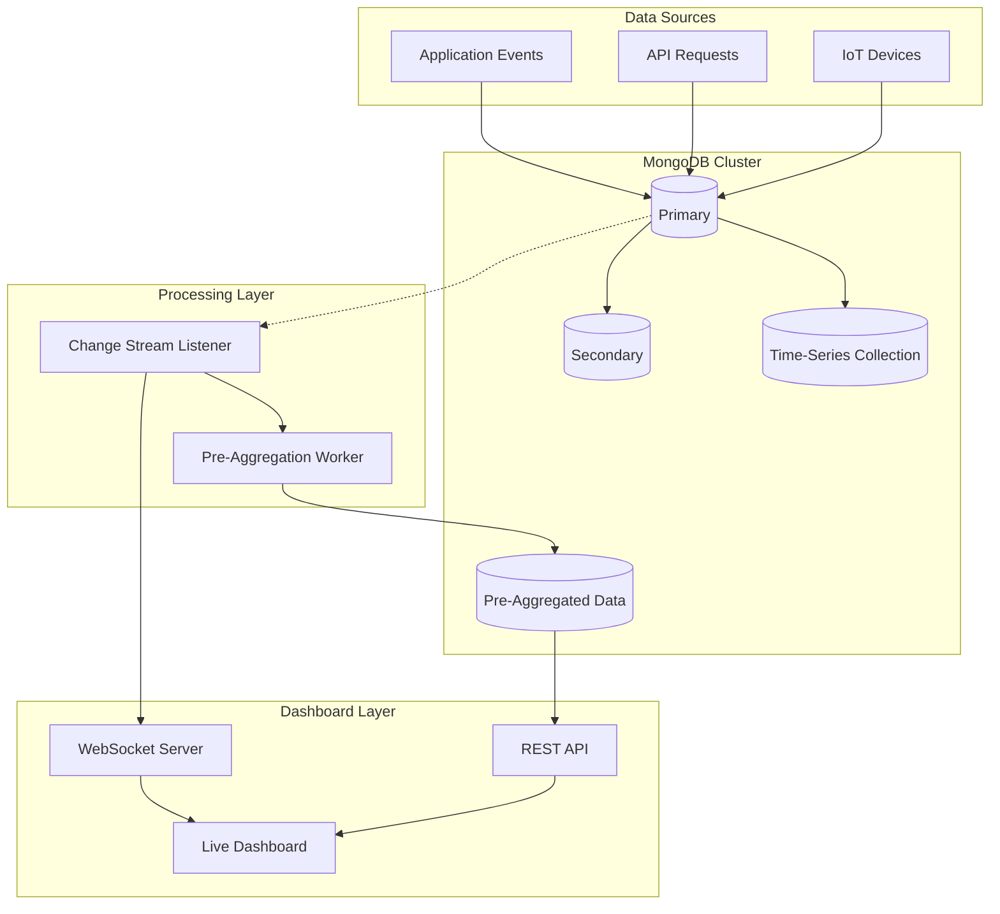
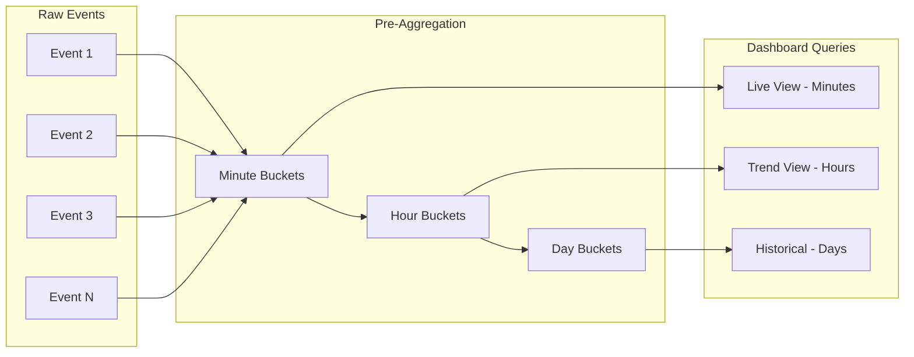
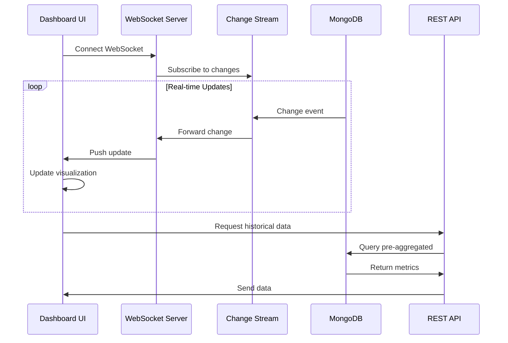
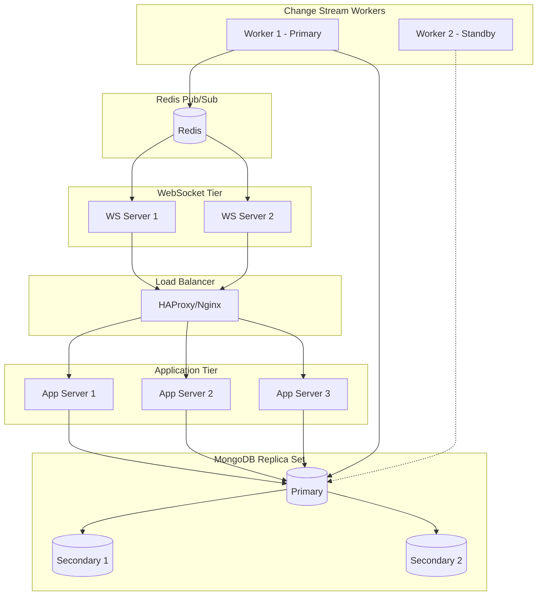

# How to Build MongoDB Real-Time Analytics

Author: [nawazdhandala](https://github.com/nawazdhandala)

Tags: MongoDB, Real-Time Analytics, Change Streams, Dashboards

Description: Learn to implement real-time analytics with change streams, pre-aggregation, and time-series collections for live dashboard data.

---

> Real-time analytics transform raw operational data into actionable insights the moment events occur. MongoDB provides native primitives - change streams, time-series collections, and aggregation pipelines - that make building live dashboards practical without bolting on a separate streaming infrastructure.

This guide walks through the architecture, patterns, and code needed to build production-ready real-time analytics for live dashboards using MongoDB.

---

## Table of Contents

1. Why Real-Time Analytics Matter
2. MongoDB Architecture for Analytics
3. Change Streams - The Foundation
4. Time-Series Collections
5. Pre-Aggregation Strategies
6. Time Windows and Bucketing
7. Dashboard Integration Patterns
8. Performance Optimization
9. Production Considerations
10. Putting It All Together

---

## 1. Why Real-Time Analytics Matter

Traditional batch analytics introduce latency between events and insights. For operational dashboards, this delay can mean missed opportunities or delayed incident response.

| Analytics Type | Latency | Use Case |
|----------------|---------|----------|
| Batch | Hours to days | Historical reports, trend analysis |
| Near-Real-Time | Minutes | Business intelligence, periodic updates |
| Real-Time | Seconds to milliseconds | Live dashboards, alerting, operations |

Real-time analytics enable:
- Instant visibility into system health
- Immediate detection of anomalies
- Live business metrics (orders, revenue, users)
- Operational awareness without page refreshes

---

## 2. MongoDB Architecture for Analytics



Key components:
- **Change Streams**: Capture database changes in real-time
- **Time-Series Collections**: Optimized storage for time-based data
- **Pre-Aggregation**: Compute metrics ahead of time for fast reads
- **WebSockets**: Push updates to dashboards instantly

---

## 3. Change Streams - The Foundation

Change streams let you subscribe to database changes without polling. They use MongoDB's oplog and provide a resume token for reliability.

### Basic Change Stream Setup

```javascript
// change-stream-listener.js
const { MongoClient } = require('mongodb');

async function watchCollection() {
    const client = await MongoClient.connect(process.env.MONGODB_URI);
    const db = client.db('analytics');
    const collection = db.collection('events');

    // Watch for inserts, updates, and deletes
    const changeStream = collection.watch([
        { $match: { operationType: { $in: ['insert', 'update'] } } }
    ], {
        fullDocument: 'updateLookup' // Include full document on updates
    });

    changeStream.on('change', (change) => {
        console.log('Change detected:', change.operationType);
        processChange(change);
    });

    changeStream.on('error', (error) => {
        console.error('Change stream error:', error);
        // Implement reconnection logic
    });

    return changeStream;
}

function processChange(change) {
    const { operationType, fullDocument, documentKey } = change;

    switch (operationType) {
        case 'insert':
            handleNewEvent(fullDocument);
            break;
        case 'update':
            handleUpdatedEvent(fullDocument, documentKey);
            break;
    }
}
```

### Resume Tokens for Reliability

```javascript
// resilient-change-stream.js
const fs = require('fs').promises;

class ResilientChangeStream {
    constructor(collection, pipeline, options = {}) {
        this.collection = collection;
        this.pipeline = pipeline;
        this.options = options;
        this.tokenFile = options.tokenFile || './resume-token.json';
    }

    async start(handler) {
        const resumeToken = await this.loadResumeToken();

        const streamOptions = {
            fullDocument: 'updateLookup',
            ...this.options
        };

        if (resumeToken) {
            streamOptions.resumeAfter = resumeToken;
            console.log('Resuming from saved token');
        }

        this.stream = this.collection.watch(this.pipeline, streamOptions);

        this.stream.on('change', async (change) => {
            try {
                await handler(change);
                await this.saveResumeToken(change._id);
            } catch (error) {
                console.error('Error processing change:', error);
            }
        });

        this.stream.on('error', (error) => {
            console.error('Stream error, will restart:', error.message);
            setTimeout(() => this.start(handler), 5000);
        });
    }

    async loadResumeToken() {
        try {
            const data = await fs.readFile(this.tokenFile, 'utf8');
            return JSON.parse(data);
        } catch {
            return null;
        }
    }

    async saveResumeToken(token) {
        await fs.writeFile(this.tokenFile, JSON.stringify(token));
    }

    close() {
        if (this.stream) {
            this.stream.close();
        }
    }
}
```

### Filtering Change Streams

```javascript
// Only watch specific event types and fields
const pipeline = [
    {
        $match: {
            'operationType': 'insert',
            'fullDocument.eventType': {
                $in: ['page_view', 'purchase', 'signup']
            }
        }
    },
    {
        $project: {
            'fullDocument.eventType': 1,
            'fullDocument.userId': 1,
            'fullDocument.timestamp': 1,
            'fullDocument.metadata': 1
        }
    }
];

const changeStream = collection.watch(pipeline);
```

---

## 4. Time-Series Collections

MongoDB 5.0+ provides native time-series collections optimized for time-based data with automatic bucketing and compression.

### Creating a Time-Series Collection

```javascript
// setup-timeseries.js
async function createTimeSeriesCollections(db) {
    // Events collection - raw event data
    await db.createCollection('events_ts', {
        timeseries: {
            timeField: 'timestamp',
            metaField: 'metadata',
            granularity: 'seconds'
        },
        expireAfterSeconds: 86400 * 30 // 30 days retention
    });

    // Metrics collection - aggregated metrics
    await db.createCollection('metrics_ts', {
        timeseries: {
            timeField: 'timestamp',
            metaField: 'metric',
            granularity: 'minutes'
        },
        expireAfterSeconds: 86400 * 90 // 90 days retention
    });

    // Create indexes for common queries
    await db.collection('events_ts').createIndex({
        'metadata.eventType': 1,
        'timestamp': -1
    });

    await db.collection('metrics_ts').createIndex({
        'metric.name': 1,
        'timestamp': -1
    });
}
```

### Inserting Time-Series Data

```javascript
// event-ingestion.js
async function recordEvent(db, event) {
    const eventsCollection = db.collection('events_ts');

    await eventsCollection.insertOne({
        timestamp: new Date(),
        metadata: {
            eventType: event.type,
            source: event.source,
            userId: event.userId
        },
        value: event.value,
        properties: event.properties
    });
}

// Batch insert for high-throughput scenarios
async function recordEventsBatch(db, events) {
    const documents = events.map(event => ({
        timestamp: new Date(event.timestamp),
        metadata: {
            eventType: event.type,
            source: event.source
        },
        value: event.value,
        properties: event.properties
    }));

    await db.collection('events_ts').insertMany(documents, {
        ordered: false // Continue on duplicate key errors
    });
}
```

### Querying Time-Series Data

```javascript
// time-series-queries.js
async function getEventsByTimeRange(db, startTime, endTime, eventType) {
    return db.collection('events_ts').aggregate([
        {
            $match: {
                timestamp: { $gte: startTime, $lt: endTime },
                'metadata.eventType': eventType
            }
        },
        {
            $group: {
                _id: {
                    $dateTrunc: {
                        date: '$timestamp',
                        unit: 'minute'
                    }
                },
                count: { $sum: 1 },
                totalValue: { $sum: '$value' },
                avgValue: { $avg: '$value' }
            }
        },
        { $sort: { _id: 1 } }
    ]).toArray();
}
```

---

## 5. Pre-Aggregation Strategies

Pre-aggregation computes metrics in advance, trading write complexity for read speed - essential for responsive dashboards.



### Increment-On-Write Pattern

```javascript
// pre-aggregation.js
async function incrementMetric(db, eventType, value, timestamp = new Date()) {
    const metrics = db.collection('metrics_preagg');

    // Generate bucket keys for different granularities
    const minuteBucket = new Date(
        Math.floor(timestamp.getTime() / 60000) * 60000
    );
    const hourBucket = new Date(
        Math.floor(timestamp.getTime() / 3600000) * 3600000
    );
    const dayBucket = new Date(
        timestamp.getFullYear(),
        timestamp.getMonth(),
        timestamp.getDate()
    );

    // Update all time buckets atomically
    const updates = [
        // Minute granularity
        {
            updateOne: {
                filter: {
                    type: eventType,
                    granularity: 'minute',
                    bucket: minuteBucket
                },
                update: {
                    $inc: { count: 1, total: value },
                    $min: { min: value },
                    $max: { max: value },
                    $setOnInsert: {
                        type: eventType,
                        granularity: 'minute',
                        bucket: minuteBucket
                    }
                },
                upsert: true
            }
        },
        // Hour granularity
        {
            updateOne: {
                filter: {
                    type: eventType,
                    granularity: 'hour',
                    bucket: hourBucket
                },
                update: {
                    $inc: { count: 1, total: value },
                    $min: { min: value },
                    $max: { max: value },
                    $setOnInsert: {
                        type: eventType,
                        granularity: 'hour',
                        bucket: hourBucket
                    }
                },
                upsert: true
            }
        },
        // Day granularity
        {
            updateOne: {
                filter: {
                    type: eventType,
                    granularity: 'day',
                    bucket: dayBucket
                },
                update: {
                    $inc: { count: 1, total: value },
                    $min: { min: value },
                    $max: { max: value },
                    $setOnInsert: {
                        type: eventType,
                        granularity: 'day',
                        bucket: dayBucket
                    }
                },
                upsert: true
            }
        }
    ];

    await metrics.bulkWrite(updates);
}
```

### Reading Pre-Aggregated Data

```javascript
// dashboard-queries.js
async function getMetricSeries(db, eventType, granularity, startTime, endTime) {
    const metrics = db.collection('metrics_preagg');

    const results = await metrics.find({
        type: eventType,
        granularity: granularity,
        bucket: { $gte: startTime, $lt: endTime }
    })
    .sort({ bucket: 1 })
    .toArray();

    return results.map(doc => ({
        timestamp: doc.bucket,
        count: doc.count,
        total: doc.total,
        average: doc.total / doc.count,
        min: doc.min,
        max: doc.max
    }));
}

// Get dashboard summary
async function getDashboardSummary(db, eventTypes) {
    const now = new Date();
    const oneHourAgo = new Date(now - 3600000);
    const oneDayAgo = new Date(now - 86400000);

    const metrics = db.collection('metrics_preagg');

    const [hourlyStats, dailyStats] = await Promise.all([
        metrics.aggregate([
            {
                $match: {
                    type: { $in: eventTypes },
                    granularity: 'minute',
                    bucket: { $gte: oneHourAgo }
                }
            },
            {
                $group: {
                    _id: '$type',
                    count: { $sum: '$count' },
                    total: { $sum: '$total' }
                }
            }
        ]).toArray(),

        metrics.aggregate([
            {
                $match: {
                    type: { $in: eventTypes },
                    granularity: 'hour',
                    bucket: { $gte: oneDayAgo }
                }
            },
            {
                $group: {
                    _id: '$type',
                    count: { $sum: '$count' },
                    total: { $sum: '$total' }
                }
            }
        ]).toArray()
    ]);

    return { hourlyStats, dailyStats };
}
```

---

## 6. Time Windows and Bucketing

Time windows organize data into fixed intervals for consistent aggregation and comparison.

### Sliding Window Implementation

```javascript
// sliding-window.js
class SlidingWindowAggregator {
    constructor(db, windowSize, slideInterval) {
        this.db = db;
        this.windowSize = windowSize; // in milliseconds
        this.slideInterval = slideInterval; // in milliseconds
        this.windows = new Map();
    }

    // Add event to current window
    addEvent(eventType, value) {
        const windowStart = this.getCurrentWindowStart();
        const key = `${eventType}:${windowStart}`;

        if (!this.windows.has(key)) {
            this.windows.set(key, {
                eventType,
                windowStart: new Date(windowStart),
                windowEnd: new Date(windowStart + this.windowSize),
                count: 0,
                sum: 0,
                values: []
            });
        }

        const window = this.windows.get(key);
        window.count++;
        window.sum += value;
        window.values.push(value);
    }

    getCurrentWindowStart() {
        const now = Date.now();
        return Math.floor(now / this.slideInterval) * this.slideInterval;
    }

    // Flush completed windows to database
    async flushCompletedWindows() {
        const now = Date.now();
        const windowsCollection = this.db.collection('sliding_windows');

        for (const [key, window] of this.windows.entries()) {
            if (window.windowEnd.getTime() < now) {
                // Window is complete, persist it
                const values = window.values.sort((a, b) => a - b);

                await windowsCollection.insertOne({
                    eventType: window.eventType,
                    windowStart: window.windowStart,
                    windowEnd: window.windowEnd,
                    count: window.count,
                    sum: window.sum,
                    avg: window.sum / window.count,
                    min: values[0],
                    max: values[values.length - 1],
                    p50: this.percentile(values, 50),
                    p95: this.percentile(values, 95),
                    p99: this.percentile(values, 99)
                });

                this.windows.delete(key);
            }
        }
    }

    percentile(sortedValues, p) {
        const index = Math.ceil((p / 100) * sortedValues.length) - 1;
        return sortedValues[Math.max(0, index)];
    }
}

// Usage
const aggregator = new SlidingWindowAggregator(
    db,
    60000,  // 1-minute windows
    60000   // slide every minute
);

// Process events
aggregator.addEvent('api_latency', 45);
aggregator.addEvent('api_latency', 52);

// Periodically flush
setInterval(() => aggregator.flushCompletedWindows(), 10000);
```

### Tumbling Window with MongoDB Aggregation

```javascript
// tumbling-window-query.js
async function getTumblingWindowMetrics(db, eventType, windowMinutes, hours) {
    const endTime = new Date();
    const startTime = new Date(endTime - hours * 3600000);

    return db.collection('events_ts').aggregate([
        {
            $match: {
                'metadata.eventType': eventType,
                timestamp: { $gte: startTime, $lt: endTime }
            }
        },
        {
            $group: {
                _id: {
                    $dateTrunc: {
                        date: '$timestamp',
                        unit: 'minute',
                        binSize: windowMinutes
                    }
                },
                count: { $sum: 1 },
                sum: { $sum: '$value' },
                avg: { $avg: '$value' },
                min: { $min: '$value' },
                max: { $max: '$value' },
                values: { $push: '$value' }
            }
        },
        {
            $addFields: {
                p95: {
                    $arrayElemAt: [
                        '$values',
                        { $floor: { $multiply: [0.95, { $size: '$values' }] } }
                    ]
                }
            }
        },
        {
            $project: { values: 0 }
        },
        { $sort: { _id: 1 } }
    ]).toArray();
}
```

---

## 7. Dashboard Integration Patterns



### WebSocket Server for Real-Time Updates

```javascript
// websocket-server.js
const WebSocket = require('ws');
const { MongoClient } = require('mongodb');

class RealTimeDashboardServer {
    constructor(port, mongoUri) {
        this.wss = new WebSocket.Server({ port });
        this.mongoUri = mongoUri;
        this.clients = new Map(); // client -> subscriptions
        this.changeStreams = new Map(); // collection -> change stream
    }

    async start() {
        this.client = await MongoClient.connect(this.mongoUri);
        this.db = this.client.db('analytics');

        this.wss.on('connection', (ws) => {
            console.log('Client connected');
            this.clients.set(ws, new Set());

            ws.on('message', (message) => {
                this.handleMessage(ws, JSON.parse(message));
            });

            ws.on('close', () => {
                this.clients.delete(ws);
                console.log('Client disconnected');
            });
        });

        // Start watching collections
        await this.watchCollection('events_ts', this.handleEventChange.bind(this));
        await this.watchCollection('metrics_preagg', this.handleMetricChange.bind(this));
    }

    async watchCollection(collectionName, handler) {
        const collection = this.db.collection(collectionName);
        const changeStream = collection.watch();

        changeStream.on('change', handler);
        this.changeStreams.set(collectionName, changeStream);
    }

    handleMessage(ws, message) {
        switch (message.type) {
            case 'subscribe':
                this.clients.get(ws).add(message.channel);
                this.sendSnapshot(ws, message.channel);
                break;
            case 'unsubscribe':
                this.clients.get(ws).delete(message.channel);
                break;
        }
    }

    async sendSnapshot(ws, channel) {
        // Send initial data when client subscribes
        const [metricType, granularity] = channel.split(':');
        const oneHourAgo = new Date(Date.now() - 3600000);

        const data = await this.db.collection('metrics_preagg')
            .find({
                type: metricType,
                granularity: granularity || 'minute',
                bucket: { $gte: oneHourAgo }
            })
            .sort({ bucket: 1 })
            .toArray();

        ws.send(JSON.stringify({
            type: 'snapshot',
            channel,
            data
        }));
    }

    handleEventChange(change) {
        if (change.operationType !== 'insert') return;

        const event = change.fullDocument;
        const channel = `events:${event.metadata.eventType}`;

        this.broadcast(channel, {
            type: 'event',
            channel,
            data: {
                timestamp: event.timestamp,
                value: event.value,
                metadata: event.metadata
            }
        });
    }

    handleMetricChange(change) {
        if (!['insert', 'update'].includes(change.operationType)) return;

        const metric = change.fullDocument;
        const channel = `${metric.type}:${metric.granularity}`;

        this.broadcast(channel, {
            type: 'metric_update',
            channel,
            data: {
                bucket: metric.bucket,
                count: metric.count,
                total: metric.total,
                average: metric.total / metric.count
            }
        });
    }

    broadcast(channel, message) {
        const payload = JSON.stringify(message);

        for (const [ws, subscriptions] of this.clients) {
            if (subscriptions.has(channel) && ws.readyState === WebSocket.OPEN) {
                ws.send(payload);
            }
        }
    }

    async close() {
        for (const stream of this.changeStreams.values()) {
            await stream.close();
        }
        await this.client.close();
        this.wss.close();
    }
}

// Start server
const server = new RealTimeDashboardServer(8080, process.env.MONGODB_URI);
server.start().then(() => console.log('WebSocket server running on 8080'));
```

### React Dashboard Component

```javascript
// LiveDashboard.jsx
import React, { useState, useEffect, useRef } from 'react';

function LiveDashboard() {
    const [metrics, setMetrics] = useState([]);
    const [connected, setConnected] = useState(false);
    const wsRef = useRef(null);

    useEffect(() => {
        const ws = new WebSocket('ws://localhost:8080');
        wsRef.current = ws;

        ws.onopen = () => {
            setConnected(true);
            // Subscribe to metrics channels
            ws.send(JSON.stringify({
                type: 'subscribe',
                channel: 'page_view:minute'
            }));
            ws.send(JSON.stringify({
                type: 'subscribe',
                channel: 'purchase:minute'
            }));
        };

        ws.onmessage = (event) => {
            const message = JSON.parse(event.data);

            switch (message.type) {
                case 'snapshot':
                    setMetrics(prev => ({
                        ...prev,
                        [message.channel]: message.data
                    }));
                    break;
                case 'metric_update':
                    setMetrics(prev => {
                        const channelData = prev[message.channel] || [];
                        const existingIndex = channelData.findIndex(
                            m => m.bucket === message.data.bucket
                        );

                        if (existingIndex >= 0) {
                            // Update existing bucket
                            const updated = [...channelData];
                            updated[existingIndex] = message.data;
                            return { ...prev, [message.channel]: updated };
                        } else {
                            // Add new bucket
                            return {
                                ...prev,
                                [message.channel]: [...channelData, message.data]
                            };
                        }
                    });
                    break;
            }
        };

        ws.onclose = () => setConnected(false);

        return () => ws.close();
    }, []);

    return (
        <div className="dashboard">
            <div className="status">
                {connected ? 'Connected' : 'Disconnected'}
            </div>

            <div className="metric-panel">
                <h3>Page Views (Last Hour)</h3>
                <MetricChart data={metrics['page_view:minute'] || []} />
            </div>

            <div className="metric-panel">
                <h3>Purchases (Last Hour)</h3>
                <MetricChart data={metrics['purchase:minute'] || []} />
            </div>
        </div>
    );
}

function MetricChart({ data }) {
    const total = data.reduce((sum, d) => sum + d.count, 0);
    const latest = data[data.length - 1];

    return (
        <div className="chart">
            <div className="stats">
                <span>Total: {total}</span>
                <span>Latest: {latest?.count || 0}</span>
            </div>
            <div className="bars">
                {data.slice(-60).map((d, i) => (
                    <div
                        key={i}
                        className="bar"
                        style={{ height: `${Math.min(100, d.count)}%` }}
                        title={`${new Date(d.bucket).toLocaleTimeString()}: ${d.count}`}
                    />
                ))}
            </div>
        </div>
    );
}

export default LiveDashboard;
```

---

## 8. Performance Optimization

### Indexing Strategy

```javascript
// indexes.js
async function createAnalyticsIndexes(db) {
    // Events collection indexes
    await db.collection('events_ts').createIndexes([
        // Query by event type and time
        { key: { 'metadata.eventType': 1, timestamp: -1 } },
        // Query by user and time
        { key: { 'metadata.userId': 1, timestamp: -1 } },
        // Compound for filtered time queries
        { key: { 'metadata.source': 1, 'metadata.eventType': 1, timestamp: -1 } }
    ]);

    // Pre-aggregated metrics indexes
    await db.collection('metrics_preagg').createIndexes([
        // Primary lookup pattern
        {
            key: { type: 1, granularity: 1, bucket: -1 },
            unique: true
        },
        // Time range queries
        { key: { granularity: 1, bucket: -1 } }
    ]);

    // Sliding windows indexes
    await db.collection('sliding_windows').createIndexes([
        { key: { eventType: 1, windowStart: -1 } },
        { key: { windowEnd: 1 }, expireAfterSeconds: 86400 * 7 } // 7-day TTL
    ]);
}
```

### Connection Pooling

```javascript
// connection-pool.js
const { MongoClient } = require('mongodb');

let cachedClient = null;
let cachedDb = null;

const clientOptions = {
    maxPoolSize: 50,
    minPoolSize: 10,
    maxIdleTimeMS: 30000,
    waitQueueTimeoutMS: 5000,
    serverSelectionTimeoutMS: 5000,
    socketTimeoutMS: 45000,
};

async function getDatabase() {
    if (cachedDb) {
        return cachedDb;
    }

    if (!cachedClient) {
        cachedClient = await MongoClient.connect(
            process.env.MONGODB_URI,
            clientOptions
        );
    }

    cachedDb = cachedClient.db('analytics');
    return cachedDb;
}

module.exports = { getDatabase };
```

### Batch Processing for High Throughput

```javascript
// batch-processor.js
class BatchProcessor {
    constructor(db, batchSize = 100, flushInterval = 1000) {
        this.db = db;
        this.batchSize = batchSize;
        this.flushInterval = flushInterval;
        this.eventBuffer = [];
        this.metricUpdates = new Map();

        this.startFlushTimer();
    }

    addEvent(event) {
        this.eventBuffer.push({
            timestamp: new Date(),
            metadata: {
                eventType: event.type,
                source: event.source,
                userId: event.userId
            },
            value: event.value,
            properties: event.properties
        });

        // Accumulate metric updates
        const key = `${event.type}:minute:${this.getMinuteBucket()}`;
        const existing = this.metricUpdates.get(key) || { count: 0, total: 0 };
        this.metricUpdates.set(key, {
            count: existing.count + 1,
            total: existing.total + (event.value || 0)
        });

        if (this.eventBuffer.length >= this.batchSize) {
            this.flush();
        }
    }

    getMinuteBucket() {
        return new Date(Math.floor(Date.now() / 60000) * 60000).toISOString();
    }

    startFlushTimer() {
        this.timer = setInterval(() => this.flush(), this.flushInterval);
    }

    async flush() {
        if (this.eventBuffer.length === 0 && this.metricUpdates.size === 0) {
            return;
        }

        const events = this.eventBuffer.splice(0);
        const metrics = new Map(this.metricUpdates);
        this.metricUpdates.clear();

        try {
            // Batch insert events
            if (events.length > 0) {
                await this.db.collection('events_ts').insertMany(events, {
                    ordered: false
                });
            }

            // Batch update metrics
            if (metrics.size > 0) {
                const bulkOps = [];
                for (const [key, data] of metrics) {
                    const [type, granularity, bucket] = key.split(':');
                    bulkOps.push({
                        updateOne: {
                            filter: {
                                type,
                                granularity,
                                bucket: new Date(bucket)
                            },
                            update: {
                                $inc: { count: data.count, total: data.total }
                            },
                            upsert: true
                        }
                    });
                }
                await this.db.collection('metrics_preagg').bulkWrite(bulkOps);
            }
        } catch (error) {
            console.error('Batch flush error:', error);
            // Re-queue failed items for retry
            this.eventBuffer.unshift(...events);
        }
    }

    stop() {
        clearInterval(this.timer);
        return this.flush();
    }
}
```

---

## 9. Production Considerations

### High Availability Architecture



### Leader Election for Change Stream Workers

```javascript
// leader-election.js
const { MongoClient, ObjectId } = require('mongodb');

class LeaderElection {
    constructor(db, lockCollection, lockId, ttlSeconds = 30) {
        this.db = db;
        this.collection = db.collection(lockCollection);
        this.lockId = lockId;
        this.ttlSeconds = ttlSeconds;
        this.instanceId = new ObjectId().toString();
        this.isLeader = false;
    }

    async start(onBecomeLeader, onLoseLeadership) {
        // Ensure TTL index exists
        await this.collection.createIndex(
            { expiresAt: 1 },
            { expireAfterSeconds: 0 }
        );

        this.heartbeatInterval = setInterval(
            () => this.heartbeat(onBecomeLeader, onLoseLeadership),
            this.ttlSeconds * 1000 / 3
        );

        await this.heartbeat(onBecomeLeader, onLoseLeadership);
    }

    async heartbeat(onBecomeLeader, onLoseLeadership) {
        try {
            const expiresAt = new Date(Date.now() + this.ttlSeconds * 1000);

            const result = await this.collection.findOneAndUpdate(
                {
                    _id: this.lockId,
                    $or: [
                        { holder: this.instanceId },
                        { expiresAt: { $lt: new Date() } }
                    ]
                },
                {
                    $set: {
                        holder: this.instanceId,
                        expiresAt: expiresAt,
                        lastHeartbeat: new Date()
                    }
                },
                { upsert: true, returnDocument: 'after' }
            );

            const wasLeader = this.isLeader;
            this.isLeader = result.holder === this.instanceId;

            if (this.isLeader && !wasLeader) {
                console.log('Became leader');
                onBecomeLeader?.();
            } else if (!this.isLeader && wasLeader) {
                console.log('Lost leadership');
                onLoseLeadership?.();
            }
        } catch (error) {
            if (error.code === 11000) {
                // Another instance holds the lock
                if (this.isLeader) {
                    this.isLeader = false;
                    onLoseLeadership?.();
                }
            } else {
                console.error('Leader election error:', error);
            }
        }
    }

    stop() {
        clearInterval(this.heartbeatInterval);
        if (this.isLeader) {
            // Release lock immediately
            return this.collection.deleteOne({
                _id: this.lockId,
                holder: this.instanceId
            });
        }
    }
}

// Usage
const election = new LeaderElection(db, 'locks', 'change-stream-worker');

election.start(
    async () => {
        // Start change stream processing
        changeStream = await startChangeStreamProcessing();
    },
    () => {
        // Stop processing when losing leadership
        changeStream?.close();
    }
);
```

### Error Handling and Monitoring

```javascript
// monitoring.js
class AnalyticsMonitor {
    constructor(db) {
        this.db = db;
        this.metrics = {
            eventsProcessed: 0,
            eventsErrors: 0,
            changeStreamRestarts: 0,
            lastProcessedTime: null
        };
    }

    recordEvent(success = true) {
        if (success) {
            this.metrics.eventsProcessed++;
            this.metrics.lastProcessedTime = new Date();
        } else {
            this.metrics.eventsErrors++;
        }
    }

    recordChangeStreamRestart() {
        this.metrics.changeStreamRestarts++;
    }

    async writeMetrics() {
        await this.db.collection('system_metrics').insertOne({
            timestamp: new Date(),
            type: 'analytics_worker',
            metrics: { ...this.metrics }
        });
    }

    getHealthStatus() {
        const now = Date.now();
        const lastProcessed = this.metrics.lastProcessedTime?.getTime() || 0;
        const lagSeconds = (now - lastProcessed) / 1000;

        return {
            healthy: lagSeconds < 60,
            lagSeconds,
            metrics: this.metrics
        };
    }
}

// Health check endpoint
app.get('/health', (req, res) => {
    const status = monitor.getHealthStatus();
    res.status(status.healthy ? 200 : 503).json(status);
});
```

---

## 10. Putting It All Together

Here is a complete example that combines all the patterns into a working real-time analytics system.

```javascript
// analytics-system.js
const { MongoClient } = require('mongodb');
const WebSocket = require('ws');

class RealTimeAnalyticsSystem {
    constructor(mongoUri, wsPort) {
        this.mongoUri = mongoUri;
        this.wsPort = wsPort;
    }

    async start() {
        // Connect to MongoDB
        this.client = await MongoClient.connect(this.mongoUri, {
            maxPoolSize: 50
        });
        this.db = this.client.db('analytics');

        // Initialize collections and indexes
        await this.setupCollections();

        // Start batch processor
        this.batchProcessor = new BatchProcessor(this.db);

        // Start change stream with leader election
        this.election = new LeaderElection(this.db, 'locks', 'analytics-leader');
        await this.election.start(
            () => this.startChangeStream(),
            () => this.stopChangeStream()
        );

        // Start WebSocket server
        this.wsServer = new RealTimeDashboardServer(this.wsPort, this.db);
        await this.wsServer.start();

        console.log(`Analytics system started on port ${this.wsPort}`);
    }

    async setupCollections() {
        // Create time-series collection if not exists
        const collections = await this.db.listCollections().toArray();
        const collectionNames = collections.map(c => c.name);

        if (!collectionNames.includes('events_ts')) {
            await this.db.createCollection('events_ts', {
                timeseries: {
                    timeField: 'timestamp',
                    metaField: 'metadata',
                    granularity: 'seconds'
                }
            });
        }

        // Create indexes
        await this.db.collection('events_ts').createIndex({
            'metadata.eventType': 1,
            'timestamp': -1
        });

        await this.db.collection('metrics_preagg').createIndex({
            type: 1,
            granularity: 1,
            bucket: -1
        }, { unique: true });
    }

    async startChangeStream() {
        const collection = this.db.collection('events_ts');

        this.changeStream = collection.watch([
            { $match: { operationType: 'insert' } }
        ], {
            fullDocument: 'updateLookup'
        });

        this.changeStream.on('change', async (change) => {
            const event = change.fullDocument;

            // Update pre-aggregated metrics
            await this.updateMetrics(event);

            // Broadcast to WebSocket clients
            this.wsServer.broadcastEvent(event);
        });

        this.changeStream.on('error', (error) => {
            console.error('Change stream error:', error);
        });
    }

    stopChangeStream() {
        if (this.changeStream) {
            this.changeStream.close();
            this.changeStream = null;
        }
    }

    async updateMetrics(event) {
        const timestamp = new Date(event.timestamp);
        const minuteBucket = new Date(
            Math.floor(timestamp.getTime() / 60000) * 60000
        );

        await this.db.collection('metrics_preagg').updateOne(
            {
                type: event.metadata.eventType,
                granularity: 'minute',
                bucket: minuteBucket
            },
            {
                $inc: {
                    count: 1,
                    total: event.value || 0
                }
            },
            { upsert: true }
        );
    }

    // Ingest event (called from your application)
    async ingestEvent(event) {
        this.batchProcessor.addEvent(event);
    }

    async stop() {
        await this.batchProcessor.stop();
        await this.election.stop();
        this.stopChangeStream();
        await this.wsServer.close();
        await this.client.close();
    }
}

// Start the system
const system = new RealTimeAnalyticsSystem(
    process.env.MONGODB_URI,
    8080
);

system.start().catch(console.error);

// Graceful shutdown
process.on('SIGTERM', async () => {
    console.log('Shutting down...');
    await system.stop();
    process.exit(0);
});
```

---

## Summary

| Component | Purpose | Key Benefit |
|-----------|---------|-------------|
| Change Streams | Capture database changes | No polling, guaranteed delivery |
| Time-Series Collections | Optimized storage | Automatic bucketing, compression |
| Pre-Aggregation | Compute metrics ahead | Fast dashboard reads |
| Time Windows | Organize data intervals | Consistent comparisons |
| WebSockets | Push updates | Instant dashboard refresh |
| Batch Processing | Handle high throughput | Reduced database operations |
| Leader Election | High availability | Single active processor |

Real-time analytics with MongoDB requires thoughtful architecture combining these primitives. Start with change streams for reactivity, add pre-aggregation for read performance, and use WebSockets to push updates to your dashboards.

---

*Need to monitor the health of your real-time analytics pipeline? [OneUptime](https://oneuptime.com) provides comprehensive observability for MongoDB-based systems, including custom metrics, alerts, and dashboards to ensure your analytics infrastructure stays healthy.*

---

### See Also

- [Three Pillars of Observability: Logs, Metrics, Traces](/blog/post/2025-08-20-three-pillars-of-observability-logs-metrics-traces) - Understand how real-time analytics fits into your broader observability strategy.
- [SRE Metrics to Track](/blog/post/2025-11-28-sre-metrics-to-track) - Learn which metrics matter most for operational dashboards.
