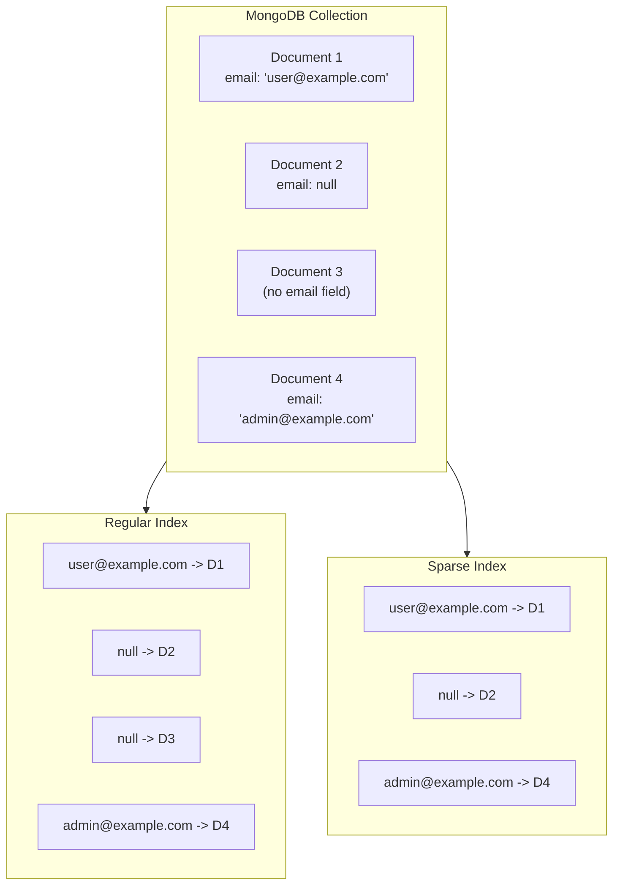
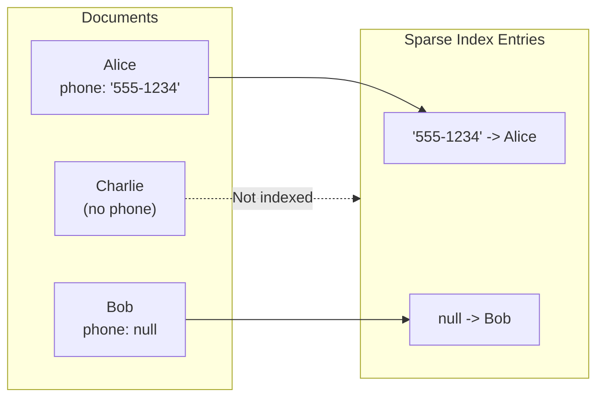
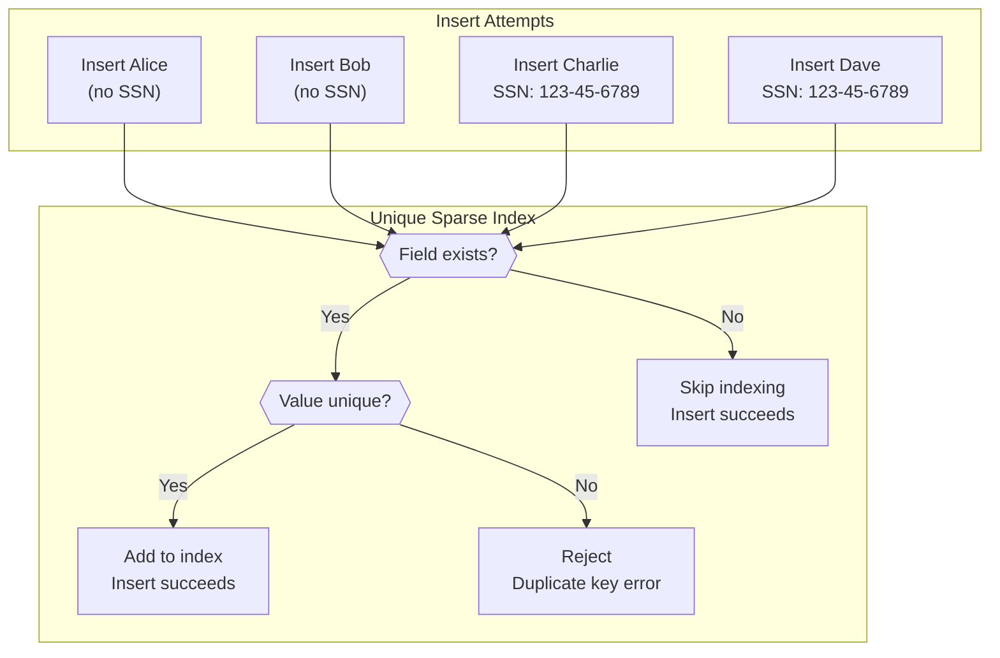
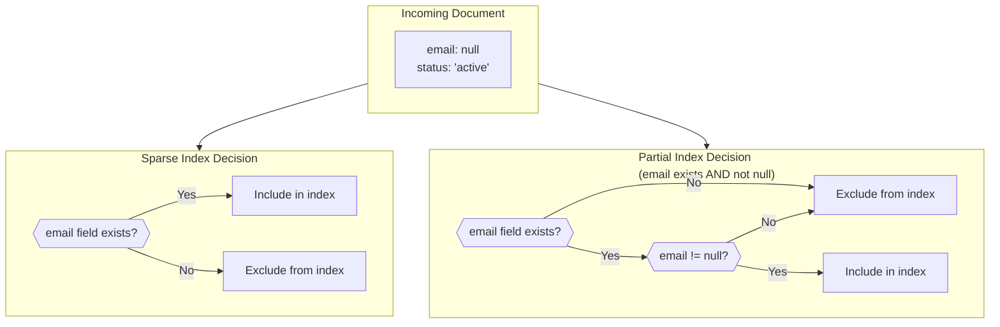
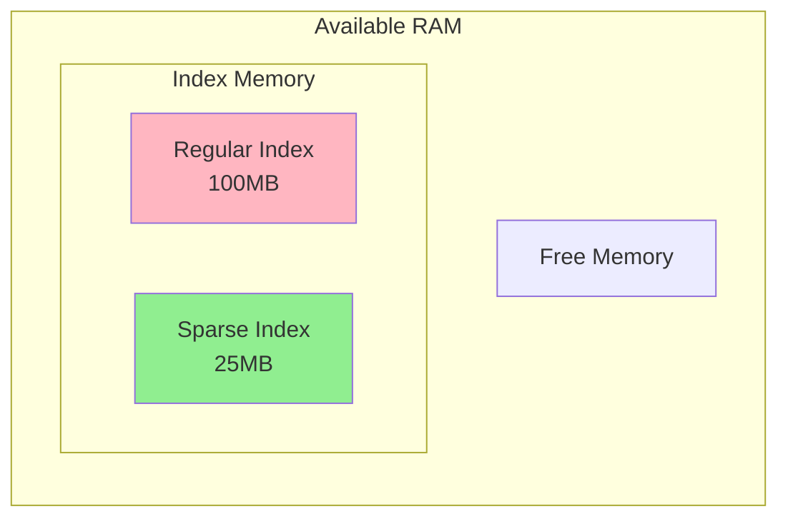

# How to Implement MongoDB Sparse Index Use Cases

Author: [nawazdhandala](https://github.com/nawazdhandala)

Tags: MongoDB, Sparse Index, Optional Fields, Performance

Description: Learn to implement sparse indexes for optional fields with null handling, unique constraints, and query optimization patterns.

---

## Introduction

When working with MongoDB collections that contain optional fields, traditional indexes can become inefficient. Every document gets indexed, including those where the field does not exist or is null. This wastes storage and slows down queries. MongoDB sparse indexes solve this problem by only indexing documents where the indexed field exists.

In this guide, we will explore how to implement sparse indexes effectively, understand their behavior with null values, leverage unique sparse indexes for optional unique constraints, and compare them with partial indexes.

## What is a Sparse Index?

A sparse index only contains entries for documents that have the indexed field, even if the field value is null. Documents that do not contain the indexed field are not included in the index.



The key difference is that Document 3, which lacks the email field entirely, is excluded from the sparse index but included in a regular index.

## Creating a Sparse Index

Creating a sparse index is straightforward. Use the `sparse: true` option when creating the index.

### Basic Sparse Index

```javascript
// Create a sparse index on the 'secondaryEmail' field
db.users.createIndex(
  { secondaryEmail: 1 },
  { sparse: true }
);

// Verify the index was created
db.users.getIndexes();
```

### Compound Sparse Index

You can also create compound sparse indexes. The index entry is created only if at least one of the indexed fields exists in the document.

```javascript
// Create a compound sparse index
db.users.createIndex(
  { department: 1, employeeId: 1 },
  { sparse: true }
);
```

**Important:** For compound sparse indexes, the document is indexed if it contains at least one of the keys. This behavior differs from single-field sparse indexes.

## Understanding Null Handling

One common misconception is that sparse indexes skip null values. They do not. Sparse indexes skip documents where the field is missing entirely, but they do include documents where the field exists with a null value.

```javascript
// Insert test documents
db.contacts.insertMany([
  { name: "Alice", phone: "555-1234" },
  { name: "Bob", phone: null },
  { name: "Charlie" }  // No phone field
]);

// Create sparse index
db.contacts.createIndex({ phone: 1 }, { sparse: true });

// This query uses the sparse index and finds Alice and Bob
db.contacts.find({ phone: { $ne: null } }).explain("executionStats");

// This query finds Bob (phone exists but is null)
db.contacts.find({ phone: null });
```



## Unique Sparse Indexes

One of the most powerful use cases for sparse indexes is implementing optional unique constraints. A regular unique index would fail if multiple documents lack the indexed field because MongoDB treats missing fields as null, causing duplicate key errors.

### The Problem with Regular Unique Indexes

```javascript
// This causes problems with optional fields
db.users.createIndex({ socialSecurityNumber: 1 }, { unique: true });

// First insert works
db.users.insertOne({ name: "Alice" });  // No SSN - treated as null

// Second insert fails - duplicate key error for null
db.users.insertOne({ name: "Bob" });  // Error: duplicate key
```

### The Solution: Unique Sparse Index

```javascript
// Create a unique sparse index
db.users.createIndex(
  { socialSecurityNumber: 1 },
  { unique: true, sparse: true }
);

// Now multiple documents without the field are allowed
db.users.insertOne({ name: "Alice" });  // Works - not indexed
db.users.insertOne({ name: "Bob" });    // Works - not indexed
db.users.insertOne({ name: "Charlie", socialSecurityNumber: "123-45-6789" });  // Works

// Duplicate SSN still fails as expected
db.users.insertOne({ name: "Dave", socialSecurityNumber: "123-45-6789" });  // Error
```



## Query Behavior with Sparse Indexes

Sparse indexes have specific query behavior that you must understand to use them effectively.

### When MongoDB Uses Sparse Indexes

MongoDB will use a sparse index when the query criteria guarantee that all matching documents are in the index.

```javascript
// Sparse index on 'optionalField'
db.collection.createIndex({ optionalField: 1 }, { sparse: true });

// MongoDB CAN use the sparse index for these queries
db.collection.find({ optionalField: "value" });
db.collection.find({ optionalField: { $gt: 10 } });
db.collection.find({ optionalField: { $exists: true } });

// MongoDB will NOT use the sparse index for these queries
db.collection.find({});  // Would miss documents without the field
db.collection.find({ optionalField: { $exists: false } });  // Needs missing docs
db.collection.find({ otherField: "value" });  // Different field
```

### Hint to Force Index Usage

In some cases, you might need to hint MongoDB to use a sparse index.

```javascript
// Force usage of the sparse index
db.collection.find({ optionalField: { $exists: true } })
  .hint({ optionalField: 1 });
```

### Sorting Considerations

Be careful when sorting by a sparse-indexed field. If documents without that field should appear in results, the sparse index cannot be used for the sort.

```javascript
// This sort cannot use a sparse index on 'score' if you want all documents
db.players.find({}).sort({ score: -1 });

// This sort CAN use the sparse index because we only want docs with scores
db.players.find({ score: { $exists: true } }).sort({ score: -1 });
```

## Sparse Index vs Partial Index

MongoDB 3.2 introduced partial indexes, which provide more flexibility than sparse indexes. Understanding when to use each is important.

### Comparison Table

| Feature | Sparse Index | Partial Index |
|---------|--------------|---------------|
| Filter Condition | Field must exist | Custom filter expression |
| Null Handling | Includes null values | Can exclude null values |
| Complex Conditions | Not supported | Supports $gt, $lt, $type, etc. |
| MongoDB Version | All versions | 3.2 and later |

### When to Use Sparse Indexes

- Simple requirement: only index documents where field exists
- Need backward compatibility with older MongoDB versions
- Quick solution for optional unique constraints

### When to Use Partial Indexes

- Need to exclude null values
- Want to index based on other conditions
- Need more precise control over which documents are indexed

```javascript
// Sparse index - indexes docs where email exists (including null values)
db.users.createIndex(
  { email: 1 },
  { sparse: true }
);

// Partial index - indexes only docs where email exists AND is not null
db.users.createIndex(
  { email: 1 },
  { partialFilterExpression: { email: { $exists: true, $ne: null } } }
);

// Partial index - indexes only active users with email
db.users.createIndex(
  { email: 1 },
  {
    partialFilterExpression: {
      email: { $exists: true },
      status: "active"
    }
  }
);
```



## Real-World Use Cases

### Use Case 1: Optional User Profile Fields

Many applications have optional profile fields like Twitter handle or LinkedIn URL.

```javascript
// Create sparse indexes for optional social profiles
db.users.createIndex({ twitterHandle: 1 }, { sparse: true, unique: true });
db.users.createIndex({ linkedinUrl: 1 }, { sparse: true, unique: true });

// Query users with Twitter profiles efficiently
db.users.find({ twitterHandle: { $exists: true } });
```

### Use Case 2: Soft Delete Pattern

When implementing soft deletes, you only want to index non-deleted documents.

```javascript
// Create a partial index (better for this case)
db.orders.createIndex(
  { orderNumber: 1 },
  {
    unique: true,
    partialFilterExpression: { deletedAt: { $exists: false } }
  }
);

// Deleted orders do not affect uniqueness
db.orders.updateOne(
  { orderNumber: "ORD-001" },
  { $set: { deletedAt: new Date() } }
);

// New order with same number works because original is soft-deleted
db.orders.insertOne({ orderNumber: "ORD-001" });
```

### Use Case 3: Multi-Tenant Optional Fields

In multi-tenant applications, some tenants might have custom fields that others do not use.

```javascript
// Tenant A uses 'customerId' field
// Tenant B uses 'clientCode' field
// Create sparse indexes for both

db.records.createIndex(
  { tenantId: 1, customerId: 1 },
  { sparse: true }
);

db.records.createIndex(
  { tenantId: 1, clientCode: 1 },
  { sparse: true }
);
```

## Performance Considerations

### Storage Savings

Sparse indexes can significantly reduce index size when many documents lack the indexed field.

```javascript
// Check index sizes
db.collection.stats().indexSizes;

// Example output showing sparse index is smaller
{
  "_id_": 1024000,
  "optionalField_1": 256000,  // Sparse - only 25% of docs have this field
  "requiredField_1": 1024000  // Regular - all docs indexed
}
```

### Memory Efficiency

Smaller indexes fit better in RAM, improving query performance.



### Index Build Time

Sparse indexes are faster to build because they process fewer documents.

```javascript
// Monitor index build progress
db.currentOp({ "command.createIndexes": { $exists: true } });
```

## Best Practices

1. **Analyze your data first** - Check what percentage of documents have the optional field before creating a sparse index.

```javascript
// Calculate percentage of documents with the field
const total = db.collection.countDocuments({});
const withField = db.collection.countDocuments({ optionalField: { $exists: true } });
const percentage = (withField / total * 100).toFixed(2);
print(`${percentage}% of documents have the field`);
```

2. **Consider query patterns** - Ensure your queries will actually benefit from the sparse index.

3. **Test query plans** - Use explain() to verify the index is being used.

```javascript
db.collection.find({ optionalField: "value" }).explain("executionStats");
```

4. **Monitor index usage** - Check if the index is being used over time.

```javascript
db.collection.aggregate([{ $indexStats: {} }]);
```

5. **Document your indexes** - Keep track of why each sparse index exists and what queries it supports.

## Conclusion

MongoDB sparse indexes are a powerful tool for optimizing collections with optional fields. They reduce storage overhead, improve memory efficiency, and enable unique constraints on optional fields. Understanding the difference between sparse and partial indexes helps you choose the right solution for your specific use case.

Key takeaways:
- Sparse indexes only index documents where the field exists
- Null values ARE included in sparse indexes
- Unique sparse indexes solve the optional unique field problem
- Partial indexes offer more flexibility for complex conditions
- Always verify index usage with explain() after creation

By implementing sparse indexes thoughtfully, you can significantly improve the performance of your MongoDB applications while reducing resource consumption.
