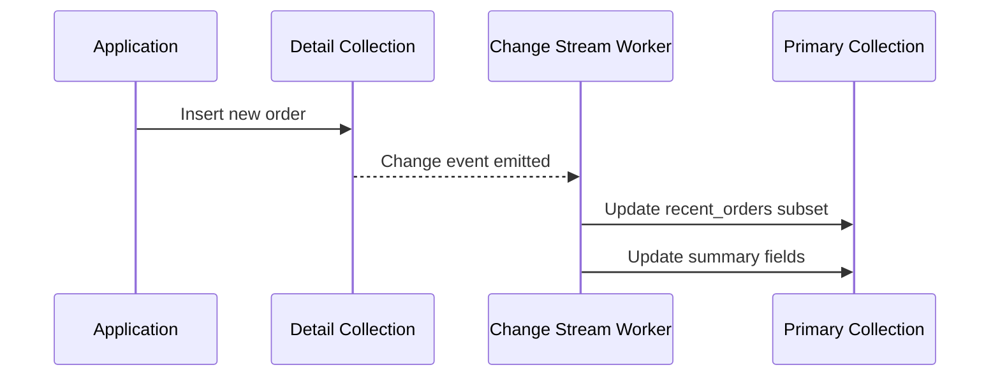
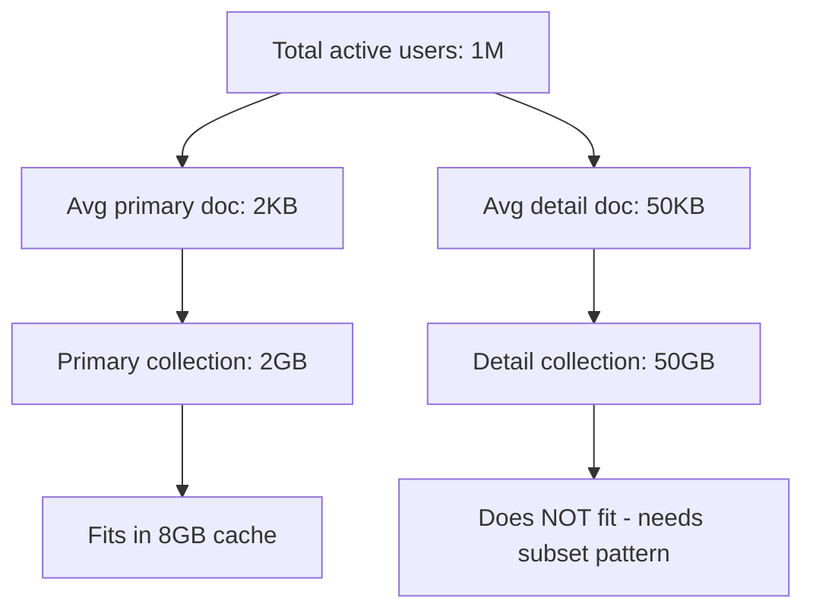

# How to Build MongoDB Subset Patterns

Author: [nawazdhandala](https://github.com/nawazdhandala)

Tags: MongoDB, Subset Pattern, Performance, Working Set

Description: Learn to implement subset patterns for keeping frequently accessed data in the working set with embedded summaries and referenced details.

---

MongoDB shines when the data your application needs most fits in RAM - the **working set**. But as documents grow with historical data, logs, or nested arrays, they push hot data out of memory and into disk reads. The subset pattern solves this by splitting documents into a small, frequently accessed portion and a larger, rarely touched archive.

## What Is the Working Set Problem?

MongoDB's WiredTiger storage engine keeps recently accessed data and indexes in a cache (default: 50% of RAM minus 1GB). When queries pull documents larger than necessary, you waste cache space on cold data and force the engine to evict hot documents.

Common symptoms:

- **Page faults spike** during normal traffic - not just batch jobs.
- **Latency percentiles diverge** - p50 stays low, but p95/p99 climb as cache misses increase.
- **Index scans slow down** even though indexes fit in RAM - the documents they point to do not.

The subset pattern attacks this by keeping only the fields your hot paths need in the primary document and storing the rest in a linked collection.

## Pattern Architecture

```mermaid
flowchart LR
    subgraph Primary Collection
        A[user_id: 123<br/>name: Alice<br/>email: alice@example.com<br/>recent_orders: 5 items<br/>profile_summary: {...}]
    end
    subgraph Detail Collection
        B[user_id: 123<br/>order_history: 1000 items<br/>activity_log: 50000 entries<br/>full_profile: {...}]
    end
    A -- "reference" --> B
```

The primary document holds:

- Fields read on every request (identity, status, preferences).
- A **bounded subset** of nested data (last N orders, recent notifications).
- A summary or aggregation of the detail data (total spend, activity count).

The detail document holds:

- Full history and logs.
- Large blobs, attachments, or audit trails.
- Anything accessed only during drill-down or export operations.

## Step-by-Step Implementation

### 1. Identify Hot and Cold Fields

Profile your queries with `explain()` and MongoDB's profiler. Look for:

- Which fields appear in projections across your most common endpoints.
- Which nested arrays grow unbounded over time.
- Which fields are only accessed by background jobs or admin tools.

```javascript
// Enable profiling for slow queries (> 100ms)
db.setProfilingLevel(1, { slowms: 100 });

// Later, inspect the system.profile collection
db.system.profile.find({ ns: "mydb.users" }).sort({ ts: -1 }).limit(10);
```

### 2. Design the Primary Document

Keep the primary document small and predictable. Use a fixed-size array for the subset.

```javascript
// Primary document - lives in "users" collection
{
  _id: ObjectId("..."),
  user_id: "u_12345",
  email: "alice@example.com",
  name: "Alice Chen",
  status: "active",
  created_at: ISODate("2024-03-15T10:00:00Z"),

  // Subset: only the 5 most recent orders
  recent_orders: [
    { order_id: "ord_999", total: 149.99, date: ISODate("2026-01-28") },
    { order_id: "ord_998", total: 89.50, date: ISODate("2026-01-25") },
    { order_id: "ord_997", total: 210.00, date: ISODate("2026-01-20") },
    { order_id: "ord_996", total: 45.00, date: ISODate("2026-01-15") },
    { order_id: "ord_995", total: 320.00, date: ISODate("2026-01-10") }
  ],

  // Summary fields computed from detail data
  total_orders: 127,
  lifetime_spend: 15420.50,
  last_activity: ISODate("2026-01-28T14:30:00Z"),

  // Reference to detail document
  detail_ref: ObjectId("...detail_id...")
}
```

### 3. Design the Detail Document

The detail collection stores the full dataset. Link it back to the primary document.

```javascript
// Detail document - lives in "user_details" collection
{
  _id: ObjectId("...detail_id..."),
  user_id: "u_12345",

  // Full order history
  order_history: [
    { order_id: "ord_999", total: 149.99, date: ISODate("2026-01-28"), items: [...] },
    { order_id: "ord_998", total: 89.50, date: ISODate("2026-01-25"), items: [...] },
    // ... 125 more orders
  ],

  // Activity log - potentially thousands of entries
  activity_log: [
    { action: "login", timestamp: ISODate("2026-01-28T14:30:00Z"), ip: "..." },
    { action: "view_product", timestamp: ISODate("2026-01-28T14:31:00Z"), product_id: "..." },
    // ... many more entries
  ],

  // Extended profile data rarely needed
  preferences: { ... },
  notification_history: [ ... ],
  audit_trail: [ ... ]
}
```

### 4. Create Indexes for Both Collections

Index the primary collection for your hot queries and the detail collection for lookups.

```javascript
// Primary collection indexes
db.users.createIndex({ user_id: 1 }, { unique: true });
db.users.createIndex({ email: 1 }, { unique: true });
db.users.createIndex({ status: 1, last_activity: -1 });

// Detail collection index - for joining back
db.user_details.createIndex({ user_id: 1 }, { unique: true });
```

## Synchronization Strategies

The subset must stay consistent with the detail data. Here are three approaches, ranked by complexity.

### Strategy 1: Update Both in a Transaction

Use multi-document transactions when you need strong consistency.

```javascript
async function addOrder(userId, order) {
  const session = client.startSession();

  try {
    await session.withTransaction(async () => {
      // 1. Insert into detail collection
      await db.user_details.updateOne(
        { user_id: userId },
        { $push: { order_history: order } },
        { session }
      );

      // 2. Update primary document subset and summary
      await db.users.updateOne(
        { user_id: userId },
        {
          $push: {
            recent_orders: {
              $each: [{
                order_id: order.order_id,
                total: order.total,
                date: order.date
              }],
              $slice: -5,  // Keep only 5 most recent
              $sort: { date: 1 }
            }
          },
          $inc: {
            total_orders: 1,
            lifetime_spend: order.total
          },
          $set: { last_activity: new Date() }
        },
        { session }
      );
    });
  } finally {
    await session.endSession();
  }
}
```

### Strategy 2: Eventual Consistency with Change Streams

For high-throughput systems, update the detail collection first and let a change stream worker sync the subset.



```javascript
// Change stream worker
const changeStream = db.user_details.watch([
  { $match: { operationType: { $in: ["insert", "update"] } } }
]);

changeStream.on("change", async (change) => {
  const userId = change.fullDocument?.user_id;
  if (!userId) return;

  // Fetch latest 5 orders from detail
  const detail = await db.user_details.findOne(
    { user_id: userId },
    { projection: { order_history: { $slice: -5 } } }
  );

  // Rebuild subset in primary document
  const recentOrders = detail.order_history.map(o => ({
    order_id: o.order_id,
    total: o.total,
    date: o.date
  }));

  await db.users.updateOne(
    { user_id: userId },
    {
      $set: {
        recent_orders: recentOrders,
        last_activity: new Date()
      }
    }
  );
});
```

### Strategy 3: Scheduled Aggregation Jobs

For summaries that do not need real-time accuracy (dashboards, reports), compute them periodically.

```javascript
// Run every hour to recompute summaries
async function recomputeUserSummaries() {
  const pipeline = [
    {
      $group: {
        _id: "$user_id",
        total_orders: { $sum: 1 },
        lifetime_spend: { $sum: "$total" },
        recent_orders: {
          $topN: {
            n: 5,
            sortBy: { date: -1 },
            output: {
              order_id: "$order_id",
              total: "$total",
              date: "$date"
            }
          }
        }
      }
    },
    {
      $merge: {
        into: "users",
        on: "_id",
        whenMatched: "merge",
        whenNotMatched: "discard"
      }
    }
  ];

  await db.orders.aggregate(pipeline).toArray();
}
```

## Working Set Sizing

Right-size your working set by measuring document sizes and cache utilization.

### Measure Document Sizes

```javascript
// Check average document size in primary collection
db.users.aggregate([
  { $sample: { size: 1000 } },
  { $project: { size: { $bsonSize: "$$ROOT" } } },
  { $group: {
      _id: null,
      avgSize: { $avg: "$size" },
      maxSize: { $max: "$size" },
      minSize: { $min: "$size" }
    }
  }
]);

// Compare with detail collection
db.user_details.aggregate([
  { $sample: { size: 1000 } },
  { $project: { size: { $bsonSize: "$$ROOT" } } },
  { $group: {
      _id: null,
      avgSize: { $avg: "$size" },
      maxSize: { $max: "$size" }
    }
  }
]);
```

### Monitor Cache Utilization

```javascript
// Check WiredTiger cache stats
db.serverStatus().wiredTiger.cache

// Key metrics to watch:
// - "bytes currently in the cache"
// - "tracked dirty bytes in the cache"
// - "pages evicted because they exceeded the in-memory maximum"
```

### Calculate Working Set Fit



**Rule of thumb:** Your primary collection plus its indexes should fit in 60-70% of WiredTiger cache. Leave room for query execution buffers and dirty page headroom.

## Cache Optimization Techniques

### 1. Use Projections Religiously

Even with the subset pattern, always project only the fields you need.

```javascript
// Bad - pulls entire document into cache
const user = await db.users.findOne({ user_id: "u_12345" });

// Good - pulls only needed fields
const user = await db.users.findOne(
  { user_id: "u_12345" },
  { projection: { name: 1, email: 1, recent_orders: 1 } }
);
```

### 2. Covered Queries for Hot Paths

Design indexes that cover your most frequent queries entirely.

```javascript
// Create compound index that covers the query
db.users.createIndex({
  user_id: 1,
  name: 1,
  email: 1,
  status: 1
});

// This query is fully covered - no document fetch needed
const user = await db.users.findOne(
  { user_id: "u_12345" },
  { projection: { name: 1, email: 1, status: 1, _id: 0 } }
);
```

### 3. TTL Indexes for Automatic Cleanup

Prevent detail documents from growing unbounded.

```javascript
// Automatically delete activity log entries older than 90 days
db.user_details.createIndex(
  { "activity_log.timestamp": 1 },
  { expireAfterSeconds: 90 * 24 * 60 * 60 }
);
```

### 4. Bucket Pattern for Time-Series Subsets

For time-based data, combine subset pattern with bucketing.

```javascript
// Instead of one massive activity_log array, bucket by day
{
  _id: ObjectId("..."),
  user_id: "u_12345",
  bucket_date: ISODate("2026-01-28T00:00:00Z"),
  activities: [
    { action: "login", timestamp: ISODate("2026-01-28T08:00:00Z") },
    { action: "purchase", timestamp: ISODate("2026-01-28T14:30:00Z") },
    // ... activities for this day only
  ],
  count: 47
}
```

## Decision Matrix: When to Use Subset Pattern

| Scenario | Use Subset Pattern? | Notes |
| --- | --- | --- |
| Documents > 5KB with unbounded arrays | Yes | Split arrays into detail collection |
| 80/20 access pattern (few fields accessed often) | Yes | Embed hot fields, reference cold |
| All fields accessed equally | No | Keep single document |
| Strong consistency required | Yes, with transactions | Use multi-document transactions |
| High write throughput | Yes, with change streams | Eventually consistent sync |
| Read-heavy, write-light | Yes | Simple pattern, big cache wins |

## Measuring Success

After implementing the subset pattern, track these metrics:

```javascript
// Before and after comparison
const metrics = {
  // Query performance
  avgQueryTimeMs: db.users.find({ status: "active" }).explain("executionStats")
    .executionStats.executionTimeMillis,

  // Cache efficiency
  cacheHitRatio: (() => {
    const stats = db.serverStatus().wiredTiger.cache;
    const hits = stats["pages read into cache"];
    const misses = stats["pages read into cache requiring lookaside entries"];
    return hits / (hits + misses);
  })(),

  // Document sizes
  avgDocSize: db.users.aggregate([
    { $sample: { size: 100 } },
    { $project: { size: { $bsonSize: "$$ROOT" } } },
    { $group: { _id: null, avg: { $avg: "$size" } } }
  ]).toArray()[0].avg
};
```

Target outcomes:

- Primary document size drops 80-90% compared to the monolithic design.
- Cache hit ratio improves from sub-90% to 95%+.
- p99 query latency drops as page faults decrease.

---

**Bottom line:** The subset pattern trades query simplicity for cache efficiency. When your documents outgrow RAM, splitting hot and cold data into separate collections keeps your working set small, your latency predictable, and your on-call rotation quiet. Start by profiling which fields actually get read, design bounded subsets, and pick a sync strategy that matches your consistency needs.
