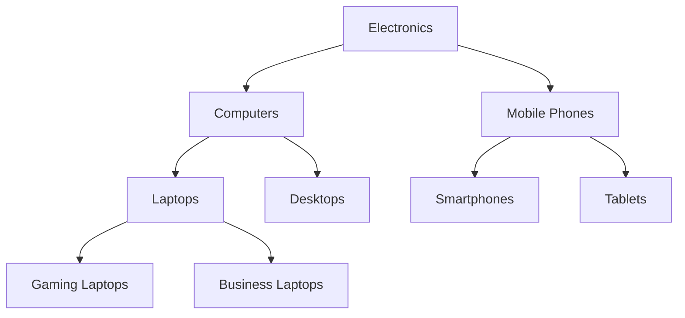
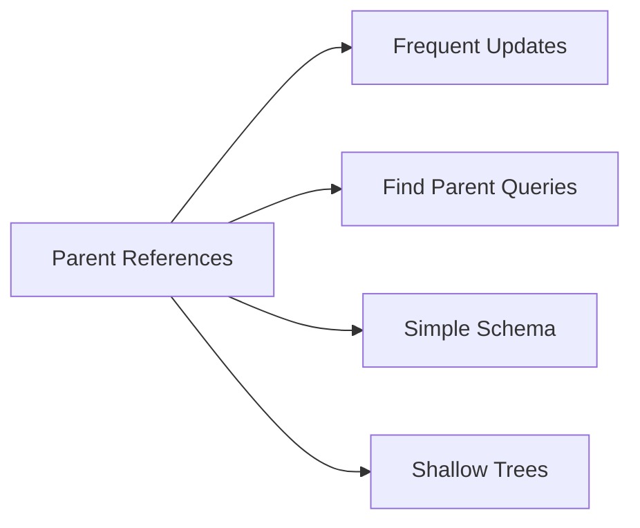
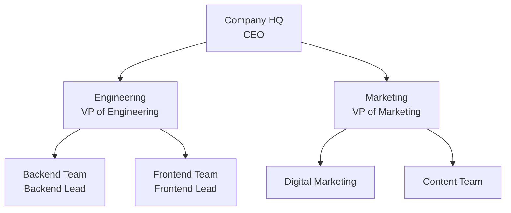
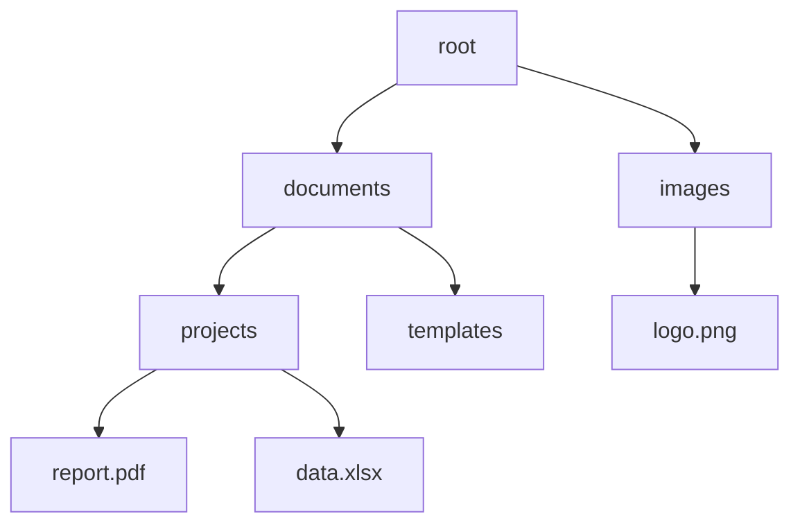
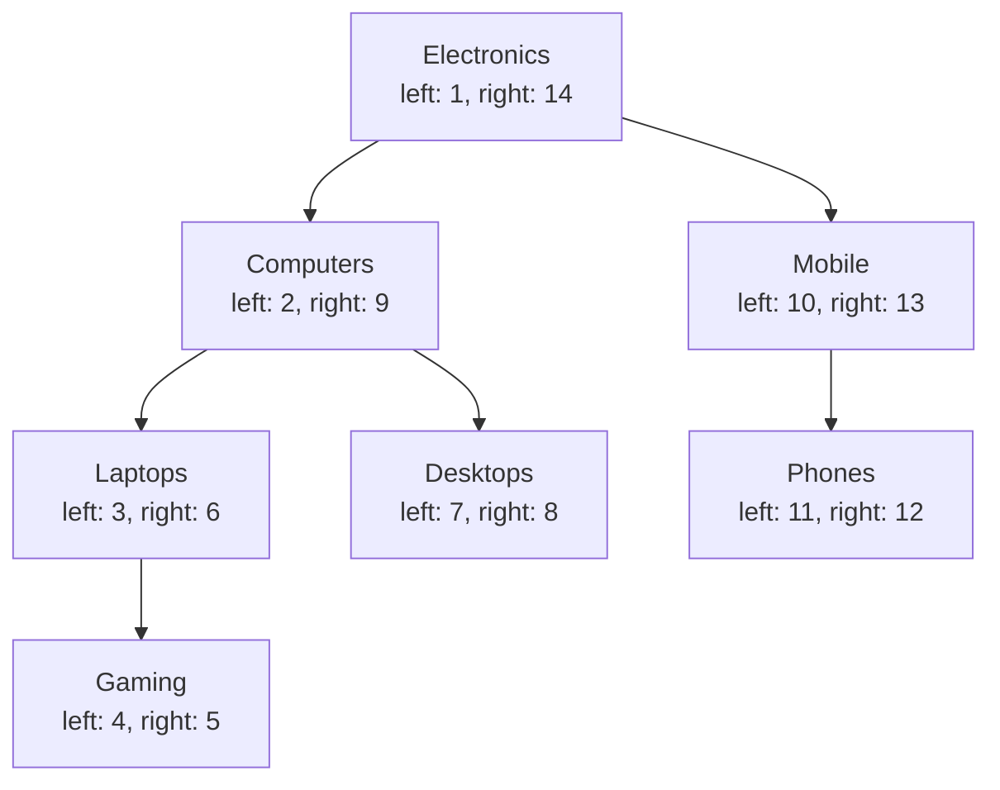
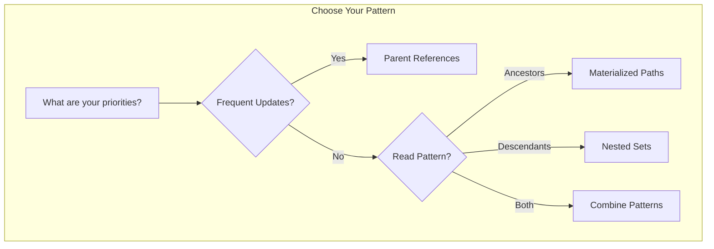

# How to Build MongoDB Tree Structures

Author: [nawazdhandala](https://github.com/nawazdhandala)

Tags: MongoDB, Schema Design, Tree Structures, Data Modeling

Description: Learn how to model hierarchical data in MongoDB with various tree patterns.

---

Hierarchical data is everywhere in modern applications. From organizational charts and category trees to file systems and comment threads, tree structures are fundamental to how we organize information. MongoDB offers several powerful patterns for modeling these relationships. In this post, we will explore four common approaches: parent references, child references, nested sets, and materialized paths.

## Understanding Tree Structures

Before diving into implementation details, let us visualize what a typical tree structure looks like. Consider a product category hierarchy for an e-commerce platform:



Each approach we discuss has different strengths depending on your query patterns and update frequency.

## Pattern 1: Parent References

The parent reference pattern is the simplest and most intuitive approach. Each document stores a reference to its parent document.

### Schema Design

```javascript
// Parent Reference Schema for Categories
// Each document stores a reference to its parent's _id

const categorySchema = {
  _id: ObjectId,           // Unique identifier for this category
  name: String,            // Category name (e.g., "Laptops")
  parent: ObjectId,        // Reference to parent category (_id), null for root
  description: String,     // Optional description
  createdAt: Date          // Timestamp
};

// Example documents
const categories = [
  {
    _id: ObjectId("507f1f77bcf86cd799439011"),
    name: "Electronics",
    parent: null,  // Root category has no parent
    description: "All electronic products",
    createdAt: new Date("2024-01-01")
  },
  {
    _id: ObjectId("507f1f77bcf86cd799439012"),
    name: "Computers",
    parent: ObjectId("507f1f77bcf86cd799439011"),  // Parent is Electronics
    description: "Computing devices",
    createdAt: new Date("2024-01-02")
  },
  {
    _id: ObjectId("507f1f77bcf86cd799439013"),
    name: "Laptops",
    parent: ObjectId("507f1f77bcf86cd799439012"),  // Parent is Computers
    description: "Portable computers",
    createdAt: new Date("2024-01-03")
  }
];
```

### Common Operations

```javascript
// Find all root categories (categories with no parent)
db.categories.find({ parent: null });

// Find immediate children of a specific category
db.categories.find({
  parent: ObjectId("507f1f77bcf86cd799439011")
});

// Find the parent of a category
const category = db.categories.findOne({
  _id: ObjectId("507f1f77bcf86cd799439013")
});
const parent = db.categories.findOne({
  _id: category.parent
});

// Move a category to a new parent (simple update)
db.categories.updateOne(
  { _id: ObjectId("507f1f77bcf86cd799439013") },
  { $set: { parent: ObjectId("507f1f77bcf86cd799439014") } }
);
```

### Finding All Ancestors (Using $graphLookup)

MongoDB's `$graphLookup` aggregation stage makes it easy to traverse the tree:

```javascript
// Find all ancestors of "Laptops" category
db.categories.aggregate([
  // Start with the Laptops category
  { $match: { name: "Laptops" } },

  // Recursively find all ancestors
  {
    $graphLookup: {
      from: "categories",           // Collection to search
      startWith: "$parent",         // Start from the parent field
      connectFromField: "parent",   // Follow the parent field
      connectToField: "_id",        // Match against _id
      as: "ancestors",              // Output array name
      depthField: "depth"           // Track depth level
    }
  }
]);

// Result includes the original document plus ancestors array:
// {
//   _id: ObjectId("..."),
//   name: "Laptops",
//   parent: ObjectId("..."),
//   ancestors: [
//     { _id: ..., name: "Computers", depth: 0 },
//     { _id: ..., name: "Electronics", depth: 1 }
//   ]
// }
```

### When to Use Parent References



**Advantages:**
- Simple to implement and understand
- Easy to update (moving nodes requires changing one field)
- Efficient for finding immediate parent

**Disadvantages:**
- Finding all descendants requires multiple queries or `$graphLookup`
- Not ideal for very deep trees with frequent ancestor queries

## Pattern 2: Child References

The child reference pattern stores an array of references to child documents within each parent.

### Schema Design

```javascript
// Child Reference Schema for Organization Hierarchy
// Each document stores an array of its children's _ids

const departmentSchema = {
  _id: ObjectId,           // Unique identifier
  name: String,            // Department name
  children: [ObjectId],    // Array of child department _ids
  manager: String,         // Department manager name
  budget: Number           // Department budget
};

// Example: Company organization structure
const departments = [
  {
    _id: ObjectId("60a1b2c3d4e5f6g7h8i9j0k1"),
    name: "Company HQ",
    children: [
      ObjectId("60a1b2c3d4e5f6g7h8i9j0k2"),  // Engineering
      ObjectId("60a1b2c3d4e5f6g7h8i9j0k3")   // Marketing
    ],
    manager: "CEO",
    budget: 10000000
  },
  {
    _id: ObjectId("60a1b2c3d4e5f6g7h8i9j0k2"),
    name: "Engineering",
    children: [
      ObjectId("60a1b2c3d4e5f6g7h8i9j0k4"),  // Backend Team
      ObjectId("60a1b2c3d4e5f6g7h8i9j0k5")   // Frontend Team
    ],
    manager: "VP of Engineering",
    budget: 5000000
  },
  {
    _id: ObjectId("60a1b2c3d4e5f6g7h8i9j0k4"),
    name: "Backend Team",
    children: [],  // Leaf node, no children
    manager: "Backend Lead",
    budget: 2000000
  }
];
```

### Organization Hierarchy Visualization



### Common Operations

```javascript
// Find all immediate children of a department
const department = db.departments.findOne({ name: "Engineering" });
const children = db.departments.find({
  _id: { $in: department.children }
});

// Add a new child department
db.departments.updateOne(
  { _id: ObjectId("60a1b2c3d4e5f6g7h8i9j0k2") },
  {
    $push: {
      children: ObjectId("60a1b2c3d4e5f6g7h8i9j0k6")
    }
  }
);

// Remove a child department
db.departments.updateOne(
  { _id: ObjectId("60a1b2c3d4e5f6g7h8i9j0k2") },
  {
    $pull: {
      children: ObjectId("60a1b2c3d4e5f6g7h8i9j0k4")
    }
  }
);

// Find all descendants using $graphLookup
db.departments.aggregate([
  { $match: { name: "Company HQ" } },
  {
    $graphLookup: {
      from: "departments",
      startWith: "$children",       // Start from children array
      connectFromField: "children", // Follow children arrays
      connectToField: "_id",        // Match against _id
      as: "allDescendants",
      maxDepth: 10,                 // Limit recursion depth
      depthField: "level"
    }
  }
]);
```

### When to Use Child References

**Advantages:**
- Single query to find all immediate children
- Natural for displaying tree nodes with their children
- Good for trees where you frequently traverse downward

**Disadvantages:**
- Finding parent requires additional query or denormalization
- Moving nodes requires updating both old and new parent
- Array size limits (16MB document size) can be a concern for wide trees

## Pattern 3: Materialized Paths

The materialized path pattern stores the full path from the root to each node as a string. This is excellent for breadcrumb navigation and finding all ancestors or descendants.

### Schema Design

```javascript
// Materialized Path Schema for File System
// Each document stores its full path from root

const fileSchema = {
  _id: ObjectId,           // Unique identifier
  name: String,            // File or folder name
  path: String,            // Full path from root (comma or slash separated)
  type: String,            // "folder" or "file"
  size: Number,            // Size in bytes (for files)
  createdAt: Date
};

// Example: File system structure
const files = [
  {
    _id: ObjectId("70a1b2c3d4e5f6g7h8i9j0k1"),
    name: "root",
    path: "root",
    type: "folder",
    createdAt: new Date("2024-01-01")
  },
  {
    _id: ObjectId("70a1b2c3d4e5f6g7h8i9j0k2"),
    name: "documents",
    path: "root,documents",
    type: "folder",
    createdAt: new Date("2024-01-02")
  },
  {
    _id: ObjectId("70a1b2c3d4e5f6g7h8i9j0k3"),
    name: "projects",
    path: "root,documents,projects",
    type: "folder",
    createdAt: new Date("2024-01-03")
  },
  {
    _id: ObjectId("70a1b2c3d4e5f6g7h8i9j0k4"),
    name: "report.pdf",
    path: "root,documents,projects,report.pdf",
    type: "file",
    size: 1024000,
    createdAt: new Date("2024-01-04")
  }
];
```

### File System Visualization



### Common Operations

```javascript
// Create an index for efficient path queries
db.files.createIndex({ path: 1 });

// Find all descendants of "documents" folder
// Uses regex to match paths starting with "root,documents,"
db.files.find({
  path: { $regex: /^root,documents,/ }
});

// Find all ancestors of a file (parse the path)
const file = db.files.findOne({ name: "report.pdf" });
const pathParts = file.path.split(",");
// pathParts = ["root", "documents", "projects", "report.pdf"]

// Build ancestor paths and query
const ancestorPaths = [];
for (let i = 1; i < pathParts.length; i++) {
  ancestorPaths.push(pathParts.slice(0, i).join(","));
}
// ancestorPaths = ["root", "root,documents", "root,documents,projects"]

const ancestors = db.files.find({
  path: { $in: ancestorPaths }
});

// Find immediate children of a folder
db.files.find({
  // Match paths that are exactly one level deeper
  path: { $regex: /^root,documents,[^,]+$/ }
});

// Move a subtree to a new location
// This requires updating paths of all descendants
const oldPath = "root,documents,projects";
const newPath = "root,archive,projects";

db.files.updateMany(
  { path: { $regex: /^root,documents,projects/ } },
  [
    {
      $set: {
        path: {
          $replaceOne: {
            input: "$path",
            find: oldPath,
            replacement: newPath
          }
        }
      }
    }
  ]
);
```

### Breadcrumb Navigation Example

```javascript
// Generate breadcrumb for a product category page
async function getBreadcrumb(categoryPath) {
  // Split the path into parts
  const parts = categoryPath.split(",");

  // Build all ancestor paths
  const paths = [];
  for (let i = 1; i <= parts.length; i++) {
    paths.push(parts.slice(0, i).join(","));
  }

  // Fetch all categories in the breadcrumb
  const categories = await db.categories.find({
    path: { $in: paths }
  }).sort({ path: 1 }).toArray();

  return categories;
}

// Usage
const breadcrumb = await getBreadcrumb(
  "Electronics,Computers,Laptops,Gaming Laptops"
);
// Returns: [Electronics, Computers, Laptops, Gaming Laptops]
```

### When to Use Materialized Paths

**Advantages:**
- Single query for all ancestors or descendants
- Perfect for breadcrumb navigation
- Efficient regex queries with proper indexing
- Easy to determine depth (count separators)

**Disadvantages:**
- Moving subtrees requires updating all descendants
- Path string can become long in deep trees
- Regex queries may not use indexes efficiently without anchoring

## Pattern 4: Nested Sets

The nested set model assigns each node a left and right number based on a depth-first traversal. This creates ranges that elegantly represent the tree structure.

### Understanding Nested Sets



The key insight: a node's descendants all have left/right values within the parent's range.

### Schema Design

```javascript
// Nested Set Schema
// Each document stores left and right boundary values

const categorySchema = {
  _id: ObjectId,
  name: String,
  left: Number,    // Left boundary value
  right: Number,   // Right boundary value
  depth: Number    // Optional: depth level for convenience
};

// Example: Category tree with nested set values
const categories = [
  {
    _id: ObjectId("80a1b2c3d4e5f6g7h8i9j0k1"),
    name: "Electronics",
    left: 1,
    right: 14,
    depth: 0
  },
  {
    _id: ObjectId("80a1b2c3d4e5f6g7h8i9j0k2"),
    name: "Computers",
    left: 2,
    right: 9,
    depth: 1
  },
  {
    _id: ObjectId("80a1b2c3d4e5f6g7h8i9j0k3"),
    name: "Laptops",
    left: 3,
    right: 6,
    depth: 2
  },
  {
    _id: ObjectId("80a1b2c3d4e5f6g7h8i9j0k4"),
    name: "Gaming Laptops",
    left: 4,
    right: 5,
    depth: 3
  },
  {
    _id: ObjectId("80a1b2c3d4e5f6g7h8i9j0k5"),
    name: "Desktops",
    left: 7,
    right: 8,
    depth: 2
  },
  {
    _id: ObjectId("80a1b2c3d4e5f6g7h8i9j0k6"),
    name: "Mobile",
    left: 10,
    right: 13,
    depth: 1
  },
  {
    _id: ObjectId("80a1b2c3d4e5f6g7h8i9j0k7"),
    name: "Phones",
    left: 11,
    right: 12,
    depth: 2
  }
];
```

### Common Operations

```javascript
// Create indexes for efficient queries
db.categories.createIndex({ left: 1 });
db.categories.createIndex({ right: 1 });

// Find ALL descendants of a node (single efficient query!)
// Descendants have left > parent.left AND right < parent.right
const computers = db.categories.findOne({ name: "Computers" });
// computers.left = 2, computers.right = 9

db.categories.find({
  left: { $gt: computers.left },   // left > 2
  right: { $lt: computers.right }  // right < 9
});
// Returns: Laptops, Gaming Laptops, Desktops

// Find ALL ancestors of a node
// Ancestors have left < node.left AND right > node.right
const gamingLaptops = db.categories.findOne({ name: "Gaming Laptops" });
// gamingLaptops.left = 4, gamingLaptops.right = 5

db.categories.find({
  left: { $lt: gamingLaptops.left },   // left < 4
  right: { $gt: gamingLaptops.right }  // right > 5
}).sort({ left: 1 });
// Returns: Electronics, Computers, Laptops (in order from root)

// Check if a node is a leaf (no children)
// Leaf nodes have right = left + 1
db.categories.find({
  $expr: { $eq: ["$right", { $add: ["$left", 1] }] }
});

// Count descendants without fetching them
const descendantCount = (computers.right - computers.left - 1) / 2;
// (9 - 2 - 1) / 2 = 3 descendants
```

### Inserting a New Node

Inserting into a nested set requires updating multiple documents:

```javascript
// Insert a new category "Ultrabooks" under "Laptops"
async function insertNode(parentName, newNodeName) {
  const session = db.getMongo().startSession();

  try {
    session.startTransaction();

    // Find the parent node
    const parent = await db.categories.findOne(
      { name: parentName },
      { session }
    );

    // New node will be inserted at parent's right position
    const newLeft = parent.right;
    const newRight = parent.right + 1;

    // Make room: increment left values >= parent.right by 2
    await db.categories.updateMany(
      { left: { $gte: parent.right } },
      { $inc: { left: 2 } },
      { session }
    );

    // Make room: increment right values >= parent.right by 2
    await db.categories.updateMany(
      { right: { $gte: parent.right } },
      { $inc: { right: 2 } },
      { session }
    );

    // Insert the new node
    await db.categories.insertOne({
      name: newNodeName,
      left: newLeft,
      right: newRight,
      depth: parent.depth + 1
    }, { session });

    await session.commitTransaction();
  } catch (error) {
    await session.abortTransaction();
    throw error;
  } finally {
    session.endSession();
  }
}

// Usage
await insertNode("Laptops", "Ultrabooks");
```

### When to Use Nested Sets

**Advantages:**
- Extremely fast queries for ancestors and descendants
- Single query returns entire subtrees
- Easy to calculate descendant count without queries
- Excellent read performance

**Disadvantages:**
- Complex and expensive inserts/updates/deletes
- Requires updating many documents for structural changes
- Best for read-heavy, write-light scenarios
- Requires transactions for safe updates

## Comparison Summary



| Pattern | Find Parent | Find Children | Find Ancestors | Find Descendants | Insert/Update |
|---------|-------------|---------------|----------------|------------------|---------------|
| Parent References | Fast | Medium | Slow* | Slow* | Fast |
| Child References | Medium | Fast | Slow* | Slow* | Medium |
| Materialized Paths | Medium | Medium | Fast | Fast | Medium |
| Nested Sets | Medium | Medium | Fast | Fast | Slow |

*Can be improved with `$graphLookup`

## Hybrid Approach: Combining Patterns

In practice, you might combine patterns for optimal performance:

```javascript
// Hybrid Schema: Parent Reference + Materialized Path
const categorySchema = {
  _id: ObjectId,
  name: String,
  parent: ObjectId,           // For easy parent lookups
  path: String,               // For ancestor/descendant queries
  depth: Number,              // For level-based queries
  ancestorIds: [ObjectId]     // For efficient ancestor lookups
};

// Example document
const category = {
  _id: ObjectId("90a1b2c3d4e5f6g7h8i9j0k1"),
  name: "Gaming Laptops",
  parent: ObjectId("90a1b2c3d4e5f6g7h8i9j0k2"),
  path: "Electronics,Computers,Laptops,Gaming Laptops",
  depth: 3,
  ancestorIds: [
    ObjectId("90a1b2c3d4e5f6g7h8i9j0k3"),  // Electronics
    ObjectId("90a1b2c3d4e5f6g7h8i9j0k4"),  // Computers
    ObjectId("90a1b2c3d4e5f6g7h8i9j0k2")   // Laptops
  ]
};
```

## Best Practices

1. **Index your tree fields**: Always create indexes on `parent`, `path`, `left`, `right`, or `children` fields.

2. **Use transactions**: When updating tree structures, especially with nested sets, use transactions to maintain consistency.

3. **Denormalize when needed**: Store computed fields like `depth` or `ancestorCount` if you query them frequently.

4. **Consider your read/write ratio**: Nested sets excel for read-heavy workloads; parent references are better for write-heavy scenarios.

5. **Limit tree depth**: Very deep trees can cause performance issues with any pattern. Consider flattening or paginating if possible.

```javascript
// Example: Creating indexes for a hybrid schema
db.categories.createIndex({ parent: 1 });
db.categories.createIndex({ path: 1 });
db.categories.createIndex({ depth: 1 });
db.categories.createIndex({ ancestorIds: 1 });
```

## Conclusion

MongoDB provides flexible options for modeling hierarchical data. The right choice depends on your specific use case:

- **Parent References**: Best for simple hierarchies with frequent updates
- **Child References**: Ideal when you often need to display nodes with their children
- **Materialized Paths**: Perfect for breadcrumb navigation and path-based queries
- **Nested Sets**: Optimal for read-heavy scenarios requiring fast subtree queries

Consider combining patterns for complex applications, and always benchmark with realistic data volumes to ensure your chosen approach scales appropriately.

## Further Reading

- [MongoDB Documentation on Tree Structures](https://www.mongodb.com/docs/manual/applications/data-models-tree-structures/)
- [MongoDB Aggregation Pipeline](https://www.mongodb.com/docs/manual/aggregation/)
- [$graphLookup Documentation](https://www.mongodb.com/docs/manual/reference/operator/aggregation/graphLookup/)
