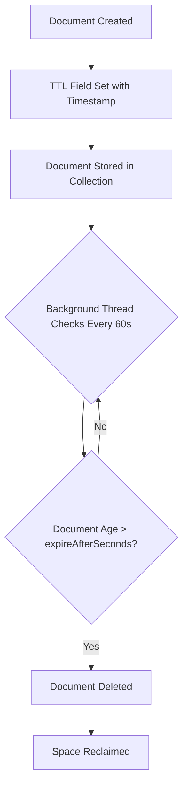
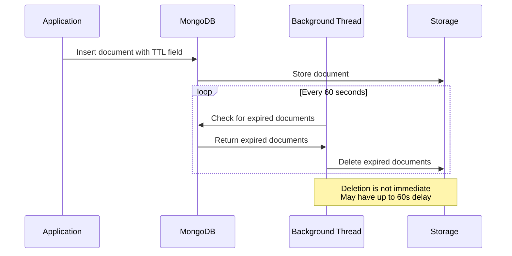
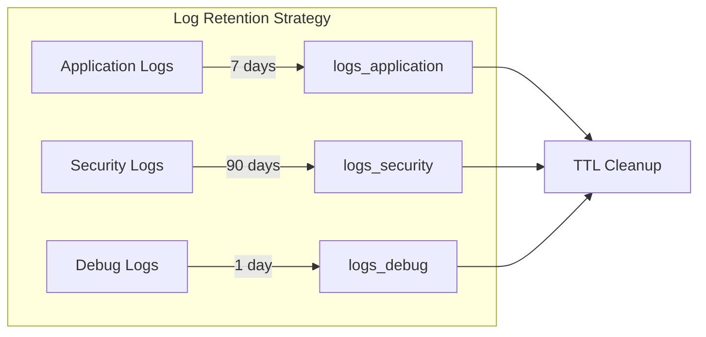
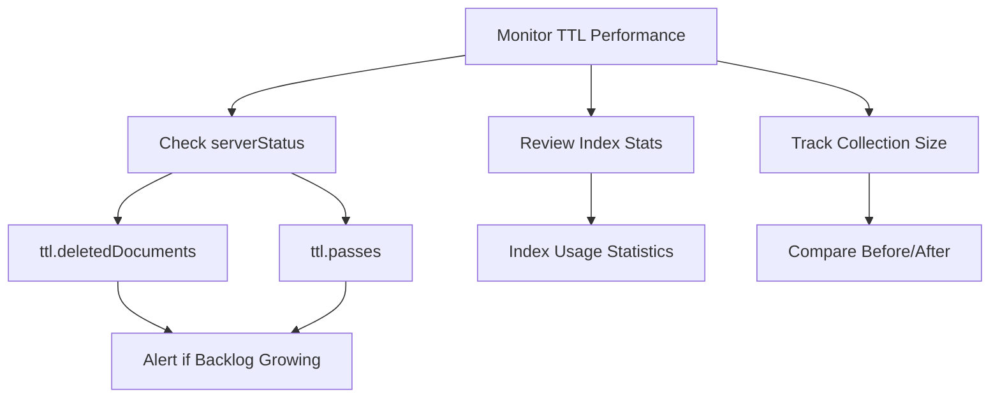
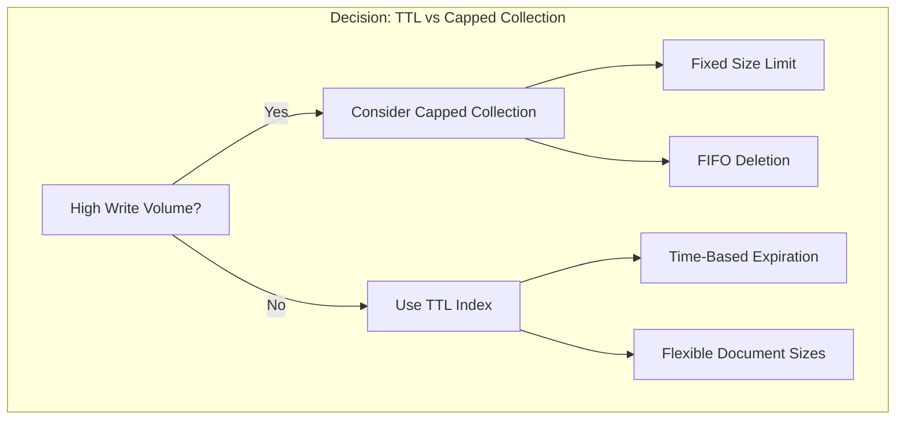
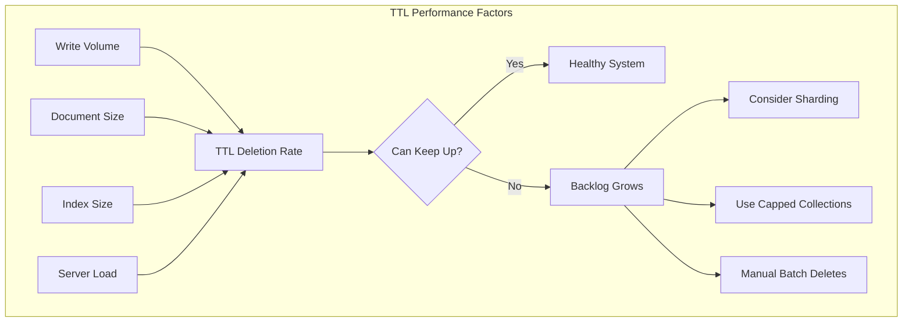

# How to Create MongoDB TTL Index Strategies

Author: [nawazdhandala](https://github.com/nawazdhandala)

Tags: MongoDB, TTL Index, Data Expiration, Cleanup

Description: Learn to implement TTL indexes for automatic data expiration with configuration, monitoring, and performance considerations.

---

## Introduction

Time-To-Live (TTL) indexes in MongoDB provide automatic document expiration, eliminating the need for manual cleanup scripts or scheduled jobs. This feature is essential for managing temporary data like session tokens, logs, cached results, and audit trails that have a defined lifespan.

In this guide, we will explore how to create effective TTL index strategies, understand expiration behavior, monitor performance, and implement best practices for production environments.

## How TTL Indexes Work

TTL indexes are special single-field indexes that MongoDB uses to automatically remove documents after a specified period. A background thread runs every 60 seconds to check for and delete expired documents.



## Creating Your First TTL Index

### Basic TTL Index

The simplest TTL index expires documents after a fixed duration from a date field:

```javascript
// Create a collection for session data
db.sessions.insertOne({
  userId: "user123",
  sessionToken: "abc123xyz",
  createdAt: new Date(),
  data: { lastPage: "/dashboard" }
});

// Create TTL index - documents expire 24 hours after createdAt
db.sessions.createIndex(
  { "createdAt": 1 },
  { expireAfterSeconds: 86400 }  // 24 hours in seconds
);
```

### Expire at a Specific Time

For documents that should expire at an exact time, set `expireAfterSeconds` to 0 and store the expiration timestamp directly:

```javascript
// Document expires at the exact time specified in expiresAt field
db.tempTokens.insertOne({
  token: "reset-password-token-xyz",
  userId: "user456",
  expiresAt: new Date("2026-02-01T12:00:00Z")  // Expires on this exact date
});

// Create TTL index with expireAfterSeconds: 0
db.tempTokens.createIndex(
  { "expiresAt": 1 },
  { expireAfterSeconds: 0 }
);
```

## TTL Index Expiration Behavior

Understanding how MongoDB handles TTL expiration is crucial for designing your data model:



### Key Expiration Characteristics

1. **Deletion delay**: Documents may persist up to 60 seconds past their expiration time
2. **Background process**: Deletions happen asynchronously and do not block other operations
3. **Replica sets**: TTL deletions only occur on the primary and replicate to secondaries
4. **Load-dependent**: Under heavy load, deletion may be delayed further

```javascript
// Example: Checking if a document is logically expired
// even if MongoDB has not deleted it yet
function isSessionValid(session) {
  const now = new Date();
  const expirationTime = new Date(session.createdAt);
  expirationTime.setSeconds(expirationTime.getSeconds() + 86400);

  return now < expirationTime;
}
```

## Common Use Cases and Strategies

### 1. Session Management

```javascript
// Session collection with 30-minute sliding expiration
db.sessions.insertOne({
  _id: "session_abc123",
  userId: ObjectId("507f1f77bcf86cd799439011"),
  lastActivity: new Date(),
  ipAddress: "192.168.1.100",
  userAgent: "Mozilla/5.0..."
});

db.sessions.createIndex(
  { "lastActivity": 1 },
  { expireAfterSeconds: 1800 }  // 30 minutes
);

// Update lastActivity on each request to extend session
db.sessions.updateOne(
  { _id: "session_abc123" },
  { $set: { lastActivity: new Date() } }
);
```

### 2. Log Retention



```javascript
// Different retention periods for different log types
// Application logs - 7 days
db.logs_application.createIndex(
  { "timestamp": 1 },
  { expireAfterSeconds: 604800 }
);

// Security audit logs - 90 days
db.logs_security.createIndex(
  { "timestamp": 1 },
  { expireAfterSeconds: 7776000 }
);

// Debug logs - 1 day
db.logs_debug.createIndex(
  { "timestamp": 1 },
  { expireAfterSeconds: 86400 }
);
```

### 3. Cache Expiration

```javascript
// API response cache with variable expiration
db.apiCache.insertOne({
  cacheKey: "weather_api_london",
  response: { temperature: 15, conditions: "cloudy" },
  cachedAt: new Date(),
  expiresAt: new Date(Date.now() + 300000)  // 5 minutes from now
});

// Use expiresAt for variable TTL per document
db.apiCache.createIndex(
  { "expiresAt": 1 },
  { expireAfterSeconds: 0 }
);
```

### 4. Temporary Upload Storage

```javascript
// Temporary file metadata - expires if not confirmed
db.pendingUploads.insertOne({
  uploadId: "upload_xyz789",
  filename: "document.pdf",
  size: 1048576,
  uploadedAt: new Date(),
  status: "pending"
});

// Expire pending uploads after 1 hour
db.pendingUploads.createIndex(
  { "uploadedAt": 1 },
  {
    expireAfterSeconds: 3600,
    partialFilterExpression: { status: "pending" }
  }
);
```

## Monitoring TTL Index Performance

### Checking TTL Index Status

```javascript
// View all indexes including TTL configuration
db.sessions.getIndexes();

// Check TTL monitor status
db.serverStatus().metrics.ttl;

// Example output:
// {
//   "deletedDocuments": NumberLong(15234),
//   "passes": NumberLong(8542)
// }
```

### Monitoring Deletion Progress



```javascript
// Script to monitor TTL deletion rate
function monitorTTLPerformance() {
  const initialStats = db.serverStatus().metrics.ttl;

  // Wait 60 seconds
  sleep(60000);

  const finalStats = db.serverStatus().metrics.ttl;

  const deletedInPeriod = finalStats.deletedDocuments - initialStats.deletedDocuments;
  const passesInPeriod = finalStats.passes - initialStats.passes;

  print(`Documents deleted in last 60s: ${deletedInPeriod}`);
  print(`TTL passes: ${passesInPeriod}`);
  print(`Avg deletions per pass: ${deletedInPeriod / passesInPeriod}`);

  return {
    deletedDocuments: deletedInPeriod,
    passes: passesInPeriod,
    avgPerPass: deletedInPeriod / passesInPeriod
  };
}
```

### Collection Statistics

```javascript
// Check collection stats to understand storage impact
db.sessions.stats();

// Monitor document count over time
function trackCollectionGrowth(collectionName, intervalMinutes) {
  const counts = [];

  for (let i = 0; i < 10; i++) {
    counts.push({
      timestamp: new Date(),
      count: db[collectionName].countDocuments({})
    });
    sleep(intervalMinutes * 60000);
  }

  return counts;
}
```

## Advanced TTL Strategies

### Combining TTL with Partial Indexes

Only expire documents matching specific criteria:

```javascript
// Only expire completed orders after 30 days
// Keep pending and processing orders indefinitely
db.orders.createIndex(
  { "completedAt": 1 },
  {
    expireAfterSeconds: 2592000,  // 30 days
    partialFilterExpression: { status: "completed" }
  }
);
```

### Modifying TTL Expiration Time

You can modify the expiration time of an existing TTL index using the `collMod` command:

```javascript
// Change session expiration from 30 minutes to 1 hour
db.runCommand({
  collMod: "sessions",
  index: {
    keyPattern: { "lastActivity": 1 },
    expireAfterSeconds: 3600
  }
});
```

### TTL with Capped Collections Alternative

For high-throughput scenarios where TTL might not keep up:



```javascript
// Alternative: Capped collection for very high throughput logs
db.createCollection("highVolumeLogs", {
  capped: true,
  size: 1073741824,  // 1 GB max size
  max: 1000000       // Max 1 million documents
});
```

## Best Practices

### 1. Index Field Requirements

```javascript
// CORRECT: Use Date type for TTL field
db.data.insertOne({
  value: "test",
  createdAt: new Date()  // Date object
});

// INCORRECT: String dates will not work with TTL
db.data.insertOne({
  value: "test",
  createdAt: "2026-01-30T10:00:00Z"  // String - TTL will not work
});
```

### 2. Handle Missing TTL Fields

```javascript
// Documents without the TTL field will never expire
db.sessions.insertOne({
  userId: "admin",
  sessionToken: "permanent-admin-session"
  // No createdAt field - this document persists forever
});

// Use sparse index if many documents lack the TTL field
db.mixedData.createIndex(
  { "expiresAt": 1 },
  {
    expireAfterSeconds: 0,
    sparse: true  // Index only documents with expiresAt field
  }
);
```

### 3. Application-Level Expiration Checks

```javascript
// Always validate expiration in application code
async function getSession(sessionId) {
  const session = await db.sessions.findOne({ _id: sessionId });

  if (!session) {
    return null;
  }

  // Check if logically expired even if not yet deleted
  const expirationTime = new Date(session.lastActivity);
  expirationTime.setMinutes(expirationTime.getMinutes() + 30);

  if (new Date() > expirationTime) {
    // Optionally delete immediately
    await db.sessions.deleteOne({ _id: sessionId });
    return null;
  }

  return session;
}
```

### 4. Testing TTL Behavior

```javascript
// Test TTL index in development with short expiration
// Create test document
db.testTTL.insertOne({
  testId: 1,
  createdAt: new Date()
});

// Create TTL index with 1 minute expiration for testing
db.testTTL.createIndex(
  { "createdAt": 1 },
  { expireAfterSeconds: 60 }
);

// Verify document exists
print("Document count immediately:", db.testTTL.countDocuments({}));

// Wait and check again (run manually after waiting)
// print("Document count after 2 minutes:", db.testTTL.countDocuments({}));
```

## Performance Considerations



### Handling High Volume Scenarios

```javascript
// For very high volume - supplement TTL with manual batch deletes
async function batchDeleteExpired(collectionName, dateField, maxAge, batchSize) {
  const cutoffDate = new Date();
  cutoffDate.setSeconds(cutoffDate.getSeconds() - maxAge);

  let totalDeleted = 0;
  let result;

  do {
    result = await db[collectionName].deleteMany(
      { [dateField]: { $lt: cutoffDate } },
      { limit: batchSize }
    );

    totalDeleted += result.deletedCount;

    // Small delay to reduce load
    await new Promise(resolve => setTimeout(resolve, 100));

  } while (result.deletedCount === batchSize);

  return totalDeleted;
}
```

## Troubleshooting Common Issues

| Issue | Cause | Solution |
|-------|-------|----------|
| Documents not expiring | TTL field is not a Date type | Ensure field contains Date objects |
| Slow deletion | High write volume overwhelming TTL thread | Add manual batch deletes |
| Immediate deletion | expireAfterSeconds set to 0 with past dates | Verify date values are in the future |
| Inconsistent expiration | Clock skew in replica set | Synchronize clocks using NTP |
| Index not working | Field name mismatch | Verify index field matches document field exactly |

## Conclusion

MongoDB TTL indexes provide a powerful mechanism for automatic data lifecycle management. By understanding expiration behavior, implementing proper monitoring, and following best practices, you can effectively manage temporary data without manual intervention.

Key takeaways:
- TTL indexes delete documents based on a date field and configured expiration time
- Deletion is not instantaneous - expect up to 60 seconds delay plus any load-related delays
- Always validate expiration in application code for time-sensitive operations
- Monitor TTL performance to ensure the background thread can keep up with your data volume
- Use partial indexes to apply TTL only to specific document subsets

With these strategies in place, your MongoDB collections will stay clean and performant, automatically removing stale data while retaining what matters.
