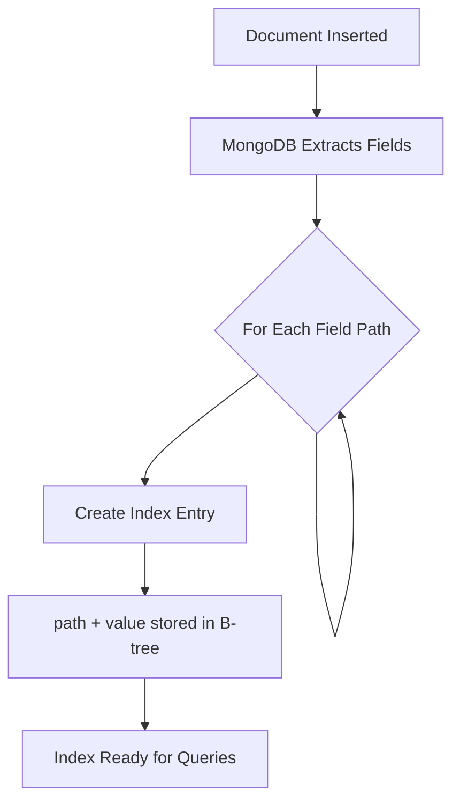
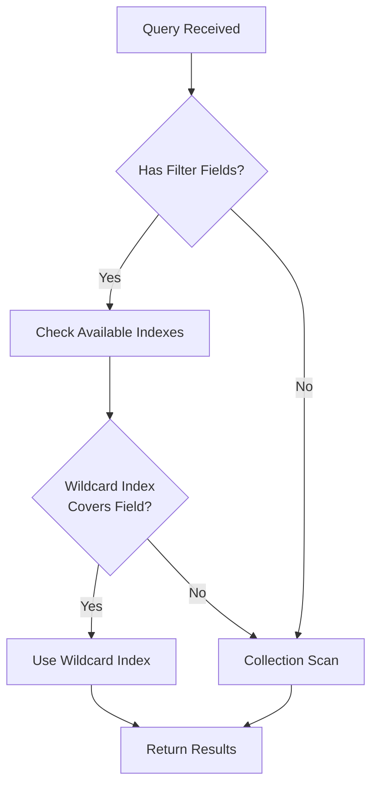

# How to Create MongoDB Wildcard Index Patterns

Author: [nawazdhandala](https://github.com/nawazdhandala)

Tags: MongoDB, Database, Indexing, Performance

Description: Learn how to use MongoDB wildcard indexes to efficiently query documents with dynamic or unpredictable field structures, including patterns for nested objects and arrays.

---

MongoDB wildcard indexes let you index fields without knowing their names in advance. This is useful when your documents have dynamic schemas, user-defined attributes, or deeply nested objects where field names vary. Instead of creating separate indexes for each field, a single wildcard index can cover them all.

## When to Use Wildcard Indexes

| Use Case | Wildcard Index? | Why |
|----------|-----------------|-----|
| User-defined metadata | Yes | Field names are unpredictable |
| Product attributes (size, color, etc.) | Yes | Attributes vary by category |
| Event properties | Yes | Different events have different fields |
| Static schema with known fields | No | Regular indexes are more efficient |
| Queries on `_id` field | No | Already indexed by default |
| High-write workloads | Consider carefully | Indexing all fields adds write overhead |

## Basic Wildcard Index Syntax

### Indexing All Fields

The `$**` pattern creates an index on every field in every document. MongoDB recursively indexes all scalar values in the document, including nested objects and arrays.

```javascript
// Create a wildcard index on all fields in the collection
// This indexes every scalar value at any path in the document
db.products.createIndex({ "$**": 1 });
```

This single index supports queries on any field:

```javascript
// All of these queries can use the wildcard index
db.products.find({ name: "Widget" });
db.products.find({ "specs.weight": 2.5 });
db.products.find({ "metadata.custom_field": "value" });
```

### Indexing a Specific Field Path

You can create a wildcard index on a specific path to limit scope. This indexes all nested fields under that path while ignoring the rest of the document.

```javascript
// Index all fields under the "attributes" subdocument
// Other top-level fields like "name" or "price" are not indexed
db.products.createIndex({ "attributes.$**": 1 });
```

Now queries on any field within `attributes` use the index:

```javascript
// Uses the wildcard index
db.products.find({ "attributes.color": "red" });
db.products.find({ "attributes.dimensions.height": 10 });

// Does NOT use the wildcard index (different path)
db.products.find({ name: "Widget" });
```

## How Wildcard Indexes Work

When you create a wildcard index, MongoDB generates index entries for each field path and value combination. Understanding this helps you predict performance.



For a document like this:

```javascript
{
  _id: 1,
  name: "Laptop",
  specs: {
    cpu: "M2",
    ram: 16,
    storage: { type: "SSD", size: 512 }
  },
  tags: ["electronics", "computers"]
}
```

The wildcard index creates entries for:
- `name: "Laptop"`
- `specs.cpu: "M2"`
- `specs.ram: 16`
- `specs.storage.type: "SSD"`
- `specs.storage.size: 512`
- `tags: "electronics"`
- `tags: "computers"`

## Wildcard Index with Include/Exclude Patterns

For fine-grained control, use `wildcardProjection` to specify which fields to include or exclude from the index.

### Including Specific Fields

Only index the fields you actually query. This reduces index size and write overhead.

```javascript
// Only index these specific field paths
// All other fields are ignored
db.products.createIndex(
  { "$**": 1 },
  {
    wildcardProjection: {
      "attributes": 1,
      "metadata.tags": 1,
      "specs.dimensions": 1
    }
  }
);
```

### Excluding Specific Fields

Exclude large or rarely-queried fields to keep the index lean.

```javascript
// Index everything EXCEPT these fields
// Useful when most fields are queryable but some are not
db.products.createIndex(
  { "$**": 1 },
  {
    wildcardProjection: {
      "description": 0,      // Large text field, use text index instead
      "internal_notes": 0,   // Never queried by users
      "audit_log": 0         // Array that grows unbounded
    }
  }
);
```

## Real-World Patterns

### E-commerce Product Catalog

Products have different attributes depending on category. A laptop has RAM and CPU specs, while a shirt has size and color. Wildcard indexes handle this naturally.

```javascript
// Sample documents with varying attribute structures
db.products.insertMany([
  {
    sku: "LAPTOP-001",
    category: "electronics",
    attributes: {
      brand: "TechCorp",
      cpu: "Intel i7",
      ram_gb: 16,
      screen_size: 15.6
    }
  },
  {
    sku: "SHIRT-001",
    category: "clothing",
    attributes: {
      brand: "FashionCo",
      size: "L",
      color: "blue",
      material: "cotton"
    }
  }
]);

// Create wildcard index on attributes
// This supports filtering on any product attribute
db.products.createIndex({ "attributes.$**": 1 });

// Query electronics by RAM
db.products.find({
  category: "electronics",
  "attributes.ram_gb": { $gte: 16 }
});

// Query clothing by size and color
db.products.find({
  category: "clothing",
  "attributes.size": "L",
  "attributes.color": "blue"
});
```

### User-Defined Custom Fields

Let users add their own fields to records. Wildcard indexes make these custom fields searchable without schema changes.

```javascript
// Users can add any fields to customFields
db.contacts.insertMany([
  {
    name: "Alice",
    email: "alice@example.com",
    customFields: {
      department: "Engineering",
      employee_id: "ENG-123",
      start_date: new Date("2023-01-15")
    }
  },
  {
    name: "Bob",
    email: "bob@example.com",
    customFields: {
      department: "Sales",
      territory: "West Coast",
      quota: 500000
    }
  }
]);

// Index all custom fields
db.contacts.createIndex({ "customFields.$**": 1 });

// Search by any custom field
db.contacts.find({ "customFields.department": "Engineering" });
db.contacts.find({ "customFields.territory": "West Coast" });
```

### Event Tracking with Dynamic Properties

Events have a base structure but varying properties depending on the event type.

```javascript
// Different event types have different properties
db.events.insertMany([
  {
    type: "page_view",
    timestamp: new Date(),
    userId: "user-123",
    properties: {
      page: "/products",
      referrer: "google.com",
      duration_ms: 5000
    }
  },
  {
    type: "purchase",
    timestamp: new Date(),
    userId: "user-456",
    properties: {
      product_id: "LAPTOP-001",
      amount: 999.99,
      currency: "USD",
      coupon_code: "SAVE10"
    }
  }
]);

// Create compound index: event type + wildcard on properties
// This supports queries filtered by type with any property condition
db.events.createIndex({ type: 1 });
db.events.createIndex({ "properties.$**": 1 });

// Find purchases over $500
db.events.find({
  type: "purchase",
  "properties.amount": { $gte: 500 }
});

// Find page views with specific referrer
db.events.find({
  type: "page_view",
  "properties.referrer": "google.com"
});
```

## Index Selection and Query Planning



MongoDB considers wildcard indexes during query planning. Use `explain()` to verify the index is being used.

```javascript
// Check if wildcard index is used for this query
db.products.find({ "attributes.color": "red" }).explain("executionStats");

// Look for these fields in the output:
// - winningPlan.inputStage.indexName should show your wildcard index
// - executionStats.totalDocsExamined should be close to totalKeysExamined
```

## Wildcard Indexes on Arrays

Wildcard indexes automatically handle arrays by indexing each element. This is powerful but can generate many index entries.

```javascript
// Document with array of tags
db.articles.insertOne({
  title: "MongoDB Performance Tips",
  tags: ["mongodb", "performance", "indexing", "database"],
  authors: [
    { name: "Alice", role: "lead" },
    { name: "Bob", role: "contributor" }
  ]
});

// Wildcard index on the entire document
db.articles.createIndex({ "$**": 1 });

// Query by any tag value
db.articles.find({ tags: "mongodb" });

// Query by nested array field
db.articles.find({ "authors.role": "lead" });
```

Each tag and each author field generates separate index entries, so be mindful of array sizes.

## Limitations and Considerations

### What Wildcard Indexes Cannot Do

| Operation | Supported? | Alternative |
|-----------|------------|-------------|
| Equality queries | Yes | - |
| Range queries | Yes | - |
| Regex queries | Yes | - |
| `$exists` queries | Yes | - |
| Sorting | No | Create regular index on sort field |
| Compound conditions on multiple fields | No | Use multiple queries or compound index |
| Covered queries | No | Regular index can cover queries |
| Unique constraints | No | Use regular unique index |

### Performance Trade-offs

Wildcard indexes add write overhead because every field generates index entries. Measure the impact on your workload.

```javascript
// Monitor index size
db.products.stats().indexSizes;

// Compare write performance with and without wildcard index
// Time a batch insert
const start = Date.now();
db.products.insertMany(largeDocumentArray);
const duration = Date.now() - start;
console.log(`Insert took ${duration}ms`);
```

### Memory Usage

Wildcard indexes can grow large with documents that have many fields. Monitor index size relative to available RAM.

```javascript
// Check index size and memory usage
db.products.aggregate([
  { $indexStats: {} }
]);

// View detailed index information
db.products.getIndexes().forEach(idx => {
  print(`${idx.name}: ${JSON.stringify(idx.key)}`);
});
```

## Compound Wildcard Indexes (MongoDB 7.0+)

Starting with MongoDB 7.0, you can combine wildcard patterns with regular fields in a compound index. This enables queries that filter on a known field plus any dynamic field.

```javascript
// Compound wildcard index: category + any attribute
// Supports queries filtered by category with any attribute condition
db.products.createIndex({
  category: 1,
  "attributes.$**": 1
});

// This query uses both parts of the compound index
db.products.find({
  category: "electronics",
  "attributes.brand": "TechCorp"
});
```

The known field (category) narrows down documents first, then the wildcard portion filters further.

## Best Practices

### 1. Scope Your Wildcard Indexes

Index only the subtree you need, not the entire document. This reduces index size and write overhead.

```javascript
// GOOD: Scoped to the dynamic portion
db.products.createIndex({ "attributes.$**": 1 });

// AVOID: Unless you really need to query any field
db.products.createIndex({ "$**": 1 });
```

### 2. Combine with Regular Indexes

Use wildcard indexes alongside regular indexes. Queries on known, high-cardinality fields benefit from traditional indexes.

```javascript
// Regular index for common queries
db.products.createIndex({ category: 1, sku: 1 });

// Wildcard index for dynamic attribute queries
db.products.createIndex({ "attributes.$**": 1 });
```

### 3. Use Projections Wisely

Exclude large text fields, unbounded arrays, and fields you never query.

```javascript
// Exclude fields that add overhead without query benefit
db.products.createIndex(
  { "$**": 1 },
  {
    wildcardProjection: {
      "description": 0,
      "reviews": 0,
      "changelog": 0
    }
  }
);
```

### 4. Monitor and Adjust

Track index usage and size over time. Remove wildcard indexes that are not being used or add too much overhead.

```javascript
// Check which indexes are actually being used
db.products.aggregate([
  { $indexStats: {} },
  { $project: { name: 1, accesses: 1 } }
]);
```

## Summary

| Aspect | Recommendation |
|--------|----------------|
| **Use Case** | Dynamic schemas, user-defined fields, varying attributes |
| **Scope** | Index specific paths, not entire documents |
| **Projections** | Exclude large or rarely-queried fields |
| **Performance** | Monitor write overhead and index size |
| **Compound** | Combine with regular fields in MongoDB 7.0+ |
| **Limitations** | Cannot sort or cover queries |

Wildcard indexes solve the problem of querying documents with unpredictable structures. They trade some write performance and storage for query flexibility. Use them strategically on dynamic portions of your schema while keeping traditional indexes for known, high-traffic query patterns.
