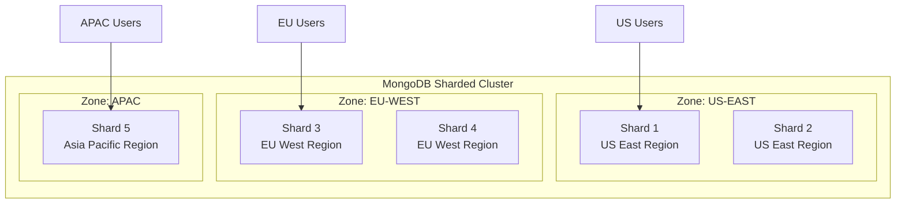
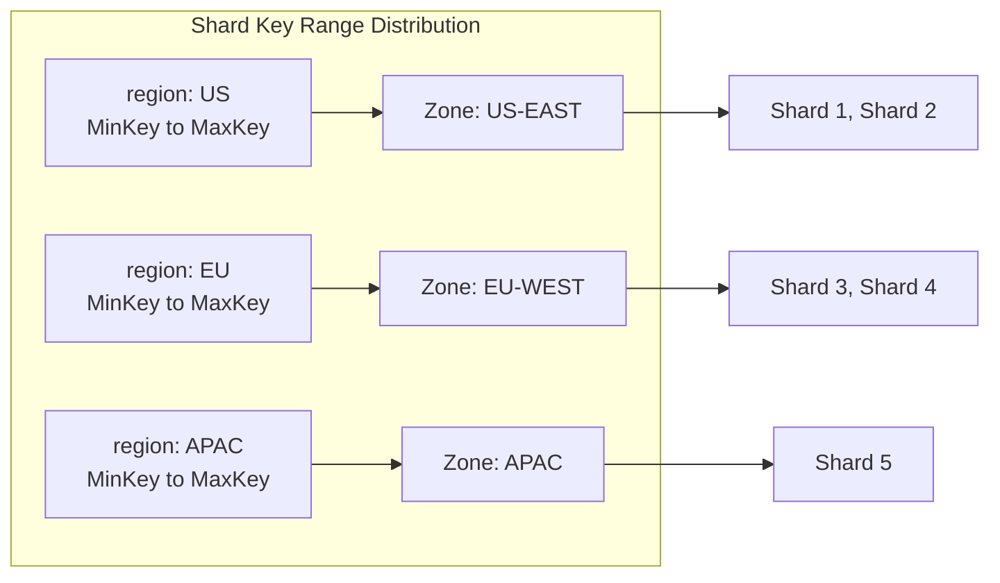
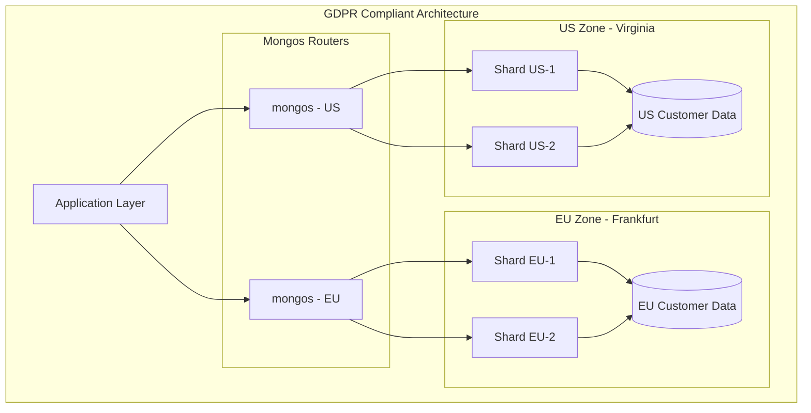
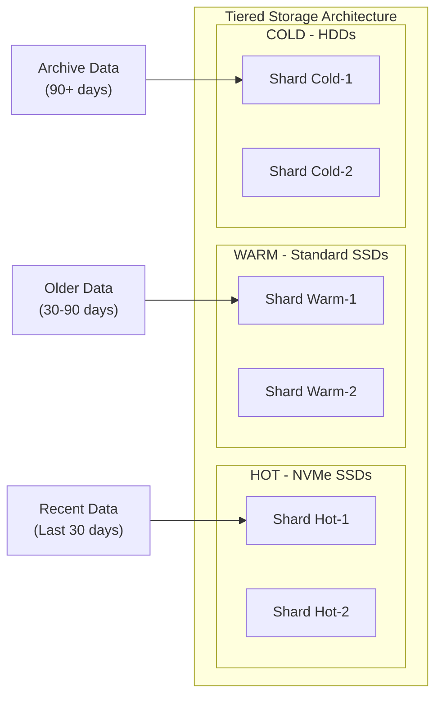
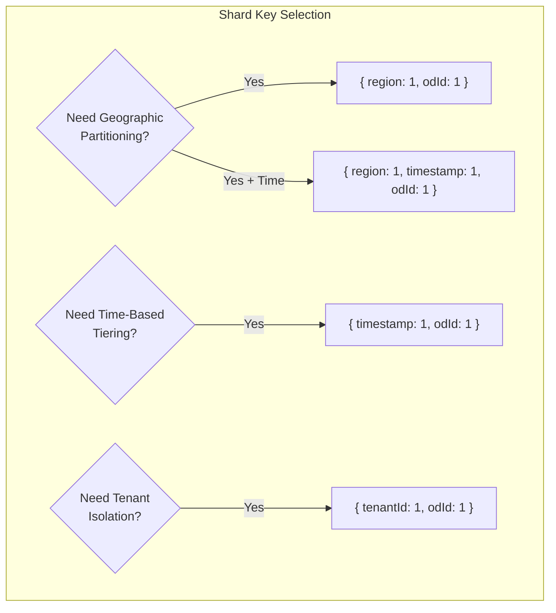

# How to Create MongoDB Zone Sharding

Author: [nawazdhandala](https://github.com/nawazdhandala)

Tags: MongoDB, Zone Sharding, Data Locality, Multi-Region

Description: Learn to implement zone sharding for data locality with geographic partitioning, tiered storage, and compliance requirements.

---

Zone sharding in MongoDB allows you to control where specific data resides within a sharded cluster. This is essential for achieving data locality, meeting regulatory compliance requirements, and optimizing performance for geographically distributed applications.

## What is Zone Sharding?

Zone sharding enables you to associate shards with specific zones and then define ranges of shard key values that belong to those zones. MongoDB's balancer automatically migrates chunks to the appropriate shards based on these zone configurations.



## Prerequisites

Before implementing zone sharding, ensure you have:

- A MongoDB sharded cluster with at least 3 shards
- A sharded collection with an appropriate shard key
- Administrative access to the cluster
- MongoDB Shell (mongosh) installed

## Step 1: Connect to Your Cluster

First, connect to your mongos router:

```bash
mongosh "mongodb://mongos-router:27017" --username admin --authenticationDatabase admin
```

## Step 2: Add Zones to Shards

The first step is to associate each shard with one or more zones. Use the `sh.addShardToZone()` method to create these associations.

```javascript
// Add US-EAST zone to shards
sh.addShardToZone("shard0001", "US-EAST")
sh.addShardToZone("shard0002", "US-EAST")

// Add EU-WEST zone to shards
sh.addShardToZone("shard0003", "EU-WEST")
sh.addShardToZone("shard0004", "EU-WEST")

// Add APAC zone to shards
sh.addShardToZone("shard0005", "APAC")
```

You can verify the zone assignments:

```javascript
// Check zone assignments
db.adminCommand({ listShards: 1 })
```

Example output:

```json
{
  "shards": [
    { "_id": "shard0001", "host": "shard0001/...", "tags": ["US-EAST"] },
    { "_id": "shard0002", "host": "shard0002/...", "tags": ["US-EAST"] },
    { "_id": "shard0003", "host": "shard0003/...", "tags": ["EU-WEST"] },
    { "_id": "shard0004", "host": "shard0004/...", "tags": ["EU-WEST"] },
    { "_id": "shard0005", "host": "shard0005/...", "tags": ["APAC"] }
  ]
}
```

## Step 3: Define Zone Ranges

After associating shards with zones, define the shard key ranges that should be stored in each zone. The range is inclusive of the lower bound and exclusive of the upper bound.

### Geographic Partitioning Example

For a collection sharded on a compound key `{ region: 1, customerId: 1 }`:

```javascript
// Use the target database
use myDatabase

// Enable sharding on the collection if not already done
sh.shardCollection("myDatabase.customers", { region: 1, customerId: 1 })

// Define zone ranges based on region
sh.updateZoneKeyRange(
  "myDatabase.customers",
  { region: "US", customerId: MinKey },
  { region: "US", customerId: MaxKey },
  "US-EAST"
)

sh.updateZoneKeyRange(
  "myDatabase.customers",
  { region: "EU", customerId: MinKey },
  { region: "EU", customerId: MaxKey },
  "EU-WEST"
)

sh.updateZoneKeyRange(
  "myDatabase.customers",
  { region: "APAC", customerId: MinKey },
  { region: "APAC", customerId: MaxKey },
  "APAC"
)
```

### Visualizing Zone Ranges



## Step 4: Verify Zone Configuration

Check the zone configuration to ensure everything is set up correctly:

```javascript
// View all zone ranges for a collection
use config
db.tags.find({ ns: "myDatabase.customers" }).pretty()
```

Example output:

```json
[
  {
    "_id": { "ns": "myDatabase.customers", "min": { "region": "US", "customerId": { "$minKey": 1 } } },
    "ns": "myDatabase.customers",
    "min": { "region": "US", "customerId": { "$minKey": 1 } },
    "max": { "region": "US", "customerId": { "$maxKey": 1 } },
    "tag": "US-EAST"
  },
  {
    "_id": { "ns": "myDatabase.customers", "min": { "region": "EU", "customerId": { "$minKey": 1 } } },
    "ns": "myDatabase.customers",
    "min": { "region": "EU", "customerId": { "$minKey": 1 } },
    "max": { "region": "EU", "customerId": { "$maxKey": 1 } },
    "tag": "EU-WEST"
  }
]
```

## Step 5: Monitor the Balancer

The MongoDB balancer will automatically migrate chunks to their designated zones. Monitor the migration progress:

```javascript
// Check balancer status
sh.getBalancerState()

// View current balancer operations
use config
db.locks.find({ _id: "balancer" }).pretty()

// Check chunk distribution
sh.status()
```

## Use Case 1: Data Residency Compliance (GDPR)

For GDPR compliance, you may need to ensure European customer data stays within the EU:



Implementation:

```javascript
// Create a collection for user data with GDPR compliance
sh.shardCollection("gdprApp.userData", { dataResidency: 1, odId: 1 })

// EU data stays in EU
sh.updateZoneKeyRange(
  "gdprApp.userData",
  { dataResidency: "EU", odId: MinKey },
  { dataResidency: "EU", odId: MaxKey },
  "EU-ZONE"
)

// US data stays in US
sh.updateZoneKeyRange(
  "gdprApp.userData",
  { dataResidency: "US", odId: MinKey },
  { dataResidency: "US", odId: MaxKey },
  "US-ZONE"
)
```

## Use Case 2: Tiered Storage

Implement hot, warm, and cold data tiers based on data age:



Implementation with date-based sharding:

```javascript
// Shard collection on timestamp
sh.shardCollection("analytics.events", { timestamp: 1, eventId: 1 })

// Configure zones for tiered storage
sh.addShardToZone("shard-hot-1", "HOT")
sh.addShardToZone("shard-hot-2", "HOT")
sh.addShardToZone("shard-warm-1", "WARM")
sh.addShardToZone("shard-warm-2", "WARM")
sh.addShardToZone("shard-cold-1", "COLD")
sh.addShardToZone("shard-cold-2", "COLD")

// Define time-based zone ranges
// Hot: Current month
sh.updateZoneKeyRange(
  "analytics.events",
  { timestamp: ISODate("2026-01-01"), eventId: MinKey },
  { timestamp: ISODate("2026-02-01"), eventId: MaxKey },
  "HOT"
)

// Warm: Previous quarter
sh.updateZoneKeyRange(
  "analytics.events",
  { timestamp: ISODate("2025-10-01"), eventId: MinKey },
  { timestamp: ISODate("2026-01-01"), eventId: MaxKey },
  "WARM"
)

// Cold: Older data
sh.updateZoneKeyRange(
  "analytics.events",
  { timestamp: ISODate("2020-01-01"), eventId: MinKey },
  { timestamp: ISODate("2025-10-01"), eventId: MaxKey },
  "COLD"
)
```

## Use Case 3: Multi-Tenant Isolation

Isolate tenant data to specific shards for security or performance:

```javascript
// Shard on tenant ID
sh.shardCollection("saasApp.tenantData", { tenantId: 1, odId: 1 })

// Premium tenants get dedicated shards
sh.addShardToZone("shard-premium-1", "PREMIUM")
sh.addShardToZone("shard-premium-2", "PREMIUM")

// Standard tenants share shards
sh.addShardToZone("shard-standard-1", "STANDARD")
sh.addShardToZone("shard-standard-2", "STANDARD")
sh.addShardToZone("shard-standard-3", "STANDARD")

// Assign specific tenant IDs to premium zone
sh.updateZoneKeyRange(
  "saasApp.tenantData",
  { tenantId: "enterprise-001", odId: MinKey },
  { tenantId: "enterprise-001", odId: MaxKey },
  "PREMIUM"
)

sh.updateZoneKeyRange(
  "saasApp.tenantData",
  { tenantId: "enterprise-002", odId: MinKey },
  { tenantId: "enterprise-002", odId: MaxKey },
  "PREMIUM"
)
```

## Managing Zone Configurations

### Removing a Zone Range

```javascript
// Remove a zone range
sh.removeRangeFromZone(
  "myDatabase.customers",
  { region: "APAC", customerId: MinKey },
  { region: "APAC", customerId: MaxKey }
)
```

### Removing a Shard from a Zone

```javascript
// Remove shard from zone
sh.removeShardFromZone("shard0005", "APAC")
```

### Updating Zone Ranges

To update a zone range, first remove the existing range, then create a new one:

```javascript
// Remove old range
sh.removeRangeFromZone(
  "myDatabase.customers",
  { region: "US", customerId: MinKey },
  { region: "US", customerId: MaxKey }
)

// Add new range with different zone
sh.updateZoneKeyRange(
  "myDatabase.customers",
  { region: "US", customerId: MinKey },
  { region: "US", customerId: MaxKey },
  "US-WEST"  // Changed from US-EAST
)
```

## Best Practices

### 1. Choose the Right Shard Key

Your shard key should support your zone sharding strategy:



### 2. Monitor Chunk Migrations

```javascript
// Create a script to monitor zone compliance
function checkZoneCompliance() {
  const chunks = db.getSiblingDB("config").chunks.find({ ns: "myDatabase.customers" })
  const shards = db.getSiblingDB("config").shards.find().toArray()

  const shardZones = {}
  shards.forEach(s => {
    shardZones[s._id] = s.tags || []
  })

  let violations = 0
  chunks.forEach(chunk => {
    const chunkZone = getExpectedZone(chunk.min)
    const shardHasZone = shardZones[chunk.shard].includes(chunkZone)
    if (!shardHasZone) {
      print(`Violation: Chunk ${chunk._id} should be in zone ${chunkZone}`)
      violations++
    }
  })

  print(`Total violations: ${violations}`)
}
```

### 3. Plan for Zone Range Updates

When updating tiered storage zones based on time, automate the range updates:

```javascript
// Script to rotate time-based zones monthly
function rotateTimeZones() {
  const now = new Date()
  const currentMonth = new Date(now.getFullYear(), now.getMonth(), 1)
  const lastMonth = new Date(now.getFullYear(), now.getMonth() - 1, 1)
  const threeMonthsAgo = new Date(now.getFullYear(), now.getMonth() - 3, 1)

  // Update HOT zone to current month
  sh.updateZoneKeyRange(
    "analytics.events",
    { timestamp: currentMonth, eventId: MinKey },
    { timestamp: new Date(now.getFullYear(), now.getMonth() + 1, 1), eventId: MaxKey },
    "HOT"
  )

  // Move previous HOT data to WARM
  sh.updateZoneKeyRange(
    "analytics.events",
    { timestamp: threeMonthsAgo, eventId: MinKey },
    { timestamp: currentMonth, eventId: MaxKey },
    "WARM"
  )

  print("Zone rotation complete")
}
```

## Troubleshooting

### Chunks Not Moving to Correct Zone

1. Check if the balancer is running:

```javascript
sh.getBalancerState()
sh.isBalancerRunning()
```

2. Verify zone configuration:

```javascript
use config
db.shards.find({}, { _id: 1, tags: 1 })
db.tags.find({ ns: "myDatabase.customers" })
```

3. Check for balancer errors:

```javascript
use config
db.actionlog.find({ what: "balancer.round" }).sort({ time: -1 }).limit(10)
```

### Zone Range Overlap

Zone ranges must not overlap. If you get an error about overlapping ranges, check existing ranges:

```javascript
use config
db.tags.find({ ns: "myDatabase.customers" }).sort({ min: 1 })
```

## Conclusion

MongoDB zone sharding is a powerful feature for controlling data placement across your sharded cluster. Whether you need to meet compliance requirements, implement tiered storage, or optimize for geographic performance, zone sharding provides the flexibility to achieve your data locality goals.

Key takeaways:

- Plan your shard key to support your zone sharding strategy
- Use `sh.addShardToZone()` to associate shards with zones
- Use `sh.updateZoneKeyRange()` to define which data goes where
- Monitor the balancer to ensure chunks migrate correctly
- Automate zone range updates for time-based tiering

By following these patterns and best practices, you can build a MongoDB cluster that keeps data exactly where it needs to be.
