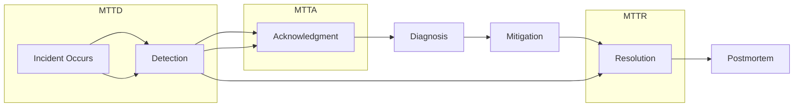
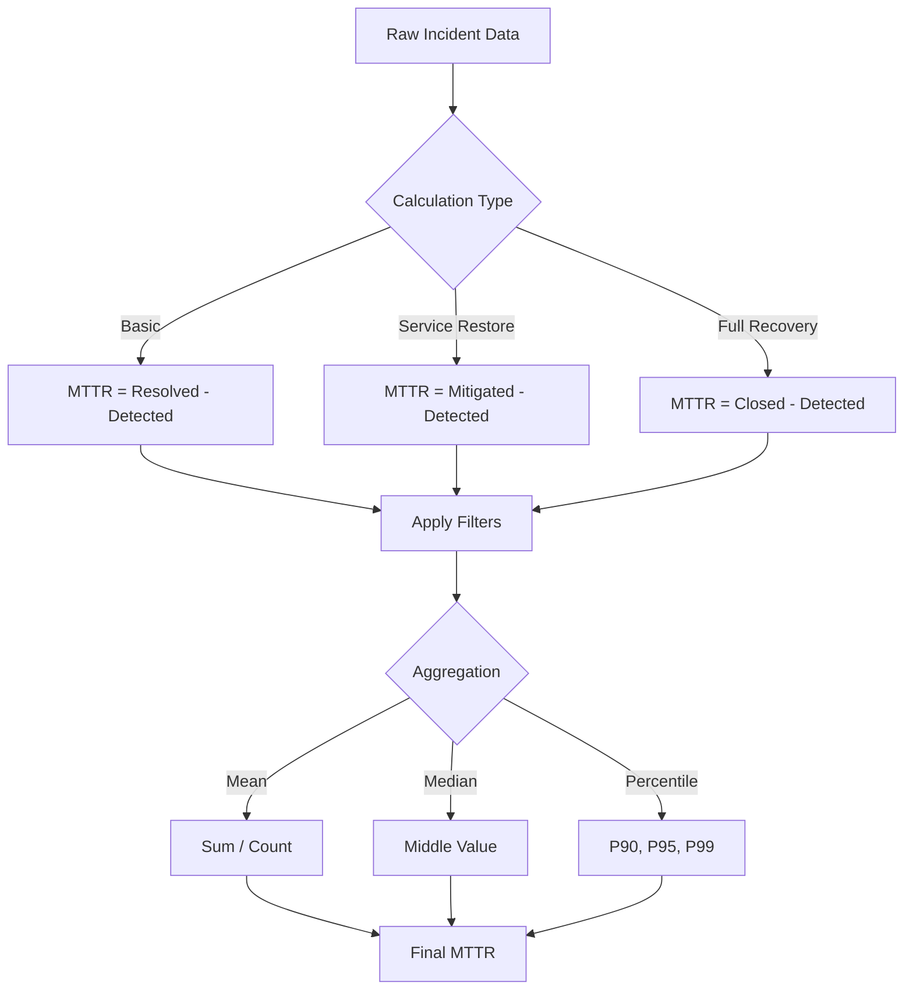
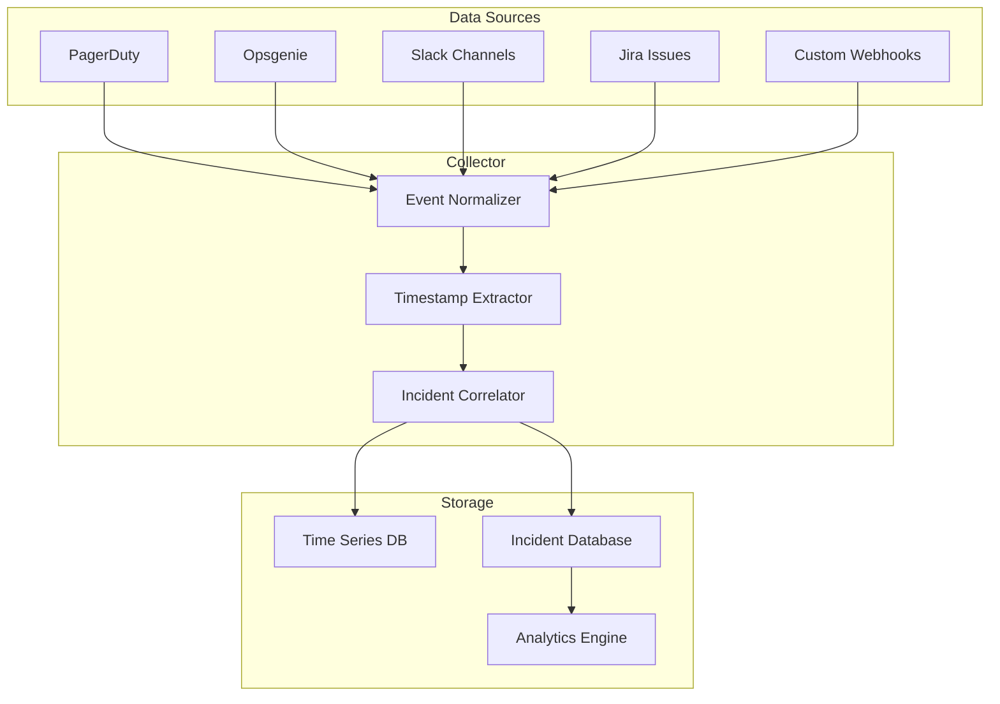
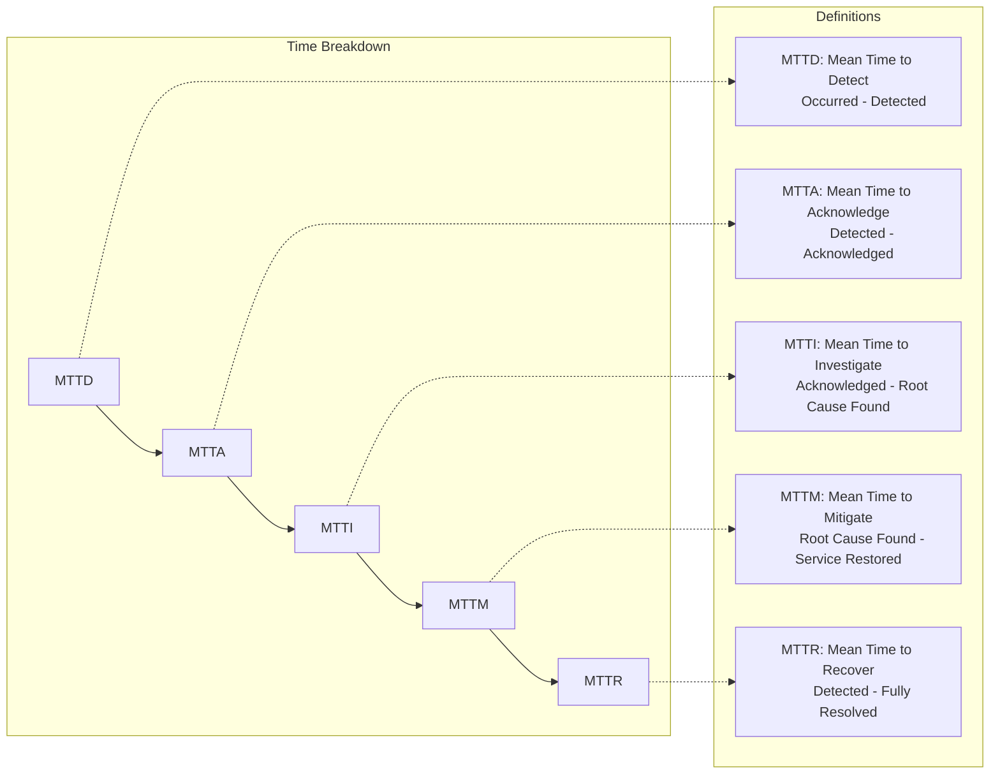
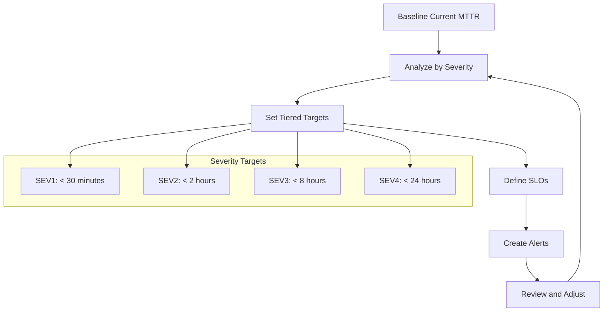

# How to Implement MTTR Tracking

Author: [nawazdhandala](https://github.com/nawazdhandala)

Tags: DevOps, DORA Metrics, MTTR, Incident Management

Description: Learn to implement MTTR tracking with incident lifecycle measurement, bottleneck identification, and recovery time optimization for faster resolution.

---

Mean Time to Recovery (MTTR) is one of the four key DORA metrics that distinguish high-performing engineering teams from the rest. While many teams track MTTR at a surface level, few implement comprehensive tracking that actually drives improvement. In this guide, we will build a complete MTTR tracking system from scratch, covering measurement phases, data collection, calculation variants, visualization, and strategies for continuous improvement.

## What MTTR Actually Measures

MTTR measures the average time between when an incident is detected and when service is fully restored. However, "recovery" can mean different things in different contexts:

- **Time to Restore Service**: When users can access the service again
- **Time to Full Recovery**: When the system returns to pre-incident performance levels
- **Time to Resolve Root Cause**: When the underlying issue is permanently fixed

Understanding these distinctions is crucial because optimizing for the wrong metric can lead to poor outcomes - like quick patches that cause recurring incidents.

## The Incident Lifecycle

Before we can measure MTTR accurately, we need to understand the phases of an incident lifecycle:



Each phase contributes to overall recovery time:

| Phase | Description | Key Activities |
|-------|-------------|----------------|
| Detection | Time until the incident is identified | Monitoring, alerting, user reports |
| Acknowledgment | Time until someone owns the incident | On-call response, escalation |
| Diagnosis | Time to identify the root cause | Log analysis, debugging, correlation |
| Mitigation | Time to restore service | Rollback, failover, scaling |
| Resolution | Time to implement permanent fix | Code changes, configuration updates |

## Core Data Model

A robust MTTR tracking system requires a well-designed data model. Here is a schema that captures all the necessary timestamps and metadata:

```python
from dataclasses import dataclass, field
from datetime import datetime
from enum import Enum
from typing import List, Optional, Dict, Any
import uuid

class IncidentSeverity(Enum):
    SEV1 = 1  # Critical - complete outage
    SEV2 = 2  # Major - significant degradation
    SEV3 = 3  # Minor - partial impact
    SEV4 = 4  # Low - minimal user impact

class IncidentStatus(Enum):
    DETECTED = "detected"
    ACKNOWLEDGED = "acknowledged"
    INVESTIGATING = "investigating"
    MITIGATED = "mitigated"
    RESOLVED = "resolved"
    CLOSED = "closed"

@dataclass
class IncidentTimestamp:
    """Records a specific event in the incident lifecycle."""
    event_type: str
    timestamp: datetime
    actor: Optional[str] = None
    notes: Optional[str] = None
    metadata: Dict[str, Any] = field(default_factory=dict)

@dataclass
class Incident:
    """Represents a single incident with full lifecycle tracking."""
    id: str = field(default_factory=lambda: str(uuid.uuid4()))
    title: str = ""
    description: str = ""
    severity: IncidentSeverity = IncidentSeverity.SEV3
    status: IncidentStatus = IncidentStatus.DETECTED

    # Core timestamps
    occurred_at: Optional[datetime] = None
    detected_at: Optional[datetime] = None
    acknowledged_at: Optional[datetime] = None
    mitigated_at: Optional[datetime] = None
    resolved_at: Optional[datetime] = None
    closed_at: Optional[datetime] = None

    # Detailed timeline
    timeline: List[IncidentTimestamp] = field(default_factory=list)

    # Classification
    service: str = ""
    team: str = ""
    tags: List[str] = field(default_factory=list)
    root_cause_category: Optional[str] = None

    # Impact metrics
    affected_users: int = 0
    revenue_impact: float = 0.0

    def add_event(self, event_type: str, timestamp: datetime,
                  actor: str = None, notes: str = None):
        """Add an event to the incident timeline."""
        event = IncidentTimestamp(
            event_type=event_type,
            timestamp=timestamp,
            actor=actor,
            notes=notes
        )
        self.timeline.append(event)

        # Auto-update status based on event type
        status_map = {
            "detected": IncidentStatus.DETECTED,
            "acknowledged": IncidentStatus.ACKNOWLEDGED,
            "investigating": IncidentStatus.INVESTIGATING,
            "mitigated": IncidentStatus.MITIGATED,
            "resolved": IncidentStatus.RESOLVED,
            "closed": IncidentStatus.CLOSED
        }

        if event_type in status_map:
            self.status = status_map[event_type]
            setattr(self, f"{event_type}_at", timestamp)
```

## MTTR Calculation Engine

Now let us build the core calculation engine. MTTR can be calculated in multiple ways depending on your needs:



```python
from datetime import timedelta
from typing import Callable
import statistics

class MTTRCalculationType(Enum):
    """Different ways to calculate MTTR."""
    BASIC = "basic"                    # Detected to Resolved
    SERVICE_RESTORE = "service_restore"  # Detected to Mitigated
    FULL_RECOVERY = "full_recovery"      # Detected to Closed
    CUSTOM = "custom"                    # User-defined start/end

@dataclass
class MTTRResult:
    """Result of an MTTR calculation."""
    calculation_type: MTTRCalculationType
    incidents_analyzed: int
    incidents_excluded: int

    # Time metrics in minutes
    mean_minutes: float
    median_minutes: float
    p90_minutes: float
    p95_minutes: float
    p99_minutes: float
    min_minutes: float
    max_minutes: float
    std_dev_minutes: float

    # Breakdown by phase
    mean_detection_minutes: float = 0.0
    mean_acknowledgment_minutes: float = 0.0
    mean_diagnosis_minutes: float = 0.0
    mean_mitigation_minutes: float = 0.0
    mean_resolution_minutes: float = 0.0

    # Context
    time_period_start: Optional[datetime] = None
    time_period_end: Optional[datetime] = None
    filters_applied: Dict[str, Any] = field(default_factory=dict)

class MTTRCalculator:
    """Calculates MTTR with multiple methods and filters."""

    def __init__(self, incidents: List[Incident]):
        self.incidents = incidents

    def calculate(
        self,
        calculation_type: MTTRCalculationType = MTTRCalculationType.BASIC,
        severity_filter: Optional[List[IncidentSeverity]] = None,
        service_filter: Optional[List[str]] = None,
        team_filter: Optional[List[str]] = None,
        start_date: Optional[datetime] = None,
        end_date: Optional[datetime] = None,
        exclude_outliers: bool = True,
        outlier_threshold_hours: float = 168  # 1 week
    ) -> MTTRResult:
        """Calculate MTTR with specified parameters."""

        # Apply filters
        filtered = self._apply_filters(
            severity_filter=severity_filter,
            service_filter=service_filter,
            team_filter=team_filter,
            start_date=start_date,
            end_date=end_date
        )

        # Calculate recovery times
        recovery_times = []
        excluded_count = 0

        for incident in filtered:
            duration = self._get_recovery_duration(incident, calculation_type)

            if duration is None:
                excluded_count += 1
                continue

            duration_hours = duration.total_seconds() / 3600

            # Exclude outliers if requested
            if exclude_outliers and duration_hours > outlier_threshold_hours:
                excluded_count += 1
                continue

            recovery_times.append(duration.total_seconds() / 60)  # Convert to minutes

        if not recovery_times:
            return self._empty_result(calculation_type, excluded_count)

        # Calculate statistics
        recovery_times_sorted = sorted(recovery_times)

        return MTTRResult(
            calculation_type=calculation_type,
            incidents_analyzed=len(recovery_times),
            incidents_excluded=excluded_count,
            mean_minutes=statistics.mean(recovery_times),
            median_minutes=statistics.median(recovery_times),
            p90_minutes=self._percentile(recovery_times_sorted, 90),
            p95_minutes=self._percentile(recovery_times_sorted, 95),
            p99_minutes=self._percentile(recovery_times_sorted, 99),
            min_minutes=min(recovery_times),
            max_minutes=max(recovery_times),
            std_dev_minutes=statistics.stdev(recovery_times) if len(recovery_times) > 1 else 0,
            mean_detection_minutes=self._calculate_phase_mean(filtered, "detection"),
            mean_acknowledgment_minutes=self._calculate_phase_mean(filtered, "acknowledgment"),
            mean_diagnosis_minutes=self._calculate_phase_mean(filtered, "diagnosis"),
            mean_mitigation_minutes=self._calculate_phase_mean(filtered, "mitigation"),
            mean_resolution_minutes=self._calculate_phase_mean(filtered, "resolution"),
            time_period_start=start_date,
            time_period_end=end_date
        )

    def _get_recovery_duration(
        self,
        incident: Incident,
        calculation_type: MTTRCalculationType
    ) -> Optional[timedelta]:
        """Get the recovery duration based on calculation type."""

        if incident.detected_at is None:
            return None

        end_time = None

        if calculation_type == MTTRCalculationType.BASIC:
            end_time = incident.resolved_at
        elif calculation_type == MTTRCalculationType.SERVICE_RESTORE:
            end_time = incident.mitigated_at
        elif calculation_type == MTTRCalculationType.FULL_RECOVERY:
            end_time = incident.closed_at

        if end_time is None:
            return None

        return end_time - incident.detected_at

    def _apply_filters(
        self,
        severity_filter: Optional[List[IncidentSeverity]] = None,
        service_filter: Optional[List[str]] = None,
        team_filter: Optional[List[str]] = None,
        start_date: Optional[datetime] = None,
        end_date: Optional[datetime] = None
    ) -> List[Incident]:
        """Apply filters to the incident list."""

        result = self.incidents

        if severity_filter:
            result = [i for i in result if i.severity in severity_filter]

        if service_filter:
            result = [i for i in result if i.service in service_filter]

        if team_filter:
            result = [i for i in result if i.team in team_filter]

        if start_date:
            result = [i for i in result if i.detected_at and i.detected_at >= start_date]

        if end_date:
            result = [i for i in result if i.detected_at and i.detected_at <= end_date]

        return result

    def _percentile(self, sorted_data: List[float], percentile: int) -> float:
        """Calculate percentile from sorted data."""
        if not sorted_data:
            return 0.0

        k = (len(sorted_data) - 1) * (percentile / 100)
        f = int(k)
        c = f + 1 if f + 1 < len(sorted_data) else f

        return sorted_data[f] + (k - f) * (sorted_data[c] - sorted_data[f])

    def _calculate_phase_mean(
        self,
        incidents: List[Incident],
        phase: str
    ) -> float:
        """Calculate mean duration for a specific phase."""
        durations = []

        for incident in incidents:
            duration = self._get_phase_duration(incident, phase)
            if duration:
                durations.append(duration.total_seconds() / 60)

        return statistics.mean(durations) if durations else 0.0

    def _get_phase_duration(
        self,
        incident: Incident,
        phase: str
    ) -> Optional[timedelta]:
        """Get duration for a specific phase."""

        phase_boundaries = {
            "detection": (incident.occurred_at, incident.detected_at),
            "acknowledgment": (incident.detected_at, incident.acknowledged_at),
            "diagnosis": (incident.acknowledged_at, incident.mitigated_at),
            "mitigation": (incident.mitigated_at, incident.resolved_at),
            "resolution": (incident.resolved_at, incident.closed_at)
        }

        start, end = phase_boundaries.get(phase, (None, None))

        if start and end:
            return end - start
        return None

    def _empty_result(
        self,
        calculation_type: MTTRCalculationType,
        excluded: int
    ) -> MTTRResult:
        """Return an empty result when no data is available."""
        return MTTRResult(
            calculation_type=calculation_type,
            incidents_analyzed=0,
            incidents_excluded=excluded,
            mean_minutes=0,
            median_minutes=0,
            p90_minutes=0,
            p95_minutes=0,
            p99_minutes=0,
            min_minutes=0,
            max_minutes=0,
            std_dev_minutes=0
        )
```

## Data Collection Integration

MTTR tracking requires integrating with your incident management tools. Here is how to collect data from common sources:



### Webhook Collector

```python
from flask import Flask, request, jsonify
from datetime import datetime
import hashlib
import hmac

app = Flask(__name__)

class IncidentCollector:
    """Collects and normalizes incident data from multiple sources."""

    def __init__(self, incident_store):
        self.incident_store = incident_store
        self.normalizers = {
            "pagerduty": self._normalize_pagerduty,
            "opsgenie": self._normalize_opsgenie,
            "alertmanager": self._normalize_alertmanager,
            "custom": self._normalize_custom
        }

    def process_webhook(self, source: str, payload: dict) -> Optional[Incident]:
        """Process incoming webhook and return normalized incident."""

        normalizer = self.normalizers.get(source)
        if not normalizer:
            raise ValueError(f"Unknown source: {source}")

        incident_data = normalizer(payload)

        # Check if this is a new incident or an update
        existing = self.incident_store.get_by_external_id(
            source,
            incident_data.get("external_id")
        )

        if existing:
            return self._update_incident(existing, incident_data)
        else:
            return self._create_incident(incident_data)

    def _normalize_pagerduty(self, payload: dict) -> dict:
        """Normalize PagerDuty webhook payload."""

        event = payload.get("event", {})
        incident_data = event.get("data", {})

        # Map PagerDuty status to our status
        status_map = {
            "triggered": "detected",
            "acknowledged": "acknowledged",
            "resolved": "resolved"
        }

        # Map PagerDuty urgency to severity
        urgency_map = {
            "high": IncidentSeverity.SEV1,
            "low": IncidentSeverity.SEV3
        }

        return {
            "external_id": incident_data.get("id"),
            "title": incident_data.get("title"),
            "description": incident_data.get("description", ""),
            "status": status_map.get(incident_data.get("status"), "detected"),
            "severity": urgency_map.get(incident_data.get("urgency"), IncidentSeverity.SEV3),
            "service": incident_data.get("service", {}).get("name", ""),
            "timestamp": datetime.fromisoformat(
                incident_data.get("created_at", "").replace("Z", "+00:00")
            ),
            "actor": event.get("agent", {}).get("name")
        }

    def _normalize_opsgenie(self, payload: dict) -> dict:
        """Normalize Opsgenie webhook payload."""

        alert = payload.get("alert", {})

        priority_map = {
            "P1": IncidentSeverity.SEV1,
            "P2": IncidentSeverity.SEV2,
            "P3": IncidentSeverity.SEV3,
            "P4": IncidentSeverity.SEV4,
            "P5": IncidentSeverity.SEV4
        }

        action_map = {
            "Create": "detected",
            "Acknowledge": "acknowledged",
            "Close": "resolved"
        }

        return {
            "external_id": alert.get("alertId"),
            "title": alert.get("message"),
            "description": alert.get("description", ""),
            "status": action_map.get(payload.get("action"), "detected"),
            "severity": priority_map.get(alert.get("priority"), IncidentSeverity.SEV3),
            "service": alert.get("tags", {}).get("service", ""),
            "timestamp": datetime.fromtimestamp(alert.get("createdAt", 0) / 1000),
            "actor": payload.get("source", {}).get("name")
        }

    def _normalize_alertmanager(self, payload: dict) -> dict:
        """Normalize Prometheus Alertmanager webhook payload."""

        alerts = payload.get("alerts", [])
        if not alerts:
            return {}

        alert = alerts[0]  # Process first alert
        labels = alert.get("labels", {})
        annotations = alert.get("annotations", {})

        severity_map = {
            "critical": IncidentSeverity.SEV1,
            "warning": IncidentSeverity.SEV3,
            "info": IncidentSeverity.SEV4
        }

        status = "resolved" if alert.get("status") == "resolved" else "detected"

        return {
            "external_id": alert.get("fingerprint"),
            "title": labels.get("alertname", "Unknown Alert"),
            "description": annotations.get("description", ""),
            "status": status,
            "severity": severity_map.get(labels.get("severity"), IncidentSeverity.SEV3),
            "service": labels.get("service", labels.get("job", "")),
            "timestamp": datetime.fromisoformat(
                alert.get("startsAt", "").replace("Z", "+00:00")
            ),
            "actor": "alertmanager"
        }

    def _normalize_custom(self, payload: dict) -> dict:
        """Normalize custom webhook payload - expects standard format."""
        return payload

    def _create_incident(self, data: dict) -> Incident:
        """Create a new incident from normalized data."""

        incident = Incident(
            title=data.get("title", ""),
            description=data.get("description", ""),
            severity=data.get("severity", IncidentSeverity.SEV3),
            service=data.get("service", ""),
            detected_at=data.get("timestamp")
        )

        incident.add_event(
            event_type=data.get("status", "detected"),
            timestamp=data.get("timestamp"),
            actor=data.get("actor")
        )

        self.incident_store.save(incident)
        return incident

    def _update_incident(self, incident: Incident, data: dict) -> Incident:
        """Update an existing incident with new data."""

        incident.add_event(
            event_type=data.get("status"),
            timestamp=data.get("timestamp"),
            actor=data.get("actor")
        )

        self.incident_store.save(incident)
        return incident

# Flask routes for webhook endpoints
collector = IncidentCollector(incident_store=None)  # Initialize with your store

@app.route("/webhook/<source>", methods=["POST"])
def receive_webhook(source: str):
    """Generic webhook endpoint for all sources."""

    try:
        payload = request.json
        incident = collector.process_webhook(source, payload)

        return jsonify({
            "status": "success",
            "incident_id": incident.id if incident else None
        })
    except Exception as e:
        return jsonify({
            "status": "error",
            "message": str(e)
        }), 400
```

## Tracking Sub-Metrics

MTTR is most actionable when broken down into sub-metrics. Here is how to track them:



```python
@dataclass
class MTTRBreakdown:
    """Complete breakdown of incident response metrics."""

    # Core metrics in minutes
    mttd: float  # Mean Time to Detect
    mtta: float  # Mean Time to Acknowledge
    mtti: float  # Mean Time to Investigate
    mttm: float  # Mean Time to Mitigate
    mttr: float  # Mean Time to Recover (total)

    # Percentages of total time
    detection_pct: float
    acknowledgment_pct: float
    investigation_pct: float
    mitigation_pct: float

    # Incident counts
    total_incidents: int
    incidents_with_full_data: int

class MTTRBreakdownCalculator:
    """Calculates detailed MTTR breakdown metrics."""

    def __init__(self, incidents: List[Incident]):
        self.incidents = incidents

    def calculate_breakdown(
        self,
        severity_filter: Optional[List[IncidentSeverity]] = None,
        start_date: Optional[datetime] = None,
        end_date: Optional[datetime] = None
    ) -> MTTRBreakdown:
        """Calculate full breakdown of MTTR sub-metrics."""

        # Filter incidents
        filtered = self._filter_incidents(
            severity_filter, start_date, end_date
        )

        # Collect durations for each phase
        detection_times = []
        acknowledgment_times = []
        investigation_times = []
        mitigation_times = []
        total_recovery_times = []

        incidents_with_full_data = 0

        for incident in filtered:
            # MTTD: occurred to detected
            if incident.occurred_at and incident.detected_at:
                detection_times.append(
                    (incident.detected_at - incident.occurred_at).total_seconds() / 60
                )

            # MTTA: detected to acknowledged
            if incident.detected_at and incident.acknowledged_at:
                acknowledgment_times.append(
                    (incident.acknowledged_at - incident.detected_at).total_seconds() / 60
                )

            # MTTI: acknowledged to mitigated (investigation phase)
            if incident.acknowledged_at and incident.mitigated_at:
                investigation_times.append(
                    (incident.mitigated_at - incident.acknowledged_at).total_seconds() / 60
                )

            # MTTM: mitigated to resolved
            if incident.mitigated_at and incident.resolved_at:
                mitigation_times.append(
                    (incident.resolved_at - incident.mitigated_at).total_seconds() / 60
                )

            # Total MTTR: detected to resolved
            if incident.detected_at and incident.resolved_at:
                total_recovery_times.append(
                    (incident.resolved_at - incident.detected_at).total_seconds() / 60
                )
                incidents_with_full_data += 1

        # Calculate means
        mttd = statistics.mean(detection_times) if detection_times else 0
        mtta = statistics.mean(acknowledgment_times) if acknowledgment_times else 0
        mtti = statistics.mean(investigation_times) if investigation_times else 0
        mttm = statistics.mean(mitigation_times) if mitigation_times else 0
        mttr = statistics.mean(total_recovery_times) if total_recovery_times else 0

        # Calculate percentages
        total = mttd + mtta + mtti + mttm

        return MTTRBreakdown(
            mttd=mttd,
            mtta=mtta,
            mtti=mtti,
            mttm=mttm,
            mttr=mttr,
            detection_pct=(mttd / total * 100) if total > 0 else 0,
            acknowledgment_pct=(mtta / total * 100) if total > 0 else 0,
            investigation_pct=(mtti / total * 100) if total > 0 else 0,
            mitigation_pct=(mttm / total * 100) if total > 0 else 0,
            total_incidents=len(filtered),
            incidents_with_full_data=incidents_with_full_data
        )

    def _filter_incidents(
        self,
        severity_filter: Optional[List[IncidentSeverity]],
        start_date: Optional[datetime],
        end_date: Optional[datetime]
    ) -> List[Incident]:
        """Apply filters to incident list."""

        result = self.incidents

        if severity_filter:
            result = [i for i in result if i.severity in severity_filter]

        if start_date:
            result = [i for i in result if i.detected_at and i.detected_at >= start_date]

        if end_date:
            result = [i for i in result if i.detected_at and i.detected_at <= end_date]

        return result
```

## Identifying Bottlenecks

One of the most valuable aspects of MTTR tracking is identifying where time is lost. Here is a bottleneck analyzer:

```python
from typing import Tuple

@dataclass
class Bottleneck:
    """Represents a detected bottleneck in incident response."""
    phase: str
    severity: str  # "critical", "warning", "info"
    current_value: float
    threshold: float
    recommendation: str
    affected_incidents: int

class BottleneckAnalyzer:
    """Analyzes MTTR data to identify bottlenecks."""

    # Default thresholds in minutes
    THRESHOLDS = {
        "detection": {
            "warning": 5,
            "critical": 15
        },
        "acknowledgment": {
            "warning": 5,
            "critical": 10
        },
        "investigation": {
            "warning": 30,
            "critical": 60
        },
        "mitigation": {
            "warning": 15,
            "critical": 30
        }
    }

    # Recommendations for each phase
    RECOMMENDATIONS = {
        "detection": {
            "warning": "Consider adding more monitoring coverage or reducing alert thresholds.",
            "critical": "Implement proactive synthetic monitoring and review alerting rules urgently."
        },
        "acknowledgment": {
            "warning": "Review on-call schedules and ensure proper notification channels.",
            "critical": "Implement automatic escalation and review on-call response procedures."
        },
        "investigation": {
            "warning": "Create runbooks for common issues and improve observability tooling.",
            "critical": "Invest in better debugging tools, centralized logging, and automated diagnostics."
        },
        "mitigation": {
            "warning": "Document mitigation procedures and practice incident response.",
            "critical": "Implement automated rollback capabilities and feature flags for quick mitigation."
        }
    }

    def __init__(self, breakdown: MTTRBreakdown):
        self.breakdown = breakdown

    def analyze(self) -> List[Bottleneck]:
        """Identify bottlenecks in the incident response process."""

        bottlenecks = []

        phases = [
            ("detection", self.breakdown.mttd),
            ("acknowledgment", self.breakdown.mtta),
            ("investigation", self.breakdown.mtti),
            ("mitigation", self.breakdown.mttm)
        ]

        for phase_name, value in phases:
            thresholds = self.THRESHOLDS.get(phase_name, {})

            if value >= thresholds.get("critical", float("inf")):
                bottlenecks.append(Bottleneck(
                    phase=phase_name,
                    severity="critical",
                    current_value=value,
                    threshold=thresholds["critical"],
                    recommendation=self.RECOMMENDATIONS[phase_name]["critical"],
                    affected_incidents=self.breakdown.incidents_with_full_data
                ))
            elif value >= thresholds.get("warning", float("inf")):
                bottlenecks.append(Bottleneck(
                    phase=phase_name,
                    severity="warning",
                    current_value=value,
                    threshold=thresholds["warning"],
                    recommendation=self.RECOMMENDATIONS[phase_name]["warning"],
                    affected_incidents=self.breakdown.incidents_with_full_data
                ))

        # Sort by severity (critical first) then by value
        severity_order = {"critical": 0, "warning": 1, "info": 2}
        bottlenecks.sort(key=lambda b: (severity_order[b.severity], -b.current_value))

        return bottlenecks

    def get_biggest_opportunity(self) -> Tuple[str, float]:
        """Identify which phase offers the biggest improvement opportunity."""

        phases = {
            "detection": self.breakdown.mttd,
            "acknowledgment": self.breakdown.mtta,
            "investigation": self.breakdown.mtti,
            "mitigation": self.breakdown.mttm
        }

        # Find the phase with the highest percentage of total time
        max_phase = max(phases.items(), key=lambda x: x[1])

        return max_phase[0], max_phase[1]
```

## Visualization and Dashboards

Effective visualization is crucial for making MTTR data actionable. Here is how to generate dashboard data:

```python
from typing import Dict, List
from datetime import datetime, timedelta

class MTTRDashboard:
    """Generates data for MTTR dashboards and visualizations."""

    def __init__(self, calculator: MTTRCalculator):
        self.calculator = calculator

    def get_trend_data(
        self,
        days: int = 90,
        interval: str = "week"
    ) -> Dict[str, List]:
        """Generate trend data for MTTR over time."""

        end_date = datetime.now()

        if interval == "day":
            delta = timedelta(days=1)
        elif interval == "week":
            delta = timedelta(weeks=1)
        elif interval == "month":
            delta = timedelta(days=30)
        else:
            delta = timedelta(weeks=1)

        data = {
            "dates": [],
            "mttr": [],
            "mttd": [],
            "mtta": [],
            "mtti": [],
            "mttm": [],
            "incident_count": []
        }

        start_date = end_date - timedelta(days=days)
        current = start_date

        while current < end_date:
            period_end = current + delta

            result = self.calculator.calculate(
                start_date=current,
                end_date=period_end
            )

            data["dates"].append(current.strftime("%Y-%m-%d"))
            data["mttr"].append(result.mean_minutes)
            data["mttd"].append(result.mean_detection_minutes)
            data["mtta"].append(result.mean_acknowledgment_minutes)
            data["mtti"].append(result.mean_diagnosis_minutes)
            data["mttm"].append(result.mean_mitigation_minutes)
            data["incident_count"].append(result.incidents_analyzed)

            current = period_end

        return data

    def get_severity_comparison(self) -> Dict[str, Dict]:
        """Compare MTTR across severity levels."""

        comparison = {}

        for severity in IncidentSeverity:
            result = self.calculator.calculate(
                severity_filter=[severity]
            )

            comparison[severity.name] = {
                "mean_mttr": result.mean_minutes,
                "median_mttr": result.median_minutes,
                "p95_mttr": result.p95_minutes,
                "incident_count": result.incidents_analyzed
            }

        return comparison

    def get_service_comparison(self, services: List[str]) -> Dict[str, Dict]:
        """Compare MTTR across services."""

        comparison = {}

        for service in services:
            result = self.calculator.calculate(
                service_filter=[service]
            )

            comparison[service] = {
                "mean_mttr": result.mean_minutes,
                "median_mttr": result.median_minutes,
                "p95_mttr": result.p95_minutes,
                "incident_count": result.incidents_analyzed,
                "phase_breakdown": {
                    "detection": result.mean_detection_minutes,
                    "acknowledgment": result.mean_acknowledgment_minutes,
                    "diagnosis": result.mean_diagnosis_minutes,
                    "mitigation": result.mean_mitigation_minutes
                }
            }

        return comparison

    def generate_summary_report(self) -> Dict:
        """Generate a summary report for executive dashboards."""

        # Current period (last 30 days)
        current_end = datetime.now()
        current_start = current_end - timedelta(days=30)

        # Previous period (30 days before current)
        previous_end = current_start
        previous_start = previous_end - timedelta(days=30)

        current_result = self.calculator.calculate(
            start_date=current_start,
            end_date=current_end
        )

        previous_result = self.calculator.calculate(
            start_date=previous_start,
            end_date=previous_end
        )

        # Calculate change percentages
        def pct_change(current, previous):
            if previous == 0:
                return 0
            return ((current - previous) / previous) * 100

        return {
            "period": {
                "start": current_start.isoformat(),
                "end": current_end.isoformat()
            },
            "current_mttr": {
                "mean_minutes": current_result.mean_minutes,
                "median_minutes": current_result.median_minutes,
                "p95_minutes": current_result.p95_minutes
            },
            "change_from_previous": {
                "mean_pct": pct_change(
                    current_result.mean_minutes,
                    previous_result.mean_minutes
                ),
                "median_pct": pct_change(
                    current_result.median_minutes,
                    previous_result.median_minutes
                ),
                "p95_pct": pct_change(
                    current_result.p95_minutes,
                    previous_result.p95_minutes
                )
            },
            "incidents": {
                "current_count": current_result.incidents_analyzed,
                "previous_count": previous_result.incidents_analyzed,
                "change_pct": pct_change(
                    current_result.incidents_analyzed,
                    previous_result.incidents_analyzed
                )
            },
            "phase_breakdown": {
                "detection": current_result.mean_detection_minutes,
                "acknowledgment": current_result.mean_acknowledgment_minutes,
                "diagnosis": current_result.mean_diagnosis_minutes,
                "mitigation": current_result.mean_mitigation_minutes
            }
        }
```

## Setting MTTR Targets

Effective MTTR tracking requires realistic targets. Here is how to set and manage them:



```python
@dataclass
class MTTRTarget:
    """Defines MTTR targets for a specific context."""
    severity: IncidentSeverity
    target_minutes: float
    warning_threshold_pct: float = 80  # Warn at 80% of target
    service: Optional[str] = None

class MTTRTargetManager:
    """Manages MTTR targets and tracks compliance."""

    DEFAULT_TARGETS = {
        IncidentSeverity.SEV1: 30,    # 30 minutes
        IncidentSeverity.SEV2: 120,   # 2 hours
        IncidentSeverity.SEV3: 480,   # 8 hours
        IncidentSeverity.SEV4: 1440   # 24 hours
    }

    def __init__(self):
        self.targets: Dict[Tuple[IncidentSeverity, Optional[str]], MTTRTarget] = {}
        self._initialize_defaults()

    def _initialize_defaults(self):
        """Set up default targets for all severity levels."""
        for severity, target_minutes in self.DEFAULT_TARGETS.items():
            self.set_target(severity, target_minutes)

    def set_target(
        self,
        severity: IncidentSeverity,
        target_minutes: float,
        service: Optional[str] = None
    ):
        """Set or update an MTTR target."""

        key = (severity, service)
        self.targets[key] = MTTRTarget(
            severity=severity,
            target_minutes=target_minutes,
            service=service
        )

    def get_target(
        self,
        severity: IncidentSeverity,
        service: Optional[str] = None
    ) -> MTTRTarget:
        """Get target for a specific severity and optionally service."""

        # First try service-specific target
        if service:
            key = (severity, service)
            if key in self.targets:
                return self.targets[key]

        # Fall back to general target
        return self.targets.get((severity, None))

    def check_compliance(
        self,
        incidents: List[Incident]
    ) -> Dict[IncidentSeverity, Dict]:
        """Check MTTR compliance across all severity levels."""

        compliance = {}

        for severity in IncidentSeverity:
            target = self.get_target(severity)

            # Filter incidents by severity
            severity_incidents = [
                i for i in incidents
                if i.severity == severity and i.detected_at and i.resolved_at
            ]

            if not severity_incidents:
                compliance[severity] = {
                    "target_minutes": target.target_minutes,
                    "actual_mean": 0,
                    "incidents_count": 0,
                    "within_target": 0,
                    "compliance_pct": 100,
                    "status": "no_data"
                }
                continue

            # Calculate actual MTTR
            recovery_times = [
                (i.resolved_at - i.detected_at).total_seconds() / 60
                for i in severity_incidents
            ]

            actual_mean = statistics.mean(recovery_times)
            within_target = sum(1 for t in recovery_times if t <= target.target_minutes)
            compliance_pct = (within_target / len(recovery_times)) * 100

            # Determine status
            if compliance_pct >= 95:
                status = "healthy"
            elif compliance_pct >= 80:
                status = "warning"
            else:
                status = "critical"

            compliance[severity] = {
                "target_minutes": target.target_minutes,
                "actual_mean": actual_mean,
                "incidents_count": len(severity_incidents),
                "within_target": within_target,
                "compliance_pct": compliance_pct,
                "status": status
            }

        return compliance
```

## Improvement Strategies

Tracking MTTR is only valuable if it leads to improvement. Here are strategies for each phase:

### Detection Improvements

```python
class DetectionImprover:
    """Strategies for improving Mean Time to Detect."""

    STRATEGIES = [
        {
            "name": "Implement synthetic monitoring",
            "impact": "high",
            "effort": "medium",
            "description": "Proactively test critical user journeys before users report issues"
        },
        {
            "name": "Add anomaly detection",
            "impact": "high",
            "effort": "high",
            "description": "Use ML-based anomaly detection to identify issues without predefined thresholds"
        },
        {
            "name": "Reduce alert noise",
            "impact": "medium",
            "effort": "low",
            "description": "Remove noisy alerts so real issues are not lost in the noise"
        },
        {
            "name": "Implement distributed tracing",
            "impact": "medium",
            "effort": "medium",
            "description": "Trace requests across services to detect issues faster"
        },
        {
            "name": "Add canary deployments",
            "impact": "high",
            "effort": "medium",
            "description": "Detect issues in deployments before they affect all users"
        }
    ]

    @classmethod
    def recommend(cls, current_mttd: float, target_mttd: float) -> List[Dict]:
        """Recommend strategies based on current vs target MTTD."""

        gap = current_mttd - target_mttd

        if gap <= 0:
            return []  # Already meeting target

        # Prioritize high-impact strategies for large gaps
        strategies = cls.STRATEGIES.copy()

        if gap > 10:  # More than 10 minutes gap
            strategies.sort(key=lambda s: (
                0 if s["impact"] == "high" else 1,
                0 if s["effort"] == "low" else 1
            ))
        else:
            strategies.sort(key=lambda s: (
                0 if s["effort"] == "low" else 1,
                0 if s["impact"] == "high" else 1
            ))

        return strategies[:3]  # Return top 3 recommendations
```

### Response Improvements

```python
class ResponseImprover:
    """Strategies for improving acknowledgment and investigation phases."""

    @staticmethod
    def get_ack_improvements() -> List[Dict]:
        return [
            {
                "name": "Optimize on-call schedules",
                "description": "Ensure coverage across time zones with clear primary/secondary roles"
            },
            {
                "name": "Improve notification channels",
                "description": "Use multiple channels (phone, SMS, push) with escalation"
            },
            {
                "name": "Implement auto-acknowledge",
                "description": "Auto-acknowledge when responder views the incident"
            },
            {
                "name": "Add mobile incident management",
                "description": "Enable acknowledging and basic triage from mobile devices"
            }
        ]

    @staticmethod
    def get_investigation_improvements() -> List[Dict]:
        return [
            {
                "name": "Create runbooks",
                "description": "Document common issues and their diagnostic steps"
            },
            {
                "name": "Implement automated diagnostics",
                "description": "Auto-collect relevant data when incidents are created"
            },
            {
                "name": "Centralize observability",
                "description": "Single pane of glass for logs, metrics, and traces"
            },
            {
                "name": "Add service dependency maps",
                "description": "Visualize dependencies to speed up root cause analysis"
            },
            {
                "name": "Practice game days",
                "description": "Regularly simulate incidents to improve response skills"
            }
        ]
```

### Mitigation Improvements

```python
class MitigationImprover:
    """Strategies for improving time to mitigate incidents."""

    @staticmethod
    def get_improvements() -> List[Dict]:
        return [
            {
                "name": "Implement feature flags",
                "impact": "high",
                "description": "Disable problematic features without deployment"
            },
            {
                "name": "Automate rollbacks",
                "impact": "high",
                "description": "One-click or automatic rollback when issues detected"
            },
            {
                "name": "Add circuit breakers",
                "impact": "medium",
                "description": "Prevent cascade failures by isolating unhealthy services"
            },
            {
                "name": "Implement graceful degradation",
                "impact": "medium",
                "description": "Fall back to cached data or reduced functionality"
            },
            {
                "name": "Pre-approved mitigation actions",
                "impact": "medium",
                "description": "Allow on-call to execute common mitigations without approval"
            },
            {
                "name": "Auto-scaling policies",
                "impact": "medium",
                "description": "Automatically scale when load exceeds thresholds"
            }
        ]
```

## Putting It All Together

Here is an example of how to use all these components together:

```python
from datetime import datetime, timedelta
import json

def main():
    # Initialize the incident store (use your preferred storage)
    incidents = load_incidents_from_database()

    # Create calculator
    calculator = MTTRCalculator(incidents)

    # Calculate overall MTTR
    overall_result = calculator.calculate(
        calculation_type=MTTRCalculationType.SERVICE_RESTORE,
        exclude_outliers=True
    )

    print(f"Overall MTTR (service restore): {overall_result.mean_minutes:.1f} minutes")
    print(f"Median: {overall_result.median_minutes:.1f} minutes")
    print(f"P95: {overall_result.p95_minutes:.1f} minutes")

    # Calculate breakdown
    breakdown_calculator = MTTRBreakdownCalculator(incidents)
    breakdown = breakdown_calculator.calculate_breakdown()

    print("\nPhase Breakdown:")
    print(f"  Detection (MTTD): {breakdown.mttd:.1f} minutes ({breakdown.detection_pct:.1f}%)")
    print(f"  Acknowledgment (MTTA): {breakdown.mtta:.1f} minutes ({breakdown.acknowledgment_pct:.1f}%)")
    print(f"  Investigation (MTTI): {breakdown.mtti:.1f} minutes ({breakdown.investigation_pct:.1f}%)")
    print(f"  Mitigation (MTTM): {breakdown.mttm:.1f} minutes ({breakdown.mitigation_pct:.1f}%)")

    # Identify bottlenecks
    analyzer = BottleneckAnalyzer(breakdown)
    bottlenecks = analyzer.analyze()

    print("\nBottlenecks Identified:")
    for b in bottlenecks:
        print(f"  [{b.severity.upper()}] {b.phase}: {b.current_value:.1f}m (threshold: {b.threshold}m)")
        print(f"    Recommendation: {b.recommendation}")

    # Check target compliance
    target_manager = MTTRTargetManager()
    compliance = target_manager.check_compliance(incidents)

    print("\nTarget Compliance:")
    for severity, data in compliance.items():
        status_emoji = {
            "healthy": "OK",
            "warning": "WARN",
            "critical": "CRIT",
            "no_data": "N/A"
        }
        print(f"  {severity.name}: {data['compliance_pct']:.1f}% [{status_emoji[data['status']]}]")

    # Generate dashboard data
    dashboard = MTTRDashboard(calculator)
    trend_data = dashboard.get_trend_data(days=90, interval="week")

    print(f"\n90-day trend data generated with {len(trend_data['dates'])} data points")

    # Generate summary report
    summary = dashboard.generate_summary_report()
    print(f"\nSummary Report:")
    print(f"  Current Mean MTTR: {summary['current_mttr']['mean_minutes']:.1f} minutes")
    print(f"  Change from previous period: {summary['change_from_previous']['mean_pct']:.1f}%")

if __name__ == "__main__":
    main()
```

## Key Takeaways

Implementing effective MTTR tracking requires more than just timing incidents. Here are the essential principles:

1. **Track the full lifecycle** - Capture timestamps for every phase transition to identify where time is lost.

2. **Use multiple calculation methods** - Different stakeholders care about different definitions of "recovery."

3. **Break down the metric** - MTTR alone does not tell you where to improve. Track MTTD, MTTA, MTTI, and MTTM separately.

4. **Set severity-based targets** - A SEV1 incident demands faster response than a SEV4.

5. **Automate data collection** - Manual tracking is unreliable. Integrate with your incident management tools.

6. **Visualize trends** - Point-in-time metrics are less valuable than trends over time.

7. **Identify and address bottlenecks** - Use the data to prioritize improvements that will have the biggest impact.

8. **Review regularly** - Make MTTR a regular topic in team retrospectives and reliability reviews.

The goal is not just to measure recovery time but to continuously reduce it. By implementing comprehensive MTTR tracking, you gain the visibility needed to systematically improve your incident response capabilities and deliver better reliability for your users.
