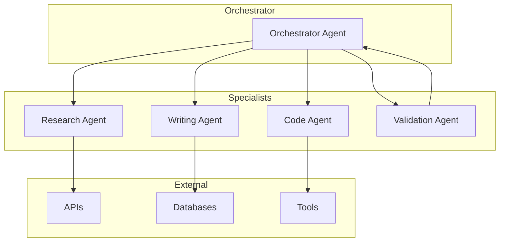
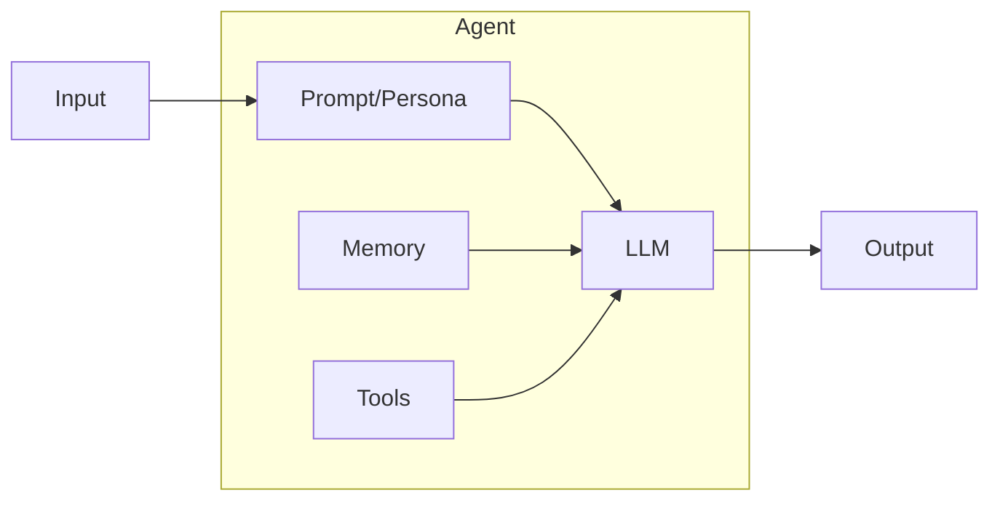
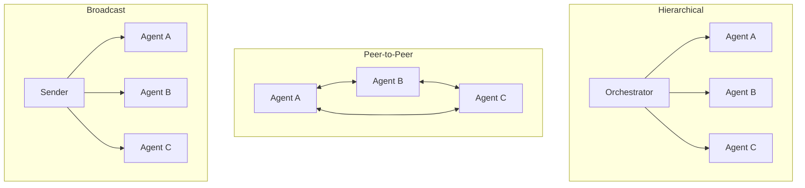
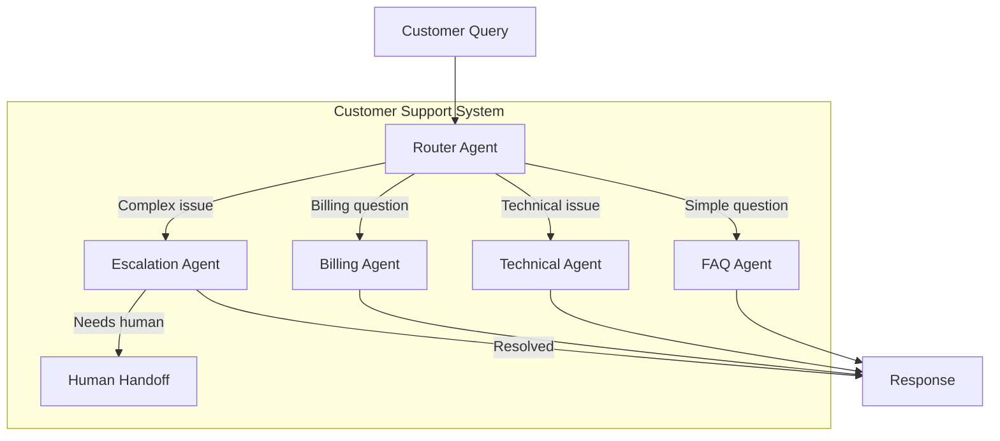
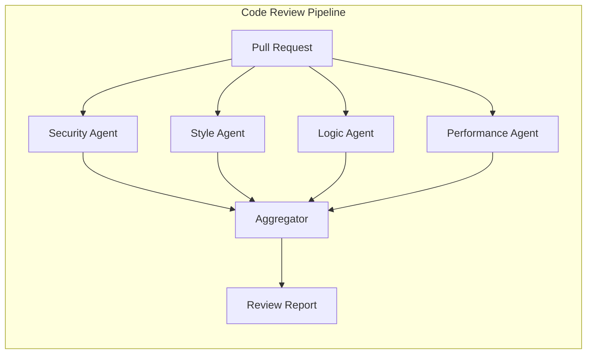
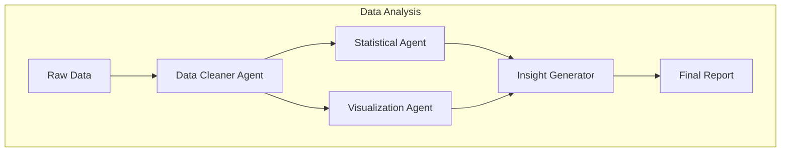

# How to Build Multi-Agent Systems

Author: [nawazdhandala](https://github.com/nawazdhandala)

Tags: AI Agents, Multi-Agent, LLM, AI

Description: A practical guide to building multi-agent systems where specialized AI agents collaborate to solve complex problems through orchestration, communication, and task delegation.

---

Multi-agent systems represent a paradigm shift in how we build AI applications. Instead of relying on a single monolithic model to handle everything, you create a team of specialized agents that collaborate, delegate, and coordinate to solve complex problems. This approach mirrors how effective human teams work and unlocks capabilities that single agents struggle to achieve alone.

## What is a Multi-Agent System?

A multi-agent system consists of multiple autonomous agents that interact with each other and their environment to achieve individual or collective goals. Each agent has its own capabilities, knowledge, and responsibilities.



### Why Use Multiple Agents?

| Single Agent | Multi-Agent System |
|--------------|-------------------|
| Context window limits constrain scope | Each agent maintains focused context |
| One model handles all tasks | Specialists excel at specific tasks |
| Difficult to debug and improve | Modular, testable components |
| Token usage scales with complexity | Parallel processing reduces latency |
| Single point of failure | Graceful degradation possible |

## Core Concepts

Before diving into implementation, let's understand the fundamental building blocks.

### Agent Anatomy

Every agent in a multi-agent system typically has these components:



### Communication Patterns

Agents can communicate in several ways:



## Building Your First Multi-Agent System

Let's build a practical example: a research and writing system that can investigate topics and produce well-structured articles.

### Project Structure

First, set up your project with a clean structure that separates concerns.

```
multi-agent-system/
├── agents/
│   ├── __init__.py
│   ├── base.py
│   ├── orchestrator.py
│   ├── researcher.py
│   ├── writer.py
│   └── reviewer.py
├── tools/
│   ├── __init__.py
│   ├── web_search.py
│   └── file_operations.py
├── memory/
│   ├── __init__.py
│   └── shared_memory.py
├── config.py
└── main.py
```

### Base Agent Class

Start by creating a base agent class that all specialized agents will inherit from. This provides consistent behavior and makes it easy to add new agents.

```python
# agents/base.py
from abc import ABC, abstractmethod
from typing import Any, Dict, List, Optional
import json
from openai import OpenAI

class BaseAgent(ABC):
    """
    Base class for all agents in the system.
    Provides common functionality for LLM interaction,
    tool execution, and message handling.
    """

    def __init__(
        self,
        name: str,
        system_prompt: str,
        model: str = "gpt-4",
        tools: Optional[List[Dict]] = None,
        temperature: float = 0.7
    ):
        self.name = name
        self.system_prompt = system_prompt
        self.model = model
        self.tools = tools or []
        self.temperature = temperature
        self.client = OpenAI()
        self.conversation_history: List[Dict] = []

    def add_message(self, role: str, content: str) -> None:
        """Add a message to the conversation history."""
        self.conversation_history.append({
            "role": role,
            "content": content
        })

    def clear_history(self) -> None:
        """Clear conversation history for a fresh start."""
        self.conversation_history = []

    def call_llm(self, user_message: str) -> str:
        """
        Send a message to the LLM and get a response.
        Handles tool calls if the model requests them.
        """
        self.add_message("user", user_message)

        messages = [
            {"role": "system", "content": self.system_prompt},
            *self.conversation_history
        ]

        # Prepare the API call with or without tools
        kwargs = {
            "model": self.model,
            "messages": messages,
            "temperature": self.temperature
        }

        if self.tools:
            kwargs["tools"] = self.tools
            kwargs["tool_choice"] = "auto"

        response = self.client.chat.completions.create(**kwargs)
        message = response.choices[0].message

        # Handle tool calls if present
        if message.tool_calls:
            return self._handle_tool_calls(message)

        # Store and return the response
        assistant_message = message.content
        self.add_message("assistant", assistant_message)
        return assistant_message

    def _handle_tool_calls(self, message) -> str:
        """
        Execute tool calls requested by the model.
        Returns the final response after all tools are executed.
        """
        self.conversation_history.append({
            "role": "assistant",
            "content": message.content,
            "tool_calls": [
                {
                    "id": tc.id,
                    "type": "function",
                    "function": {
                        "name": tc.function.name,
                        "arguments": tc.function.arguments
                    }
                }
                for tc in message.tool_calls
            ]
        })

        # Execute each tool call
        for tool_call in message.tool_calls:
            function_name = tool_call.function.name
            arguments = json.loads(tool_call.function.arguments)

            # Execute the tool and get the result
            result = self.execute_tool(function_name, arguments)

            # Add the tool response to history
            self.conversation_history.append({
                "role": "tool",
                "tool_call_id": tool_call.id,
                "content": str(result)
            })

        # Get the final response after tool execution
        messages = [
            {"role": "system", "content": self.system_prompt},
            *self.conversation_history
        ]

        response = self.client.chat.completions.create(
            model=self.model,
            messages=messages,
            temperature=self.temperature
        )

        final_message = response.choices[0].message.content
        self.add_message("assistant", final_message)
        return final_message

    @abstractmethod
    def execute_tool(self, tool_name: str, arguments: Dict) -> Any:
        """
        Execute a tool by name. Must be implemented by subclasses
        to define available tools and their behavior.
        """
        pass

    @abstractmethod
    def run(self, task: str) -> str:
        """
        Main entry point for the agent. Takes a task description
        and returns the result.
        """
        pass
```

### Research Agent

The research agent specializes in gathering information from various sources. It has access to search tools and can synthesize findings.

```python
# agents/researcher.py
from typing import Any, Dict, List
from agents.base import BaseAgent

class ResearchAgent(BaseAgent):
    """
    Specialized agent for research tasks.
    Can search the web, analyze sources, and compile findings.
    """

    def __init__(self):
        # Define the tools this agent can use
        tools = [
            {
                "type": "function",
                "function": {
                    "name": "web_search",
                    "description": "Search the web for information on a topic",
                    "parameters": {
                        "type": "object",
                        "properties": {
                            "query": {
                                "type": "string",
                                "description": "The search query"
                            },
                            "num_results": {
                                "type": "integer",
                                "description": "Number of results to return",
                                "default": 5
                            }
                        },
                        "required": ["query"]
                    }
                }
            },
            {
                "type": "function",
                "function": {
                    "name": "fetch_webpage",
                    "description": "Fetch and extract content from a webpage",
                    "parameters": {
                        "type": "object",
                        "properties": {
                            "url": {
                                "type": "string",
                                "description": "The URL to fetch"
                            }
                        },
                        "required": ["url"]
                    }
                }
            }
        ]

        system_prompt = """You are a research specialist agent. Your role is to:
1. Thoroughly investigate topics using available search tools
2. Verify information across multiple sources
3. Extract key facts, statistics, and insights
4. Organize findings in a clear, structured format
5. Cite sources for all claims

When researching:
- Start with broad searches to understand the landscape
- Follow up with specific queries for details
- Look for recent and authoritative sources
- Note any conflicting information or debates

Always provide your findings in a structured format with clear sections."""

        super().__init__(
            name="Researcher",
            system_prompt=system_prompt,
            tools=tools,
            temperature=0.3  # Lower temperature for factual research
        )

        # Initialize the actual search tools
        from tools.web_search import WebSearchTool
        self.search_tool = WebSearchTool()

    def execute_tool(self, tool_name: str, arguments: Dict) -> Any:
        """Execute research-specific tools."""
        if tool_name == "web_search":
            return self.search_tool.search(
                arguments["query"],
                arguments.get("num_results", 5)
            )
        elif tool_name == "fetch_webpage":
            return self.search_tool.fetch_page(arguments["url"])
        else:
            return f"Unknown tool: {tool_name}"

    def run(self, task: str) -> str:
        """
        Execute a research task and return structured findings.
        """
        prompt = f"""Research Task: {task}

Please conduct thorough research on this topic. Use the search tools to gather
information from multiple sources. Organize your findings with:
- Executive summary
- Key findings (with citations)
- Important statistics or data points
- Different perspectives or debates
- Recommendations for further investigation"""

        return self.call_llm(prompt)
```

### Writer Agent

The writer agent takes research findings and transforms them into polished content. It focuses on clarity, structure, and engagement.

```python
# agents/writer.py
from typing import Any, Dict
from agents.base import BaseAgent

class WriterAgent(BaseAgent):
    """
    Specialized agent for content creation.
    Transforms research into well-structured, engaging content.
    """

    def __init__(self):
        system_prompt = """You are an expert content writer. Your role is to:
1. Transform research findings into clear, engaging content
2. Structure content logically with proper headings
3. Use appropriate tone for the target audience
4. Include relevant examples and analogies
5. Ensure accuracy while maintaining readability

Writing guidelines:
- Start with a compelling introduction
- Use short paragraphs and clear transitions
- Include practical examples where appropriate
- End with actionable takeaways
- Avoid jargon unless necessary for the audience

You write in a natural, conversational style while maintaining authority."""

        super().__init__(
            name="Writer",
            system_prompt=system_prompt,
            tools=[],  # Writer primarily transforms content
            temperature=0.7  # Higher creativity for writing
        )

    def execute_tool(self, tool_name: str, arguments: Dict) -> Any:
        """Writer agent does not use tools directly."""
        return "No tools available"

    def run(self, task: str, research: str = "", style: str = "informative") -> str:
        """
        Create content based on research findings.

        Args:
            task: Description of what to write
            research: Research findings to base the content on
            style: Writing style (informative, tutorial, opinion)
        """
        prompt = f"""Writing Task: {task}

Style: {style}

Research to incorporate:
{research}

Please write high-quality content that:
1. Accurately represents the research findings
2. Is engaging and easy to read
3. Includes practical insights
4. Flows logically from introduction to conclusion"""

        return self.call_llm(prompt)
```

### Reviewer Agent

The reviewer agent validates content quality, checks for errors, and suggests improvements.

```python
# agents/reviewer.py
from typing import Any, Dict
from agents.base import BaseAgent

class ReviewerAgent(BaseAgent):
    """
    Specialized agent for content review and quality assurance.
    Validates accuracy, checks structure, and suggests improvements.
    """

    def __init__(self):
        system_prompt = """You are a meticulous content reviewer. Your role is to:
1. Check factual accuracy against provided research
2. Evaluate logical flow and structure
3. Identify unclear or confusing sections
4. Spot grammatical and stylistic issues
5. Suggest specific improvements

Review criteria:
- Accuracy: Do claims match the research?
- Clarity: Is the content easy to understand?
- Completeness: Are important points covered?
- Engagement: Will readers find this valuable?
- Structure: Does the organization make sense?

Provide actionable feedback with specific suggestions."""

        super().__init__(
            name="Reviewer",
            system_prompt=system_prompt,
            tools=[],
            temperature=0.3  # Lower temperature for critical analysis
        )

    def execute_tool(self, tool_name: str, arguments: Dict) -> Any:
        """Reviewer agent does not use tools directly."""
        return "No tools available"

    def run(self, content: str, research: str = "") -> Dict[str, Any]:
        """
        Review content and provide structured feedback.

        Returns a dictionary with scores and specific feedback.
        """
        prompt = f"""Please review this content:

CONTENT:
{content}

ORIGINAL RESEARCH:
{research}

Provide your review in this format:
1. Overall Assessment (1-10 score with justification)
2. Accuracy Check (list any factual issues)
3. Structure Analysis (is the flow logical?)
4. Clarity Issues (any confusing sections?)
5. Specific Improvements (actionable suggestions)
6. Final Verdict (approve/revise/reject)"""

        response = self.call_llm(prompt)

        # Parse the response into structured feedback
        return {
            "raw_feedback": response,
            "agent": self.name
        }
```

### Orchestrator Agent

The orchestrator is the conductor of your multi-agent symphony. It receives tasks, breaks them down, delegates to specialists, and synthesizes results.

```python
# agents/orchestrator.py
from typing import Any, Dict, List, Optional
from agents.base import BaseAgent
from agents.researcher import ResearchAgent
from agents.writer import WriterAgent
from agents.reviewer import ReviewerAgent

class OrchestratorAgent(BaseAgent):
    """
    Central coordinator that manages task delegation and workflow.
    Decides which agents to invoke and how to combine their outputs.
    """

    def __init__(self):
        # Define orchestration tools
        tools = [
            {
                "type": "function",
                "function": {
                    "name": "delegate_research",
                    "description": "Delegate a research task to the research agent",
                    "parameters": {
                        "type": "object",
                        "properties": {
                            "topic": {
                                "type": "string",
                                "description": "The topic to research"
                            }
                        },
                        "required": ["topic"]
                    }
                }
            },
            {
                "type": "function",
                "function": {
                    "name": "delegate_writing",
                    "description": "Delegate content creation to the writer agent",
                    "parameters": {
                        "type": "object",
                        "properties": {
                            "task": {
                                "type": "string",
                                "description": "Writing task description"
                            },
                            "research": {
                                "type": "string",
                                "description": "Research findings to use"
                            },
                            "style": {
                                "type": "string",
                                "description": "Writing style",
                                "enum": ["informative", "tutorial", "opinion"]
                            }
                        },
                        "required": ["task"]
                    }
                }
            },
            {
                "type": "function",
                "function": {
                    "name": "delegate_review",
                    "description": "Send content to reviewer for quality check",
                    "parameters": {
                        "type": "object",
                        "properties": {
                            "content": {
                                "type": "string",
                                "description": "Content to review"
                            },
                            "research": {
                                "type": "string",
                                "description": "Original research for accuracy check"
                            }
                        },
                        "required": ["content"]
                    }
                }
            }
        ]

        system_prompt = """You are the orchestrator of a multi-agent system. Your role is to:
1. Analyze incoming tasks and break them into subtasks
2. Delegate work to specialized agents
3. Coordinate the workflow between agents
4. Synthesize outputs into final deliverables
5. Handle errors and adjust plans as needed

Available agents:
- Researcher: Gathers and analyzes information
- Writer: Creates polished content
- Reviewer: Validates quality and accuracy

Workflow principles:
- Always research before writing
- Review all content before delivery
- Iterate based on feedback
- Communicate progress clearly"""

        super().__init__(
            name="Orchestrator",
            system_prompt=system_prompt,
            tools=tools,
            temperature=0.5
        )

        # Initialize specialist agents
        self.researcher = ResearchAgent()
        self.writer = WriterAgent()
        self.reviewer = ReviewerAgent()

        # Track workflow state
        self.current_research: Optional[str] = None
        self.current_draft: Optional[str] = None
        self.iteration_count: int = 0
        self.max_iterations: int = 3

    def execute_tool(self, tool_name: str, arguments: Dict) -> Any:
        """Route tool calls to appropriate specialist agents."""
        if tool_name == "delegate_research":
            result = self.researcher.run(arguments["topic"])
            self.current_research = result
            return result

        elif tool_name == "delegate_writing":
            research = arguments.get("research", self.current_research or "")
            style = arguments.get("style", "informative")
            result = self.writer.run(arguments["task"], research, style)
            self.current_draft = result
            return result

        elif tool_name == "delegate_review":
            research = arguments.get("research", self.current_research or "")
            return self.reviewer.run(arguments["content"], research)

        return f"Unknown tool: {tool_name}"

    def run(self, task: str) -> str:
        """
        Execute a complex task using the multi-agent workflow.

        Typical flow:
        1. Analyze the task
        2. Research the topic
        3. Create initial draft
        4. Review and iterate
        5. Deliver final output
        """
        self.clear_history()
        self.iteration_count = 0

        prompt = f"""Task: {task}

Please orchestrate the completion of this task by:
1. First delegating research to understand the topic
2. Using the research to create quality content
3. Having the content reviewed
4. Making improvements if needed
5. Delivering the final result

Start by researching the topic, then proceed through the workflow."""

        return self.call_llm(prompt)
```

### Shared Memory

For agents to collaborate effectively, they need a way to share context. Here's a simple shared memory implementation.

```python
# memory/shared_memory.py
from typing import Any, Dict, List, Optional
from datetime import datetime
import json
from threading import Lock

class SharedMemory:
    """
    Thread-safe shared memory for multi-agent communication.
    Stores artifacts, context, and agent outputs.
    """

    def __init__(self):
        self._storage: Dict[str, Any] = {}
        self._history: List[Dict] = []
        self._lock = Lock()

    def store(self, key: str, value: Any, agent: str = "system") -> None:
        """
        Store a value in shared memory.
        Thread-safe for concurrent agent access.
        """
        with self._lock:
            self._storage[key] = value
            self._history.append({
                "timestamp": datetime.now().isoformat(),
                "action": "store",
                "key": key,
                "agent": agent
            })

    def retrieve(self, key: str, default: Any = None) -> Any:
        """Retrieve a value from shared memory."""
        with self._lock:
            return self._storage.get(key, default)

    def get_all(self) -> Dict[str, Any]:
        """Get all stored values."""
        with self._lock:
            return dict(self._storage)

    def get_history(self, agent: Optional[str] = None) -> List[Dict]:
        """
        Get access history, optionally filtered by agent.
        Useful for debugging and understanding workflow.
        """
        with self._lock:
            if agent:
                return [h for h in self._history if h["agent"] == agent]
            return list(self._history)

    def clear(self) -> None:
        """Clear all stored data."""
        with self._lock:
            self._storage = {}
            self._history = []
```

### Main Application

Now let's put everything together in the main application.

```python
# main.py
from agents.orchestrator import OrchestratorAgent
from memory.shared_memory import SharedMemory

def main():
    """
    Main entry point for the multi-agent system.
    Demonstrates a complete workflow from task to deliverable.
    """
    # Initialize shared memory for cross-agent communication
    memory = SharedMemory()

    # Create the orchestrator (which manages all other agents)
    orchestrator = OrchestratorAgent()

    # Define a complex task that requires multiple agents
    task = """
    Create a comprehensive guide about implementing rate limiting
    in distributed systems. The guide should cover:
    - Different rate limiting algorithms
    - Implementation strategies
    - Best practices for production systems
    - Common pitfalls to avoid

    Target audience: Backend engineers with intermediate experience.
    """

    print("Starting multi-agent workflow...")
    print("=" * 50)

    # Execute the task through the orchestrator
    result = orchestrator.run(task)

    # Store the final result in shared memory
    memory.store("final_output", result, agent="orchestrator")

    print("\nFinal Output:")
    print("=" * 50)
    print(result)

    # Show workflow history
    print("\nWorkflow History:")
    print("=" * 50)
    for entry in memory.get_history():
        print(f"[{entry['timestamp']}] {entry['agent']}: {entry['action']} - {entry['key']}")

if __name__ == "__main__":
    main()
```

## Advanced Patterns

Once you have the basics working, you can implement more sophisticated patterns.

### Parallel Agent Execution

When tasks can be performed independently, run agents in parallel to reduce latency.

```python
# patterns/parallel.py
import asyncio
from typing import List, Dict, Any
from concurrent.futures import ThreadPoolExecutor

class ParallelExecutor:
    """
    Execute multiple agent tasks in parallel.
    Useful when tasks are independent of each other.
    """

    def __init__(self, max_workers: int = 4):
        self.executor = ThreadPoolExecutor(max_workers=max_workers)

    async def run_parallel(
        self,
        agents: List[Any],
        tasks: List[str]
    ) -> List[str]:
        """
        Run multiple agents on their respective tasks in parallel.

        Args:
            agents: List of agent instances
            tasks: List of task strings (one per agent)

        Returns:
            List of results in the same order as inputs
        """
        loop = asyncio.get_event_loop()

        # Create futures for all agent tasks
        futures = [
            loop.run_in_executor(
                self.executor,
                agent.run,
                task
            )
            for agent, task in zip(agents, tasks)
        ]

        # Wait for all to complete
        results = await asyncio.gather(*futures)
        return results

# Usage example
async def research_multiple_topics(topics: List[str]) -> List[str]:
    """Research multiple topics in parallel."""
    from agents.researcher import ResearchAgent

    # Create one researcher per topic
    researchers = [ResearchAgent() for _ in topics]

    executor = ParallelExecutor(max_workers=len(topics))
    results = await executor.run_parallel(researchers, topics)

    return results
```

### Agent Debate Pattern

Have multiple agents debate a topic to explore different perspectives and arrive at well-reasoned conclusions.

```python
# patterns/debate.py
from typing import List, Dict
from agents.base import BaseAgent

class DebateAgent(BaseAgent):
    """Agent that participates in structured debates."""

    def __init__(self, name: str, position: str):
        system_prompt = f"""You are a debate participant arguing for: {position}

Your role is to:
1. Present logical arguments supporting your position
2. Respond to counterarguments thoughtfully
3. Acknowledge valid points from opponents
4. Build on previous arguments in the debate

Be persuasive but fair. Use evidence and reasoning."""

        super().__init__(
            name=name,
            system_prompt=system_prompt,
            temperature=0.7
        )
        self.position = position

    def execute_tool(self, tool_name: str, arguments: Dict):
        return "No tools available"

    def run(self, context: str) -> str:
        return self.call_llm(context)


class DebateModerator:
    """
    Orchestrates a structured debate between agents.
    Synthesizes arguments into a balanced conclusion.
    """

    def __init__(self, topic: str, positions: List[str], rounds: int = 3):
        self.topic = topic
        self.rounds = rounds
        self.debaters = [
            DebateAgent(f"Debater_{i}", pos)
            for i, pos in enumerate(positions)
        ]
        self.transcript: List[Dict] = []

    def run_debate(self) -> Dict[str, any]:
        """
        Execute the full debate and return results.
        """
        # Opening statements
        print(f"Debate Topic: {self.topic}\n")

        for debater in self.debaters:
            opening = debater.run(
                f"Topic: {self.topic}\n\nProvide your opening statement."
            )
            self.transcript.append({
                "speaker": debater.name,
                "position": debater.position,
                "type": "opening",
                "content": opening
            })
            print(f"{debater.name} ({debater.position}):\n{opening}\n")

        # Debate rounds
        for round_num in range(self.rounds):
            print(f"\n--- Round {round_num + 1} ---\n")

            for i, debater in enumerate(self.debaters):
                # Build context from previous statements
                context = self._build_context(round_num, i)

                response = debater.run(context)
                self.transcript.append({
                    "speaker": debater.name,
                    "position": debater.position,
                    "type": f"round_{round_num + 1}",
                    "content": response
                })
                print(f"{debater.name}:\n{response}\n")

        # Generate synthesis
        synthesis = self._synthesize()

        return {
            "topic": self.topic,
            "transcript": self.transcript,
            "synthesis": synthesis
        }

    def _build_context(self, round_num: int, debater_idx: int) -> str:
        """Build context including opponent's recent arguments."""
        recent = self.transcript[-len(self.debaters):]

        context = f"Topic: {self.topic}\n\nRecent arguments:\n"
        for entry in recent:
            if entry["speaker"] != self.debaters[debater_idx].name:
                context += f"\n{entry['speaker']}: {entry['content']}\n"

        context += "\nRespond to the arguments above and strengthen your position."
        return context

    def _synthesize(self) -> str:
        """Synthesize debate into balanced conclusion."""
        from agents.base import BaseAgent

        # Use a neutral synthesizer
        class Synthesizer(BaseAgent):
            def execute_tool(self, tool_name, arguments):
                return "No tools"
            def run(self, task):
                return self.call_llm(task)

        synthesizer = Synthesizer(
            name="Synthesizer",
            system_prompt="You analyze debates and provide balanced syntheses.",
            temperature=0.3
        )

        transcript_text = "\n\n".join([
            f"{t['speaker']} ({t['position']}): {t['content']}"
            for t in self.transcript
        ])

        return synthesizer.run(f"""
Analyze this debate and provide a balanced synthesis:

{transcript_text}

Provide:
1. Summary of key arguments from each side
2. Points of agreement
3. Unresolved tensions
4. A balanced conclusion
""")
```

### Supervisor Pattern with Error Recovery

Implement a supervisor that monitors agent execution and handles failures gracefully.

```python
# patterns/supervisor.py
from typing import Any, Callable, Dict, Optional
from dataclasses import dataclass
from enum import Enum
import traceback
import time

class TaskStatus(Enum):
    PENDING = "pending"
    RUNNING = "running"
    COMPLETED = "completed"
    FAILED = "failed"
    RETRYING = "retrying"

@dataclass
class TaskResult:
    status: TaskStatus
    result: Optional[Any] = None
    error: Optional[str] = None
    attempts: int = 0
    duration: float = 0.0

class Supervisor:
    """
    Supervises agent execution with error handling,
    retries, and fallback strategies.
    """

    def __init__(
        self,
        max_retries: int = 3,
        retry_delay: float = 1.0,
        timeout: float = 60.0
    ):
        self.max_retries = max_retries
        self.retry_delay = retry_delay
        self.timeout = timeout
        self.task_history: Dict[str, TaskResult] = {}

    def execute_with_supervision(
        self,
        task_id: str,
        agent: Any,
        task: str,
        fallback: Optional[Callable] = None
    ) -> TaskResult:
        """
        Execute an agent task with full supervision.

        Args:
            task_id: Unique identifier for tracking
            agent: The agent to execute
            task: Task description
            fallback: Optional fallback function if all retries fail
        """
        attempts = 0
        start_time = time.time()
        last_error = None

        while attempts < self.max_retries:
            attempts += 1

            try:
                # Execute the agent task
                result = agent.run(task)

                # Success
                task_result = TaskResult(
                    status=TaskStatus.COMPLETED,
                    result=result,
                    attempts=attempts,
                    duration=time.time() - start_time
                )
                self.task_history[task_id] = task_result
                return task_result

            except Exception as e:
                last_error = str(e)
                print(f"Attempt {attempts} failed: {last_error}")

                if attempts < self.max_retries:
                    print(f"Retrying in {self.retry_delay} seconds...")
                    time.sleep(self.retry_delay)

        # All retries exhausted
        if fallback:
            try:
                print("Executing fallback strategy...")
                fallback_result = fallback(task)
                task_result = TaskResult(
                    status=TaskStatus.COMPLETED,
                    result=fallback_result,
                    attempts=attempts,
                    duration=time.time() - start_time
                )
                self.task_history[task_id] = task_result
                return task_result
            except Exception as e:
                last_error = f"Fallback also failed: {str(e)}"

        # Complete failure
        task_result = TaskResult(
            status=TaskStatus.FAILED,
            error=last_error,
            attempts=attempts,
            duration=time.time() - start_time
        )
        self.task_history[task_id] = task_result
        return task_result
```

## Real-World Use Cases

### Customer Support System

A multi-agent system for handling customer inquiries effectively.



### Code Review Pipeline

Automated code review with specialized agents.



### Data Analysis Workflow

Multi-stage data analysis with specialized agents.



## Best Practices

Building reliable multi-agent systems requires attention to several key areas.

### 1. Design Clear Agent Boundaries

Each agent should have a single, well-defined responsibility. When you find an agent doing too much, split it into multiple specialists.

```python
# Good: Clear, focused responsibility
class DataValidationAgent(BaseAgent):
    """Only validates data structure and types."""
    pass

class DataEnrichmentAgent(BaseAgent):
    """Only adds derived fields and lookups."""
    pass

# Avoid: Agent doing too many things
class DataProcessingAgent(BaseAgent):
    """Validates, enriches, transforms, and stores data."""
    pass
```

### 2. Implement Proper Error Handling

Agents will fail. Plan for it by implementing retries, fallbacks, and graceful degradation.

```python
def safe_agent_call(agent, task, fallback_response="Unable to process"):
    """Wrap agent calls with proper error handling."""
    try:
        return agent.run(task)
    except RateLimitError:
        time.sleep(60)
        return agent.run(task)  # Retry once
    except ContextLengthError:
        # Summarize context and retry
        summarized_task = summarize(task)
        return agent.run(summarized_task)
    except Exception as e:
        logger.error(f"Agent {agent.name} failed: {e}")
        return fallback_response
```

### 3. Monitor and Log Everything

Comprehensive logging helps debug complex multi-agent interactions.

```python
import logging
from datetime import datetime

class AgentLogger:
    """Structured logging for multi-agent systems."""

    def __init__(self, agent_name: str):
        self.agent_name = agent_name
        self.logger = logging.getLogger(f"agent.{agent_name}")

    def log_action(self, action: str, details: Dict):
        self.logger.info({
            "timestamp": datetime.now().isoformat(),
            "agent": self.agent_name,
            "action": action,
            **details
        })

    def log_delegation(self, target_agent: str, task: str):
        self.log_action("delegation", {
            "target": target_agent,
            "task_preview": task[:100]
        })

    def log_result(self, success: bool, result_preview: str):
        self.log_action("result", {
            "success": success,
            "preview": result_preview[:100]
        })
```

### 4. Test Agents in Isolation

Unit test each agent independently before testing the integrated system.

```python
import pytest
from unittest.mock import Mock, patch

class TestResearchAgent:
    """Test suite for the research agent."""

    def test_search_delegation(self):
        """Verify the agent properly delegates to search tool."""
        agent = ResearchAgent()

        # Mock the search tool
        agent.search_tool = Mock()
        agent.search_tool.search.return_value = [
            {"title": "Test Result", "url": "http://test.com"}
        ]

        # The agent should use the tool
        result = agent.run("Research quantum computing basics")

        assert agent.search_tool.search.called

    def test_handles_empty_results(self):
        """Agent should gracefully handle no search results."""
        agent = ResearchAgent()
        agent.search_tool = Mock()
        agent.search_tool.search.return_value = []

        # Should not raise an error
        result = agent.run("Research obscure topic")
        assert result is not None
```

### 5. Manage Context Windows Wisely

LLMs have context limits. Implement strategies to work within them.

```python
class ContextManager:
    """Manage context to stay within token limits."""

    def __init__(self, max_tokens: int = 8000):
        self.max_tokens = max_tokens

    def trim_context(self, messages: List[Dict], new_message: str) -> List[Dict]:
        """
        Trim older messages to make room for new ones.
        Keeps system message and recent conversation.
        """
        # Estimate tokens (rough: 1 token per 4 chars)
        def estimate_tokens(text: str) -> int:
            return len(text) // 4

        total_tokens = sum(
            estimate_tokens(m.get("content", ""))
            for m in messages
        )
        total_tokens += estimate_tokens(new_message)

        # Remove older messages until under limit
        while total_tokens > self.max_tokens and len(messages) > 2:
            removed = messages.pop(1)  # Keep system message at index 0
            total_tokens -= estimate_tokens(removed.get("content", ""))

        return messages

    def summarize_history(self, messages: List[Dict]) -> str:
        """Create a summary of conversation history."""
        # Use a smaller model for summarization
        summary_prompt = "Summarize this conversation concisely:\n\n"
        for msg in messages[1:]:  # Skip system message
            summary_prompt += f"{msg['role']}: {msg['content'][:200]}...\n"

        # Call summarization (implementation depends on your setup)
        return self._call_summarizer(summary_prompt)
```

## Conclusion

Multi-agent systems unlock new possibilities for building intelligent applications. By breaking complex problems into specialized agents that collaborate, you can create systems that are more capable, maintainable, and robust than single-agent approaches.

The key principles to remember:

1. **Start simple** - Begin with two or three agents and add complexity as needed
2. **Define clear roles** - Each agent should have a focused responsibility
3. **Design for failure** - Implement proper error handling and recovery
4. **Monitor everything** - Logging and observability are essential for debugging
5. **Iterate based on results** - Let real usage guide your architecture decisions

As LLMs continue to improve, multi-agent systems will become increasingly powerful. The patterns and practices you learn today will scale to more sophisticated applications tomorrow.

---

Multi-agent systems represent the future of AI application development. By combining specialized agents with thoughtful orchestration, you can build systems that tackle problems no single model could handle alone. Start experimenting with the patterns in this guide, and you will discover new possibilities for what AI can achieve.
