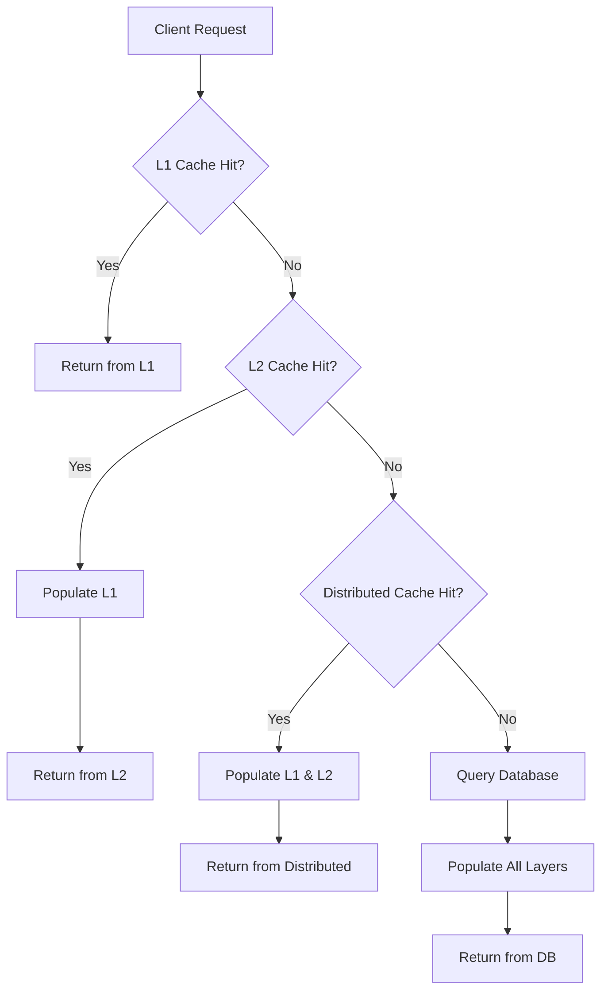
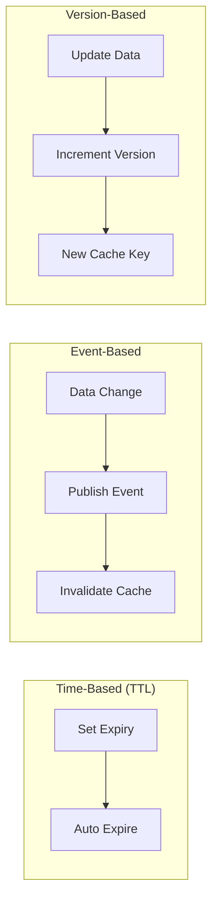

# How to Create Multi-Layer Caching Details

Author: [nawazdhandala](https://github.com/nawazdhandala)

Tags: Caching, Multi-Layer, Performance, Architecture

Description: Learn to create multi-layer caching strategies with L1, L2, and distributed caches working together.

---

Caching is one of the most effective ways to improve application performance. A single cache layer works well for simple applications, but as your system grows, you need a more sophisticated approach. Multi-layer caching combines different caching strategies to maximize hit rates and minimize latency.

## What is Multi-Layer Caching?

Multi-layer caching uses multiple cache levels, each with different characteristics. Data flows through these layers based on access patterns and freshness requirements. When a request arrives, the system checks each layer starting from the fastest (and smallest) to the slowest (and largest).



## Cache Layer Characteristics

Each cache layer serves a specific purpose. Understanding their trade-offs helps you design an effective caching strategy.

| Layer | Location | Capacity | Latency | Scope |
|-------|----------|----------|---------|-------|
| L1 | In-process memory | Small (MB) | Microseconds | Single instance |
| L2 | Local Redis/Memcached | Medium (GB) | Milliseconds | Single server |
| Distributed | Remote Redis Cluster | Large (TB) | 1-10ms | All servers |
| Database | Persistent storage | Unlimited | 10-100ms | All servers |

## Implementing the Cache Layers

Let's build a multi-layer cache system in TypeScript. We start by defining interfaces that each cache layer will implement.

```typescript
// Define a common interface for all cache layers
interface CacheLayer {
  get<T>(key: string): Promise<T | null>;
  set<T>(key: string, value: T, ttlSeconds?: number): Promise<void>;
  delete(key: string): Promise<void>;
}

// L1 Cache: In-memory with LRU eviction
class L1Cache implements CacheLayer {
  private cache: Map<string, { value: any; expires: number }> = new Map();
  private maxSize: number;

  constructor(maxSize: number = 1000) {
    this.maxSize = maxSize;
  }

  async get<T>(key: string): Promise<T | null> {
    const entry = this.cache.get(key);
    if (!entry) return null;

    // Check if entry has expired
    if (entry.expires < Date.now()) {
      this.cache.delete(key);
      return null;
    }

    return entry.value as T;
  }

  async set<T>(key: string, value: T, ttlSeconds: number = 60): Promise<void> {
    // Evict oldest entries if cache is full
    if (this.cache.size >= this.maxSize) {
      const firstKey = this.cache.keys().next().value;
      this.cache.delete(firstKey);
    }

    this.cache.set(key, {
      value,
      expires: Date.now() + (ttlSeconds * 1000)
    });
  }

  async delete(key: string): Promise<void> {
    this.cache.delete(key);
  }
}
```

The L2 cache connects to a local Redis instance. This provides persistence across application restarts and larger storage capacity.

```typescript
import Redis from 'ioredis';

// L2 Cache: Local Redis instance
class L2Cache implements CacheLayer {
  private redis: Redis;

  constructor(host: string = 'localhost', port: number = 6379) {
    this.redis = new Redis({ host, port });
  }

  async get<T>(key: string): Promise<T | null> {
    const data = await this.redis.get(key);
    if (!data) return null;
    return JSON.parse(data) as T;
  }

  async set<T>(key: string, value: T, ttlSeconds: number = 300): Promise<void> {
    await this.redis.setex(key, ttlSeconds, JSON.stringify(value));
  }

  async delete(key: string): Promise<void> {
    await this.redis.del(key);
  }
}
```

The distributed cache uses a Redis cluster for high availability and serves as the last caching layer before hitting the database.

```typescript
// Distributed Cache: Redis Cluster for cross-server caching
class DistributedCache implements CacheLayer {
  private cluster: Redis.Cluster;

  constructor(nodes: { host: string; port: number }[]) {
    this.cluster = new Redis.Cluster(nodes);
  }

  async get<T>(key: string): Promise<T | null> {
    const data = await this.cluster.get(key);
    if (!data) return null;
    return JSON.parse(data) as T;
  }

  async set<T>(key: string, value: T, ttlSeconds: number = 3600): Promise<void> {
    await this.cluster.setex(key, ttlSeconds, JSON.stringify(value));
  }

  async delete(key: string): Promise<void> {
    await this.cluster.del(key);
  }
}
```

## The Multi-Layer Cache Manager

Now we combine all layers into a unified cache manager. This class handles the cascade logic and keeps all layers synchronized.

```typescript
class MultiLayerCache {
  private l1: L1Cache;
  private l2: L2Cache;
  private distributed: DistributedCache;

  constructor(
    l1: L1Cache,
    l2: L2Cache,
    distributed: DistributedCache
  ) {
    this.l1 = l1;
    this.l2 = l2;
    this.distributed = distributed;
  }

  async get<T>(key: string): Promise<T | null> {
    // Try L1 first (fastest)
    let value = await this.l1.get<T>(key);
    if (value !== null) {
      return value;
    }

    // Try L2 next
    value = await this.l2.get<T>(key);
    if (value !== null) {
      // Populate L1 for future requests
      await this.l1.set(key, value, 60);
      return value;
    }

    // Try distributed cache
    value = await this.distributed.get<T>(key);
    if (value !== null) {
      // Populate both L1 and L2
      await Promise.all([
        this.l1.set(key, value, 60),
        this.l2.set(key, value, 300)
      ]);
      return value;
    }

    return null;
  }

  async set<T>(key: string, value: T): Promise<void> {
    // Write to all layers simultaneously
    await Promise.all([
      this.l1.set(key, value, 60),
      this.l2.set(key, value, 300),
      this.distributed.set(key, value, 3600)
    ]);
  }

  async invalidate(key: string): Promise<void> {
    // Remove from all layers
    await Promise.all([
      this.l1.delete(key),
      this.l2.delete(key),
      this.distributed.delete(key)
    ]);
  }
}
```

## Cache Invalidation Strategies

Cache invalidation is notoriously difficult. Here are three common strategies you can use depending on your consistency requirements.



| Strategy | Consistency | Complexity | Use Case |
|----------|-------------|------------|----------|
| TTL-based | Eventual | Low | Read-heavy, tolerates stale data |
| Event-based | Strong | Medium | Real-time updates required |
| Version-based | Strong | High | Critical data integrity |

## Practical Usage Example

Here is how you would use the multi-layer cache in a real application to cache user profiles.

```typescript
// Initialize cache layers
const l1 = new L1Cache(1000);
const l2 = new L2Cache('localhost', 6379);
const distributed = new DistributedCache([
  { host: 'redis-1.example.com', port: 6379 },
  { host: 'redis-2.example.com', port: 6379 }
]);

const cache = new MultiLayerCache(l1, l2, distributed);

// Fetch user with caching
async function getUser(userId: string): Promise<User> {
  const cacheKey = `user:${userId}`;

  // Check cache first
  let user = await cache.get<User>(cacheKey);
  if (user) {
    return user;
  }

  // Cache miss: fetch from database
  user = await database.users.findById(userId);

  // Store in cache for future requests
  if (user) {
    await cache.set(cacheKey, user);
  }

  return user;
}

// Update user and invalidate cache
async function updateUser(userId: string, data: Partial<User>): Promise<void> {
  await database.users.update(userId, data);
  await cache.invalidate(`user:${userId}`);
}
```

## Performance Monitoring

Track cache performance to identify issues and optimize your configuration. Key metrics to monitor include hit rates, latency percentiles, and memory usage.

```typescript
class CacheMetrics {
  private hits: { l1: number; l2: number; distributed: number } = {
    l1: 0, l2: 0, distributed: 0
  };
  private misses: number = 0;

  recordHit(layer: 'l1' | 'l2' | 'distributed'): void {
    this.hits[layer]++;
  }

  recordMiss(): void {
    this.misses++;
  }

  getStats(): object {
    const total = this.hits.l1 + this.hits.l2 + this.hits.distributed + this.misses;
    return {
      hitRate: ((total - this.misses) / total * 100).toFixed(2) + '%',
      l1HitRate: (this.hits.l1 / total * 100).toFixed(2) + '%',
      l2HitRate: (this.hits.l2 / total * 100).toFixed(2) + '%',
      distributedHitRate: (this.hits.distributed / total * 100).toFixed(2) + '%'
    };
  }
}
```

## Best Practices

When implementing multi-layer caching, keep these guidelines in mind:

1. **Size your L1 cache carefully.** Too small and you get constant evictions. Too large and you waste memory that could serve requests.

2. **Use shorter TTLs for higher layers.** L1 should have the shortest TTL (seconds to minutes), while the distributed cache can have longer TTLs (hours).

3. **Implement circuit breakers.** If the distributed cache becomes unavailable, your application should continue functioning with L1 and L2.

4. **Serialize consistently.** Use the same serialization format across all layers to avoid subtle bugs.

5. **Monitor and alert.** Set up alerts for low hit rates or high latency, which indicate configuration problems.

Multi-layer caching requires more initial setup than a single cache, but the performance benefits justify the complexity for high-traffic applications. Start with two layers and add more as your needs grow.
