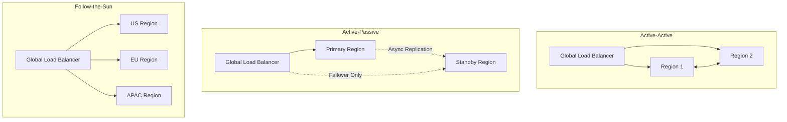
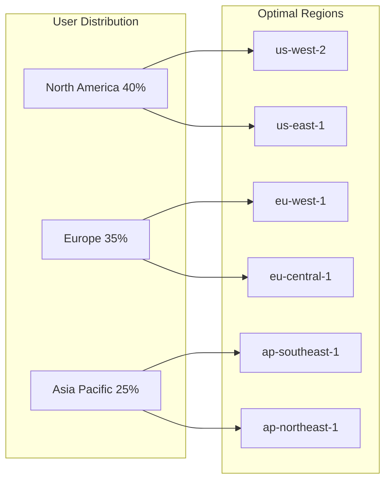
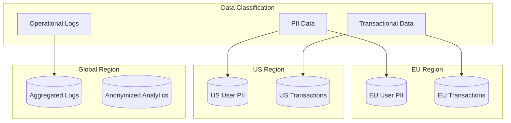
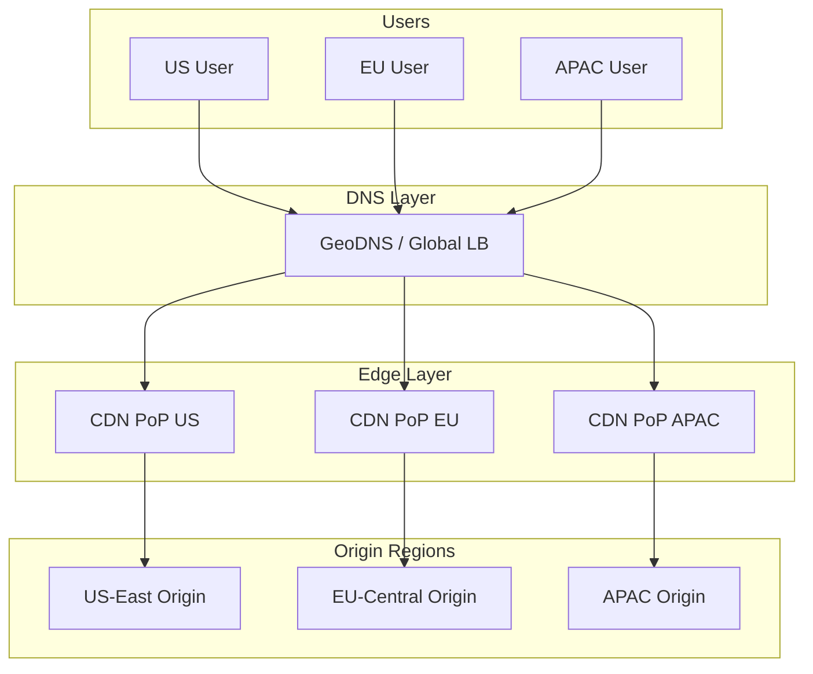
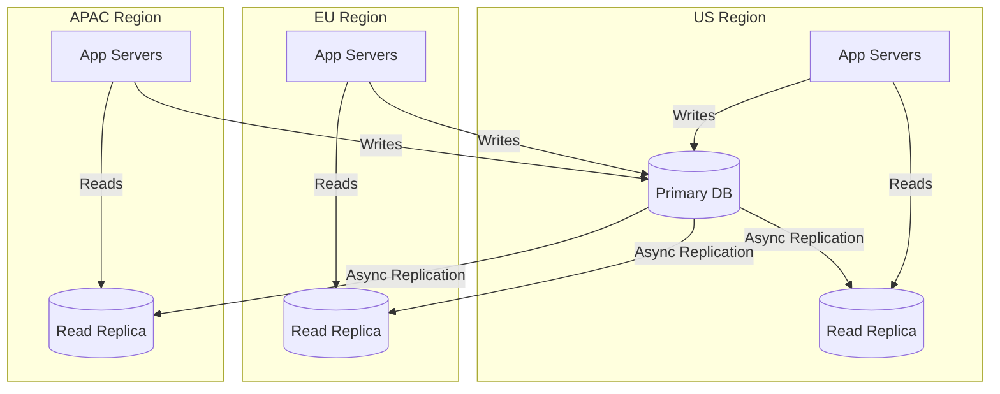
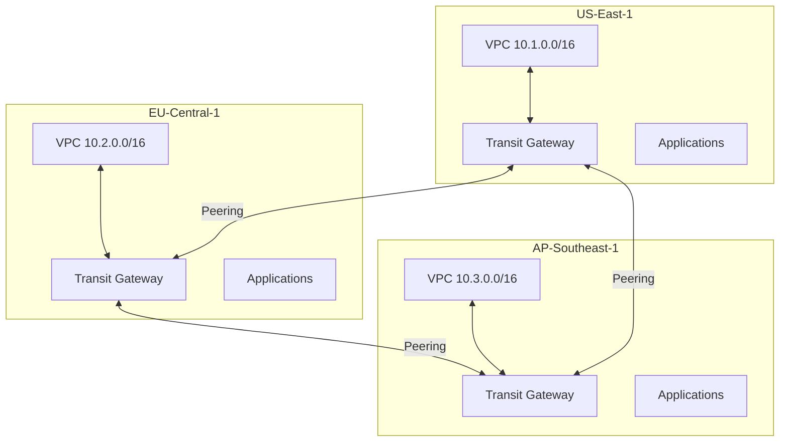
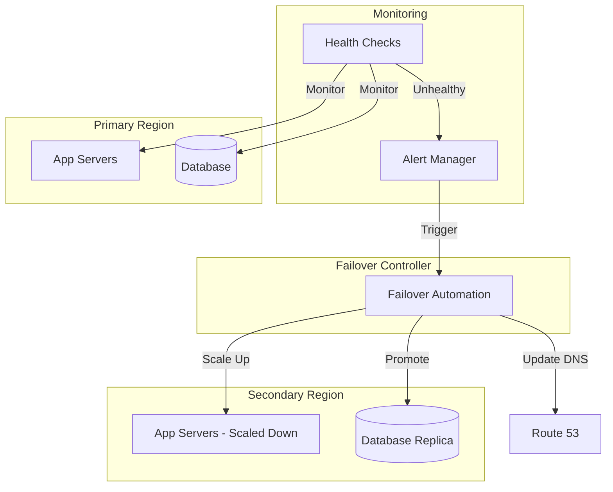
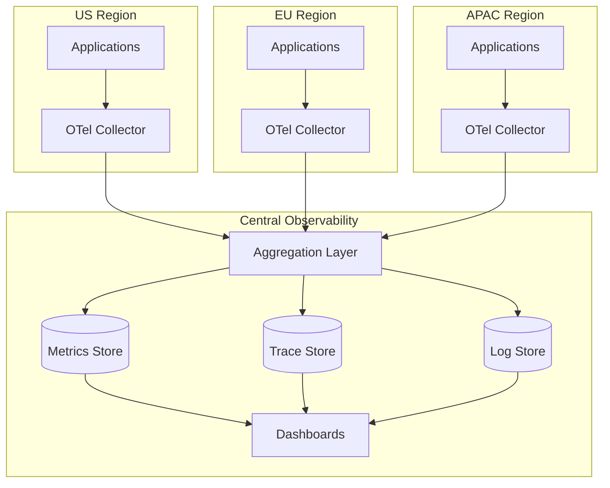
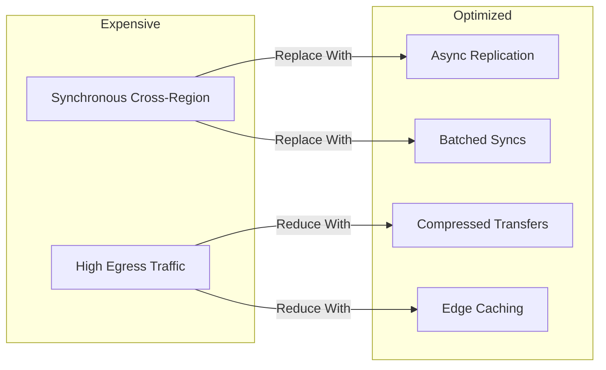

# How to Build Multi-Region Architecture

Author: [nawazdhandala](https://github.com/nawazdhandala)

Tags: High Availability, Architecture, Cloud, SRE

Description: Learn how to design multi-region architectures for global availability and disaster resilience.

---

A single region is a single point of failure. When AWS us-east-1 goes down, half the internet feels it. Multi-region architecture is not just about redundancy; it is about serving users from the nearest location, meeting data residency requirements, and surviving catastrophic failures that take out entire geographic areas.

## Why Multi-Region?

There are three primary drivers for multi-region deployments:

1. **Latency reduction** - Users in Tokyo should not wait for packets to travel to Virginia
2. **Disaster resilience** - Natural disasters, power grid failures, and fiber cuts are regional
3. **Data residency compliance** - GDPR, data sovereignty laws, and contractual obligations

## Multi-Region Architecture Patterns



### Pattern Comparison

| Pattern | RTO | RPO | Cost | Complexity | Best For |
|---------|-----|-----|------|------------|----------|
| Active-Active | Near Zero | Zero | 2x+ | High | Global apps, zero downtime |
| Active-Passive | Minutes to Hours | Minutes | 1.5x | Medium | DR requirements |
| Follow-the-Sun | Near Zero | Zero | 2-3x | Very High | 24/7 global operations |

## Region Selection Strategy

Choosing the right regions is critical. Consider these factors:

### Latency Analysis



### Region Selection Checklist

```python
# Region scoring script for multi-region planning
# Evaluates regions based on multiple criteria

def score_region(region_data):
    """
    Score a region based on weighted criteria.
    Higher score indicates better fit for deployment.
    """
    weights = {
        'user_proximity': 0.30,      # How close to user base
        'service_availability': 0.20, # Services you need are available
        'compliance': 0.20,           # Meets regulatory requirements
        'cost': 0.15,                 # Relative pricing
        'interconnect': 0.15          # Network connectivity to other regions
    }

    score = 0
    for criterion, weight in weights.items():
        # Normalize each criterion to 0-100 scale
        score += region_data.get(criterion, 0) * weight

    return score


# Example region evaluation
regions = {
    'us-east-1': {
        'user_proximity': 85,      # Large US East user base
        'service_availability': 100, # All services available
        'compliance': 90,           # US data residency OK
        'cost': 70,                 # Moderate pricing
        'interconnect': 95          # Excellent connectivity
    },
    'eu-central-1': {
        'user_proximity': 90,      # Central EU location
        'service_availability': 95, # Most services available
        'compliance': 100,          # GDPR compliant region
        'cost': 65,                 # Higher pricing
        'interconnect': 85          # Good EU connectivity
    },
    'ap-southeast-1': {
        'user_proximity': 80,      # Serves SEA and ANZ
        'service_availability': 90, # Good service coverage
        'compliance': 85,           # Regional compliance OK
        'cost': 75,                 # Competitive pricing
        'interconnect': 80          # Decent APAC connectivity
    }
}

# Calculate and rank regions
ranked = sorted(
    [(region, score_region(data)) for region, data in regions.items()],
    key=lambda x: x[1],
    reverse=True
)

for region, score in ranked:
    print(f"{region}: {score:.1f}")
```

## Data Residency and Compliance

Data residency is often the forcing function for multi-region architecture. You cannot simply replicate data everywhere.



### Implementing Data Residency Controls

```yaml
# Kubernetes CRD for data residency policies
apiVersion: policy.example.com/v1
kind: DataResidencyPolicy
metadata:
  name: eu-user-data
  namespace: production
spec:
  # Define what data this policy covers
  dataClassification:
    - pii
    - user-generated-content

  # Allowed storage locations
  allowedRegions:
    - eu-central-1
    - eu-west-1
    - eu-west-2

  # Explicitly blocked regions
  blockedRegions:
    - us-*
    - ap-*
    - cn-*

  # Encryption requirements
  encryption:
    atRest: required
    inTransit: required
    keyManagement: customer-managed

  # Audit requirements
  audit:
    accessLogging: enabled
    retentionDays: 2555  # 7 years for GDPR
```

```python
# Data routing middleware for region-aware requests
# Routes data operations to the correct regional database

from functools import wraps
from flask import request, g

# Regional database connections
REGIONAL_DBS = {
    'eu': 'postgresql://db.eu-central-1.example.com:5432/app',
    'us': 'postgresql://db.us-east-1.example.com:5432/app',
    'apac': 'postgresql://db.ap-southeast-1.example.com:5432/app'
}

# Map countries to data regions based on compliance requirements
COUNTRY_TO_REGION = {
    # EU countries must stay in EU
    'DE': 'eu', 'FR': 'eu', 'IT': 'eu', 'ES': 'eu', 'NL': 'eu',
    'BE': 'eu', 'AT': 'eu', 'PL': 'eu', 'SE': 'eu', 'DK': 'eu',
    # US and Canada
    'US': 'us', 'CA': 'us',
    # APAC
    'JP': 'apac', 'AU': 'apac', 'SG': 'apac', 'KR': 'apac',
}


def get_data_region(user_country):
    """
    Determine which data region should store user data.
    Defaults to 'us' for unspecified countries.
    """
    return COUNTRY_TO_REGION.get(user_country, 'us')


def regional_db(f):
    """
    Decorator that routes database operations to the
    correct regional database based on user location.
    """
    @wraps(f)
    def decorated(*args, **kwargs):
        # Get user's country from request context
        user_country = g.get('user_country', 'US')
        data_region = get_data_region(user_country)

        # Set the correct database connection for this request
        g.db_connection = REGIONAL_DBS[data_region]
        g.data_region = data_region

        return f(*args, **kwargs)
    return decorated


@regional_db
def create_user(user_data):
    """
    Creates a user in the appropriate regional database.
    The @regional_db decorator ensures correct routing.
    """
    # Log for compliance auditing
    print(f"Creating user in region: {g.data_region}")

    # User data stays in their home region
    db = connect(g.db_connection)
    return db.insert('users', user_data)
```

## Latency Optimization Strategies

### Global Load Balancing with Latency-Based Routing



### AWS Global Accelerator Configuration

```hcl
# Terraform configuration for AWS Global Accelerator
# Provides anycast IPs that route to nearest healthy endpoint

resource "aws_globalaccelerator_accelerator" "main" {
  name            = "multi-region-accelerator"
  ip_address_type = "IPV4"
  enabled         = true

  attributes {
    flow_logs_enabled   = true
    flow_logs_s3_bucket = aws_s3_bucket.accelerator_logs.id
    flow_logs_s3_prefix = "flow-logs/"
  }
}

resource "aws_globalaccelerator_listener" "https" {
  accelerator_arn = aws_globalaccelerator_accelerator.main.id
  protocol        = "TCP"

  port_range {
    from_port = 443
    to_port   = 443
  }
}

# Endpoint group for US East region
resource "aws_globalaccelerator_endpoint_group" "us_east" {
  listener_arn                  = aws_globalaccelerator_listener.https.id
  endpoint_group_region         = "us-east-1"
  health_check_interval_seconds = 10
  health_check_path             = "/health"
  health_check_port             = 443
  health_check_protocol         = "HTTPS"
  threshold_count               = 3

  # Traffic dial controls percentage of traffic to this region
  # Useful for gradual rollouts or maintenance windows
  traffic_dial_percentage = 100

  endpoint_configuration {
    endpoint_id                    = aws_lb.us_east.arn
    weight                         = 100
    client_ip_preservation_enabled = true
  }
}

# Endpoint group for EU Central region
resource "aws_globalaccelerator_endpoint_group" "eu_central" {
  listener_arn                  = aws_globalaccelerator_listener.https.id
  endpoint_group_region         = "eu-central-1"
  health_check_interval_seconds = 10
  health_check_path             = "/health"
  health_check_port             = 443
  health_check_protocol         = "HTTPS"
  threshold_count               = 3
  traffic_dial_percentage       = 100

  endpoint_configuration {
    endpoint_id                    = aws_lb.eu_central.arn
    weight                         = 100
    client_ip_preservation_enabled = true
  }
}

# Endpoint group for APAC region
resource "aws_globalaccelerator_endpoint_group" "apac" {
  listener_arn                  = aws_globalaccelerator_listener.https.id
  endpoint_group_region         = "ap-southeast-1"
  health_check_interval_seconds = 10
  health_check_path             = "/health"
  health_check_port             = 443
  health_check_protocol         = "HTTPS"
  threshold_count               = 3
  traffic_dial_percentage       = 100

  endpoint_configuration {
    endpoint_id                    = aws_lb.apac.arn
    weight                         = 100
    client_ip_preservation_enabled = true
  }
}
```

### GCP Global Load Balancer

```hcl
# Terraform configuration for GCP Global HTTP(S) Load Balancer
# Automatically routes users to the nearest healthy backend

resource "google_compute_global_address" "default" {
  name = "global-app-ip"
}

# Health check for backend services
resource "google_compute_health_check" "default" {
  name               = "app-health-check"
  check_interval_sec = 5
  timeout_sec        = 5

  https_health_check {
    port         = 443
    request_path = "/health"
  }
}

# Backend service that spans multiple regions
resource "google_compute_backend_service" "default" {
  name                  = "app-backend"
  protocol              = "HTTPS"
  port_name             = "https"
  timeout_sec           = 30
  enable_cdn            = true
  health_checks         = [google_compute_health_check.default.id]
  load_balancing_scheme = "EXTERNAL"

  # US backend
  backend {
    group           = google_compute_region_network_endpoint_group.us.id
    balancing_mode  = "RATE"
    max_rate        = 10000
    capacity_scaler = 1.0
  }

  # EU backend
  backend {
    group           = google_compute_region_network_endpoint_group.eu.id
    balancing_mode  = "RATE"
    max_rate        = 10000
    capacity_scaler = 1.0
  }

  # APAC backend
  backend {
    group           = google_compute_region_network_endpoint_group.apac.id
    balancing_mode  = "RATE"
    max_rate        = 10000
    capacity_scaler = 1.0
  }

  # CDN policy for static content caching
  cdn_policy {
    cache_mode        = "CACHE_ALL_STATIC"
    default_ttl       = 3600
    max_ttl           = 86400
    negative_caching  = true
    serve_while_stale = 86400
  }
}

# URL map for routing
resource "google_compute_url_map" "default" {
  name            = "app-url-map"
  default_service = google_compute_backend_service.default.id

  # Route API traffic to backend service
  host_rule {
    hosts        = ["api.example.com"]
    path_matcher = "api"
  }

  path_matcher {
    name            = "api"
    default_service = google_compute_backend_service.default.id

    path_rule {
      paths   = ["/v1/*", "/v2/*"]
      service = google_compute_backend_service.default.id
    }
  }
}

# HTTPS proxy
resource "google_compute_target_https_proxy" "default" {
  name             = "app-https-proxy"
  url_map          = google_compute_url_map.default.id
  ssl_certificates = [google_compute_managed_ssl_certificate.default.id]
}

# Global forwarding rule
resource "google_compute_global_forwarding_rule" "default" {
  name                  = "app-forwarding-rule"
  ip_protocol           = "TCP"
  load_balancing_scheme = "EXTERNAL"
  port_range            = "443"
  target                = google_compute_target_https_proxy.default.id
  ip_address            = google_compute_global_address.default.id
}
```

## Multi-Region Database Patterns

### Pattern 1: Read Replicas with Regional Routing



### Pattern 2: Multi-Primary with Conflict Resolution

```yaml
# CockroachDB multi-region configuration
# True multi-primary with automatic conflict resolution

apiVersion: crdb.cockroachlabs.com/v1alpha1
kind: CrdbCluster
metadata:
  name: cockroachdb
spec:
  dataStore:
    pvc:
      spec:
        storageClassName: premium-rwo
        resources:
          requests:
            storage: 500Gi

  # Define regions and zones
  regions:
    - name: us-east1
      zones:
        - us-east1-b
        - us-east1-c
        - us-east1-d
    - name: europe-west1
      zones:
        - europe-west1-b
        - europe-west1-c
        - europe-west1-d
    - name: asia-southeast1
      zones:
        - asia-southeast1-a
        - asia-southeast1-b
        - asia-southeast1-c

  # Locality configuration for data placement
  additionalArgs:
    - "--locality=region=us-east1,zone=us-east1-b"
```

```sql
-- CockroachDB table with regional partitioning
-- Data stays in its home region for compliance

CREATE TABLE users (
    id UUID PRIMARY KEY DEFAULT gen_random_uuid(),
    email STRING NOT NULL,
    name STRING,
    region STRING NOT NULL,
    created_at TIMESTAMP DEFAULT now(),

    -- Index for regional queries
    INDEX idx_region (region)
) LOCALITY REGIONAL BY ROW AS region;

-- Insert automatically routes to correct region
INSERT INTO users (email, name, region)
VALUES ('hans@example.de', 'Hans Mueller', 'europe-west1');

-- Queries automatically read from local replica
-- when connected to that region
SELECT * FROM users WHERE region = 'europe-west1';
```

### Pattern 3: AWS Aurora Global Database

```hcl
# Terraform for Aurora Global Database
# Sub-second replication across regions

resource "aws_rds_global_cluster" "main" {
  global_cluster_identifier = "global-app-db"
  engine                    = "aurora-postgresql"
  engine_version            = "15.4"
  database_name             = "appdb"
  storage_encrypted         = true
}

# Primary cluster in US East
resource "aws_rds_cluster" "primary" {
  cluster_identifier        = "app-db-us-east"
  engine                    = aws_rds_global_cluster.main.engine
  engine_version            = aws_rds_global_cluster.main.engine_version
  global_cluster_identifier = aws_rds_global_cluster.main.id
  database_name             = "appdb"
  master_username           = "admin"
  master_password           = var.db_password

  db_subnet_group_name      = aws_db_subnet_group.us_east.name
  vpc_security_group_ids    = [aws_security_group.db_us_east.id]

  # Enable performance insights for monitoring
  performance_insights_enabled = true

  # Backup configuration
  backup_retention_period = 14
  preferred_backup_window = "03:00-04:00"
}

resource "aws_rds_cluster_instance" "primary" {
  count              = 2
  identifier         = "app-db-us-east-${count.index}"
  cluster_identifier = aws_rds_cluster.primary.id
  instance_class     = "db.r6g.xlarge"
  engine             = aws_rds_cluster.primary.engine
  engine_version     = aws_rds_cluster.primary.engine_version
}

# Secondary cluster in EU (read replica)
resource "aws_rds_cluster" "secondary_eu" {
  provider = aws.eu

  cluster_identifier        = "app-db-eu-central"
  engine                    = aws_rds_global_cluster.main.engine
  engine_version            = aws_rds_global_cluster.main.engine_version
  global_cluster_identifier = aws_rds_global_cluster.main.id

  db_subnet_group_name   = aws_db_subnet_group.eu_central.name
  vpc_security_group_ids = [aws_security_group.db_eu_central.id]

  # This makes it a secondary/replica cluster
  # It will automatically replicate from the primary
  depends_on = [aws_rds_cluster.primary]
}

resource "aws_rds_cluster_instance" "secondary_eu" {
  provider = aws.eu
  count    = 2

  identifier         = "app-db-eu-central-${count.index}"
  cluster_identifier = aws_rds_cluster.secondary_eu.id
  instance_class     = "db.r6g.xlarge"
  engine             = aws_rds_cluster.secondary_eu.engine
  engine_version     = aws_rds_cluster.secondary_eu.engine_version
}
```

## Cross-Region Networking

### AWS Transit Gateway for Multi-Region



```hcl
# Transit Gateway in US East
resource "aws_ec2_transit_gateway" "us_east" {
  description                     = "US East Transit Gateway"
  auto_accept_shared_attachments  = "enable"
  default_route_table_association = "enable"
  default_route_table_propagation = "enable"
  dns_support                     = "enable"

  tags = {
    Name = "tgw-us-east-1"
  }
}

# Transit Gateway in EU Central
resource "aws_ec2_transit_gateway" "eu_central" {
  provider = aws.eu

  description                     = "EU Central Transit Gateway"
  auto_accept_shared_attachments  = "enable"
  default_route_table_association = "enable"
  default_route_table_propagation = "enable"
  dns_support                     = "enable"

  tags = {
    Name = "tgw-eu-central-1"
  }
}

# Peering attachment between US and EU Transit Gateways
resource "aws_ec2_transit_gateway_peering_attachment" "us_to_eu" {
  peer_region             = "eu-central-1"
  peer_transit_gateway_id = aws_ec2_transit_gateway.eu_central.id
  transit_gateway_id      = aws_ec2_transit_gateway.us_east.id

  tags = {
    Name = "tgw-peering-us-eu"
  }
}

# Accept the peering in EU region
resource "aws_ec2_transit_gateway_peering_attachment_accepter" "eu_accept" {
  provider = aws.eu

  transit_gateway_attachment_id = aws_ec2_transit_gateway_peering_attachment.us_to_eu.id

  tags = {
    Name = "tgw-peering-us-eu-accepter"
  }
}

# VPC attachment to Transit Gateway
resource "aws_ec2_transit_gateway_vpc_attachment" "us_east_vpc" {
  subnet_ids         = aws_subnet.private_us_east[*].id
  transit_gateway_id = aws_ec2_transit_gateway.us_east.id
  vpc_id             = aws_vpc.us_east.id

  tags = {
    Name = "tgw-attachment-us-east-vpc"
  }
}
```

## Failover and Disaster Recovery

### Automated Failover Architecture



### Failover Runbook Automation

```python
#!/usr/bin/env python3
"""
Multi-region failover automation script.
Handles DNS cutover, database promotion, and scaling.
"""

import boto3
import time
from datetime import datetime

# Configuration
PRIMARY_REGION = 'us-east-1'
SECONDARY_REGION = 'eu-central-1'
HOSTED_ZONE_ID = 'Z1234567890'
RECORD_NAME = 'api.example.com'


class MultiRegionFailover:
    def __init__(self, primary_region, secondary_region):
        self.primary_region = primary_region
        self.secondary_region = secondary_region

        # Initialize clients for both regions
        self.route53 = boto3.client('route53')
        self.rds_primary = boto3.client('rds', region_name=primary_region)
        self.rds_secondary = boto3.client('rds', region_name=secondary_region)
        self.ecs_secondary = boto3.client('ecs', region_name=secondary_region)

    def check_primary_health(self):
        """
        Check if primary region is healthy.
        Returns False if failover should be triggered.
        """
        try:
            # Check RDS cluster status
            response = self.rds_primary.describe_db_clusters(
                DBClusterIdentifier='app-db-us-east'
            )
            cluster = response['DBClusters'][0]

            if cluster['Status'] != 'available':
                print(f"Primary DB unhealthy: {cluster['Status']}")
                return False

            return True

        except Exception as e:
            print(f"Primary health check failed: {e}")
            return False

    def promote_secondary_database(self):
        """
        Promote the secondary Aurora cluster to standalone.
        This breaks replication and makes it writable.
        """
        print("Promoting secondary database to primary...")

        # Remove from global cluster (promotes to standalone)
        self.rds_secondary.remove_from_global_cluster(
            GlobalClusterIdentifier='global-app-db',
            DbClusterIdentifier='app-db-eu-central'
        )

        # Wait for promotion to complete
        waiter = self.rds_secondary.get_waiter('db_cluster_available')
        waiter.wait(DBClusterIdentifier='app-db-eu-central')

        print("Secondary database promoted successfully")

    def scale_up_secondary_compute(self):
        """
        Scale up ECS services in the secondary region
        to handle production traffic.
        """
        print("Scaling up secondary region compute...")

        services = ['api-service', 'web-service', 'worker-service']

        for service in services:
            self.ecs_secondary.update_service(
                cluster='production',
                service=service,
                desiredCount=10  # Production capacity
            )

        print("Secondary compute scaled up")

    def update_dns(self):
        """
        Update Route 53 to point to the secondary region.
        Uses a low TTL for fast propagation.
        """
        print("Updating DNS to secondary region...")

        # Get secondary region load balancer DNS
        secondary_lb_dns = 'app-lb-eu-central.example.com'

        self.route53.change_resource_record_sets(
            HostedZoneId=HOSTED_ZONE_ID,
            ChangeBatch={
                'Comment': f'Failover at {datetime.utcnow().isoformat()}',
                'Changes': [{
                    'Action': 'UPSERT',
                    'ResourceRecordSet': {
                        'Name': RECORD_NAME,
                        'Type': 'CNAME',
                        'TTL': 60,
                        'ResourceRecords': [{'Value': secondary_lb_dns}]
                    }
                }]
            }
        )

        print(f"DNS updated to {secondary_lb_dns}")

    def execute_failover(self):
        """
        Execute the complete failover procedure.
        Order matters: DB first, then compute, then DNS.
        """
        start_time = time.time()

        print("=" * 50)
        print("INITIATING MULTI-REGION FAILOVER")
        print("=" * 50)

        # Step 1: Promote database
        self.promote_secondary_database()

        # Step 2: Scale up compute
        self.scale_up_secondary_compute()

        # Step 3: Cut over DNS
        self.update_dns()

        elapsed = time.time() - start_time
        print("=" * 50)
        print(f"FAILOVER COMPLETE in {elapsed:.1f} seconds")
        print("=" * 50)

        return elapsed


if __name__ == '__main__':
    failover = MultiRegionFailover(PRIMARY_REGION, SECONDARY_REGION)

    if not failover.check_primary_health():
        print("Primary region unhealthy, initiating failover...")
        rto = failover.execute_failover()
        print(f"RTO achieved: {rto:.1f} seconds")
    else:
        print("Primary region healthy, no failover needed")
```

## Observability Across Regions

### Unified Monitoring Architecture



### OpenTelemetry Collector Configuration

```yaml
# OpenTelemetry Collector config for multi-region setup
# Adds region labels and forwards to central backend

receivers:
  otlp:
    protocols:
      grpc:
        endpoint: 0.0.0.0:4317
      http:
        endpoint: 0.0.0.0:4318

processors:
  # Add region metadata to all telemetry
  resource:
    attributes:
      - key: deployment.region
        value: ${REGION}
        action: upsert
      - key: deployment.environment
        value: production
        action: upsert

  # Batch for efficiency
  batch:
    timeout: 10s
    send_batch_size: 1000

  # Memory limiter to prevent OOM
  memory_limiter:
    check_interval: 1s
    limit_mib: 1000
    spike_limit_mib: 200

exporters:
  # Send to central observability platform
  otlphttp:
    endpoint: https://observability.central.example.com:4318
    headers:
      Authorization: Bearer ${OTLP_TOKEN}

  # Also send to regional Prometheus for local dashboards
  prometheus:
    endpoint: 0.0.0.0:8889
    resource_to_telemetry_conversion:
      enabled: true

service:
  pipelines:
    traces:
      receivers: [otlp]
      processors: [memory_limiter, resource, batch]
      exporters: [otlphttp]

    metrics:
      receivers: [otlp]
      processors: [memory_limiter, resource, batch]
      exporters: [otlphttp, prometheus]

    logs:
      receivers: [otlp]
      processors: [memory_limiter, resource, batch]
      exporters: [otlphttp]
```

## Cost Optimization Strategies

Multi-region does not have to mean 2x or 3x costs. Here are strategies to optimize:

### 1. Right-Size Secondary Regions

```yaml
# Kubernetes HPA with regional awareness
# Secondary regions run at lower baseline

apiVersion: autoscaling/v2
kind: HorizontalPodAutoscaler
metadata:
  name: api-hpa
spec:
  scaleTargetRef:
    apiVersion: apps/v1
    kind: Deployment
    name: api
  minReplicas: 2    # Lower baseline for secondary regions
  maxReplicas: 50   # Can scale up during failover
  metrics:
    - type: Resource
      resource:
        name: cpu
        target:
          type: Utilization
          averageUtilization: 70
```

### 2. Use Spot/Preemptible for Non-Critical Workloads

```hcl
# Mixed instance policy for cost optimization
resource "aws_autoscaling_group" "secondary_region" {
  name                = "asg-secondary-region"
  vpc_zone_identifier = aws_subnet.private[*].id
  min_size            = 2
  max_size            = 20
  desired_capacity    = 2

  mixed_instances_policy {
    instances_distribution {
      # Use 70% spot instances for cost savings
      on_demand_percentage_above_base_capacity = 30
      spot_allocation_strategy                 = "capacity-optimized"
    }

    launch_template {
      launch_template_specification {
        launch_template_id = aws_launch_template.app.id
        version            = "$Latest"
      }

      override {
        instance_type = "c6i.xlarge"
      }
      override {
        instance_type = "c5.xlarge"
      }
      override {
        instance_type = "c5a.xlarge"
      }
    }
  }
}
```

### 3. Data Transfer Cost Management



## Best Practices Summary

1. **Start with clear requirements** - Know your RTO, RPO, and compliance needs before designing
2. **Use infrastructure as code** - Every region should be deployable from the same templates
3. **Automate failover** - Manual failover at 3 AM will fail
4. **Test regularly** - Run chaos engineering and DR drills quarterly
5. **Monitor cross-region latency** - Track replication lag and inter-region latency
6. **Plan for split-brain** - Have conflict resolution strategies for multi-primary setups
7. **Document everything** - Runbooks should be executable by anyone on call
8. **Consider data gravity** - Sometimes it is cheaper to move compute than data
9. **Use managed services** - Cloud providers have solved many multi-region problems

---

Multi-region architecture is not a luxury reserved for massive enterprises. With the right patterns and automation, any team can build globally available systems. Start with active-passive if you need DR, graduate to active-active when you need zero downtime. The key is to automate everything and test your failover before you need it. The worst time to discover your failover does not work is during an actual outage.
