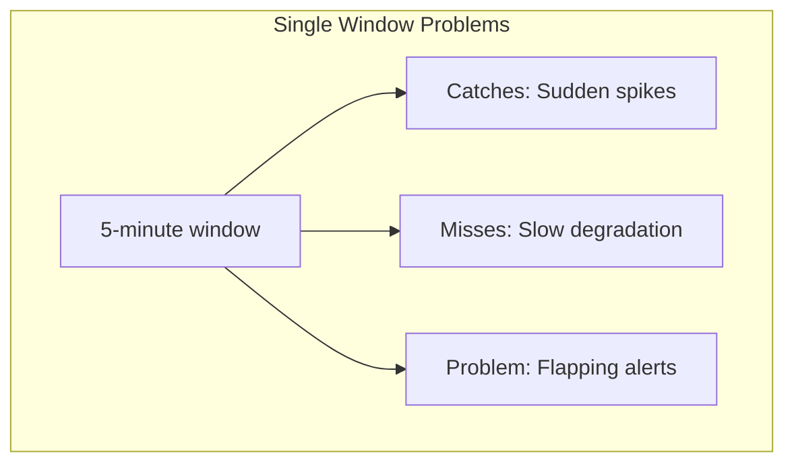
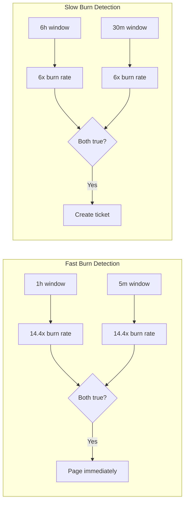
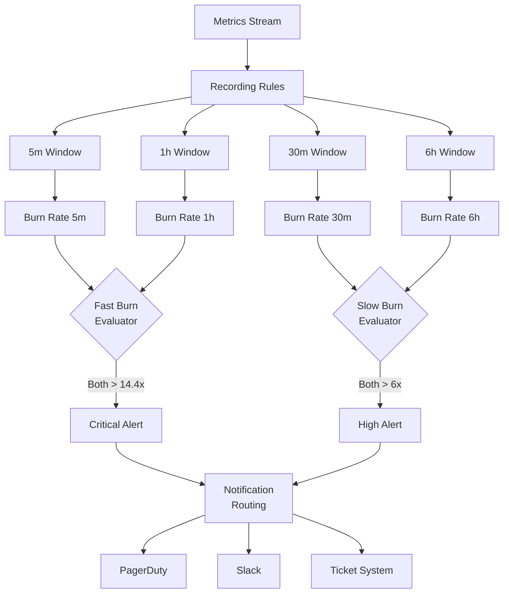

# How to Implement Multi-Window Alerts

Author: [nawazdhandala](https://github.com/nawazdhandala)

Tags: SRE, Alerting, Monitoring, DevOps

Description: Learn how to implement multi-window alerting strategies that reduce noise while catching both sudden spikes and slow degradation in your systems.

---

Traditional threshold-based alerts often fail in two ways: they either miss gradual degradations that creep below the threshold or fire constantly during brief traffic spikes. Multi-window alerting solves this by evaluating metrics across different time windows simultaneously, catching both fast and slow burns without flooding your on-call engineers with noise.

This guide covers the theory behind multi-window alerts, practical implementation patterns, and real-world configurations you can adapt for your monitoring stack.

## Why Single-Window Alerts Fall Short

Consider a service with a 99.9% availability SLO. A single-window alert checking the last 5 minutes might:

- Miss a slow degradation that drops availability to 99.85% over 6 hours
- Fire repeatedly during a 30-second traffic spike that briefly hits error thresholds
- Create alert fatigue that desensitizes your on-call team



Multi-window alerting addresses these issues by combining short and long evaluation windows with different thresholds.

## The Multi-Window Multi-Burn-Rate Approach

Google's SRE practices popularized the multi-window, multi-burn-rate alert strategy. The core idea is to alert when your error budget is being consumed faster than expected, using different windows to catch different failure modes.



The key insight is that combining a long window with a short window eliminates both false positives from brief spikes and false negatives from gradual degradation.

## Calculating Burn Rates

Burn rate represents how fast you are consuming your error budget relative to your SLO period. If your SLO allows for 0.1% errors over 30 days, a burn rate of 1 means you will exactly exhaust your budget by month end.

The formula for burn rate is:

```
burn_rate = (1 - current_success_rate) / (1 - slo_target)
```

For a 99.9% SLO with current success rate of 99.5%:

```
burn_rate = (1 - 0.995) / (1 - 0.999)
burn_rate = 0.005 / 0.001
burn_rate = 5
```

A burn rate of 5 means you are consuming error budget 5 times faster than sustainable.

## Standard Multi-Window Configuration

Here is a battle-tested configuration that balances alert sensitivity with noise reduction:

| Severity | Long Window | Short Window | Burn Rate | Time to Exhaust Budget |
|----------|-------------|--------------|-----------|------------------------|
| Page (critical) | 1 hour | 5 minutes | 14.4x | 5 days |
| Page (high) | 6 hours | 30 minutes | 6x | 12.5 days |
| Ticket | 3 days | 6 hours | 1x | 30 days |

The short window acts as a confirmation that the issue is ongoing, not a momentary blip.

## Implementing in Prometheus

Prometheus recording rules make multi-window alerts efficient by pre-computing error rates across different windows.

First, define recording rules that calculate error rates for each window size:

```yaml
# prometheus/rules/slo-recording.yaml
# Pre-compute error rates across multiple time windows for efficient alerting

groups:
  - name: slo-error-rates
    interval: 30s
    rules:
      # 5-minute error rate window (for fast burn detection)
      - record: slo:error_rate:5m
        expr: |
          sum(rate(http_requests_total{status=~"5.."}[5m])) by (service)
          /
          sum(rate(http_requests_total[5m])) by (service)

      # 30-minute error rate window (for medium burn detection)
      - record: slo:error_rate:30m
        expr: |
          sum(rate(http_requests_total{status=~"5.."}[30m])) by (service)
          /
          sum(rate(http_requests_total[30m])) by (service)

      # 1-hour error rate window (for fast burn long-window confirmation)
      - record: slo:error_rate:1h
        expr: |
          sum(rate(http_requests_total{status=~"5.."}[1h])) by (service)
          /
          sum(rate(http_requests_total[1h])) by (service)

      # 6-hour error rate window (for slow burn detection)
      - record: slo:error_rate:6h
        expr: |
          sum(rate(http_requests_total{status=~"5.."}[6h])) by (service)
          /
          sum(rate(http_requests_total[6h])) by (service)

      # Burn rate calculations based on 99.9% SLO target
      # Formula: error_rate / (1 - slo_target) = error_rate / 0.001
      - record: slo:burn_rate:5m
        expr: slo:error_rate:5m / 0.001

      - record: slo:burn_rate:30m
        expr: slo:error_rate:30m / 0.001

      - record: slo:burn_rate:1h
        expr: slo:error_rate:1h / 0.001

      - record: slo:burn_rate:6h
        expr: slo:error_rate:6h / 0.001
```

Now define the alert rules that combine windows:

```yaml
# prometheus/rules/slo-alerts.yaml
# Multi-window multi-burn-rate alerts for SLO monitoring

groups:
  - name: slo-alerts
    rules:
      # Critical: Fast burn detected - page immediately
      # Triggers when both 1h and 5m windows show 14.4x burn rate
      # At this rate, monthly error budget exhausts in ~5 days
      - alert: SLOFastBurnHigh
        expr: |
          slo:burn_rate:1h > 14.4
          and
          slo:burn_rate:5m > 14.4
        for: 2m
        labels:
          severity: critical
        annotations:
          summary: "High error burn rate detected for {{ $labels.service }}"
          description: |
            Service {{ $labels.service }} is burning error budget at {{ printf "%.1f" $value }}x the sustainable rate.
            At this rate, the monthly error budget will be exhausted in approximately 5 days.
            1h burn rate: {{ with printf "slo:burn_rate:1h{service='%s'}" .Labels.service | query }}{{ . | first | value | printf "%.1f" }}{{ end }}x
            5m burn rate: {{ with printf "slo:burn_rate:5m{service='%s'}" .Labels.service | query }}{{ . | first | value | printf "%.1f" }}{{ end }}x
          runbook_url: "https://wiki.example.com/runbooks/slo-fast-burn"

      # High: Moderate burn detected - page during business hours
      # Triggers when both 6h and 30m windows show 6x burn rate
      # At this rate, monthly error budget exhausts in ~12.5 days
      - alert: SLOSlowBurnHigh
        expr: |
          slo:burn_rate:6h > 6
          and
          slo:burn_rate:30m > 6
        for: 5m
        labels:
          severity: high
        annotations:
          summary: "Elevated error burn rate for {{ $labels.service }}"
          description: |
            Service {{ $labels.service }} is burning error budget at {{ printf "%.1f" $value }}x the sustainable rate.
            This indicates a persistent but not critical degradation.
            6h burn rate: {{ with printf "slo:burn_rate:6h{service='%s'}" .Labels.service | query }}{{ . | first | value | printf "%.1f" }}{{ end }}x
            30m burn rate: {{ with printf "slo:burn_rate:30m{service='%s'}" .Labels.service | query }}{{ . | first | value | printf "%.1f" }}{{ end }}x
          runbook_url: "https://wiki.example.com/runbooks/slo-slow-burn"

      # Warning: Low burn detected - create ticket for investigation
      # Triggers when 6h window shows 3x burn rate
      # Indicates gradual degradation that needs attention but not urgently
      - alert: SLOBurnWarning
        expr: |
          slo:burn_rate:6h > 3
          and
          slo:burn_rate:1h > 3
        for: 15m
        labels:
          severity: warning
        annotations:
          summary: "Elevated error rate trending for {{ $labels.service }}"
          description: |
            Service {{ $labels.service }} showing sustained elevated error rates.
            Current 6h burn rate: {{ printf "%.1f" $value }}x
            Consider investigating before this becomes critical.
          runbook_url: "https://wiki.example.com/runbooks/slo-warning"
```

## Implementing in OpenTelemetry with OneUptime

For teams using OpenTelemetry, you can configure similar multi-window alerts using the OpenTelemetry Collector and OneUptime.

First, set up the collector to compute aggregated metrics:

```yaml
# otel-collector-config.yaml
# OpenTelemetry Collector configuration for multi-window metric aggregation

receivers:
  otlp:
    protocols:
      grpc:
        endpoint: 0.0.0.0:4317
      http:
        endpoint: 0.0.0.0:4318

processors:
  batch:
    send_batch_size: 512
    timeout: 5s

  # Compute derived metrics for different time windows
  # This enables multi-window alerting downstream
  metricstransform:
    transforms:
      # Add service-level labels for aggregation
      - include: http.server.request.duration
        action: update
        operations:
          - action: add_label
            new_label: slo_service
            new_value: "{{service.name}}"

connectors:
  # Span metrics connector to derive request metrics from traces
  spanmetrics:
    histogram:
      explicit:
        buckets: [5ms, 10ms, 25ms, 50ms, 100ms, 250ms, 500ms, 1s, 2.5s, 5s, 10s]
    dimensions:
      - name: http.status_code
      - name: service.name

exporters:
  otlphttp:
    endpoint: "https://oneuptime.com/otlp"
    headers:
      "x-oneuptime-token": "${ONEUPTIME_TOKEN}"

service:
  pipelines:
    traces:
      receivers: [otlp]
      processors: [batch]
      exporters: [otlphttp]
    metrics:
      receivers: [otlp, spanmetrics]
      processors: [batch, metricstransform]
      exporters: [otlphttp]
```

## Building a Multi-Window Alert Evaluator

For custom implementations, here is a complete alert evaluator in TypeScript that you can adapt:

```typescript
// src/alerting/multi-window-evaluator.ts
// Multi-window alert evaluator with configurable burn rate thresholds

interface WindowConfig {
  name: string;
  durationSeconds: number;
  burnRateThreshold: number;
}

interface AlertConfig {
  name: string;
  severity: 'critical' | 'high' | 'warning';
  longWindow: WindowConfig;
  shortWindow: WindowConfig;
  sloTarget: number;  // e.g., 0.999 for 99.9%
}

interface MetricDataPoint {
  timestamp: number;
  successCount: number;
  totalCount: number;
}

// Standard multi-window configurations based on Google SRE recommendations
const STANDARD_ALERT_CONFIGS: AlertConfig[] = [
  {
    name: 'fast-burn-critical',
    severity: 'critical',
    longWindow: { name: '1h', durationSeconds: 3600, burnRateThreshold: 14.4 },
    shortWindow: { name: '5m', durationSeconds: 300, burnRateThreshold: 14.4 },
    sloTarget: 0.999
  },
  {
    name: 'slow-burn-high',
    severity: 'high',
    longWindow: { name: '6h', durationSeconds: 21600, burnRateThreshold: 6 },
    shortWindow: { name: '30m', durationSeconds: 1800, burnRateThreshold: 6 },
    sloTarget: 0.999
  },
  {
    name: 'gradual-warning',
    severity: 'warning',
    longWindow: { name: '24h', durationSeconds: 86400, burnRateThreshold: 3 },
    shortWindow: { name: '6h', durationSeconds: 21600, burnRateThreshold: 3 },
    sloTarget: 0.999
  }
];

class MultiWindowAlertEvaluator {
  private dataPoints: MetricDataPoint[] = [];
  private readonly maxRetentionSeconds: number;

  constructor(maxRetentionSeconds: number = 86400) {
    this.maxRetentionSeconds = maxRetentionSeconds;
  }

  // Add new metric data point and clean up old data
  addDataPoint(point: MetricDataPoint): void {
    this.dataPoints.push(point);
    this.pruneOldData();
  }

  // Remove data points older than retention period
  private pruneOldData(): void {
    const cutoff = Date.now() - (this.maxRetentionSeconds * 1000);
    this.dataPoints = this.dataPoints.filter(p => p.timestamp >= cutoff);
  }

  // Calculate error rate for a specific time window ending at current time
  calculateErrorRate(windowSeconds: number): number | null {
    const now = Date.now();
    const windowStart = now - (windowSeconds * 1000);

    const windowData = this.dataPoints.filter(p => p.timestamp >= windowStart);

    if (windowData.length === 0) {
      return null;  // Not enough data
    }

    const totalSuccess = windowData.reduce((sum, p) => sum + p.successCount, 0);
    const totalRequests = windowData.reduce((sum, p) => sum + p.totalCount, 0);

    if (totalRequests === 0) {
      return null;  // No traffic in window
    }

    return 1 - (totalSuccess / totalRequests);
  }

  // Calculate burn rate relative to SLO target
  calculateBurnRate(windowSeconds: number, sloTarget: number): number | null {
    const errorRate = this.calculateErrorRate(windowSeconds);

    if (errorRate === null) {
      return null;
    }

    const errorBudget = 1 - sloTarget;
    return errorRate / errorBudget;
  }

  // Evaluate all alert conditions and return firing alerts
  evaluate(configs: AlertConfig[] = STANDARD_ALERT_CONFIGS): FiringAlert[] {
    const firingAlerts: FiringAlert[] = [];

    for (const config of configs) {
      const longBurnRate = this.calculateBurnRate(
        config.longWindow.durationSeconds,
        config.sloTarget
      );
      const shortBurnRate = this.calculateBurnRate(
        config.shortWindow.durationSeconds,
        config.sloTarget
      );

      // Both windows must exceed their thresholds for the alert to fire
      // This prevents false positives from brief spikes
      if (
        longBurnRate !== null &&
        shortBurnRate !== null &&
        longBurnRate > config.longWindow.burnRateThreshold &&
        shortBurnRate > config.shortWindow.burnRateThreshold
      ) {
        firingAlerts.push({
          name: config.name,
          severity: config.severity,
          longWindowBurnRate: longBurnRate,
          shortWindowBurnRate: shortBurnRate,
          message: this.formatAlertMessage(config, longBurnRate, shortBurnRate)
        });
      }
    }

    return firingAlerts;
  }

  // Generate human-readable alert message with context
  private formatAlertMessage(
    config: AlertConfig,
    longBurnRate: number,
    shortBurnRate: number
  ): string {
    const timeToExhaust = this.calculateTimeToExhaust(longBurnRate);

    return `SLO burn rate alert: ${config.name}
    Severity: ${config.severity}
    Long window (${config.longWindow.name}): ${longBurnRate.toFixed(1)}x burn rate
    Short window (${config.shortWindow.name}): ${shortBurnRate.toFixed(1)}x burn rate
    At current rate, error budget exhausts in: ${timeToExhaust}`;
  }

  // Calculate how long until error budget is fully consumed
  private calculateTimeToExhaust(burnRate: number): string {
    if (burnRate <= 0) return 'never';

    const hoursToExhaust = (30 * 24) / burnRate;  // Assuming 30-day budget

    if (hoursToExhaust < 24) {
      return `${hoursToExhaust.toFixed(1)} hours`;
    } else {
      return `${(hoursToExhaust / 24).toFixed(1)} days`;
    }
  }
}

interface FiringAlert {
  name: string;
  severity: 'critical' | 'high' | 'warning';
  longWindowBurnRate: number;
  shortWindowBurnRate: number;
  message: string;
}

export { MultiWindowAlertEvaluator, STANDARD_ALERT_CONFIGS };
export type { AlertConfig, WindowConfig, FiringAlert, MetricDataPoint };
```

## Testing Multi-Window Alerts

Test your alert configurations with synthetic scenarios to verify they behave correctly:

```typescript
// src/alerting/multi-window-evaluator.test.ts
// Tests for multi-window alert evaluator covering common failure scenarios

import {
  MultiWindowAlertEvaluator,
  STANDARD_ALERT_CONFIGS,
  MetricDataPoint
} from './multi-window-evaluator';

describe('MultiWindowAlertEvaluator', () => {
  let evaluator: MultiWindowAlertEvaluator;

  beforeEach(() => {
    evaluator = new MultiWindowAlertEvaluator();
  });

  // Helper to generate data points at regular intervals
  function generateDataPoints(
    durationSeconds: number,
    intervalSeconds: number,
    errorRate: number
  ): MetricDataPoint[] {
    const points: MetricDataPoint[] = [];
    const now = Date.now();
    const requestsPerInterval = 100;

    for (let i = durationSeconds; i > 0; i -= intervalSeconds) {
      const successCount = Math.round(requestsPerInterval * (1 - errorRate));
      points.push({
        timestamp: now - (i * 1000),
        successCount,
        totalCount: requestsPerInterval
      });
    }

    return points;
  }

  test('should not fire on brief spike that recovers quickly', () => {
    // Normal traffic for 1 hour
    const normalData = generateDataPoints(3600, 60, 0.0005);  // 0.05% error rate
    normalData.forEach(p => evaluator.addDataPoint(p));

    // 5-minute spike
    const spikeData = generateDataPoints(300, 60, 0.05);  // 5% error rate
    spikeData.forEach(p => evaluator.addDataPoint(p));

    const alerts = evaluator.evaluate();

    // Short window exceeds threshold but long window does not
    // This should NOT fire because we require both windows
    expect(alerts.filter(a => a.severity === 'critical')).toHaveLength(0);
  });

  test('should fire critical alert on sustained high error rate', () => {
    // Sustained 2% error rate for over an hour
    const sustainedErrors = generateDataPoints(4000, 60, 0.02);
    sustainedErrors.forEach(p => evaluator.addDataPoint(p));

    const alerts = evaluator.evaluate();

    // With 99.9% SLO, 2% error rate = 20x burn rate
    // This exceeds both window thresholds
    const criticalAlerts = alerts.filter(a => a.severity === 'critical');
    expect(criticalAlerts).toHaveLength(1);
    expect(criticalAlerts[0].longWindowBurnRate).toBeGreaterThan(14.4);
  });

  test('should fire warning on gradual degradation', () => {
    // Generate 24 hours of slightly elevated errors
    const degradedData = generateDataPoints(86400, 300, 0.003);  // 0.3% error rate
    degradedData.forEach(p => evaluator.addDataPoint(p));

    const alerts = evaluator.evaluate();

    // 0.3% error rate with 99.9% SLO = 3x burn rate
    // Should trigger warning but not critical
    const warningAlerts = alerts.filter(a => a.severity === 'warning');
    expect(warningAlerts).toHaveLength(1);

    const criticalAlerts = alerts.filter(a => a.severity === 'critical');
    expect(criticalAlerts).toHaveLength(0);
  });

  test('should not fire when within SLO', () => {
    // Normal operation within SLO
    const normalData = generateDataPoints(86400, 300, 0.0005);  // 0.05% error rate
    normalData.forEach(p => evaluator.addDataPoint(p));

    const alerts = evaluator.evaluate();

    expect(alerts).toHaveLength(0);
  });

  test('should calculate correct burn rate', () => {
    const errorRate = 0.005;  // 0.5% errors
    const sloTarget = 0.999;  // 99.9% SLO
    const expectedBurnRate = 5;  // 0.005 / 0.001 = 5

    const data = generateDataPoints(3600, 60, errorRate);
    data.forEach(p => evaluator.addDataPoint(p));

    const burnRate = evaluator.calculateBurnRate(3600, sloTarget);

    expect(burnRate).toBeCloseTo(expectedBurnRate, 1);
  });
});
```

## Real-World Configuration Examples

Different services need different alert configurations. Here are practical examples for common scenarios:

### API Gateway (User-Facing, High Traffic)

User-facing services need faster detection with lower thresholds:

```yaml
# High-traffic API needs quick detection
api_gateway_alerts:
  slo_target: 99.95%  # Stricter SLO
  configs:
    - name: api-critical
      severity: critical
      long_window: 30m
      short_window: 2m
      burn_rate: 14.4
    - name: api-high
      severity: high
      long_window: 2h
      short_window: 15m
      burn_rate: 6
```

### Background Job Processor

Batch systems can tolerate longer windows since latency matters less:

```yaml
# Background jobs can use longer windows
batch_processor_alerts:
  slo_target: 99.5%  # Lower SLO acceptable for batch
  configs:
    - name: batch-critical
      severity: critical
      long_window: 6h
      short_window: 1h
      burn_rate: 10
    - name: batch-warning
      severity: warning
      long_window: 24h
      short_window: 6h
      burn_rate: 3
```

### Payment Service (High Reliability Required)

Critical financial services need aggressive alerting:

```yaml
# Payment processing needs aggressive detection
payment_service_alerts:
  slo_target: 99.99%  # Very strict SLO
  configs:
    - name: payment-critical
      severity: critical
      long_window: 15m
      short_window: 1m
      burn_rate: 14.4
    - name: payment-high
      severity: high
      long_window: 1h
      short_window: 5m
      burn_rate: 6
```

## Visualization: Multi-Window Alert Flow

Understanding how alerts flow through evaluation helps in debugging:



## Common Pitfalls and Solutions

### Pitfall 1: Not accounting for low traffic periods

During low traffic, small absolute error counts create high percentages.

```yaml
# Add minimum traffic requirement to avoid false positives
- alert: SLOFastBurn
  expr: |
    slo:burn_rate:1h > 14.4
    and slo:burn_rate:5m > 14.4
    and sum(rate(http_requests_total[5m])) by (service) > 10  # Min 10 req/s
```

### Pitfall 2: Alert on every metric dimension

Alerting on every endpoint or status code creates noise.

```yaml
# Aggregate at service level, not endpoint level
- record: slo:error_rate:5m
  expr: |
    sum(rate(http_requests_total{status=~"5.."}[5m])) by (service)
    /
    sum(rate(http_requests_total[5m])) by (service)
```

### Pitfall 3: No correlation between windows

Ensure alerts require BOTH windows to exceed thresholds, not just one.

```yaml
# Correct: AND condition between windows
expr: |
  slo:burn_rate:1h > 14.4
  and
  slo:burn_rate:5m > 14.4

# Wrong: OR condition creates noise
expr: |
  slo:burn_rate:1h > 14.4
  or
  slo:burn_rate:5m > 14.4
```

## Summary

Multi-window alerting transforms your monitoring from reactive noise generation to proactive reliability management. The key principles are:

1. **Combine long and short windows** to catch both sudden spikes and gradual degradation
2. **Use burn rates** instead of raw error rates to tie alerts directly to SLO impact
3. **Require both windows to exceed thresholds** to eliminate false positives
4. **Tune configurations per service** based on traffic patterns and reliability requirements
5. **Test with synthetic scenarios** before deploying to production

Start with the standard Google SRE configurations and adjust based on your alert volume and incident patterns. The goal is to wake up your on-call team only when there is genuine user impact that requires human intervention.

Multi-window alerts work best when combined with comprehensive observability. Use OneUptime to correlate your SLO burn alerts with traces and logs, enabling faster root cause analysis when alerts fire.
