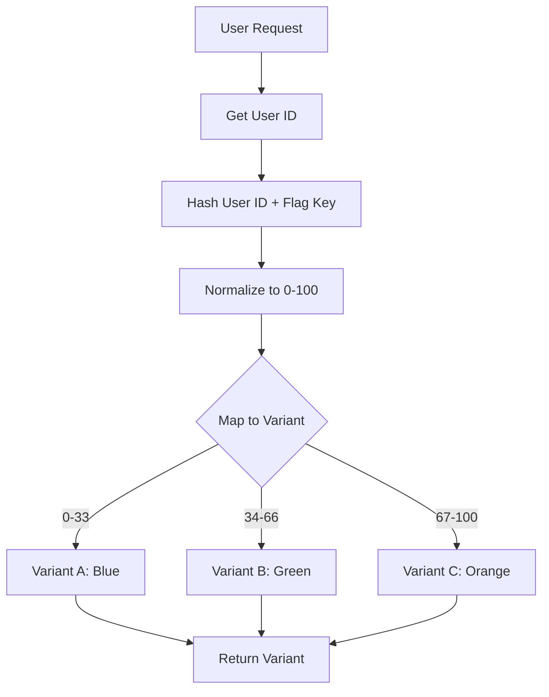
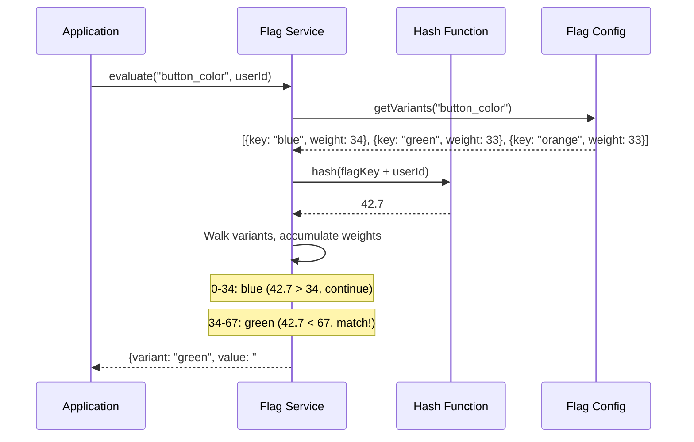
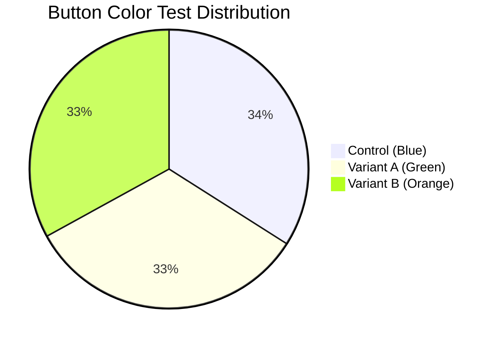
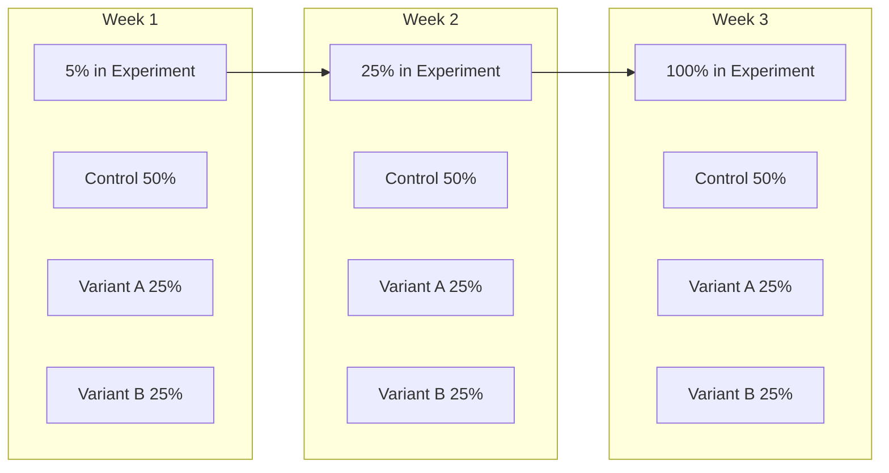

# How to Build Multivariate Flags

Author: [nawazdhandala](https://github.com/nawazdhandala)

Tags: Feature Flags, Multivariate, A/B Testing, Experimentation

Description: Learn how to implement multivariate feature flags that return multiple variations for A/B/n testing and controlled experimentation.

---

## What Are Multivariate Flags?

Boolean feature flags give you two options: on or off. Multivariate flags go further by returning one of several possible values. Instead of asking "should I show the new feature?" you can ask "which version of the feature should I show?"

This capability unlocks real experimentation. You can test three different checkout flows, five button colors, or ten pricing page layouts, all controlled by a single flag with percentage-based allocation across variants.

## When to Use Multivariate Flags

| Scenario | Example |
|----------|---------|
| A/B/n Testing | Compare three checkout button colors |
| Content Experiments | Test multiple headline variations |
| Algorithm Selection | Route users to different recommendation engines |
| UI Layout Testing | Compare card vs list vs grid layouts |
| Pricing Experiments | Test different price points or tiers |

## Architecture Overview

The core idea is simple: hash the user ID to get a deterministic number, then map that number to one of your variants based on weight distribution.



## Variant Selection Flow

Here is how the variant selection process works in detail:



## Core Implementation

### Variant Type Definition

Start by defining your variant structure. Each variant needs a key for tracking, a value to return, and a weight for distribution.

```typescript
interface Variant {
  key: string;           // Unique identifier for analytics
  value: unknown;        // The actual value to return
  weight: number;        // Percentage allocation (0-100)
}

interface MultivariateFlag {
  key: string;
  enabled: boolean;
  defaultValue: unknown;
  variants: Variant[];
  salt?: string;         // Optional salt for hash uniqueness
}
```

### Hash Function

The hash function must be deterministic. The same user should always get the same variant. Using MD5 or SHA256 with modulo arithmetic works well.

```typescript
import { createHash } from 'crypto';

function hashToPercentage(input: string): number {
  const hash = createHash('md5').update(input).digest('hex');
  // Take first 8 hex characters (32 bits)
  const hashInt = parseInt(hash.substring(0, 8), 16);
  // Normalize to 0-100 with two decimal precision
  return (hashInt % 10000) / 100;
}
```

### Variant Selection

Walk through variants in order, accumulating weights until the user's hash falls within range.

```typescript
function selectVariant(
  flag: MultivariateFlag,
  userId: string
): { key: string; value: unknown } | null {
  if (!flag.enabled || flag.variants.length === 0) {
    return null;
  }

  // Create deterministic hash input
  const salt = flag.salt || flag.key;
  const hashInput = `${salt}:${userId}`;
  const userHash = hashToPercentage(hashInput);

  // Walk through variants and find where user lands
  let cumulativeWeight = 0;

  for (const variant of flag.variants) {
    cumulativeWeight += variant.weight;

    if (userHash < cumulativeWeight) {
      return {
        key: variant.key,
        value: variant.value
      };
    }
  }

  // Fallback to last variant if rounding causes issues
  const lastVariant = flag.variants[flag.variants.length - 1];
  return {
    key: lastVariant.key,
    value: lastVariant.value
  };
}
```

### Complete Flag Evaluator

Here is a complete implementation that handles validation and provides a clean API:

```typescript
import { createHash } from 'crypto';

interface Variant {
  key: string;
  value: unknown;
  weight: number;
}

interface MultivariateFlag {
  key: string;
  enabled: boolean;
  defaultValue: unknown;
  variants: Variant[];
  salt?: string;
}

interface EvaluationResult {
  value: unknown;
  variantKey: string | null;
  reason: string;
}

class MultivariateFlagEvaluator {
  private flags: Map<string, MultivariateFlag> = new Map();

  register(flag: MultivariateFlag): void {
    // Validate weights sum to 100
    const totalWeight = flag.variants.reduce((sum, v) => sum + v.weight, 0);

    if (Math.abs(totalWeight - 100) > 0.01) {
      console.warn(
        `Flag "${flag.key}": weights sum to ${totalWeight}, expected 100`
      );
    }

    this.flags.set(flag.key, flag);
  }

  evaluate(flagKey: string, userId: string): EvaluationResult {
    const flag = this.flags.get(flagKey);

    // Flag not found
    if (!flag) {
      return {
        value: null,
        variantKey: null,
        reason: 'FLAG_NOT_FOUND'
      };
    }

    // Flag disabled
    if (!flag.enabled) {
      return {
        value: flag.defaultValue,
        variantKey: null,
        reason: 'FLAG_DISABLED'
      };
    }

    // No variants configured
    if (flag.variants.length === 0) {
      return {
        value: flag.defaultValue,
        variantKey: null,
        reason: 'NO_VARIANTS'
      };
    }

    // Missing user ID
    if (!userId) {
      return {
        value: flag.defaultValue,
        variantKey: null,
        reason: 'NO_USER_ID'
      };
    }

    // Calculate hash and select variant
    const salt = flag.salt || flag.key;
    const hashInput = `${salt}:${userId}`;
    const userHash = this.hashToPercentage(hashInput);

    let cumulativeWeight = 0;

    for (const variant of flag.variants) {
      cumulativeWeight += variant.weight;

      if (userHash < cumulativeWeight) {
        return {
          value: variant.value,
          variantKey: variant.key,
          reason: 'VARIANT_SELECTED'
        };
      }
    }

    // Fallback
    const lastVariant = flag.variants[flag.variants.length - 1];
    return {
      value: lastVariant.value,
      variantKey: lastVariant.key,
      reason: 'VARIANT_SELECTED'
    };
  }

  private hashToPercentage(input: string): number {
    const hash = createHash('md5').update(input).digest('hex');
    const hashInt = parseInt(hash.substring(0, 8), 16);
    return (hashInt % 10000) / 100;
  }
}
```

## Percentage Allocation Strategies

### Equal Distribution

Split traffic evenly across all variants:

```typescript
const buttonColorTest: MultivariateFlag = {
  key: 'button_color_test',
  enabled: true,
  defaultValue: 'blue',
  variants: [
    { key: 'control', value: 'blue', weight: 33.34 },
    { key: 'green', value: 'green', weight: 33.33 },
    { key: 'orange', value: 'orange', weight: 33.33 }
  ]
};
```

### Control-Heavy Distribution

Keep most users on the existing experience while testing alternatives:

```typescript
const pricingPageTest: MultivariateFlag = {
  key: 'pricing_page_layout',
  enabled: true,
  defaultValue: 'current',
  variants: [
    { key: 'control', value: 'current', weight: 80 },
    { key: 'simplified', value: 'simple', weight: 10 },
    { key: 'detailed', value: 'detailed', weight: 10 }
  ]
};
```

### Allocation Visualization



## Python Implementation

Here is the same logic in Python for backend services:

```python
import hashlib
from dataclasses import dataclass
from typing import Any, Optional

@dataclass
class Variant:
    key: str
    value: Any
    weight: float

@dataclass
class MultivariateFlag:
    key: str
    enabled: bool
    default_value: Any
    variants: list[Variant]
    salt: Optional[str] = None

@dataclass
class EvaluationResult:
    value: Any
    variant_key: Optional[str]
    reason: str

class MultivariateFlagEvaluator:
    def __init__(self):
        self.flags: dict[str, MultivariateFlag] = {}

    def register(self, flag: MultivariateFlag) -> None:
        total_weight = sum(v.weight for v in flag.variants)

        if abs(total_weight - 100) > 0.01:
            print(f"Warning: Flag '{flag.key}' weights sum to {total_weight}")

        self.flags[flag.key] = flag

    def evaluate(self, flag_key: str, user_id: str) -> EvaluationResult:
        flag = self.flags.get(flag_key)

        if not flag:
            return EvaluationResult(
                value=None,
                variant_key=None,
                reason="FLAG_NOT_FOUND"
            )

        if not flag.enabled:
            return EvaluationResult(
                value=flag.default_value,
                variant_key=None,
                reason="FLAG_DISABLED"
            )

        if not flag.variants:
            return EvaluationResult(
                value=flag.default_value,
                variant_key=None,
                reason="NO_VARIANTS"
            )

        if not user_id:
            return EvaluationResult(
                value=flag.default_value,
                variant_key=None,
                reason="NO_USER_ID"
            )

        salt = flag.salt or flag.key
        hash_input = f"{salt}:{user_id}"
        user_hash = self._hash_to_percentage(hash_input)

        cumulative_weight = 0.0

        for variant in flag.variants:
            cumulative_weight += variant.weight

            if user_hash < cumulative_weight:
                return EvaluationResult(
                    value=variant.value,
                    variant_key=variant.key,
                    reason="VARIANT_SELECTED"
                )

        last_variant = flag.variants[-1]
        return EvaluationResult(
            value=last_variant.value,
            variant_key=last_variant.key,
            reason="VARIANT_SELECTED"
        )

    def _hash_to_percentage(self, input_str: str) -> float:
        hash_bytes = hashlib.md5(input_str.encode()).hexdigest()
        hash_int = int(hash_bytes[:8], 16)
        return (hash_int % 10000) / 100


# Usage example
evaluator = MultivariateFlagEvaluator()

checkout_flow_test = MultivariateFlag(
    key="checkout_flow",
    enabled=True,
    default_value="standard",
    variants=[
        Variant(key="control", value="standard", weight=50),
        Variant(key="express", value="express", weight=25),
        Variant(key="guided", value="guided", weight=25)
    ]
)

evaluator.register(checkout_flow_test)

result = evaluator.evaluate("checkout_flow", "user_12345")
print(f"Variant: {result.variant_key}, Value: {result.value}")
```

## Go Implementation

For Go services:

```go
package flags

import (
    "crypto/md5"
    "encoding/hex"
    "fmt"
    "strconv"
)

type Variant struct {
    Key    string
    Value  interface{}
    Weight float64
}

type MultivariateFlag struct {
    Key          string
    Enabled      bool
    DefaultValue interface{}
    Variants     []Variant
    Salt         string
}

type EvaluationResult struct {
    Value      interface{}
    VariantKey string
    Reason     string
}

type Evaluator struct {
    flags map[string]*MultivariateFlag
}

func NewEvaluator() *Evaluator {
    return &Evaluator{
        flags: make(map[string]*MultivariateFlag),
    }
}

func (e *Evaluator) Register(flag *MultivariateFlag) {
    e.flags[flag.Key] = flag
}

func (e *Evaluator) Evaluate(flagKey, userID string) EvaluationResult {
    flag, exists := e.flags[flagKey]

    if !exists {
        return EvaluationResult{
            Value:      nil,
            VariantKey: "",
            Reason:     "FLAG_NOT_FOUND",
        }
    }

    if !flag.Enabled {
        return EvaluationResult{
            Value:      flag.DefaultValue,
            VariantKey: "",
            Reason:     "FLAG_DISABLED",
        }
    }

    if len(flag.Variants) == 0 {
        return EvaluationResult{
            Value:      flag.DefaultValue,
            VariantKey: "",
            Reason:     "NO_VARIANTS",
        }
    }

    if userID == "" {
        return EvaluationResult{
            Value:      flag.DefaultValue,
            VariantKey: "",
            Reason:     "NO_USER_ID",
        }
    }

    salt := flag.Salt
    if salt == "" {
        salt = flag.Key
    }

    hashInput := fmt.Sprintf("%s:%s", salt, userID)
    userHash := hashToPercentage(hashInput)

    var cumulativeWeight float64

    for _, variant := range flag.Variants {
        cumulativeWeight += variant.Weight

        if userHash < cumulativeWeight {
            return EvaluationResult{
                Value:      variant.Value,
                VariantKey: variant.Key,
                Reason:     "VARIANT_SELECTED",
            }
        }
    }

    lastVariant := flag.Variants[len(flag.Variants)-1]
    return EvaluationResult{
        Value:      lastVariant.Value,
        VariantKey: lastVariant.Key,
        Reason:     "VARIANT_SELECTED",
    }
}

func hashToPercentage(input string) float64 {
    hash := md5.Sum([]byte(input))
    hexStr := hex.EncodeToString(hash[:4])
    hashInt, _ := strconv.ParseUint(hexStr, 16, 32)
    return float64(hashInt%10000) / 100
}
```

## Tracking Variant Assignments

For proper analysis, you need to track which variant each user sees. Send this data to your analytics pipeline.

```typescript
interface VariantAssignment {
  flagKey: string;
  variantKey: string;
  userId: string;
  timestamp: Date;
  sessionId?: string;
}

function trackVariantAssignment(
  result: EvaluationResult,
  flagKey: string,
  userId: string
): void {
  if (result.variantKey) {
    const assignment: VariantAssignment = {
      flagKey,
      variantKey: result.variantKey,
      userId,
      timestamp: new Date()
    };

    // Send to analytics
    analytics.track('experiment_assignment', assignment);
  }
}

// Usage
const evaluator = new MultivariateFlagEvaluator();
const result = evaluator.evaluate('checkout_flow', userId);

trackVariantAssignment(result, 'checkout_flow', userId);

// Render the appropriate variant
renderCheckout(result.value as string);
```

## Variant Analysis

After running your experiment, analyze the results to determine which variant performs best.

### Conversion Rate by Variant

Track conversion events and calculate rates per variant:

```typescript
interface VariantMetrics {
  variantKey: string;
  impressions: number;
  conversions: number;
  conversionRate: number;
  confidence: number;
}

async function analyzeExperiment(
  flagKey: string,
  conversionEvent: string
): Promise<VariantMetrics[]> {
  // Query your analytics database
  const query = `
    SELECT
      variant_key,
      COUNT(DISTINCT user_id) as impressions,
      COUNT(DISTINCT CASE WHEN converted THEN user_id END) as conversions
    FROM experiment_assignments a
    LEFT JOIN conversions c ON a.user_id = c.user_id
      AND c.event_name = $2
      AND c.timestamp > a.timestamp
    WHERE a.flag_key = $1
    GROUP BY variant_key
  `;

  const results = await db.query(query, [flagKey, conversionEvent]);

  return results.map(row => ({
    variantKey: row.variant_key,
    impressions: row.impressions,
    conversions: row.conversions,
    conversionRate: row.conversions / row.impressions,
    confidence: calculateConfidence(row.impressions, row.conversions)
  }));
}
```

### Statistical Significance

Do not declare a winner until you have statistical significance. Here is a simplified chi-squared test:

```typescript
function calculateConfidence(
  impressions: number,
  conversions: number
): number {
  // Simplified confidence calculation
  // Use a proper statistical library for production
  const p = conversions / impressions;
  const standardError = Math.sqrt((p * (1 - p)) / impressions);
  const zScore = p / standardError;

  // Convert z-score to confidence percentage
  // This is a rough approximation
  if (zScore > 2.58) return 99;
  if (zScore > 1.96) return 95;
  if (zScore > 1.64) return 90;
  return Math.min(zScore * 30, 89);
}
```

### Sample Analysis Output

```
Experiment: checkout_flow
Duration: 14 days
Total Users: 45,231

| Variant  | Users  | Conversions | Rate   | Confidence |
|----------|--------|-------------|--------|------------|
| control  | 22,615 | 1,356       | 6.00%  | baseline   |
| express  | 11,308 | 791         | 7.00%  | 94%        |
| guided   | 11,308 | 848         | 7.50%  | 98%        |

Recommendation: "guided" variant shows +25% lift with 98% confidence
```

## Gradual Variant Rollout

You can combine multivariate flags with percentage rollouts. Start with a small percentage of traffic seeing the experiment, then increase as you gain confidence.



```typescript
interface StagedMultivariateFlag extends MultivariateFlag {
  experimentPercentage: number;  // % of users who see the experiment
}

function evaluateStaged(
  flag: StagedMultivariateFlag,
  userId: string
): EvaluationResult {
  // First, check if user is in the experiment at all
  const experimentHash = hashToPercentage(`${flag.key}:experiment:${userId}`);

  if (experimentHash >= flag.experimentPercentage) {
    // User is not in experiment, return control
    return {
      value: flag.defaultValue,
      variantKey: 'control',
      reason: 'NOT_IN_EXPERIMENT'
    };
  }

  // User is in experiment, select variant normally
  const variantHash = hashToPercentage(`${flag.key}:variant:${userId}`);

  let cumulativeWeight = 0;

  for (const variant of flag.variants) {
    cumulativeWeight += variant.weight;

    if (variantHash < cumulativeWeight) {
      return {
        value: variant.value,
        variantKey: variant.key,
        reason: 'VARIANT_SELECTED'
      };
    }
  }

  const lastVariant = flag.variants[flag.variants.length - 1];
  return {
    value: lastVariant.value,
    variantKey: lastVariant.key,
    reason: 'VARIANT_SELECTED'
  };
}
```

## Common Mistakes to Avoid

| Mistake | Problem | Solution |
|---------|---------|----------|
| Weights not summing to 100 | Some users fall outside all buckets | Validate on flag registration |
| Using random instead of hash | User sees different variants on each request | Always use deterministic hashing |
| Missing salt | Different flags have correlated assignments | Include flag key in hash input |
| Changing variants mid-experiment | Corrupts your data | Lock variants once experiment starts |
| Declaring winner too early | False positives from small samples | Wait for statistical significance |
| Not tracking assignments | Cannot analyze results | Log every variant assignment |

## Testing Multivariate Flags

Write tests to verify your distribution is correct:

```typescript
import { describe, it, expect } from 'vitest';

describe('MultivariateFlagEvaluator', () => {
  it('distributes users according to weights', () => {
    const evaluator = new MultivariateFlagEvaluator();

    evaluator.register({
      key: 'test_flag',
      enabled: true,
      defaultValue: 'default',
      variants: [
        { key: 'a', value: 'a', weight: 50 },
        { key: 'b', value: 'b', weight: 30 },
        { key: 'c', value: 'c', weight: 20 }
      ]
    });

    const counts = { a: 0, b: 0, c: 0 };
    const totalUsers = 10000;

    for (let i = 0; i < totalUsers; i++) {
      const result = evaluator.evaluate('test_flag', `user_${i}`);
      counts[result.variantKey as keyof typeof counts]++;
    }

    // Allow 5% margin of error
    expect(counts.a / totalUsers).toBeCloseTo(0.50, 1);
    expect(counts.b / totalUsers).toBeCloseTo(0.30, 1);
    expect(counts.c / totalUsers).toBeCloseTo(0.20, 1);
  });

  it('returns consistent results for the same user', () => {
    const evaluator = new MultivariateFlagEvaluator();

    evaluator.register({
      key: 'sticky_test',
      enabled: true,
      defaultValue: 'default',
      variants: [
        { key: 'a', value: 'a', weight: 50 },
        { key: 'b', value: 'b', weight: 50 }
      ]
    });

    const userId = 'user_12345';
    const result1 = evaluator.evaluate('sticky_test', userId);
    const result2 = evaluator.evaluate('sticky_test', userId);
    const result3 = evaluator.evaluate('sticky_test', userId);

    expect(result1.variantKey).toBe(result2.variantKey);
    expect(result2.variantKey).toBe(result3.variantKey);
  });

  it('returns default when disabled', () => {
    const evaluator = new MultivariateFlagEvaluator();

    evaluator.register({
      key: 'disabled_flag',
      enabled: false,
      defaultValue: 'default_value',
      variants: [
        { key: 'a', value: 'a', weight: 100 }
      ]
    });

    const result = evaluator.evaluate('disabled_flag', 'user_123');

    expect(result.value).toBe('default_value');
    expect(result.reason).toBe('FLAG_DISABLED');
  });
});
```

## Summary

Multivariate flags give you the power to run real experiments with multiple variations. The key principles are:

1. Use deterministic hashing so users see consistent variants
2. Validate that weights sum to 100%
3. Include the flag key in your hash to keep experiments independent
4. Track every variant assignment for analysis
5. Wait for statistical significance before declaring winners
6. Start with small traffic percentages and scale up gradually

With these techniques, you can move beyond simple on/off toggles and run sophisticated A/B/n tests that drive real product insights.
