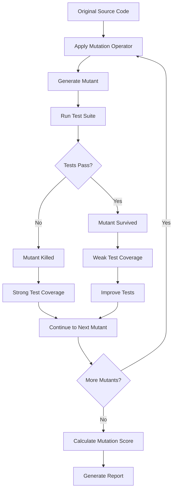
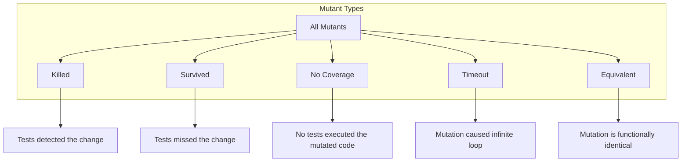
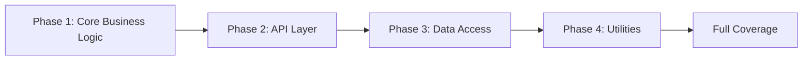

# How to Build Mutation Testing Strategies

Author: [nawazdhandala](https://github.com/nawazdhandala)

Tags: Testing, MutationTesting, Quality, Coverage

Description: A comprehensive guide to implementing mutation testing strategies that measure and improve your test suite effectiveness.

---

## Introduction

Code coverage metrics can be misleading. A test suite with 100% line coverage might still miss critical bugs if the tests themselves are weak. Mutation testing addresses this gap by evaluating how well your tests can detect intentional code changes. This guide explores practical strategies for implementing mutation testing in your projects.

## What is Mutation Testing?

Mutation testing is a technique that introduces small, deliberate changes (mutations) to your source code and checks whether your existing tests can detect these changes. If a test fails after a mutation is applied, the mutant is considered "killed." If all tests pass, the mutant "survives," indicating a potential weakness in your test suite.

### Key Concepts

- **Mutant**: A version of your code with a single intentional change
- **Mutation Operator**: A rule that defines how to create a specific type of mutation
- **Killed Mutant**: A mutation detected by at least one failing test
- **Survived Mutant**: A mutation that no test detected
- **Mutation Score**: The percentage of killed mutants out of all generated mutants

## Mutation Testing Workflow

The following diagram illustrates the mutation testing process:



## Common Mutation Operators

Mutation operators define the types of changes applied to your code. Understanding these operators helps you interpret mutation testing results effectively.

### Arithmetic Operator Replacement

```javascript
// Original code
function calculateTotal(price, quantity) {
    return price * quantity;  // Multiplication
}

// Mutant: Replace * with +
function calculateTotal(price, quantity) {
    return price + quantity;  // Addition (mutated)
}
```

### Conditional Boundary Mutations

```javascript
// Original code
function isAdult(age) {
    return age >= 18;  // Greater than or equal
}

// Mutant: Change >= to >
function isAdult(age) {
    return age > 18;  // Greater than (mutated)
}
```

### Logical Operator Mutations

```javascript
// Original code
function canAccess(isAdmin, isOwner) {
    return isAdmin || isOwner;  // OR operator
}

// Mutant: Replace || with &&
function canAccess(isAdmin, isOwner) {
    return isAdmin && isOwner;  // AND operator (mutated)
}
```

### Return Value Mutations

```javascript
// Original code
function isValid(input) {
    if (input.length > 0) {
        return true;
    }
    return false;
}

// Mutant: Invert return value
function isValid(input) {
    if (input.length > 0) {
        return false;  // Inverted (mutated)
    }
    return true;       // Inverted (mutated)
}
```

## Types of Mutants

Understanding mutant classifications helps prioritize which survivors to address:



### Equivalent Mutants

Equivalent mutants produce the same behavior as the original code, making them impossible to kill:

```javascript
// Original code
function getIndex(arr, item) {
    for (let i = 0; i < arr.length; i++) {
        if (arr[i] === item) return i;
    }
    return -1;
}

// Equivalent mutant: Change i < arr.length to i !== arr.length
// This produces identical behavior for valid arrays
function getIndex(arr, item) {
    for (let i = 0; i !== arr.length; i++) {
        if (arr[i] === item) return i;
    }
    return -1;
}
```

## Tool Configuration: Stryker

Stryker is a popular mutation testing framework for JavaScript and TypeScript projects.

### Installation

```bash
# Install Stryker for a JavaScript/TypeScript project
npm install --save-dev @stryker-mutator/core
npm install --save-dev @stryker-mutator/jest-runner
```

### Configuration File (stryker.config.json)

```json
{
  "$schema": "./node_modules/@stryker-mutator/core/schema/stryker-schema.json",
  "packageManager": "npm",
  "reporters": ["html", "clear-text", "progress"],
  "testRunner": "jest",
  "coverageAnalysis": "perTest",
  "mutate": [
    "src/**/*.js",
    "!src/**/*.test.js",
    "!src/**/*.spec.js"
  ],
  "mutator": {
    "excludedMutations": [
      "StringLiteral"
    ]
  },
  "thresholds": {
    "high": 80,
    "low": 60,
    "break": 50
  },
  "concurrency": 4,
  "timeoutMS": 10000
}
```

### Running Stryker

```bash
# Run mutation testing
npx stryker run

# Run with specific configuration
npx stryker run --configFile stryker.config.json
```

## Tool Configuration: PIT (Pitest)

PIT is the standard mutation testing tool for Java projects.

### Maven Configuration (pom.xml)

```xml
<plugin>
    <groupId>org.pitest</groupId>
    <artifactId>pitest-maven</artifactId>
    <version>1.15.0</version>
    <configuration>
        <!-- Target classes to mutate -->
        <targetClasses>
            <param>com.yourproject.core.*</param>
            <param>com.yourproject.service.*</param>
        </targetClasses>

        <!-- Target tests to run -->
        <targetTests>
            <param>com.yourproject.*Test</param>
        </targetTests>

        <!-- Mutation operators to use -->
        <mutators>
            <mutator>CONDITIONALS_BOUNDARY</mutator>
            <mutator>INCREMENTS</mutator>
            <mutator>INVERT_NEGS</mutator>
            <mutator>MATH</mutator>
            <mutator>NEGATE_CONDITIONALS</mutator>
            <mutator>VOID_METHOD_CALLS</mutator>
            <mutator>RETURN_VALS</mutator>
        </mutators>

        <!-- Thresholds -->
        <mutationThreshold>70</mutationThreshold>
        <coverageThreshold>80</coverageThreshold>

        <!-- Performance settings -->
        <threads>4</threads>
        <timeoutConstant>5000</timeoutConstant>
    </configuration>
</plugin>
```

### Running PIT

```bash
# Run mutation testing with Maven
mvn org.pitest:pitest-maven:mutationCoverage

# Generate HTML report
mvn org.pitest:pitest-maven:mutationCoverage -DoutputFormats=HTML
```

## Interpreting Mutation Scores

The mutation score is calculated as:

```
Mutation Score = (Killed Mutants / Total Mutants) x 100%
```

### Score Guidelines

| Score Range | Interpretation | Action Required |
|-------------|----------------|-----------------|
| 80-100%     | Excellent      | Maintain current practices |
| 60-79%      | Good           | Address high-priority survivors |
| 40-59%      | Moderate       | Significant test improvements needed |
| Below 40%   | Poor           | Major test suite overhaul required |

### Analyzing Survivors

When a mutant survives, investigate using this checklist:

1. **Is it an equivalent mutant?** If the mutation produces identical behavior, ignore it
2. **Is the code path tested?** Check if any test exercises the mutated line
3. **Are assertions specific enough?** Verify tests check the right outputs
4. **Is the mutation in dead code?** Consider removing unused code

## Practical Example: Improving Test Quality

Consider this function and its initial test:

```javascript
// calculator.js
function calculateDiscount(price, discountPercent, memberStatus) {
    // Validate inputs
    if (price <= 0) {
        throw new Error('Price must be positive');
    }

    if (discountPercent < 0 || discountPercent > 100) {
        throw new Error('Discount must be between 0 and 100');
    }

    // Calculate base discount
    let discount = price * (discountPercent / 100);

    // Apply member bonus: 5% extra for premium members
    if (memberStatus === 'premium') {
        discount = discount + (price * 0.05);
    }

    // Cap discount at 50% of original price
    const maxDiscount = price * 0.5;
    if (discount > maxDiscount) {
        discount = maxDiscount;
    }

    return price - discount;
}

module.exports = { calculateDiscount };
```

### Initial Test (Weak)

```javascript
// calculator.test.js - Initial version
const { calculateDiscount } = require('./calculator');

describe('calculateDiscount', () => {
    test('should apply discount correctly', () => {
        // This test has several problems:
        // 1. Only tests one scenario
        // 2. Does not test boundary conditions
        // 3. Does not verify member bonus logic
        const result = calculateDiscount(100, 10, 'standard');
        expect(result).toBe(90);
    });
});
```

### Mutation Testing Results

Running mutation testing on the weak test reveals survivors:

```
Mutant survived: Changed discountPercent > 100 to discountPercent >= 100
Mutant survived: Changed memberStatus === 'premium' to memberStatus !== 'premium'
Mutant survived: Changed discount > maxDiscount to discount >= maxDiscount
Mutant survived: Removed member bonus calculation
```

### Improved Test Suite

```javascript
// calculator.test.js - Improved version
const { calculateDiscount } = require('./calculator');

describe('calculateDiscount', () => {
    // Test basic discount calculation
    test('should apply percentage discount correctly', () => {
        const result = calculateDiscount(100, 10, 'standard');
        expect(result).toBe(90);
    });

    // Test boundary: exactly 100% discount input
    test('should accept exactly 100% discount', () => {
        const result = calculateDiscount(100, 100, 'standard');
        // Capped at 50% max discount
        expect(result).toBe(50);
    });

    // Test boundary: discount just over 100%
    test('should reject discount over 100%', () => {
        expect(() => {
            calculateDiscount(100, 101, 'standard');
        }).toThrow('Discount must be between 0 and 100');
    });

    // Test premium member bonus
    test('should apply 5% extra discount for premium members', () => {
        // 10% discount + 5% premium bonus = 15% total
        const result = calculateDiscount(100, 10, 'premium');
        expect(result).toBe(85);
    });

    // Test non-premium member does not get bonus
    test('should not apply bonus for standard members', () => {
        const standardResult = calculateDiscount(100, 10, 'standard');
        const premiumResult = calculateDiscount(100, 10, 'premium');
        // Premium should get a better deal
        expect(premiumResult).toBeLessThan(standardResult);
    });

    // Test discount cap boundary
    test('should cap discount at exactly 50% of price', () => {
        // 60% discount for premium would be 65% total
        // Should be capped at 50%
        const result = calculateDiscount(100, 60, 'premium');
        expect(result).toBe(50);
    });

    // Test discount just under cap
    test('should not cap discount below 50%', () => {
        // 45% discount for standard member
        const result = calculateDiscount(100, 45, 'standard');
        expect(result).toBe(55);  // Full discount applied, not capped
    });

    // Test input validation
    test('should reject zero price', () => {
        expect(() => {
            calculateDiscount(0, 10, 'standard');
        }).toThrow('Price must be positive');
    });

    test('should reject negative price', () => {
        expect(() => {
            calculateDiscount(-50, 10, 'standard');
        }).toThrow('Price must be positive');
    });

    test('should reject negative discount', () => {
        expect(() => {
            calculateDiscount(100, -5, 'standard');
        }).toThrow('Discount must be between 0 and 100');
    });
});
```

## Mutation Testing Strategies

### Strategy 1: Incremental Adoption

Start with critical business logic and expand coverage gradually:



### Strategy 2: Threshold-Based Quality Gates

Integrate mutation testing into CI/CD with quality thresholds:

```yaml
# .github/workflows/mutation-testing.yml
name: Mutation Testing

on:
  pull_request:
    branches: [main]

jobs:
  mutation-test:
    runs-on: ubuntu-latest
    steps:
      - uses: actions/checkout@v4

      - name: Setup Node.js
        uses: actions/setup-node@v4
        with:
          node-version: '20'

      - name: Install dependencies
        run: npm ci

      - name: Run mutation testing
        run: npx stryker run

      - name: Check mutation score
        run: |
          # Parse mutation score from report
          SCORE=$(cat reports/mutation/mutation.json | jq '.mutationScore')
          if (( $(echo "$SCORE < 70" | bc -l) )); then
            echo "Mutation score $SCORE% is below threshold of 70%"
            exit 1
          fi
```

### Strategy 3: Focused Mutation Testing

Target specific high-risk areas instead of entire codebase:

```javascript
// stryker.config.js - Focused configuration
module.exports = {
    mutate: [
        // Only mutate payment processing code
        'src/payments/**/*.js',
        // And authentication logic
        'src/auth/**/*.js',
        // Exclude test files and mocks
        '!src/**/*.test.js',
        '!src/**/__mocks__/**'
    ],
    // Use faster mutation operators for quick feedback
    mutator: {
        excludedMutations: [
            'StringLiteral',
            'ArrayDeclaration',
            'ObjectLiteral'
        ]
    }
};
```

### Strategy 4: Mutation Testing for Code Reviews

Use mutation testing to validate test coverage in pull requests:

1. Generate baseline mutation score on main branch
2. Run mutation testing on changed files in PR
3. Compare scores and flag regressions
4. Require new tests to kill introduced mutants

## Best Practices

### Do

- Start with a small, critical portion of your codebase
- Set realistic initial thresholds and increase them over time
- Investigate equivalent mutants and exclude them from calculations
- Use mutation testing results to guide test improvements
- Integrate mutation testing into CI/CD pipelines

### Avoid

- Running mutation tests on test files or configuration
- Setting thresholds too high initially, causing developer frustration
- Ignoring timeout mutants, as they may indicate performance issues
- Treating mutation score as the only quality metric
- Mutating third-party library code or auto-generated files

## Conclusion

Mutation testing provides a powerful lens for evaluating test suite quality beyond traditional coverage metrics. By systematically introducing defects and measuring detection rates, teams can identify weak spots in their testing strategy and make targeted improvements.

Start small by applying mutation testing to critical business logic, establish baseline scores, and gradually expand coverage. The investment in mutation testing pays dividends through improved test quality, fewer escaped defects, and increased confidence in code changes.

## Further Reading

- [Stryker Mutator Documentation](https://stryker-mutator.io/docs/)
- [PIT Mutation Testing](https://pitest.org/)
- [Mutation Testing: Theory and Applications](https://cs.gmu.edu/~offutt/mujava/)
