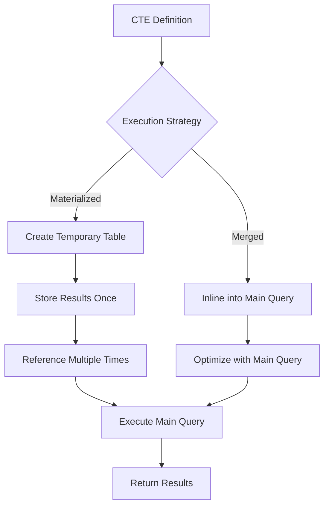
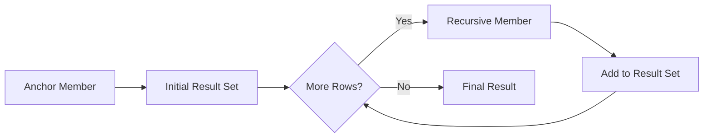
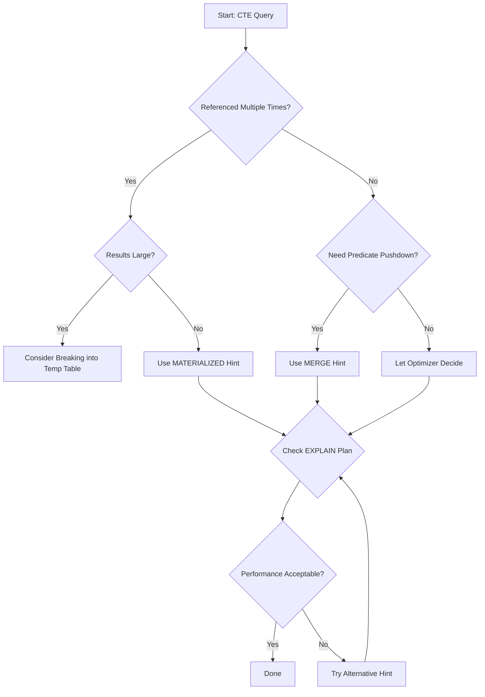

# How to Implement MySQL CTE Optimization

Author: [nawazdhandala](https://github.com/nawazdhandala)

Tags: MySQL, CTE, Query Optimization, Database

Description: Learn how to optimize Common Table Expressions in MySQL for better performance.

---

Common Table Expressions (CTEs) have become a cornerstone of modern SQL development since MySQL 8.0 introduced support for them. While CTEs improve query readability and maintainability, they can also introduce performance challenges if not used correctly. This guide covers practical techniques to optimize your CTEs for maximum performance.

## Understanding CTE Execution in MySQL

Before diving into optimization, it is essential to understand how MySQL processes CTEs. MySQL can handle CTEs in two ways: as materialized temporary tables or as merged (inlined) subqueries.



### Materialized vs Merged CTEs

When MySQL materializes a CTE, it creates a temporary table to store the CTE results. This approach works well when the CTE is referenced multiple times because the computation happens only once. However, materialization prevents the optimizer from pushing predicates into the CTE.

When MySQL merges (inlines) a CTE, it treats the CTE like a derived table and can optimize it together with the main query. This allows predicate pushdown and other optimizations but means the CTE logic executes each time it is referenced.

## Using Materialization Hints

MySQL 8.0.14 introduced optimizer hints that let you control CTE materialization behavior explicitly.

### Forcing Materialization

Use the `MATERIALIZED` hint when your CTE is referenced multiple times or when you want to ensure consistent results:

```sql
-- Force materialization for a CTE referenced multiple times
-- This computes the aggregation once and reuses the result
WITH order_totals AS (
    SELECT
        customer_id,
        COUNT(*) as order_count,
        SUM(total_amount) as total_spent
    FROM orders
    WHERE order_date >= '2024-01-01'
    GROUP BY customer_id
)
SELECT /*+ MATERIALIZED(order_totals) */
    c.customer_name,
    ot.order_count,
    ot.total_spent,
    (SELECT AVG(total_spent) FROM order_totals) as avg_customer_spent
FROM customers c
JOIN order_totals ot ON c.id = ot.customer_id
WHERE ot.total_spent > (SELECT AVG(total_spent) FROM order_totals);
```

### Forcing Merge (Inline) Behavior

Use the `MERGE` hint when you want the optimizer to push predicates into the CTE:

```sql
-- Force merge to allow predicate pushdown
-- The WHERE clause can be optimized with the CTE
WITH recent_orders AS (
    SELECT
        id,
        customer_id,
        total_amount,
        order_date
    FROM orders
    WHERE status = 'completed'
)
SELECT /*+ MERGE(recent_orders) */
    ro.id,
    ro.total_amount,
    c.customer_name
FROM recent_orders ro
JOIN customers c ON ro.customer_id = c.id
WHERE ro.order_date >= '2024-06-01'  -- This predicate can be pushed down
    AND ro.total_amount > 100;
```

## Analyzing Query Plans for CTEs

Understanding execution plans is critical for CTE optimization. Use `EXPLAIN` and `EXPLAIN ANALYZE` to see how MySQL handles your CTEs.

### Basic EXPLAIN Output

```sql
-- Examine the execution plan for a CTE query
EXPLAIN FORMAT=TREE
WITH high_value_customers AS (
    SELECT customer_id, SUM(amount) as total
    FROM transactions
    GROUP BY customer_id
    HAVING SUM(amount) > 10000
)
SELECT c.name, hvc.total
FROM customers c
JOIN high_value_customers hvc ON c.id = hvc.customer_id;
```

Example output showing materialization:

```
-> Nested loop inner join  (cost=125.50 rows=100)
    -> Table scan on hvc  (cost=25.50 rows=100)
        -> Materialize CTE high_value_customers  (cost=20.50 rows=100)
            -> Filter: (sum(amount) > 10000)
                -> Group aggregate: sum(transactions.amount)
                    -> Index scan on transactions using idx_customer
    -> Single-row index lookup on c using PRIMARY (id=hvc.customer_id)
```

### Using EXPLAIN ANALYZE for Runtime Statistics

```sql
-- Get actual execution statistics
EXPLAIN ANALYZE
WITH product_sales AS (
    SELECT
        product_id,
        SUM(quantity) as units_sold,
        SUM(quantity * price) as revenue
    FROM order_items
    GROUP BY product_id
)
SELECT
    p.product_name,
    ps.units_sold,
    ps.revenue
FROM products p
JOIN product_sales ps ON p.id = ps.product_id
WHERE ps.revenue > 5000
ORDER BY ps.revenue DESC
LIMIT 10;
```

The output shows actual rows processed and timing:

```
-> Limit: 10 row(s)  (actual time=45.2..45.3 rows=10 loops=1)
    -> Sort: ps.revenue DESC, limit input to 10 row(s)  (actual time=45.2..45.2 rows=10 loops=1)
        -> Filter: (ps.revenue > 5000)  (actual time=12.5..44.8 rows=156 loops=1)
            -> Nested loop inner join  (actual time=12.4..44.1 rows=1000 loops=1)
                -> Table scan on ps  (actual time=0.1..0.8 rows=1000 loops=1)
                    -> Materialize CTE product_sales  (actual time=12.3..12.3 rows=1000 loops=1)
                -> Single-row index lookup on p  (actual time=0.02..0.02 rows=1 loops=1000)
```

## Optimizing Recursive CTEs

Recursive CTEs are powerful for hierarchical data but require careful optimization. They consist of an anchor member and a recursive member.



### Basic Recursive CTE Structure

```sql
-- Recursive CTE for organizational hierarchy
-- Anchor: Start with top-level managers (no manager_id)
-- Recursive: Find employees who report to current level
WITH RECURSIVE org_hierarchy AS (
    -- Anchor member: top-level employees
    SELECT
        id,
        name,
        manager_id,
        1 as level,
        CAST(name AS CHAR(1000)) as path
    FROM employees
    WHERE manager_id IS NULL

    UNION ALL

    -- Recursive member: employees reporting to current level
    SELECT
        e.id,
        e.name,
        e.manager_id,
        oh.level + 1,
        CONCAT(oh.path, ' -> ', e.name)
    FROM employees e
    INNER JOIN org_hierarchy oh ON e.manager_id = oh.id
    WHERE oh.level < 10  -- Prevent infinite recursion
)
SELECT * FROM org_hierarchy ORDER BY level, name;
```

### Optimizing Recursive CTE Performance

#### 1. Add Recursion Depth Limits

Always include a depth limit to prevent runaway recursion:

```sql
-- Category tree with depth limit and path tracking
WITH RECURSIVE category_tree AS (
    SELECT
        id,
        name,
        parent_id,
        0 as depth,
        CAST(id AS CHAR(200)) as id_path
    FROM categories
    WHERE parent_id IS NULL

    UNION ALL

    SELECT
        c.id,
        c.name,
        c.parent_id,
        ct.depth + 1,
        CONCAT(ct.id_path, '/', c.id)
    FROM categories c
    INNER JOIN category_tree ct ON c.parent_id = ct.id
    WHERE ct.depth < 20  -- Maximum 20 levels deep
)
SELECT * FROM category_tree;
```

#### 2. Index the Join Columns

Ensure proper indexes exist for the recursive join:

```sql
-- Create indexes for efficient recursive traversal
CREATE INDEX idx_employees_manager ON employees(manager_id);
CREATE INDEX idx_categories_parent ON categories(parent_id);
```

#### 3. Minimize Columns in Recursive CTEs

Select only necessary columns to reduce memory usage:

```sql
-- Efficient: Only select needed columns
WITH RECURSIVE ancestors AS (
    SELECT id, parent_id
    FROM nodes
    WHERE id = 12345

    UNION ALL

    SELECT n.id, n.parent_id
    FROM nodes n
    INNER JOIN ancestors a ON n.id = a.parent_id
)
-- Join with full data only at the end
SELECT n.*
FROM nodes n
INNER JOIN ancestors a ON n.id = a.id;
```

## Performance Comparison Techniques

Use the following approach to compare CTE strategies:

```sql
-- Method 1: Measure materialized CTE performance
SET @start_time = NOW(6);

WITH materialized_cte AS (
    SELECT customer_id, SUM(amount) as total
    FROM large_transactions
    GROUP BY customer_id
)
SELECT /*+ MATERIALIZED(materialized_cte) */
    COUNT(*)
FROM materialized_cte mc1
JOIN materialized_cte mc2 ON mc1.customer_id = mc2.customer_id;

SELECT TIMESTAMPDIFF(MICROSECOND, @start_time, NOW(6)) / 1000 as ms_elapsed;

-- Method 2: Compare with subquery approach
SET @start_time = NOW(6);

SELECT COUNT(*)
FROM (
    SELECT customer_id, SUM(amount) as total
    FROM large_transactions
    GROUP BY customer_id
) sq1
JOIN (
    SELECT customer_id, SUM(amount) as total
    FROM large_transactions
    GROUP BY customer_id
) sq2 ON sq1.customer_id = sq2.customer_id;

SELECT TIMESTAMPDIFF(MICROSECOND, @start_time, NOW(6)) / 1000 as ms_elapsed;
```

## CTE Optimization Decision Flow

Use this decision tree to choose the right CTE strategy:



## Common CTE Anti-Patterns to Avoid

### Anti-Pattern 1: Unnecessary CTEs

```sql
-- Bad: CTE adds no value here
WITH simple_filter AS (
    SELECT * FROM orders WHERE status = 'pending'
)
SELECT * FROM simple_filter WHERE customer_id = 123;

-- Better: Direct query with combined conditions
SELECT * FROM orders
WHERE status = 'pending'
    AND customer_id = 123;
```

### Anti-Pattern 2: Over-Nested CTEs

```sql
-- Bad: Excessive nesting makes optimization difficult
WITH cte1 AS (SELECT * FROM table1),
     cte2 AS (SELECT * FROM cte1 WHERE x > 10),
     cte3 AS (SELECT * FROM cte2 WHERE y < 20),
     cte4 AS (SELECT * FROM cte3 WHERE z = 'active')
SELECT * FROM cte4;

-- Better: Combine conditions
WITH filtered_data AS (
    SELECT *
    FROM table1
    WHERE x > 10
        AND y < 20
        AND z = 'active'
)
SELECT * FROM filtered_data;
```

### Anti-Pattern 3: Missing Indexes for CTE Joins

```sql
-- Ensure indexes exist for CTE join operations
-- Before running CTE queries, verify index coverage:
EXPLAIN
WITH sales_summary AS (
    SELECT product_id, SUM(quantity) as total_qty
    FROM sales
    GROUP BY product_id
)
SELECT p.name, ss.total_qty
FROM products p
JOIN sales_summary ss ON p.id = ss.product_id;

-- Create index if table scan appears on products
CREATE INDEX idx_products_id ON products(id);
```

## Advanced Techniques

### Combining Multiple CTEs Efficiently

```sql
-- Structure multiple CTEs for clarity and performance
WITH
-- First CTE: Aggregate customer orders
customer_orders AS (
    SELECT
        customer_id,
        COUNT(*) as order_count,
        MAX(order_date) as last_order
    FROM orders
    GROUP BY customer_id
),
-- Second CTE: Identify high-value customers
high_value AS (
    SELECT customer_id
    FROM transactions
    GROUP BY customer_id
    HAVING SUM(amount) > 10000
),
-- Third CTE: Combine the data
customer_insights AS (
    SELECT
        co.customer_id,
        co.order_count,
        co.last_order,
        CASE WHEN hv.customer_id IS NOT NULL THEN 'High Value' ELSE 'Standard' END as segment
    FROM customer_orders co
    LEFT JOIN high_value hv ON co.customer_id = hv.customer_id
)
-- Final query with all insights
SELECT
    c.name,
    c.email,
    ci.order_count,
    ci.last_order,
    ci.segment
FROM customers c
JOIN customer_insights ci ON c.id = ci.customer_id
ORDER BY ci.order_count DESC;
```

### Using CTEs with Window Functions

```sql
-- CTEs work well with window functions for complex analytics
WITH ranked_sales AS (
    SELECT
        product_id,
        sale_date,
        amount,
        -- Rank sales within each product
        ROW_NUMBER() OVER (
            PARTITION BY product_id
            ORDER BY amount DESC
        ) as sale_rank,
        -- Running total per product
        SUM(amount) OVER (
            PARTITION BY product_id
            ORDER BY sale_date
        ) as running_total
    FROM sales
    WHERE sale_date >= '2024-01-01'
)
SELECT
    p.product_name,
    rs.sale_date,
    rs.amount,
    rs.running_total
FROM ranked_sales rs
JOIN products p ON rs.product_id = p.id
WHERE rs.sale_rank <= 5  -- Top 5 sales per product
ORDER BY p.product_name, rs.sale_rank;
```

## Monitoring CTE Performance

### Using Performance Schema

```sql
-- Enable statement instrumentation
UPDATE performance_schema.setup_consumers
SET ENABLED = 'YES'
WHERE NAME LIKE 'events_statements%';

-- Query to find slow CTE queries
SELECT
    DIGEST_TEXT,
    COUNT_STAR as executions,
    ROUND(AVG_TIMER_WAIT/1000000000, 2) as avg_ms,
    ROUND(SUM_TIMER_WAIT/1000000000, 2) as total_ms
FROM performance_schema.events_statements_summary_by_digest
WHERE DIGEST_TEXT LIKE '%WITH%'
ORDER BY SUM_TIMER_WAIT DESC
LIMIT 10;
```

## Summary

Optimizing MySQL CTEs requires understanding both the execution model and your specific use case. Key takeaways:

1. **Understand materialization**: Know when MySQL materializes CTEs vs merges them
2. **Use hints wisely**: Apply `MATERIALIZED` or `MERGE` hints based on your query pattern
3. **Analyze execution plans**: Use `EXPLAIN` and `EXPLAIN ANALYZE` to verify optimization choices
4. **Optimize recursive CTEs**: Add depth limits, proper indexes, and minimize selected columns
5. **Avoid anti-patterns**: Keep CTEs simple and purposeful
6. **Monitor performance**: Track CTE query performance over time

By applying these techniques, you can write CTEs that are both readable and performant, making the most of this powerful SQL feature.

## Further Reading

- MySQL 8.0 Reference Manual: Common Table Expressions
- MySQL 8.0 Reference Manual: Optimizer Hints
- MySQL Performance Schema Documentation
