# How to Build MySQL Event Scheduler Patterns

Author: [nawazdhandala](https://github.com/nawazdhandala)

Tags: MySQL, Event Scheduler, Scheduled Tasks, Automation

Description: Learn to implement MySQL Event Scheduler for recurring tasks with scheduling patterns, error handling, and maintenance jobs.

---

MySQL Event Scheduler is a powerful built-in feature that allows you to automate database tasks without relying on external cron jobs or task schedulers. Whether you need to purge old data, generate reports, or perform routine maintenance, the Event Scheduler provides a reliable and database-native solution.

## What is MySQL Event Scheduler?

The MySQL Event Scheduler is a background thread that executes scheduled events at specified times. Think of it as a cron daemon that runs inside your MySQL server. It can execute SQL statements on a one-time or recurring basis.


## Enabling the Event Scheduler

Before creating events, you need to ensure the Event Scheduler is enabled. By default, it might be turned off.

### Check Current Status

```sql
-- Check if the event scheduler is running
SHOW VARIABLES LIKE 'event_scheduler';

-- Alternative method
SELECT @@event_scheduler;
```

### Enable the Scheduler

```sql
-- Enable temporarily (resets on server restart)
SET GLOBAL event_scheduler = ON;

-- To make it permanent, add to my.cnf or my.ini:
-- [mysqld]
-- event_scheduler = ON
```

## Creating Your First Event

Let's start with a simple one-time event before moving to more complex patterns.

### One-Time Events

One-time events execute once at a specified time and then are automatically dropped (unless you specify otherwise).

```sql
-- Create a one-time event that runs 1 hour from now
CREATE EVENT cleanup_temp_data_once
ON SCHEDULE AT CURRENT_TIMESTAMP + INTERVAL 1 HOUR
DO
    DELETE FROM temp_sessions WHERE created_at < NOW() - INTERVAL 24 HOUR;
```

### Preserving One-Time Events

If you want to keep the event definition after execution for auditing purposes:

```sql
CREATE EVENT archive_monthly_report
ON SCHEDULE AT '2026-02-01 00:00:00'
ON COMPLETION PRESERVE
DO
    INSERT INTO report_archive
    SELECT * FROM monthly_reports WHERE report_month = '2026-01';
```

## Recurring Event Patterns

Recurring events are where the Event Scheduler truly shines. Here are common scheduling patterns.


### Every N Minutes/Hours

```sql
-- Run every 15 minutes
CREATE EVENT refresh_materialized_view
ON SCHEDULE EVERY 15 MINUTE
STARTS CURRENT_TIMESTAMP
DO
    CALL sp_refresh_dashboard_stats();

-- Run every 2 hours
CREATE EVENT sync_external_data
ON SCHEDULE EVERY 2 HOUR
STARTS CURRENT_TIMESTAMP
DO
BEGIN
    INSERT INTO sync_log (started_at) VALUES (NOW());
    CALL sp_sync_external_api();
    UPDATE sync_log SET completed_at = NOW()
    WHERE id = LAST_INSERT_ID();
END;
```

### Daily Events

```sql
-- Run every day at 2:00 AM
CREATE EVENT daily_cleanup
ON SCHEDULE EVERY 1 DAY
STARTS (TIMESTAMP(CURRENT_DATE) + INTERVAL 1 DAY + INTERVAL 2 HOUR)
DO
BEGIN
    -- Delete old audit logs
    DELETE FROM audit_logs WHERE created_at < NOW() - INTERVAL 90 DAY;

    -- Optimize tables
    OPTIMIZE TABLE sessions, cache_entries;

    -- Update statistics
    ANALYZE TABLE users, orders, products;
END;
```

### Weekly Events

```sql
-- Run every Sunday at 3:00 AM
CREATE EVENT weekly_report_generation
ON SCHEDULE EVERY 1 WEEK
STARTS (
    TIMESTAMP(CURRENT_DATE) + INTERVAL (6 - WEEKDAY(CURRENT_DATE)) DAY + INTERVAL 3 HOUR
)
DO
BEGIN
    CALL sp_generate_weekly_summary();
    CALL sp_send_report_notification();
END;
```

### Monthly Events

```sql
-- Run on the first day of each month at midnight
CREATE EVENT monthly_data_aggregation
ON SCHEDULE EVERY 1 MONTH
STARTS (
    DATE_FORMAT(CURRENT_DATE + INTERVAL 1 MONTH, '%Y-%m-01 00:00:00')
)
DO
BEGIN
    -- Aggregate previous month's data
    INSERT INTO monthly_sales_summary (month, total_sales, order_count)
    SELECT
        DATE_FORMAT(NOW() - INTERVAL 1 MONTH, '%Y-%m'),
        SUM(total_amount),
        COUNT(*)
    FROM orders
    WHERE order_date >= DATE_FORMAT(NOW() - INTERVAL 1 MONTH, '%Y-%m-01')
      AND order_date < DATE_FORMAT(NOW(), '%Y-%m-01');
END;
```

## Event Lifecycle and States

Understanding event states helps with debugging and maintenance.


### Managing Event States

```sql
-- Disable an event temporarily
ALTER EVENT daily_cleanup DISABLE;

-- Re-enable the event
ALTER EVENT daily_cleanup ENABLE;

-- Rename an event
ALTER EVENT old_event_name RENAME TO new_event_name;

-- Modify the schedule
ALTER EVENT daily_cleanup
ON SCHEDULE EVERY 1 DAY
STARTS (TIMESTAMP(CURRENT_DATE) + INTERVAL 1 DAY + INTERVAL 3 HOUR);

-- Drop an event
DROP EVENT IF EXISTS obsolete_task;
```

## Error Handling Strategies

MySQL events don't have built-in try-catch for the event itself, but you can implement error handling within stored procedures.

### Creating an Error Logging Table

```sql
CREATE TABLE event_error_log (
    id BIGINT AUTO_INCREMENT PRIMARY KEY,
    event_name VARCHAR(64),
    error_code INT,
    error_message TEXT,
    occurred_at TIMESTAMP DEFAULT CURRENT_TIMESTAMP,
    INDEX idx_event_name (event_name),
    INDEX idx_occurred_at (occurred_at)
);
```

### Error-Safe Event Pattern

```sql
DELIMITER //

CREATE PROCEDURE sp_safe_cleanup()
BEGIN
    DECLARE EXIT HANDLER FOR SQLEXCEPTION
    BEGIN
        GET DIAGNOSTICS CONDITION 1
            @error_code = MYSQL_ERRNO,
            @error_message = MESSAGE_TEXT;

        INSERT INTO event_error_log (event_name, error_code, error_message)
        VALUES ('daily_cleanup', @error_code, @error_message);

        -- Optionally rollback if in transaction
        ROLLBACK;
    END;

    START TRANSACTION;

    -- Your cleanup logic here
    DELETE FROM expired_tokens WHERE expiry_date < NOW();
    DELETE FROM temp_files WHERE created_at < NOW() - INTERVAL 7 DAY;

    COMMIT;
END //

DELIMITER ;

-- Event that uses the safe procedure
CREATE EVENT daily_cleanup_safe
ON SCHEDULE EVERY 1 DAY
STARTS (TIMESTAMP(CURRENT_DATE) + INTERVAL 1 DAY + INTERVAL 2 HOUR)
DO
    CALL sp_safe_cleanup();
```

### Implementing Retry Logic

```sql
DELIMITER //

CREATE PROCEDURE sp_with_retry(IN max_attempts INT)
BEGIN
    DECLARE attempt INT DEFAULT 0;
    DECLARE success BOOLEAN DEFAULT FALSE;

    retry_loop: WHILE attempt < max_attempts AND NOT success DO
        SET attempt = attempt + 1;

        BEGIN
            DECLARE EXIT HANDLER FOR SQLEXCEPTION
            BEGIN
                -- Log the failed attempt
                INSERT INTO event_error_log (event_name, error_code, error_message)
                VALUES ('retry_task', -1, CONCAT('Attempt ', attempt, ' failed'));

                -- Wait before retry (using SLEEP)
                DO SLEEP(POW(2, attempt)); -- Exponential backoff
            END;

            -- Your actual task
            CALL sp_critical_sync_task();
            SET success = TRUE;
        END;
    END WHILE;

    IF NOT success THEN
        -- All attempts failed - alert or escalate
        INSERT INTO alert_queue (message, severity)
        VALUES ('Critical sync task failed after max retries', 'HIGH');
    END IF;
END //

DELIMITER ;
```

## Monitoring Events

Keeping track of your events is crucial for maintaining a healthy database.


### Viewing All Events

```sql
-- List all events in the current database
SHOW EVENTS;

-- List all events across all databases
SELECT
    EVENT_SCHEMA,
    EVENT_NAME,
    STATUS,
    EVENT_TYPE,
    EXECUTE_AT,
    INTERVAL_VALUE,
    INTERVAL_FIELD,
    LAST_EXECUTED,
    STARTS,
    ENDS
FROM INFORMATION_SCHEMA.EVENTS
ORDER BY EVENT_SCHEMA, EVENT_NAME;
```

### Creating an Execution Log

```sql
-- Execution tracking table
CREATE TABLE event_execution_log (
    id BIGINT AUTO_INCREMENT PRIMARY KEY,
    event_name VARCHAR(64) NOT NULL,
    started_at TIMESTAMP(6) NOT NULL,
    completed_at TIMESTAMP(6) NULL,
    duration_ms INT GENERATED ALWAYS AS (
        TIMESTAMPDIFF(MICROSECOND, started_at, completed_at) / 1000
    ) STORED,
    rows_affected INT DEFAULT 0,
    status ENUM('RUNNING', 'COMPLETED', 'FAILED') DEFAULT 'RUNNING',
    error_message TEXT NULL,
    INDEX idx_event_name (event_name),
    INDEX idx_started_at (started_at),
    INDEX idx_status (status)
);

-- Wrapper procedure for tracked execution
DELIMITER //

CREATE PROCEDURE sp_tracked_execution(
    IN p_event_name VARCHAR(64),
    IN p_procedure_name VARCHAR(128)
)
BEGIN
    DECLARE v_log_id BIGINT;
    DECLARE v_rows INT DEFAULT 0;

    -- Start tracking
    INSERT INTO event_execution_log (event_name, started_at)
    VALUES (p_event_name, NOW(6));
    SET v_log_id = LAST_INSERT_ID();

    BEGIN
        DECLARE EXIT HANDLER FOR SQLEXCEPTION
        BEGIN
            GET DIAGNOSTICS CONDITION 1 @err_msg = MESSAGE_TEXT;
            UPDATE event_execution_log
            SET completed_at = NOW(6),
                status = 'FAILED',
                error_message = @err_msg
            WHERE id = v_log_id;
            RESIGNAL;
        END;

        -- Execute the actual procedure
        SET @sql = CONCAT('CALL ', p_procedure_name, '()');
        PREPARE stmt FROM @sql;
        EXECUTE stmt;
        DEALLOCATE PREPARE stmt;

        GET DIAGNOSTICS v_rows = ROW_COUNT;
    END;

    -- Mark as completed
    UPDATE event_execution_log
    SET completed_at = NOW(6),
        status = 'COMPLETED',
        rows_affected = v_rows
    WHERE id = v_log_id;
END //

DELIMITER ;
```

### Monitoring Dashboard Query

```sql
-- Event health dashboard
SELECT
    e.EVENT_NAME,
    e.STATUS,
    e.LAST_EXECUTED,
    COALESCE(stats.exec_count, 0) AS executions_24h,
    COALESCE(stats.avg_duration_ms, 0) AS avg_duration_ms,
    COALESCE(stats.error_count, 0) AS errors_24h,
    COALESCE(err.last_error, 'None') AS last_error
FROM INFORMATION_SCHEMA.EVENTS e
LEFT JOIN (
    SELECT
        event_name,
        COUNT(*) AS exec_count,
        AVG(duration_ms) AS avg_duration_ms,
        SUM(CASE WHEN status = 'FAILED' THEN 1 ELSE 0 END) AS error_count
    FROM event_execution_log
    WHERE started_at >= NOW() - INTERVAL 24 HOUR
    GROUP BY event_name
) stats ON e.EVENT_NAME = stats.event_name
LEFT JOIN (
    SELECT
        event_name,
        error_message AS last_error
    FROM event_error_log
    WHERE id = (
        SELECT MAX(id) FROM event_error_log el2
        WHERE el2.event_name = event_error_log.event_name
    )
) err ON e.EVENT_NAME = err.event_name
WHERE e.EVENT_SCHEMA = DATABASE();
```

## Practical Use Cases

### Data Retention and Cleanup

```sql
DELIMITER //

CREATE EVENT data_retention_policy
ON SCHEDULE EVERY 1 DAY
STARTS (TIMESTAMP(CURRENT_DATE) + INTERVAL 1 DAY + INTERVAL 4 HOUR)
COMMENT 'Enforces data retention policies across tables'
DO
BEGIN
    DECLARE v_deleted_logs INT DEFAULT 0;
    DECLARE v_deleted_sessions INT DEFAULT 0;
    DECLARE v_deleted_temp INT DEFAULT 0;

    -- Delete old application logs (keep 30 days)
    DELETE FROM application_logs
    WHERE created_at < NOW() - INTERVAL 30 DAY
    LIMIT 10000;
    SET v_deleted_logs = ROW_COUNT;

    -- Delete expired sessions (keep 7 days)
    DELETE FROM user_sessions
    WHERE last_activity < NOW() - INTERVAL 7 DAY
    LIMIT 5000;
    SET v_deleted_sessions = ROW_COUNT;

    -- Clean temporary uploads (keep 24 hours)
    DELETE FROM temp_uploads
    WHERE uploaded_at < NOW() - INTERVAL 24 HOUR;
    SET v_deleted_temp = ROW_COUNT;

    -- Log the cleanup results
    INSERT INTO event_execution_log (event_name, started_at, completed_at, status)
    VALUES (
        'data_retention_policy',
        NOW(),
        NOW(),
        'COMPLETED'
    );
END //

DELIMITER ;
```

### Database Statistics Update

```sql
CREATE EVENT update_table_statistics
ON SCHEDULE EVERY 6 HOUR
STARTS CURRENT_TIMESTAMP
COMMENT 'Keeps table statistics fresh for query optimizer'
DO
BEGIN
    -- Analyze frequently queried tables
    ANALYZE TABLE users;
    ANALYZE TABLE orders;
    ANALYZE TABLE products;
    ANALYZE TABLE inventory;

    -- Update custom statistics table
    INSERT INTO table_statistics_history (
        table_name,
        row_count,
        data_size_mb,
        index_size_mb,
        recorded_at
    )
    SELECT
        TABLE_NAME,
        TABLE_ROWS,
        ROUND(DATA_LENGTH / 1024 / 1024, 2),
        ROUND(INDEX_LENGTH / 1024 / 1024, 2),
        NOW()
    FROM INFORMATION_SCHEMA.TABLES
    WHERE TABLE_SCHEMA = DATABASE()
      AND TABLE_TYPE = 'BASE TABLE';
END;
```

### Partition Maintenance

```sql
DELIMITER //

CREATE EVENT partition_maintenance
ON SCHEDULE EVERY 1 MONTH
STARTS (DATE_FORMAT(CURRENT_DATE + INTERVAL 1 MONTH, '%Y-%m-01 01:00:00'))
COMMENT 'Manages table partitions - creates new, drops old'
DO
BEGIN
    DECLARE v_future_partition VARCHAR(20);
    DECLARE v_old_partition VARCHAR(20);

    -- Calculate partition names
    SET v_future_partition = DATE_FORMAT(NOW() + INTERVAL 2 MONTH, 'p%Y%m');
    SET v_old_partition = DATE_FORMAT(NOW() - INTERVAL 13 MONTH, 'p%Y%m');

    -- Add new partition for 2 months ahead
    SET @sql = CONCAT(
        'ALTER TABLE events_partitioned ADD PARTITION (',
        'PARTITION ', v_future_partition,
        ' VALUES LESS THAN (TO_DAYS(''',
        DATE_FORMAT(NOW() + INTERVAL 3 MONTH, '%Y-%m-01'),
        ''')))'
    );

    PREPARE stmt FROM @sql;
    EXECUTE stmt;
    DEALLOCATE PREPARE stmt;

    -- Drop partition older than 13 months
    SET @sql = CONCAT(
        'ALTER TABLE events_partitioned DROP PARTITION ',
        v_old_partition
    );

    BEGIN
        DECLARE CONTINUE HANDLER FOR 1507, 1508 BEGIN END; -- Partition doesn't exist
        PREPARE stmt FROM @sql;
        EXECUTE stmt;
        DEALLOCATE PREPARE stmt;
    END;
END //

DELIMITER ;
```

## Best Practices

### 1. Use Stored Procedures

Encapsulate complex logic in stored procedures rather than inline in events. This improves maintainability and testability.

```sql
-- Good: Event calls a procedure
CREATE EVENT good_event
ON SCHEDULE EVERY 1 HOUR
DO CALL sp_complex_task();

-- Avoid: Complex logic inline
CREATE EVENT avoid_this
ON SCHEDULE EVERY 1 HOUR
DO
BEGIN
    -- Hundreds of lines of SQL...
END;
```

### 2. Implement Proper Naming Conventions

```sql
-- Use descriptive names with prefixes
-- evt_ prefix for events
-- Frequency indicator (daily, hourly, etc.)
-- Action description

CREATE EVENT evt_daily_cleanup_expired_tokens ...
CREATE EVENT evt_hourly_sync_inventory ...
CREATE EVENT evt_weekly_generate_reports ...
```

### 3. Set Appropriate Time Windows

```mermaid
gantt
    title Event Scheduling Best Practices
    dateFormat HH:mm
    axisFormat %H:%M

    section Low Priority
    Data Cleanup       :02:00, 03:00
    Statistics Update  :03:00, 04:00

    section Medium Priority
    Report Generation  :05:00, 06:00
    Data Aggregation   :06:00, 07:00

    section High Priority
    Cache Refresh      :00:00, 24:00
    Sync Tasks         :00:00, 24:00
```



### 4. Document Your Events

```sql
CREATE EVENT evt_daily_audit_cleanup
ON SCHEDULE EVERY 1 DAY
STARTS (TIMESTAMP(CURRENT_DATE) + INTERVAL 1 DAY + INTERVAL 2 HOUR)
COMMENT 'Removes audit logs older than 90 days. Owner: DBA Team. SLA: 30 min max runtime'
DO
    CALL sp_cleanup_audit_logs();
```

## Troubleshooting Common Issues

### Event Not Running

```sql
-- Check if scheduler is enabled
SHOW VARIABLES LIKE 'event_scheduler';

-- Verify event exists and is enabled
SELECT EVENT_NAME, STATUS, LAST_EXECUTED
FROM INFORMATION_SCHEMA.EVENTS
WHERE EVENT_NAME = 'your_event_name';

-- Check for syntax errors in event body
SHOW CREATE EVENT your_event_name;
```

### Event Runs But No Effect

```sql
-- Check if the event definer has proper privileges
SELECT DEFINER FROM INFORMATION_SCHEMA.EVENTS
WHERE EVENT_NAME = 'your_event_name';

-- Verify the definer account exists and has permissions
SHOW GRANTS FOR 'event_definer'@'localhost';
```

### Performance Issues

```sql
-- Identify long-running events
SELECT
    event_name,
    AVG(duration_ms) AS avg_ms,
    MAX(duration_ms) AS max_ms,
    COUNT(*) AS runs
FROM event_execution_log
WHERE started_at >= NOW() - INTERVAL 7 DAY
GROUP BY event_name
HAVING AVG(duration_ms) > 60000  -- Events taking more than 1 minute
ORDER BY avg_ms DESC;
```

## Conclusion

MySQL Event Scheduler provides a robust way to automate database tasks directly within your MySQL server. By following the patterns and best practices outlined in this guide, you can build reliable, maintainable scheduled tasks that handle everything from simple cleanup operations to complex data processing pipelines.

Key takeaways:
- Always enable and verify the Event Scheduler is running
- Use stored procedures for complex logic
- Implement proper error handling and logging
- Monitor your events with execution tracking
- Follow naming conventions and document your events
- Schedule resource-intensive tasks during off-peak hours

With these patterns in your toolkit, you can reduce operational overhead and ensure your database maintenance tasks run smoothly and reliably.
