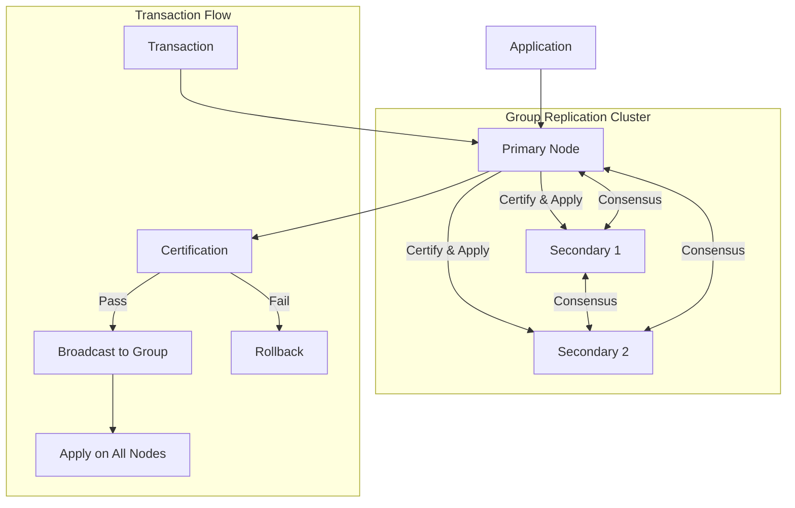
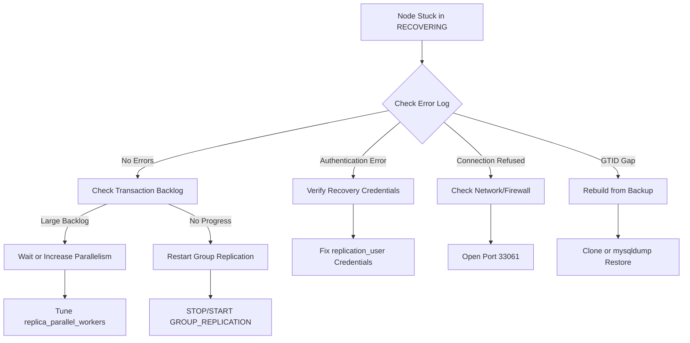
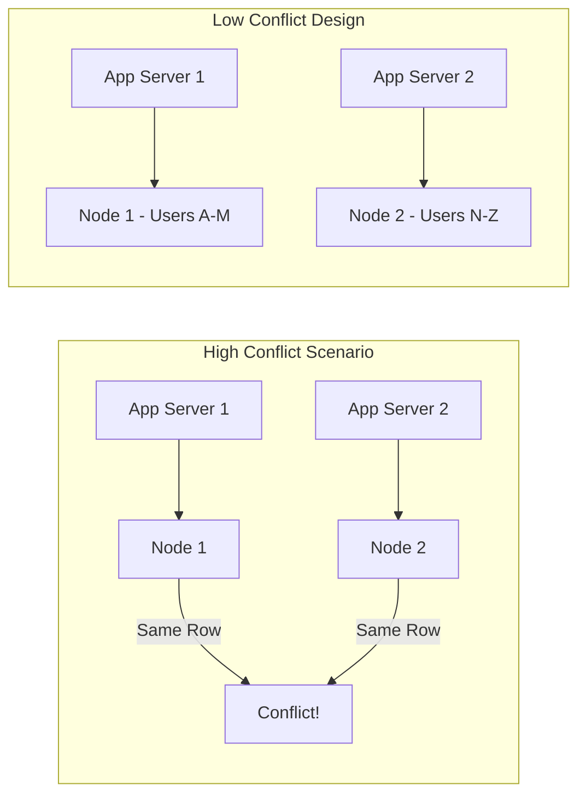
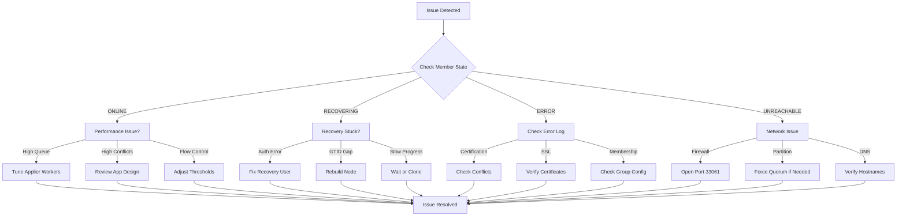

# How to Implement MySQL Group Replication Troubleshooting

Author: [nawazdhandala](https://github.com/nawazdhandala)

Tags: MySQL, Database, Replication, Troubleshooting, High Availability, DevOps

Description: A practical guide to diagnosing and resolving common MySQL Group Replication issues including network partitions, node failures, certification conflicts, and performance bottlenecks.

---

MySQL Group Replication provides high availability through automatic failover and multi-master synchronization. When it works, it is seamless. When it breaks, debugging can be challenging without the right approach. This guide covers systematic troubleshooting techniques with real commands and solutions.

## How Group Replication Works



Group Replication uses a consensus protocol where all nodes must agree on transaction order. Understanding this flow is essential for troubleshooting.

## Quick Health Check

Before diving into specific issues, run this diagnostic query on every node.

```sql
-- Comprehensive health check query
-- Run this on each node to get a snapshot of group replication status

SELECT
    MEMBER_ID,
    MEMBER_HOST,
    MEMBER_PORT,
    MEMBER_STATE,
    MEMBER_ROLE
FROM
    performance_schema.replication_group_members;

-- Check for any errors in the applier or recovery channels
SELECT
    CHANNEL_NAME,
    SERVICE_STATE,
    LAST_ERROR_NUMBER,
    LAST_ERROR_MESSAGE,
    LAST_ERROR_TIMESTAMP
FROM
    performance_schema.replication_connection_status
WHERE
    CHANNEL_NAME LIKE 'group_replication%';

-- Check applier status for transaction backlog
SELECT
    CHANNEL_NAME,
    COUNT_TRANSACTIONS_IN_QUEUE,
    COUNT_TRANSACTIONS_CHECKED,
    COUNT_CONFLICTS_DETECTED
FROM
    performance_schema.replication_group_member_stats
WHERE
    MEMBER_ID = @@server_uuid;
```

| Member State | Meaning | Action Required |
|--------------|---------|-----------------|
| ONLINE | Node is healthy and participating | None |
| RECOVERING | Node is catching up with the group | Wait or check recovery progress |
| OFFLINE | Node is not part of the group | Investigate and rejoin |
| ERROR | Node encountered a critical error | Check error logs immediately |
| UNREACHABLE | Network issue detected | Check connectivity |

## Common Issue 1: Node Stuck in RECOVERING

When a node stays in RECOVERING state for too long, it usually indicates a problem with the recovery channel or a large transaction backlog.

```sql
-- Check recovery channel status
-- This shows whether the node is actively receiving data

SELECT
    CHANNEL_NAME,
    RECEIVED_TRANSACTION_SET,
    SERVICE_STATE
FROM
    performance_schema.replication_connection_status
WHERE
    CHANNEL_NAME = 'group_replication_recovery';

-- Check how far behind the recovering node is
SELECT
    CHANNEL_NAME,
    LAST_QUEUED_TRANSACTION,
    LAST_APPLIED_TRANSACTION,
    APPLYING_TRANSACTION
FROM
    performance_schema.replication_applier_status_by_worker
WHERE
    CHANNEL_NAME = 'group_replication_applier';
```

### Recovery Troubleshooting Steps



If credentials are the issue, verify and reset the recovery user.

```sql
-- Check if recovery user exists and has correct privileges
SELECT user, host FROM mysql.user WHERE user = 'replication_user';

-- Create or update recovery user with proper privileges
CREATE USER IF NOT EXISTS 'replication_user'@'%'
    IDENTIFIED BY 'secure_password';

GRANT REPLICATION SLAVE, BACKUP_ADMIN, GROUP_REPLICATION_STREAM
    ON *.* TO 'replication_user'@'%';

FLUSH PRIVILEGES;

-- Configure the recovery channel to use these credentials
CHANGE REPLICATION SOURCE TO
    SOURCE_USER='replication_user',
    SOURCE_PASSWORD='secure_password'
    FOR CHANNEL 'group_replication_recovery';
```

## Common Issue 2: Split Brain and Network Partitions

Network partitions can cause nodes to lose quorum and stop accepting writes. This is by design to prevent data inconsistency.

```sql
-- Check current quorum status
-- A majority of nodes must be reachable for writes

SELECT
    @@group_replication_group_name as group_name,
    (SELECT COUNT(*) FROM performance_schema.replication_group_members
     WHERE MEMBER_STATE = 'ONLINE') as online_members,
    (SELECT COUNT(*) FROM performance_schema.replication_group_members) as total_members;

-- If you lost quorum, check which nodes are visible
SELECT
    MEMBER_HOST,
    MEMBER_STATE,
    MEMBER_ROLE
FROM
    performance_schema.replication_group_members;
```

### Force Quorum After Partition (Emergency Only)

Use this only when you are certain which partition has the most recent data.

```sql
-- DANGER: This can cause data loss if used incorrectly
-- Only use when you are absolutely sure about the surviving nodes

-- Step 1: Get the server_uuid of surviving nodes
SELECT @@server_uuid;

-- Step 2: On the node with most recent data, force new membership
-- Replace the UUIDs with your actual surviving node UUIDs
SET GLOBAL group_replication_force_members =
    'uuid1:33061,uuid2:33061';

-- Step 3: Verify new membership
SELECT * FROM performance_schema.replication_group_members;

-- Step 4: Clear the force_members variable
SET GLOBAL group_replication_force_members = '';
```

## Common Issue 3: Certification Conflicts

Certification conflicts occur when two nodes try to modify the same row simultaneously in multi-primary mode.

```sql
-- Check certification conflict statistics
SELECT
    MEMBER_ID,
    COUNT_TRANSACTIONS_CHECKED,
    COUNT_CONFLICTS_DETECTED,
    COUNT_TRANSACTIONS_ROWS_VALIDATING
FROM
    performance_schema.replication_group_member_stats;

-- Find which tables have the most conflicts
-- Enable performance_schema instrumentation first
UPDATE performance_schema.setup_instruments
SET ENABLED = 'YES', TIMED = 'YES'
WHERE NAME LIKE '%group_replication%';

-- Check the error log for specific conflict details
-- Conflicts appear as: [Certification Conflict] Transaction was aborted
```

### Reducing Certification Conflicts



Application-level strategies to reduce conflicts are shown below.

```sql
-- Strategy 1: Use single-primary mode if conflicts are frequent
-- This routes all writes to one node automatically

-- Check current mode
SELECT @@group_replication_single_primary_mode;

-- Switch to single-primary (requires restart of all nodes)
-- In my.cnf:
-- group_replication_single_primary_mode = ON

-- Strategy 2: Add small random delay for hot rows
-- Application code example (pseudocode):
-- if (high_contention_table) {
--     sleep(random(10, 50) ms);
-- }

-- Strategy 3: Batch updates to reduce transaction frequency
-- Instead of updating row by row:
UPDATE orders SET status = 'shipped'
WHERE order_id IN (1001, 1002, 1003, 1004, 1005);
```

## Common Issue 4: High Applier Lag

When the applier queue grows, the node falls behind the group and may become unstable.

```sql
-- Check applier queue depth across all nodes
SELECT
    MEMBER_HOST,
    COUNT_TRANSACTIONS_IN_QUEUE as queue_depth,
    COUNT_TRANSACTIONS_REMOTE_IN_APPLIER_QUEUE as remote_queue,
    TRANSACTIONS_COMMITTED_ALL_MEMBERS
FROM
    performance_schema.replication_group_member_stats;

-- Check if flow control is throttling the primary
SELECT
    @@group_replication_flow_control_mode,
    @@group_replication_flow_control_applier_threshold,
    @@group_replication_flow_control_certifier_threshold;
```

### Tuning Applier Performance

```sql
-- Increase parallel applier workers
-- Default is 4, can go up to 1024 based on workload

STOP GROUP_REPLICATION;

SET GLOBAL replica_parallel_workers = 16;
SET GLOBAL replica_parallel_type = 'LOGICAL_CLOCK';
SET GLOBAL replica_preserve_commit_order = ON;

START GROUP_REPLICATION;

-- Adjust flow control thresholds if being throttled too aggressively
-- Higher values allow more lag before throttling kicks in

SET GLOBAL group_replication_flow_control_applier_threshold = 50000;
SET GLOBAL group_replication_flow_control_certifier_threshold = 50000;

-- Monitor the effect
SELECT
    COUNT_TRANSACTIONS_IN_QUEUE,
    COUNT_TRANSACTIONS_REMOTE_APPLIED
FROM
    performance_schema.replication_group_member_stats
WHERE
    MEMBER_ID = @@server_uuid;
```

## Common Issue 5: Node Cannot Rejoin After Crash

After an unexpected crash, a node may fail to rejoin due to GTID inconsistencies or corrupted local state.

```sql
-- Check GTID executed set on the rejoining node
SELECT @@gtid_executed;

-- Compare with another healthy node in the group
-- If GTIDs are ahead of the group, the node has "errant transactions"

-- Check for errant transactions
SELECT
    GTID_SUBTRACT(
        (SELECT @@gtid_executed),
        (SELECT RECEIVED_TRANSACTION_SET
         FROM performance_schema.replication_connection_status
         WHERE CHANNEL_NAME = 'group_replication_applier')
    ) as errant_transactions;
```

### Recovery Options for Failed Node

```bash
#!/bin/bash
# recovery-options.sh
# Choose the appropriate recovery method based on the situation

# Option 1: If local data can be discarded, use clone plugin
# This is the fastest method for rejoining

mysql -e "
STOP GROUP_REPLICATION;
RESET MASTER;
RESET REPLICA ALL;

-- Install clone plugin if not present
INSTALL PLUGIN clone SONAME 'mysql_clone.so';

-- Clone from a healthy donor
SET GLOBAL clone_valid_donor_list = 'healthy-node.example.com:3306';
CLONE INSTANCE FROM 'replication_user'@'healthy-node.example.com':3306
    IDENTIFIED BY 'secure_password';
"

# The server will restart automatically after clone completes
# Then start group replication
mysql -e "START GROUP_REPLICATION;"
```

```sql
-- Option 2: If you need to preserve local data (dangerous)
-- Only use this if you understand the implications

-- First, identify the errant transactions
SET @errant = (SELECT GTID_SUBTRACT(@@gtid_executed,
    (SELECT RECEIVED_TRANSACTION_SET
     FROM performance_schema.replication_connection_status
     WHERE CHANNEL_NAME = 'group_replication_applier')));

-- If errant transactions exist, you must either:
-- 1. Inject empty transactions on all other nodes (complex)
-- 2. Rebuild this node from scratch (recommended)

-- To inject empty transaction on other nodes (for each errant GTID):
SET GTID_NEXT = 'uuid:transaction_id';
BEGIN; COMMIT;
SET GTID_NEXT = 'AUTOMATIC';
```

## Common Issue 6: SSL/TLS Connection Failures

Group Replication uses SSL for node-to-node communication. Certificate issues can prevent nodes from joining.

```sql
-- Check SSL configuration for group replication
SHOW VARIABLES LIKE 'group_replication_ssl%';
SHOW VARIABLES LIKE 'group_replication_recovery_ssl%';

-- Verify SSL is working
SELECT
    CHANNEL_NAME,
    SSL_ALLOWED,
    SSL_CIPHER
FROM
    performance_schema.replication_connection_configuration
WHERE
    CHANNEL_NAME LIKE 'group_replication%';
```

### Configuring SSL for Group Replication

```ini
# my.cnf SSL configuration for group replication
# All nodes must trust each other's certificates

[mysqld]
# Enable SSL for group communication
group_replication_ssl_mode = REQUIRED
group_replication_recovery_ssl_verify_server_cert = ON

# SSL certificates (must be valid and trusted)
group_replication_recovery_ssl_ca = /etc/mysql/certs/ca.pem
group_replication_recovery_ssl_cert = /etc/mysql/certs/server-cert.pem
group_replication_recovery_ssl_key = /etc/mysql/certs/server-key.pem

# For the recovery channel
ssl_ca = /etc/mysql/certs/ca.pem
ssl_cert = /etc/mysql/certs/server-cert.pem
ssl_key = /etc/mysql/certs/server-key.pem
```

```bash
#!/bin/bash
# verify-ssl-connectivity.sh
# Test SSL connection between nodes

# Check certificate expiration
openssl x509 -in /etc/mysql/certs/server-cert.pem -noout -dates

# Verify certificate chain
openssl verify -CAfile /etc/mysql/certs/ca.pem \
    /etc/mysql/certs/server-cert.pem

# Test SSL connection to another node
openssl s_client -connect other-node:33061 \
    -CAfile /etc/mysql/certs/ca.pem \
    -cert /etc/mysql/certs/server-cert.pem \
    -key /etc/mysql/certs/server-key.pem
```

## Monitoring Group Replication

Set up continuous monitoring to catch issues before they become critical.

```sql
-- Create a monitoring view for dashboards
CREATE VIEW group_replication_health AS
SELECT
    m.MEMBER_HOST,
    m.MEMBER_STATE,
    m.MEMBER_ROLE,
    s.COUNT_TRANSACTIONS_IN_QUEUE as applier_queue,
    s.COUNT_CONFLICTS_DETECTED as conflicts,
    c.LAST_ERROR_MESSAGE as last_error
FROM
    performance_schema.replication_group_members m
LEFT JOIN
    performance_schema.replication_group_member_stats s
    ON m.MEMBER_ID = s.MEMBER_ID
LEFT JOIN
    performance_schema.replication_connection_status c
    ON c.CHANNEL_NAME = 'group_replication_applier';

-- Query the health view
SELECT * FROM group_replication_health;
```

### Prometheus Metrics Export

```sql
-- Create a stored procedure for Prometheus mysqld_exporter
-- This exposes key metrics for alerting

DELIMITER //

CREATE PROCEDURE get_gr_metrics()
BEGIN
    SELECT
        'mysql_gr_member_count' as metric_name,
        COUNT(*) as metric_value
    FROM performance_schema.replication_group_members
    WHERE MEMBER_STATE = 'ONLINE';

    SELECT
        'mysql_gr_applier_queue_depth' as metric_name,
        COALESCE(COUNT_TRANSACTIONS_IN_QUEUE, 0) as metric_value
    FROM performance_schema.replication_group_member_stats
    WHERE MEMBER_ID = @@server_uuid;

    SELECT
        'mysql_gr_conflicts_total' as metric_name,
        COALESCE(COUNT_CONFLICTS_DETECTED, 0) as metric_value
    FROM performance_schema.replication_group_member_stats
    WHERE MEMBER_ID = @@server_uuid;
END //

DELIMITER ;
```

### Alert Thresholds

| Metric | Warning | Critical | Action |
|--------|---------|----------|--------|
| Online Members | < expected - 1 | < quorum | Page on-call |
| Applier Queue | > 10000 | > 50000 | Investigate write load |
| Conflicts/min | > 10 | > 100 | Review application logic |
| Recovery Time | > 5 min | > 30 min | Check network/donor |

## Troubleshooting Flowchart



## Essential Commands Reference

```sql
-- Start group replication
START GROUP_REPLICATION;

-- Stop group replication
STOP GROUP_REPLICATION;

-- Bootstrap a new group (first node only)
SET GLOBAL group_replication_bootstrap_group = ON;
START GROUP_REPLICATION;
SET GLOBAL group_replication_bootstrap_group = OFF;

-- Check who is the primary in single-primary mode
SELECT MEMBER_HOST, MEMBER_ROLE
FROM performance_schema.replication_group_members
WHERE MEMBER_ROLE = 'PRIMARY';

-- Switch primary manually (single-primary mode)
SELECT group_replication_set_as_primary('new-primary-uuid');

-- View all group replication variables
SHOW VARIABLES LIKE 'group_replication%';

-- View error log entries for group replication
-- In MySQL 8.0.22+
SELECT * FROM performance_schema.error_log
WHERE SUBSYSTEM = 'Repl'
ORDER BY LOGGED DESC LIMIT 50;
```

---

MySQL Group Replication troubleshooting requires understanding both the consensus protocol and the specific error states. Start with the health check queries, identify the member state, then follow the appropriate troubleshooting path. Keep monitoring in place to catch issues early, and always have a tested recovery procedure ready. When in doubt, rebuilding a node from a healthy donor using the clone plugin is often faster than debugging complex replication issues.
