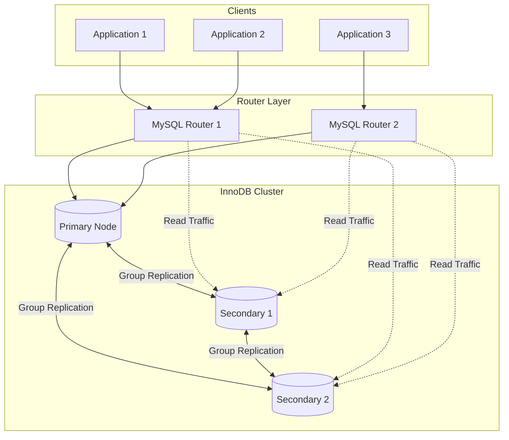
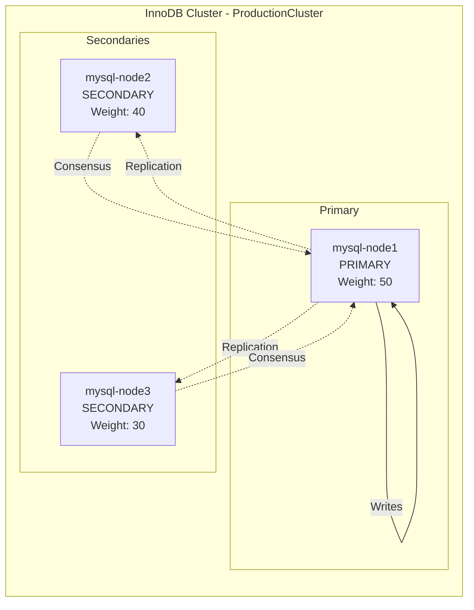
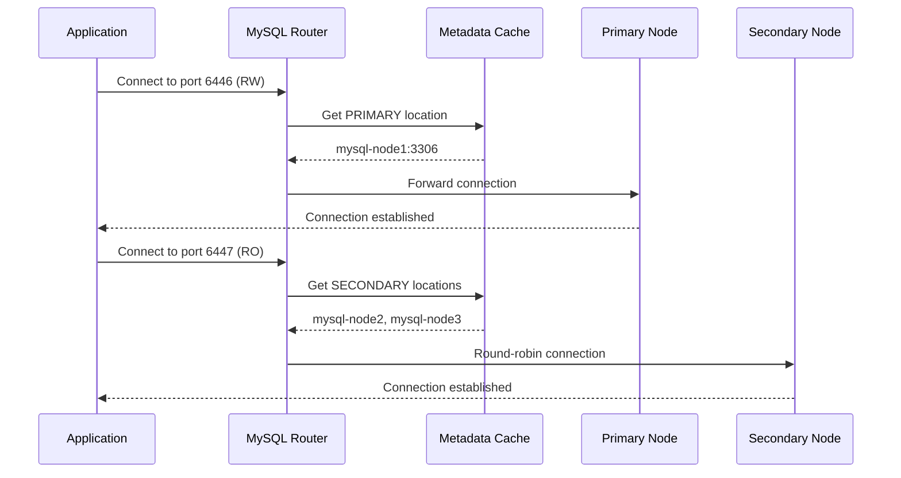
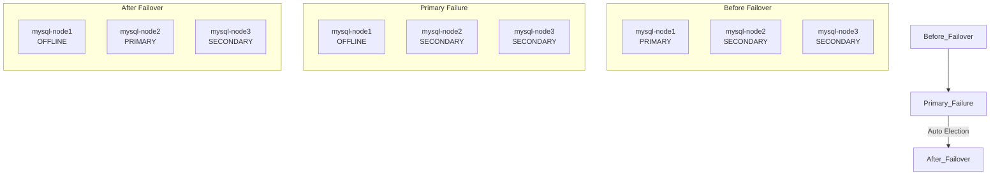

# How to Create MySQL InnoDB Cluster Management

Author: [nawazdhandala](https://github.com/nawazdhandala)

Tags: MySQL, InnoDB Cluster, High Availability, Group Replication

Description: Learn to implement InnoDB Cluster with MySQL Shell, group replication, and MySQL Router for automated high availability and failover.

---

MySQL InnoDB Cluster provides a complete high availability solution for MySQL databases. It combines three key technologies - Group Replication, MySQL Shell, and MySQL Router - to deliver automatic failover, data consistency, and seamless client routing without manual intervention.

## InnoDB Cluster Architecture



### Component Overview

| Component | Purpose | Port |
|-----------|---------|------|
| MySQL Server | Database storage with Group Replication | 3306 |
| MySQL Shell | Cluster administration and management | N/A |
| MySQL Router | Connection routing and load balancing | 6446 (RW), 6447 (RO) |
| Group Communication | Inter-node communication | 33061 |

## Prerequisites

Before creating an InnoDB Cluster, ensure your MySQL servers meet these requirements:

```sql
-- Check MySQL version (8.0.17+ recommended)
SELECT VERSION();

-- Verify InnoDB is the default storage engine
SHOW VARIABLES LIKE 'default_storage_engine';

-- Check GTID mode is enabled
SHOW VARIABLES LIKE 'gtid_mode';
SHOW VARIABLES LIKE 'enforce_gtid_consistency';
```

### Server Configuration

Configure each MySQL instance with the following settings in `/etc/mysql/mysql.conf.d/mysqld.cnf`:

```ini
[mysqld]
# Server identification
server_id=1  # Unique for each node (1, 2, 3...)
bind-address=0.0.0.0

# InnoDB Cluster requirements
disabled_storage_engines="MyISAM,BLACKHOLE,FEDERATED,ARCHIVE,MEMORY"

# GTID configuration
gtid_mode=ON
enforce_gtid_consistency=ON

# Binary logging
log_bin=mysql-bin
binlog_format=ROW
binlog_checksum=NONE

# Replication settings
relay_log=relay-bin
log_slave_updates=ON
master_info_repository=TABLE
relay_log_info_repository=TABLE

# Group Replication settings
plugin_load_add='group_replication.so'
group_replication_group_name="aaaaaaaa-bbbb-cccc-dddd-eeeeeeeeeeee"
group_replication_start_on_boot=OFF
group_replication_local_address="mysql-node1:33061"
group_replication_group_seeds="mysql-node1:33061,mysql-node2:33061,mysql-node3:33061"
group_replication_bootstrap_group=OFF

# Performance tuning
transaction_write_set_extraction=XXHASH64
```

## Creating the InnoDB Cluster

### Step 1 - Configure Instances with MySQL Shell

Connect to each MySQL instance and configure it for InnoDB Cluster:

```javascript
// Connect to MySQL Shell
mysqlsh

// Configure the first instance
dba.configureInstance('root@mysql-node1:3306', {
    clusterAdmin: 'clusteradmin',
    clusterAdminPassword: 'SecurePassword123!',
    interactive: false
});

// Output will show configuration changes made
// Configuring local MySQL instance listening at port 3306 for use in an InnoDB cluster...
// This instance reports its own address as mysql-node1:3306
// ...
// The instance 'mysql-node1:3306' is valid to be used in an InnoDB cluster.
```

Repeat for all nodes:

```javascript
// Configure remaining instances
dba.configureInstance('root@mysql-node2:3306', {
    clusterAdmin: 'clusteradmin',
    clusterAdminPassword: 'SecurePassword123!',
    interactive: false
});

dba.configureInstance('root@mysql-node3:3306', {
    clusterAdmin: 'clusteradmin',
    clusterAdminPassword: 'SecurePassword123!',
    interactive: false
});
```

### Step 2 - Create the Cluster

```javascript
// Connect to the first node
\connect clusteradmin@mysql-node1:3306

// Create the cluster
var cluster = dba.createCluster('ProductionCluster', {
    ipAllowlist: '192.168.1.0/24,10.0.0.0/8',
    memberWeight: 50,
    autoRejoinTries: 3,
    exitStateAction: 'READ_ONLY'
});

// Output:
// A new InnoDB cluster will be created on instance 'mysql-node1:3306'.
// ...
// Cluster successfully created. Use Cluster.addInstance() to add MySQL instances.
```

### Step 3 - Add Secondary Instances

```javascript
// Add second node
cluster.addInstance('clusteradmin@mysql-node2:3306', {
    recoveryMethod: 'clone',
    memberWeight: 40
});

// Add third node
cluster.addInstance('clusteradmin@mysql-node3:3306', {
    recoveryMethod: 'clone',
    memberWeight: 30
});

// Verify cluster status
cluster.status();
```

The `memberWeight` parameter influences primary election - higher weight means higher priority when selecting a new primary during failover.

## Cluster Topology Visualization



## Member Management

### Adding New Members

When scaling your cluster, use the `addInstance` command with appropriate recovery method:

```javascript
// Connect to the cluster
\connect clusteradmin@mysql-node1:3306
var cluster = dba.getCluster();

// Add new instance with clone recovery (recommended for large datasets)
cluster.addInstance('clusteradmin@mysql-node4:3306', {
    recoveryMethod: 'clone',
    memberWeight: 25,
    label: 'mysql-node4'
});

// Alternative: Use incremental recovery for small data differences
cluster.addInstance('clusteradmin@mysql-node4:3306', {
    recoveryMethod: 'incremental'
});
```

### Removing Members

```javascript
// Remove an instance from the cluster
cluster.removeInstance('clusteradmin@mysql-node4:3306', {
    force: false  // Set to true if instance is unreachable
});

// For unreachable instances
cluster.removeInstance('clusteradmin@mysql-node4:3306', {
    force: true
});
```

### Instance Operations

```javascript
// Rejoin an instance that left the cluster
cluster.rejoinInstance('clusteradmin@mysql-node2:3306');

// Set instance options
cluster.setInstanceOption('clusteradmin@mysql-node2:3306', 'memberWeight', 45);

// Rescan cluster for topology changes
cluster.rescan();
```

## MySQL Router Setup

MySQL Router provides automatic connection routing and load balancing. Deploy it on your application servers or as a dedicated service.

### Bootstrap Router

```bash
# Bootstrap MySQL Router with the cluster
mysqlrouter --bootstrap clusteradmin@mysql-node1:3306 \
    --user=mysqlrouter \
    --directory=/var/lib/mysqlrouter \
    --conf-use-sockets \
    --conf-use-gr-notifications

# Start MySQL Router
systemctl start mysqlrouter
systemctl enable mysqlrouter
```

### Router Configuration

The bootstrap process creates `/var/lib/mysqlrouter/mysqlrouter.conf`:

```ini
[routing:ProductionCluster_rw]
bind_address=0.0.0.0
bind_port=6446
destinations=metadata-cache://ProductionCluster/?role=PRIMARY
routing_strategy=first-available
protocol=classic

[routing:ProductionCluster_ro]
bind_address=0.0.0.0
bind_port=6447
destinations=metadata-cache://ProductionCluster/?role=SECONDARY
routing_strategy=round-robin-with-fallback
protocol=classic

[routing:ProductionCluster_x_rw]
bind_address=0.0.0.0
bind_port=6448
destinations=metadata-cache://ProductionCluster/?role=PRIMARY
routing_strategy=first-available
protocol=x

[routing:ProductionCluster_x_ro]
bind_address=0.0.0.0
bind_port=6449
destinations=metadata-cache://ProductionCluster/?role=SECONDARY
routing_strategy=round-robin-with-fallback
protocol=x
```

### Connection Flow



### Application Connection Strings

```python
# Python - Read/Write connection
import mysql.connector

# Write operations - connect to RW port
rw_connection = mysql.connector.connect(
    host='mysql-router-host',
    port=6446,
    user='app_user',
    password='app_password',
    database='myapp'
)

# Read operations - connect to RO port
ro_connection = mysql.connector.connect(
    host='mysql-router-host',
    port=6447,
    user='app_user',
    password='app_password',
    database='myapp'
)
```

```javascript
// Node.js connection
const mysql = require('mysql2/promise');

// Read/Write pool
const rwPool = mysql.createPool({
    host: 'mysql-router-host',
    port: 6446,
    user: 'app_user',
    password: 'app_password',
    database: 'myapp',
    waitForConnections: true,
    connectionLimit: 10
});

// Read-only pool
const roPool = mysql.createPool({
    host: 'mysql-router-host',
    port: 6447,
    user: 'app_user',
    password: 'app_password',
    database: 'myapp',
    waitForConnections: true,
    connectionLimit: 20
});
```

## Failover Scenarios

### Automatic Failover

InnoDB Cluster handles automatic failover when the primary node fails:



### Manual Primary Switchover

For planned maintenance, perform a controlled switchover:

```javascript
// Connect to the cluster
\connect clusteradmin@mysql-node1:3306
var cluster = dba.getCluster();

// Perform switchover to specific instance
cluster.setPrimaryInstance('clusteradmin@mysql-node2:3306');

// Output:
// Setting instance 'mysql-node2:3306' as the primary instance of cluster 'ProductionCluster'...
// Instance 'mysql-node1:3306' was switched from PRIMARY to SECONDARY.
// Instance 'mysql-node2:3306' was switched from SECONDARY to PRIMARY.
// The instance 'mysql-node2:3306' was successfully elected as primary.
```

### Handling Split-Brain Scenarios

```javascript
// Check for cluster quorum issues
cluster.status({extended: 1});

// Force quorum with remaining online members
cluster.forceQuorumUsingPartitionOf('clusteradmin@mysql-node2:3306');

// This makes mysql-node2 the new primary and removes unreachable members
```

## Recovery Procedures

### Recovering Failed Instances

```javascript
// Connect to the cluster
\connect clusteradmin@mysql-node1:3306
var cluster = dba.getCluster();

// Check cluster status
cluster.status();

// Rejoin recovered instance
cluster.rejoinInstance('clusteradmin@mysql-node3:3306', {
    recoveryMethod: 'auto'
});
```

### Full Cluster Recovery

If all instances fail, rebootstrap from the most recent data:

```javascript
// Connect to instance with most recent data
\connect clusteradmin@mysql-node1:3306

// Reboot cluster from complete outage
var cluster = dba.rebootClusterFromCompleteOutage('ProductionCluster', {
    primary: 'mysql-node1:3306',
    rejoinInstances: ['mysql-node2:3306', 'mysql-node3:3306']
});

// Verify recovery
cluster.status();
```

### Clone Recovery for Diverged Instances

When an instance has diverged significantly:

```javascript
// Remove the diverged instance
cluster.removeInstance('clusteradmin@mysql-node3:3306', {force: true});

// Re-add with clone recovery
cluster.addInstance('clusteradmin@mysql-node3:3306', {
    recoveryMethod: 'clone'
});
```

## Monitoring and Health Checks

### Cluster Status Commands

```javascript
// Basic status
cluster.status();

// Extended status with more details
cluster.status({extended: 1});

// Full status including recovery status
cluster.status({extended: 2});
```

### Status Output Interpretation

```json
{
    "clusterName": "ProductionCluster",
    "defaultReplicaSet": {
        "name": "default",
        "primary": "mysql-node1:3306",
        "ssl": "REQUIRED",
        "status": "OK",
        "statusText": "Cluster is ONLINE and can tolerate up to ONE failure.",
        "topology": {
            "mysql-node1:3306": {
                "address": "mysql-node1:3306",
                "memberRole": "PRIMARY",
                "mode": "R/W",
                "status": "ONLINE"
            },
            "mysql-node2:3306": {
                "address": "mysql-node2:3306",
                "memberRole": "SECONDARY",
                "mode": "R/O",
                "status": "ONLINE"
            },
            "mysql-node3:3306": {
                "address": "mysql-node3:3306",
                "memberRole": "SECONDARY",
                "mode": "R/O",
                "status": "ONLINE"
            }
        }
    }
}
```

### SQL-Based Monitoring

```sql
-- Check Group Replication member status
SELECT
    MEMBER_HOST,
    MEMBER_PORT,
    MEMBER_STATE,
    MEMBER_ROLE
FROM performance_schema.replication_group_members;

-- Check replication lag
SELECT
    CHANNEL_NAME,
    RECEIVED_TRANSACTION_SET,
    LAST_APPLIED_TRANSACTION_END_APPLY_TIMESTAMP
FROM performance_schema.replication_connection_status;

-- Monitor Group Replication statistics
SELECT * FROM performance_schema.replication_group_member_stats\G
```

### Prometheus Metrics

Create a monitoring script for Prometheus:

```bash
#!/bin/bash
# mysql_cluster_exporter.sh

MYSQL_USER="monitor"
MYSQL_PASS="monitor_password"
MYSQL_HOST="localhost"

# Get cluster member count
MEMBER_COUNT=$(mysql -u$MYSQL_USER -p$MYSQL_PASS -h$MYSQL_HOST -N -e \
    "SELECT COUNT(*) FROM performance_schema.replication_group_members WHERE MEMBER_STATE='ONLINE'")

# Get replication lag in seconds
REPLICATION_LAG=$(mysql -u$MYSQL_USER -p$MYSQL_PASS -h$MYSQL_HOST -N -e \
    "SELECT TIMESTAMPDIFF(SECOND, LAST_APPLIED_TRANSACTION_END_APPLY_TIMESTAMP, NOW())
     FROM performance_schema.replication_connection_status
     WHERE CHANNEL_NAME='group_replication_applier'" 2>/dev/null || echo 0)

# Output in Prometheus format
echo "# HELP mysql_cluster_online_members Number of online cluster members"
echo "# TYPE mysql_cluster_online_members gauge"
echo "mysql_cluster_online_members $MEMBER_COUNT"

echo "# HELP mysql_cluster_replication_lag_seconds Replication lag in seconds"
echo "# TYPE mysql_cluster_replication_lag_seconds gauge"
echo "mysql_cluster_replication_lag_seconds $REPLICATION_LAG"
```

### Alerting Rules

```yaml
# Prometheus alerting rules for InnoDB Cluster
groups:
  - name: mysql_innodb_cluster
    rules:
      - alert: MySQLClusterMemberDown
        expr: mysql_cluster_online_members < 3
        for: 1m
        labels:
          severity: critical
        annotations:
          summary: "MySQL InnoDB Cluster member is down"
          description: "Only {{ $value }} members are online. Expected 3."

      - alert: MySQLClusterReplicationLag
        expr: mysql_cluster_replication_lag_seconds > 30
        for: 2m
        labels:
          severity: warning
        annotations:
          summary: "MySQL replication lag detected"
          description: "Replication lag is {{ $value }} seconds."

      - alert: MySQLClusterNoQuorum
        expr: mysql_cluster_online_members < 2
        for: 30s
        labels:
          severity: critical
        annotations:
          summary: "MySQL InnoDB Cluster lost quorum"
          description: "Cluster has lost quorum with only {{ $value }} members online."
```

## Cluster Configuration Options

### Setting Cluster-Wide Options

```javascript
// Connect to the cluster
\connect clusteradmin@mysql-node1:3306
var cluster = dba.getCluster();

// Set cluster options
cluster.setOption('expelTimeout', 60);
cluster.setOption('consistency', 'BEFORE_ON_PRIMARY_FAILOVER');
cluster.setOption('exitStateAction', 'READ_ONLY');

// View current options
cluster.options();
```

### Key Configuration Parameters

| Option | Description | Recommended Value |
|--------|-------------|-------------------|
| `expelTimeout` | Seconds before expelling unresponsive members | 60 |
| `consistency` | Transaction consistency level | BEFORE_ON_PRIMARY_FAILOVER |
| `exitStateAction` | Action when member is expelled | READ_ONLY |
| `autoRejoinTries` | Automatic rejoin attempts | 3 |
| `memberWeight` | Priority for primary election | 50 (primary), 30-40 (secondary) |

## Security Best Practices

### SSL/TLS Configuration

```javascript
// Create cluster with SSL requirement
var cluster = dba.createCluster('SecureCluster', {
    memberSslMode: 'REQUIRED',
    ipAllowlist: '10.0.0.0/8'
});

// Verify SSL status
cluster.status({extended: 1});
```

### User Management

```sql
-- Create application user with limited privileges
CREATE USER 'app_user'@'%' IDENTIFIED BY 'secure_password';
GRANT SELECT, INSERT, UPDATE, DELETE ON myapp.* TO 'app_user'@'%';

-- Create monitoring user
CREATE USER 'monitor'@'localhost' IDENTIFIED BY 'monitor_password';
GRANT REPLICATION CLIENT, PROCESS ON *.* TO 'monitor'@'localhost';
GRANT SELECT ON performance_schema.* TO 'monitor'@'localhost';

-- Create backup user
CREATE USER 'backup'@'localhost' IDENTIFIED BY 'backup_password';
GRANT SELECT, RELOAD, LOCK TABLES, REPLICATION CLIENT, SHOW VIEW, EVENT, TRIGGER ON *.* TO 'backup'@'localhost';
```

## Backup and Restore

### MySQL Enterprise Backup

```bash
# Full backup from secondary to avoid impacting primary
mysqlbackup --user=backup --password=backup_password \
    --host=mysql-node2 --port=3306 \
    --backup-dir=/backup/full \
    --compress \
    backup-and-apply-log

# Restore to new instance
mysqlbackup --defaults-file=/backup/full/backup-my.cnf \
    --backup-dir=/backup/full \
    --datadir=/var/lib/mysql \
    copy-back
```

### mysqldump for Logical Backups

```bash
# Consistent backup using single-transaction
mysqldump --single-transaction --routines --triggers \
    --all-databases --source-data=2 \
    -h mysql-router-host -P 6447 \
    -u backup -p > /backup/full_backup.sql
```

## Troubleshooting

### Common Issues and Solutions

**Issue: Instance cannot join cluster**

```javascript
// Check instance configuration
dba.checkInstanceConfiguration('clusteradmin@mysql-node4:3306');

// Apply necessary fixes
dba.configureInstance('clusteradmin@mysql-node4:3306');
```

**Issue: Cluster shows NO_QUORUM status**

```javascript
// Force quorum with available members
cluster.forceQuorumUsingPartitionOf('clusteradmin@mysql-node1:3306');
```

**Issue: Router cannot connect to cluster**

```bash
# Check router status
mysqlrouter --version

# Verify cluster metadata
mysql -u clusteradmin -p -h mysql-node1 -e \
    "SELECT * FROM mysql_innodb_cluster_metadata.clusters"

# Re-bootstrap router if needed
mysqlrouter --bootstrap clusteradmin@mysql-node1:3306 --force
```

### Diagnostic Queries

```sql
-- Check for blocked transactions
SELECT * FROM performance_schema.replication_group_member_stats
WHERE COUNT_TRANSACTIONS_IN_QUEUE > 0\G

-- View Group Replication message statistics
SELECT * FROM performance_schema.replication_group_communication_information\G

-- Check for certification conflicts
SELECT COUNT_TRANSACTIONS_CHECKED, COUNT_CONFLICTS_DETECTED
FROM performance_schema.replication_group_member_stats
WHERE MEMBER_ID = @@server_uuid;
```

---

MySQL InnoDB Cluster provides enterprise-grade high availability without complex setup or expensive add-ons. The combination of Group Replication for data consistency, MySQL Shell for simplified administration, and MySQL Router for transparent failover makes it a complete solution for mission-critical MySQL deployments. Start with a three-node cluster, configure MySQL Router on your application tier, and you have automatic failover that requires no manual intervention during failures.
