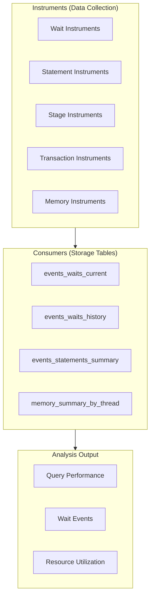
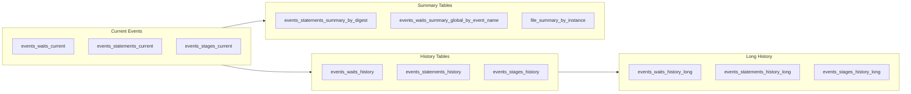
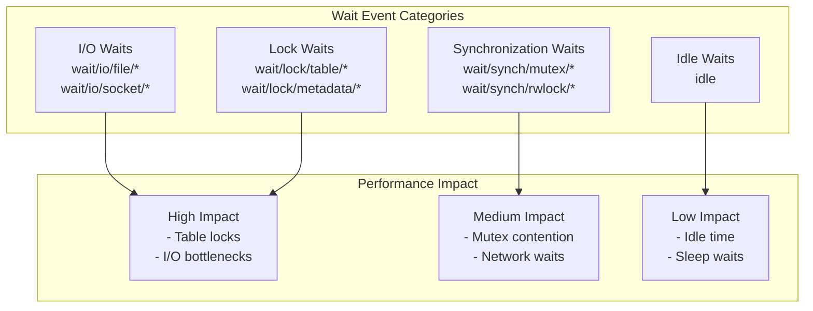
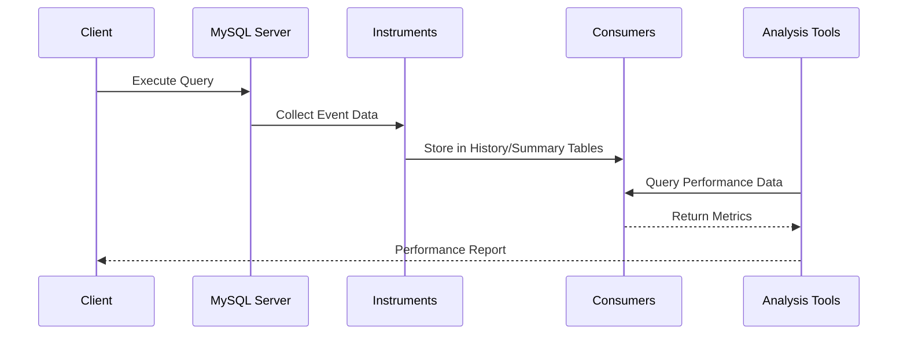
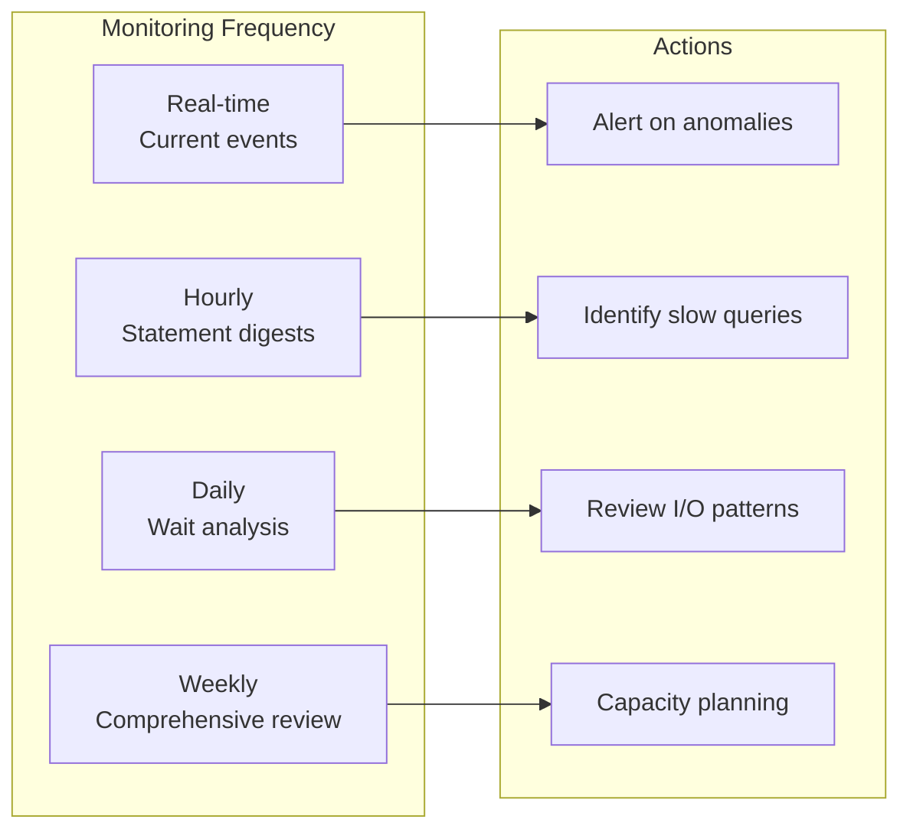

# How to Implement MySQL Performance Schema Analysis

Author: [nawazdhandala](https://github.com/nawazdhandala)

Tags: MySQL, Performance Schema, Performance Tuning, Monitoring

Description: Learn to analyze MySQL Performance Schema for query performance, wait events, and resource utilization with practical analysis queries.

---

MySQL Performance Schema is a powerful feature that provides detailed instrumentation for monitoring server execution at a low level. This guide will walk you through implementing comprehensive performance analysis using Performance Schema to identify bottlenecks, optimize queries, and improve overall database performance.

## Understanding Performance Schema Architecture

Performance Schema collects data about server events through instruments and stores it in consumers (tables). Understanding this architecture is essential for effective performance analysis.



## Enabling and Configuring Instrumentation

### Check Current Instrumentation Status

First, verify which instruments are currently enabled in your MySQL instance:

```sql
-- View all available instruments and their status
SELECT NAME, ENABLED, TIMED
FROM performance_schema.setup_instruments
WHERE NAME LIKE 'statement/%'
   OR NAME LIKE 'wait/%'
LIMIT 20;
```

This query returns the instrument name, whether it is enabled, and whether timing data is being collected.

### Enable Statement Instrumentation

Statement instruments capture information about SQL statements executed by the server:

```sql
-- Enable all statement instruments
UPDATE performance_schema.setup_instruments
SET ENABLED = 'YES', TIMED = 'YES'
WHERE NAME LIKE 'statement/%';

-- Verify the changes
SELECT NAME, ENABLED, TIMED
FROM performance_schema.setup_instruments
WHERE NAME LIKE 'statement/%'
  AND ENABLED = 'YES';
```

### Enable Wait Instrumentation

Wait instruments track time spent waiting for various resources:

```sql
-- Enable wait instruments for I/O and locks
UPDATE performance_schema.setup_instruments
SET ENABLED = 'YES', TIMED = 'YES'
WHERE NAME LIKE 'wait/io/%'
   OR NAME LIKE 'wait/lock/%'
   OR NAME LIKE 'wait/synch/%';
```

### Configure Consumers

Consumers are the destination tables where instrumented data is stored:

```sql
-- Enable statement and wait consumers
UPDATE performance_schema.setup_consumers
SET ENABLED = 'YES'
WHERE NAME LIKE 'events_statements%'
   OR NAME LIKE 'events_waits%'
   OR NAME LIKE 'events_stages%';

-- View enabled consumers
SELECT NAME, ENABLED
FROM performance_schema.setup_consumers
WHERE ENABLED = 'YES';
```

## Consumer Tables Overview



## Statement Analysis Queries

### Finding Slow Queries by Digest

The statement digest tables aggregate statistics for normalized SQL statements:

```sql
-- Top 10 queries by total execution time
SELECT
    DIGEST_TEXT AS query_pattern,
    COUNT_STAR AS execution_count,
    ROUND(SUM_TIMER_WAIT / 1000000000000, 4) AS total_time_sec,
    ROUND(AVG_TIMER_WAIT / 1000000000000, 4) AS avg_time_sec,
    ROUND(MAX_TIMER_WAIT / 1000000000000, 4) AS max_time_sec,
    SUM_ROWS_EXAMINED AS rows_examined,
    SUM_ROWS_SENT AS rows_sent,
    ROUND(SUM_ROWS_EXAMINED / NULLIF(SUM_ROWS_SENT, 0), 2) AS exam_to_sent_ratio
FROM performance_schema.events_statements_summary_by_digest
WHERE DIGEST_TEXT IS NOT NULL
ORDER BY SUM_TIMER_WAIT DESC
LIMIT 10;
```

The `exam_to_sent_ratio` column shows how many rows were examined for each row returned - a high ratio indicates inefficient queries that may benefit from better indexes.

### Identifying Full Table Scans

```sql
-- Queries performing full table scans
SELECT
    DIGEST_TEXT AS query_pattern,
    COUNT_STAR AS exec_count,
    SUM_NO_INDEX_USED AS no_index_count,
    SUM_NO_GOOD_INDEX_USED AS bad_index_count,
    ROUND(SUM_TIMER_WAIT / 1000000000000, 4) AS total_time_sec,
    SUM_ROWS_EXAMINED AS total_rows_examined
FROM performance_schema.events_statements_summary_by_digest
WHERE (SUM_NO_INDEX_USED > 0 OR SUM_NO_GOOD_INDEX_USED > 0)
  AND DIGEST_TEXT IS NOT NULL
ORDER BY SUM_NO_INDEX_USED DESC
LIMIT 10;
```

### Analyzing Query Errors

```sql
-- Queries with errors or warnings
SELECT
    DIGEST_TEXT AS query_pattern,
    COUNT_STAR AS exec_count,
    SUM_ERRORS AS error_count,
    SUM_WARNINGS AS warning_count,
    ROUND(SUM_ERRORS / COUNT_STAR * 100, 2) AS error_percentage
FROM performance_schema.events_statements_summary_by_digest
WHERE SUM_ERRORS > 0 OR SUM_WARNINGS > 0
ORDER BY SUM_ERRORS DESC
LIMIT 10;
```

## Wait Event Analysis

### Understanding Wait Event Categories



### Top Wait Events Analysis

```sql
-- Top wait events by total wait time
SELECT
    EVENT_NAME AS wait_event,
    COUNT_STAR AS occurrence_count,
    ROUND(SUM_TIMER_WAIT / 1000000000000, 4) AS total_wait_sec,
    ROUND(AVG_TIMER_WAIT / 1000000000, 4) AS avg_wait_ms,
    ROUND(MAX_TIMER_WAIT / 1000000000, 4) AS max_wait_ms
FROM performance_schema.events_waits_summary_global_by_event_name
WHERE EVENT_NAME NOT LIKE 'idle'
  AND COUNT_STAR > 0
ORDER BY SUM_TIMER_WAIT DESC
LIMIT 15;
```

### File I/O Analysis

```sql
-- File I/O statistics by file type
SELECT
    SUBSTRING_INDEX(EVENT_NAME, '/', -1) AS io_type,
    COUNT_STAR AS operations,
    ROUND(SUM_TIMER_WAIT / 1000000000000, 4) AS total_time_sec,
    ROUND(SUM_NUMBER_OF_BYTES_READ / 1024 / 1024, 2) AS read_mb,
    ROUND(SUM_NUMBER_OF_BYTES_WRITE / 1024 / 1024, 2) AS write_mb
FROM performance_schema.events_waits_summary_global_by_event_name
WHERE EVENT_NAME LIKE 'wait/io/file/%'
  AND COUNT_STAR > 0
GROUP BY SUBSTRING_INDEX(EVENT_NAME, '/', -1)
ORDER BY SUM_TIMER_WAIT DESC;
```

### Table Lock Analysis

```sql
-- Table lock wait analysis
SELECT
    OBJECT_SCHEMA AS database_name,
    OBJECT_NAME AS table_name,
    COUNT_STAR AS lock_count,
    ROUND(SUM_TIMER_WAIT / 1000000000000, 4) AS total_lock_time_sec,
    ROUND(AVG_TIMER_WAIT / 1000000000, 4) AS avg_lock_time_ms
FROM performance_schema.table_lock_waits_summary_by_table
WHERE COUNT_STAR > 0
ORDER BY SUM_TIMER_WAIT DESC
LIMIT 10;
```

## Memory Usage Analysis

### Memory Consumption by Thread

```sql
-- Memory usage by thread/connection
SELECT
    t.THREAD_ID,
    t.PROCESSLIST_USER AS user,
    t.PROCESSLIST_HOST AS host,
    t.PROCESSLIST_DB AS database_name,
    ROUND(SUM(m.CURRENT_NUMBER_OF_BYTES_USED) / 1024 / 1024, 2) AS current_mb,
    ROUND(SUM(m.HIGH_NUMBER_OF_BYTES_USED) / 1024 / 1024, 2) AS peak_mb
FROM performance_schema.memory_summary_by_thread_by_event_name m
JOIN performance_schema.threads t ON m.THREAD_ID = t.THREAD_ID
WHERE t.PROCESSLIST_USER IS NOT NULL
GROUP BY t.THREAD_ID, t.PROCESSLIST_USER, t.PROCESSLIST_HOST, t.PROCESSLIST_DB
ORDER BY SUM(m.CURRENT_NUMBER_OF_BYTES_USED) DESC
LIMIT 10;
```

### Memory Usage by Event Type

```sql
-- Top memory consumers by event type
SELECT
    EVENT_NAME AS memory_event,
    CURRENT_COUNT_USED AS current_allocations,
    ROUND(CURRENT_NUMBER_OF_BYTES_USED / 1024 / 1024, 2) AS current_mb,
    ROUND(HIGH_NUMBER_OF_BYTES_USED / 1024 / 1024, 2) AS peak_mb
FROM performance_schema.memory_summary_global_by_event_name
WHERE CURRENT_NUMBER_OF_BYTES_USED > 0
ORDER BY CURRENT_NUMBER_OF_BYTES_USED DESC
LIMIT 15;
```

## Stage Analysis

Stages represent the steps within statement execution:

```sql
-- Stage timing analysis
SELECT
    EVENT_NAME AS stage_name,
    COUNT_STAR AS occurrence_count,
    ROUND(SUM_TIMER_WAIT / 1000000000000, 4) AS total_time_sec,
    ROUND(AVG_TIMER_WAIT / 1000000000, 4) AS avg_time_ms
FROM performance_schema.events_stages_summary_global_by_event_name
WHERE COUNT_STAR > 0
ORDER BY SUM_TIMER_WAIT DESC
LIMIT 10;
```

## Creating a Performance Analysis Dashboard

### Comprehensive Performance Summary Query

```sql
-- Combined performance metrics summary
SELECT 'Statement Metrics' AS category,
       COUNT(*) AS metric_count,
       ROUND(SUM(SUM_TIMER_WAIT) / 1000000000000, 2) AS total_time_sec
FROM performance_schema.events_statements_summary_by_digest
WHERE DIGEST_TEXT IS NOT NULL

UNION ALL

SELECT 'Wait Events' AS category,
       COUNT(*) AS metric_count,
       ROUND(SUM(SUM_TIMER_WAIT) / 1000000000000, 2) AS total_time_sec
FROM performance_schema.events_waits_summary_global_by_event_name
WHERE EVENT_NAME NOT LIKE 'idle'

UNION ALL

SELECT 'Active Connections' AS category,
       COUNT(*) AS metric_count,
       NULL AS total_time_sec
FROM performance_schema.threads
WHERE PROCESSLIST_USER IS NOT NULL;
```

## Performance Schema Data Flow



## Resetting Performance Schema Statistics

After making optimizations, reset statistics to measure improvements:

```sql
-- Reset statement statistics
TRUNCATE TABLE performance_schema.events_statements_summary_by_digest;

-- Reset wait event statistics
TRUNCATE TABLE performance_schema.events_waits_summary_global_by_event_name;

-- Reset file I/O statistics
TRUNCATE TABLE performance_schema.file_summary_by_instance;

-- Reset table statistics
TRUNCATE TABLE performance_schema.table_io_waits_summary_by_table;
```

## Best Practices for Performance Schema Analysis

### 1. Enable Only Required Instruments

Enabling all instruments can add overhead. Enable only what you need:

```sql
-- Disable instruments you don't need
UPDATE performance_schema.setup_instruments
SET ENABLED = 'NO'
WHERE NAME LIKE 'memory/%'
  AND NAME NOT LIKE 'memory/innodb/%';
```

### 2. Configure History Table Sizes

Adjust history table sizes based on your monitoring needs:

```sql
-- Check current history table sizes
SHOW VARIABLES LIKE 'performance_schema%history%size';

-- These are set at server startup in my.cnf:
-- performance_schema_events_statements_history_size = 20
-- performance_schema_events_statements_history_long_size = 10000
```

### 3. Regular Monitoring Schedule



## Automating Performance Analysis

Create a stored procedure for regular analysis:

```sql
DELIMITER //

CREATE PROCEDURE analyze_performance_summary()
BEGIN
    -- Top slow queries
    SELECT 'TOP SLOW QUERIES' AS report_section;
    SELECT
        LEFT(DIGEST_TEXT, 100) AS query_preview,
        COUNT_STAR AS exec_count,
        ROUND(AVG_TIMER_WAIT / 1000000000, 2) AS avg_ms
    FROM performance_schema.events_statements_summary_by_digest
    WHERE DIGEST_TEXT IS NOT NULL
    ORDER BY AVG_TIMER_WAIT DESC
    LIMIT 5;

    -- Top wait events
    SELECT 'TOP WAIT EVENTS' AS report_section;
    SELECT
        EVENT_NAME,
        COUNT_STAR AS occurrences,
        ROUND(SUM_TIMER_WAIT / 1000000000000, 4) AS total_sec
    FROM performance_schema.events_waits_summary_global_by_event_name
    WHERE EVENT_NAME NOT LIKE 'idle'
      AND COUNT_STAR > 0
    ORDER BY SUM_TIMER_WAIT DESC
    LIMIT 5;

    -- Connection summary
    SELECT 'CONNECTION SUMMARY' AS report_section;
    SELECT
        PROCESSLIST_USER AS user,
        COUNT(*) AS connection_count
    FROM performance_schema.threads
    WHERE PROCESSLIST_USER IS NOT NULL
    GROUP BY PROCESSLIST_USER;
END //

DELIMITER ;

-- Execute the analysis
CALL analyze_performance_summary();
```

## Conclusion

MySQL Performance Schema provides invaluable insights into database performance. By properly configuring instruments and consumers, and using targeted analysis queries, you can identify bottlenecks, optimize queries, and ensure your database runs efficiently. Regular monitoring using the techniques described in this guide will help maintain optimal database performance over time.

Key takeaways:

- Enable only the instruments you need to minimize overhead
- Use statement digest tables to identify problematic query patterns
- Monitor wait events to find resource contention issues
- Regularly reset statistics after making optimizations to measure improvements
- Automate performance analysis with stored procedures for consistent monitoring
