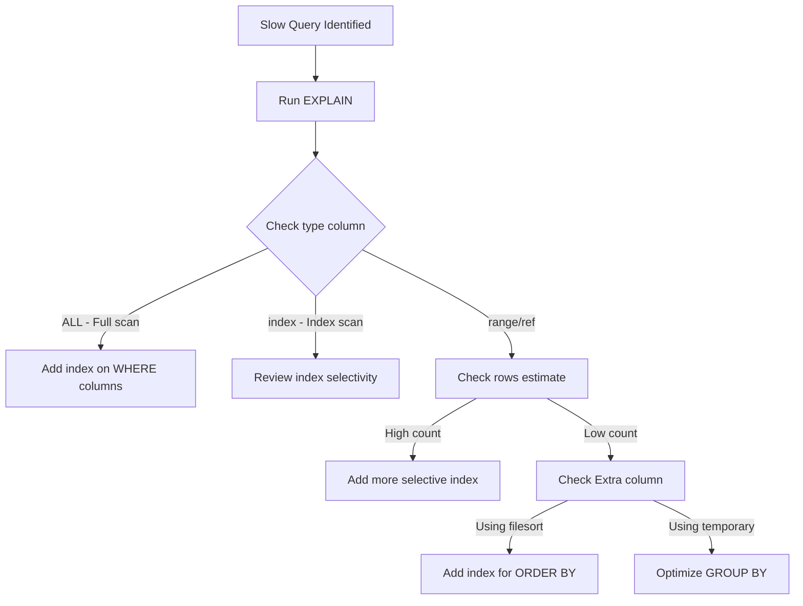
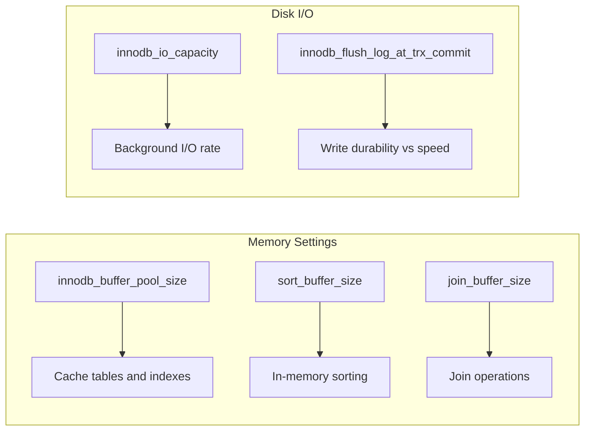
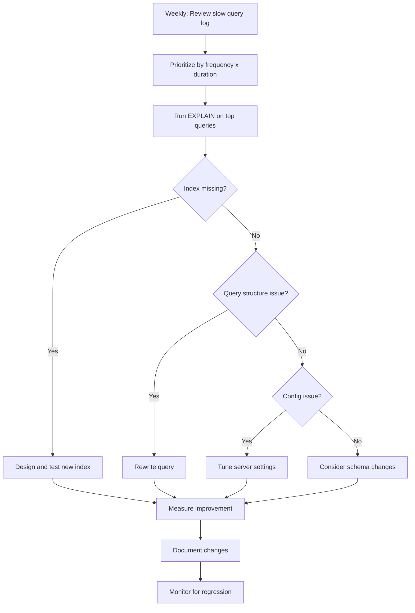

# How to Build MySQL Query Optimization Strategies

Author: [nawazdhandala](https://www.github.com/nawazdhandala)

Tags: MySQL, Database, Performance, SQL, Query Optimization

Description: Master MySQL query optimization with EXPLAIN analysis, index strategies, query rewriting, and configuration tuning for high-performance databases.

---

Database performance can make or break an application. When your MySQL queries start taking seconds instead of milliseconds, users notice. Building a solid query optimization strategy is not about applying random fixes. It requires a systematic approach to identifying bottlenecks, understanding how MySQL executes queries, and applying targeted improvements.

This guide walks you through building a complete optimization strategy that you can apply to any MySQL database.

## Start with Measurement

Before optimizing anything, you need to know what is slow. Flying blind leads to wasted effort on queries that do not matter. MySQL provides several tools for identifying performance problems.

### Enabling the Slow Query Log

The slow query log captures all queries that exceed a specified execution time.

```sql
-- Enable the slow query log to capture problematic queries
-- These settings can also be added to my.cnf for persistence
SET GLOBAL slow_query_log = 'ON';

-- Set threshold to 1 second (adjust based on your requirements)
SET GLOBAL long_query_time = 1;

-- Capture queries that are not using indexes
-- This helps identify missing indexes early
SET GLOBAL log_queries_not_using_indexes = 'ON';

-- Check where logs are being written
SHOW VARIABLES LIKE 'slow_query_log_file';
```

### Using Performance Schema

Performance Schema provides detailed insights into query execution statistics.

```sql
-- Find the top 10 queries by total execution time
-- This shows which queries consume the most resources overall
SELECT
    DIGEST_TEXT,
    COUNT_STAR AS exec_count,
    ROUND(SUM_TIMER_WAIT / 1000000000000, 2) AS total_time_sec,
    ROUND(AVG_TIMER_WAIT / 1000000000000, 4) AS avg_time_sec,
    SUM_ROWS_EXAMINED AS rows_examined
FROM performance_schema.events_statements_summary_by_digest
ORDER BY SUM_TIMER_WAIT DESC
LIMIT 10;
```

## Understanding Query Execution with EXPLAIN

Once you identify a slow query, EXPLAIN reveals how MySQL plans to execute it. This information guides your optimization decisions.



### Reading EXPLAIN Output

Here is how to interpret the most important columns in EXPLAIN results.

```sql
-- Analyze a typical query with EXPLAIN
-- FORMAT=JSON provides cost estimates and additional details
EXPLAIN FORMAT=JSON
SELECT c.customer_name, o.order_date, SUM(oi.quantity * oi.price) as total
FROM customers c
JOIN orders o ON c.customer_id = o.customer_id
JOIN order_items oi ON o.order_id = oi.order_id
WHERE o.order_date >= '2025-01-01'
GROUP BY c.customer_id, o.order_id
ORDER BY total DESC
LIMIT 20;
```

The key things to look for:

| Column | What It Tells You | Action If Poor |
|--------|-------------------|----------------|
| type | Access method (ALL is worst, const is best) | Add indexes |
| rows | Estimated rows to examine | Improve WHERE filters |
| filtered | Percentage of rows surviving WHERE | Better index or query rewrite |
| Extra | Additional operations like filesort | Index changes or query restructure |

## Building an Indexing Strategy

Indexes are the foundation of query optimization. A good indexing strategy considers query patterns, data distribution, and write overhead.

### Composite Index Design

The order of columns in a composite index determines which queries can use it.

```sql
-- Create a composite index that supports multiple query patterns
-- Column order matters: put equality columns first, then range columns
CREATE INDEX idx_orders_customer_status_date
ON orders(customer_id, status, order_date);

-- This query uses all three columns in the index
SELECT * FROM orders
WHERE customer_id = 1234
AND status = 'shipped'
AND order_date >= '2025-06-01';

-- This query uses customer_id and status only
SELECT * FROM orders
WHERE customer_id = 1234
AND status = 'pending';

-- This query uses only customer_id
SELECT * FROM orders
WHERE customer_id = 1234
AND order_date >= '2025-06-01';
-- Note: status is skipped, so order_date cannot use the index efficiently
```

### Covering Indexes for Read-Heavy Queries

A covering index includes all columns a query needs, eliminating table lookups entirely.

```sql
-- Create a covering index for a reporting query
-- Include all columns in SELECT, WHERE, and ORDER BY
CREATE INDEX idx_orders_report_covering
ON orders(status, order_date, customer_id, total_amount);

-- This query is fully satisfied by the index
-- EXPLAIN will show "Using index" in Extra column
SELECT customer_id, order_date, total_amount
FROM orders
WHERE status = 'completed'
AND order_date BETWEEN '2025-01-01' AND '2025-12-31'
ORDER BY order_date DESC;
```

### Index Analysis Queries

Periodically review your indexes to find unused or duplicate indexes.

```sql
-- Find indexes that have never been used
-- Be careful: low usage might mean important but rare queries
SELECT
    s.TABLE_SCHEMA,
    s.TABLE_NAME,
    s.INDEX_NAME,
    s.COLUMN_NAME,
    t.TABLE_ROWS
FROM information_schema.STATISTICS s
JOIN information_schema.TABLES t
    ON s.TABLE_SCHEMA = t.TABLE_SCHEMA
    AND s.TABLE_NAME = t.TABLE_NAME
LEFT JOIN performance_schema.table_io_waits_summary_by_index_usage u
    ON s.TABLE_SCHEMA = u.OBJECT_SCHEMA
    AND s.TABLE_NAME = u.OBJECT_NAME
    AND s.INDEX_NAME = u.INDEX_NAME
WHERE u.INDEX_NAME IS NULL
AND s.TABLE_SCHEMA NOT IN ('mysql', 'performance_schema', 'sys')
AND s.INDEX_NAME != 'PRIMARY';
```

## Query Rewriting Patterns

Sometimes the query itself needs restructuring for better performance.

### Replacing Subqueries with JOINs

Correlated subqueries often perform poorly because MySQL may execute them once per row.

```sql
-- Slow: Correlated subquery executes for each customer row
SELECT customer_name,
    (SELECT COUNT(*) FROM orders o WHERE o.customer_id = c.customer_id) as order_count
FROM customers c
WHERE country = 'USA';

-- Faster: JOIN with aggregation
-- MySQL can optimize this as a single pass through the data
SELECT c.customer_name, COALESCE(order_counts.cnt, 0) as order_count
FROM customers c
LEFT JOIN (
    SELECT customer_id, COUNT(*) as cnt
    FROM orders
    GROUP BY customer_id
) order_counts ON c.customer_id = order_counts.customer_id
WHERE c.country = 'USA';
```

### Optimizing Pagination

Standard OFFSET pagination becomes slow with large offsets.

```sql
-- Problem: MySQL must scan and discard 100000 rows
SELECT * FROM products
ORDER BY created_at DESC
LIMIT 20 OFFSET 100000;

-- Solution: Keyset pagination using the last seen value
-- Requires passing the last created_at from the previous page
SELECT * FROM products
WHERE created_at < '2025-06-15 10:30:00'
ORDER BY created_at DESC
LIMIT 20;

-- For unique ordering, combine with primary key
SELECT * FROM products
WHERE (created_at, product_id) < ('2025-06-15 10:30:00', 45678)
ORDER BY created_at DESC, product_id DESC
LIMIT 20;
```

## Configuration Tuning

Server configuration affects query performance across the board.



### Buffer Pool Sizing

The InnoDB buffer pool should hold your active working set in memory.

```sql
-- Check current buffer pool configuration and hit rate
SELECT
    @@innodb_buffer_pool_size / 1024 / 1024 / 1024 as buffer_pool_gb,
    (SELECT VARIABLE_VALUE FROM performance_schema.global_status
     WHERE VARIABLE_NAME = 'Innodb_buffer_pool_read_requests') as read_requests,
    (SELECT VARIABLE_VALUE FROM performance_schema.global_status
     WHERE VARIABLE_NAME = 'Innodb_buffer_pool_reads') as disk_reads;

-- Calculate hit ratio (should be > 99% for good performance)
-- A low hit ratio means the buffer pool is too small
SELECT
    ROUND((1 - disk_reads / read_requests) * 100, 2) as hit_ratio_percent
FROM (
    SELECT
        (SELECT VARIABLE_VALUE FROM performance_schema.global_status
         WHERE VARIABLE_NAME = 'Innodb_buffer_pool_read_requests') as read_requests,
        (SELECT VARIABLE_VALUE FROM performance_schema.global_status
         WHERE VARIABLE_NAME = 'Innodb_buffer_pool_reads') as disk_reads
) stats;
```

## Building Your Optimization Workflow

A systematic approach ensures consistent results. Here is a workflow you can follow:



### Tracking Improvements

Keep records of your optimizations to learn what works and avoid regressions.

```sql
-- Create a table to track query optimization history
CREATE TABLE query_optimization_log (
    id INT AUTO_INCREMENT PRIMARY KEY,
    query_digest VARCHAR(64),
    query_text TEXT,
    optimization_date DATE,
    before_avg_time_ms DECIMAL(10,2),
    after_avg_time_ms DECIMAL(10,2),
    change_description TEXT,
    created_at TIMESTAMP DEFAULT CURRENT_TIMESTAMP
);

-- Log each optimization with before/after metrics
INSERT INTO query_optimization_log
    (query_digest, query_text, optimization_date,
     before_avg_time_ms, after_avg_time_ms, change_description)
VALUES
    ('abc123...', 'SELECT ... FROM orders ...', '2025-07-15',
     2500.00, 45.00, 'Added composite index on (customer_id, status, order_date)');
```

## Common Pitfalls to Avoid

A few patterns consistently cause performance problems.

### Functions on Indexed Columns

Applying functions to columns in WHERE clauses prevents index usage.

```sql
-- Bad: YEAR() function prevents index on order_date
SELECT * FROM orders WHERE YEAR(order_date) = 2025;

-- Good: Range condition can use the index
SELECT * FROM orders
WHERE order_date >= '2025-01-01'
AND order_date < '2026-01-01';
```

### Implicit Type Conversion

Mismatched types can cause full scans even with indexes present.

```sql
-- If customer_id is INT, this string comparison may prevent index use
SELECT * FROM orders WHERE customer_id = '12345';

-- Match the column type
SELECT * FROM orders WHERE customer_id = 12345;
```

### Over-Indexing

Too many indexes slow down writes and waste storage. Every INSERT, UPDATE, and DELETE must maintain all indexes.

```sql
-- Check index sizes to identify potential bloat
SELECT
    TABLE_NAME,
    INDEX_NAME,
    ROUND(STAT_VALUE * @@innodb_page_size / 1024 / 1024, 2) as size_mb
FROM mysql.innodb_index_stats
WHERE stat_name = 'size'
AND database_name = 'your_database'
ORDER BY STAT_VALUE DESC
LIMIT 20;
```

## Summary

Building an effective MySQL query optimization strategy requires:

1. Measurement first: Use slow query logs and Performance Schema to identify actual bottlenecks
2. Understanding execution: Learn to read EXPLAIN output to diagnose problems
3. Strategic indexing: Design indexes that match your query patterns without over-indexing
4. Query refinement: Rewrite problematic patterns like correlated subqueries and inefficient pagination
5. Configuration tuning: Size your buffer pool and other settings for your workload
6. Continuous monitoring: Track changes and watch for regressions

Start with the queries that hurt most. Often 80% of performance problems come from just a handful of queries. Fix those first, measure the improvement, then move to the next tier. Building this habit turns database optimization from a crisis response into routine maintenance.
