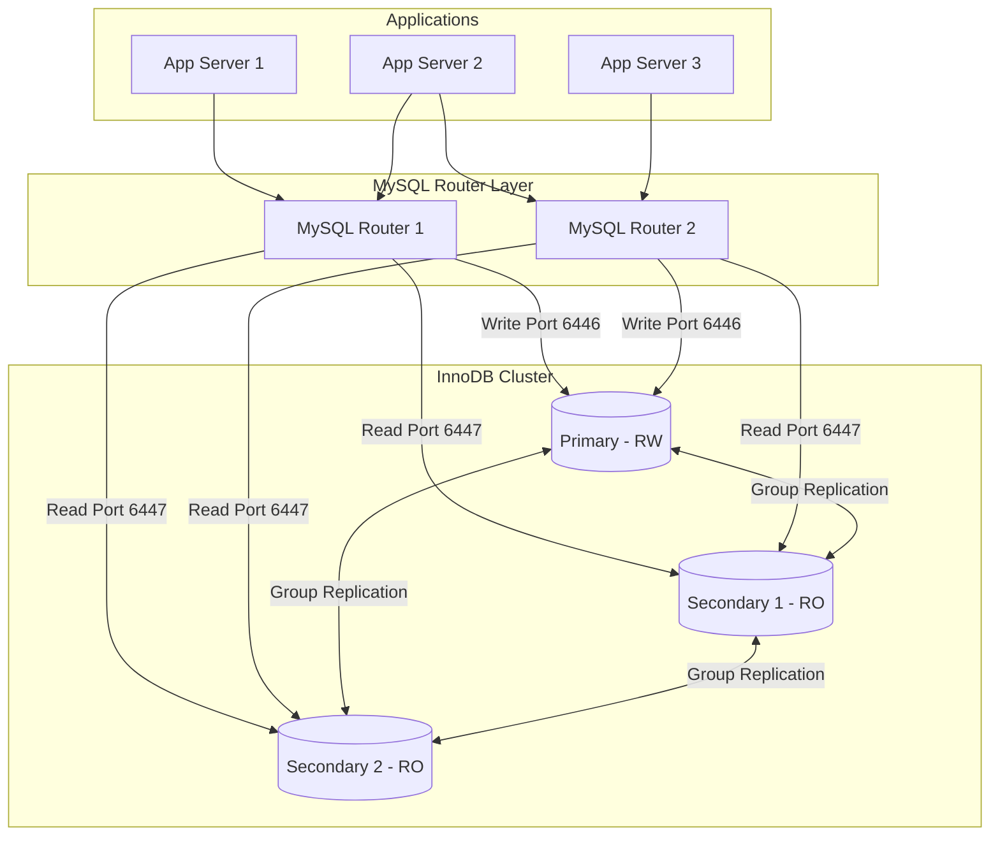
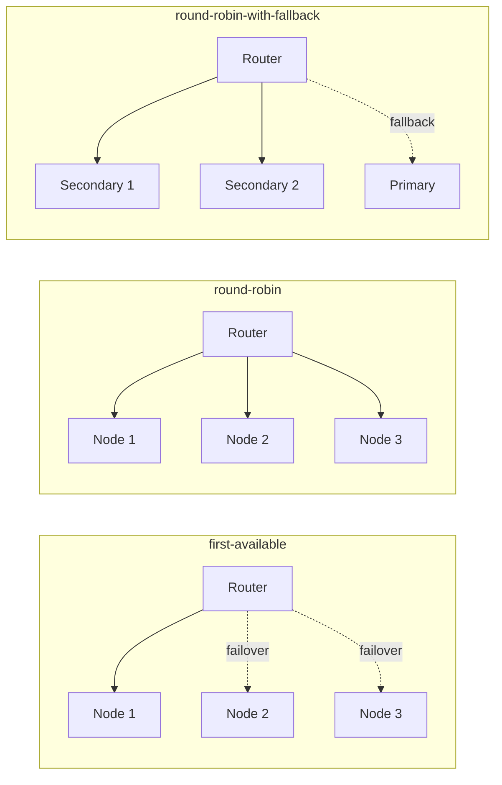
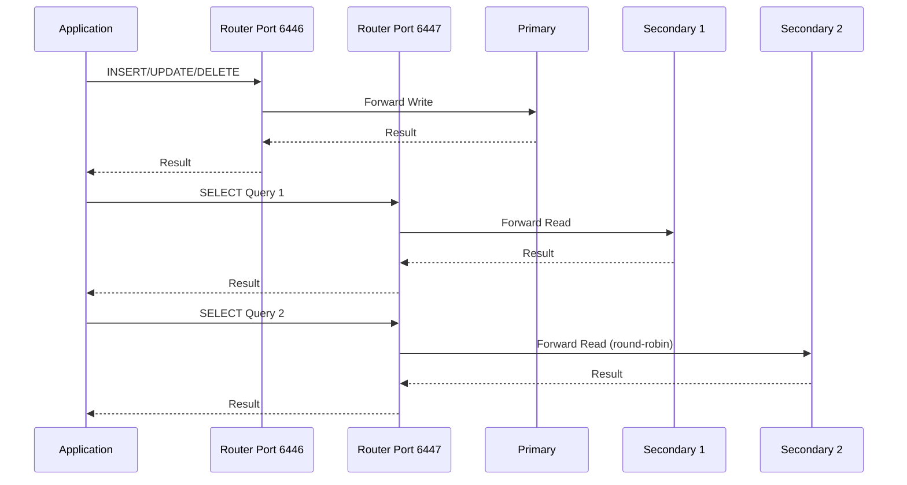
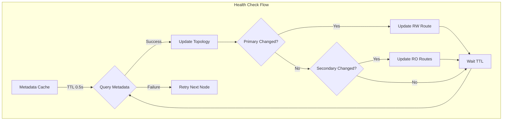

# How to Build MySQL Router Configuration

Author: [nawazdhandala](https://github.com/nawazdhandala)

Tags: MySQL, MySQL Router, Connection Routing, InnoDB Cluster

Description: Learn to configure MySQL Router for connection routing with read/write splitting, load balancing, and automatic failover for InnoDB Cluster.

---

MySQL Router is a lightweight middleware that provides transparent routing between your application and backend MySQL servers. It enables high availability, load balancing, and read/write splitting for MySQL InnoDB Cluster deployments. In this guide, we will walk through building a comprehensive MySQL Router configuration for production environments.

## Architecture Overview

Before diving into configuration, let us understand how MySQL Router fits into the MySQL InnoDB Cluster architecture.



## Prerequisites

Before configuring MySQL Router, ensure you have:

- A running MySQL InnoDB Cluster with at least 3 nodes
- MySQL Router installed on your application servers or dedicated routing servers
- Network connectivity between Router and all cluster nodes
- A MySQL user with appropriate privileges for Router metadata access

## Bootstrap Configuration

The bootstrap process is the recommended way to configure MySQL Router with an InnoDB Cluster. It automatically discovers the cluster topology and generates the configuration.

### Basic Bootstrap

```bash
# Bootstrap MySQL Router against your InnoDB Cluster
mysqlrouter --bootstrap admin@primary-node:3306 \
    --directory /etc/mysqlrouter \
    --user mysqlrouter \
    --account mysqlrouter_user \
    --account-create always
```

This command:
- Connects to the primary node to discover cluster metadata
- Creates a configuration directory at `/etc/mysqlrouter`
- Sets the system user that will run the router process
- Creates a dedicated MySQL account for the router

### Advanced Bootstrap Options

For production environments, you may need additional bootstrap options:

```bash
mysqlrouter --bootstrap admin@primary-node:3306 \
    --directory /etc/mysqlrouter \
    --user mysqlrouter \
    --account mysqlrouter_user \
    --account-create always \
    --force \
    --conf-use-sockets \
    --conf-bind-address 0.0.0.0 \
    --connect-timeout 30 \
    --read-timeout 30
```

The additional flags provide:
- `--force`: Overwrite existing configuration
- `--conf-use-sockets`: Enable Unix socket connections for local apps
- `--conf-bind-address`: Bind to all interfaces for remote connections
- `--connect-timeout`: Connection timeout to cluster nodes
- `--read-timeout`: Read operation timeout

## Understanding the Configuration File

After bootstrap, MySQL Router generates a configuration file. Let us examine the key sections:

```ini
# /etc/mysqlrouter/mysqlrouter.conf

[DEFAULT]
logging_folder = /var/log/mysqlrouter
runtime_folder = /var/run/mysqlrouter
data_folder = /var/lib/mysqlrouter
keyring_path = /var/lib/mysqlrouter/keyring
master_key_path = /var/lib/mysqlrouter/.master_key
connect_timeout = 15
read_timeout = 30
dynamic_state = /var/lib/mysqlrouter/state.json

[logger]
level = INFO
filename = mysqlrouter.log
timestamp_precision = second

[metadata_cache:bootstrap]
cluster_type = gr
router_id = 1
user = mysqlrouter_user
metadata_cluster = myCluster
ttl = 0.5
auth_cache_ttl = -1
auth_cache_refresh_interval = 2
use_gr_notifications = 1

[routing:bootstrap_rw]
bind_address = 0.0.0.0
bind_port = 6446
destinations = metadata-cache://myCluster/?role=PRIMARY
routing_strategy = first-available
protocol = classic

[routing:bootstrap_ro]
bind_address = 0.0.0.0
bind_port = 6447
destinations = metadata-cache://myCluster/?role=SECONDARY
routing_strategy = round-robin-with-fallback
protocol = classic

[routing:bootstrap_x_rw]
bind_address = 0.0.0.0
bind_port = 6448
destinations = metadata-cache://myCluster/?role=PRIMARY
routing_strategy = first-available
protocol = x

[routing:bootstrap_x_ro]
bind_address = 0.0.0.0
bind_port = 6449
destinations = metadata-cache://myCluster/?role=SECONDARY
routing_strategy = round-robin-with-fallback
protocol = x
```

## Routing Strategies Explained

MySQL Router supports several routing strategies. Understanding these is crucial for optimizing your deployment.



### first-available

Routes all connections to the first available server. Ideal for write operations where you need a single primary.

```ini
[routing:primary_rw]
bind_address = 0.0.0.0
bind_port = 6446
destinations = metadata-cache://myCluster/?role=PRIMARY
routing_strategy = first-available
protocol = classic
max_connections = 1024
max_connect_errors = 100
client_connect_timeout = 9
```

### round-robin

Distributes connections evenly across all available servers. Best for read operations across secondaries.

```ini
[routing:secondary_ro]
bind_address = 0.0.0.0
bind_port = 6447
destinations = metadata-cache://myCluster/?role=SECONDARY
routing_strategy = round-robin
protocol = classic
max_connections = 2048
```

### round-robin-with-fallback

Distributes connections across secondaries but falls back to primary if no secondaries are available. This ensures read availability during maintenance.

```ini
[routing:secondary_ro_fallback]
bind_address = 0.0.0.0
bind_port = 6447
destinations = metadata-cache://myCluster/?role=SECONDARY
routing_strategy = round-robin-with-fallback
protocol = classic
max_connections = 2048
```

## Read/Write Splitting Configuration

Read/write splitting is essential for scaling read-heavy workloads. Configure your application to use different ports for reads and writes.



### Application Connection Configuration

Configure your application to use separate connection pools:

```python
# Python example using mysql-connector-python
import mysql.connector
from mysql.connector import pooling

# Write connection pool - connects to primary
write_pool = pooling.MySQLConnectionPool(
    pool_name="write_pool",
    pool_size=10,
    host="mysql-router.example.com",
    port=6446,
    user="app_user",
    password="secure_password",
    database="myapp"
)

# Read connection pool - connects to secondaries
read_pool = pooling.MySQLConnectionPool(
    pool_name="read_pool",
    pool_size=30,
    host="mysql-router.example.com",
    port=6447,
    user="app_user",
    password="secure_password",
    database="myapp"
)

def execute_write(query, params=None):
    conn = write_pool.get_connection()
    try:
        cursor = conn.cursor()
        cursor.execute(query, params)
        conn.commit()
        return cursor.lastrowid
    finally:
        conn.close()

def execute_read(query, params=None):
    conn = read_pool.get_connection()
    try:
        cursor = conn.cursor(dictionary=True)
        cursor.execute(query, params)
        return cursor.fetchall()
    finally:
        conn.close()
```

### Java/JDBC Configuration

```java
// HikariCP configuration for read/write splitting
import com.zaxxer.hikari.HikariConfig;
import com.zaxxer.hikari.HikariDataSource;

public class DatabaseConfig {

    public static HikariDataSource createWritePool() {
        HikariConfig config = new HikariConfig();
        config.setJdbcUrl("jdbc:mysql://mysql-router.example.com:6446/myapp");
        config.setUsername("app_user");
        config.setPassword("secure_password");
        config.setMaximumPoolSize(10);
        config.setMinimumIdle(5);
        config.setConnectionTimeout(30000);
        config.setIdleTimeout(600000);
        config.setMaxLifetime(1800000);
        return new HikariDataSource(config);
    }

    public static HikariDataSource createReadPool() {
        HikariConfig config = new HikariConfig();
        config.setJdbcUrl("jdbc:mysql://mysql-router.example.com:6447/myapp");
        config.setUsername("app_user");
        config.setPassword("secure_password");
        config.setMaximumPoolSize(30);
        config.setMinimumIdle(10);
        config.setConnectionTimeout(30000);
        config.setReadOnly(true);
        return new HikariDataSource(config);
    }
}
```

## Health Checks and Failover

MySQL Router continuously monitors cluster health through the metadata cache. Understanding this mechanism helps in troubleshooting.



### Configuring Health Check Parameters

```ini
[metadata_cache:production]
cluster_type = gr
router_id = 1
user = mysqlrouter_user
metadata_cluster = myCluster

# How often to refresh metadata (in seconds)
ttl = 0.5

# Authentication cache settings
auth_cache_ttl = -1
auth_cache_refresh_interval = 2

# Enable Group Replication notifications for faster failover
use_gr_notifications = 1

# Unreachable destination quarantine
unreachable_destination_refresh_interval = 1
```

### Connection Error Handling

Configure how the router handles connection errors:

```ini
[routing:bootstrap_rw]
bind_address = 0.0.0.0
bind_port = 6446
destinations = metadata-cache://myCluster/?role=PRIMARY
routing_strategy = first-available
protocol = classic

# Maximum connections before refusing new ones
max_connections = 1024

# Number of connect errors before blocking a client
max_connect_errors = 100

# Timeout for client connection establishment
client_connect_timeout = 9

# Timeout for connecting to destination
connect_timeout = 15

# Timeout for waiting for server response
net_buffer_length = 16384
```

## Monitoring MySQL Router

Effective monitoring is crucial for maintaining a healthy routing layer.

### REST API Configuration

Enable the REST API for monitoring and management:

```ini
[http_server]
port = 8443
ssl = 1
ssl_cert = /etc/mysqlrouter/router-cert.pem
ssl_key = /etc/mysqlrouter/router-key.pem

[http_auth_realm:default_auth_realm]
backend = default_auth_backend
method = basic
name = default_realm

[rest_router]
require_realm = default_auth_realm

[rest_api]

[rest_routing]
require_realm = default_auth_realm

[rest_metadata_cache]
require_realm = default_auth_realm

[http_auth_backend:default_auth_backend]
backend = file
filename = /etc/mysqlrouter/mysqlrouter.pwd
```

### Create REST API User

```bash
# Generate password file for REST API authentication
mysqlrouter_passwd set /etc/mysqlrouter/mysqlrouter.pwd monitor_user
```

### REST API Endpoints

Query the REST API to monitor router status:

```bash
# Get router status
curl -u monitor_user:password -k \
    https://localhost:8443/api/20190715/router/status

# Get routing status for all routes
curl -u monitor_user:password -k \
    https://localhost:8443/api/20190715/routes

# Get specific route details
curl -u monitor_user:password -k \
    https://localhost:8443/api/20190715/routes/bootstrap_rw/status

# Get metadata cache status
curl -u monitor_user:password -k \
    https://localhost:8443/api/20190715/metadata/myCluster/status

# Get active connections per route
curl -u monitor_user:password -k \
    https://localhost:8443/api/20190715/routes/bootstrap_rw/connections
```

### Monitoring with Prometheus

Create a script to expose metrics for Prometheus:

```bash
#!/bin/bash
# /usr/local/bin/mysqlrouter_exporter.sh

ROUTER_API="https://localhost:8443/api/20190715"
AUTH="monitor_user:password"

# Get route statistics
routes=$(curl -s -k -u $AUTH $ROUTER_API/routes)

echo "# HELP mysqlrouter_route_connections Active connections per route"
echo "# TYPE mysqlrouter_route_connections gauge"

for route in bootstrap_rw bootstrap_ro; do
    stats=$(curl -s -k -u $AUTH $ROUTER_API/routes/$route/status)
    active=$(echo $stats | jq -r '.activeConnections // 0')
    total=$(echo $stats | jq -r '.totalConnections // 0')
    blocked=$(echo $stats | jq -r '.blockedHosts // 0')

    echo "mysqlrouter_route_connections{route=\"$route\"} $active"
    echo "mysqlrouter_route_total_connections{route=\"$route\"} $total"
    echo "mysqlrouter_route_blocked_hosts{route=\"$route\"} $blocked"
done
```

## Advanced Configuration Examples

### Multiple Cluster Support

Route to multiple InnoDB Clusters from a single router:

```ini
[metadata_cache:cluster_us]
cluster_type = gr
router_id = 1
user = mysqlrouter_user
metadata_cluster = cluster_us
ttl = 0.5
use_gr_notifications = 1

[metadata_cache:cluster_eu]
cluster_type = gr
router_id = 2
user = mysqlrouter_user
metadata_cluster = cluster_eu
ttl = 0.5
use_gr_notifications = 1

[routing:us_rw]
bind_address = 0.0.0.0
bind_port = 6446
destinations = metadata-cache://cluster_us/?role=PRIMARY
routing_strategy = first-available
protocol = classic

[routing:us_ro]
bind_address = 0.0.0.0
bind_port = 6447
destinations = metadata-cache://cluster_us/?role=SECONDARY
routing_strategy = round-robin-with-fallback
protocol = classic

[routing:eu_rw]
bind_address = 0.0.0.0
bind_port = 6448
destinations = metadata-cache://cluster_eu/?role=PRIMARY
routing_strategy = first-available
protocol = classic

[routing:eu_ro]
bind_address = 0.0.0.0
bind_port = 6449
destinations = metadata-cache://cluster_eu/?role=SECONDARY
routing_strategy = round-robin-with-fallback
protocol = classic
```

### Static Routing (Without Metadata Cache)

For non-InnoDB Cluster deployments, use static routing:

```ini
[routing:static_primary]
bind_address = 0.0.0.0
bind_port = 6446
destinations = mysql-primary-1:3306,mysql-primary-2:3306
routing_strategy = first-available
protocol = classic

[routing:static_replicas]
bind_address = 0.0.0.0
bind_port = 6447
destinations = mysql-replica-1:3306,mysql-replica-2:3306,mysql-replica-3:3306
routing_strategy = round-robin
protocol = classic
```

### TLS/SSL Configuration

Secure connections between clients and router:

```ini
[routing:bootstrap_rw_ssl]
bind_address = 0.0.0.0
bind_port = 6446
destinations = metadata-cache://myCluster/?role=PRIMARY
routing_strategy = first-available
protocol = classic

# Client-side TLS
client_ssl_mode = PREFERRED
client_ssl_cert = /etc/mysqlrouter/client-cert.pem
client_ssl_key = /etc/mysqlrouter/client-key.pem
client_ssl_ca = /etc/mysqlrouter/ca.pem

# Server-side TLS
server_ssl_mode = REQUIRED
server_ssl_verify = VERIFY_IDENTITY
server_ssl_ca = /etc/mysqlrouter/ca.pem
```

## Troubleshooting Common Issues

### Connection Refused Errors

Check router logs and verify the routing is active:

```bash
# Check router status
systemctl status mysqlrouter

# View recent logs
tail -100 /var/log/mysqlrouter/mysqlrouter.log

# Verify ports are listening
ss -tlnp | grep mysqlrouter
```

### Metadata Cache Issues

If the router cannot discover cluster topology:

```bash
# Test metadata connection manually
mysql -u mysqlrouter_user -p -h primary-node -P 3306 \
    -e "SELECT * FROM mysql_innodb_cluster_metadata.clusters;"

# Check GR status on cluster
mysql -u admin -p -h primary-node -P 3306 \
    -e "SELECT * FROM performance_schema.replication_group_members;"
```

### High Latency Debugging

```bash
# Enable debug logging temporarily
# Add to mysqlrouter.conf
[logger]
level = DEBUG

# Restart router
systemctl restart mysqlrouter

# Monitor connection times
tail -f /var/log/mysqlrouter/mysqlrouter.log | grep -i connect
```

## Best Practices Summary

1. **Deploy Router Close to Applications**: Run MySQL Router on the same host or in the same network zone as your application for minimal latency.

2. **Use Bootstrap for InnoDB Cluster**: Always use the bootstrap method for InnoDB Cluster deployments to ensure proper metadata integration.

3. **Configure Appropriate Timeouts**: Set connection and read timeouts based on your application requirements and network conditions.

4. **Enable GR Notifications**: Use `use_gr_notifications = 1` for faster failover detection.

5. **Monitor Router Health**: Implement monitoring using the REST API and integrate with your observability stack.

6. **Use Read/Write Splitting**: Configure separate ports for read and write operations to maximize cluster utilization.

7. **Plan for Router Redundancy**: Deploy multiple Router instances with a load balancer for high availability of the routing layer itself.

8. **Secure Your Configuration**: Enable TLS for client connections and protect the REST API with authentication.

## Conclusion

MySQL Router provides a robust solution for connection routing in MySQL InnoDB Cluster environments. By properly configuring bootstrap, routing strategies, read/write splitting, and monitoring, you can build a highly available and performant database infrastructure. The key is understanding your application's workload patterns and configuring the router to optimize for those patterns while maintaining reliability during failover scenarios.

For production deployments, always test your configuration under load and simulate failover scenarios to ensure your application handles them gracefully. The combination of proper configuration and comprehensive monitoring will help you maintain a reliable MySQL infrastructure.
