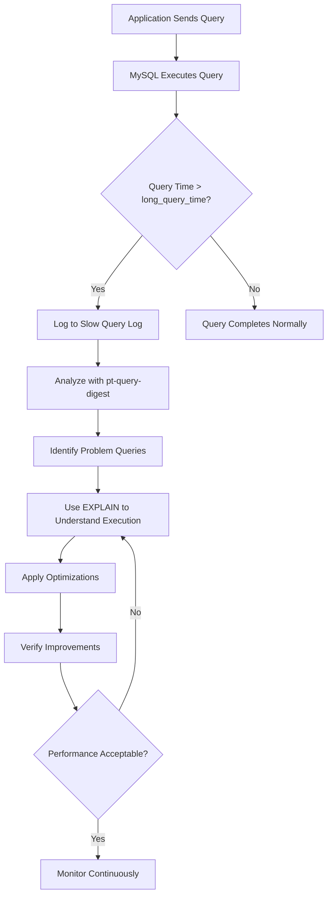
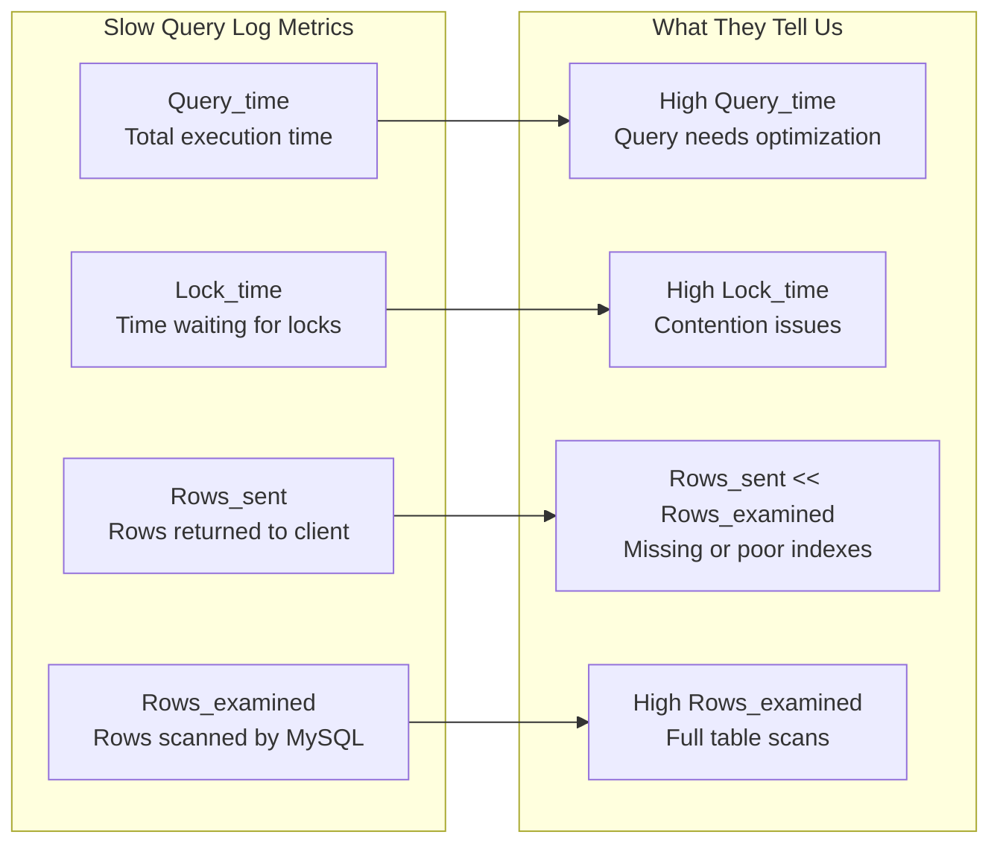
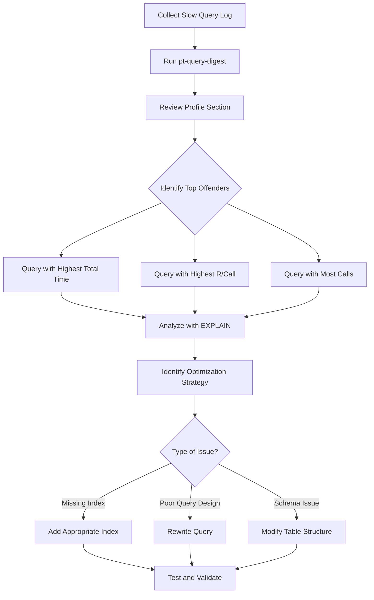
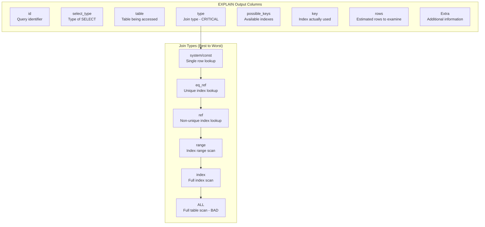
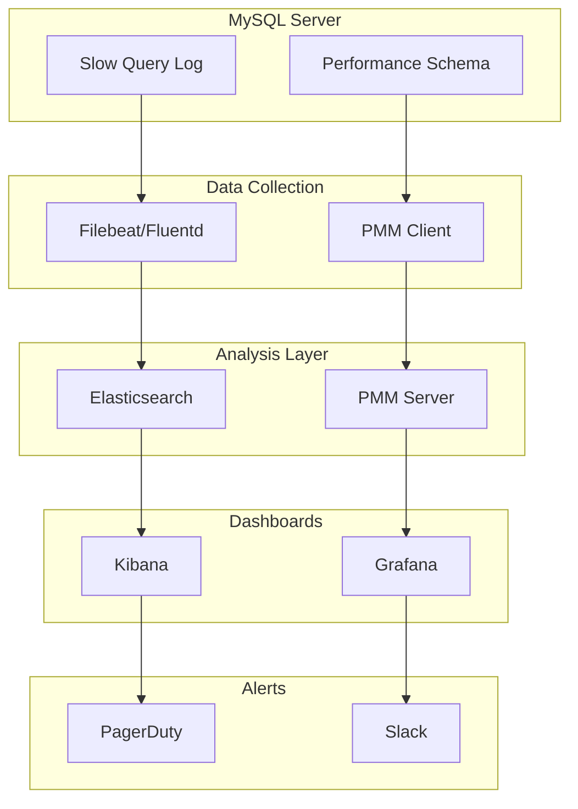
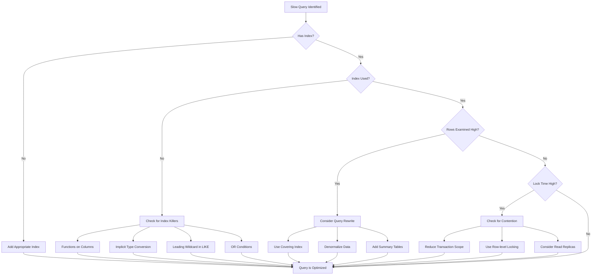

# How to Create MySQL Slow Query Analysis

Author: [nawazdhandala](https://github.com/nawazdhandala)

Tags: MySQL, Performance, Query Optimization, Database

Description: Learn how to analyze slow queries in MySQL for performance optimization.

---

Slow queries are one of the most common causes of database performance issues. A single poorly optimized query can bring your entire application to a crawl, especially under heavy load. In this guide, we will explore how to identify, analyze, and optimize slow queries in MySQL using built-in tools and third-party utilities.

## Understanding the MySQL Slow Query Log

The slow query log is MySQL's built-in mechanism for tracking queries that exceed a specified execution time threshold. This is your first line of defense when hunting for performance bottlenecks.

### How the Slow Query Analysis Process Works



### Enabling the Slow Query Log

You can enable the slow query log either at runtime or in your MySQL configuration file. Here is how to do both:

#### Runtime Configuration

```sql
-- Enable the slow query log
-- This takes effect immediately without restarting MySQL
SET GLOBAL slow_query_log = 'ON';

-- Set the threshold to 1 second
-- Any query taking longer than this will be logged
SET GLOBAL long_query_time = 1;

-- Specify the log file location
-- Make sure MySQL has write permissions to this path
SET GLOBAL slow_query_log_file = '/var/log/mysql/slow-query.log';

-- Log queries that do not use indexes
-- This helps identify queries that could benefit from indexing
SET GLOBAL log_queries_not_using_indexes = 'ON';

-- Limit how often non-indexed queries are logged per minute
-- Prevents log flooding from repeated problematic queries
SET GLOBAL log_throttle_queries_not_using_indexes = 10;
```

#### Configuration File (my.cnf)

```ini
[mysqld]
# Enable slow query logging
slow_query_log = 1

# Set the log file path
slow_query_log_file = /var/log/mysql/slow-query.log

# Log queries taking longer than 1 second
long_query_time = 1

# Include queries not using indexes
log_queries_not_using_indexes = 1

# Throttle logging of non-indexed queries
log_throttle_queries_not_using_indexes = 10

# Log slow administrative statements
log_slow_admin_statements = 1
```

### Verifying Your Configuration

```sql
-- Check the current slow query log settings
-- Run this to confirm your configuration is active
SHOW VARIABLES LIKE 'slow_query%';

-- Expected output:
-- +---------------------+--------------------------------+
-- | Variable_name       | Value                          |
-- +---------------------+--------------------------------+
-- | slow_query_log      | ON                             |
-- | slow_query_log_file | /var/log/mysql/slow-query.log  |
-- +---------------------+--------------------------------+

-- Check the query time threshold
SHOW VARIABLES LIKE 'long_query_time';

-- Expected output:
-- +-----------------+----------+
-- | Variable_name   | Value    |
-- +-----------------+----------+
-- | long_query_time | 1.000000 |
-- +-----------------+----------+
```

## Reading the Slow Query Log

The slow query log contains detailed information about each slow query. Here is an example entry:

```
# Time: 2026-01-30T10:15:32.456789Z
# User@Host: app_user[app_user] @ app-server [192.168.1.100]  Id: 12345
# Query_time: 5.234567  Lock_time: 0.000123 Rows_sent: 1000  Rows_examined: 5000000
SET timestamp=1738232132;
SELECT * FROM orders
WHERE customer_id = 12345
AND order_date BETWEEN '2025-01-01' AND '2025-12-31'
ORDER BY order_date DESC;
```

### Key Metrics Explained



## Using pt-query-digest for Analysis

The `pt-query-digest` tool from Percona Toolkit is the industry standard for analyzing slow query logs. It aggregates similar queries and provides detailed statistics.

### Installing Percona Toolkit

```bash
# On Ubuntu/Debian systems
# This installs the full Percona Toolkit suite
sudo apt-get update
sudo apt-get install percona-toolkit

# On CentOS/RHEL systems
# First add the Percona repository
sudo yum install https://repo.percona.com/yum/percona-release-latest.noarch.rpm
sudo yum install percona-toolkit

# On macOS using Homebrew
brew install percona-toolkit

# Verify the installation
pt-query-digest --version
```

### Basic Usage

```bash
# Analyze the slow query log and output a summary
# This groups similar queries and ranks them by total time
pt-query-digest /var/log/mysql/slow-query.log

# Analyze only queries from the last 24 hours
# Useful for focusing on recent issues
pt-query-digest --since '24h' /var/log/mysql/slow-query.log

# Filter by specific database
# Helpful when you have multiple databases on one server
pt-query-digest --filter '$event->{db} eq "production"' /var/log/mysql/slow-query.log

# Output results to a file for later review
pt-query-digest /var/log/mysql/slow-query.log > /tmp/query-analysis.txt
```

### Understanding pt-query-digest Output

```bash
# Example pt-query-digest output

# Overall statistics
# ==================
# Total: 1.5k queries, 500 unique query fingerprints
# Time range: 2026-01-29 00:00:00 to 2026-01-30 00:00:00

# Profile
# =======
# Rank Query ID                     Response time    Calls  R/Call
# ==== ============================ ================ ====== ======
#    1 0xABC123DEF456789012345678   500.0000 45.0%     100  5.0000
#      SELECT * FROM orders WHERE customer_id = ?
#    2 0xDEF456789012345678ABC123   300.0000 27.0%      50  6.0000
#      SELECT * FROM products WHERE category_id = ?
#    3 0x789012345678ABC123DEF456   150.0000 13.5%     200  0.7500
#      UPDATE inventory SET quantity = ? WHERE product_id = ?
```

### Workflow for Using pt-query-digest



### Advanced pt-query-digest Options

```bash
# Group queries by user to find problematic applications
pt-query-digest --group-by user /var/log/mysql/slow-query.log

# Show only queries examining more than 100000 rows
# These are prime candidates for optimization
pt-query-digest --filter '$event->{Rows_examined} > 100000' /var/log/mysql/slow-query.log

# Generate a report limited to top 10 queries
pt-query-digest --limit 10 /var/log/mysql/slow-query.log

# Review queries with specific patterns
# Useful when investigating a known problematic table
pt-query-digest --filter '$event->{arg} =~ /orders/' /var/log/mysql/slow-query.log

# Output in JSON format for programmatic processing
pt-query-digest --output json /var/log/mysql/slow-query.log > analysis.json
```

## Using EXPLAIN for Query Analysis

The EXPLAIN statement shows how MySQL executes a query, revealing potential performance issues.

### Basic EXPLAIN Usage

```sql
-- Basic EXPLAIN shows the query execution plan
EXPLAIN SELECT * FROM orders
WHERE customer_id = 12345
AND order_date BETWEEN '2025-01-01' AND '2025-12-31';

-- EXPLAIN ANALYZE actually runs the query and shows real timing
-- Available in MySQL 8.0.18 and later
EXPLAIN ANALYZE SELECT * FROM orders
WHERE customer_id = 12345
AND order_date BETWEEN '2025-01-01' AND '2025-12-31';

-- EXPLAIN FORMAT=JSON provides detailed execution information
-- Includes cost estimates and additional metadata
EXPLAIN FORMAT=JSON SELECT * FROM orders
WHERE customer_id = 12345
AND order_date BETWEEN '2025-01-01' AND '2025-12-31';

-- EXPLAIN FORMAT=TREE shows a visual execution tree
-- Easier to read for complex queries with joins
EXPLAIN FORMAT=TREE SELECT * FROM orders
WHERE customer_id = 12345
AND order_date BETWEEN '2025-01-01' AND '2025-12-31';
```

### Understanding EXPLAIN Output



### EXPLAIN Example with Analysis

```sql
-- Let us analyze a problematic query
-- This query is slow because it performs a full table scan

EXPLAIN SELECT * FROM orders
WHERE YEAR(order_date) = 2025;

-- Output:
-- +----+-------------+--------+------+---------------+------+---------+------+----------+-------------+
-- | id | select_type | table  | type | possible_keys | key  | key_len | ref  | rows     | Extra       |
-- +----+-------------+--------+------+---------------+------+---------+------+----------+-------------+
-- |  1 | SIMPLE      | orders | ALL  | NULL          | NULL | NULL    | NULL | 5000000  | Using where |
-- +----+-------------+--------+------+---------------+------+---------+------+----------+-------------+

-- Problems identified:
-- 1. type = ALL means full table scan
-- 2. key = NULL means no index is being used
-- 3. rows = 5000000 means MySQL will examine all rows
-- 4. The YEAR() function prevents index usage

-- Now let us fix the query to use an index properly
EXPLAIN SELECT * FROM orders
WHERE order_date >= '2025-01-01' AND order_date < '2026-01-01';

-- Output after optimization:
-- +----+-------------+--------+-------+---------------+--------------+---------+------+--------+-------------+
-- | id | select_type | table  | type  | possible_keys | key          | key_len | ref  | rows   | Extra       |
-- +----+-------------+--------+-------+---------------+--------------+---------+------+--------+-------------+
-- |  1 | SIMPLE      | orders | range | idx_order_date| idx_order_date| 3      | NULL | 150000 | Using where |
-- +----+-------------+--------+-------+---------------+--------------+---------+------+--------+-------------+

-- Improvements:
-- 1. type = range means index range scan
-- 2. key = idx_order_date means the index is being used
-- 3. rows = 150000 is much better than 5000000
```

## Practical Optimization Examples

### Example 1: Adding Missing Indexes

```sql
-- Original slow query from pt-query-digest
-- Query_time: 8.5 seconds, Rows_examined: 2000000

SELECT
    c.customer_name,
    COUNT(o.order_id) as order_count,
    SUM(o.total_amount) as total_spent
FROM customers c
JOIN orders o ON c.customer_id = o.customer_id
WHERE o.order_date >= '2025-01-01'
GROUP BY c.customer_id;

-- Step 1: Check existing indexes
SHOW INDEX FROM orders;
SHOW INDEX FROM customers;

-- Step 2: Analyze with EXPLAIN
EXPLAIN SELECT
    c.customer_name,
    COUNT(o.order_id) as order_count,
    SUM(o.total_amount) as total_spent
FROM customers c
JOIN orders o ON c.customer_id = o.customer_id
WHERE o.order_date >= '2025-01-01'
GROUP BY c.customer_id;

-- Step 3: Create a composite index for the orders table
-- This index covers the WHERE clause and JOIN condition
CREATE INDEX idx_orders_date_customer
ON orders(order_date, customer_id, total_amount);

-- Step 4: Verify improvement
-- Query_time should drop significantly after adding the index
```

### Example 2: Rewriting Inefficient Queries

```sql
-- Original query using OR conditions
-- This often prevents proper index usage
SELECT * FROM products
WHERE category_id = 5
   OR supplier_id = 10
   OR brand_id = 3;

-- Optimized version using UNION
-- Each subquery can use its own index efficiently
SELECT * FROM products WHERE category_id = 5
UNION
SELECT * FROM products WHERE supplier_id = 10
UNION
SELECT * FROM products WHERE brand_id = 3;

-- Alternative: Use UNION ALL if duplicates are acceptable
-- UNION ALL is faster because it skips duplicate removal
SELECT * FROM products WHERE category_id = 5
UNION ALL
SELECT * FROM products WHERE supplier_id = 10 AND category_id != 5
UNION ALL
SELECT * FROM products WHERE brand_id = 3 AND category_id != 5 AND supplier_id != 10;
```

### Example 3: Optimizing Subqueries

```sql
-- Original query with correlated subquery
-- This executes the subquery once for each row in the outer query
SELECT
    p.product_name,
    p.price,
    (SELECT AVG(price) FROM products WHERE category_id = p.category_id) as avg_category_price
FROM products p
WHERE p.price > (SELECT AVG(price) FROM products WHERE category_id = p.category_id);

-- Optimized version using JOIN with derived table
-- The subquery is executed only once
SELECT
    p.product_name,
    p.price,
    cat_avg.avg_price as avg_category_price
FROM products p
JOIN (
    -- Calculate category averages once
    SELECT category_id, AVG(price) as avg_price
    FROM products
    GROUP BY category_id
) cat_avg ON p.category_id = cat_avg.category_id
WHERE p.price > cat_avg.avg_price;
```

### Example 4: Pagination Optimization

```sql
-- Original pagination query
-- This becomes slower as offset increases
SELECT * FROM orders
ORDER BY order_date DESC
LIMIT 10 OFFSET 100000;

-- Problem: MySQL must scan and discard 100000 rows

-- Optimized version using keyset pagination
-- Requires knowing the last order_date from the previous page
SELECT * FROM orders
WHERE order_date < '2025-06-15 14:30:00'  -- Last value from previous page
ORDER BY order_date DESC
LIMIT 10;

-- Alternative: Using a covering index with deferred join
-- First get only the IDs using the index
SELECT o.* FROM orders o
JOIN (
    SELECT order_id FROM orders
    ORDER BY order_date DESC
    LIMIT 10 OFFSET 100000
) AS tmp ON o.order_id = tmp.order_id
ORDER BY o.order_date DESC;
```

## Setting Up Continuous Monitoring

### Monitoring Architecture



### Using Performance Schema for Real-time Analysis

```sql
-- Enable Performance Schema if not already enabled
-- This is on by default in MySQL 5.6 and later

-- Find the top 10 queries by total execution time
SELECT
    DIGEST_TEXT as query_pattern,
    COUNT_STAR as execution_count,
    ROUND(SUM_TIMER_WAIT/1000000000000, 2) as total_time_sec,
    ROUND(AVG_TIMER_WAIT/1000000000000, 4) as avg_time_sec,
    SUM_ROWS_EXAMINED as rows_examined,
    SUM_ROWS_SENT as rows_sent
FROM performance_schema.events_statements_summary_by_digest
ORDER BY SUM_TIMER_WAIT DESC
LIMIT 10;

-- Find queries with poor row examination ratio
-- These queries examine many rows but return few
SELECT
    DIGEST_TEXT,
    COUNT_STAR,
    SUM_ROWS_EXAMINED,
    SUM_ROWS_SENT,
    ROUND(SUM_ROWS_EXAMINED / NULLIF(SUM_ROWS_SENT, 0), 2) as examination_ratio
FROM performance_schema.events_statements_summary_by_digest
WHERE SUM_ROWS_SENT > 0
HAVING examination_ratio > 1000
ORDER BY examination_ratio DESC
LIMIT 10;

-- Reset statistics to start fresh monitoring
-- Useful after making optimizations
TRUNCATE TABLE performance_schema.events_statements_summary_by_digest;
```

### Automated Alert Script

```bash
#!/bin/bash

# Script: check_slow_queries.sh
# Purpose: Alert when slow query count exceeds threshold
# Usage: Run via cron every 5 minutes

# Configuration
MYSQL_USER="monitor"
MYSQL_PASS="secure_password"
THRESHOLD=100
ALERT_EMAIL="dba@company.com"
LOG_FILE="/var/log/mysql/slow-query.log"

# Count slow queries in the last 5 minutes
# Using awk to parse the timestamp from slow query log
RECENT_COUNT=$(awk -v cutoff="$(date -d '5 minutes ago' '+%Y-%m-%dT%H:%M')" '
    /^# Time:/ {
        timestamp = $3
        if (timestamp >= cutoff) count++
    }
    END { print count+0 }
' "$LOG_FILE")

# Send alert if threshold exceeded
if [ "$RECENT_COUNT" -gt "$THRESHOLD" ]; then
    echo "ALERT: $RECENT_COUNT slow queries in the last 5 minutes" | \
    mail -s "MySQL Slow Query Alert" "$ALERT_EMAIL"

    # Also log to syslog for centralized monitoring
    logger -p local0.warning "MySQL slow queries: $RECENT_COUNT in last 5 minutes"
fi

# Output for cron logging
echo "$(date): Checked slow queries - Count: $RECENT_COUNT"
```

## Best Practices Summary

### Query Optimization Checklist



### Key Takeaways

1. **Enable slow query logging** with an appropriate threshold for your workload
2. **Use pt-query-digest regularly** to identify patterns in slow queries
3. **Always use EXPLAIN** before optimizing to understand the actual execution plan
4. **Focus on high-impact queries** first, those with the highest total time or frequency
5. **Monitor continuously** to catch regressions early
6. **Test optimizations** in a staging environment before applying to production

By following this systematic approach to slow query analysis, you can significantly improve your MySQL database performance and ensure your applications remain responsive under load.
