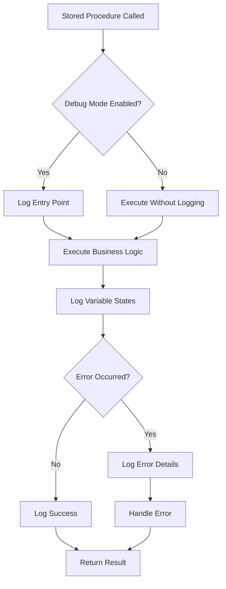
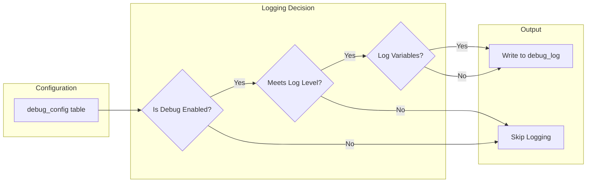
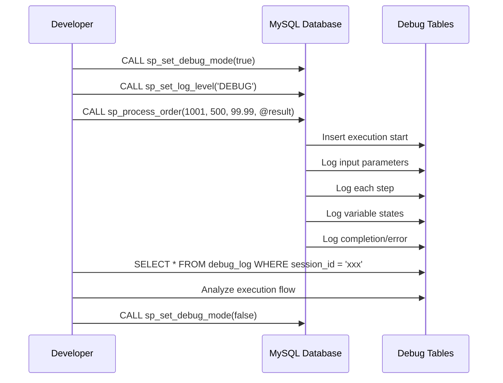

# How to Implement MySQL Stored Procedure Debugging

Author: [nawazdhandala](https://github.com/nawazdhandala)

Tags: MySQL, Stored Procedures, Debugging, Database

Description: Learn how to debug MySQL stored procedures effectively with logging and analysis.

---

Debugging stored procedures in MySQL can be challenging since MySQL does not provide a built-in step debugger like some other database systems. However, with the right techniques and infrastructure, you can implement effective debugging strategies that give you full visibility into your stored procedure execution. This guide covers practical approaches to MySQL stored procedure debugging using debug tables, conditional logging, and error handling.

## Understanding the Debugging Challenge

Unlike application code where you can set breakpoints and step through execution, MySQL stored procedures run atomically on the database server. To debug them effectively, you need to implement logging mechanisms that capture the execution flow, variable states, and any errors that occur.



## Setting Up the Debug Infrastructure

### Creating the Debug Tables

The foundation of stored procedure debugging is a set of tables that capture execution information. Here is a comprehensive schema for debug logging:

```sql
-- Main debug log table for capturing execution events
CREATE TABLE debug_log (
    id BIGINT AUTO_INCREMENT PRIMARY KEY,
    session_id VARCHAR(36) NOT NULL,          -- Unique identifier for the session
    procedure_name VARCHAR(128) NOT NULL,      -- Name of the stored procedure
    log_level ENUM('DEBUG', 'INFO', 'WARN', 'ERROR') DEFAULT 'DEBUG',
    message TEXT,                              -- Log message
    variable_dump JSON,                        -- JSON snapshot of variable states
    created_at TIMESTAMP DEFAULT CURRENT_TIMESTAMP,
    execution_time_ms INT,                     -- Time since procedure start
    INDEX idx_session (session_id),
    INDEX idx_procedure (procedure_name),
    INDEX idx_created (created_at),
    INDEX idx_level (log_level)
) ENGINE=InnoDB;

-- Table for tracking procedure execution metrics
CREATE TABLE debug_execution_metrics (
    id BIGINT AUTO_INCREMENT PRIMARY KEY,
    session_id VARCHAR(36) NOT NULL,
    procedure_name VARCHAR(128) NOT NULL,
    start_time TIMESTAMP(6) DEFAULT CURRENT_TIMESTAMP(6),
    end_time TIMESTAMP(6) NULL,
    status ENUM('RUNNING', 'COMPLETED', 'FAILED') DEFAULT 'RUNNING',
    error_code INT,
    error_message TEXT,
    rows_affected INT,
    INDEX idx_session (session_id),
    INDEX idx_status (status)
) ENGINE=InnoDB;

-- Configuration table for controlling debug behavior
CREATE TABLE debug_config (
    config_key VARCHAR(64) PRIMARY KEY,
    config_value VARCHAR(255) NOT NULL,
    description TEXT,
    updated_at TIMESTAMP DEFAULT CURRENT_TIMESTAMP ON UPDATE CURRENT_TIMESTAMP
) ENGINE=InnoDB;

-- Insert default configuration values
INSERT INTO debug_config (config_key, config_value, description) VALUES
('debug_enabled', 'true', 'Master switch for debug logging'),
('log_level', 'DEBUG', 'Minimum log level to capture'),
('retention_days', '7', 'Number of days to retain debug logs'),
('log_variables', 'true', 'Whether to log variable states');
```

### Creating Debug Helper Procedures

Now let us create reusable procedures that handle the logging operations:

```sql
-- Delimiter change for procedure definitions
DELIMITER //

-- Procedure to write debug log entries
CREATE PROCEDURE sp_debug_log(
    IN p_session_id VARCHAR(36),
    IN p_procedure_name VARCHAR(128),
    IN p_log_level VARCHAR(10),
    IN p_message TEXT,
    IN p_variable_dump JSON,
    IN p_start_time TIMESTAMP(6)
)
BEGIN
    DECLARE v_debug_enabled VARCHAR(10);
    DECLARE v_min_log_level VARCHAR(10);
    DECLARE v_execution_time_ms INT;
    DECLARE v_level_priority INT DEFAULT 0;
    DECLARE v_min_level_priority INT DEFAULT 0;

    -- Check if debugging is enabled
    SELECT config_value INTO v_debug_enabled
    FROM debug_config
    WHERE config_key = 'debug_enabled';

    -- Only log if debugging is enabled
    IF v_debug_enabled = 'true' THEN
        -- Get minimum log level from config
        SELECT config_value INTO v_min_log_level
        FROM debug_config
        WHERE config_key = 'log_level';

        -- Assign priority values to log levels
        SET v_level_priority = CASE p_log_level
            WHEN 'DEBUG' THEN 1
            WHEN 'INFO' THEN 2
            WHEN 'WARN' THEN 3
            WHEN 'ERROR' THEN 4
            ELSE 0
        END;

        SET v_min_level_priority = CASE v_min_log_level
            WHEN 'DEBUG' THEN 1
            WHEN 'INFO' THEN 2
            WHEN 'WARN' THEN 3
            WHEN 'ERROR' THEN 4
            ELSE 0
        END;

        -- Only log if the message level meets minimum threshold
        IF v_level_priority >= v_min_level_priority THEN
            -- Calculate execution time in milliseconds
            SET v_execution_time_ms = TIMESTAMPDIFF(
                MICROSECOND,
                p_start_time,
                CURRENT_TIMESTAMP(6)
            ) / 1000;

            -- Insert the log entry
            INSERT INTO debug_log (
                session_id,
                procedure_name,
                log_level,
                message,
                variable_dump,
                execution_time_ms
            ) VALUES (
                p_session_id,
                p_procedure_name,
                p_log_level,
                p_message,
                p_variable_dump,
                v_execution_time_ms
            );
        END IF;
    END IF;
END //

-- Procedure to start execution tracking
CREATE PROCEDURE sp_debug_start_execution(
    IN p_session_id VARCHAR(36),
    IN p_procedure_name VARCHAR(128)
)
BEGIN
    INSERT INTO debug_execution_metrics (
        session_id,
        procedure_name,
        status
    ) VALUES (
        p_session_id,
        p_procedure_name,
        'RUNNING'
    );
END //

-- Procedure to mark execution as completed
CREATE PROCEDURE sp_debug_end_execution(
    IN p_session_id VARCHAR(36),
    IN p_status VARCHAR(20),
    IN p_error_code INT,
    IN p_error_message TEXT,
    IN p_rows_affected INT
)
BEGIN
    UPDATE debug_execution_metrics
    SET
        end_time = CURRENT_TIMESTAMP(6),
        status = p_status,
        error_code = p_error_code,
        error_message = p_error_message,
        rows_affected = p_rows_affected
    WHERE session_id = p_session_id
    AND status = 'RUNNING';
END //

DELIMITER ;
```

## Implementing Conditional Logging

Conditional logging allows you to control when and what gets logged without modifying your stored procedures. This is essential for production environments where you want minimal overhead during normal operation.



### Dynamic Debug Configuration

Here is how to implement runtime configuration changes:

```sql
DELIMITER //

-- Procedure to enable or disable debugging
CREATE PROCEDURE sp_set_debug_mode(
    IN p_enabled BOOLEAN
)
BEGIN
    UPDATE debug_config
    SET config_value = IF(p_enabled, 'true', 'false')
    WHERE config_key = 'debug_enabled';

    SELECT CONCAT('Debug mode ', IF(p_enabled, 'enabled', 'disabled')) AS result;
END //

-- Procedure to set the minimum log level
CREATE PROCEDURE sp_set_log_level(
    IN p_level VARCHAR(10)
)
BEGIN
    -- Validate the log level
    IF p_level NOT IN ('DEBUG', 'INFO', 'WARN', 'ERROR') THEN
        SIGNAL SQLSTATE '45000'
        SET MESSAGE_TEXT = 'Invalid log level. Use DEBUG, INFO, WARN, or ERROR';
    END IF;

    UPDATE debug_config
    SET config_value = p_level
    WHERE config_key = 'log_level';

    SELECT CONCAT('Log level set to ', p_level) AS result;
END //

-- Procedure to enable or disable variable logging
CREATE PROCEDURE sp_set_variable_logging(
    IN p_enabled BOOLEAN
)
BEGIN
    UPDATE debug_config
    SET config_value = IF(p_enabled, 'true', 'false')
    WHERE config_key = 'log_variables';

    SELECT CONCAT('Variable logging ', IF(p_enabled, 'enabled', 'disabled')) AS result;
END //

DELIMITER ;
```

## Comprehensive Error Handling

Proper error handling is crucial for debugging. MySQL provides handlers that can catch errors and log them before the procedure terminates.

```sql
DELIMITER //

-- Example procedure with comprehensive error handling and debugging
CREATE PROCEDURE sp_process_order(
    IN p_order_id INT,
    IN p_customer_id INT,
    IN p_amount DECIMAL(10,2),
    OUT p_result VARCHAR(50)
)
proc_label: BEGIN
    -- Declare variables for debugging
    DECLARE v_session_id VARCHAR(36);
    DECLARE v_start_time TIMESTAMP(6);
    DECLARE v_error_code INT DEFAULT 0;
    DECLARE v_error_message TEXT DEFAULT NULL;
    DECLARE v_rows_affected INT DEFAULT 0;
    DECLARE v_customer_balance DECIMAL(10,2);
    DECLARE v_order_status VARCHAR(20);

    -- Error handler declaration
    DECLARE EXIT HANDLER FOR SQLEXCEPTION
    BEGIN
        -- Capture error information
        GET DIAGNOSTICS CONDITION 1
            v_error_code = MYSQL_ERRNO,
            v_error_message = MESSAGE_TEXT;

        -- Log the error
        CALL sp_debug_log(
            v_session_id,
            'sp_process_order',
            'ERROR',
            CONCAT('SQL Exception: ', v_error_message),
            JSON_OBJECT(
                'order_id', p_order_id,
                'customer_id', p_customer_id,
                'amount', p_amount,
                'error_code', v_error_code
            ),
            v_start_time
        );

        -- Mark execution as failed
        CALL sp_debug_end_execution(
            v_session_id,
            'FAILED',
            v_error_code,
            v_error_message,
            0
        );

        -- Rollback any pending changes
        ROLLBACK;

        -- Set output parameter
        SET p_result = 'ERROR';
    END;

    -- Initialize debug session
    SET v_session_id = UUID();
    SET v_start_time = CURRENT_TIMESTAMP(6);

    -- Start execution tracking
    CALL sp_debug_start_execution(v_session_id, 'sp_process_order');

    -- Log procedure entry with input parameters
    CALL sp_debug_log(
        v_session_id,
        'sp_process_order',
        'INFO',
        'Procedure started',
        JSON_OBJECT(
            'order_id', p_order_id,
            'customer_id', p_customer_id,
            'amount', p_amount
        ),
        v_start_time
    );

    -- Start transaction
    START TRANSACTION;

    -- Step 1: Validate customer exists and get balance
    CALL sp_debug_log(
        v_session_id,
        'sp_process_order',
        'DEBUG',
        'Validating customer',
        NULL,
        v_start_time
    );

    SELECT balance INTO v_customer_balance
    FROM customers
    WHERE customer_id = p_customer_id;

    -- Check if customer was found
    IF v_customer_balance IS NULL THEN
        CALL sp_debug_log(
            v_session_id,
            'sp_process_order',
            'WARN',
            'Customer not found',
            JSON_OBJECT('customer_id', p_customer_id),
            v_start_time
        );

        CALL sp_debug_end_execution(v_session_id, 'FAILED', 1001, 'Customer not found', 0);
        SET p_result = 'CUSTOMER_NOT_FOUND';
        ROLLBACK;
        LEAVE proc_label;
    END IF;

    -- Log customer balance
    CALL sp_debug_log(
        v_session_id,
        'sp_process_order',
        'DEBUG',
        'Customer balance retrieved',
        JSON_OBJECT(
            'customer_id', p_customer_id,
            'balance', v_customer_balance
        ),
        v_start_time
    );

    -- Step 2: Check sufficient balance
    IF v_customer_balance < p_amount THEN
        CALL sp_debug_log(
            v_session_id,
            'sp_process_order',
            'WARN',
            'Insufficient balance',
            JSON_OBJECT(
                'required', p_amount,
                'available', v_customer_balance
            ),
            v_start_time
        );

        CALL sp_debug_end_execution(v_session_id, 'FAILED', 1002, 'Insufficient balance', 0);
        SET p_result = 'INSUFFICIENT_BALANCE';
        ROLLBACK;
        LEAVE proc_label;
    END IF;

    -- Step 3: Process the order
    CALL sp_debug_log(
        v_session_id,
        'sp_process_order',
        'DEBUG',
        'Processing order',
        NULL,
        v_start_time
    );

    -- Update customer balance
    UPDATE customers
    SET balance = balance - p_amount
    WHERE customer_id = p_customer_id;

    SET v_rows_affected = ROW_COUNT();

    -- Insert order record
    INSERT INTO orders (order_id, customer_id, amount, status, created_at)
    VALUES (p_order_id, p_customer_id, p_amount, 'COMPLETED', NOW());

    SET v_rows_affected = v_rows_affected + ROW_COUNT();

    -- Commit the transaction
    COMMIT;

    -- Log successful completion
    CALL sp_debug_log(
        v_session_id,
        'sp_process_order',
        'INFO',
        'Order processed successfully',
        JSON_OBJECT(
            'order_id', p_order_id,
            'new_balance', v_customer_balance - p_amount,
            'rows_affected', v_rows_affected
        ),
        v_start_time
    );

    -- Mark execution as completed
    CALL sp_debug_end_execution(v_session_id, 'COMPLETED', 0, NULL, v_rows_affected);

    SET p_result = 'SUCCESS';
END //

DELIMITER ;
```

## Practical Debugging Workflow

Here is a complete workflow for debugging stored procedures in a development environment:



### Querying Debug Information

Use these queries to analyze stored procedure execution:

```sql
-- View all logs for a specific procedure execution
SELECT
    log_level,
    message,
    variable_dump,
    execution_time_ms,
    created_at
FROM debug_log
WHERE session_id = 'your-session-id-here'
ORDER BY id;

-- Find all failed executions in the last hour
SELECT
    dem.session_id,
    dem.procedure_name,
    dem.start_time,
    dem.end_time,
    TIMESTAMPDIFF(MILLISECOND, dem.start_time, dem.end_time) AS duration_ms,
    dem.error_code,
    dem.error_message
FROM debug_execution_metrics dem
WHERE dem.status = 'FAILED'
AND dem.start_time >= DATE_SUB(NOW(), INTERVAL 1 HOUR)
ORDER BY dem.start_time DESC;

-- Get execution statistics by procedure
SELECT
    procedure_name,
    COUNT(*) AS total_executions,
    SUM(CASE WHEN status = 'COMPLETED' THEN 1 ELSE 0 END) AS successful,
    SUM(CASE WHEN status = 'FAILED' THEN 1 ELSE 0 END) AS failed,
    AVG(TIMESTAMPDIFF(MILLISECOND, start_time, end_time)) AS avg_duration_ms,
    MAX(TIMESTAMPDIFF(MILLISECOND, start_time, end_time)) AS max_duration_ms
FROM debug_execution_metrics
WHERE start_time >= DATE_SUB(NOW(), INTERVAL 24 HOUR)
GROUP BY procedure_name
ORDER BY total_executions DESC;

-- Trace a specific order through all related procedure calls
SELECT
    dl.session_id,
    dl.procedure_name,
    dl.log_level,
    dl.message,
    JSON_UNQUOTE(JSON_EXTRACT(dl.variable_dump, '$.order_id')) AS order_id,
    dl.execution_time_ms,
    dl.created_at
FROM debug_log dl
WHERE JSON_EXTRACT(dl.variable_dump, '$.order_id') = 1001
ORDER BY dl.created_at;
```

### Creating a Debug View

Create a view for easier log analysis:

```sql
-- Create a comprehensive debug view
CREATE VIEW v_debug_analysis AS
SELECT
    dl.id,
    dl.session_id,
    dl.procedure_name,
    dl.log_level,
    dl.message,
    dl.variable_dump,
    dl.execution_time_ms,
    dl.created_at,
    dem.status AS execution_status,
    dem.error_code,
    dem.error_message,
    TIMESTAMPDIFF(MILLISECOND, dem.start_time, dem.end_time) AS total_duration_ms
FROM debug_log dl
LEFT JOIN debug_execution_metrics dem
    ON dl.session_id = dem.session_id
ORDER BY dl.created_at DESC;

-- Query the view for recent errors
SELECT * FROM v_debug_analysis
WHERE log_level = 'ERROR'
AND created_at >= DATE_SUB(NOW(), INTERVAL 1 HOUR);
```

## Maintenance and Cleanup

To prevent debug tables from growing indefinitely, implement automatic cleanup:

```sql
DELIMITER //

-- Procedure to clean up old debug logs
CREATE PROCEDURE sp_cleanup_debug_logs()
BEGIN
    DECLARE v_retention_days INT;
    DECLARE v_deleted_logs INT DEFAULT 0;
    DECLARE v_deleted_metrics INT DEFAULT 0;

    -- Get retention period from config
    SELECT CAST(config_value AS UNSIGNED) INTO v_retention_days
    FROM debug_config
    WHERE config_key = 'retention_days';

    -- Delete old log entries
    DELETE FROM debug_log
    WHERE created_at < DATE_SUB(NOW(), INTERVAL v_retention_days DAY);

    SET v_deleted_logs = ROW_COUNT();

    -- Delete old execution metrics
    DELETE FROM debug_execution_metrics
    WHERE start_time < DATE_SUB(NOW(), INTERVAL v_retention_days DAY);

    SET v_deleted_metrics = ROW_COUNT();

    -- Return cleanup summary
    SELECT
        v_deleted_logs AS logs_deleted,
        v_deleted_metrics AS metrics_deleted,
        v_retention_days AS retention_days;
END //

DELIMITER ;

-- Create an event to run cleanup daily
CREATE EVENT IF NOT EXISTS evt_cleanup_debug_logs
ON SCHEDULE EVERY 1 DAY
STARTS CURRENT_DATE + INTERVAL 1 DAY + INTERVAL 2 HOUR
DO
    CALL sp_cleanup_debug_logs();
```

## Best Practices Summary

1. **Use session identifiers**: Generate a unique UUID for each procedure call to correlate all related log entries.

2. **Log at appropriate levels**: Use DEBUG for detailed tracing, INFO for significant events, WARN for potential issues, and ERROR for failures.

3. **Capture variable states**: Store variable values as JSON for easy analysis and searching.

4. **Implement error handlers**: Always include EXIT handlers to capture and log unexpected errors.

5. **Control overhead**: Use configuration flags to enable or disable debugging without code changes.

6. **Clean up regularly**: Implement automated cleanup to prevent debug tables from impacting performance.

7. **Use transactions wisely**: Ensure debug logging does not interfere with business transaction boundaries.

## Conclusion

While MySQL lacks built-in debugging tools, implementing a structured logging system provides excellent visibility into stored procedure execution. The debug infrastructure presented here gives you the ability to trace execution flow, capture variable states, track errors, and analyze performance. By using conditional logging and proper configuration management, you can enable detailed debugging in development while minimizing overhead in production.

The key is to make debugging a first-class concern in your stored procedure development workflow. With consistent use of these patterns, you will find that troubleshooting complex database logic becomes significantly more manageable.
