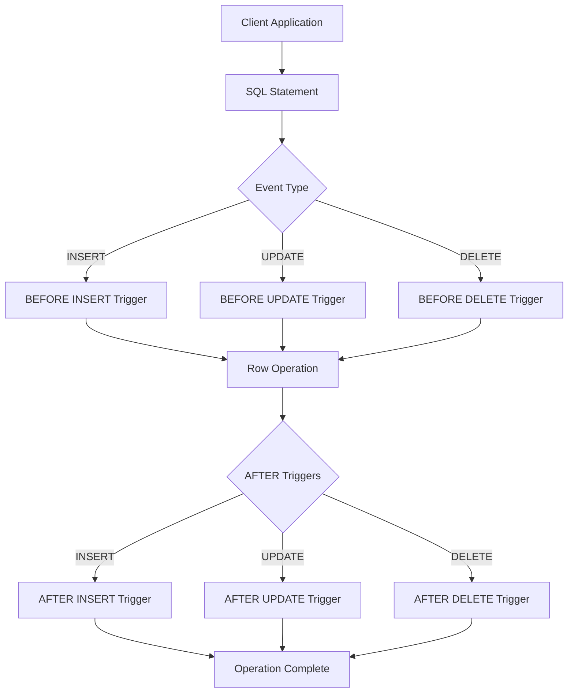
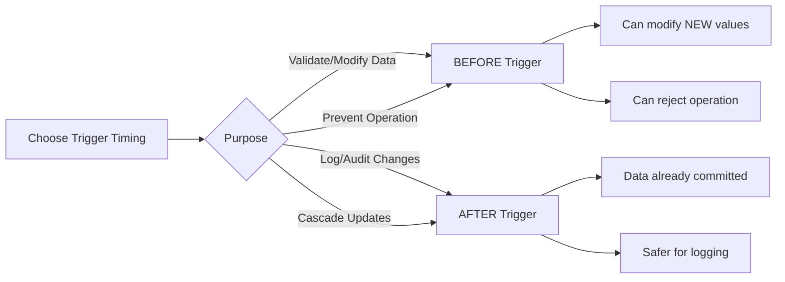
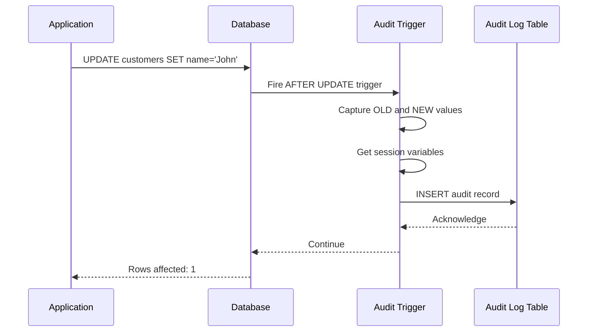
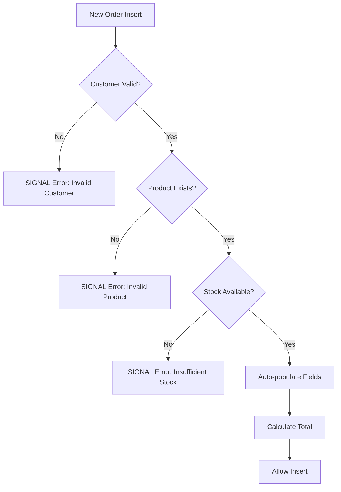
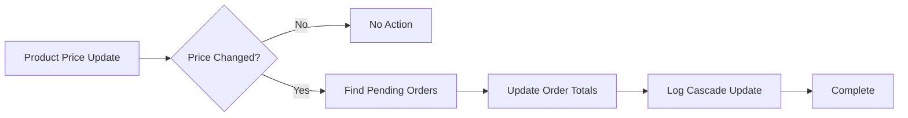
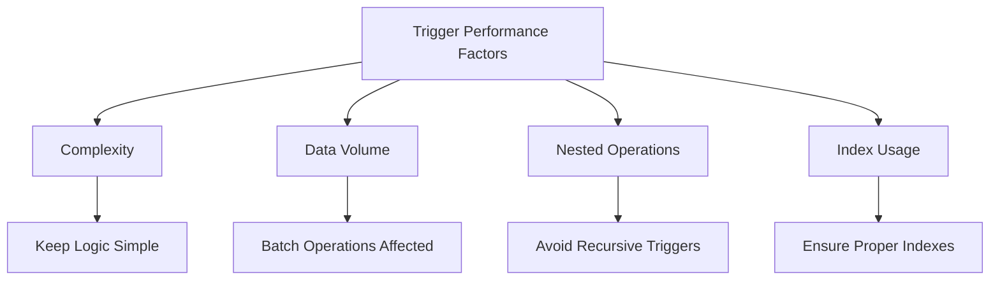
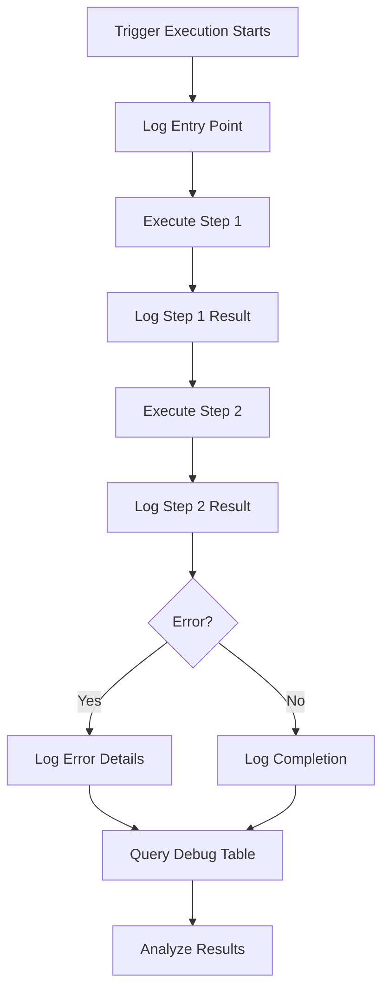
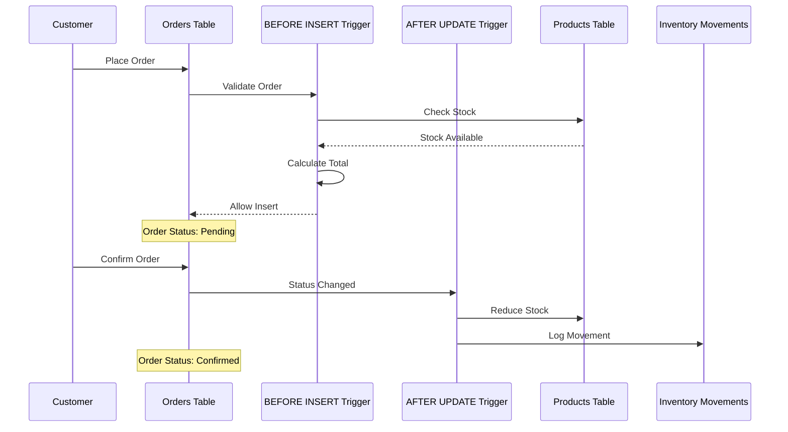

# How to Create MySQL Trigger Best Practices

Author: [nawazdhandala](https://github.com/nawazdhandala)

Tags: MySQL, Triggers, Data Integrity, Automation

Description: Learn to implement MySQL triggers with best practices for audit logging, data validation, and cascading updates while avoiding common pitfalls.

---

MySQL triggers are powerful database objects that automatically execute in response to specific events on a table. When implemented correctly, they serve as guardians of data integrity, ensuring consistency and automating critical operations. This guide explores best practices for creating effective MySQL triggers while avoiding common pitfalls.

## Understanding MySQL Triggers

A trigger is a named database object associated with a table that activates when a particular event occurs. Triggers execute automatically, making them ideal for enforcing business rules, maintaining audit trails, and synchronizing related data.

### Trigger Architecture Overview



## Trigger Types and Timing

MySQL supports six trigger combinations based on two dimensions: timing (BEFORE or AFTER) and event (INSERT, UPDATE, or DELETE).

### Timing Selection Guide



### When to Use Each Trigger Type

| Trigger Type | Best Use Cases |
|-------------|----------------|
| BEFORE INSERT | Data validation, auto-population of fields, format normalization |
| AFTER INSERT | Audit logging, notification triggers, derived table updates |
| BEFORE UPDATE | Validation of changes, preventing unauthorized modifications |
| AFTER UPDATE | Change history tracking, synchronization with other tables |
| BEFORE DELETE | Soft delete implementation, referential integrity checks |
| AFTER DELETE | Archiving deleted records, cleanup operations |

## Creating Your First Trigger

The basic syntax for creating a trigger follows this pattern:

```sql
DELIMITER //

CREATE TRIGGER trigger_name
    trigger_timing trigger_event
    ON table_name
    FOR EACH ROW
BEGIN
    -- Trigger logic here
END //

DELIMITER ;
```

### Example: Basic Data Validation Trigger

```sql
DELIMITER //

CREATE TRIGGER validate_employee_salary
    BEFORE INSERT ON employees
    FOR EACH ROW
BEGIN
    -- Ensure salary is positive
    IF NEW.salary < 0 THEN
        SIGNAL SQLSTATE '45000'
        SET MESSAGE_TEXT = 'Salary cannot be negative';
    END IF;

    -- Ensure hire date is not in the future
    IF NEW.hire_date > CURDATE() THEN
        SIGNAL SQLSTATE '45000'
        SET MESSAGE_TEXT = 'Hire date cannot be in the future';
    END IF;

    -- Normalize email to lowercase
    SET NEW.email = LOWER(TRIM(NEW.email));
END //

DELIMITER ;
```

## Audit Logging Patterns

One of the most common use cases for triggers is maintaining audit trails. Here is a robust pattern for comprehensive audit logging.

### Audit Table Structure

```sql
CREATE TABLE audit_log (
    id BIGINT AUTO_INCREMENT PRIMARY KEY,
    table_name VARCHAR(64) NOT NULL,
    record_id BIGINT NOT NULL,
    action ENUM('INSERT', 'UPDATE', 'DELETE') NOT NULL,
    old_values JSON,
    new_values JSON,
    changed_by VARCHAR(100),
    changed_at TIMESTAMP DEFAULT CURRENT_TIMESTAMP,
    client_ip VARCHAR(45),
    INDEX idx_table_record (table_name, record_id),
    INDEX idx_changed_at (changed_at)
);
```

### Audit Trigger Flow



### Complete Audit Trigger Implementation

```sql
DELIMITER //

-- Audit trigger for INSERT operations
CREATE TRIGGER customers_audit_insert
    AFTER INSERT ON customers
    FOR EACH ROW
BEGIN
    INSERT INTO audit_log (
        table_name,
        record_id,
        action,
        old_values,
        new_values,
        changed_by,
        client_ip
    ) VALUES (
        'customers',
        NEW.id,
        'INSERT',
        NULL,
        JSON_OBJECT(
            'id', NEW.id,
            'name', NEW.name,
            'email', NEW.email,
            'status', NEW.status,
            'created_at', NEW.created_at
        ),
        COALESCE(@current_user, USER()),
        COALESCE(@client_ip, 'unknown')
    );
END //

-- Audit trigger for UPDATE operations
CREATE TRIGGER customers_audit_update
    AFTER UPDATE ON customers
    FOR EACH ROW
BEGIN
    INSERT INTO audit_log (
        table_name,
        record_id,
        action,
        old_values,
        new_values,
        changed_by,
        client_ip
    ) VALUES (
        'customers',
        NEW.id,
        'UPDATE',
        JSON_OBJECT(
            'id', OLD.id,
            'name', OLD.name,
            'email', OLD.email,
            'status', OLD.status,
            'updated_at', OLD.updated_at
        ),
        JSON_OBJECT(
            'id', NEW.id,
            'name', NEW.name,
            'email', NEW.email,
            'status', NEW.status,
            'updated_at', NEW.updated_at
        ),
        COALESCE(@current_user, USER()),
        COALESCE(@client_ip, 'unknown')
    );
END //

-- Audit trigger for DELETE operations
CREATE TRIGGER customers_audit_delete
    AFTER DELETE ON customers
    FOR EACH ROW
BEGIN
    INSERT INTO audit_log (
        table_name,
        record_id,
        action,
        old_values,
        new_values,
        changed_by,
        client_ip
    ) VALUES (
        'customers',
        OLD.id,
        'DELETE',
        JSON_OBJECT(
            'id', OLD.id,
            'name', OLD.name,
            'email', OLD.email,
            'status', OLD.status
        ),
        NULL,
        COALESCE(@current_user, USER()),
        COALESCE(@client_ip, 'unknown')
    );
END //

DELIMITER ;
```

### Setting Session Variables for Audit Context

```sql
-- Set these variables before performing operations
SET @current_user = 'admin@example.com';
SET @client_ip = '192.168.1.100';

-- Now perform your operations
UPDATE customers SET name = 'Jane Doe' WHERE id = 1;
```

## Data Validation Patterns

### Comprehensive Validation Trigger

```sql
DELIMITER //

CREATE TRIGGER validate_order_before_insert
    BEFORE INSERT ON orders
    FOR EACH ROW
BEGIN
    DECLARE customer_exists INT;
    DECLARE product_stock INT;

    -- Verify customer exists and is active
    SELECT COUNT(*) INTO customer_exists
    FROM customers
    WHERE id = NEW.customer_id AND status = 'active';

    IF customer_exists = 0 THEN
        SIGNAL SQLSTATE '45000'
        SET MESSAGE_TEXT = 'Invalid or inactive customer';
    END IF;

    -- Check product availability
    SELECT stock_quantity INTO product_stock
    FROM products
    WHERE id = NEW.product_id;

    IF product_stock IS NULL THEN
        SIGNAL SQLSTATE '45000'
        SET MESSAGE_TEXT = 'Product does not exist';
    END IF;

    IF product_stock < NEW.quantity THEN
        SIGNAL SQLSTATE '45000'
        SET MESSAGE_TEXT = 'Insufficient stock for this order';
    END IF;

    -- Auto-populate calculated fields
    SET NEW.order_date = COALESCE(NEW.order_date, CURDATE());
    SET NEW.status = COALESCE(NEW.status, 'pending');

    -- Calculate order total if not provided
    IF NEW.total_amount IS NULL THEN
        SELECT (price * NEW.quantity) INTO NEW.total_amount
        FROM products
        WHERE id = NEW.product_id;
    END IF;
END //

DELIMITER ;
```

### Validation Decision Flow



## Cascading Updates Pattern

Triggers can maintain data consistency across related tables automatically.

```sql
DELIMITER //

-- When a product price changes, update all pending order totals
CREATE TRIGGER update_pending_orders_on_price_change
    AFTER UPDATE ON products
    FOR EACH ROW
BEGIN
    IF OLD.price <> NEW.price THEN
        UPDATE orders
        SET total_amount = NEW.price * quantity,
            updated_at = NOW()
        WHERE product_id = NEW.id
          AND status = 'pending';

        -- Log the cascade update
        INSERT INTO audit_log (
            table_name,
            record_id,
            action,
            old_values,
            new_values,
            changed_by
        ) VALUES (
            'products',
            NEW.id,
            'UPDATE',
            JSON_OBJECT('price', OLD.price),
            JSON_OBJECT(
                'price', NEW.price,
                'cascade_note', 'Pending orders updated'
            ),
            COALESCE(@current_user, USER())
        );
    END IF;
END //

DELIMITER ;
```

### Cascade Update Flow



## Performance Considerations

### Trigger Performance Impact



### Best Practices for Performance

1. **Keep triggers lightweight**: Move complex business logic to stored procedures or application code.

```sql
-- Bad: Complex logic in trigger
CREATE TRIGGER complex_trigger
    AFTER INSERT ON orders
    FOR EACH ROW
BEGIN
    -- Multiple selects, calculations, and updates
    -- This slows down every insert
END;

-- Better: Delegate to stored procedure
CREATE TRIGGER lightweight_trigger
    AFTER INSERT ON orders
    FOR EACH ROW
BEGIN
    CALL process_new_order(NEW.id);
END;
```

2. **Use conditional execution**: Only perform operations when necessary.

```sql
DELIMITER //

CREATE TRIGGER efficient_audit_update
    AFTER UPDATE ON products
    FOR EACH ROW
BEGIN
    -- Only log if relevant fields changed
    IF OLD.price <> NEW.price
       OR OLD.name <> NEW.name
       OR OLD.status <> NEW.status THEN

        INSERT INTO audit_log (table_name, record_id, action, old_values, new_values)
        VALUES ('products', NEW.id, 'UPDATE',
            JSON_OBJECT('price', OLD.price, 'name', OLD.name, 'status', OLD.status),
            JSON_OBJECT('price', NEW.price, 'name', NEW.name, 'status', NEW.status)
        );
    END IF;
END //

DELIMITER ;
```

3. **Avoid operations on the same table**: This can cause deadlocks and unexpected behavior.

```sql
-- Avoid this pattern - can cause issues
CREATE TRIGGER bad_pattern
    AFTER INSERT ON orders
    FOR EACH ROW
BEGIN
    UPDATE orders SET ... WHERE id = NEW.id; -- Problematic
END;

-- Instead, use BEFORE trigger to modify the incoming row
CREATE TRIGGER good_pattern
    BEFORE INSERT ON orders
    FOR EACH ROW
BEGIN
    SET NEW.calculated_field = some_value;
END;
```

## Debugging Triggers

### Using Debug Tables

Create a debug table to trace trigger execution:

```sql
CREATE TABLE trigger_debug_log (
    id BIGINT AUTO_INCREMENT PRIMARY KEY,
    trigger_name VARCHAR(100),
    debug_message TEXT,
    debug_data JSON,
    logged_at TIMESTAMP DEFAULT CURRENT_TIMESTAMP
);

DELIMITER //

CREATE TRIGGER debuggable_trigger
    BEFORE INSERT ON orders
    FOR EACH ROW
BEGIN
    -- Debug: Log entry point
    INSERT INTO trigger_debug_log (trigger_name, debug_message, debug_data)
    VALUES ('debuggable_trigger', 'Trigger started',
            JSON_OBJECT('customer_id', NEW.customer_id, 'product_id', NEW.product_id));

    -- Your trigger logic here

    -- Debug: Log completion
    INSERT INTO trigger_debug_log (trigger_name, debug_message, debug_data)
    VALUES ('debuggable_trigger', 'Trigger completed',
            JSON_OBJECT('order_total', NEW.total_amount));
END //

DELIMITER ;
```

### Debugging Flow



### Viewing Trigger Information

```sql
-- List all triggers in current database
SHOW TRIGGERS;

-- View specific trigger definition
SHOW CREATE TRIGGER trigger_name;

-- Query information_schema for detailed trigger info
SELECT
    TRIGGER_NAME,
    EVENT_MANIPULATION,
    EVENT_OBJECT_TABLE,
    ACTION_TIMING,
    ACTION_STATEMENT
FROM INFORMATION_SCHEMA.TRIGGERS
WHERE TRIGGER_SCHEMA = DATABASE();
```

## Common Pitfalls and Solutions

### Pitfall 1: Infinite Loops

```sql
-- Problem: Trigger updates same table, causing recursion
CREATE TRIGGER infinite_loop_risk
    AFTER UPDATE ON inventory
    FOR EACH ROW
BEGIN
    UPDATE inventory SET last_checked = NOW() WHERE id = NEW.id;
END;

-- Solution: Use BEFORE trigger or add condition
CREATE TRIGGER safe_update
    BEFORE UPDATE ON inventory
    FOR EACH ROW
BEGIN
    SET NEW.last_checked = NOW();
END;
```

### Pitfall 2: Missing Error Handling

```sql
DELIMITER //

CREATE TRIGGER robust_trigger
    BEFORE INSERT ON transactions
    FOR EACH ROW
BEGIN
    DECLARE EXIT HANDLER FOR SQLEXCEPTION
    BEGIN
        -- Log the error
        INSERT INTO error_log (error_source, error_message, error_time)
        VALUES ('robust_trigger', 'Transaction validation failed', NOW());

        -- Re-raise the error
        RESIGNAL;
    END;

    -- Trigger logic that might fail
    IF NEW.amount > 10000 THEN
        SIGNAL SQLSTATE '45000'
        SET MESSAGE_TEXT = 'Transaction exceeds limit';
    END IF;
END //

DELIMITER ;
```

### Pitfall 3: Ignoring NULL Values

```sql
-- Problem: NULL comparison always returns NULL
IF OLD.value <> NEW.value THEN -- Fails if either is NULL

-- Solution: Handle NULLs explicitly
IF NOT (OLD.value <=> NEW.value) THEN -- NULL-safe comparison
    -- or
IF COALESCE(OLD.value, '') <> COALESCE(NEW.value, '') THEN
```

## Security Considerations

### Restricting Trigger Privileges

```sql
-- Grant limited trigger privileges
GRANT TRIGGER ON database_name.* TO 'app_user'@'localhost';

-- Revoke trigger privilege when not needed
REVOKE TRIGGER ON database_name.* FROM 'app_user'@'localhost';
```

### Preventing Unauthorized Data Modifications

```sql
DELIMITER //

CREATE TRIGGER prevent_unauthorized_delete
    BEFORE DELETE ON critical_data
    FOR EACH ROW
BEGIN
    -- Check if user has permission via session variable
    IF @admin_mode IS NULL OR @admin_mode <> 'enabled' THEN
        SIGNAL SQLSTATE '45000'
        SET MESSAGE_TEXT = 'Unauthorized deletion attempt blocked';
    END IF;
END //

DELIMITER ;
```

## Complete Example: E-commerce Order System

Here is a complete implementation showing multiple triggers working together:

```sql
-- Tables setup
CREATE TABLE products (
    id INT AUTO_INCREMENT PRIMARY KEY,
    name VARCHAR(100) NOT NULL,
    price DECIMAL(10,2) NOT NULL,
    stock_quantity INT NOT NULL DEFAULT 0,
    created_at TIMESTAMP DEFAULT CURRENT_TIMESTAMP,
    updated_at TIMESTAMP DEFAULT CURRENT_TIMESTAMP ON UPDATE CURRENT_TIMESTAMP
);

CREATE TABLE orders (
    id INT AUTO_INCREMENT PRIMARY KEY,
    customer_id INT NOT NULL,
    product_id INT NOT NULL,
    quantity INT NOT NULL,
    unit_price DECIMAL(10,2),
    total_amount DECIMAL(10,2),
    status ENUM('pending', 'confirmed', 'shipped', 'delivered', 'cancelled') DEFAULT 'pending',
    order_date DATE,
    created_at TIMESTAMP DEFAULT CURRENT_TIMESTAMP,
    updated_at TIMESTAMP DEFAULT CURRENT_TIMESTAMP ON UPDATE CURRENT_TIMESTAMP
);

CREATE TABLE inventory_movements (
    id INT AUTO_INCREMENT PRIMARY KEY,
    product_id INT NOT NULL,
    movement_type ENUM('sale', 'restock', 'adjustment', 'return') NOT NULL,
    quantity INT NOT NULL,
    reference_id INT,
    notes TEXT,
    created_at TIMESTAMP DEFAULT CURRENT_TIMESTAMP
);

DELIMITER //

-- Trigger 1: Validate and enrich order before insert
CREATE TRIGGER order_before_insert
    BEFORE INSERT ON orders
    FOR EACH ROW
BEGIN
    DECLARE v_price DECIMAL(10,2);
    DECLARE v_stock INT;

    -- Get product info
    SELECT price, stock_quantity INTO v_price, v_stock
    FROM products WHERE id = NEW.product_id;

    -- Validate stock
    IF v_stock < NEW.quantity THEN
        SIGNAL SQLSTATE '45000'
        SET MESSAGE_TEXT = 'Insufficient stock';
    END IF;

    -- Set calculated fields
    SET NEW.unit_price = v_price;
    SET NEW.total_amount = v_price * NEW.quantity;
    SET NEW.order_date = COALESCE(NEW.order_date, CURDATE());
END //

-- Trigger 2: Update inventory after order confirmed
CREATE TRIGGER order_after_update
    AFTER UPDATE ON orders
    FOR EACH ROW
BEGIN
    -- When order is confirmed, reduce stock
    IF OLD.status = 'pending' AND NEW.status = 'confirmed' THEN
        UPDATE products
        SET stock_quantity = stock_quantity - NEW.quantity
        WHERE id = NEW.product_id;

        INSERT INTO inventory_movements (product_id, movement_type, quantity, reference_id, notes)
        VALUES (NEW.product_id, 'sale', -NEW.quantity, NEW.id, CONCAT('Order #', NEW.id, ' confirmed'));
    END IF;

    -- When order is cancelled, restore stock
    IF OLD.status IN ('pending', 'confirmed') AND NEW.status = 'cancelled' THEN
        IF OLD.status = 'confirmed' THEN
            UPDATE products
            SET stock_quantity = stock_quantity + NEW.quantity
            WHERE id = NEW.product_id;

            INSERT INTO inventory_movements (product_id, movement_type, quantity, reference_id, notes)
            VALUES (NEW.product_id, 'return', NEW.quantity, NEW.id, CONCAT('Order #', NEW.id, ' cancelled'));
        END IF;
    END IF;
END //

-- Trigger 3: Low stock alert
CREATE TRIGGER check_low_stock
    AFTER UPDATE ON products
    FOR EACH ROW
BEGIN
    IF NEW.stock_quantity < 10 AND OLD.stock_quantity >= 10 THEN
        INSERT INTO notifications (type, message, created_at)
        VALUES ('low_stock',
                CONCAT('Low stock alert: ', NEW.name, ' has only ', NEW.stock_quantity, ' units left'),
                NOW());
    END IF;
END //

DELIMITER ;
```

### System Interaction Diagram



## Summary

MySQL triggers are essential tools for maintaining data integrity when used correctly. Remember these key points:

- **Choose timing wisely**: Use BEFORE triggers for validation and modification, AFTER triggers for logging and cascading
- **Keep triggers focused**: One trigger should do one thing well
- **Handle errors gracefully**: Always include proper error handling and meaningful error messages
- **Consider performance**: Avoid complex operations and ensure proper indexing
- **Document thoroughly**: Triggers are invisible to application code, so documentation is critical
- **Test extensively**: Triggers affect all data modifications, so test edge cases carefully

By following these best practices, you can leverage MySQL triggers to build robust, self-maintaining databases that enforce business rules automatically and maintain complete audit trails for compliance and debugging.
