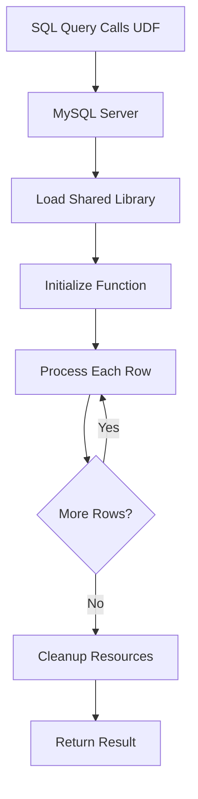
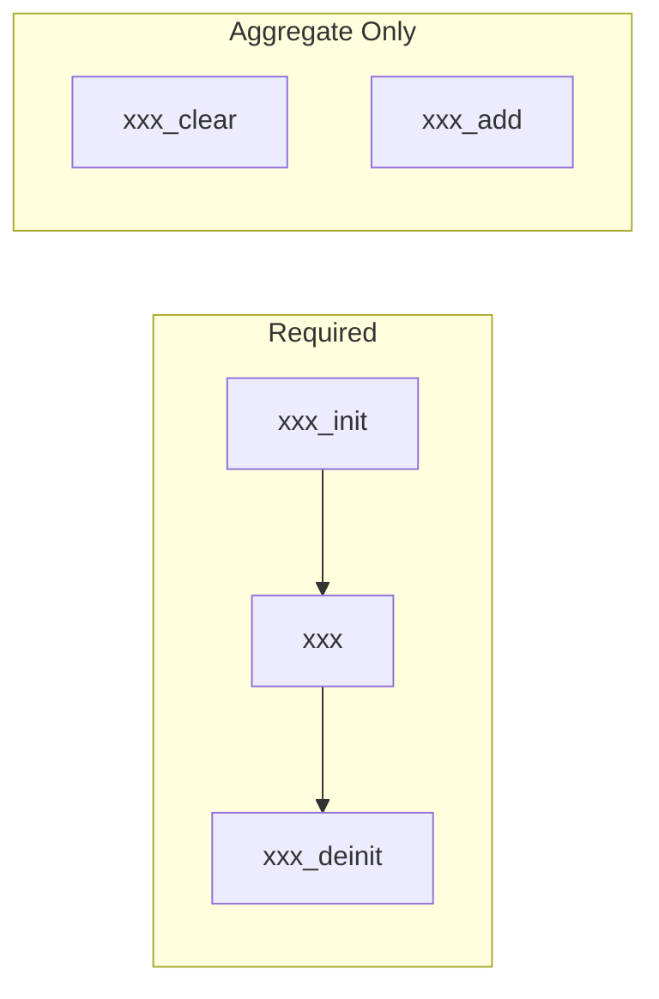
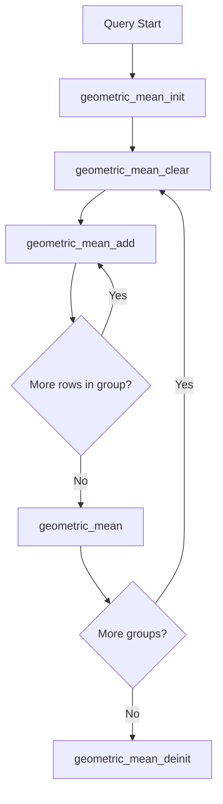
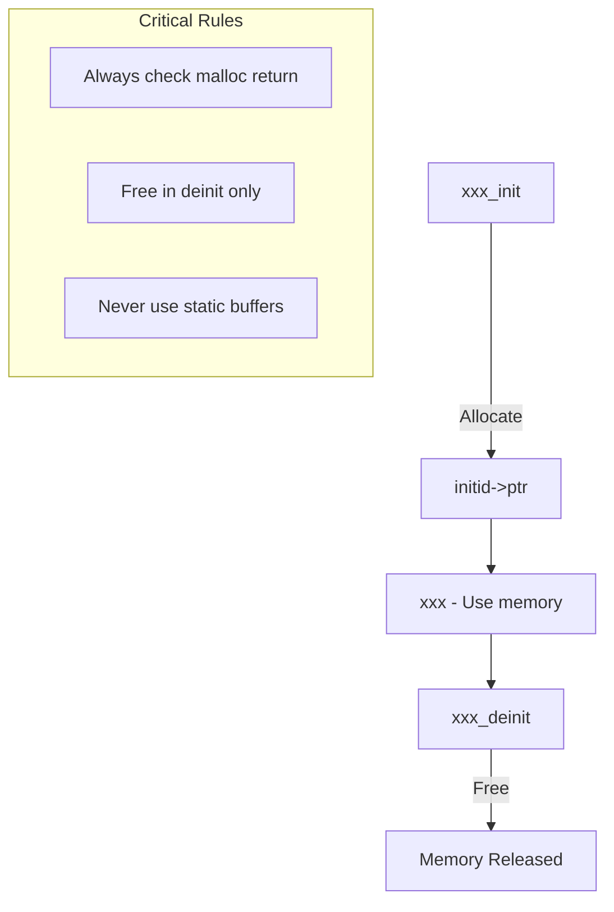
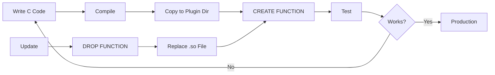

# How to Create MySQL User-Defined Functions

Author: [nawazdhandala](https://github.com/nawazdhandala)

Tags: MySQL, UDF, Custom Functions, C Programming

Description: Learn to create MySQL User-Defined Functions with C programming for custom aggregate functions, string processing, and specialized calculations.

---

MySQL User-Defined Functions (UDFs) allow you to extend MySQL's built-in functionality by writing custom functions in C or C++. These functions can perform complex calculations, string manipulations, or aggregate operations that are not available in standard SQL. This guide walks you through the complete process of creating, compiling, and deploying UDFs.

## What Are MySQL User-Defined Functions?

A User-Defined Function is a compiled shared library that MySQL loads at runtime to provide custom functionality. Unlike stored functions written in SQL, UDFs are written in C/C++ and offer significantly better performance for computationally intensive operations.



## UDF Types

MySQL supports three types of UDFs:

| Type | Description | Use Case |
|------|-------------|----------|
| Simple Functions | Process one row at a time | String manipulation, calculations |
| Aggregate Functions | Process multiple rows | Custom SUM, AVG-like operations |
| Window Functions | Process rows with window context | Running totals, rankings |

## The UDF Interface

Every UDF requires implementing specific functions that MySQL calls during query execution. The naming convention uses your function name as a prefix.



### Required Functions

For a function named `my_function`, you need to implement:

- **my_function_init()** - Called once before processing, for initialization
- **my_function()** - Called for each row or to get the final result
- **my_function_deinit()** - Called after processing, for cleanup

### Additional Functions for Aggregates

- **my_function_clear()** - Reset state for a new group
- **my_function_add()** - Add a row to the current aggregate

## Data Structures

MySQL provides key data structures for UDF development:

### UDF_INIT Structure

```c
typedef struct st_udf_init {
    bool maybe_null;          // Can the function return NULL?
    unsigned int decimals;    // Number of decimal places for REAL
    unsigned long max_length; // Maximum result length for STRING
    char *ptr;                // Pointer for custom data storage
    bool const_item;          // Is the result constant?
    void *extension;          // Reserved for future use
} UDF_INIT;
```

### UDF_ARGS Structure

```c
typedef struct st_udf_args {
    unsigned int arg_count;           // Number of arguments
    enum Item_result *arg_type;       // Type of each argument
    char **args;                      // Pointer to argument values
    unsigned long *lengths;           // Length of string arguments
    char *maybe_null;                 // Whether arguments can be NULL
    char **attributes;                // Attribute names
    unsigned long *attribute_lengths; // Attribute name lengths
} UDF_ARGS;
```

## Creating a Simple UDF

Let us create a function that calculates the Levenshtein distance between two strings - useful for fuzzy string matching.

### Step 1: Write the C Code

Create a file named `levenshtein_udf.c`:

```c
#include <mysql.h>
#include <string.h>
#include <stdlib.h>

#ifdef __cplusplus
extern "C" {
#endif

// Initialization function
bool levenshtein_init(UDF_INIT *initid, UDF_ARGS *args, char *message) {
    // Validate argument count
    if (args->arg_count != 2) {
        strcpy(message, "levenshtein() requires exactly 2 arguments");
        return 1;
    }

    // Ensure both arguments are strings
    args->arg_type[0] = STRING_RESULT;
    args->arg_type[1] = STRING_RESULT;

    // Function can return NULL if inputs are NULL
    initid->maybe_null = 1;

    // Result is an integer
    initid->max_length = 10;

    return 0;
}

// Main function - calculates Levenshtein distance
long long levenshtein(UDF_INIT *initid, UDF_ARGS *args,
                      char *is_null, char *error) {
    // Handle NULL inputs
    if (args->args[0] == NULL || args->args[1] == NULL) {
        *is_null = 1;
        return 0;
    }

    const char *s1 = args->args[0];
    const char *s2 = args->args[1];
    unsigned long len1 = args->lengths[0];
    unsigned long len2 = args->lengths[1];

    // Allocate matrix for dynamic programming
    unsigned int *matrix = (unsigned int *)malloc((len1 + 1) * (len2 + 1) * sizeof(unsigned int));
    if (!matrix) {
        *error = 1;
        return 0;
    }

    // Initialize first column
    for (unsigned long i = 0; i <= len1; i++) {
        matrix[i * (len2 + 1)] = i;
    }

    // Initialize first row
    for (unsigned long j = 0; j <= len2; j++) {
        matrix[j] = j;
    }

    // Fill in the rest of the matrix
    for (unsigned long i = 1; i <= len1; i++) {
        for (unsigned long j = 1; j <= len2; j++) {
            unsigned int cost = (s1[i - 1] == s2[j - 1]) ? 0 : 1;

            unsigned int delete_cost = matrix[(i - 1) * (len2 + 1) + j] + 1;
            unsigned int insert_cost = matrix[i * (len2 + 1) + (j - 1)] + 1;
            unsigned int replace_cost = matrix[(i - 1) * (len2 + 1) + (j - 1)] + cost;

            unsigned int min = delete_cost;
            if (insert_cost < min) min = insert_cost;
            if (replace_cost < min) min = replace_cost;

            matrix[i * (len2 + 1) + j] = min;
        }
    }

    long long result = matrix[len1 * (len2 + 1) + len2];
    free(matrix);

    return result;
}

// Cleanup function
void levenshtein_deinit(UDF_INIT *initid) {
    // No resources to free in this example
}

#ifdef __cplusplus
}
#endif
```

### Step 2: Compile the Shared Library

```bash
# Find MySQL include path
mysql_config --include

# Compile on Linux
gcc -shared -fPIC -o levenshtein_udf.so levenshtein_udf.c \
    $(mysql_config --include) -Wall -O2

# Compile on macOS
gcc -bundle -o levenshtein_udf.so levenshtein_udf.c \
    $(mysql_config --include) -Wall -O2
```

### Step 3: Deploy and Register

```bash
# Copy to MySQL plugin directory
sudo cp levenshtein_udf.so $(mysql_config --plugindir)/

# Set permissions
sudo chmod 755 $(mysql_config --plugindir)/levenshtein_udf.so
```

Register the function in MySQL:

```sql
CREATE FUNCTION levenshtein RETURNS INTEGER
SONAME 'levenshtein_udf.so';
```

### Step 4: Test the Function

```sql
-- Basic usage
SELECT levenshtein('hello', 'hallo');
-- Result: 1

-- Find similar product names
SELECT product_name, levenshtein(product_name, 'iPhone') AS distance
FROM products
WHERE levenshtein(product_name, 'iPhone') < 3
ORDER BY distance;
```

## Creating an Aggregate UDF

Let us create a custom aggregate function that calculates the geometric mean - useful for growth rate calculations.



### Implementation

Create `geometric_mean_udf.c`:

```c
#include <mysql.h>
#include <math.h>
#include <stdlib.h>
#include <string.h>

#ifdef __cplusplus
extern "C" {
#endif

// Structure to hold aggregate state
typedef struct {
    double sum_log;    // Sum of logarithms
    long long count;   // Number of values
    bool has_null;     // Track if any NULL values
    bool has_negative; // Track if any negative values
} GeometricMeanData;

// Initialization
bool geometric_mean_init(UDF_INIT *initid, UDF_ARGS *args, char *message) {
    if (args->arg_count != 1) {
        strcpy(message, "geometric_mean() requires exactly 1 argument");
        return 1;
    }

    // Force argument to be treated as a real number
    args->arg_type[0] = REAL_RESULT;

    // Allocate memory for our state
    GeometricMeanData *data = (GeometricMeanData *)malloc(sizeof(GeometricMeanData));
    if (!data) {
        strcpy(message, "Could not allocate memory");
        return 1;
    }

    initid->ptr = (char *)data;
    initid->maybe_null = 1;
    initid->decimals = 10;

    return 0;
}

// Reset state for a new group
void geometric_mean_clear(UDF_INIT *initid, char *is_null, char *error) {
    GeometricMeanData *data = (GeometricMeanData *)initid->ptr;
    data->sum_log = 0.0;
    data->count = 0;
    data->has_null = false;
    data->has_negative = false;
}

// Add a value to the current group
void geometric_mean_add(UDF_INIT *initid, UDF_ARGS *args,
                        char *is_null, char *error) {
    GeometricMeanData *data = (GeometricMeanData *)initid->ptr;

    if (args->args[0] == NULL) {
        data->has_null = true;
        return;
    }

    double value = *((double *)args->args[0]);

    if (value <= 0) {
        data->has_negative = true;
        return;
    }

    data->sum_log += log(value);
    data->count++;
}

// Calculate and return the result
double geometric_mean(UDF_INIT *initid, UDF_ARGS *args,
                      char *is_null, char *error) {
    GeometricMeanData *data = (GeometricMeanData *)initid->ptr;

    if (data->count == 0 || data->has_negative) {
        *is_null = 1;
        return 0.0;
    }

    return exp(data->sum_log / data->count);
}

// Cleanup
void geometric_mean_deinit(UDF_INIT *initid) {
    if (initid->ptr) {
        free(initid->ptr);
    }
}

#ifdef __cplusplus
}
#endif
```

### Compile and Register

```bash
# Compile
gcc -shared -fPIC -o geometric_mean_udf.so geometric_mean_udf.c \
    $(mysql_config --include) -Wall -O2 -lm

# Deploy
sudo cp geometric_mean_udf.so $(mysql_config --plugindir)/
```

```sql
-- Register as aggregate function
CREATE AGGREGATE FUNCTION geometric_mean RETURNS REAL
SONAME 'geometric_mean_udf.so';

-- Usage example
SELECT
    category,
    geometric_mean(growth_rate) AS avg_growth
FROM annual_sales
GROUP BY category;
```

## String Processing UDF Example

Here is a UDF that performs URL slug generation - converting a string into a URL-friendly format:

```c
#include <mysql.h>
#include <string.h>
#include <stdlib.h>
#include <ctype.h>

#ifdef __cplusplus
extern "C" {
#endif

bool slugify_init(UDF_INIT *initid, UDF_ARGS *args, char *message) {
    if (args->arg_count != 1) {
        strcpy(message, "slugify() requires exactly 1 argument");
        return 1;
    }

    args->arg_type[0] = STRING_RESULT;
    initid->maybe_null = 1;
    initid->max_length = 255;

    // Allocate buffer for result
    initid->ptr = (char *)malloc(256);
    if (!initid->ptr) {
        strcpy(message, "Could not allocate memory");
        return 1;
    }

    return 0;
}

char *slugify(UDF_INIT *initid, UDF_ARGS *args,
              char *result, unsigned long *length,
              char *is_null, char *error) {
    if (args->args[0] == NULL) {
        *is_null = 1;
        return NULL;
    }

    const char *input = args->args[0];
    unsigned long input_len = args->lengths[0];
    char *output = initid->ptr;
    unsigned long out_pos = 0;
    bool last_was_dash = true; // Prevent leading dashes

    for (unsigned long i = 0; i < input_len && out_pos < 254; i++) {
        char c = input[i];

        if (isalnum(c)) {
            output[out_pos++] = tolower(c);
            last_was_dash = false;
        } else if ((c == ' ' || c == '-' || c == '_') && !last_was_dash) {
            output[out_pos++] = '-';
            last_was_dash = true;
        }
    }

    // Remove trailing dash
    if (out_pos > 0 && output[out_pos - 1] == '-') {
        out_pos--;
    }

    output[out_pos] = '\0';
    *length = out_pos;

    return output;
}

void slugify_deinit(UDF_INIT *initid) {
    if (initid->ptr) {
        free(initid->ptr);
    }
}

#ifdef __cplusplus
}
#endif
```

Usage:

```sql
CREATE FUNCTION slugify RETURNS STRING
SONAME 'slugify_udf.so';

SELECT slugify('Hello World! This is a Test');
-- Result: 'hello-world-this-is-a-test'

-- Generate URL slugs for products
UPDATE products
SET slug = slugify(product_name)
WHERE slug IS NULL;
```

## Error Handling Best Practices

Proper error handling is crucial for stable UDFs:

```c
bool my_function_init(UDF_INIT *initid, UDF_ARGS *args, char *message) {
    // 1. Validate argument count
    if (args->arg_count < 1 || args->arg_count > 3) {
        snprintf(message, MYSQL_ERRMSG_SIZE,
                 "my_function() requires 1 to 3 arguments, got %d",
                 args->arg_count);
        return 1;
    }

    // 2. Validate argument types
    if (args->arg_type[0] != STRING_RESULT) {
        strcpy(message, "First argument must be a string");
        return 1;
    }

    // 3. Allocate resources with error checking
    initid->ptr = (char *)malloc(BUFFER_SIZE);
    if (!initid->ptr) {
        strcpy(message, "Memory allocation failed");
        return 1;
    }

    // 4. Set appropriate flags
    initid->maybe_null = 1;
    initid->const_item = 0;

    return 0;
}
```

## Memory Management



Key rules for memory management:

1. **Allocate in init** - Use `malloc()` to allocate memory in the init function
2. **Store pointer** - Save the pointer in `initid->ptr`
3. **Free in deinit** - Always free memory in the deinit function
4. **Check allocations** - Always verify `malloc()` succeeded
5. **Avoid static buffers** - UDFs can be called concurrently

## Deployment Workflow



### Complete Deployment Script

```bash
#!/bin/bash

UDF_NAME="my_function"
SOURCE_FILE="${UDF_NAME}_udf.c"
PLUGIN_DIR=$(mysql_config --plugindir)

# Compile
echo "Compiling ${UDF_NAME}..."
gcc -shared -fPIC -o ${UDF_NAME}_udf.so ${SOURCE_FILE} \
    $(mysql_config --include) -Wall -O2

if [ $? -ne 0 ]; then
    echo "Compilation failed"
    exit 1
fi

# Deploy
echo "Deploying to ${PLUGIN_DIR}..."
sudo cp ${UDF_NAME}_udf.so ${PLUGIN_DIR}/
sudo chmod 755 ${PLUGIN_DIR}/${UDF_NAME}_udf.so

# Register (drops existing first)
echo "Registering function..."
mysql -u root -p << EOF
DROP FUNCTION IF EXISTS ${UDF_NAME};
CREATE FUNCTION ${UDF_NAME} RETURNS STRING
SONAME '${UDF_NAME}_udf.so';
SELECT ${UDF_NAME}('test');
EOF

echo "Deployment complete"
```

## Security Considerations

When deploying UDFs, consider these security aspects:

1. **File System Security**
   - Only trusted users should have write access to the plugin directory
   - Set restrictive permissions on shared library files

2. **Code Review**
   - Review all UDF code for buffer overflows
   - Check for memory leaks
   - Validate all inputs

3. **MySQL Configuration**
   ```ini
   # my.cnf
   [mysqld]
   # Disable CREATE FUNCTION for non-privileged users
   # Require SUPER privilege for UDF creation
   ```

4. **Privilege Control**
   ```sql
   -- Only grant CREATE ROUTINE to trusted users
   GRANT CREATE ROUTINE ON database.* TO 'trusted_user'@'localhost';
   ```

## Performance Optimization Tips

1. **Minimize Memory Allocations**
   - Allocate once in `init`, reuse in main function
   - Use stack variables when possible

2. **Cache Computed Values**
   - Use `initid->ptr` to cache expensive computations
   - Check `initid->const_item` for constant optimization

3. **Avoid Unnecessary Copies**
   - Work directly with input pointers when possible
   - Return pointers to pre-allocated buffers

4. **Use Appropriate Data Types**
   - Match MySQL's internal representations
   - Use `long long` for INTEGER_RESULT
   - Use `double` for REAL_RESULT

## Troubleshooting Common Issues

| Issue | Cause | Solution |
|-------|-------|----------|
| Function not found | Library not in plugin dir | Check `mysql_config --plugindir` |
| Symbol not found | Missing extern "C" | Add extern "C" wrapper |
| Segmentation fault | Buffer overflow | Add bounds checking |
| Memory leak | Missing deinit | Implement proper cleanup |
| Wrong results | Type mismatch | Check arg_type settings |

### Debug Logging

Add debug output to help troubleshoot:

```c
#include <stdio.h>

bool my_function_init(UDF_INIT *initid, UDF_ARGS *args, char *message) {
    FILE *log = fopen("/tmp/udf_debug.log", "a");
    if (log) {
        fprintf(log, "init called with %d args\n", args->arg_count);
        fclose(log);
    }
    // ... rest of init
}
```

## Conclusion

MySQL User-Defined Functions provide a powerful way to extend database functionality with high-performance custom operations. By understanding the UDF interface, properly managing memory, and following security best practices, you can create robust functions that integrate seamlessly with your SQL queries.

Key takeaways:

- UDFs are compiled C/C++ code loaded as shared libraries
- Always implement init, main, and deinit functions
- Aggregate functions require additional clear and add functions
- Memory management is critical - allocate in init, free in deinit
- Test thoroughly before deploying to production

Whether you need custom string functions, specialized calculations, or complex aggregations, UDFs give you the flexibility to implement exactly what your application requires while maintaining excellent performance.
