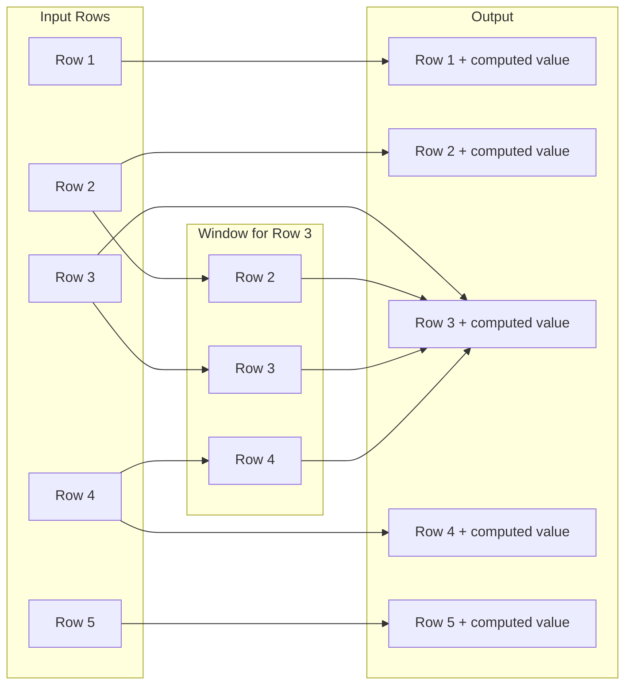
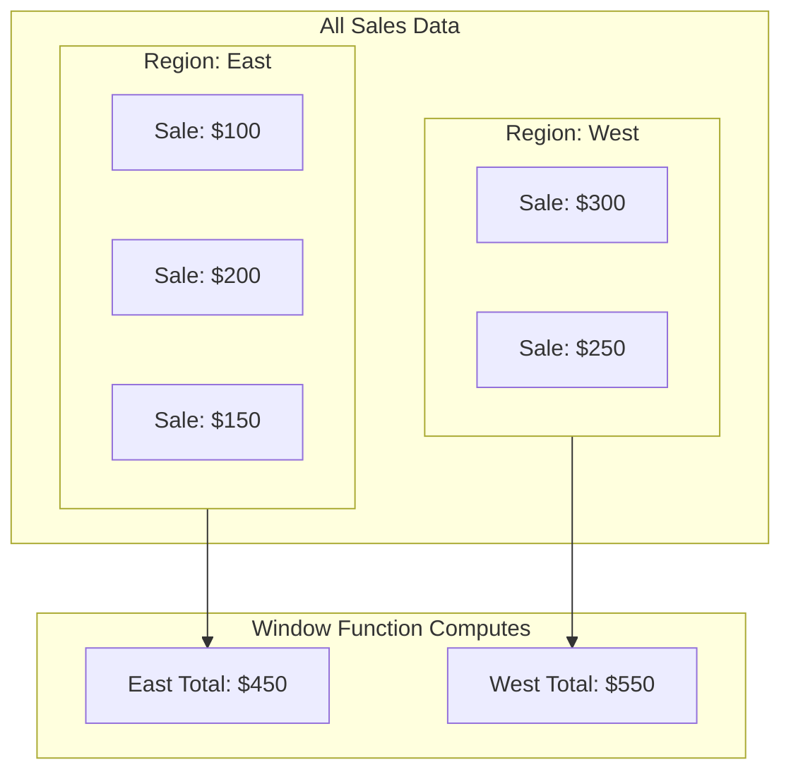
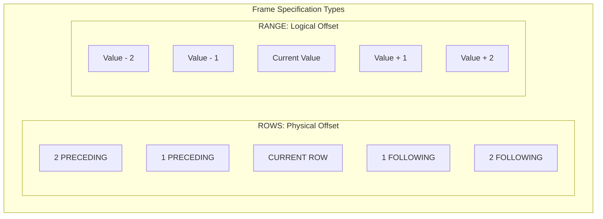
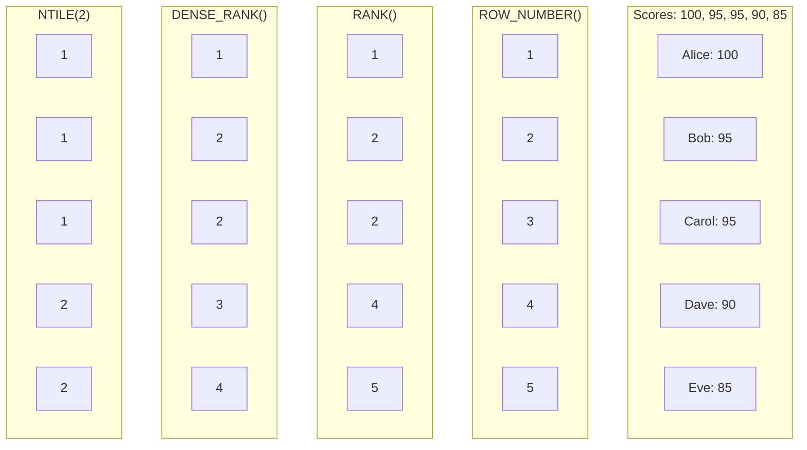
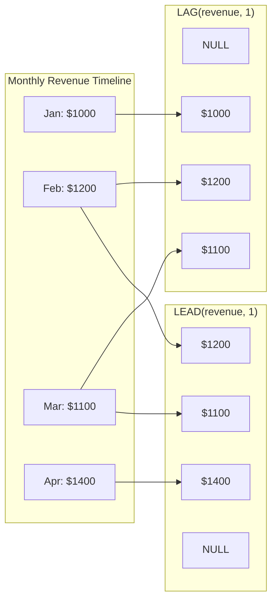
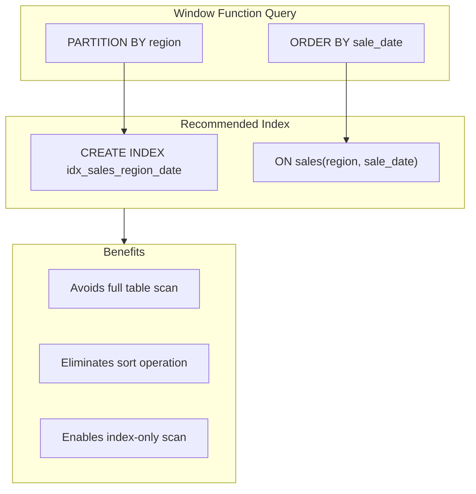

# How to Build MySQL Window Functions Advanced

Author: [nawazdhandala](https://github.com/nawazdhandala)

Tags: MySQL, Window Functions, SQL, Analytics

Description: Learn advanced MySQL window functions for complex analytical queries.

---

> Window functions let you perform calculations across rows related to the current row without collapsing the result set. They are the backbone of modern SQL analytics.

Unlike aggregate functions that group rows into a single output, window functions preserve individual rows while computing values across a defined "window" of related rows. This guide covers advanced patterns for analytics, from the OVER clause and frame specifications to ranking, running totals, and real-world dashboard queries.

---

## Table of Contents

1. What Are Window Functions?
2. The OVER Clause Explained
3. PARTITION BY: Grouping Without Collapsing
4. ORDER BY in Window Functions
5. Frame Specifications (ROWS vs RANGE)
6. Ranking Functions (ROW_NUMBER, RANK, DENSE_RANK, NTILE)
7. Aggregate Window Functions
8. Lead and Lag for Time Series
9. First and Last Value
10. Practical Analytics Examples
11. Performance Considerations
12. Common Pitfalls and Best Practices

---

## 1. What Are Window Functions?

Window functions operate on a set of rows (the "window") related to the current row. They compute a value for every row in the result set based on that window.



Key difference from GROUP BY:

| Feature | GROUP BY | Window Functions |
|---------|----------|------------------|
| Output rows | One per group | All original rows preserved |
| Aggregation | Collapses rows | Computes across window, keeps rows |
| Access to detail | Lost after grouping | Retained alongside computed value |

---

## 2. The OVER Clause Explained

The OVER clause defines the window for computation. It can contain three components:

1. **PARTITION BY**: Divides rows into groups (like GROUP BY but without collapsing)
2. **ORDER BY**: Defines the order of rows within each partition
3. **Frame specification**: Defines which rows relative to the current row to include

Basic syntax:

```sql
-- Window function with OVER clause
SELECT
    column_name,
    window_function() OVER (
        PARTITION BY partition_column    -- Optional: divide into groups
        ORDER BY order_column            -- Optional: order within partitions
        frame_specification              -- Optional: define the window frame
    ) AS computed_column
FROM table_name;
```

Example without any specification (entire result set is the window):

```sql
-- Calculate each sale's percentage of total sales
-- The window is the entire result set
SELECT
    sale_id,
    amount,
    -- SUM(amount) OVER() calculates total across all rows
    amount / SUM(amount) OVER() * 100 AS percent_of_total
FROM sales;
```

Result:

| sale_id | amount | percent_of_total |
|---------|--------|------------------|
| 1       | 100    | 10.00            |
| 2       | 200    | 20.00            |
| 3       | 300    | 30.00            |
| 4       | 400    | 40.00            |

---

## 3. PARTITION BY: Grouping Without Collapsing

PARTITION BY divides the result set into partitions. The window function operates independently on each partition.



```sql
-- Calculate running total and percentage within each region
-- PARTITION BY region creates separate windows for each region
SELECT
    sale_date,
    region,
    amount,
    -- Running total resets for each region
    SUM(amount) OVER (
        PARTITION BY region
        ORDER BY sale_date
    ) AS regional_running_total,
    -- Percentage calculated within each region's total
    ROUND(
        amount / SUM(amount) OVER (PARTITION BY region) * 100,
        2
    ) AS percent_of_region
FROM sales
ORDER BY region, sale_date;
```

Result:

| sale_date  | region | amount | regional_running_total | percent_of_region |
|------------|--------|--------|------------------------|-------------------|
| 2026-01-01 | East   | 100    | 100                    | 22.22             |
| 2026-01-02 | East   | 200    | 300                    | 44.44             |
| 2026-01-03 | East   | 150    | 450                    | 33.33             |
| 2026-01-01 | West   | 300    | 300                    | 54.55             |
| 2026-01-02 | West   | 250    | 550                    | 45.45             |

---

## 4. ORDER BY in Window Functions

ORDER BY within OVER determines the sequence of rows for:
- Ranking functions (which row gets rank 1, 2, 3...)
- Running calculations (cumulative sums, moving averages)
- Frame specifications (which rows come "before" or "after")

```sql
-- Order matters for running totals and rankings
-- Without ORDER BY, the window includes all partition rows
-- With ORDER BY, the default frame is UNBOUNDED PRECEDING to CURRENT ROW
SELECT
    sale_date,
    salesperson,
    amount,
    -- Running total ordered by date
    SUM(amount) OVER (
        PARTITION BY salesperson
        ORDER BY sale_date
    ) AS running_total,
    -- Row number based on amount (highest first)
    ROW_NUMBER() OVER (
        PARTITION BY salesperson
        ORDER BY amount DESC
    ) AS rank_by_amount
FROM sales;
```

---

## 5. Frame Specifications (ROWS vs RANGE)

Frame specifications define exactly which rows to include in the window relative to the current row.



### ROWS: Physical Row Count

ROWS counts actual rows regardless of their values.

```sql
-- 3-day moving average using ROWS
-- ROWS BETWEEN 2 PRECEDING AND CURRENT ROW includes exactly 3 rows
SELECT
    sale_date,
    daily_revenue,
    -- Moving average of current row and 2 preceding rows
    ROUND(
        AVG(daily_revenue) OVER (
            ORDER BY sale_date
            ROWS BETWEEN 2 PRECEDING AND CURRENT ROW
        ),
        2
    ) AS moving_avg_3day,
    -- Sum of current and next 2 rows (forward looking)
    SUM(daily_revenue) OVER (
        ORDER BY sale_date
        ROWS BETWEEN CURRENT ROW AND 2 FOLLOWING
    ) AS next_3day_total
FROM daily_sales;
```

### RANGE: Logical Value Range

RANGE includes rows whose ORDER BY values fall within a range.

```sql
-- Include all rows with the same date (handles duplicates)
-- RANGE groups rows with equal ORDER BY values together
SELECT
    sale_date,
    amount,
    -- All sales on the same date are summed together
    SUM(amount) OVER (
        ORDER BY sale_date
        RANGE BETWEEN UNBOUNDED PRECEDING AND CURRENT ROW
    ) AS cumulative_by_date
FROM sales;
```

### Common Frame Specifications

```sql
-- Full partition (default without ORDER BY)
ROWS BETWEEN UNBOUNDED PRECEDING AND UNBOUNDED FOLLOWING

-- Running total (default with ORDER BY)
ROWS BETWEEN UNBOUNDED PRECEDING AND CURRENT ROW

-- Centered moving window
ROWS BETWEEN 3 PRECEDING AND 3 FOLLOWING

-- Previous row only
ROWS BETWEEN 1 PRECEDING AND 1 PRECEDING

-- Current row to end
ROWS BETWEEN CURRENT ROW AND UNBOUNDED FOLLOWING
```

### Practical Example: 7-Day Rolling Metrics

```sql
-- Calculate 7-day rolling metrics for a dashboard
-- Useful for smoothing out daily fluctuations
SELECT
    report_date,
    daily_active_users,
    daily_revenue,
    -- 7-day rolling average of users
    ROUND(
        AVG(daily_active_users) OVER (
            ORDER BY report_date
            ROWS BETWEEN 6 PRECEDING AND CURRENT ROW
        ),
        0
    ) AS rolling_7day_avg_users,
    -- 7-day rolling sum of revenue
    SUM(daily_revenue) OVER (
        ORDER BY report_date
        ROWS BETWEEN 6 PRECEDING AND CURRENT ROW
    ) AS rolling_7day_revenue,
    -- 7-day min and max for range
    MIN(daily_revenue) OVER (
        ORDER BY report_date
        ROWS BETWEEN 6 PRECEDING AND CURRENT ROW
    ) AS rolling_7day_min,
    MAX(daily_revenue) OVER (
        ORDER BY report_date
        ROWS BETWEEN 6 PRECEDING AND CURRENT ROW
    ) AS rolling_7day_max
FROM daily_metrics
ORDER BY report_date;
```

---

## 6. Ranking Functions

MySQL provides four ranking functions, each with different behavior for ties.



### ROW_NUMBER: Unique Sequential Numbers

```sql
-- ROW_NUMBER assigns unique numbers even for ties
-- Useful for pagination and deduplication
SELECT
    employee_id,
    department,
    salary,
    -- Unique row number within each department
    ROW_NUMBER() OVER (
        PARTITION BY department
        ORDER BY salary DESC
    ) AS salary_rank
FROM employees;
```

### RANK: Gaps After Ties

```sql
-- RANK creates gaps after tied values
-- If two rows tie for rank 2, the next rank is 4
SELECT
    student_name,
    exam_score,
    -- Rank with gaps for ties
    RANK() OVER (ORDER BY exam_score DESC) AS exam_rank
FROM exam_results;

-- Result:
-- Alice  | 100 | 1
-- Bob    | 95  | 2
-- Carol  | 95  | 2  (tie)
-- Dave   | 90  | 4  (gap: no rank 3)
-- Eve    | 85  | 5
```

### DENSE_RANK: No Gaps After Ties

```sql
-- DENSE_RANK has no gaps after ties
-- If two rows tie for rank 2, the next rank is 3
SELECT
    product_name,
    sales_count,
    -- Dense rank without gaps
    DENSE_RANK() OVER (ORDER BY sales_count DESC) AS popularity_rank
FROM products;

-- Result:
-- Widget A | 1000 | 1
-- Widget B | 800  | 2
-- Widget C | 800  | 2  (tie)
-- Widget D | 600  | 3  (no gap: rank continues at 3)
```

### NTILE: Divide into Buckets

```sql
-- NTILE divides rows into n approximately equal groups
-- Useful for percentiles and quartiles
SELECT
    customer_id,
    total_purchases,
    -- Divide customers into 4 quartiles
    NTILE(4) OVER (ORDER BY total_purchases DESC) AS spending_quartile,
    -- Divide into 10 deciles for finer granularity
    NTILE(10) OVER (ORDER BY total_purchases DESC) AS spending_decile
FROM customer_summary;

-- Quartile 1 = top 25% spenders
-- Quartile 4 = bottom 25% spenders
```

### Practical Ranking Example: Top N Per Group

```sql
-- Find top 3 products by revenue in each category
-- Uses ROW_NUMBER in a subquery pattern
SELECT *
FROM (
    SELECT
        category,
        product_name,
        revenue,
        -- Rank products within each category
        ROW_NUMBER() OVER (
            PARTITION BY category
            ORDER BY revenue DESC
        ) AS rank_in_category
    FROM products
) ranked
WHERE rank_in_category <= 3
ORDER BY category, rank_in_category;
```

---

## 7. Aggregate Window Functions

Standard aggregate functions become window functions when used with OVER.

```sql
-- Multiple aggregate windows in one query
-- Each calculation uses the entire partition or a frame
SELECT
    order_date,
    product_category,
    order_amount,
    -- Sum across entire partition (category total)
    SUM(order_amount) OVER (
        PARTITION BY product_category
    ) AS category_total,
    -- Running sum within partition
    SUM(order_amount) OVER (
        PARTITION BY product_category
        ORDER BY order_date
    ) AS category_running_total,
    -- Count of orders in category
    COUNT(*) OVER (
        PARTITION BY product_category
    ) AS orders_in_category,
    -- Average order in category
    ROUND(
        AVG(order_amount) OVER (PARTITION BY product_category),
        2
    ) AS category_avg,
    -- Deviation from category average
    ROUND(
        order_amount - AVG(order_amount) OVER (PARTITION BY product_category),
        2
    ) AS deviation_from_avg
FROM orders
ORDER BY product_category, order_date;
```

### Running Totals and Cumulative Metrics

```sql
-- Calculate cumulative metrics for financial reporting
SELECT
    fiscal_month,
    monthly_revenue,
    monthly_expenses,
    -- Cumulative revenue (year to date)
    SUM(monthly_revenue) OVER (
        ORDER BY fiscal_month
    ) AS ytd_revenue,
    -- Cumulative expenses
    SUM(monthly_expenses) OVER (
        ORDER BY fiscal_month
    ) AS ytd_expenses,
    -- Cumulative profit
    SUM(monthly_revenue - monthly_expenses) OVER (
        ORDER BY fiscal_month
    ) AS ytd_profit,
    -- Cumulative profit margin
    ROUND(
        SUM(monthly_revenue - monthly_expenses) OVER (ORDER BY fiscal_month) /
        SUM(monthly_revenue) OVER (ORDER BY fiscal_month) * 100,
        2
    ) AS ytd_profit_margin_pct
FROM monthly_financials
WHERE fiscal_year = 2026
ORDER BY fiscal_month;
```

---

## 8. LAG and LEAD for Time Series

LAG looks at previous rows. LEAD looks at following rows. Both are essential for period-over-period comparisons.



### Basic LAG and LEAD

```sql
-- Compare each month to previous and next month
SELECT
    report_month,
    revenue,
    -- Previous month revenue (default offset is 1)
    LAG(revenue) OVER (ORDER BY report_month) AS prev_month_revenue,
    -- Next month revenue
    LEAD(revenue) OVER (ORDER BY report_month) AS next_month_revenue,
    -- Month over month change
    revenue - LAG(revenue) OVER (ORDER BY report_month) AS mom_change,
    -- Month over month percentage change
    ROUND(
        (revenue - LAG(revenue) OVER (ORDER BY report_month)) /
        LAG(revenue) OVER (ORDER BY report_month) * 100,
        2
    ) AS mom_change_pct
FROM monthly_revenue
ORDER BY report_month;
```

### LAG with Offset and Default Value

```sql
-- Compare to same month last year (12 months ago)
-- Provide default value to handle missing historical data
SELECT
    report_month,
    revenue,
    -- Same month last year (offset of 12)
    LAG(revenue, 12, 0) OVER (
        ORDER BY report_month
    ) AS same_month_last_year,
    -- Year over year change
    revenue - LAG(revenue, 12, 0) OVER (
        ORDER BY report_month
    ) AS yoy_change,
    -- Year over year percentage (handle division by zero)
    CASE
        WHEN LAG(revenue, 12, 0) OVER (ORDER BY report_month) = 0
        THEN NULL
        ELSE ROUND(
            (revenue - LAG(revenue, 12) OVER (ORDER BY report_month)) /
            LAG(revenue, 12) OVER (ORDER BY report_month) * 100,
            2
        )
    END AS yoy_change_pct
FROM monthly_revenue
ORDER BY report_month;
```

### Time Between Events

```sql
-- Calculate time between customer orders
SELECT
    customer_id,
    order_id,
    order_date,
    -- Previous order date for this customer
    LAG(order_date) OVER (
        PARTITION BY customer_id
        ORDER BY order_date
    ) AS prev_order_date,
    -- Days since last order
    DATEDIFF(
        order_date,
        LAG(order_date) OVER (
            PARTITION BY customer_id
            ORDER BY order_date
        )
    ) AS days_since_last_order
FROM orders
ORDER BY customer_id, order_date;
```

---

## 9. FIRST_VALUE and LAST_VALUE

These functions return values from the first or last row in the window frame.

```sql
-- Compare each row to the first and last in the partition
SELECT
    employee_id,
    department,
    hire_date,
    salary,
    -- First hired employee's salary in department
    FIRST_VALUE(salary) OVER (
        PARTITION BY department
        ORDER BY hire_date
    ) AS first_hire_salary,
    -- Most recent hire's salary (need full frame for LAST_VALUE)
    LAST_VALUE(salary) OVER (
        PARTITION BY department
        ORDER BY hire_date
        ROWS BETWEEN UNBOUNDED PRECEDING AND UNBOUNDED FOLLOWING
    ) AS latest_hire_salary,
    -- Salary difference from first hire
    salary - FIRST_VALUE(salary) OVER (
        PARTITION BY department
        ORDER BY hire_date
    ) AS diff_from_first_hire
FROM employees
ORDER BY department, hire_date;
```

**Important:** LAST_VALUE with the default frame (UNBOUNDED PRECEDING to CURRENT ROW) only sees up to the current row. Use `ROWS BETWEEN UNBOUNDED PRECEDING AND UNBOUNDED FOLLOWING` to see the actual last row.

---

## 10. Practical Analytics Examples

### Example 1: Customer Retention Cohort Analysis

```sql
-- Cohort analysis: track customer retention by signup month
WITH customer_cohorts AS (
    -- Assign each customer to their signup month cohort
    SELECT
        customer_id,
        DATE_FORMAT(signup_date, '%Y-%m-01') AS cohort_month,
        signup_date
    FROM customers
),
monthly_activity AS (
    -- Get monthly activity for each customer
    SELECT
        c.customer_id,
        c.cohort_month,
        DATE_FORMAT(o.order_date, '%Y-%m-01') AS activity_month,
        -- Calculate months since signup
        TIMESTAMPDIFF(
            MONTH,
            c.cohort_month,
            DATE_FORMAT(o.order_date, '%Y-%m-01')
        ) AS months_since_signup
    FROM customer_cohorts c
    JOIN orders o ON c.customer_id = o.customer_id
),
cohort_sizes AS (
    -- Get cohort sizes
    SELECT
        cohort_month,
        COUNT(DISTINCT customer_id) AS cohort_size
    FROM customer_cohorts
    GROUP BY cohort_month
),
retention AS (
    -- Calculate retained customers per cohort per month
    SELECT
        cohort_month,
        months_since_signup,
        COUNT(DISTINCT customer_id) AS retained_customers
    FROM monthly_activity
    GROUP BY cohort_month, months_since_signup
)
SELECT
    r.cohort_month,
    r.months_since_signup,
    cs.cohort_size,
    r.retained_customers,
    -- Retention rate
    ROUND(r.retained_customers / cs.cohort_size * 100, 2) AS retention_rate,
    -- Previous month retention for comparison
    LAG(ROUND(r.retained_customers / cs.cohort_size * 100, 2)) OVER (
        PARTITION BY r.cohort_month
        ORDER BY r.months_since_signup
    ) AS prev_month_retention,
    -- Retention drop from previous month
    ROUND(r.retained_customers / cs.cohort_size * 100, 2) -
    LAG(ROUND(r.retained_customers / cs.cohort_size * 100, 2)) OVER (
        PARTITION BY r.cohort_month
        ORDER BY r.months_since_signup
    ) AS retention_drop
FROM retention r
JOIN cohort_sizes cs ON r.cohort_month = cs.cohort_month
ORDER BY r.cohort_month, r.months_since_signup;
```

### Example 2: Sales Performance Dashboard

```sql
-- Comprehensive sales rep performance metrics
SELECT
    sale_date,
    sales_rep,
    sale_amount,
    -- Running total for the rep
    SUM(sale_amount) OVER (
        PARTITION BY sales_rep
        ORDER BY sale_date
    ) AS running_total,
    -- Rep's rank by daily performance
    RANK() OVER (
        PARTITION BY sale_date
        ORDER BY sale_amount DESC
    ) AS daily_rank,
    -- 7-day moving average
    ROUND(
        AVG(sale_amount) OVER (
            PARTITION BY sales_rep
            ORDER BY sale_date
            ROWS BETWEEN 6 PRECEDING AND CURRENT ROW
        ),
        2
    ) AS moving_avg_7day,
    -- Percentage of team total that day
    ROUND(
        sale_amount / SUM(sale_amount) OVER (PARTITION BY sale_date) * 100,
        2
    ) AS pct_of_daily_total,
    -- Comparison to rep's best day
    sale_amount - MAX(sale_amount) OVER (PARTITION BY sales_rep) AS diff_from_best,
    -- Running count of sales
    COUNT(*) OVER (
        PARTITION BY sales_rep
        ORDER BY sale_date
    ) AS cumulative_sale_count
FROM sales
ORDER BY sale_date, sales_rep;
```

### Example 3: Product Inventory Analysis

```sql
-- Inventory movement analysis with window functions
SELECT
    movement_date,
    product_id,
    movement_type,
    quantity,
    -- Running inventory balance
    SUM(
        CASE WHEN movement_type = 'IN' THEN quantity ELSE -quantity END
    ) OVER (
        PARTITION BY product_id
        ORDER BY movement_date, movement_id
    ) AS running_balance,
    -- Days since last movement
    DATEDIFF(
        movement_date,
        LAG(movement_date) OVER (
            PARTITION BY product_id
            ORDER BY movement_date, movement_id
        )
    ) AS days_since_last_movement,
    -- 30-day total outbound
    SUM(
        CASE WHEN movement_type = 'OUT' THEN quantity ELSE 0 END
    ) OVER (
        PARTITION BY product_id
        ORDER BY movement_date
        RANGE BETWEEN INTERVAL 30 DAY PRECEDING AND CURRENT ROW
    ) AS outbound_30day,
    -- Flag low inventory (below 30-day average outbound)
    CASE
        WHEN SUM(
            CASE WHEN movement_type = 'IN' THEN quantity ELSE -quantity END
        ) OVER (
            PARTITION BY product_id
            ORDER BY movement_date, movement_id
        ) < AVG(
            CASE WHEN movement_type = 'OUT' THEN quantity ELSE 0 END
        ) OVER (
            PARTITION BY product_id
        ) * 30
        THEN 'LOW'
        ELSE 'OK'
    END AS inventory_status
FROM inventory_movements
ORDER BY product_id, movement_date;
```

### Example 4: Sessionization and Funnel Analysis

```sql
-- Break user events into sessions (30-minute inactivity gap)
WITH sessionized AS (
    SELECT
        user_id,
        event_timestamp,
        event_type,
        page_url,
        -- Time since last event
        TIMESTAMPDIFF(
            MINUTE,
            LAG(event_timestamp) OVER (
                PARTITION BY user_id
                ORDER BY event_timestamp
            ),
            event_timestamp
        ) AS minutes_since_last_event,
        -- Flag new session (first event or gap > 30 min)
        CASE
            WHEN LAG(event_timestamp) OVER (
                PARTITION BY user_id
                ORDER BY event_timestamp
            ) IS NULL
            OR TIMESTAMPDIFF(
                MINUTE,
                LAG(event_timestamp) OVER (
                    PARTITION BY user_id
                    ORDER BY event_timestamp
                ),
                event_timestamp
            ) > 30
            THEN 1
            ELSE 0
        END AS is_new_session
    FROM user_events
),
sessions AS (
    SELECT
        *,
        -- Create session ID by summing new session flags
        SUM(is_new_session) OVER (
            PARTITION BY user_id
            ORDER BY event_timestamp
        ) AS session_number
    FROM sessionized
)
SELECT
    user_id,
    session_number,
    event_timestamp,
    event_type,
    -- Event order within session
    ROW_NUMBER() OVER (
        PARTITION BY user_id, session_number
        ORDER BY event_timestamp
    ) AS event_order_in_session,
    -- First page of session
    FIRST_VALUE(page_url) OVER (
        PARTITION BY user_id, session_number
        ORDER BY event_timestamp
    ) AS session_landing_page,
    -- Session duration so far
    TIMESTAMPDIFF(
        SECOND,
        FIRST_VALUE(event_timestamp) OVER (
            PARTITION BY user_id, session_number
            ORDER BY event_timestamp
        ),
        event_timestamp
    ) AS seconds_in_session
FROM sessions
ORDER BY user_id, event_timestamp;
```

---

## 11. Performance Considerations

### Index Strategy



```sql
-- Create composite index matching PARTITION BY + ORDER BY
-- Column order should match: partition columns first, then order columns
CREATE INDEX idx_sales_region_date ON sales(region, sale_date);

-- For multiple window functions, consider covering index
CREATE INDEX idx_sales_covering ON sales(
    region,      -- PARTITION BY column
    sale_date,   -- ORDER BY column
    amount       -- Selected column (makes it a covering index)
);
```

### Named Windows for Reusability

```sql
-- Define window once, use multiple times
-- Improves readability and may help optimizer
SELECT
    sale_date,
    region,
    amount,
    SUM(amount) OVER regional_sales AS regional_total,
    AVG(amount) OVER regional_sales AS regional_avg,
    COUNT(*) OVER regional_sales AS regional_count,
    ROW_NUMBER() OVER regional_sales AS row_in_region
FROM sales
WINDOW regional_sales AS (
    PARTITION BY region
    ORDER BY sale_date
)
ORDER BY region, sale_date;
```

### Avoid Multiple Passes

```sql
-- Inefficient: multiple subqueries with different windows
-- Each subquery may scan the table separately
SELECT
    *,
    (SELECT SUM(amount) FROM sales s2 WHERE s2.region = s1.region) AS total
FROM sales s1;

-- Efficient: single window function
-- One table scan with window computation
SELECT
    *,
    SUM(amount) OVER (PARTITION BY region) AS total
FROM sales;
```

---

## 12. Common Pitfalls and Best Practices

### Pitfall 1: LAST_VALUE Default Frame

```sql
-- Wrong: LAST_VALUE only sees up to current row
SELECT
    id,
    value,
    LAST_VALUE(value) OVER (ORDER BY id) AS wrong_last  -- Not what you expect
FROM data;

-- Correct: Specify full frame
SELECT
    id,
    value,
    LAST_VALUE(value) OVER (
        ORDER BY id
        ROWS BETWEEN UNBOUNDED PRECEDING AND UNBOUNDED FOLLOWING
    ) AS correct_last
FROM data;
```

### Pitfall 2: NULL Handling

```sql
-- NULLs can affect calculations unexpectedly
-- COUNT(*) counts all rows, COUNT(column) excludes NULLs
SELECT
    id,
    value,
    COUNT(*) OVER () AS total_rows,
    COUNT(value) OVER () AS non_null_values,
    -- Use COALESCE for safe calculations
    SUM(COALESCE(value, 0)) OVER () AS sum_with_null_as_zero
FROM data;
```

### Pitfall 3: ORDER BY Affects Default Frame

```sql
-- Without ORDER BY: frame is entire partition
SELECT SUM(amount) OVER (PARTITION BY region) AS region_total FROM sales;

-- With ORDER BY: frame defaults to UNBOUNDED PRECEDING TO CURRENT ROW
-- This creates a running total, not a partition total
SELECT SUM(amount) OVER (
    PARTITION BY region
    ORDER BY sale_date
) AS running_total FROM sales;

-- To get partition total with ORDER BY, specify frame explicitly
SELECT SUM(amount) OVER (
    PARTITION BY region
    ORDER BY sale_date
    ROWS BETWEEN UNBOUNDED PRECEDING AND UNBOUNDED FOLLOWING
) AS region_total FROM sales;
```

### Best Practices Summary

| Practice | Recommendation |
|----------|----------------|
| Index strategy | Create composite indexes matching PARTITION BY + ORDER BY columns |
| Named windows | Use WINDOW clause when reusing the same window definition |
| Frame specification | Always explicit when using LAST_VALUE or when ORDER BY is present |
| NULL handling | Use COALESCE or IFNULL for predictable behavior |
| Testing | Verify results on small datasets before running on production |
| Performance | Check EXPLAIN output for sort operations and temp tables |

---

## Summary

Window functions transform how you write analytical SQL. Instead of complex self-joins and correlated subqueries, you can express sophisticated calculations declaratively.

| Use Case | Window Function |
|----------|-----------------|
| Running totals | SUM() OVER (ORDER BY ...) |
| Moving averages | AVG() OVER (... ROWS BETWEEN n PRECEDING AND CURRENT ROW) |
| Rank within groups | ROW_NUMBER/RANK/DENSE_RANK() OVER (PARTITION BY ... ORDER BY ...) |
| Period comparisons | LAG/LEAD() OVER (ORDER BY ...) |
| Percentiles | NTILE() OVER (ORDER BY ...) |
| First/last in group | FIRST_VALUE/LAST_VALUE() OVER (...) |
| Percentage of total | value / SUM(value) OVER (PARTITION BY ...) |

Master these patterns and your analytics queries will become more readable, maintainable, and performant.

---

**Related Reading:**

- [MySQL 8.0 Window Functions Documentation](https://dev.mysql.com/doc/refman/8.0/en/window-functions.html)
- [SQL Performance Explained](https://use-the-index-luke.com/)
