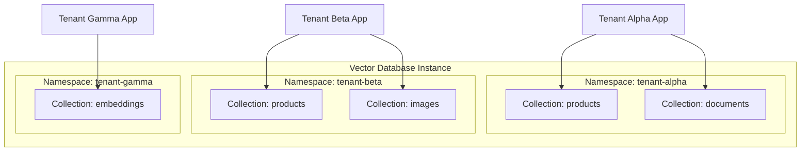
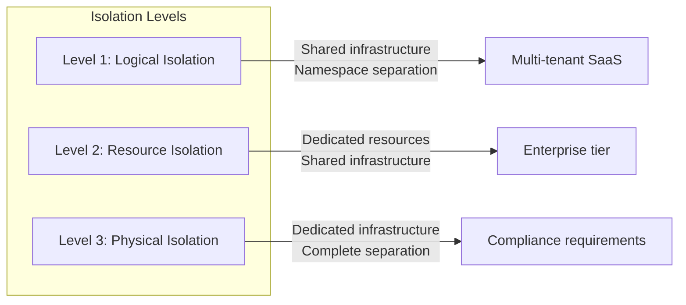
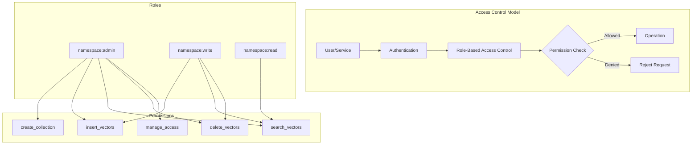
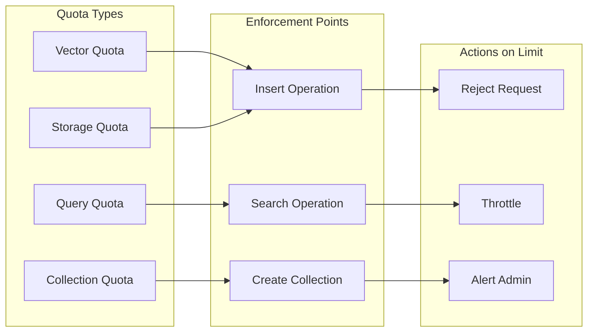
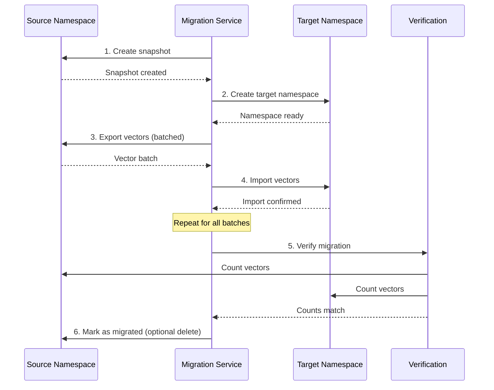

# How to Create Namespace Management

Author: [nawazdhandala](https://github.com/nawazdhandala)

Tags: Vector Database, Namespace Management, Multi-Tenancy, Data Isolation

Description: Learn to implement namespace management for vector databases with tenant isolation, access control, and resource allocation for multi-tenant applications.

---

Vector databases have become essential infrastructure for AI-powered applications, from semantic search to recommendation systems. As these applications scale to serve multiple customers or teams, namespace management becomes critical for organizing data, ensuring isolation, and maintaining security. This guide walks you through implementing robust namespace management for vector databases.

## Understanding Namespaces in Vector Databases

A namespace is a logical partition within a vector database that isolates collections of vectors from one another. Think of namespaces as separate containers that allow multiple tenants, projects, or applications to coexist within the same database infrastructure without interfering with each other.



## Namespace Design Patterns

### 1. Hierarchical Namespace Structure

Design your namespaces with a clear hierarchy that reflects your organizational structure:

```python
from dataclasses import dataclass
from typing import Optional, List
from datetime import datetime
import hashlib
import re

@dataclass
class Namespace:
    """Represents a namespace in the vector database."""
    id: str
    name: str
    parent_id: Optional[str]
    tenant_id: str
    created_at: datetime
    metadata: dict

    @staticmethod
    def generate_id(tenant_id: str, name: str) -> str:
        """Generate a unique namespace ID."""
        raw = f"{tenant_id}:{name}:{datetime.utcnow().isoformat()}"
        return hashlib.sha256(raw.encode()).hexdigest()[:16]

    @staticmethod
    def validate_name(name: str) -> bool:
        """Validate namespace name follows conventions."""
        pattern = r'^[a-z][a-z0-9-]{2,62}$'
        return bool(re.match(pattern, name))


class NamespaceManager:
    """Manages namespace lifecycle and operations."""

    def __init__(self, vector_db_client, metadata_store):
        self.vector_db = vector_db_client
        self.metadata = metadata_store

    def create_namespace(
        self,
        tenant_id: str,
        name: str,
        parent_id: Optional[str] = None,
        metadata: Optional[dict] = None
    ) -> Namespace:
        """Create a new namespace for a tenant."""

        # Validate namespace name
        if not Namespace.validate_name(name):
            raise ValueError(
                "Namespace name must be 3-63 characters, "
                "start with a letter, and contain only lowercase "
                "letters, numbers, and hyphens"
            )

        # Check for duplicate names within tenant
        existing = self.metadata.find_namespace(tenant_id, name)
        if existing:
            raise ValueError(f"Namespace '{name}' already exists for tenant")

        # Validate parent exists if specified
        if parent_id:
            parent = self.metadata.get_namespace(parent_id)
            if not parent or parent.tenant_id != tenant_id:
                raise ValueError("Invalid parent namespace")

        # Create namespace object
        namespace = Namespace(
            id=Namespace.generate_id(tenant_id, name),
            name=name,
            parent_id=parent_id,
            tenant_id=tenant_id,
            created_at=datetime.utcnow(),
            metadata=metadata or {}
        )

        # Create in vector database
        self.vector_db.create_namespace(namespace.id)

        # Store metadata
        self.metadata.save_namespace(namespace)

        return namespace

    def get_namespace_path(self, namespace_id: str) -> str:
        """Get the full path of a namespace including parents."""
        namespace = self.metadata.get_namespace(namespace_id)
        if not namespace:
            raise ValueError("Namespace not found")

        path_parts = [namespace.name]
        current = namespace

        while current.parent_id:
            current = self.metadata.get_namespace(current.parent_id)
            path_parts.insert(0, current.name)

        return "/".join(path_parts)

    def list_namespaces(
        self,
        tenant_id: str,
        parent_id: Optional[str] = None
    ) -> List[Namespace]:
        """List namespaces for a tenant, optionally filtered by parent."""
        return self.metadata.list_namespaces(tenant_id, parent_id)
```

### 2. Namespace Naming Conventions

Establish clear naming conventions to maintain consistency:

```python
from enum import Enum

class NamespaceType(Enum):
    PRODUCTION = "prod"
    STAGING = "stg"
    DEVELOPMENT = "dev"
    TESTING = "test"

class NamespaceNamingPolicy:
    """Enforces namespace naming conventions."""

    RESERVED_PREFIXES = ["system", "admin", "internal", "_"]
    MAX_DEPTH = 5

    @classmethod
    def build_name(
        cls,
        environment: NamespaceType,
        project: str,
        component: str
    ) -> str:
        """Build a standardized namespace name."""
        return f"{environment.value}-{project}-{component}"

    @classmethod
    def validate_policy(cls, name: str, depth: int) -> tuple:
        """Validate name against naming policy."""
        errors = []

        # Check reserved prefixes
        for prefix in cls.RESERVED_PREFIXES:
            if name.startswith(prefix):
                errors.append(f"Name cannot start with reserved prefix '{prefix}'")

        # Check depth limit
        if depth > cls.MAX_DEPTH:
            errors.append(f"Namespace depth exceeds maximum of {cls.MAX_DEPTH}")

        # Check for valid characters
        if not all(c.isalnum() or c == '-' for c in name):
            errors.append("Name can only contain alphanumeric characters and hyphens")

        return len(errors) == 0, errors
```

## Isolation Strategies

Proper isolation ensures that tenants cannot access each other's data and that one tenant's operations do not impact others.



### Implementing Logical Isolation

```python
from typing import Any, Optional
from functools import wraps

class IsolationContext:
    """Thread-local context for namespace isolation."""

    _current_namespace: Optional[str] = None
    _current_tenant: Optional[str] = None

    @classmethod
    def set_context(cls, tenant_id: str, namespace_id: str):
        """Set the current isolation context."""
        cls._current_tenant = tenant_id
        cls._current_namespace = namespace_id

    @classmethod
    def clear_context(cls):
        """Clear the current isolation context."""
        cls._current_tenant = None
        cls._current_namespace = None

    @classmethod
    def get_namespace(cls) -> str:
        """Get current namespace or raise error."""
        if not cls._current_namespace:
            raise SecurityError("No namespace context set")
        return cls._current_namespace

    @classmethod
    def get_tenant(cls) -> str:
        """Get current tenant or raise error."""
        if not cls._current_tenant:
            raise SecurityError("No tenant context set")
        return cls._current_tenant


class SecurityError(Exception):
    """Raised when a security violation is detected."""
    pass


def namespace_isolated(func):
    """Decorator to enforce namespace isolation on operations."""
    @wraps(func)
    def wrapper(self, *args, **kwargs):
        namespace_id = IsolationContext.get_namespace()
        tenant_id = IsolationContext.get_tenant()

        # Verify namespace belongs to tenant
        namespace = self.metadata.get_namespace(namespace_id)
        if not namespace or namespace.tenant_id != tenant_id:
            raise SecurityError(
                f"Namespace {namespace_id} does not belong to tenant {tenant_id}"
            )

        # Inject namespace into operation
        kwargs['_namespace_id'] = namespace_id
        return func(self, *args, **kwargs)

    return wrapper


class IsolatedVectorOperations:
    """Vector operations with namespace isolation enforced."""

    def __init__(self, vector_db_client, metadata_store):
        self.vector_db = vector_db_client
        self.metadata = metadata_store

    @namespace_isolated
    def insert_vectors(
        self,
        vectors: list,
        metadata: list,
        _namespace_id: str = None
    ) -> list:
        """Insert vectors into the current namespace."""
        return self.vector_db.insert(
            namespace=_namespace_id,
            vectors=vectors,
            metadata=metadata
        )

    @namespace_isolated
    def search(
        self,
        query_vector: list,
        top_k: int = 10,
        filters: Optional[dict] = None,
        _namespace_id: str = None
    ) -> list:
        """Search vectors within the current namespace only."""
        return self.vector_db.search(
            namespace=_namespace_id,
            vector=query_vector,
            top_k=top_k,
            filters=filters
        )

    @namespace_isolated
    def delete_vectors(
        self,
        vector_ids: list,
        _namespace_id: str = None
    ) -> int:
        """Delete vectors from the current namespace."""
        return self.vector_db.delete(
            namespace=_namespace_id,
            ids=vector_ids
        )
```

### Resource Isolation with Dedicated Pools

```python
from dataclasses import dataclass
from typing import Dict
import threading

@dataclass
class ResourcePool:
    """Represents a dedicated resource pool for a namespace."""
    pool_id: str
    namespace_id: str
    max_connections: int
    max_memory_mb: int
    max_storage_gb: int
    current_connections: int = 0
    current_memory_mb: float = 0
    current_storage_gb: float = 0


class ResourceIsolationManager:
    """Manages resource isolation between namespaces."""

    def __init__(self):
        self._pools: Dict[str, ResourcePool] = {}
        self._locks: Dict[str, threading.Lock] = {}

    def create_pool(
        self,
        namespace_id: str,
        max_connections: int,
        max_memory_mb: int,
        max_storage_gb: int
    ) -> ResourcePool:
        """Create a dedicated resource pool for a namespace."""
        pool = ResourcePool(
            pool_id=f"pool-{namespace_id}",
            namespace_id=namespace_id,
            max_connections=max_connections,
            max_memory_mb=max_memory_mb,
            max_storage_gb=max_storage_gb
        )
        self._pools[namespace_id] = pool
        self._locks[namespace_id] = threading.Lock()
        return pool

    def acquire_connection(self, namespace_id: str) -> bool:
        """Acquire a connection from the namespace's pool."""
        with self._locks[namespace_id]:
            pool = self._pools.get(namespace_id)
            if not pool:
                raise ValueError(f"No pool for namespace {namespace_id}")

            if pool.current_connections >= pool.max_connections:
                return False

            pool.current_connections += 1
            return True

    def release_connection(self, namespace_id: str):
        """Release a connection back to the pool."""
        with self._locks[namespace_id]:
            pool = self._pools.get(namespace_id)
            if pool and pool.current_connections > 0:
                pool.current_connections -= 1

    def check_memory_quota(self, namespace_id: str, required_mb: float) -> bool:
        """Check if namespace has enough memory quota."""
        pool = self._pools.get(namespace_id)
        if not pool:
            return False
        return (pool.current_memory_mb + required_mb) <= pool.max_memory_mb

    def check_storage_quota(self, namespace_id: str, required_gb: float) -> bool:
        """Check if namespace has enough storage quota."""
        pool = self._pools.get(namespace_id)
        if not pool:
            return False
        return (pool.current_storage_gb + required_gb) <= pool.max_storage_gb
```

## Access Control Implementation

Implement fine-grained access control to manage who can perform what operations within each namespace.



### Role-Based Access Control Implementation

```python
from enum import Enum, auto
from dataclasses import dataclass, field
from typing import Set, Dict, Optional
from datetime import datetime

class Permission(Enum):
    """Permissions for namespace operations."""
    READ = auto()
    WRITE = auto()
    DELETE = auto()
    CREATE_COLLECTION = auto()
    DELETE_COLLECTION = auto()
    MANAGE_ACCESS = auto()
    VIEW_METRICS = auto()
    MANAGE_QUOTAS = auto()

@dataclass
class Role:
    """Defines a role with a set of permissions."""
    name: str
    permissions: Set[Permission]
    description: str = ""

# Predefined roles
PREDEFINED_ROLES = {
    "namespace:admin": Role(
        name="namespace:admin",
        permissions={
            Permission.READ,
            Permission.WRITE,
            Permission.DELETE,
            Permission.CREATE_COLLECTION,
            Permission.DELETE_COLLECTION,
            Permission.MANAGE_ACCESS,
            Permission.VIEW_METRICS,
            Permission.MANAGE_QUOTAS
        },
        description="Full access to namespace"
    ),
    "namespace:write": Role(
        name="namespace:write",
        permissions={
            Permission.READ,
            Permission.WRITE,
            Permission.DELETE,
            Permission.VIEW_METRICS
        },
        description="Read and write access"
    ),
    "namespace:read": Role(
        name="namespace:read",
        permissions={
            Permission.READ,
            Permission.VIEW_METRICS
        },
        description="Read-only access"
    )
}

@dataclass
class AccessGrant:
    """Represents an access grant to a namespace."""
    principal_id: str  # User or service ID
    principal_type: str  # "user" or "service"
    namespace_id: str
    role_name: str
    granted_by: str
    granted_at: datetime
    expires_at: Optional[datetime] = None
    conditions: Dict = field(default_factory=dict)


class AccessControlManager:
    """Manages access control for namespaces."""

    def __init__(self, metadata_store):
        self.metadata = metadata_store
        self.roles = PREDEFINED_ROLES.copy()

    def grant_access(
        self,
        granter_id: str,
        principal_id: str,
        principal_type: str,
        namespace_id: str,
        role_name: str,
        expires_at: Optional[datetime] = None,
        conditions: Optional[Dict] = None
    ) -> AccessGrant:
        """Grant access to a namespace."""

        # Verify granter has MANAGE_ACCESS permission
        if not self.check_permission(granter_id, namespace_id, Permission.MANAGE_ACCESS):
            raise SecurityError("Insufficient permissions to grant access")

        # Verify role exists
        if role_name not in self.roles:
            raise ValueError(f"Unknown role: {role_name}")

        grant = AccessGrant(
            principal_id=principal_id,
            principal_type=principal_type,
            namespace_id=namespace_id,
            role_name=role_name,
            granted_by=granter_id,
            granted_at=datetime.utcnow(),
            expires_at=expires_at,
            conditions=conditions or {}
        )

        self.metadata.save_access_grant(grant)
        return grant

    def revoke_access(
        self,
        revoker_id: str,
        principal_id: str,
        namespace_id: str
    ):
        """Revoke access from a namespace."""
        if not self.check_permission(revoker_id, namespace_id, Permission.MANAGE_ACCESS):
            raise SecurityError("Insufficient permissions to revoke access")

        self.metadata.delete_access_grant(principal_id, namespace_id)

    def check_permission(
        self,
        principal_id: str,
        namespace_id: str,
        permission: Permission
    ) -> bool:
        """Check if a principal has a specific permission."""
        grants = self.metadata.get_access_grants(principal_id, namespace_id)

        for grant in grants:
            # Check expiration
            if grant.expires_at and grant.expires_at < datetime.utcnow():
                continue

            # Check conditions (IP range, time window, etc.)
            if not self._evaluate_conditions(grant.conditions):
                continue

            # Check permission
            role = self.roles.get(grant.role_name)
            if role and permission in role.permissions:
                return True

        return False

    def _evaluate_conditions(self, conditions: Dict) -> bool:
        """Evaluate access conditions."""
        # Implement condition evaluation (IP ranges, time windows, etc.)
        # This is a simplified version
        return True

    def list_namespace_access(self, namespace_id: str) -> list:
        """List all access grants for a namespace."""
        return self.metadata.list_namespace_grants(namespace_id)
```

### API Key Management for Services

```python
import secrets
import hashlib
from datetime import datetime, timedelta
from dataclasses import dataclass
from typing import Optional, List

@dataclass
class APIKey:
    """Represents an API key for service authentication."""
    key_id: str
    key_hash: str  # Store hash, not the actual key
    name: str
    namespace_id: str
    role_name: str
    created_at: datetime
    expires_at: Optional[datetime]
    last_used_at: Optional[datetime] = None
    is_active: bool = True


class APIKeyManager:
    """Manages API keys for namespace access."""

    KEY_PREFIX = "vdb_"
    KEY_LENGTH = 32

    def __init__(self, metadata_store):
        self.metadata = metadata_store

    def create_api_key(
        self,
        namespace_id: str,
        name: str,
        role_name: str,
        expires_in_days: Optional[int] = None
    ) -> tuple:
        """Create a new API key. Returns (APIKey, raw_key)."""

        # Generate secure random key
        raw_key = self.KEY_PREFIX + secrets.token_urlsafe(self.KEY_LENGTH)
        key_hash = hashlib.sha256(raw_key.encode()).hexdigest()
        key_id = secrets.token_urlsafe(8)

        expires_at = None
        if expires_in_days:
            expires_at = datetime.utcnow() + timedelta(days=expires_in_days)

        api_key = APIKey(
            key_id=key_id,
            key_hash=key_hash,
            name=name,
            namespace_id=namespace_id,
            role_name=role_name,
            created_at=datetime.utcnow(),
            expires_at=expires_at
        )

        self.metadata.save_api_key(api_key)

        # Return both the key object and raw key
        # Raw key should only be shown once to the user
        return api_key, raw_key

    def validate_api_key(self, raw_key: str) -> Optional[APIKey]:
        """Validate an API key and return its metadata."""
        key_hash = hashlib.sha256(raw_key.encode()).hexdigest()
        api_key = self.metadata.get_api_key_by_hash(key_hash)

        if not api_key:
            return None

        if not api_key.is_active:
            return None

        if api_key.expires_at and api_key.expires_at < datetime.utcnow():
            return None

        # Update last used timestamp
        api_key.last_used_at = datetime.utcnow()
        self.metadata.update_api_key(api_key)

        return api_key

    def rotate_api_key(self, key_id: str) -> tuple:
        """Rotate an API key - create new one and deactivate old."""
        old_key = self.metadata.get_api_key(key_id)
        if not old_key:
            raise ValueError("API key not found")

        # Create new key with same settings
        new_key, raw_key = self.create_api_key(
            namespace_id=old_key.namespace_id,
            name=f"{old_key.name} (rotated)",
            role_name=old_key.role_name,
            expires_in_days=None  # Set based on your policy
        )

        # Deactivate old key
        old_key.is_active = False
        self.metadata.update_api_key(old_key)

        return new_key, raw_key

    def list_namespace_keys(self, namespace_id: str) -> List[APIKey]:
        """List all API keys for a namespace."""
        return self.metadata.list_api_keys(namespace_id)
```

## Quota and Resource Management

Implement quotas to prevent any single tenant from monopolizing resources.



### Quota Implementation

```python
from dataclasses import dataclass
from typing import Dict, Optional
from datetime import datetime, timedelta
from enum import Enum
import threading

class QuotaType(Enum):
    """Types of quotas that can be enforced."""
    VECTORS = "vectors"
    STORAGE_BYTES = "storage_bytes"
    QUERIES_PER_MINUTE = "queries_per_minute"
    QUERIES_PER_DAY = "queries_per_day"
    COLLECTIONS = "collections"
    NAMESPACES = "namespaces"

@dataclass
class QuotaLimit:
    """Defines a quota limit."""
    quota_type: QuotaType
    limit: int
    warning_threshold: float = 0.8  # Warn at 80%

@dataclass
class QuotaUsage:
    """Tracks quota usage."""
    quota_type: QuotaType
    current_value: int
    limit: int
    last_updated: datetime

    @property
    def percentage_used(self) -> float:
        return (self.current_value / self.limit) * 100 if self.limit > 0 else 0

    @property
    def is_exceeded(self) -> bool:
        return self.current_value >= self.limit


class QuotaManager:
    """Manages quotas for namespaces."""

    def __init__(self, metadata_store, metrics_client):
        self.metadata = metadata_store
        self.metrics = metrics_client
        self._rate_limiters: Dict[str, 'RateLimiter'] = {}
        self._lock = threading.Lock()

    def set_quota(
        self,
        namespace_id: str,
        quota_type: QuotaType,
        limit: int,
        warning_threshold: float = 0.8
    ):
        """Set a quota limit for a namespace."""
        quota = QuotaLimit(
            quota_type=quota_type,
            limit=limit,
            warning_threshold=warning_threshold
        )
        self.metadata.save_quota(namespace_id, quota)

    def check_quota(
        self,
        namespace_id: str,
        quota_type: QuotaType,
        requested_amount: int = 1
    ) -> tuple:
        """Check if a quota allows the requested operation."""
        quota = self.metadata.get_quota(namespace_id, quota_type)
        if not quota:
            # No quota set - allow operation
            return True, None

        usage = self.get_usage(namespace_id, quota_type)

        if usage.current_value + requested_amount > quota.limit:
            return False, QuotaExceededError(
                f"Quota exceeded for {quota_type.value}: "
                f"{usage.current_value}/{quota.limit}"
            )

        # Check warning threshold
        new_usage = usage.current_value + requested_amount
        if new_usage / quota.limit >= quota.warning_threshold:
            self._emit_warning(namespace_id, quota_type, new_usage, quota.limit)

        return True, None

    def get_usage(self, namespace_id: str, quota_type: QuotaType) -> QuotaUsage:
        """Get current usage for a quota type."""
        quota = self.metadata.get_quota(namespace_id, quota_type)
        limit = quota.limit if quota else 0

        if quota_type == QuotaType.VECTORS:
            current = self.metrics.get_vector_count(namespace_id)
        elif quota_type == QuotaType.STORAGE_BYTES:
            current = self.metrics.get_storage_bytes(namespace_id)
        elif quota_type == QuotaType.COLLECTIONS:
            current = self.metrics.get_collection_count(namespace_id)
        elif quota_type in [QuotaType.QUERIES_PER_MINUTE, QuotaType.QUERIES_PER_DAY]:
            current = self._get_rate_limiter(namespace_id, quota_type).current_count
        else:
            current = 0

        return QuotaUsage(
            quota_type=quota_type,
            current_value=current,
            limit=limit,
            last_updated=datetime.utcnow()
        )

    def increment_usage(
        self,
        namespace_id: str,
        quota_type: QuotaType,
        amount: int = 1
    ):
        """Increment usage counter for rate-based quotas."""
        if quota_type in [QuotaType.QUERIES_PER_MINUTE, QuotaType.QUERIES_PER_DAY]:
            limiter = self._get_rate_limiter(namespace_id, quota_type)
            limiter.increment(amount)

    def _get_rate_limiter(
        self,
        namespace_id: str,
        quota_type: QuotaType
    ) -> 'RateLimiter':
        """Get or create a rate limiter for a namespace."""
        key = f"{namespace_id}:{quota_type.value}"

        with self._lock:
            if key not in self._rate_limiters:
                window = 60 if quota_type == QuotaType.QUERIES_PER_MINUTE else 86400
                self._rate_limiters[key] = RateLimiter(window_seconds=window)
            return self._rate_limiters[key]

    def _emit_warning(
        self,
        namespace_id: str,
        quota_type: QuotaType,
        current: int,
        limit: int
    ):
        """Emit a warning when approaching quota limit."""
        # Send to monitoring/alerting system
        self.metrics.emit_quota_warning(
            namespace_id=namespace_id,
            quota_type=quota_type.value,
            current=current,
            limit=limit,
            percentage=current / limit * 100
        )


class QuotaExceededError(Exception):
    """Raised when a quota limit is exceeded."""
    pass


class RateLimiter:
    """Simple sliding window rate limiter."""

    def __init__(self, window_seconds: int):
        self.window_seconds = window_seconds
        self.requests: list = []
        self._lock = threading.Lock()

    @property
    def current_count(self) -> int:
        self._cleanup()
        return len(self.requests)

    def increment(self, amount: int = 1):
        with self._lock:
            now = datetime.utcnow()
            for _ in range(amount):
                self.requests.append(now)

    def _cleanup(self):
        """Remove expired entries."""
        with self._lock:
            cutoff = datetime.utcnow() - timedelta(seconds=self.window_seconds)
            self.requests = [r for r in self.requests if r > cutoff]
```

## Namespace Migration

Migrating namespaces between environments or consolidating namespaces requires careful planning.



### Migration Implementation

```python
from dataclasses import dataclass
from typing import Optional, Generator, List
from datetime import datetime
from enum import Enum
import time

class MigrationStatus(Enum):
    """Status of a migration operation."""
    PENDING = "pending"
    IN_PROGRESS = "in_progress"
    VERIFYING = "verifying"
    COMPLETED = "completed"
    FAILED = "failed"
    ROLLED_BACK = "rolled_back"

@dataclass
class MigrationJob:
    """Represents a namespace migration job."""
    job_id: str
    source_namespace_id: str
    target_namespace_id: str
    status: MigrationStatus
    created_at: datetime
    started_at: Optional[datetime] = None
    completed_at: Optional[datetime] = None
    vectors_migrated: int = 0
    total_vectors: int = 0
    error_message: Optional[str] = None

    @property
    def progress_percentage(self) -> float:
        if self.total_vectors == 0:
            return 0
        return (self.vectors_migrated / self.total_vectors) * 100


class NamespaceMigrationService:
    """Handles namespace migration operations."""

    BATCH_SIZE = 1000

    def __init__(self, vector_db, metadata_store, namespace_manager):
        self.vector_db = vector_db
        self.metadata = metadata_store
        self.namespace_manager = namespace_manager

    def create_migration_job(
        self,
        source_namespace_id: str,
        target_namespace_id: str
    ) -> MigrationJob:
        """Create a new migration job."""

        # Verify source exists
        source = self.metadata.get_namespace(source_namespace_id)
        if not source:
            raise ValueError("Source namespace not found")

        # Create or verify target
        target = self.metadata.get_namespace(target_namespace_id)
        if not target:
            raise ValueError("Target namespace not found")

        # Count vectors to migrate
        total_vectors = self.vector_db.count_vectors(source_namespace_id)

        job = MigrationJob(
            job_id=f"mig-{source_namespace_id[:8]}-{target_namespace_id[:8]}",
            source_namespace_id=source_namespace_id,
            target_namespace_id=target_namespace_id,
            status=MigrationStatus.PENDING,
            created_at=datetime.utcnow(),
            total_vectors=total_vectors
        )

        self.metadata.save_migration_job(job)
        return job

    def execute_migration(self, job_id: str) -> MigrationJob:
        """Execute a migration job."""
        job = self.metadata.get_migration_job(job_id)
        if not job:
            raise ValueError("Migration job not found")

        if job.status != MigrationStatus.PENDING:
            raise ValueError(f"Cannot start migration in status {job.status}")

        try:
            job.status = MigrationStatus.IN_PROGRESS
            job.started_at = datetime.utcnow()
            self.metadata.update_migration_job(job)

            # Migrate in batches
            for batch in self._export_vectors_batched(job.source_namespace_id):
                self._import_vectors_batch(job.target_namespace_id, batch)
                job.vectors_migrated += len(batch)
                self.metadata.update_migration_job(job)

            # Verify migration
            job.status = MigrationStatus.VERIFYING
            self.metadata.update_migration_job(job)

            if self._verify_migration(job):
                job.status = MigrationStatus.COMPLETED
                job.completed_at = datetime.utcnow()
            else:
                raise MigrationError("Verification failed - vector counts do not match")

        except Exception as e:
            job.status = MigrationStatus.FAILED
            job.error_message = str(e)
            self.metadata.update_migration_job(job)
            raise

        self.metadata.update_migration_job(job)
        return job

    def _export_vectors_batched(
        self,
        namespace_id: str
    ) -> Generator[List[dict], None, None]:
        """Export vectors from namespace in batches."""
        offset = 0

        while True:
            batch = self.vector_db.fetch_vectors(
                namespace=namespace_id,
                limit=self.BATCH_SIZE,
                offset=offset
            )

            if not batch:
                break

            yield batch
            offset += len(batch)

            # Small delay to avoid overwhelming the system
            time.sleep(0.1)

    def _import_vectors_batch(self, namespace_id: str, batch: List[dict]):
        """Import a batch of vectors into namespace."""
        vectors = [v['vector'] for v in batch]
        metadata = [v['metadata'] for v in batch]
        ids = [v['id'] for v in batch]

        self.vector_db.upsert(
            namespace=namespace_id,
            ids=ids,
            vectors=vectors,
            metadata=metadata
        )

    def _verify_migration(self, job: MigrationJob) -> bool:
        """Verify migration completed successfully."""
        source_count = self.vector_db.count_vectors(job.source_namespace_id)
        target_count = self.vector_db.count_vectors(job.target_namespace_id)

        return source_count == target_count

    def rollback_migration(self, job_id: str):
        """Rollback a failed or completed migration."""
        job = self.metadata.get_migration_job(job_id)
        if not job:
            raise ValueError("Migration job not found")

        # Delete all vectors in target namespace
        self.vector_db.delete_all_vectors(job.target_namespace_id)

        job.status = MigrationStatus.ROLLED_BACK
        self.metadata.update_migration_job(job)


class MigrationError(Exception):
    """Raised when a migration operation fails."""
    pass
```

## Putting It All Together

Here is a complete example showing how all these components work together:

```python
from contextlib import contextmanager

class VectorDatabaseService:
    """Complete vector database service with namespace management."""

    def __init__(self, config):
        self.vector_db = VectorDBClient(config.vector_db_url)
        self.metadata = MetadataStore(config.metadata_db_url)

        # Initialize managers
        self.namespace_manager = NamespaceManager(self.vector_db, self.metadata)
        self.access_control = AccessControlManager(self.metadata)
        self.quota_manager = QuotaManager(self.metadata, MetricsClient())
        self.resource_manager = ResourceIsolationManager()
        self.api_key_manager = APIKeyManager(self.metadata)
        self.migration_service = NamespaceMigrationService(
            self.vector_db,
            self.metadata,
            self.namespace_manager
        )

        # Operations with isolation
        self.operations = IsolatedVectorOperations(self.vector_db, self.metadata)

    @contextmanager
    def namespace_context(self, api_key: str, namespace_id: str):
        """Context manager for namespace-isolated operations."""

        # Validate API key
        key_data = self.api_key_manager.validate_api_key(api_key)
        if not key_data:
            raise SecurityError("Invalid API key")

        # Verify namespace access
        if key_data.namespace_id != namespace_id:
            raise SecurityError("API key not authorized for this namespace")

        # Set isolation context
        namespace = self.metadata.get_namespace(namespace_id)
        IsolationContext.set_context(namespace.tenant_id, namespace_id)

        try:
            yield self.operations
        finally:
            IsolationContext.clear_context()

    def insert_vectors(
        self,
        api_key: str,
        namespace_id: str,
        vectors: list,
        metadata: list
    ) -> list:
        """Insert vectors with full access control and quota checking."""

        # Check quota before operation
        allowed, error = self.quota_manager.check_quota(
            namespace_id,
            QuotaType.VECTORS,
            len(vectors)
        )
        if not allowed:
            raise error

        # Perform operation in isolated context
        with self.namespace_context(api_key, namespace_id) as ops:
            return ops.insert_vectors(vectors, metadata)

    def search_vectors(
        self,
        api_key: str,
        namespace_id: str,
        query_vector: list,
        top_k: int = 10,
        filters: dict = None
    ) -> list:
        """Search vectors with rate limiting."""

        # Check rate limit
        allowed, error = self.quota_manager.check_quota(
            namespace_id,
            QuotaType.QUERIES_PER_MINUTE,
            1
        )
        if not allowed:
            raise error

        # Increment rate counter
        self.quota_manager.increment_usage(
            namespace_id,
            QuotaType.QUERIES_PER_MINUTE,
            1
        )

        # Perform search
        with self.namespace_context(api_key, namespace_id) as ops:
            return ops.search(query_vector, top_k, filters)


# Usage example
def main():
    config = Config(
        vector_db_url="http://localhost:6333",
        metadata_db_url="postgresql://localhost/vectordb"
    )

    service = VectorDatabaseService(config)

    # Create a namespace for a tenant
    namespace = service.namespace_manager.create_namespace(
        tenant_id="tenant-123",
        name="prod-recommendations",
        metadata={"environment": "production", "team": "ml-platform"}
    )

    # Set up quotas
    service.quota_manager.set_quota(
        namespace.id,
        QuotaType.VECTORS,
        limit=10_000_000
    )
    service.quota_manager.set_quota(
        namespace.id,
        QuotaType.QUERIES_PER_MINUTE,
        limit=1000
    )

    # Create resource pool
    service.resource_manager.create_pool(
        namespace_id=namespace.id,
        max_connections=50,
        max_memory_mb=4096,
        max_storage_gb=100
    )

    # Create API key for the namespace
    api_key_obj, raw_key = service.api_key_manager.create_api_key(
        namespace_id=namespace.id,
        name="production-service",
        role_name="namespace:write",
        expires_in_days=90
    )

    print(f"Created namespace: {namespace.id}")
    print(f"API Key (save this - it will not be shown again): {raw_key}")

    # Now the service can be used with the API key
    results = service.search_vectors(
        api_key=raw_key,
        namespace_id=namespace.id,
        query_vector=[0.1, 0.2, 0.3] * 128,  # Example 384-dim vector
        top_k=10
    )

    return results


if __name__ == "__main__":
    main()
```

## Best Practices Summary

1. **Design for Multi-tenancy from Day One** - Retrofitting namespace isolation is much harder than building it in from the start.

2. **Use Hierarchical Namespaces** - Allow for organization, project, and environment-level separation.

3. **Implement Defense in Depth** - Combine logical isolation with resource isolation and access control.

4. **Set Quotas Early** - Prevent noisy neighbor problems before they impact your users.

5. **Audit Everything** - Log all namespace operations for compliance and debugging.

6. **Plan for Migration** - Build migration tooling before you need it - namespace reorganization is inevitable.

7. **Rotate Keys Regularly** - Implement automated key rotation and make it easy for users to rotate their own keys.

8. **Monitor Usage Patterns** - Track quota usage and alert before limits are hit.

## Conclusion

Namespace management is a foundational capability for any production vector database deployment. By implementing proper isolation, access control, quotas, and migration tooling, you can confidently serve multiple tenants from shared infrastructure while maintaining security and performance guarantees.

The code examples in this guide provide a starting point for building your own namespace management system. Adapt them to your specific vector database and requirements, and always test thoroughly in a staging environment before deploying to production.
