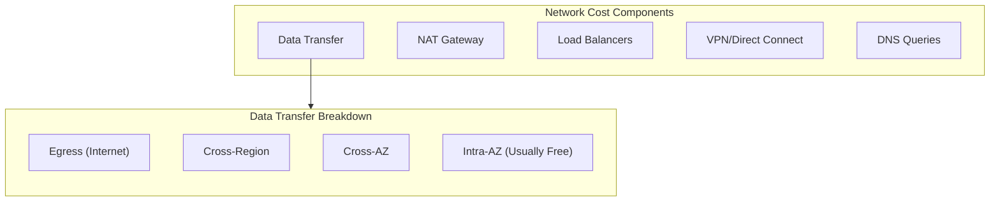
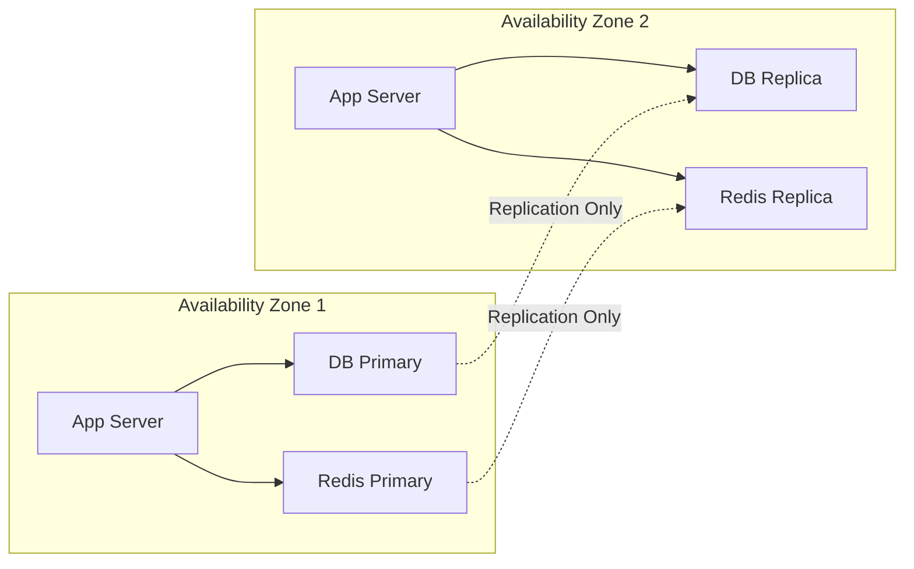
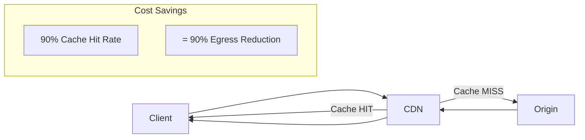
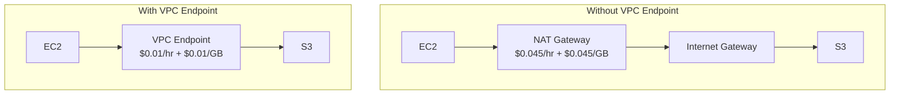
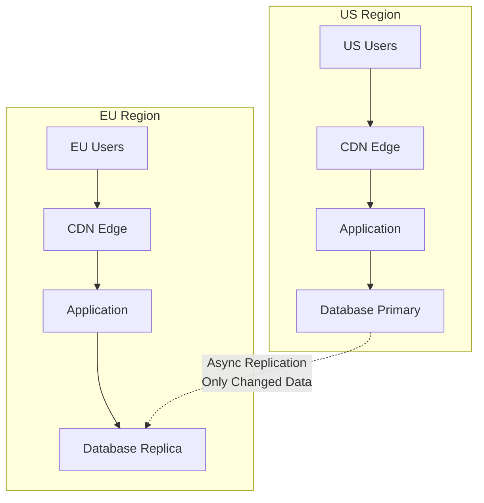
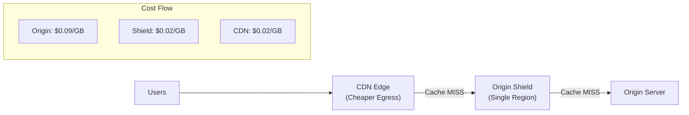
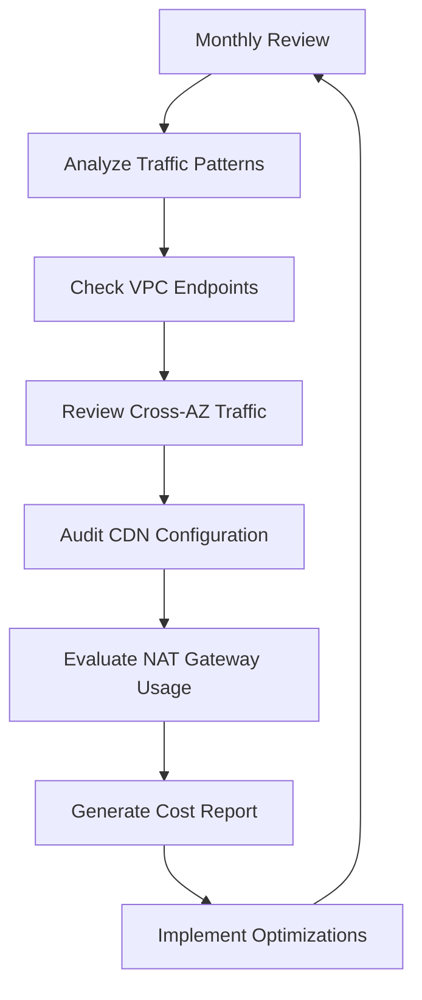
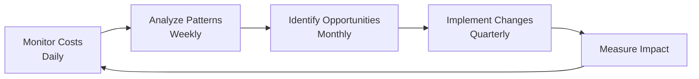

# How to Build Network Cost Optimization

Author: [nawazdhandala](https://github.com/nawazdhandala)

Tags: Networking, Cost Optimization, Cloud, FinOps

Description: Learn strategies for optimizing network costs in cloud environments.

---

Network costs are the silent killer of cloud budgets. While compute and storage costs are visible and well-understood, networking charges hide in the shadows, often accounting for 10-30% of total cloud spend. This guide covers practical strategies to identify, analyze, and reduce network costs across major cloud providers.

## Understanding Network Cost Components

Before optimizing, you need to understand what you are paying for. Cloud network costs break down into several categories.



### Data Transfer Costs by Provider

| Transfer Type | AWS | GCP | Azure |
|--------------|-----|-----|-------|
| Intra-AZ | Free | Free | Free |
| Cross-AZ | $0.01/GB | $0.01/GB | Free (same VNet) |
| Cross-Region | $0.02-0.20/GB | $0.01-0.15/GB | $0.02-0.16/GB |
| Internet Egress | $0.09-0.12/GB | $0.08-0.12/GB | $0.05-0.12/GB |

### Identify Your Biggest Cost Drivers

Use these commands to analyze your current network spend.

**AWS - Analyze Data Transfer with Cost Explorer CLI:**

```bash
# Get data transfer costs for the last 30 days
aws ce get-cost-and-usage \
  --time-period Start=$(date -d '30 days ago' +%Y-%m-%d),End=$(date +%Y-%m-%d) \
  --granularity MONTHLY \
  --metrics "BlendedCost" \
  --filter '{
    "Dimensions": {
      "Key": "USAGE_TYPE_GROUP",
      "Values": ["EC2: Data Transfer - Internet (Out)", "EC2: Data Transfer - Region to Region (Out)", "EC2: Data Transfer - Inter AZ"]
    }
  }' \
  --group-by Type=DIMENSION,Key=USAGE_TYPE_GROUP
```

**GCP - Export billing to BigQuery and query:**

```sql
SELECT
  service.description AS service,
  sku.description AS sku,
  SUM(cost) AS total_cost,
  SUM(usage.amount) AS total_usage,
  usage.unit
FROM `project.dataset.gcp_billing_export_v1_XXXXXX`
WHERE
  invoice.month = FORMAT_DATE('%Y%m', CURRENT_DATE())
  AND service.description LIKE '%Network%'
GROUP BY service, sku, usage.unit
ORDER BY total_cost DESC
LIMIT 20;
```

## Data Transfer Optimization

Data transfer is typically the largest network cost component. Here are strategies to minimize it.

### Strategy 1: Keep Traffic in the Same Availability Zone

Cross-AZ traffic costs money. Design your architecture to minimize it.



**Kubernetes: Use Pod Topology Spread and Anti-Affinity**

```yaml
apiVersion: apps/v1
kind: Deployment
metadata:
  name: api-server
spec:
  replicas: 6
  selector:
    matchLabels:
      app: api-server
  template:
    metadata:
      labels:
        app: api-server
    spec:
      topologySpreadConstraints:
        - maxSkew: 1
          topologyKey: topology.kubernetes.io/zone
          whenUnsatisfiable: ScheduleAnyway
          labelSelector:
            matchLabels:
              app: api-server
      affinity:
        podAffinity:
          preferredDuringSchedulingIgnoredDuringExecution:
            - weight: 100
              podAffinityTerm:
                labelSelector:
                  matchLabels:
                    app: database
                topologyKey: topology.kubernetes.io/zone
```

**Service Topology for Zone-Aware Routing:**

```yaml
apiVersion: v1
kind: Service
metadata:
  name: api-service
  annotations:
    service.kubernetes.io/topology-mode: Auto
spec:
  selector:
    app: api-server
  ports:
    - port: 80
      targetPort: 8080
```

### Strategy 2: Compress Data Before Transfer

Compression can reduce transfer costs by 60-90% for text-based data.

**NGINX Compression Configuration:**

```nginx
http {
    # Enable gzip compression
    gzip on;
    gzip_vary on;
    gzip_min_length 1024;
    gzip_proxied any;
    gzip_comp_level 6;
    gzip_types
        text/plain
        text/css
        text/xml
        text/javascript
        application/json
        application/javascript
        application/xml
        application/xml+rss
        application/x-javascript
        image/svg+xml;

    # Enable Brotli for even better compression
    brotli on;
    brotli_comp_level 6;
    brotli_types
        text/plain
        text/css
        text/xml
        text/javascript
        application/json
        application/javascript
        application/xml
        image/svg+xml;
}
```

**Application-Level Compression (Node.js):**

```javascript
const express = require('express');
const compression = require('compression');

const app = express();

// Use compression middleware
app.use(compression({
  level: 6,
  threshold: 1024,
  filter: (req, res) => {
    if (req.headers['x-no-compression']) {
      return false;
    }
    return compression.filter(req, res);
  }
}));

// For internal service-to-service calls, use streaming compression
const zlib = require('zlib');
const { pipeline } = require('stream');

async function fetchCompressedData(url) {
  const response = await fetch(url, {
    headers: { 'Accept-Encoding': 'gzip' }
  });

  const gunzip = zlib.createGunzip();
  return pipeline(response.body, gunzip);
}
```

### Strategy 3: Implement Response Caching

Cache responses to avoid repeated data transfers.



**Varnish Cache Configuration:**

```vcl
vcl 4.1;

backend default {
    .host = "origin.internal";
    .port = "8080";
}

sub vcl_recv {
    # Cache GET and HEAD requests
    if (req.method != "GET" && req.method != "HEAD") {
        return (pass);
    }

    # Remove cookies for static assets
    if (req.url ~ "\.(css|js|png|jpg|jpeg|gif|ico|woff2?)(\?.*)?$") {
        unset req.http.Cookie;
        return (hash);
    }

    # Cache API responses with cache headers
    if (req.url ~ "^/api/" && req.http.Authorization) {
        return (hash);
    }
}

sub vcl_backend_response {
    # Cache static assets for 1 year
    if (bereq.url ~ "\.(css|js|png|jpg|jpeg|gif|ico|woff2?)(\?.*)?$") {
        set beresp.ttl = 365d;
        set beresp.http.Cache-Control = "public, max-age=31536000";
    }

    # Cache API responses based on backend headers
    if (beresp.http.Cache-Control ~ "max-age") {
        set beresp.ttl = std.duration(
            regsub(beresp.http.Cache-Control, ".*max-age=([0-9]+).*", "\1s"),
            0s
        );
    }
}
```

## VPC Endpoint Usage

VPC Endpoints eliminate NAT Gateway and internet data transfer costs for AWS service traffic.

### Cost Comparison



### Setting Up VPC Endpoints with Terraform

```hcl
# Gateway Endpoint for S3 (Free)
resource "aws_vpc_endpoint" "s3" {
  vpc_id            = aws_vpc.main.id
  service_name      = "com.amazonaws.${var.region}.s3"
  vpc_endpoint_type = "Gateway"

  route_table_ids = [
    aws_route_table.private.id
  ]

  tags = {
    Name = "s3-gateway-endpoint"
  }
}

# Gateway Endpoint for DynamoDB (Free)
resource "aws_vpc_endpoint" "dynamodb" {
  vpc_id            = aws_vpc.main.id
  service_name      = "com.amazonaws.${var.region}.dynamodb"
  vpc_endpoint_type = "Gateway"

  route_table_ids = [
    aws_route_table.private.id
  ]

  tags = {
    Name = "dynamodb-gateway-endpoint"
  }
}

# Interface Endpoint for ECR (Paid but cheaper than NAT)
resource "aws_vpc_endpoint" "ecr_api" {
  vpc_id              = aws_vpc.main.id
  service_name        = "com.amazonaws.${var.region}.ecr.api"
  vpc_endpoint_type   = "Interface"
  subnet_ids          = aws_subnet.private[*].id
  security_group_ids  = [aws_security_group.vpc_endpoints.id]
  private_dns_enabled = true

  tags = {
    Name = "ecr-api-endpoint"
  }
}

resource "aws_vpc_endpoint" "ecr_dkr" {
  vpc_id              = aws_vpc.main.id
  service_name        = "com.amazonaws.${var.region}.ecr.dkr"
  vpc_endpoint_type   = "Interface"
  subnet_ids          = aws_subnet.private[*].id
  security_group_ids  = [aws_security_group.vpc_endpoints.id]
  private_dns_enabled = true

  tags = {
    Name = "ecr-dkr-endpoint"
  }
}

# Security group for VPC endpoints
resource "aws_security_group" "vpc_endpoints" {
  name        = "vpc-endpoints-sg"
  description = "Security group for VPC endpoints"
  vpc_id      = aws_vpc.main.id

  ingress {
    from_port   = 443
    to_port     = 443
    protocol    = "tcp"
    cidr_blocks = [aws_vpc.main.cidr_block]
  }

  egress {
    from_port   = 0
    to_port     = 0
    protocol    = "-1"
    cidr_blocks = ["0.0.0.0/0"]
  }
}

# Output estimated savings
output "endpoint_savings_estimate" {
  value = <<-EOT
    Estimated monthly savings with VPC Endpoints:
    - S3 Gateway Endpoint: Free (saves ~$0.045/GB via NAT)
    - DynamoDB Gateway Endpoint: Free (saves ~$0.045/GB via NAT)
    - ECR Interface Endpoint: $7.20/month + $0.01/GB (saves ~$0.035/GB vs NAT)

    For 1TB/month S3 traffic: ~$45 savings
    For 100GB/month ECR pulls: ~$3.50 savings
  EOT
}
```

### Identifying High-Volume AWS Service Traffic

```bash
#!/bin/bash
# Analyze VPC Flow Logs for AWS service traffic

# Query CloudWatch Logs Insights for traffic to AWS service IPs
aws logs start-query \
  --log-group-name "/aws/vpc/flowlogs" \
  --start-time $(date -d '7 days ago' +%s) \
  --end-time $(date +%s) \
  --query-string '
    fields @timestamp, srcAddr, dstAddr, bytes
    | filter dstAddr like /^52\./ or dstAddr like /^54\./
    | stats sum(bytes) as totalBytes by dstAddr
    | sort totalBytes desc
    | limit 20
  '

# Wait for query to complete and get results
sleep 10
aws logs get-query-results --query-id <query-id>
```

## Regional Traffic Strategies

Strategic placement of resources can dramatically reduce cross-region transfer costs.

### Multi-Region Architecture with Local Processing



### Implement Global Load Balancing

**AWS Global Accelerator Configuration:**

```hcl
resource "aws_globalaccelerator_accelerator" "main" {
  name            = "global-accelerator"
  ip_address_type = "IPV4"
  enabled         = true

  attributes {
    flow_logs_enabled   = true
    flow_logs_s3_bucket = aws_s3_bucket.flow_logs.id
    flow_logs_s3_prefix = "globalaccelerator/"
  }
}

resource "aws_globalaccelerator_listener" "main" {
  accelerator_arn = aws_globalaccelerator_accelerator.main.id
  protocol        = "TCP"

  port_range {
    from_port = 443
    to_port   = 443
  }
}

resource "aws_globalaccelerator_endpoint_group" "us" {
  listener_arn                  = aws_globalaccelerator_listener.main.id
  endpoint_group_region         = "us-east-1"
  health_check_interval_seconds = 10
  health_check_path             = "/health"
  health_check_port             = 443
  health_check_protocol         = "HTTPS"
  threshold_count               = 3
  traffic_dial_percentage       = 100

  endpoint_configuration {
    endpoint_id                    = aws_lb.us.arn
    weight                         = 100
    client_ip_preservation_enabled = true
  }
}

resource "aws_globalaccelerator_endpoint_group" "eu" {
  listener_arn                  = aws_globalaccelerator_listener.main.id
  endpoint_group_region         = "eu-west-1"
  health_check_interval_seconds = 10
  health_check_path             = "/health"
  health_check_port             = 443
  health_check_protocol         = "HTTPS"
  threshold_count               = 3
  traffic_dial_percentage       = 100

  endpoint_configuration {
    endpoint_id                    = aws_lb.eu.arn
    weight                         = 100
    client_ip_preservation_enabled = true
  }
}
```

### Database Read Replica Strategy

Route read queries to the nearest replica to avoid cross-region latency and costs.

```python
import boto3
from functools import lru_cache

class RegionalDatabaseRouter:
    def __init__(self):
        self.ec2 = boto3.client('ec2')
        self.current_region = self._get_current_region()

        self.read_replicas = {
            'us-east-1': 'replica-us-east.rds.amazonaws.com',
            'us-west-2': 'replica-us-west.rds.amazonaws.com',
            'eu-west-1': 'replica-eu-west.rds.amazonaws.com',
            'ap-southeast-1': 'replica-ap-southeast.rds.amazonaws.com',
        }

        self.primary = 'primary.rds.amazonaws.com'

    @lru_cache()
    def _get_current_region(self):
        # Get region from instance metadata
        try:
            response = self.ec2.describe_availability_zones()
            return response['AvailabilityZones'][0]['RegionName']
        except Exception:
            return 'us-east-1'  # Default fallback

    def get_read_connection(self):
        """Return the nearest read replica."""
        replica = self.read_replicas.get(
            self.current_region,
            self.read_replicas['us-east-1']  # Fallback
        )
        return self._create_connection(replica)

    def get_write_connection(self):
        """Return the primary database connection."""
        return self._create_connection(self.primary)

    def _create_connection(self, host):
        import psycopg2
        return psycopg2.connect(
            host=host,
            database='myapp',
            user='app_user',
            password=self._get_password(),
            connect_timeout=5
        )

    def _get_password(self):
        # Retrieve from Secrets Manager
        secrets = boto3.client('secretsmanager')
        response = secrets.get_secret_value(SecretId='db-password')
        return response['SecretString']


# Usage
router = RegionalDatabaseRouter()

def get_user(user_id):
    """Read operation - use replica."""
    conn = router.get_read_connection()
    cursor = conn.cursor()
    cursor.execute("SELECT * FROM users WHERE id = %s", (user_id,))
    return cursor.fetchone()

def create_user(user_data):
    """Write operation - use primary."""
    conn = router.get_write_connection()
    cursor = conn.cursor()
    cursor.execute(
        "INSERT INTO users (name, email) VALUES (%s, %s) RETURNING id",
        (user_data['name'], user_data['email'])
    )
    conn.commit()
    return cursor.fetchone()[0]
```

## CDN Cost Optimization

CDNs reduce origin egress but have their own costs. Optimize both.

### CDN Architecture for Cost Efficiency



### CloudFront Cost Optimization

```hcl
resource "aws_cloudfront_distribution" "main" {
  enabled             = true
  is_ipv6_enabled     = true
  price_class         = "PriceClass_100"  # US, Canada, Europe only

  # Enable Origin Shield to reduce origin requests
  origin {
    domain_name = aws_lb.origin.dns_name
    origin_id   = "origin"

    origin_shield {
      enabled              = true
      origin_shield_region = "us-east-1"
    }

    custom_origin_config {
      http_port              = 80
      https_port             = 443
      origin_protocol_policy = "https-only"
      origin_ssl_protocols   = ["TLSv1.2"]
    }
  }

  default_cache_behavior {
    allowed_methods        = ["GET", "HEAD", "OPTIONS"]
    cached_methods         = ["GET", "HEAD"]
    target_origin_id       = "origin"
    viewer_protocol_policy = "redirect-to-https"
    compress               = true  # Enable automatic compression

    # Aggressive caching policy
    cache_policy_id          = aws_cloudfront_cache_policy.optimized.id
    origin_request_policy_id = aws_cloudfront_origin_request_policy.minimal.id

    # Use cheaper edge locations for static content
    function_association {
      event_type   = "viewer-request"
      function_arn = aws_cloudfront_function.cache_key.arn
    }
  }

  # Separate behavior for API with shorter TTL
  ordered_cache_behavior {
    path_pattern           = "/api/*"
    allowed_methods        = ["DELETE", "GET", "HEAD", "OPTIONS", "PATCH", "POST", "PUT"]
    cached_methods         = ["GET", "HEAD"]
    target_origin_id       = "origin"
    viewer_protocol_policy = "https-only"
    compress               = true

    cache_policy_id          = aws_cloudfront_cache_policy.api.id
    origin_request_policy_id = aws_cloudfront_origin_request_policy.api.id
  }

  restrictions {
    geo_restriction {
      restriction_type = "none"
    }
  }

  viewer_certificate {
    acm_certificate_arn      = aws_acm_certificate.main.arn
    ssl_support_method       = "sni-only"
    minimum_protocol_version = "TLSv1.2_2021"
  }
}

# Aggressive cache policy for static assets
resource "aws_cloudfront_cache_policy" "optimized" {
  name        = "optimized-caching"
  default_ttl = 86400    # 1 day
  max_ttl     = 31536000 # 1 year
  min_ttl     = 1

  parameters_in_cache_key_and_forwarded_to_origin {
    cookies_config {
      cookie_behavior = "none"
    }
    headers_config {
      header_behavior = "none"
    }
    query_strings_config {
      query_string_behavior = "whitelist"
      query_strings {
        items = ["v", "version"]  # Only cache-bust params
      }
    }
    enable_accept_encoding_brotli = true
    enable_accept_encoding_gzip   = true
  }
}
```

### Monitor CDN Cache Hit Ratio

```bash
#!/bin/bash
# Monitor CloudFront cache hit ratio

DISTRIBUTION_ID="EXXXXXXXXX"
START_TIME=$(date -u -d '24 hours ago' +%Y-%m-%dT%H:%M:%SZ)
END_TIME=$(date -u +%Y-%m-%dT%H:%M:%SZ)

# Get cache hit metrics
aws cloudwatch get-metric-statistics \
  --namespace AWS/CloudFront \
  --metric-name CacheHitRate \
  --dimensions Name=DistributionId,Value=$DISTRIBUTION_ID Name=Region,Value=Global \
  --start-time $START_TIME \
  --end-time $END_TIME \
  --period 3600 \
  --statistics Average \
  --output table

# Get origin requests (these cost money)
aws cloudwatch get-metric-statistics \
  --namespace AWS/CloudFront \
  --metric-name OriginLatency \
  --dimensions Name=DistributionId,Value=$DISTRIBUTION_ID Name=Region,Value=Global \
  --start-time $START_TIME \
  --end-time $END_TIME \
  --period 3600 \
  --statistics SampleCount \
  --output table

echo "Target: Cache Hit Rate > 95%"
echo "Every 1% improvement = ~1% reduction in origin egress costs"
```

## Network Architecture Review

Regular architecture reviews catch cost inefficiencies before they accumulate.

### Architecture Review Checklist



### Automated Cost Analysis Script

```python
#!/usr/bin/env python3
"""
Network Cost Analyzer
Identifies optimization opportunities in AWS network spending.
"""

import boto3
from datetime import datetime, timedelta
from collections import defaultdict
import json

class NetworkCostAnalyzer:
    def __init__(self):
        self.ce = boto3.client('ce')
        self.ec2 = boto3.client('ec2')

    def get_network_costs(self, days=30):
        """Get detailed network cost breakdown."""
        end = datetime.now()
        start = end - timedelta(days=days)

        response = self.ce.get_cost_and_usage(
            TimePeriod={
                'Start': start.strftime('%Y-%m-%d'),
                'End': end.strftime('%Y-%m-%d')
            },
            Granularity='MONTHLY',
            Metrics=['BlendedCost', 'UsageQuantity'],
            GroupBy=[
                {'Type': 'DIMENSION', 'Key': 'USAGE_TYPE'}
            ],
            Filter={
                'Or': [
                    {'Dimensions': {'Key': 'USAGE_TYPE', 'Values': ['DataTransfer-Out-Bytes']}},
                    {'Dimensions': {'Key': 'USAGE_TYPE', 'Values': ['DataTransfer-Regional-Bytes']}},
                    {'Dimensions': {'Key': 'USAGE_TYPE', 'Values': ['NatGateway-Bytes']}},
                    {'Dimensions': {'Key': 'USAGE_TYPE', 'Values': ['LoadBalancerUsage']}},
                ]
            }
        )

        costs = defaultdict(float)
        for result in response['ResultsByTime']:
            for group in result['Groups']:
                usage_type = group['Keys'][0]
                cost = float(group['Metrics']['BlendedCost']['Amount'])
                costs[usage_type] += cost

        return dict(costs)

    def check_vpc_endpoints(self):
        """Check for missing VPC endpoints."""
        recommendations = []

        # Get existing endpoints
        endpoints = self.ec2.describe_vpc_endpoints()
        existing_services = {ep['ServiceName'] for ep in endpoints['VpcEndpoints']}

        # Recommended endpoints
        recommended = [
            's3', 'dynamodb', 'ecr.api', 'ecr.dkr',
            'secretsmanager', 'ssm', 'logs', 'monitoring'
        ]

        region = boto3.session.Session().region_name
        for service in recommended:
            service_name = f'com.amazonaws.{region}.{service}'
            if service_name not in existing_services:
                recommendations.append({
                    'type': 'missing_endpoint',
                    'service': service,
                    'potential_savings': 'Up to $0.035/GB',
                    'action': f'Create VPC endpoint for {service}'
                })

        return recommendations

    def analyze_nat_gateway_usage(self):
        """Analyze NAT Gateway costs and identify optimization opportunities."""
        # Get NAT Gateways
        nat_gateways = self.ec2.describe_nat_gateways(
            Filter=[{'Name': 'state', 'Values': ['available']}]
        )

        recommendations = []
        for nat in nat_gateways['NatGateways']:
            nat_id = nat['NatGatewayId']
            # Check if NAT is heavily used
            # In production, you'd query CloudWatch metrics here
            recommendations.append({
                'type': 'nat_gateway_review',
                'nat_id': nat_id,
                'action': 'Consider NAT instance for predictable workloads',
                'note': 'NAT instances can be 50-70% cheaper for steady traffic'
            })

        return recommendations

    def generate_report(self):
        """Generate comprehensive network cost report."""
        report = {
            'timestamp': datetime.now().isoformat(),
            'costs': self.get_network_costs(),
            'endpoint_recommendations': self.check_vpc_endpoints(),
            'nat_recommendations': self.analyze_nat_gateway_usage(),
        }

        # Calculate total and potential savings
        total_cost = sum(report['costs'].values())
        potential_savings = len(report['endpoint_recommendations']) * 50  # Estimate $50/month per endpoint

        report['summary'] = {
            'total_network_cost': f'${total_cost:.2f}',
            'potential_monthly_savings': f'${potential_savings:.2f}',
            'recommendations_count': (
                len(report['endpoint_recommendations']) +
                len(report['nat_recommendations'])
            )
        }

        return report


if __name__ == '__main__':
    analyzer = NetworkCostAnalyzer()
    report = analyzer.generate_report()
    print(json.dumps(report, indent=2, default=str))
```

### Set Up Cost Alerts

```hcl
# CloudWatch alarm for unexpected network cost spikes
resource "aws_cloudwatch_metric_alarm" "network_cost_spike" {
  alarm_name          = "network-cost-spike"
  comparison_operator = "GreaterThanThreshold"
  evaluation_periods  = 1
  metric_name         = "EstimatedCharges"
  namespace           = "AWS/Billing"
  period              = 86400
  statistic           = "Maximum"
  threshold           = 1000  # Alert if daily network costs exceed $1000

  dimensions = {
    Currency    = "USD"
    ServiceName = "AmazonEC2"
  }

  alarm_actions = [aws_sns_topic.cost_alerts.arn]

  alarm_description = "Network costs exceeded daily threshold"
}

# Budget alert for monthly network spending
resource "aws_budgets_budget" "network" {
  name              = "monthly-network-budget"
  budget_type       = "COST"
  limit_amount      = "5000"
  limit_unit        = "USD"
  time_unit         = "MONTHLY"

  cost_filter {
    name   = "Service"
    values = ["Amazon Elastic Compute Cloud - Compute", "Amazon CloudFront"]
  }

  notification {
    comparison_operator        = "GREATER_THAN"
    threshold                  = 80
    threshold_type             = "PERCENTAGE"
    notification_type          = "ACTUAL"
    subscriber_email_addresses = ["finops@company.com"]
  }

  notification {
    comparison_operator        = "GREATER_THAN"
    threshold                  = 100
    threshold_type             = "PERCENTAGE"
    notification_type          = "FORECASTED"
    subscriber_email_addresses = ["finops@company.com"]
  }
}
```

## Quick Wins Summary

| Optimization | Effort | Potential Savings |
|-------------|--------|-------------------|
| Enable compression | Low | 60-90% on text data |
| S3/DynamoDB VPC Endpoints | Low | $0.045/GB |
| CDN Origin Shield | Low | 20-40% origin requests |
| Zone-aware routing | Medium | $0.01/GB cross-AZ |
| Regional read replicas | Medium | $0.02-0.20/GB cross-region |
| NAT Gateway to NAT Instance | Medium | 50-70% for steady traffic |
| Cache policy optimization | Medium | 10-30% origin egress |

## Continuous Optimization Workflow



---

Network cost optimization is not a one-time project. It requires continuous monitoring, regular architecture reviews, and a culture that considers network costs in every design decision. Start with the quick wins, build visibility into your spending, and iterate. The savings compound over time, and the architectural improvements often bring performance benefits alongside cost reductions.
