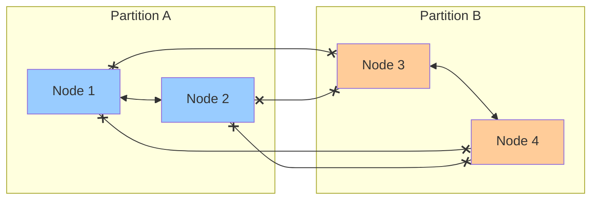
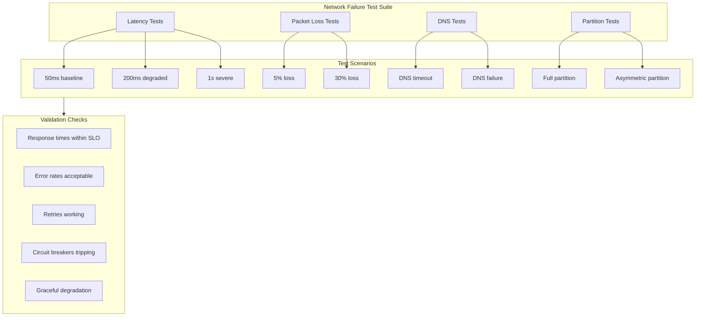

# How to Build Network Failure Testing

Author: [nawazdhandala](https://github.com/nawazdhandala)

Tags: Testing, Chaos Engineering, Networking, Resilience

Description: A hands-on guide to simulating network failures using tc, chaos tools, and scripted fault injection to validate system resilience.

---

Networks fail in unpredictable ways. Packets get lost, latency spikes, DNS stops resolving, and entire network segments become unreachable. If you have not tested how your services behave under these conditions, you are waiting for production to teach you the hard way.

This guide walks through practical techniques for injecting network failures into your systems, from low-level Linux traffic control to Kubernetes-native chaos tools.

## Why Network Failure Testing Matters

Most applications assume the network just works. They make HTTP calls without timeouts, ignore retry logic, and treat DNS as instant. When reality hits:

- A 200ms latency spike turns your 99th percentile response time from 500ms to 5 seconds
- 1% packet loss causes TCP retransmissions that cascade into timeouts
- A DNS outage brings down services that should have been resilient
- Network partitions trigger split-brain scenarios in distributed systems

Testing these scenarios before they happen in production reveals gaps in error handling, missing circuit breakers, and inadequate timeout configurations.

## Network Failure Scenarios

```mermaid
flowchart TB
    subgraph Normal["Normal Network"]
        A1[Service A] -->|100ms| B1[Service B]
        B1 -->|50ms| C1[Database]
    end

    subgraph Latency["Latency Injection"]
        A2[Service A] -->|500ms| B2[Service B]
        B2 -->|50ms| C2[Database]
        style A2 fill:#ff9999
    end

    subgraph PacketLoss["Packet Loss"]
        A3[Service A] -.->|30% loss| B3[Service B]
        B3 -->|50ms| C3[Database]
        style A3 fill:#ffcc99
    end

    subgraph Partition["Network Partition"]
        A4[Service A] x--x B4[Service B]
        B4 -->|50ms| C4[Database]
        style A4 fill:#ff6666
        style B4 fill:#ff6666
    end
```



## Using tc (Traffic Control) for Network Simulation

Linux's `tc` command is the foundation for network fault injection. It manipulates the kernel's network stack to add latency, drop packets, corrupt data, and limit bandwidth.

### Prerequisites

```bash
# Install iproute2 (contains tc)
# Debian/Ubuntu
sudo apt-get install iproute2

# RHEL/CentOS
sudo yum install iproute

# Check tc is available
tc -Version
```

### Adding Network Latency

Latency injection simulates slow network connections, overloaded routers, or geographically distant services.

```bash
# Add 100ms latency to all outgoing traffic on eth0
sudo tc qdisc add dev eth0 root netem delay 100ms

# Add 100ms latency with 20ms jitter (random variation)
sudo tc qdisc add dev eth0 root netem delay 100ms 20ms

# Add latency with correlation (packets close together have similar delays)
sudo tc qdisc add dev eth0 root netem delay 100ms 20ms 25%

# Add latency following a normal distribution
sudo tc qdisc add dev eth0 root netem delay 100ms 20ms distribution normal
```

### Targeting Specific Traffic

Use filters to apply rules only to specific destinations:

```bash
# Create a priority qdisc as root
sudo tc qdisc add dev eth0 root handle 1: prio

# Add netem as a child qdisc
sudo tc qdisc add dev eth0 parent 1:3 handle 30: netem delay 200ms

# Filter traffic to specific IP into the netem qdisc
sudo tc filter add dev eth0 protocol ip parent 1:0 prio 3 u32 \
    match ip dst 10.0.0.50/32 flowid 1:3
```

### Simulating Packet Loss

Packet loss exposes how your application handles incomplete data, TCP retransmissions, and timeout behavior.

```bash
# Drop 10% of packets randomly
sudo tc qdisc add dev eth0 root netem loss 10%

# Drop packets with correlation (bursty loss pattern)
sudo tc qdisc add dev eth0 root netem loss 10% 25%

# Gilbert-Elliot model for realistic burst loss
# p = probability of transitioning to bad state
# r = probability of transitioning to good state
# 1-h = loss probability in bad state
# 1-k = loss probability in good state
sudo tc qdisc add dev eth0 root netem loss gemodel 1% 10% 70% 0%
```

### Packet Corruption

Test how applications handle corrupted data that passes checksum validation at lower layers:

```bash
# Corrupt 5% of packets (single bit flip)
sudo tc qdisc add dev eth0 root netem corrupt 5%
```

### Packet Duplication and Reordering

```bash
# Duplicate 1% of packets
sudo tc qdisc add dev eth0 root netem duplicate 1%

# Reorder 25% of packets with 50% correlation
sudo tc qdisc add dev eth0 root netem reorder 25% 50%

# Combined: reorder 25% with 10ms delay gap
sudo tc qdisc add dev eth0 root netem delay 10ms reorder 25% 50%
```

### Bandwidth Limiting

Simulate slow connections like mobile networks or saturated links:

```bash
# Limit bandwidth to 1mbit
sudo tc qdisc add dev eth0 root tbf rate 1mbit burst 32kbit latency 400ms

# More realistic shaping with netem + tbf
sudo tc qdisc add dev eth0 root handle 1: netem delay 50ms
sudo tc qdisc add dev eth0 parent 1:1 handle 10: tbf rate 1mbit burst 32kbit latency 400ms
```

### Removing tc Rules

```bash
# Remove all rules from interface
sudo tc qdisc del dev eth0 root

# Show current rules
tc qdisc show dev eth0
tc filter show dev eth0
```

### tc Script for Controlled Testing

```bash
#!/bin/bash
# network-fault-inject.sh
# Inject network faults for a specified duration

INTERFACE=${1:-eth0}
FAULT_TYPE=${2:-latency}
DURATION=${3:-60}
TARGET_IP=${4:-""}

cleanup() {
    echo "Cleaning up tc rules..."
    sudo tc qdisc del dev $INTERFACE root 2>/dev/null
    exit 0
}

trap cleanup SIGINT SIGTERM

apply_latency() {
    echo "Injecting 200ms latency on $INTERFACE"
    sudo tc qdisc add dev $INTERFACE root netem delay 200ms 50ms
}

apply_packet_loss() {
    echo "Injecting 10% packet loss on $INTERFACE"
    sudo tc qdisc add dev $INTERFACE root netem loss 10%
}

apply_bandwidth_limit() {
    echo "Limiting bandwidth to 1mbit on $INTERFACE"
    sudo tc qdisc add dev $INTERFACE root tbf rate 1mbit burst 32kbit latency 400ms
}

apply_combined() {
    echo "Applying combined faults: 100ms latency + 5% loss + 1mbit limit"
    sudo tc qdisc add dev $INTERFACE root handle 1: netem delay 100ms 20ms loss 5%
    sudo tc qdisc add dev $INTERFACE parent 1:1 handle 10: tbf rate 1mbit burst 32kbit latency 400ms
}

# Clean any existing rules
sudo tc qdisc del dev $INTERFACE root 2>/dev/null

case $FAULT_TYPE in
    latency)
        apply_latency
        ;;
    loss)
        apply_packet_loss
        ;;
    bandwidth)
        apply_bandwidth_limit
        ;;
    combined)
        apply_combined
        ;;
    *)
        echo "Unknown fault type: $FAULT_TYPE"
        echo "Usage: $0 <interface> <latency|loss|bandwidth|combined> <duration_seconds>"
        exit 1
        ;;
esac

echo "Fault active for $DURATION seconds..."
sleep $DURATION

cleanup
```

## DNS Failure Testing

DNS failures are often overlooked but can be devastating. Applications frequently cache DNS results incorrectly or fail to handle resolution errors.

### Simulating DNS Failures with iptables

```bash
# Block all DNS traffic (UDP and TCP port 53)
sudo iptables -A OUTPUT -p udp --dport 53 -j DROP
sudo iptables -A OUTPUT -p tcp --dport 53 -j DROP

# Block DNS to specific resolver
sudo iptables -A OUTPUT -p udp --dport 53 -d 8.8.8.8 -j DROP

# Remove the rules
sudo iptables -D OUTPUT -p udp --dport 53 -j DROP
sudo iptables -D OUTPUT -p tcp --dport 53 -j DROP
```

### Simulating Slow DNS

```bash
# Add latency specifically to DNS traffic
sudo tc qdisc add dev eth0 root handle 1: prio
sudo tc qdisc add dev eth0 parent 1:3 handle 30: netem delay 5000ms
sudo tc filter add dev eth0 protocol ip parent 1:0 prio 3 u32 \
    match ip dport 53 0xffff flowid 1:3
```

### DNS Failure Test Script

```bash
#!/bin/bash
# dns-failure-test.sh
# Test application behavior under DNS failures

DURATION=${1:-30}
MODE=${2:-block}  # block, slow, corrupt

cleanup() {
    echo "Restoring DNS..."
    sudo iptables -D OUTPUT -p udp --dport 53 -j DROP 2>/dev/null
    sudo iptables -D OUTPUT -p tcp --dport 53 -j DROP 2>/dev/null
    sudo tc qdisc del dev eth0 root 2>/dev/null
    exit 0
}

trap cleanup SIGINT SIGTERM

case $MODE in
    block)
        echo "Blocking all DNS traffic for $DURATION seconds"
        sudo iptables -A OUTPUT -p udp --dport 53 -j DROP
        sudo iptables -A OUTPUT -p tcp --dport 53 -j DROP
        ;;
    slow)
        echo "Adding 5s latency to DNS for $DURATION seconds"
        sudo tc qdisc add dev eth0 root handle 1: prio
        sudo tc qdisc add dev eth0 parent 1:3 handle 30: netem delay 5000ms
        sudo tc filter add dev eth0 protocol ip parent 1:0 prio 3 u32 \
            match ip dport 53 0xffff flowid 1:3
        ;;
    *)
        echo "Usage: $0 <duration> <block|slow>"
        exit 1
        ;;
esac

sleep $DURATION
cleanup
```

## Network Partitions

Network partitions split your distributed system into isolated groups that cannot communicate. This tests consensus algorithms, leader election, and split-brain handling.



### Creating Network Partitions with iptables

```bash
# Block all traffic between two hosts
# On host A (10.0.0.1), block traffic to/from host B (10.0.0.2)
sudo iptables -A INPUT -s 10.0.0.2 -j DROP
sudo iptables -A OUTPUT -d 10.0.0.2 -j DROP

# Create asymmetric partition (A can send to B, but B cannot send to A)
sudo iptables -A INPUT -s 10.0.0.2 -j DROP

# Block traffic to an entire subnet
sudo iptables -A OUTPUT -d 10.0.1.0/24 -j DROP
```

### Partition Script for Distributed Systems

```bash
#!/bin/bash
# network-partition.sh
# Create network partitions between node groups

PARTITION_A=("10.0.0.1" "10.0.0.2")
PARTITION_B=("10.0.0.3" "10.0.0.4")
DURATION=${1:-60}

create_partition() {
    echo "Creating network partition..."
    for node_a in "${PARTITION_A[@]}"; do
        for node_b in "${PARTITION_B[@]}"; do
            sudo iptables -A INPUT -s $node_b -j DROP
            sudo iptables -A OUTPUT -d $node_b -j DROP
        done
    done
}

remove_partition() {
    echo "Removing network partition..."
    for node_a in "${PARTITION_A[@]}"; do
        for node_b in "${PARTITION_B[@]}"; do
            sudo iptables -D INPUT -s $node_b -j DROP 2>/dev/null
            sudo iptables -D OUTPUT -d $node_b -j DROP 2>/dev/null
        done
    done
}

trap remove_partition SIGINT SIGTERM

create_partition
echo "Partition active for $DURATION seconds"
sleep $DURATION
remove_partition
```

## Chaos Mesh for Kubernetes Network Testing

For Kubernetes environments, Chaos Mesh provides declarative network chaos without manual iptables or tc management.

### Network Latency with Chaos Mesh

```yaml
apiVersion: chaos-mesh.org/v1alpha1
kind: NetworkChaos
metadata:
  name: network-latency-test
  namespace: chaos-testing
spec:
  action: delay
  mode: all
  selector:
    namespaces:
      - production
    labelSelectors:
      app: api-gateway
  delay:
    latency: "200ms"
    jitter: "50ms"
    correlation: "25"
  direction: to
  target:
    selector:
      namespaces:
        - production
      labelSelectors:
        app: backend-service
    mode: all
  duration: "5m"
```

### Packet Loss with Chaos Mesh

```yaml
apiVersion: chaos-mesh.org/v1alpha1
kind: NetworkChaos
metadata:
  name: packet-loss-test
  namespace: chaos-testing
spec:
  action: loss
  mode: all
  selector:
    namespaces:
      - production
    labelSelectors:
      app: payment-service
  loss:
    loss: "30"
    correlation: "25"
  direction: both
  duration: "3m"
```

### Network Partition with Chaos Mesh

```yaml
apiVersion: chaos-mesh.org/v1alpha1
kind: NetworkChaos
metadata:
  name: network-partition-test
  namespace: chaos-testing
spec:
  action: partition
  mode: all
  selector:
    namespaces:
      - production
    labelSelectors:
      app: cache-cluster
      partition: "a"
  target:
    selector:
      namespaces:
        - production
      labelSelectors:
        app: cache-cluster
        partition: "b"
    mode: all
  direction: both
  duration: "2m"
```

### DNS Chaos with Chaos Mesh

```yaml
apiVersion: chaos-mesh.org/v1alpha1
kind: DNSChaos
metadata:
  name: dns-failure-test
  namespace: chaos-testing
spec:
  action: error
  mode: all
  selector:
    namespaces:
      - production
    labelSelectors:
      app: web-frontend
  patterns:
    - "external-api.example.com"
    - "*.third-party.io"
  duration: "5m"
```

### DNS Random Response

```yaml
apiVersion: chaos-mesh.org/v1alpha1
kind: DNSChaos
metadata:
  name: dns-random-test
  namespace: chaos-testing
spec:
  action: random
  mode: all
  selector:
    namespaces:
      - staging
    labelSelectors:
      app: service-discovery-test
  patterns:
    - "*.internal.svc.cluster.local"
  duration: "3m"
```

## Litmus Chaos for Network Testing

Litmus is another popular Kubernetes chaos engineering framework with network fault capabilities.

### Installing Litmus

```bash
# Install Litmus operator
kubectl apply -f https://litmuschaos.github.io/litmus/litmus-operator-v2.14.0.yaml

# Verify installation
kubectl get pods -n litmus
```

### Network Latency Experiment

```yaml
apiVersion: litmuschaos.io/v1alpha1
kind: ChaosEngine
metadata:
  name: network-latency-chaos
  namespace: production
spec:
  appinfo:
    appns: production
    applabel: "app=target-service"
    appkind: deployment
  engineState: active
  chaosServiceAccount: litmus-admin
  experiments:
    - name: pod-network-latency
      spec:
        components:
          env:
            - name: NETWORK_INTERFACE
              value: "eth0"
            - name: TARGET_CONTAINER
              value: ""
            - name: NETWORK_LATENCY
              value: "2000"  # 2000ms
            - name: TOTAL_CHAOS_DURATION
              value: "300"   # 5 minutes
            - name: DESTINATION_IPS
              value: ""
            - name: DESTINATION_HOSTS
              value: "backend-service.production.svc.cluster.local"
```

### Network Loss Experiment

```yaml
apiVersion: litmuschaos.io/v1alpha1
kind: ChaosEngine
metadata:
  name: network-loss-chaos
  namespace: production
spec:
  appinfo:
    appns: production
    applabel: "app=target-service"
    appkind: deployment
  engineState: active
  chaosServiceAccount: litmus-admin
  experiments:
    - name: pod-network-loss
      spec:
        components:
          env:
            - name: NETWORK_INTERFACE
              value: "eth0"
            - name: NETWORK_PACKET_LOSS_PERCENTAGE
              value: "50"
            - name: TOTAL_CHAOS_DURATION
              value: "180"
            - name: DESTINATION_HOSTS
              value: "database.production.svc.cluster.local"
```

## Building a Network Failure Test Suite

Structure your network failure tests into repeatable scenarios.



### Test Suite Script

```bash
#!/bin/bash
# network-test-suite.sh
# Comprehensive network failure test suite

set -e

RESULTS_DIR="./network-test-results"
mkdir -p $RESULTS_DIR

log() {
    echo "[$(date '+%Y-%m-%d %H:%M:%S')] $1" | tee -a "$RESULTS_DIR/test.log"
}

run_health_check() {
    local endpoint=$1
    local timeout=$2
    curl -s -o /dev/null -w "%{http_code}" --max-time $timeout $endpoint || echo "000"
}

measure_latency() {
    local endpoint=$1
    local samples=$2
    for i in $(seq 1 $samples); do
        curl -s -o /dev/null -w "%{time_total}\n" $endpoint
        sleep 0.5
    done
}

test_latency_resilience() {
    log "Testing latency resilience..."
    local endpoint=$1

    for latency in 50 100 200 500 1000; do
        log "Injecting ${latency}ms latency"
        sudo tc qdisc add dev eth0 root netem delay ${latency}ms 2>/dev/null || \
            sudo tc qdisc change dev eth0 root netem delay ${latency}ms

        sleep 5

        local start=$(date +%s.%N)
        local response=$(run_health_check $endpoint 30)
        local end=$(date +%s.%N)
        local duration=$(echo "$end - $start" | bc)

        log "Latency: ${latency}ms, Response: $response, Duration: ${duration}s"
        echo "${latency},$response,$duration" >> "$RESULTS_DIR/latency-test.csv"

        sleep 2
    done

    sudo tc qdisc del dev eth0 root 2>/dev/null
    log "Latency test complete"
}

test_packet_loss_resilience() {
    log "Testing packet loss resilience..."
    local endpoint=$1

    for loss in 1 5 10 20 30; do
        log "Injecting ${loss}% packet loss"
        sudo tc qdisc add dev eth0 root netem loss ${loss}% 2>/dev/null || \
            sudo tc qdisc change dev eth0 root netem loss ${loss}%

        sleep 5

        local success=0
        local total=10
        for i in $(seq 1 $total); do
            local response=$(run_health_check $endpoint 10)
            if [ "$response" = "200" ]; then
                ((success++))
            fi
            sleep 1
        done

        local success_rate=$((success * 100 / total))
        log "Loss: ${loss}%, Success rate: ${success_rate}%"
        echo "${loss},$success_rate" >> "$RESULTS_DIR/packet-loss-test.csv"

        sleep 2
    done

    sudo tc qdisc del dev eth0 root 2>/dev/null
    log "Packet loss test complete"
}

test_dns_resilience() {
    log "Testing DNS resilience..."
    local endpoint=$1

    # Test DNS timeout
    log "Blocking DNS..."
    sudo iptables -A OUTPUT -p udp --dport 53 -j DROP
    sudo iptables -A OUTPUT -p tcp --dport 53 -j DROP

    local response=$(run_health_check $endpoint 30)
    log "DNS blocked, Response: $response"
    echo "blocked,$response" >> "$RESULTS_DIR/dns-test.csv"

    sudo iptables -D OUTPUT -p udp --dport 53 -j DROP
    sudo iptables -D OUTPUT -p tcp --dport 53 -j DROP

    sleep 5

    # Test slow DNS
    log "Slowing DNS to 3s..."
    sudo tc qdisc add dev eth0 root handle 1: prio
    sudo tc qdisc add dev eth0 parent 1:3 handle 30: netem delay 3000ms
    sudo tc filter add dev eth0 protocol ip parent 1:0 prio 3 u32 \
        match ip dport 53 0xffff flowid 1:3

    local response=$(run_health_check $endpoint 30)
    log "DNS slow (3s), Response: $response"
    echo "slow_3s,$response" >> "$RESULTS_DIR/dns-test.csv"

    sudo tc qdisc del dev eth0 root 2>/dev/null
    log "DNS test complete"
}

generate_report() {
    log "Generating test report..."

    cat > "$RESULTS_DIR/report.md" << EOF
# Network Failure Test Report
Generated: $(date)

## Latency Resilience
| Injected Latency | Response Code | Actual Duration |
|-----------------|---------------|-----------------|
EOF

    if [ -f "$RESULTS_DIR/latency-test.csv" ]; then
        while IFS=',' read -r latency response duration; do
            echo "| ${latency}ms | $response | ${duration}s |" >> "$RESULTS_DIR/report.md"
        done < "$RESULTS_DIR/latency-test.csv"
    fi

    cat >> "$RESULTS_DIR/report.md" << EOF

## Packet Loss Resilience
| Packet Loss | Success Rate |
|-------------|--------------|
EOF

    if [ -f "$RESULTS_DIR/packet-loss-test.csv" ]; then
        while IFS=',' read -r loss rate; do
            echo "| ${loss}% | ${rate}% |" >> "$RESULTS_DIR/report.md"
        done < "$RESULTS_DIR/packet-loss-test.csv"
    fi

    cat >> "$RESULTS_DIR/report.md" << EOF

## DNS Resilience
| Condition | Response |
|-----------|----------|
EOF

    if [ -f "$RESULTS_DIR/dns-test.csv" ]; then
        while IFS=',' read -r condition response; do
            echo "| $condition | $response |" >> "$RESULTS_DIR/report.md"
        done < "$RESULTS_DIR/dns-test.csv"
    fi

    log "Report saved to $RESULTS_DIR/report.md"
}

# Main
ENDPOINT=${1:-"http://localhost:8080/health"}

log "Starting network failure test suite"
log "Target endpoint: $ENDPOINT"

test_latency_resilience $ENDPOINT
test_packet_loss_resilience $ENDPOINT
test_dns_resilience $ENDPOINT
generate_report

log "Test suite complete"
```

## Monitoring During Network Tests

When running network failure tests, you need observability to understand how your system reacts.

### Key Metrics to Track

```promql
# Request latency distribution during chaos
histogram_quantile(0.99, sum(rate(http_request_duration_seconds_bucket[1m])) by (le, service))

# Error rate by service
sum(rate(http_requests_total{status=~"5.."}[1m])) by (service) /
sum(rate(http_requests_total[1m])) by (service)

# TCP retransmission rate
rate(node_netstat_Tcp_RetransSegs[1m])

# DNS query failures
sum(rate(coredns_dns_responses_total{rcode="SERVFAIL"}[1m]))

# Circuit breaker state
sum by (service) (circuit_breaker_state{state="open"})
```

### Correlating Chaos Events with Metrics

Use annotations in your monitoring system to mark when chaos experiments start and end. OneUptime and similar platforms can ingest these events:

```bash
# Send annotation to monitoring system when starting chaos
curl -X POST https://oneuptime.com/api/annotations \
  -H "Authorization: Bearer $API_KEY" \
  -H "Content-Type: application/json" \
  -d '{
    "title": "Network Chaos: 200ms latency injection",
    "description": "Testing latency resilience on payment-service",
    "tags": ["chaos", "network", "latency"],
    "startTime": "'$(date -u +%Y-%m-%dT%H:%M:%SZ)'"
  }'
```

## Best Practices

### Start Small

Begin with minimal fault injection and gradually increase:
- Start with 10ms latency before testing 500ms
- Test 1% packet loss before 20%
- Run experiments in staging before production

### Define Success Criteria

Before running tests, write down what you expect:
- Response times should stay under 2s with 100ms added latency
- Error rate should stay below 1% with 5% packet loss
- System should recover within 30s after DNS is restored

### Automate Cleanup

Always ensure fault injection rules are removed:
- Use trap handlers in scripts
- Set timeouts on chaos experiments
- Have runbooks for manual cleanup

### Test Regularly

Network conditions change as your system evolves:
- Run network failure tests in CI/CD pipelines
- Schedule periodic chaos game days
- Re-test after major architectural changes

### Document Findings

Track what breaks and what works:
- Record which services have good retry logic
- Note missing circuit breakers
- Create tickets for improvements discovered

## Checklist

Before running network failure tests:

- [ ] Monitoring and alerting are active
- [ ] Team is aware testing is happening
- [ ] Cleanup scripts are tested
- [ ] Success criteria are defined
- [ ] Rollback procedure is documented

After running tests:

- [ ] All fault injection rules are removed
- [ ] System health is verified
- [ ] Results are documented
- [ ] Issues are tracked for remediation
- [ ] Findings are shared with the team

---

Network failures will happen. The question is whether you discover your system's weaknesses through controlled testing or through a 3 AM production incident. Use tc, iptables, and chaos engineering tools to systematically validate that your services handle network degradation gracefully.

For comprehensive observability during network failure testing, [OneUptime](https://oneuptime.com) provides unified monitoring, alerting, and incident management to correlate chaos experiments with system behavior and identify resilience gaps before they become outages.
