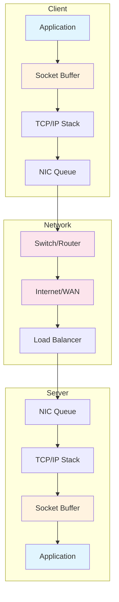
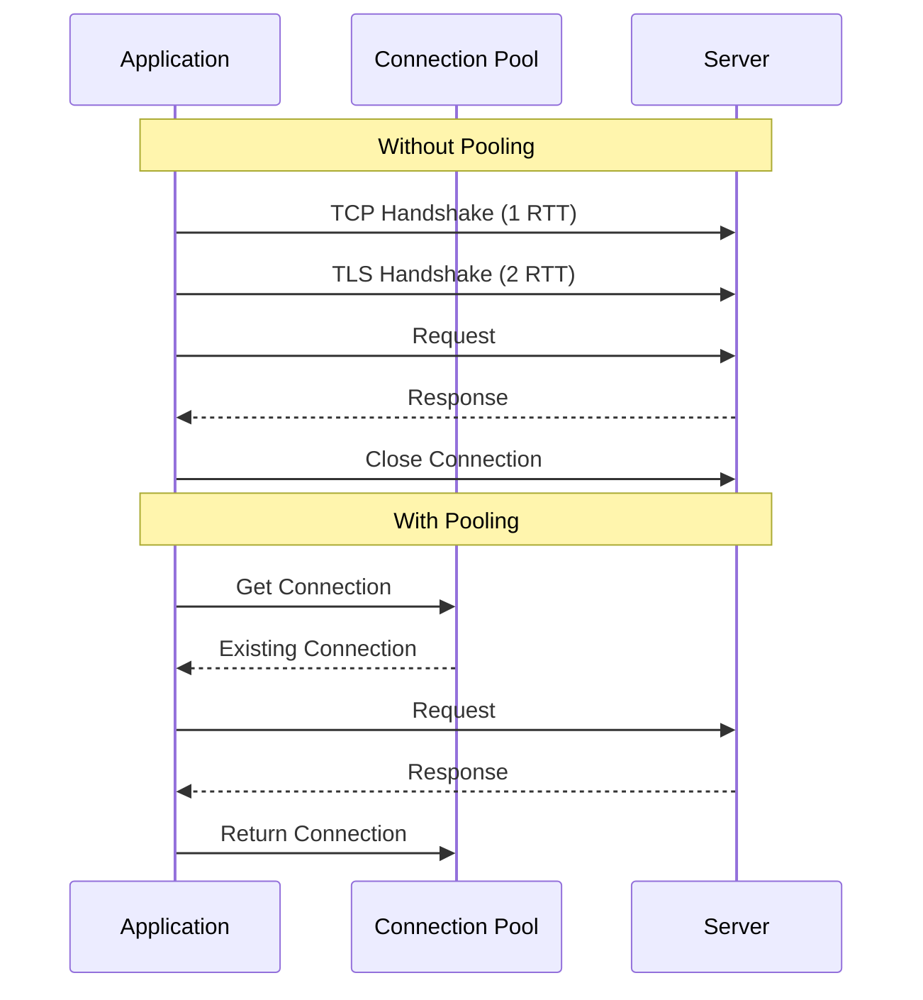
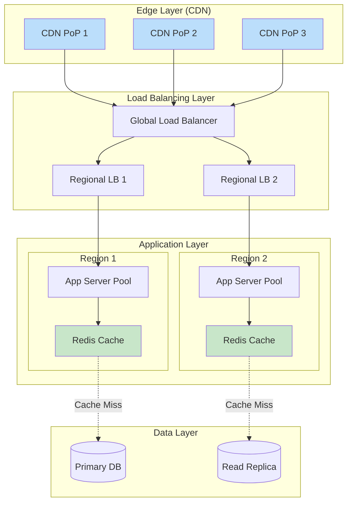

# How to Create Network Performance Optimization

Author: [nawazdhandala](https://github.com/nawazdhandala)

Tags: Networking, Performance, Optimization, Latency

Description: A practical guide to reducing network latency through socket tuning, protocol selection, connection pooling, and system-level optimizations.

---

Network latency is the silent killer of application performance. Users don't care about your elegant architecture or clean code if every click takes 500ms to respond. The good news is that most latency issues are fixable with the right techniques.

This guide covers practical strategies to squeeze every millisecond out of your network stack.

---

## Understanding Where Latency Lives

Before optimizing, you need to know where time is being spent. Network latency comes from multiple sources:

- **Propagation delay** - Physical distance between endpoints (speed of light constraints)
- **Transmission delay** - Time to push bits onto the wire
- **Processing delay** - Time spent in routers, firewalls, and application logic
- **Queuing delay** - Time waiting in buffers at various network hops

The following diagram shows the typical flow of a network request and where latency accumulates:



Each box in this diagram represents a potential source of latency that can be optimized.

---

## Socket Buffer Tuning

Socket buffers are where data waits before being sent or after being received. Poorly sized buffers cause performance bottlenecks.

### Linux Socket Buffer Configuration

```bash
# View current socket buffer settings
sysctl net.core.rmem_max
sysctl net.core.wmem_max
sysctl net.ipv4.tcp_rmem
sysctl net.ipv4.tcp_wmem

# Increase maximum receive buffer size (bytes)
# This allows applications to request larger buffers
sysctl -w net.core.rmem_max=16777216

# Increase maximum send buffer size (bytes)
sysctl -w net.core.wmem_max=16777216

# TCP receive buffer: min, default, max (bytes)
# Auto-tuning will adjust within these bounds
sysctl -w net.ipv4.tcp_rmem="4096 87380 16777216"

# TCP send buffer: min, default, max (bytes)
sysctl -w net.ipv4.tcp_wmem="4096 65536 16777216"
```

### Application-Level Buffer Tuning (Python)

```python
import socket

def create_optimized_socket():
    """
    Create a socket with optimized buffer sizes for high-throughput scenarios.
    Buffer sizes should match or exceed the bandwidth-delay product (BDP).
    BDP = Bandwidth (bytes/sec) * Round-trip time (seconds)
    """
    sock = socket.socket(socket.AF_INET, socket.SOCK_STREAM)

    # Set receive buffer to 1MB
    # Larger buffers help with high-latency, high-bandwidth connections
    sock.setsockopt(socket.SOL_SOCKET, socket.SO_RCVBUF, 1048576)

    # Set send buffer to 1MB
    sock.setsockopt(socket.SOL_SOCKET, socket.SO_SNDBUF, 1048576)

    # Disable Nagle's algorithm for latency-sensitive applications
    # This sends data immediately rather than waiting to batch small packets
    sock.setsockopt(socket.IPPROTO_TCP, socket.TCP_NODELAY, 1)

    # Enable TCP keepalive to detect dead connections
    sock.setsockopt(socket.SOL_SOCKET, socket.SO_KEEPALIVE, 1)

    return sock
```

### Node.js Socket Configuration

```javascript
const net = require('net');

/**
 * Create an optimized TCP client socket.
 * These settings reduce latency for interactive applications.
 */
function createOptimizedSocket(host, port) {
    const socket = new net.Socket();

    // Disable Nagle's algorithm
    // Critical for real-time applications where every millisecond counts
    socket.setNoDelay(true);

    // Enable keep-alive with 30 second initial delay
    // Prevents idle connections from being silently dropped by firewalls
    socket.setKeepAlive(true, 30000);

    // Set socket timeout to 10 seconds
    // Prevents hanging on unresponsive connections
    socket.setTimeout(10000);

    socket.connect(port, host, () => {
        console.log('Connected with optimized settings');
    });

    return socket;
}
```

---

## Protocol Selection and Configuration

Choosing the right protocol for your use case can dramatically impact latency.

### TCP vs UDP Decision Matrix

| Factor | TCP | UDP |
|--------|-----|-----|
| Reliability | Guaranteed delivery | Best effort |
| Latency | Higher (handshake, ACKs) | Lower (no handshake) |
| Use case | File transfers, APIs | Gaming, video streaming |
| Overhead | ~20 bytes header | ~8 bytes header |

### HTTP/2 and HTTP/3 Optimization

```python
import httpx

async def make_optimized_request():
    """
    Use HTTP/2 for multiplexed connections.
    HTTP/2 allows multiple requests over a single TCP connection,
    eliminating head-of-line blocking and reducing connection overhead.
    """
    async with httpx.AsyncClient(http2=True) as client:
        # Multiple requests share one connection
        # No need to wait for sequential responses
        responses = await asyncio.gather(
            client.get('https://api.example.com/users'),
            client.get('https://api.example.com/products'),
            client.get('https://api.example.com/orders'),
        )
        return responses
```

### gRPC for Low-Latency RPC

```python
import grpc

def create_optimized_channel(target):
    """
    Create a gRPC channel with performance-optimized settings.
    gRPC uses HTTP/2 under the hood, providing multiplexing benefits.
    """
    options = [
        # Keep connections alive during idle periods
        ('grpc.keepalive_time_ms', 10000),

        # Timeout for keepalive ping response
        ('grpc.keepalive_timeout_ms', 5000),

        # Allow keepalive pings even without active calls
        ('grpc.keepalive_permit_without_calls', True),

        # Maximum message size (4MB)
        ('grpc.max_receive_message_length', 4 * 1024 * 1024),

        # Enable retries for transient failures
        ('grpc.enable_retries', True),
    ]

    return grpc.insecure_channel(target, options=options)
```

---

## Connection Pooling and Reuse

Creating new connections is expensive. TCP handshakes, TLS negotiation, and authentication add significant latency.



### Python Connection Pool Implementation

```python
import queue
import threading
import socket
from contextlib import contextmanager

class ConnectionPool:
    """
    A thread-safe connection pool that reuses TCP connections.
    This eliminates the overhead of establishing new connections for each request.
    """

    def __init__(self, host, port, pool_size=10):
        self.host = host
        self.port = port
        self.pool_size = pool_size
        # Thread-safe queue to hold available connections
        self._pool = queue.Queue(maxsize=pool_size)
        self._lock = threading.Lock()
        self._created = 0

    def _create_connection(self):
        """Create a new optimized connection."""
        sock = socket.socket(socket.AF_INET, socket.SOCK_STREAM)
        sock.setsockopt(socket.IPPROTO_TCP, socket.TCP_NODELAY, 1)
        sock.setsockopt(socket.SOL_SOCKET, socket.SO_KEEPALIVE, 1)
        sock.connect((self.host, self.port))
        return sock

    def get_connection(self, timeout=5):
        """
        Get a connection from the pool.
        Creates a new one if the pool is empty and under capacity.
        """
        try:
            # Try to get an existing connection
            return self._pool.get(block=False)
        except queue.Empty:
            # Create new connection if under capacity
            with self._lock:
                if self._created < self.pool_size:
                    self._created += 1
                    return self._create_connection()
            # Wait for an available connection if at capacity
            return self._pool.get(timeout=timeout)

    def return_connection(self, conn):
        """Return a connection to the pool for reuse."""
        try:
            self._pool.put(conn, block=False)
        except queue.Full:
            # Pool is full, close the extra connection
            conn.close()

    @contextmanager
    def connection(self):
        """Context manager for automatic connection handling."""
        conn = self.get_connection()
        try:
            yield conn
        finally:
            self.return_connection(conn)


# Usage example
pool = ConnectionPool('api.example.com', 443, pool_size=20)

def make_request(data):
    with pool.connection() as conn:
        conn.send(data)
        return conn.recv(4096)
```

### HTTP Connection Pooling with aiohttp

```python
import aiohttp
import asyncio

async def fetch_with_pooling():
    """
    aiohttp maintains a connection pool automatically.
    Configure it for your expected load patterns.
    """
    # Connector settings control connection pooling behavior
    connector = aiohttp.TCPConnector(
        # Maximum number of connections in the pool
        limit=100,

        # Max connections per host (prevents one slow host from exhausting pool)
        limit_per_host=30,

        # Time to keep idle connections alive (seconds)
        keepalive_timeout=30,

        # Enable TCP_NODELAY for lower latency
        force_close=False,
    )

    # Timeout settings prevent slow requests from blocking others
    timeout = aiohttp.ClientTimeout(
        total=30,        # Total request timeout
        connect=5,       # Connection establishment timeout
        sock_read=10,    # Socket read timeout
    )

    async with aiohttp.ClientSession(
        connector=connector,
        timeout=timeout
    ) as session:
        # All requests share connections from the pool
        tasks = [
            session.get(f'https://api.example.com/item/{i}')
            for i in range(100)
        ]
        responses = await asyncio.gather(*tasks)
        return responses
```

---

## TCP Optimization Techniques

### TCP Fast Open (TFO)

TCP Fast Open allows data to be sent during the initial handshake, saving one round trip.

```python
import socket

def create_tfo_socket():
    """
    Create a socket with TCP Fast Open enabled.
    TFO reduces latency by sending data in the SYN packet.
    Requires server-side support and kernel configuration.
    """
    sock = socket.socket(socket.AF_INET, socket.SOCK_STREAM)

    # Enable TCP Fast Open (Linux)
    # The value is the queue length for pending TFO connections
    sock.setsockopt(socket.SOL_TCP, socket.TCP_FASTOPEN, 5)

    return sock


# Enable TFO at the system level
# Add to /etc/sysctl.conf:
# net.ipv4.tcp_fastopen = 3  # Enable for both client and server
```

### Congestion Control Algorithm Selection

```bash
# View available congestion control algorithms
sysctl net.ipv4.tcp_available_congestion_control

# View current algorithm
sysctl net.ipv4.tcp_congestion_control

# Switch to BBR (Bottleneck Bandwidth and RTT)
# BBR is excellent for high-latency, high-bandwidth paths
sysctl -w net.ipv4.tcp_congestion_control=bbr

# For data center networks, consider DCTCP
# DCTCP responds to congestion signals more quickly
sysctl -w net.ipv4.tcp_congestion_control=dctcp
```

---

## DNS Optimization

DNS resolution adds latency to every new connection. Optimize it.

```python
import socket
from functools import lru_cache
import dns.resolver

@lru_cache(maxsize=1000)
def cached_resolve(hostname):
    """
    Cache DNS resolutions to avoid repeated lookups.
    Each DNS query can add 20-100ms of latency.
    """
    try:
        answers = dns.resolver.resolve(hostname, 'A')
        return [str(rdata) for rdata in answers]
    except Exception:
        # Fallback to system resolver
        return [socket.gethostbyname(hostname)]


def connect_with_cached_dns(hostname, port):
    """Connect using cached DNS to reduce latency."""
    ips = cached_resolve(hostname)

    # Try each IP until one works
    for ip in ips:
        try:
            sock = socket.socket(socket.AF_INET, socket.SOCK_STREAM)
            sock.settimeout(5)
            sock.connect((ip, port))
            return sock
        except socket.error:
            continue

    raise ConnectionError(f"Could not connect to {hostname}")
```

### Local DNS Caching with systemd-resolved

```bash
# Check if systemd-resolved is running
systemctl status systemd-resolved

# Configure DNS caching in /etc/systemd/resolved.conf
[Resolve]
DNS=8.8.8.8 8.8.4.4
Cache=yes
CacheFromLocalhost=yes
DNSStubListener=yes
```

---

## Measuring and Monitoring Latency

You cannot optimize what you cannot measure.

```python
import time
import statistics
from dataclasses import dataclass
from typing import List

@dataclass
class LatencyMetrics:
    """Container for latency measurements."""
    samples: List[float]

    @property
    def p50(self):
        """Median latency - what most users experience."""
        return statistics.median(self.samples)

    @property
    def p95(self):
        """95th percentile - catches most outliers."""
        return statistics.quantiles(self.samples, n=20)[18]

    @property
    def p99(self):
        """99th percentile - worst case for most users."""
        return statistics.quantiles(self.samples, n=100)[98]

    @property
    def mean(self):
        """Average latency - often misleading, use percentiles."""
        return statistics.mean(self.samples)


def measure_connection_latency(host, port, samples=100):
    """
    Measure connection establishment latency.
    This captures TCP handshake time.
    """
    latencies = []

    for _ in range(samples):
        sock = socket.socket(socket.AF_INET, socket.SOCK_STREAM)
        sock.settimeout(5)

        start = time.perf_counter()
        try:
            sock.connect((host, port))
            elapsed = (time.perf_counter() - start) * 1000  # Convert to ms
            latencies.append(elapsed)
        finally:
            sock.close()

    return LatencyMetrics(samples=latencies)


# Usage
metrics = measure_connection_latency('api.example.com', 443)
print(f"P50: {metrics.p50:.2f}ms")
print(f"P95: {metrics.p95:.2f}ms")
print(f"P99: {metrics.p99:.2f}ms")
```

---

## Network Architecture for Low Latency

The following diagram shows an optimized architecture that minimizes latency at each layer:



Key principles:
- **Edge caching** reduces distance to users
- **Regional deployments** minimize cross-region latency
- **In-memory caching** eliminates database round trips
- **Read replicas** distribute load geographically

---

## Quick Wins Checklist

Apply these optimizations for immediate latency improvements:

1. **Enable TCP_NODELAY** for interactive applications
2. **Use HTTP/2 or HTTP/3** for multiplexed connections
3. **Implement connection pooling** to avoid handshake overhead
4. **Cache DNS resolutions** locally
5. **Enable TCP Fast Open** where supported
6. **Switch to BBR congestion control** on Linux servers
7. **Tune socket buffers** based on your bandwidth-delay product
8. **Place servers close to users** using CDNs or edge computing
9. **Use keep-alive connections** to reuse TCP sessions
10. **Monitor percentile latencies** (P50, P95, P99), not just averages

---

## Conclusion

Network latency optimization is not about finding one magic setting. It is about understanding the entire path your data travels and removing friction at each step. Start with measurement, identify your biggest bottlenecks, and apply targeted optimizations.

The techniques in this guide can reduce latency from hundreds of milliseconds to single digits. But remember: the fastest network call is the one you do not make. Before optimizing network performance, consider whether caching, batching, or architectural changes could eliminate the network round trip entirely.

---

## Further Reading

- **TCP/IP Illustrated** by W. Richard Stevens - The definitive reference
- **High Performance Browser Networking** by Ilya Grigorik - Web-focused optimization
- **Linux kernel documentation** on networking tunables
- **Cloudflare blog** - Excellent deep dives on network optimization
