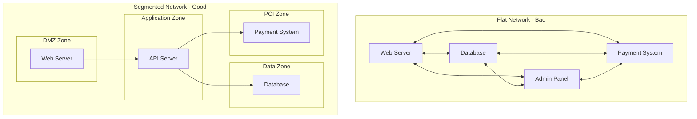
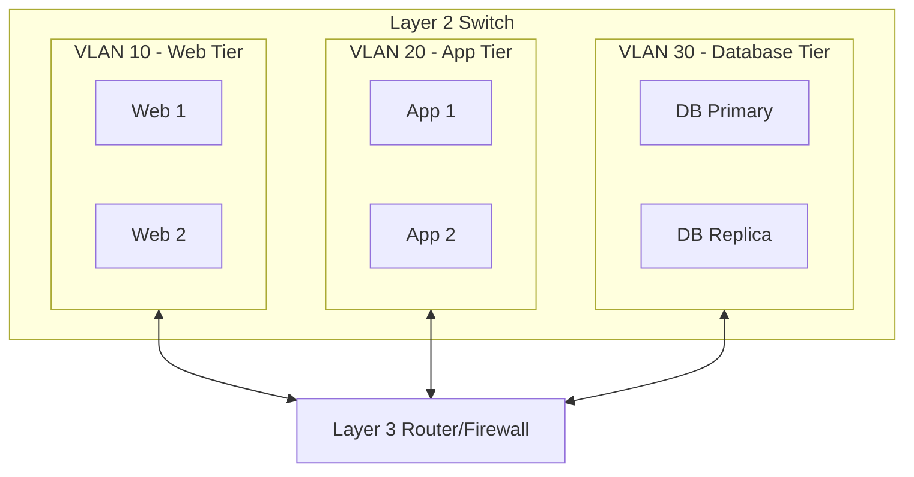
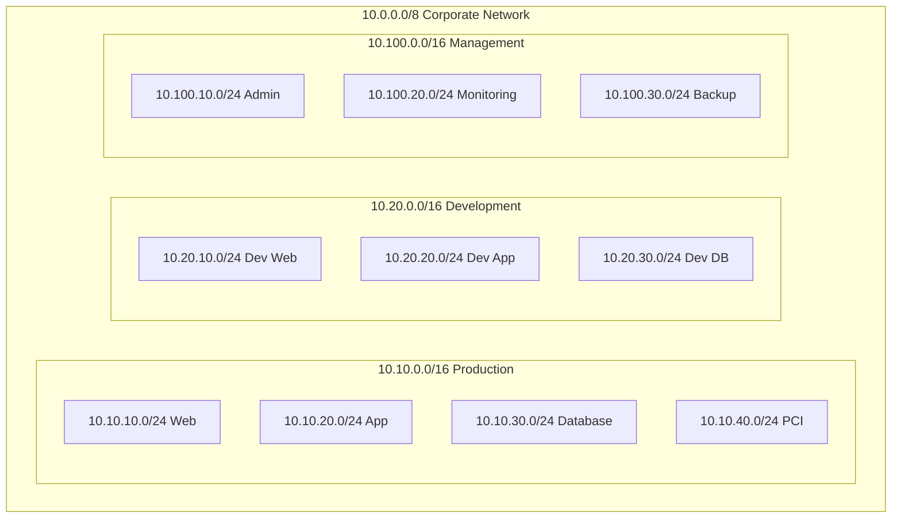
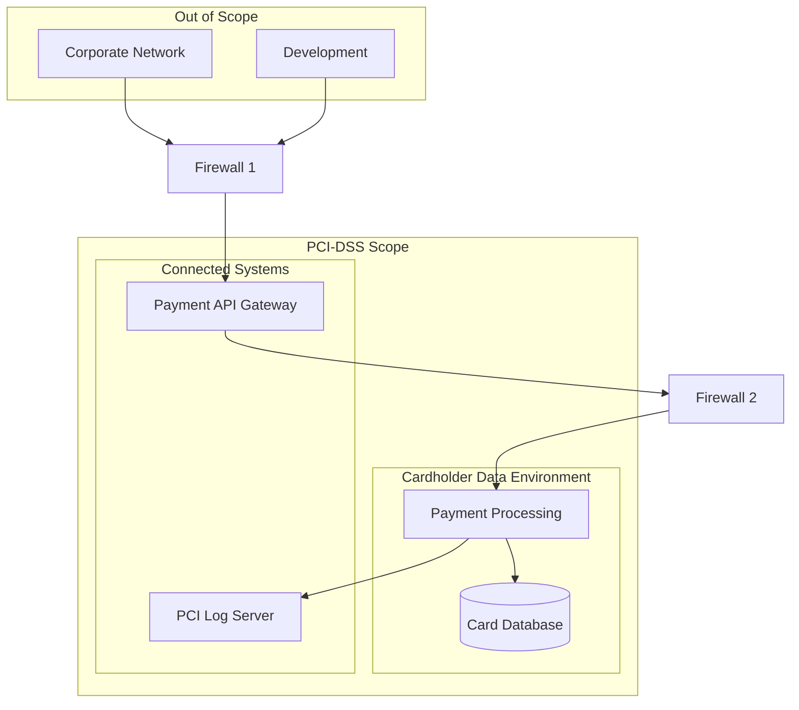

# How to Implement Network Segmentation Strategies

Author: [nawazdhandala](https://github.com/nawazdhandala)

Tags: Networking, Security, Segmentation, ZeroTrust

Description: A comprehensive guide to network segmentation strategies for isolating workloads, meeting compliance requirements, and implementing defense in depth.

---

Network segmentation divides your network into smaller, isolated zones. When an attacker compromises one segment, they cannot easily move to others. This is the foundation of defense in depth and a core requirement for compliance frameworks like PCI-DSS.

## Why Network Segmentation Matters

Without segmentation, your network is flat. A single compromised host can reach everything: databases, internal APIs, management interfaces. Segmentation limits blast radius.



## Segmentation Approaches

There are multiple ways to segment a network. The right choice depends on your infrastructure, compliance needs, and operational complexity tolerance.

### 1. Physical Segmentation

Completely separate hardware for each segment. Air-gapped networks use this approach.

**Pros:**
- Strongest isolation
- No software vulnerabilities can cross segments
- Required for some high-security environments

**Cons:**
- Expensive (separate switches, routers, cables)
- Difficult to manage
- Poor scalability

### 2. VLAN-Based Segmentation

Virtual LANs create logical network boundaries on shared physical infrastructure.



**Pros:**
- Cost effective
- Flexible and easy to reconfigure
- Works with existing infrastructure

**Cons:**
- Layer 2 only (relies on router/firewall for inter-VLAN filtering)
- VLAN hopping attacks possible if misconfigured
- Limited scalability (4096 VLANs max)

### 3. Subnet-Based Segmentation

Different IP subnets with routing and firewall rules controlling traffic flow.

**Pros:**
- Works at Layer 3
- Firewall rules provide granular control
- Scales well

**Cons:**
- Requires careful IP address planning
- Routing complexity increases with segments

### 4. Microsegmentation

Software-defined segmentation at the workload level. Each application or service has its own security policy regardless of network location.

**Pros:**
- Finest granularity
- Follows workloads across environments
- Zero-trust ready

**Cons:**
- Requires modern tooling (NSX, Cilium, Calico)
- Policy management complexity
- Higher learning curve

## VLAN Configuration Examples

### Cisco Switch VLAN Configuration

```bash
# Create VLANs on Cisco switch
# VLAN 10: Web tier servers
# VLAN 20: Application tier servers
# VLAN 30: Database tier servers
# VLAN 100: Management network

enable
configure terminal

# Create VLANs with descriptive names
vlan 10
 name WEB_TIER
 exit

vlan 20
 name APP_TIER
 exit

vlan 30
 name DATABASE_TIER
 exit

vlan 100
 name MANAGEMENT
 exit

# Assign ports to VLANs
# Ports 1-10 for web servers
interface range GigabitEthernet0/1-10
 switchport mode access
 switchport access vlan 10
 spanning-tree portfast
 exit

# Ports 11-20 for application servers
interface range GigabitEthernet0/11-20
 switchport mode access
 switchport access vlan 20
 spanning-tree portfast
 exit

# Ports 21-24 for database servers
interface range GigabitEthernet0/21-24
 switchport mode access
 switchport access vlan 30
 spanning-tree portfast
 exit

# Configure trunk port to router/firewall
interface GigabitEthernet0/48
 switchport mode trunk
 switchport trunk allowed vlan 10,20,30,100
 switchport trunk native vlan 999
 exit

end
write memory
```

### Linux VLAN Configuration

```bash
#!/bin/bash
# Configure VLANs on Linux server with multiple network segments
# Requires 8021q kernel module

# Load VLAN kernel module
modprobe 8021q
echo "8021q" >> /etc/modules

# Create VLAN interfaces on eth0
# VLAN 10 for web traffic
ip link add link eth0 name eth0.10 type vlan id 10
ip addr add 10.10.10.5/24 dev eth0.10
ip link set dev eth0.10 up

# VLAN 20 for application traffic
ip link add link eth0 name eth0.20 type vlan id 20
ip addr add 10.10.20.5/24 dev eth0.20
ip link set dev eth0.20 up

# VLAN 30 for database traffic
ip link add link eth0 name eth0.30 type vlan id 30
ip addr add 10.10.30.5/24 dev eth0.30
ip link set dev eth0.30 up

# Verify VLAN configuration
ip -d link show eth0.10
ip -d link show eth0.20
ip -d link show eth0.30
```

### Persistent VLAN Configuration (Netplan)

```yaml
# /etc/netplan/01-vlans.yaml
# Ubuntu/Debian network configuration with VLANs

network:
  version: 2
  renderer: networkd

  ethernets:
    eth0:
      dhcp4: false
      dhcp6: false

  vlans:
    # Web tier VLAN
    vlan10:
      id: 10
      link: eth0
      addresses:
        - 10.10.10.5/24
      routes:
        - to: 10.10.0.0/16
          via: 10.10.10.1

    # Application tier VLAN
    vlan20:
      id: 20
      link: eth0
      addresses:
        - 10.10.20.5/24

    # Database tier VLAN
    vlan30:
      id: 30
      link: eth0
      addresses:
        - 10.10.30.5/24
```

## Subnet Planning for Segmentation

Proper subnet design makes firewall rules cleaner and troubleshooting easier.



### IP Addressing Scheme

```bash
# Documented IP addressing scheme for network segmentation
# Use consistent patterns across environments

# Production Environment: 10.10.0.0/16
# 10.10.10.0/24  - Web tier (public facing)
# 10.10.20.0/24  - Application tier
# 10.10.30.0/24  - Database tier
# 10.10.40.0/24  - PCI cardholder data environment
# 10.10.50.0/24  - Internal APIs
# 10.10.100.0/24 - Load balancers

# Development Environment: 10.20.0.0/16
# 10.20.10.0/24  - Dev web tier
# 10.20.20.0/24  - Dev application tier
# 10.20.30.0/24  - Dev database tier

# Management Environment: 10.100.0.0/16
# 10.100.10.0/24 - Admin workstations
# 10.100.20.0/24 - Monitoring systems
# 10.100.30.0/24 - Backup infrastructure
# 10.100.40.0/24 - Security tools
```

## Firewall Rules Between Segments

Firewalls enforce traffic policies between segments. Every rule should follow the principle of least privilege.

### iptables Segmentation Rules

```bash
#!/bin/bash
# Firewall rules for three-tier application segmentation
# Run on router/firewall between segments

# Define network segments
WEB_TIER="10.10.10.0/24"
APP_TIER="10.10.20.0/24"
DB_TIER="10.10.30.0/24"
PCI_ZONE="10.10.40.0/24"
MGMT_NET="10.100.10.0/24"

# Flush existing rules
iptables -F FORWARD

# Set default policy to DROP (deny all by default)
iptables -P FORWARD DROP

# Allow established connections (stateful firewall)
iptables -A FORWARD -m state --state ESTABLISHED,RELATED -j ACCEPT

# Log dropped packets for troubleshooting
iptables -A FORWARD -j LOG --log-prefix "FW_DROP: " --log-level 4

# Web tier rules
# Allow internet to web servers on ports 80 and 443
iptables -A FORWARD -d $WEB_TIER -p tcp --dport 80 -j ACCEPT
iptables -A FORWARD -d $WEB_TIER -p tcp --dport 443 -j ACCEPT

# Allow web tier to app tier on port 8080 only
iptables -A FORWARD -s $WEB_TIER -d $APP_TIER -p tcp --dport 8080 -j ACCEPT

# App tier rules
# Allow app tier to database tier on PostgreSQL port
iptables -A FORWARD -s $APP_TIER -d $DB_TIER -p tcp --dport 5432 -j ACCEPT

# Allow app tier to PCI zone on specific API port
iptables -A FORWARD -s $APP_TIER -d $PCI_ZONE -p tcp --dport 8443 -j ACCEPT

# Management network rules
# Allow management to all segments on SSH
iptables -A FORWARD -s $MGMT_NET -p tcp --dport 22 -j ACCEPT

# Allow management to monitoring ports
iptables -A FORWARD -s $MGMT_NET -p tcp --dport 9090 -j ACCEPT
iptables -A FORWARD -s $MGMT_NET -p tcp --dport 9100 -j ACCEPT

# Block all other inter-segment traffic (implicit with DROP policy)
# But explicit deny helps with logging and clarity
iptables -A FORWARD -s $WEB_TIER -d $DB_TIER -j DROP
iptables -A FORWARD -s $WEB_TIER -d $PCI_ZONE -j DROP
iptables -A FORWARD -s $DB_TIER -d $WEB_TIER -j DROP

# Save rules
iptables-save > /etc/iptables/rules.v4
```

### nftables Segmentation Rules

```bash
#!/usr/sbin/nft -f
# Modern nftables configuration for network segmentation
# Cleaner syntax than iptables

flush ruleset

# Define variables for network segments
define WEB_TIER = 10.10.10.0/24
define APP_TIER = 10.10.20.0/24
define DB_TIER = 10.10.30.0/24
define PCI_ZONE = 10.10.40.0/24
define MGMT_NET = 10.100.10.0/24

table inet segmentation {
    # Chain for forwarded traffic between segments
    chain forward {
        type filter hook forward priority 0; policy drop;

        # Allow established and related connections
        ct state established,related accept

        # Drop invalid packets
        ct state invalid drop

        # Web tier: accept inbound HTTP/HTTPS
        ip daddr $WEB_TIER tcp dport { 80, 443 } accept

        # Web to App: allow application API calls
        ip saddr $WEB_TIER ip daddr $APP_TIER tcp dport 8080 accept

        # App to Database: allow PostgreSQL connections
        ip saddr $APP_TIER ip daddr $DB_TIER tcp dport 5432 accept

        # App to PCI: allow payment API
        ip saddr $APP_TIER ip daddr $PCI_ZONE tcp dport 8443 accept

        # Management access to all segments
        ip saddr $MGMT_NET tcp dport { 22, 9090, 9100 } accept

        # Log everything else before dropping
        log prefix "nft_drop: " flags all counter drop
    }
}
```

### pfSense/OPNsense Firewall Rules

```bash
# pfSense firewall rules export format
# Interface aliases defined in System > Aliases

# WEB_TIER_NET = 10.10.10.0/24
# APP_TIER_NET = 10.10.20.0/24
# DB_TIER_NET = 10.10.30.0/24
# PCI_ZONE_NET = 10.10.40.0/24

# Rules for WEB_TIER interface
# Allow HTTP/HTTPS from any
pass in on WEB_TIER proto tcp from any to WEB_TIER_NET port { 80, 443 }
# Allow outbound to APP tier only
pass out on WEB_TIER proto tcp from WEB_TIER_NET to APP_TIER_NET port 8080
# Block all other outbound
block out on WEB_TIER from WEB_TIER_NET to any

# Rules for APP_TIER interface
# Allow inbound from web tier
pass in on APP_TIER proto tcp from WEB_TIER_NET to APP_TIER_NET port 8080
# Allow outbound to database
pass out on APP_TIER proto tcp from APP_TIER_NET to DB_TIER_NET port 5432
# Allow outbound to PCI zone
pass out on APP_TIER proto tcp from APP_TIER_NET to PCI_ZONE_NET port 8443
# Block direct internet access
block out on APP_TIER from APP_TIER_NET to any

# Rules for DB_TIER interface
# Allow inbound from app tier only
pass in on DB_TIER proto tcp from APP_TIER_NET to DB_TIER_NET port 5432
# Block all outbound (databases should not initiate connections)
block out on DB_TIER from DB_TIER_NET to any
```

## PCI-DSS Compliance Requirements

PCI-DSS requires network segmentation to reduce the scope of compliance. Systems that process, store, or transmit cardholder data must be isolated.



### PCI-DSS Segmentation Checklist

```yaml
# PCI-DSS Network Segmentation Requirements
# Reference: PCI-DSS v4.0 Requirements 1 and 11

requirement_1:
  description: "Install and maintain network security controls"
  controls:
    - id: 1.2.1
      requirement: "Network security controls are configured and maintained"
      implementation: |
        # Document all firewall rules between CDE and other networks
        # Review rules quarterly and after any changes

    - id: 1.3.1
      requirement: "Inbound traffic to CDE is restricted"
      implementation: |
        # Only allow traffic from authorized sources
        # Payment API gateway is the only entry point
        iptables -A FORWARD -d 10.10.40.0/24 -s 10.10.20.0/24 -p tcp --dport 8443 -j ACCEPT
        iptables -A FORWARD -d 10.10.40.0/24 -j DROP

    - id: 1.3.2
      requirement: "Outbound traffic from CDE is restricted"
      implementation: |
        # CDE systems cannot initiate connections to untrusted networks
        # Allow only specific outbound to payment processors
        iptables -A FORWARD -s 10.10.40.0/24 -d PAYMENT_PROCESSOR_IP -p tcp --dport 443 -j ACCEPT
        iptables -A FORWARD -s 10.10.40.0/24 -j DROP

requirement_11:
  description: "Test security of systems and networks regularly"
  controls:
    - id: 11.4.5
      requirement: "Segmentation controls are verified"
      implementation: |
        # Penetration test segmentation controls at least annually
        # Test from each out-of-scope network to CDE
        # Document that CDE is unreachable from out-of-scope systems
```

### Segmentation Validation Script

```bash
#!/bin/bash
# Validate PCI-DSS network segmentation
# Run from out-of-scope network to verify CDE isolation

CDE_HOSTS=(
    "10.10.40.10"  # Payment server
    "10.10.40.20"  # Card database
    "10.10.40.30"  # PCI log server
)

CDE_PORTS=(
    "22"    # SSH
    "443"   # HTTPS
    "5432"  # PostgreSQL
    "8443"  # Payment API
)

echo "PCI-DSS Segmentation Validation"
echo "================================"
echo "Testing from: $(hostname) ($(hostname -I | awk '{print $1}'))"
echo "Date: $(date)"
echo ""

FAILURES=0

for host in "${CDE_HOSTS[@]}"; do
    echo "Testing connectivity to CDE host: $host"

    # Test ICMP (should be blocked)
    if ping -c 1 -W 2 "$host" &>/dev/null; then
        echo "  [FAIL] ICMP ping succeeded - segmentation violation!"
        ((FAILURES++))
    else
        echo "  [PASS] ICMP blocked"
    fi

    # Test each port
    for port in "${CDE_PORTS[@]}"; do
        if timeout 3 bash -c "echo >/dev/tcp/$host/$port" 2>/dev/null; then
            echo "  [FAIL] Port $port is reachable - segmentation violation!"
            ((FAILURES++))
        else
            echo "  [PASS] Port $port blocked"
        fi
    done
    echo ""
done

echo "================================"
if [ $FAILURES -eq 0 ]; then
    echo "RESULT: PASS - CDE is properly segmented"
    exit 0
else
    echo "RESULT: FAIL - $FAILURES segmentation violations found"
    exit 1
fi
```

## Cloud Network Segmentation

### AWS VPC Segmentation

```bash
# AWS CLI commands to create segmented VPC architecture

# Create VPC
aws ec2 create-vpc \
    --cidr-block 10.0.0.0/16 \
    --tag-specifications 'ResourceType=vpc,Tags=[{Key=Name,Value=segmented-vpc}]'

# Create subnets for each tier
# Public subnet for web tier (has internet gateway)
aws ec2 create-subnet \
    --vpc-id vpc-xxx \
    --cidr-block 10.0.10.0/24 \
    --availability-zone us-east-1a \
    --tag-specifications 'ResourceType=subnet,Tags=[{Key=Name,Value=web-tier},{Key=Tier,Value=public}]'

# Private subnet for application tier
aws ec2 create-subnet \
    --vpc-id vpc-xxx \
    --cidr-block 10.0.20.0/24 \
    --availability-zone us-east-1a \
    --tag-specifications 'ResourceType=subnet,Tags=[{Key=Name,Value=app-tier},{Key=Tier,Value=private}]'

# Private subnet for database tier
aws ec2 create-subnet \
    --vpc-id vpc-xxx \
    --cidr-block 10.0.30.0/24 \
    --availability-zone us-east-1a \
    --tag-specifications 'ResourceType=subnet,Tags=[{Key=Name,Value=db-tier},{Key=Tier,Value=private}]'

# Create security groups for each tier
# Web tier security group
aws ec2 create-security-group \
    --group-name web-tier-sg \
    --description "Security group for web tier" \
    --vpc-id vpc-xxx

# Allow HTTP/HTTPS from internet
aws ec2 authorize-security-group-ingress \
    --group-id sg-web-xxx \
    --protocol tcp \
    --port 443 \
    --cidr 0.0.0.0/0

# App tier security group - only accepts from web tier
aws ec2 create-security-group \
    --group-name app-tier-sg \
    --description "Security group for app tier" \
    --vpc-id vpc-xxx

aws ec2 authorize-security-group-ingress \
    --group-id sg-app-xxx \
    --protocol tcp \
    --port 8080 \
    --source-group sg-web-xxx

# Database tier security group - only accepts from app tier
aws ec2 create-security-group \
    --group-name db-tier-sg \
    --description "Security group for database tier" \
    --vpc-id vpc-xxx

aws ec2 authorize-security-group-ingress \
    --group-id sg-db-xxx \
    --protocol tcp \
    --port 5432 \
    --source-group sg-app-xxx
```

### Terraform Segmented Network

```hcl
# terraform/network-segmentation/main.tf
# Complete network segmentation with Terraform

terraform {
  required_providers {
    aws = {
      source  = "hashicorp/aws"
      version = "~> 5.0"
    }
  }
}

# Variables for CIDR blocks
variable "vpc_cidr" {
  default = "10.0.0.0/16"
}

variable "web_subnet_cidr" {
  default = "10.0.10.0/24"
}

variable "app_subnet_cidr" {
  default = "10.0.20.0/24"
}

variable "db_subnet_cidr" {
  default = "10.0.30.0/24"
}

# Create VPC
resource "aws_vpc" "segmented" {
  cidr_block           = var.vpc_cidr
  enable_dns_hostnames = true
  enable_dns_support   = true

  tags = {
    Name = "segmented-vpc"
  }
}

# Create subnets for each tier
resource "aws_subnet" "web_tier" {
  vpc_id                  = aws_vpc.segmented.id
  cidr_block              = var.web_subnet_cidr
  map_public_ip_on_launch = true
  availability_zone       = "us-east-1a"

  tags = {
    Name = "web-tier"
    Tier = "public"
  }
}

resource "aws_subnet" "app_tier" {
  vpc_id            = aws_vpc.segmented.id
  cidr_block        = var.app_subnet_cidr
  availability_zone = "us-east-1a"

  tags = {
    Name = "app-tier"
    Tier = "private"
  }
}

resource "aws_subnet" "db_tier" {
  vpc_id            = aws_vpc.segmented.id
  cidr_block        = var.db_subnet_cidr
  availability_zone = "us-east-1a"

  tags = {
    Name = "db-tier"
    Tier = "private"
  }
}

# Security group for web tier
resource "aws_security_group" "web_tier" {
  name        = "web-tier-sg"
  description = "Allow HTTPS from internet"
  vpc_id      = aws_vpc.segmented.id

  # Allow HTTPS from anywhere
  ingress {
    from_port   = 443
    to_port     = 443
    protocol    = "tcp"
    cidr_blocks = ["0.0.0.0/0"]
    description = "HTTPS from internet"
  }

  # Allow outbound to app tier only
  egress {
    from_port       = 8080
    to_port         = 8080
    protocol        = "tcp"
    security_groups = [aws_security_group.app_tier.id]
    description     = "To app tier API"
  }

  tags = {
    Name = "web-tier-sg"
  }
}

# Security group for app tier
resource "aws_security_group" "app_tier" {
  name        = "app-tier-sg"
  description = "Allow traffic from web tier only"
  vpc_id      = aws_vpc.segmented.id

  # Allow from web tier
  ingress {
    from_port       = 8080
    to_port         = 8080
    protocol        = "tcp"
    security_groups = [aws_security_group.web_tier.id]
    description     = "From web tier"
  }

  # Allow outbound to database tier
  egress {
    from_port       = 5432
    to_port         = 5432
    protocol        = "tcp"
    security_groups = [aws_security_group.db_tier.id]
    description     = "To database tier"
  }

  tags = {
    Name = "app-tier-sg"
  }
}

# Security group for database tier
resource "aws_security_group" "db_tier" {
  name        = "db-tier-sg"
  description = "Allow traffic from app tier only"
  vpc_id      = aws_vpc.segmented.id

  # Allow from app tier only
  ingress {
    from_port       = 5432
    to_port         = 5432
    protocol        = "tcp"
    security_groups = [aws_security_group.app_tier.id]
    description     = "PostgreSQL from app tier"
  }

  # No egress rules - databases should not initiate connections

  tags = {
    Name = "db-tier-sg"
  }
}

# Network ACLs for additional layer of security
resource "aws_network_acl" "db_tier" {
  vpc_id     = aws_vpc.segmented.id
  subnet_ids = [aws_subnet.db_tier.id]

  # Allow inbound PostgreSQL from app tier only
  ingress {
    protocol   = "tcp"
    rule_no    = 100
    action     = "allow"
    cidr_block = var.app_subnet_cidr
    from_port  = 5432
    to_port    = 5432
  }

  # Allow return traffic (ephemeral ports)
  ingress {
    protocol   = "tcp"
    rule_no    = 200
    action     = "allow"
    cidr_block = var.app_subnet_cidr
    from_port  = 1024
    to_port    = 65535
  }

  # Deny all other inbound
  ingress {
    protocol   = -1
    rule_no    = 999
    action     = "deny"
    cidr_block = "0.0.0.0/0"
    from_port  = 0
    to_port    = 0
  }

  # Allow outbound to app tier (return traffic)
  egress {
    protocol   = "tcp"
    rule_no    = 100
    action     = "allow"
    cidr_block = var.app_subnet_cidr
    from_port  = 1024
    to_port    = 65535
  }

  # Deny all other outbound
  egress {
    protocol   = -1
    rule_no    = 999
    action     = "deny"
    cidr_block = "0.0.0.0/0"
    from_port  = 0
    to_port    = 0
  }

  tags = {
    Name = "db-tier-nacl"
  }
}
```

## Kubernetes Network Segmentation

For Kubernetes environments, use Network Policies for microsegmentation.

```yaml
# kubernetes/network-policies/default-deny.yaml
# Start with default deny all traffic
apiVersion: networking.k8s.io/v1
kind: NetworkPolicy
metadata:
  name: default-deny-all
  namespace: production
spec:
  podSelector: {}
  policyTypes:
    - Ingress
    - Egress
---
# Allow DNS for all pods
apiVersion: networking.k8s.io/v1
kind: NetworkPolicy
metadata:
  name: allow-dns
  namespace: production
spec:
  podSelector: {}
  policyTypes:
    - Egress
  egress:
    - to:
        - namespaceSelector:
            matchLabels:
              kubernetes.io/metadata.name: kube-system
      ports:
        - protocol: UDP
          port: 53
---
# Web tier: allow ingress from load balancer
apiVersion: networking.k8s.io/v1
kind: NetworkPolicy
metadata:
  name: web-tier-ingress
  namespace: production
spec:
  podSelector:
    matchLabels:
      tier: web
  policyTypes:
    - Ingress
  ingress:
    - from:
        - namespaceSelector:
            matchLabels:
              kubernetes.io/metadata.name: ingress-nginx
      ports:
        - protocol: TCP
          port: 8080
---
# Web tier: allow egress to app tier only
apiVersion: networking.k8s.io/v1
kind: NetworkPolicy
metadata:
  name: web-tier-egress
  namespace: production
spec:
  podSelector:
    matchLabels:
      tier: web
  policyTypes:
    - Egress
  egress:
    - to:
        - podSelector:
            matchLabels:
              tier: app
      ports:
        - protocol: TCP
          port: 8080
---
# App tier: allow from web tier
apiVersion: networking.k8s.io/v1
kind: NetworkPolicy
metadata:
  name: app-tier-ingress
  namespace: production
spec:
  podSelector:
    matchLabels:
      tier: app
  policyTypes:
    - Ingress
  ingress:
    - from:
        - podSelector:
            matchLabels:
              tier: web
      ports:
        - protocol: TCP
          port: 8080
---
# App tier: allow egress to database tier
apiVersion: networking.k8s.io/v1
kind: NetworkPolicy
metadata:
  name: app-tier-egress
  namespace: production
spec:
  podSelector:
    matchLabels:
      tier: app
  policyTypes:
    - Egress
  egress:
    - to:
        - podSelector:
            matchLabels:
              tier: database
      ports:
        - protocol: TCP
          port: 5432
---
# Database tier: only accept from app tier
apiVersion: networking.k8s.io/v1
kind: NetworkPolicy
metadata:
  name: database-tier-ingress
  namespace: production
spec:
  podSelector:
    matchLabels:
      tier: database
  policyTypes:
    - Ingress
    - Egress
  ingress:
    - from:
        - podSelector:
            matchLabels:
              tier: app
      ports:
        - protocol: TCP
          port: 5432
  # No egress rules - database pods cannot initiate connections
```

## Monitoring Segmentation

Track traffic between segments to detect policy violations and anomalies.

```yaml
# prometheus/alerts/segmentation-alerts.yaml
# Alert on unexpected cross-segment traffic

groups:
  - name: network-segmentation
    rules:
      # Alert when database tier initiates outbound connections
      - alert: DatabaseTierOutboundTraffic
        expr: |
          sum(rate(network_transmit_bytes_total{
            src_zone="database",
            dst_zone!="app"
          }[5m])) > 0
        for: 1m
        labels:
          severity: critical
        annotations:
          summary: "Database tier initiating unexpected outbound traffic"
          description: "Database zone is sending traffic to {{ $labels.dst_zone }}"

      # Alert when web tier bypasses app tier to reach database
      - alert: WebToDatabaseDirect
        expr: |
          sum(rate(network_transmit_bytes_total{
            src_zone="web",
            dst_zone="database"
          }[5m])) > 0
        for: 1m
        labels:
          severity: critical
        annotations:
          summary: "Web tier directly accessing database tier"
          description: "Segmentation violation: web zone bypassing app tier"

      # Alert on any traffic to PCI zone from non-authorized sources
      - alert: UnauthorizedPCIAccess
        expr: |
          sum(rate(network_transmit_bytes_total{
            dst_zone="pci",
            src_zone!~"app|management"
          }[5m])) > 0
        for: 30s
        labels:
          severity: critical
        annotations:
          summary: "Unauthorized traffic to PCI zone"
          description: "Traffic from {{ $labels.src_zone }} to PCI zone detected"
```

## Best Practices Summary

1. **Start with default deny** - Block everything, then allow specific traffic
2. **Document all rules** - Every firewall rule needs a business justification
3. **Use least privilege** - Only allow the minimum required ports and protocols
4. **Segment by trust level** - Keep high-value assets (databases, PCI) in restricted zones
5. **Layer your defenses** - Combine VLANs, firewalls, and host-based controls
6. **Monitor and alert** - Track inter-segment traffic for anomalies
7. **Test regularly** - Validate segmentation with penetration tests
8. **Review quarterly** - Remove rules that are no longer needed

---

Network segmentation is not a one-time project. It requires ongoing maintenance, monitoring, and validation. But done right, it transforms a breach from a catastrophe into a contained incident. When attackers compromise your web server, they should hit a wall trying to reach your database.
