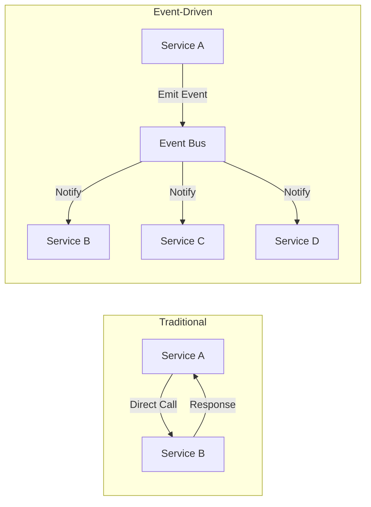
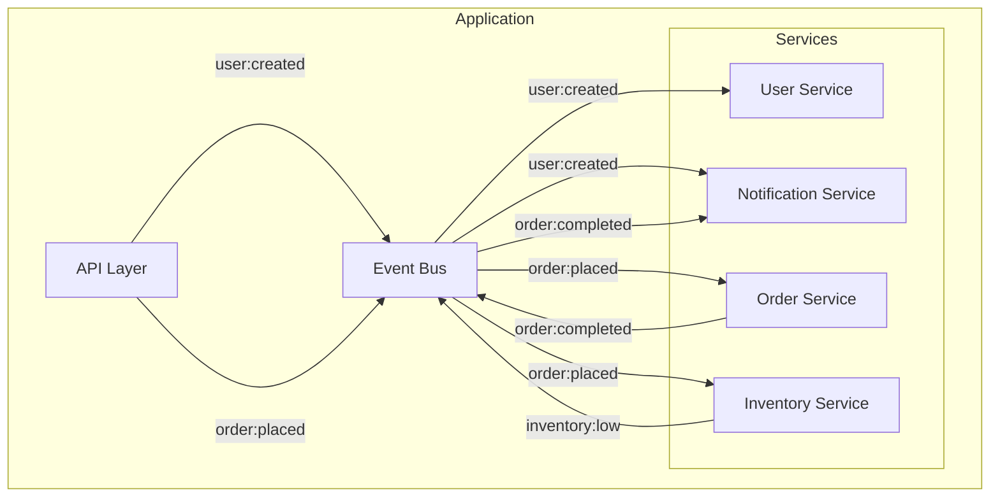

# How to Build Event-Driven Architecture in Node.js

Author: [nawazdhandala](https://www.github.com/nawazdhandala)

Tags: Node.js, Event-Driven, Architecture, EventEmitter, Design Patterns

Description: Learn how to build scalable event-driven applications in Node.js using EventEmitter, custom events, and async patterns for decoupled systems.

---

Event-driven architecture (EDA) is a design pattern where the flow of your application is determined by events rather than sequential function calls. If you have worked with Node.js for any length of time, you have already encountered this pattern - it is baked into the runtime itself. In this guide, we will explore how to build robust event-driven systems in Node.js, from basic EventEmitter usage to production-ready patterns.

## Why Event-Driven Architecture?

Before diving into code, let us understand why EDA matters:

- **Loose coupling**: Components communicate through events, not direct method calls
- **Scalability**: Easy to add new event handlers without modifying existing code
- **Async by nature**: Perfect fit for Node.js's non-blocking I/O model
- **Testability**: Events are easy to mock and verify

Here is a visual overview of how event-driven architecture differs from traditional request-response patterns:



## Getting Started with EventEmitter

Node.js provides the `EventEmitter` class in the `events` module. This is the foundation of all event-driven patterns in Node.js.

Here is a basic example that shows how to create an emitter and register listeners:

```javascript
// Import the EventEmitter class from Node.js core
const { EventEmitter } = require('events');

// Create a new instance of EventEmitter
const emitter = new EventEmitter();

// Register an event listener for the 'user:created' event
// This function will be called whenever 'user:created' is emitted
emitter.on('user:created', (user) => {
    console.log(`New user created: ${user.name}`);
});

// Register another listener for the same event
// Multiple listeners can respond to a single event
emitter.on('user:created', (user) => {
    console.log(`Sending welcome email to ${user.email}`);
});

// Emit the event with payload data
// All registered listeners will be called synchronously
emitter.emit('user:created', { name: 'Alice', email: 'alice@example.com' });
```

## Building a Custom Event Bus

For real applications, you want a centralized event bus that different modules can use. Let us build one:

```javascript
// eventBus.js
const { EventEmitter } = require('events');

class EventBus extends EventEmitter {
    constructor() {
        super();
        // Increase max listeners if you have many subscribers
        // Default is 10, which may cause warnings in larger apps
        this.setMaxListeners(50);
    }

    // Wrapper method that logs all emitted events for debugging
    // Useful for tracing event flow in development
    emitWithLogging(event, ...args) {
        console.log(`[EventBus] Emitting: ${event}`, args);
        this.emit(event, ...args);
    }

    // Register a one-time listener that automatically removes itself
    // Perfect for events you only need to handle once
    onceAsync(event) {
        return new Promise((resolve) => {
            this.once(event, resolve);
        });
    }
}

// Export a singleton instance
// All modules will share the same event bus
module.exports = new EventBus();
```

## Handling Async Events

One common challenge is handling asynchronous operations in event handlers. Here is a pattern that works well:

```javascript
const eventBus = require('./eventBus');

// Define an async event handler for order processing
// This demonstrates how to handle async operations in event listeners
async function handleOrderCreated(order) {
    try {
        // Validate the order data
        await validateOrder(order);

        // Process payment asynchronously
        const payment = await processPayment(order);

        // Update inventory after successful payment
        await updateInventory(order.items);

        // Emit success event for downstream consumers
        eventBus.emit('order:completed', { order, payment });
    } catch (error) {
        // Emit failure event so other services can react
        // Include original order for context in error handling
        eventBus.emit('order:failed', { order, error: error.message });
    }
}

// Register the async handler
eventBus.on('order:created', handleOrderCreated);
```

## The Observer Pattern with TypeScript

If you are using TypeScript, you can add type safety to your events:

```typescript
// types.ts
interface EventMap {
    'user:created': { id: string; name: string; email: string };
    'user:deleted': { id: string };
    'order:placed': { orderId: string; userId: string; total: number };
}

// typedEventBus.ts
import { EventEmitter } from 'events';

class TypedEventBus {
    private emitter = new EventEmitter();

    // Generic emit method that enforces payload types
    // TypeScript will error if payload doesn't match EventMap
    emit<K extends keyof EventMap>(event: K, payload: EventMap[K]): void {
        this.emitter.emit(event, payload);
    }

    // Generic listener registration with typed callback
    // Handler receives correctly typed payload automatically
    on<K extends keyof EventMap>(
        event: K,
        handler: (payload: EventMap[K]) => void
    ): void {
        this.emitter.on(event, handler);
    }

    // Remove a specific handler from an event
    off<K extends keyof EventMap>(
        event: K,
        handler: (payload: EventMap[K]) => void
    ): void {
        this.emitter.off(event, handler);
    }
}

export const eventBus = new TypedEventBus();
```

## Real-World Example: Notification Service

Let us build a practical notification service that reacts to various application events:

```javascript
// notificationService.js
const eventBus = require('./eventBus');

class NotificationService {
    constructor() {
        // Bind event handlers in constructor
        // This ensures proper 'this' context in handlers
        this.setupEventHandlers();
    }

    setupEventHandlers() {
        // Listen for user-related events
        eventBus.on('user:created', this.sendWelcomeEmail.bind(this));
        eventBus.on('user:password_reset', this.sendPasswordResetEmail.bind(this));

        // Listen for order events
        eventBus.on('order:completed', this.sendOrderConfirmation.bind(this));
        eventBus.on('order:shipped', this.sendShippingNotification.bind(this));
    }

    async sendWelcomeEmail({ email, name }) {
        // Implementation would use your email service
        console.log(`Sending welcome email to ${name} at ${email}`);
        await this.sendEmail(email, 'welcome', { name });
    }

    async sendOrderConfirmation({ order, payment }) {
        console.log(`Sending order confirmation for order ${order.id}`);
        await this.sendEmail(order.userEmail, 'order-confirmation', {
            orderNumber: order.id,
            total: payment.amount,
            items: order.items
        });
    }

    async sendEmail(to, template, data) {
        // Your actual email sending logic here
        // This is where you'd integrate with SendGrid, SES, etc.
    }
}

// Initialize the service - it will start listening automatically
module.exports = new NotificationService();
```

## Error Handling Best Practices

Proper error handling is critical in event-driven systems. Here is how to do it right:

```javascript
const eventBus = require('./eventBus');

// Global error handler for the event bus
// Prevents unhandled errors from crashing your application
eventBus.on('error', (error) => {
    console.error('[EventBus] Unhandled error:', error);
    // Send to your error tracking service
    // errorTracker.capture(error);
});

// Wrapper function for safe event handling
// Catches errors and emits them to the error handler
function safeHandler(handler) {
    return async (...args) => {
        try {
            await handler(...args);
        } catch (error) {
            // Emit error event instead of throwing
            // This prevents one handler from breaking others
            eventBus.emit('error', error);
        }
    };
}

// Usage with safe handler wrapper
eventBus.on('order:created', safeHandler(async (order) => {
    await processOrder(order);
}));
```

## Architecture Diagram

Here is how a complete event-driven system might look:



## Performance Considerations

When building event-driven systems, keep these points in mind:

1. **Listener limits**: The default max listener count is 10. Increase it if needed, but also investigate if you have a memory leak when you hit this limit.

2. **Sync vs Async**: EventEmitter calls listeners synchronously by default. Use `setImmediate` or `process.nextTick` if you need async behavior.

3. **Memory management**: Always remove listeners when components are destroyed to prevent memory leaks.

```javascript
// Cleanup example for a component that listens to events
class OrderComponent {
    constructor(eventBus) {
        this.eventBus = eventBus;
        // Store reference to bound handler for removal later
        this.handleOrder = this.handleOrder.bind(this);
        this.eventBus.on('order:created', this.handleOrder);
    }

    handleOrder(order) {
        // Handle the order
    }

    // Call this method when the component is destroyed
    destroy() {
        // Remove the listener to prevent memory leaks
        this.eventBus.off('order:created', this.handleOrder);
    }
}
```

## Conclusion

Event-driven architecture in Node.js provides a powerful way to build decoupled, scalable applications. The built-in EventEmitter gives you everything you need for simple use cases, while custom event bus implementations can add features like logging, type safety, and async support.

Start small with basic events and gradually add complexity as your application grows. The patterns shown here will serve you well whether you are building a small API or a large microservices system.

Key takeaways:
- Use EventEmitter for local event handling
- Create a centralized event bus for cross-module communication
- Always handle errors in event handlers
- Clean up listeners to prevent memory leaks
- Consider typed events for larger TypeScript projects

For distributed systems, consider message brokers like RabbitMQ, Redis Pub/Sub, or Apache Kafka, which extend these patterns across multiple services and machines.
