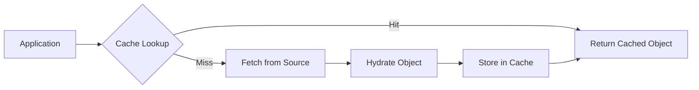
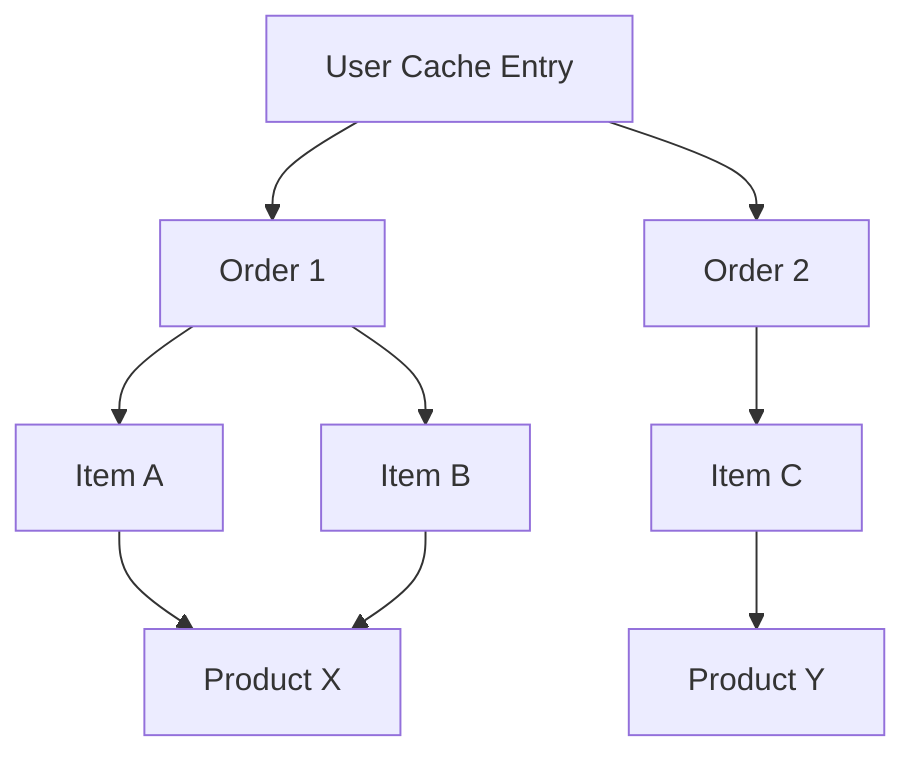
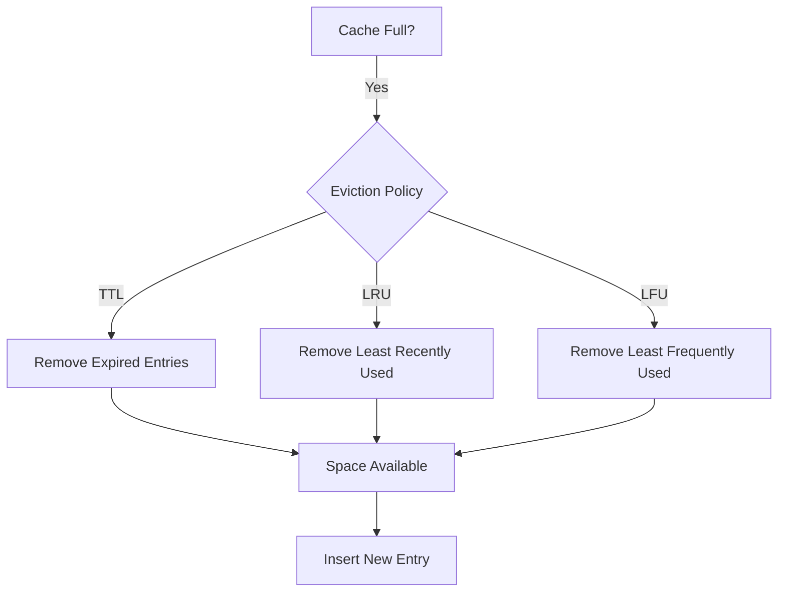

# How to Build Object Cache Design

Author: [nawazdhandala](https://github.com/nawazdhandala)

Tags: Caching, Objects, Serialization, Performance

Description: Learn to build object cache design for caching complex objects and entity graphs.

---

> Object caching sits between your application and expensive data sources. Done well, it slashes latency and cuts database load. Done poorly, it introduces stale data bugs and memory bloat that are hard to debug.

When your application repeatedly fetches the same data from a database or external API, you pay the latency cost every time. Object caching stores hydrated objects in memory so subsequent requests skip the expensive retrieval step entirely. This guide walks through building an object cache that handles complex objects and entity graphs without falling into common traps.

---

## 1. Understanding Object Cache Architecture

An object cache differs from a simple key-value store. Instead of caching raw strings or JSON, you cache fully constructed objects with their relationships intact. This means your application can use cached data immediately without parsing or hydration.

The basic flow looks like this:



The cache sits as a read-through layer. On a cache hit, the application gets the object directly. On a miss, the system fetches from the source, constructs the object, stores it for future use, and returns it.

---

## 2. Core Components of an Object Cache

Every object cache needs four building blocks: a storage mechanism, a key strategy, a serialization approach, and an eviction policy.

| Component | Purpose | Common Choices |
|-----------|---------|----------------|
| Storage | Holds cached objects | In-memory Map, Redis, Memcached |
| Key Strategy | Uniquely identifies cached items | Entity type + ID, composite keys |
| Serialization | Converts objects for storage | JSON, MessagePack, Protocol Buffers |
| Eviction Policy | Removes stale or excess entries | TTL, LRU, LFU |

Choosing the right combination depends on your scale and consistency requirements. For single-server applications, an in-memory Map with TTL works well. For distributed systems, Redis with LRU eviction provides durability and shared access.

---

## 3. Building a Basic Object Cache

Start with a simple implementation that handles single objects. The cache needs methods to get, set, and invalidate entries.

This TypeScript example shows a cache with TTL-based expiration:

```typescript
// ObjectCache.ts - A simple TTL-based object cache
interface CacheEntry<T> {
  value: T;
  expiresAt: number;
}

class ObjectCache<T> {
  private store: Map<string, CacheEntry<T>> = new Map();
  private defaultTTL: number;

  constructor(defaultTTLMs: number = 60000) {
    this.defaultTTL = defaultTTLMs;
  }

  // Retrieve an object if it exists and hasn't expired
  get(key: string): T | null {
    const entry = this.store.get(key);
    if (!entry) return null;

    if (Date.now() > entry.expiresAt) {
      this.store.delete(key);
      return null;
    }
    return entry.value;
  }

  // Store an object with optional custom TTL
  set(key: string, value: T, ttlMs?: number): void {
    const expiresAt = Date.now() + (ttlMs ?? this.defaultTTL);
    this.store.set(key, { value, expiresAt });
  }

  // Remove a specific entry
  invalidate(key: string): void {
    this.store.delete(key);
  }

  // Clear all entries matching a pattern
  invalidatePattern(pattern: RegExp): void {
    for (const key of this.store.keys()) {
      if (pattern.test(key)) {
        this.store.delete(key);
      }
    }
  }
}
```

The `invalidatePattern` method is useful when related entities change. If a user updates their profile, you can invalidate all cache entries containing that user's ID.

---

## 4. Handling Entity Graphs

Real applications rarely cache isolated objects. A User has Orders, Orders have Items, Items belong to Products. Caching these relationships requires careful design to avoid inconsistencies.

The entity graph problem looks like this:



When Product X's price changes, every cached entity referencing it becomes stale. You have three strategies to handle this.

**Strategy 1: Cache References, Not Copies**

Store entity IDs instead of embedded objects. When reading from cache, resolve references by looking up each related entity separately.

```typescript
// Store orders with product IDs, not full product objects
interface CachedOrder {
  id: string;
  userId: string;
  itemProductIds: string[];  // References, not embedded
  total: number;
  createdAt: Date;
}

// When retrieving, resolve the product references
async function getOrderWithProducts(
  orderId: string,
  orderCache: ObjectCache<CachedOrder>,
  productCache: ObjectCache<Product>
): Promise<OrderWithProducts | null> {
  const order = orderCache.get(`order:${orderId}`);
  if (!order) return null;

  // Resolve product references from their own cache
  const products = order.itemProductIds
    .map(id => productCache.get(`product:${id}`))
    .filter((p): p is Product => p !== null);

  return { ...order, products };
}
```

This approach keeps each entity in one place. Update the product cache, and all orders automatically see the new data on their next access.

**Strategy 2: Hierarchical Invalidation**

Track dependencies between cached entities. When one changes, invalidate all dependents.

```typescript
// DependencyTracker.ts - Track which cache entries depend on others
class DependencyTracker {
  // Maps a source key to all keys that depend on it
  private dependencies: Map<string, Set<string>> = new Map();

  // Register that 'dependent' relies on 'source'
  addDependency(source: string, dependent: string): void {
    if (!this.dependencies.has(source)) {
      this.dependencies.set(source, new Set());
    }
    this.dependencies.get(source)!.add(dependent);
  }

  // Get all keys that should be invalidated when source changes
  getDependents(source: string): string[] {
    const dependents = this.dependencies.get(source);
    return dependents ? Array.from(dependents) : [];
  }

  // Clean up when a dependent is removed
  removeDependency(source: string, dependent: string): void {
    this.dependencies.get(source)?.delete(dependent);
  }
}
```

**Strategy 3: Short TTLs with Background Refresh**

Accept eventual consistency by using short TTLs. Before entries expire, refresh them in the background so reads stay fast.

---

## 5. Serialization Considerations

When using external cache stores like Redis, objects must be serialized. The format you choose affects performance and compatibility.

| Format | Pros | Cons | Best For |
|--------|------|------|----------|
| JSON | Human readable, universal | No native Date/Map/Set support | Simple objects, debugging |
| MessagePack | Compact, fast | Binary format | High-throughput systems |
| Protocol Buffers | Schema validation, versioning | Requires schema definitions | Strict contracts, evolving schemas |

For JSON serialization with proper type handling, use a reviver function:

```typescript
// Serialize with type hints for complex objects
function serialize(obj: unknown): string {
  return JSON.stringify(obj, (key, value) => {
    if (value instanceof Date) {
      return { __type: 'Date', value: value.toISOString() };
    }
    if (value instanceof Map) {
      return { __type: 'Map', value: Array.from(value.entries()) };
    }
    return value;
  });
}

// Deserialize with type reconstruction
function deserialize<T>(json: string): T {
  return JSON.parse(json, (key, value) => {
    if (value && typeof value === 'object' && '__type' in value) {
      if (value.__type === 'Date') return new Date(value.value);
      if (value.__type === 'Map') return new Map(value.value);
    }
    return value;
  });
}
```

---

## 6. Eviction Strategies

Memory is finite. Your cache needs a strategy for removing entries when space runs low or data goes stale.



TTL eviction is simplest: entries expire after a fixed time regardless of access patterns. LRU (Least Recently Used) keeps hot data and removes cold entries. LFU (Least Frequently Used) tracks access counts, keeping popular items longer.

For most applications, TTL combined with LRU provides a good balance. Entries expire naturally, and if memory pressure hits before expiration, rarely-accessed items go first.

---

## 7. Cache Warming and Stampede Prevention

Cold caches hurt performance. When your application restarts, every request becomes a cache miss. Cache warming preloads frequently accessed data at startup.

The cache stampede problem occurs when many requests hit the same uncached key simultaneously. All of them trigger database queries, overwhelming the source.

Prevent stampedes with request coalescing:

```typescript
// Coalesce concurrent requests for the same key
class CoalescingCache<T> {
  private cache: ObjectCache<T>;
  private pending: Map<string, Promise<T>> = new Map();

  constructor(cache: ObjectCache<T>) {
    this.cache = cache;
  }

  async getOrFetch(key: string, fetcher: () => Promise<T>): Promise<T> {
    // Check cache first
    const cached = this.cache.get(key);
    if (cached) return cached;

    // If a fetch is already in progress, wait for it
    if (this.pending.has(key)) {
      return this.pending.get(key)!;
    }

    // Start the fetch and track the promise
    const fetchPromise = fetcher().then(value => {
      this.cache.set(key, value);
      this.pending.delete(key);
      return value;
    });

    this.pending.set(key, fetchPromise);
    return fetchPromise;
  }
}
```

When multiple requests arrive for the same missing key, only one fetch executes. All others wait for that single result.

---

## Summary

Object caching accelerates applications by storing hydrated objects close to where they are used. The key design decisions are:

1. **Key strategy**: Use consistent patterns like `entity:id` for easy invalidation
2. **Reference handling**: Cache references instead of copies to avoid stale nested data
3. **Serialization**: Pick a format that balances readability, performance, and type fidelity
4. **Eviction**: Combine TTL with LRU to bound memory while keeping hot data available
5. **Stampede prevention**: Coalesce concurrent requests to protect your data source

Start with a simple in-memory cache for development and testing. As your system scales, move to Redis or Memcached while keeping the same interface. The patterns remain the same whether caching locally or across a distributed cluster.

---

**Related Reading:**
- [When Performance Matters, Skip the ORM](https://oneuptime.com/blog/post/2025-11-13-when-performance-matters-skip-the-orm/view)
- [Basics of Profiling: Turning CPU and Memory Hotspots into Action](https://oneuptime.com/blog/post/2025-09-09-basics-of-profiling/view)
