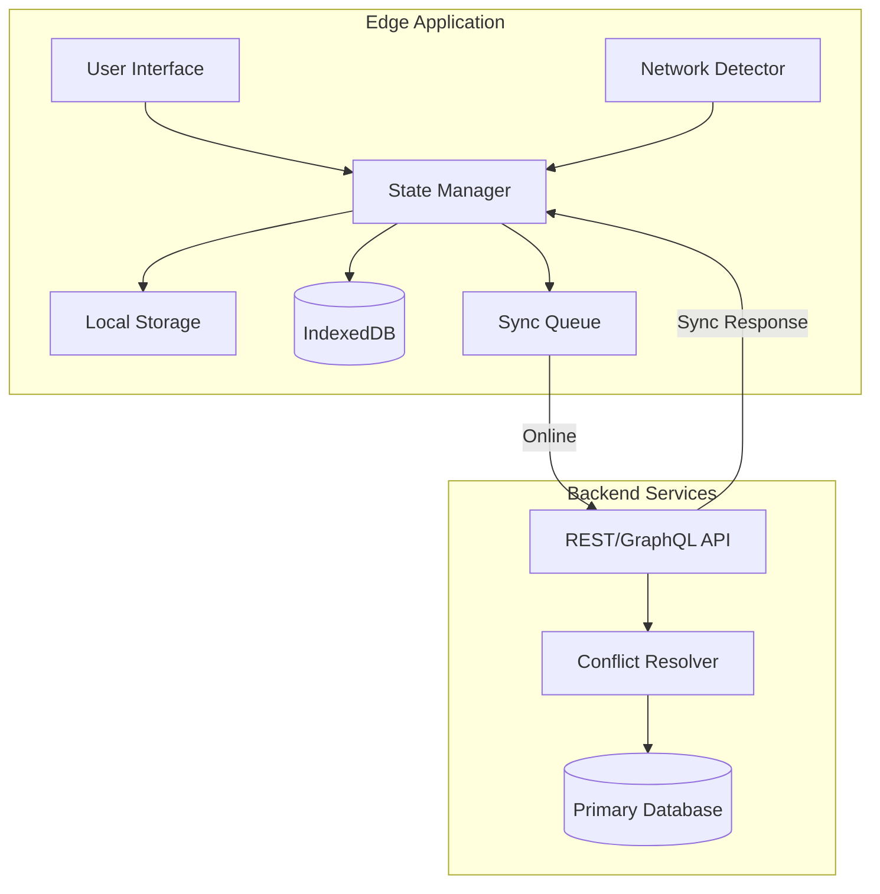
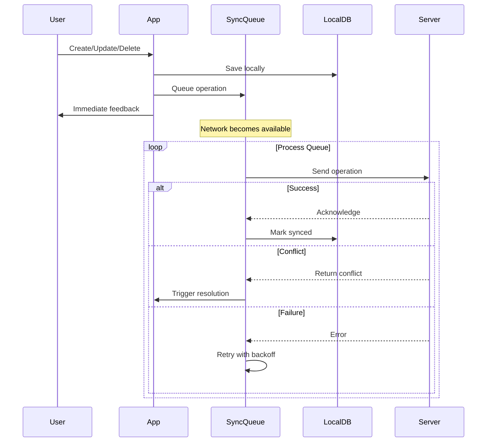
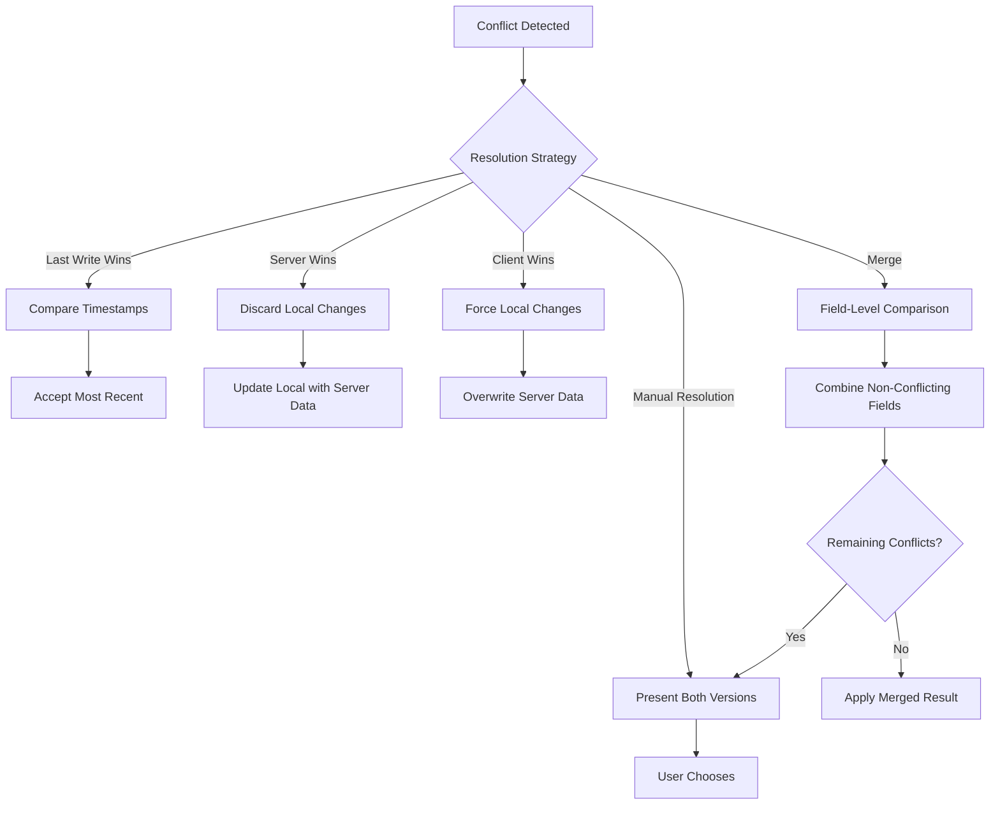
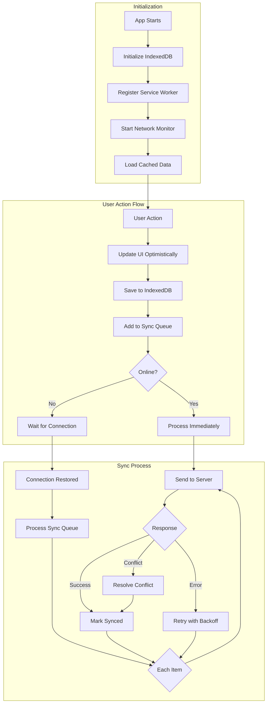

# How to Build Offline Capabilities

Author: [nawazdhandala](https://github.com/nawazdhandala)

Tags: Edge Computing, Offline-First, PWA, Data Persistence

Description: Learn to implement offline capabilities with local storage, sync queues, and conflict resolution for resilient edge applications.

---

Edge applications face a unique challenge - they must continue functioning even when network connectivity is unreliable or completely unavailable. Whether you are building IoT dashboards, field service applications, or progressive web apps (PWAs), implementing robust offline capabilities is essential for delivering a seamless user experience.

In this guide, we will explore the key strategies and technologies for building offline-first edge applications that can store data locally, queue operations for later sync, handle conflicts gracefully, and detect connectivity changes in real time.

## Understanding the Offline-First Architecture

Before diving into implementation details, let us understand the high-level architecture of an offline-capable application.



The core principle is simple - always write to local storage first, then sync with the server when connectivity is available. This ensures the application remains responsive regardless of network conditions.

## Local Storage Strategies

Modern browsers provide multiple storage options, each suited for different use cases.

### Web Storage API (localStorage and sessionStorage)

The Web Storage API is the simplest option for storing small amounts of data. It is synchronous and has a typical limit of 5-10 MB per origin.

```javascript
// Storage utility wrapper for type safety and error handling
class LocalStorageManager {
    constructor(prefix = 'app') {
        this.prefix = prefix;
    }

    getKey(key) {
        return `${this.prefix}:${key}`;
    }

    set(key, value, ttl = null) {
        try {
            const item = {
                value: value,
                timestamp: Date.now(),
                ttl: ttl
            };
            localStorage.setItem(this.getKey(key), JSON.stringify(item));
            return true;
        } catch (error) {
            // Handle quota exceeded or other errors
            if (error.name === 'QuotaExceededError') {
                this.cleanup();
                return this.set(key, value, ttl);
            }
            console.error('LocalStorage set error:', error);
            return false;
        }
    }

    get(key) {
        try {
            const itemStr = localStorage.getItem(this.getKey(key));
            if (!itemStr) return null;

            const item = JSON.parse(itemStr);

            // Check if item has expired
            if (item.ttl && Date.now() - item.timestamp > item.ttl) {
                this.remove(key);
                return null;
            }

            return item.value;
        } catch (error) {
            console.error('LocalStorage get error:', error);
            return null;
        }
    }

    remove(key) {
        localStorage.removeItem(this.getKey(key));
    }

    cleanup() {
        // Remove expired items to free up space
        const keysToRemove = [];
        for (let i = 0; i < localStorage.length; i++) {
            const key = localStorage.key(i);
            if (key.startsWith(this.prefix)) {
                const itemStr = localStorage.getItem(key);
                const item = JSON.parse(itemStr);
                if (item.ttl && Date.now() - item.timestamp > item.ttl) {
                    keysToRemove.push(key);
                }
            }
        }
        keysToRemove.forEach(key => localStorage.removeItem(key));
    }
}

// Usage
const storage = new LocalStorageManager('myEdgeApp');
storage.set('userPreferences', { theme: 'dark', language: 'en' });
storage.set('sessionToken', 'abc123', 3600000); // 1 hour TTL
```

### When to Use localStorage

- User preferences and settings
- Small configuration data
- Authentication tokens (with proper security considerations)
- Simple cache for frequently accessed data

## IndexedDB for Complex Data

For larger datasets or when you need advanced querying capabilities, IndexedDB is the preferred choice. It supports transactions, indexes, and can store structured data including files and blobs.

```javascript
class OfflineDatabase {
    constructor(dbName, version = 1) {
        this.dbName = dbName;
        this.version = version;
        this.db = null;
    }

    async init(stores) {
        return new Promise((resolve, reject) => {
            const request = indexedDB.open(this.dbName, this.version);

            request.onerror = () => reject(request.error);
            request.onsuccess = () => {
                this.db = request.result;
                resolve(this.db);
            };

            request.onupgradeneeded = (event) => {
                const db = event.target.result;

                stores.forEach(store => {
                    if (!db.objectStoreNames.contains(store.name)) {
                        const objectStore = db.createObjectStore(store.name, {
                            keyPath: store.keyPath,
                            autoIncrement: store.autoIncrement || false
                        });

                        // Create indexes for efficient querying
                        if (store.indexes) {
                            store.indexes.forEach(index => {
                                objectStore.createIndex(
                                    index.name,
                                    index.keyPath,
                                    { unique: index.unique || false }
                                );
                            });
                        }
                    }
                });
            };
        });
    }

    async add(storeName, data) {
        return this.executeTransaction(storeName, 'readwrite', (store) => {
            // Add metadata for sync tracking
            const record = {
                ...data,
                _syncStatus: 'pending',
                _createdAt: Date.now(),
                _updatedAt: Date.now()
            };
            return store.add(record);
        });
    }

    async put(storeName, data) {
        return this.executeTransaction(storeName, 'readwrite', (store) => {
            const record = {
                ...data,
                _syncStatus: 'pending',
                _updatedAt: Date.now()
            };
            return store.put(record);
        });
    }

    async get(storeName, key) {
        return this.executeTransaction(storeName, 'readonly', (store) => {
            return store.get(key);
        });
    }

    async getAll(storeName, query = null) {
        return this.executeTransaction(storeName, 'readonly', (store) => {
            return query ? store.index(query.index).getAll(query.value) : store.getAll();
        });
    }

    async getPending(storeName) {
        return this.executeTransaction(storeName, 'readonly', (store) => {
            const index = store.index('syncStatus');
            return index.getAll('pending');
        });
    }

    async markSynced(storeName, key) {
        const record = await this.get(storeName, key);
        if (record) {
            record._syncStatus = 'synced';
            record._syncedAt = Date.now();
            return this.executeTransaction(storeName, 'readwrite', (store) => {
                return store.put(record);
            });
        }
    }

    executeTransaction(storeName, mode, callback) {
        return new Promise((resolve, reject) => {
            const transaction = this.db.transaction(storeName, mode);
            const store = transaction.objectStore(storeName);
            const request = callback(store);

            request.onsuccess = () => resolve(request.result);
            request.onerror = () => reject(request.error);
        });
    }
}

// Initialize the database with schema
const offlineDB = new OfflineDatabase('EdgeApp', 1);

await offlineDB.init([
    {
        name: 'tasks',
        keyPath: 'id',
        indexes: [
            { name: 'syncStatus', keyPath: '_syncStatus' },
            { name: 'createdAt', keyPath: '_createdAt' },
            { name: 'category', keyPath: 'category' }
        ]
    },
    {
        name: 'syncQueue',
        keyPath: 'id',
        autoIncrement: true,
        indexes: [
            { name: 'timestamp', keyPath: 'timestamp' },
            { name: 'operation', keyPath: 'operation' }
        ]
    }
]);
```

## Building a Sync Queue

The sync queue is crucial for offline-first applications. It captures all operations performed while offline and replays them when connectivity is restored.



Here is a robust implementation of a sync queue:

```javascript
class SyncQueue {
    constructor(offlineDB, apiClient) {
        this.db = offlineDB;
        this.api = apiClient;
        this.isProcessing = false;
        this.retryDelays = [1000, 5000, 15000, 60000]; // Exponential backoff
    }

    async enqueue(operation) {
        const queueItem = {
            id: crypto.randomUUID(),
            operation: operation.type, // 'CREATE', 'UPDATE', 'DELETE'
            entity: operation.entity,
            data: operation.data,
            timestamp: Date.now(),
            retryCount: 0,
            status: 'pending'
        };

        await this.db.add('syncQueue', queueItem);

        // Attempt immediate sync if online
        if (navigator.onLine) {
            this.processQueue();
        }

        return queueItem.id;
    }

    async processQueue() {
        if (this.isProcessing || !navigator.onLine) {
            return;
        }

        this.isProcessing = true;

        try {
            const pendingItems = await this.db.getAll('syncQueue', {
                index: 'status',
                value: 'pending'
            });

            // Sort by timestamp to maintain order
            pendingItems.sort((a, b) => a.timestamp - b.timestamp);

            for (const item of pendingItems) {
                await this.processItem(item);
            }
        } finally {
            this.isProcessing = false;
        }
    }

    async processItem(item) {
        try {
            const result = await this.sendToServer(item);

            if (result.success) {
                // Update local record with server response
                if (result.data) {
                    await this.db.put(item.entity, {
                        ...result.data,
                        _syncStatus: 'synced',
                        _syncedAt: Date.now()
                    });
                }
                // Remove from queue
                await this.removeFromQueue(item.id);
            } else if (result.conflict) {
                await this.handleConflict(item, result);
            }
        } catch (error) {
            await this.handleError(item, error);
        }
    }

    async sendToServer(item) {
        const endpoints = {
            CREATE: { method: 'POST', path: `/${item.entity}` },
            UPDATE: { method: 'PUT', path: `/${item.entity}/${item.data.id}` },
            DELETE: { method: 'DELETE', path: `/${item.entity}/${item.data.id}` }
        };

        const config = endpoints[item.operation];

        const response = await this.api.request({
            method: config.method,
            url: config.path,
            data: item.data,
            headers: {
                'X-Client-Timestamp': item.timestamp,
                'X-Sync-Id': item.id
            }
        });

        return response;
    }

    async handleError(item, error) {
        item.retryCount += 1;
        item.lastError = error.message;

        if (item.retryCount >= this.retryDelays.length) {
            item.status = 'failed';
            await this.db.put('syncQueue', item);
            this.notifyFailure(item);
        } else {
            // Schedule retry with exponential backoff
            const delay = this.retryDelays[item.retryCount - 1];
            setTimeout(() => this.processItem(item), delay);
            await this.db.put('syncQueue', item);
        }
    }

    async removeFromQueue(id) {
        return this.db.executeTransaction('syncQueue', 'readwrite', (store) => {
            return store.delete(id);
        });
    }

    notifyFailure(item) {
        // Emit event for UI to handle
        window.dispatchEvent(new CustomEvent('sync-failure', {
            detail: { item }
        }));
    }
}
```

## Conflict Resolution Strategies

Conflicts occur when the same data is modified both locally and on the server. There are several strategies to handle this:



Here is an implementation of a conflict resolver:

```javascript
class ConflictResolver {
    constructor(strategy = 'lastWriteWins') {
        this.strategy = strategy;
        this.customResolvers = new Map();
    }

    registerResolver(entity, resolver) {
        this.customResolvers.set(entity, resolver);
    }

    async resolve(localData, serverData, entity) {
        // Check for custom resolver first
        if (this.customResolvers.has(entity)) {
            return this.customResolvers.get(entity)(localData, serverData);
        }

        switch (this.strategy) {
            case 'lastWriteWins':
                return this.lastWriteWins(localData, serverData);
            case 'serverWins':
                return this.serverWins(serverData);
            case 'clientWins':
                return this.clientWins(localData);
            case 'merge':
                return this.merge(localData, serverData);
            case 'manual':
                return this.promptUser(localData, serverData);
            default:
                return this.lastWriteWins(localData, serverData);
        }
    }

    lastWriteWins(localData, serverData) {
        const localTime = localData._updatedAt || 0;
        const serverTime = new Date(serverData.updatedAt).getTime() || 0;

        return {
            resolved: true,
            data: localTime > serverTime ? localData : serverData,
            source: localTime > serverTime ? 'local' : 'server'
        };
    }

    serverWins(serverData) {
        return {
            resolved: true,
            data: serverData,
            source: 'server'
        };
    }

    clientWins(localData) {
        return {
            resolved: true,
            data: localData,
            source: 'local'
        };
    }

    merge(localData, serverData) {
        const merged = { ...serverData };
        const conflicts = [];

        // Compare each field
        for (const key of Object.keys(localData)) {
            if (key.startsWith('_')) continue; // Skip metadata

            if (!(key in serverData)) {
                // Field only exists locally
                merged[key] = localData[key];
            } else if (JSON.stringify(localData[key]) !== JSON.stringify(serverData[key])) {
                // Field differs - check if server version is newer
                if (localData._updatedAt > new Date(serverData.updatedAt).getTime()) {
                    merged[key] = localData[key];
                } else {
                    conflicts.push({
                        field: key,
                        localValue: localData[key],
                        serverValue: serverData[key]
                    });
                }
            }
        }

        if (conflicts.length > 0) {
            return {
                resolved: false,
                data: merged,
                conflicts: conflicts
            };
        }

        return {
            resolved: true,
            data: merged,
            source: 'merged'
        };
    }

    async promptUser(localData, serverData) {
        return new Promise((resolve) => {
            window.dispatchEvent(new CustomEvent('conflict-resolution-needed', {
                detail: {
                    local: localData,
                    server: serverData,
                    resolve: (choice) => {
                        resolve({
                            resolved: true,
                            data: choice === 'local' ? localData : serverData,
                            source: choice
                        });
                    }
                }
            }));
        });
    }
}

// Usage with sync queue
class SyncQueueWithConflicts extends SyncQueue {
    constructor(offlineDB, apiClient, conflictResolver) {
        super(offlineDB, apiClient);
        this.resolver = conflictResolver;
    }

    async handleConflict(item, serverResponse) {
        const localData = item.data;
        const serverData = serverResponse.serverVersion;

        const resolution = await this.resolver.resolve(
            localData,
            serverData,
            item.entity
        );

        if (resolution.resolved) {
            if (resolution.source === 'local') {
                // Retry with force flag
                item.data._forceOverwrite = true;
                await this.processItem(item);
            } else {
                // Accept server version
                await this.db.put(item.entity, {
                    ...resolution.data,
                    _syncStatus: 'synced'
                });
                await this.removeFromQueue(item.id);
            }
        } else {
            // Store unresolved conflicts for manual resolution
            item.status = 'conflict';
            item.conflicts = resolution.conflicts;
            await this.db.put('syncQueue', item);
        }
    }
}
```

## Network Status Detection

Detecting online and offline states allows your application to respond appropriately to connectivity changes.

```javascript
class NetworkMonitor {
    constructor() {
        this.isOnline = navigator.onLine;
        this.listeners = new Set();
        this.connectionQuality = null;

        this.init();
    }

    init() {
        window.addEventListener('online', () => this.handleOnline());
        window.addEventListener('offline', () => this.handleOffline());

        // Use Network Information API if available
        if ('connection' in navigator) {
            navigator.connection.addEventListener('change', () => {
                this.updateConnectionQuality();
            });
            this.updateConnectionQuality();
        }

        // Periodic connectivity check for more reliable detection
        setInterval(() => this.checkConnectivity(), 30000);
    }

    handleOnline() {
        this.isOnline = true;
        this.notifyListeners({ type: 'online', timestamp: Date.now() });
    }

    handleOffline() {
        this.isOnline = false;
        this.notifyListeners({ type: 'offline', timestamp: Date.now() });
    }

    updateConnectionQuality() {
        const conn = navigator.connection;
        this.connectionQuality = {
            effectiveType: conn.effectiveType, // '4g', '3g', '2g', 'slow-2g'
            downlink: conn.downlink, // Mbps
            rtt: conn.rtt, // Round trip time in ms
            saveData: conn.saveData
        };

        this.notifyListeners({
            type: 'quality-change',
            quality: this.connectionQuality
        });
    }

    async checkConnectivity() {
        try {
            // Use a lightweight endpoint for checking
            const response = await fetch('/api/health', {
                method: 'HEAD',
                cache: 'no-store',
                signal: AbortSignal.timeout(5000)
            });

            if (!this.isOnline && response.ok) {
                this.handleOnline();
            }
        } catch (error) {
            if (this.isOnline) {
                this.handleOffline();
            }
        }
    }

    subscribe(callback) {
        this.listeners.add(callback);
        return () => this.listeners.delete(callback);
    }

    notifyListeners(event) {
        this.listeners.forEach(callback => callback(event));
    }

    getStatus() {
        return {
            isOnline: this.isOnline,
            quality: this.connectionQuality
        };
    }
}

// React hook example
function useNetworkStatus() {
    const [status, setStatus] = useState(() => networkMonitor.getStatus());

    useEffect(() => {
        const unsubscribe = networkMonitor.subscribe((event) => {
            setStatus(networkMonitor.getStatus());
        });

        return unsubscribe;
    }, []);

    return status;
}

// Usage in component
function OfflineIndicator() {
    const { isOnline, quality } = useNetworkStatus();

    if (!isOnline) {
        return (
            <div className="offline-banner">
                You are currently offline. Changes will sync when connected.
            </div>
        );
    }

    if (quality?.effectiveType === 'slow-2g' || quality?.effectiveType === '2g') {
        return (
            <div className="slow-connection-banner">
                Slow connection detected. Some features may be limited.
            </div>
        );
    }

    return null;
}
```

## Service Workers for Advanced Caching

Service workers provide powerful caching capabilities and enable true offline functionality for web applications.

```javascript
// service-worker.js
const CACHE_NAME = 'edge-app-v1';
const STATIC_ASSETS = [
    '/',
    '/index.html',
    '/styles.css',
    '/app.js',
    '/offline.html'
];

// Install event - cache static assets
self.addEventListener('install', (event) => {
    event.waitUntil(
        caches.open(CACHE_NAME).then((cache) => {
            return cache.addAll(STATIC_ASSETS);
        })
    );
});

// Activate event - clean up old caches
self.addEventListener('activate', (event) => {
    event.waitUntil(
        caches.keys().then((cacheNames) => {
            return Promise.all(
                cacheNames
                    .filter((name) => name !== CACHE_NAME)
                    .map((name) => caches.delete(name))
            );
        })
    );
});

// Fetch event - serve from cache, fallback to network
self.addEventListener('fetch', (event) => {
    const { request } = event;
    const url = new URL(request.url);

    // API requests - network first, then cache
    if (url.pathname.startsWith('/api/')) {
        event.respondWith(networkFirst(request));
        return;
    }

    // Static assets - cache first, then network
    event.respondWith(cacheFirst(request));
});

async function cacheFirst(request) {
    const cached = await caches.match(request);
    if (cached) {
        return cached;
    }

    try {
        const response = await fetch(request);
        if (response.ok) {
            const cache = await caches.open(CACHE_NAME);
            cache.put(request, response.clone());
        }
        return response;
    } catch (error) {
        // Return offline page for navigation requests
        if (request.mode === 'navigate') {
            return caches.match('/offline.html');
        }
        throw error;
    }
}

async function networkFirst(request) {
    try {
        const response = await fetch(request);
        if (response.ok) {
            const cache = await caches.open(CACHE_NAME);
            cache.put(request, response.clone());
        }
        return response;
    } catch (error) {
        const cached = await caches.match(request);
        if (cached) {
            return cached;
        }

        // Return a JSON error response for API requests
        return new Response(
            JSON.stringify({ error: 'Offline', cached: false }),
            {
                status: 503,
                headers: { 'Content-Type': 'application/json' }
            }
        );
    }
}

// Background sync for queued operations
self.addEventListener('sync', (event) => {
    if (event.tag === 'sync-queue') {
        event.waitUntil(processSyncQueue());
    }
});

async function processSyncQueue() {
    // Communicate with main thread to process sync queue
    const clients = await self.clients.matchAll();
    clients.forEach((client) => {
        client.postMessage({ type: 'PROCESS_SYNC_QUEUE' });
    });
}
```

## Putting It All Together

Here is how all these components work together in a complete offline-first application:



```javascript
// Main application initialization
class OfflineFirstApp {
    constructor() {
        this.db = null;
        this.syncQueue = null;
        this.networkMonitor = null;
        this.conflictResolver = null;
    }

    async init() {
        // Initialize database
        this.db = new OfflineDatabase('MyEdgeApp', 1);
        await this.db.init([
            {
                name: 'items',
                keyPath: 'id',
                indexes: [
                    { name: 'syncStatus', keyPath: '_syncStatus' },
                    { name: 'category', keyPath: 'category' }
                ]
            },
            {
                name: 'syncQueue',
                keyPath: 'id',
                autoIncrement: true,
                indexes: [
                    { name: 'timestamp', keyPath: 'timestamp' },
                    { name: 'status', keyPath: 'status' }
                ]
            }
        ]);

        // Initialize conflict resolver
        this.conflictResolver = new ConflictResolver('merge');

        // Initialize sync queue
        this.syncQueue = new SyncQueueWithConflicts(
            this.db,
            apiClient,
            this.conflictResolver
        );

        // Initialize network monitor
        this.networkMonitor = new NetworkMonitor();
        this.networkMonitor.subscribe((event) => {
            if (event.type === 'online') {
                this.syncQueue.processQueue();
            }
        });

        // Register service worker
        if ('serviceWorker' in navigator) {
            const registration = await navigator.serviceWorker.register('/sw.js');

            // Listen for sync queue messages from service worker
            navigator.serviceWorker.addEventListener('message', (event) => {
                if (event.data.type === 'PROCESS_SYNC_QUEUE') {
                    this.syncQueue.processQueue();
                }
            });
        }

        // Load initial data
        await this.loadCachedData();

        console.log('Offline-first app initialized');
    }

    async loadCachedData() {
        const items = await this.db.getAll('items');
        // Update UI with cached data
        this.updateUI(items);
    }

    async createItem(data) {
        const item = {
            id: crypto.randomUUID(),
            ...data,
            createdAt: new Date().toISOString()
        };

        // Save locally first
        await this.db.add('items', item);

        // Queue for sync
        await this.syncQueue.enqueue({
            type: 'CREATE',
            entity: 'items',
            data: item
        });

        // Update UI immediately
        this.updateUI(await this.db.getAll('items'));

        return item;
    }

    async updateItem(id, updates) {
        const existing = await this.db.get('items', id);
        const updated = { ...existing, ...updates };

        await this.db.put('items', updated);

        await this.syncQueue.enqueue({
            type: 'UPDATE',
            entity: 'items',
            data: updated
        });

        this.updateUI(await this.db.getAll('items'));

        return updated;
    }

    updateUI(items) {
        // Implement your UI update logic here
        window.dispatchEvent(new CustomEvent('data-updated', {
            detail: { items }
        }));
    }
}

// Initialize the app
const app = new OfflineFirstApp();
app.init().catch(console.error);
```

## Best Practices Summary

1. **Always write locally first** - This ensures immediate feedback to users regardless of network state.

2. **Use appropriate storage** - localStorage for small data, IndexedDB for structured data and large datasets.

3. **Implement proper sync queuing** - Maintain operation order and handle failures gracefully with exponential backoff.

4. **Choose the right conflict strategy** - Consider your use case when selecting between last-write-wins, server-wins, or merge strategies.

5. **Monitor network status actively** - Do not rely solely on browser events; implement periodic connectivity checks.

6. **Leverage service workers** - They provide robust caching and enable background sync capabilities.

7. **Handle edge cases** - Consider scenarios like partial sync failures, storage quota limits, and data migration.

8. **Test thoroughly** - Simulate various network conditions including slow connections, intermittent connectivity, and complete offline scenarios.

## Conclusion

Building offline capabilities for edge applications requires careful consideration of data storage, synchronization, conflict resolution, and network detection. By implementing the patterns and techniques covered in this guide, you can create resilient applications that provide a seamless experience regardless of connectivity conditions.

The key is to embrace the offline-first mindset - design your application assuming the network is unreliable, and treat connectivity as an enhancement rather than a requirement. This approach not only improves user experience in low-connectivity environments but also makes your application more robust and performant overall.
