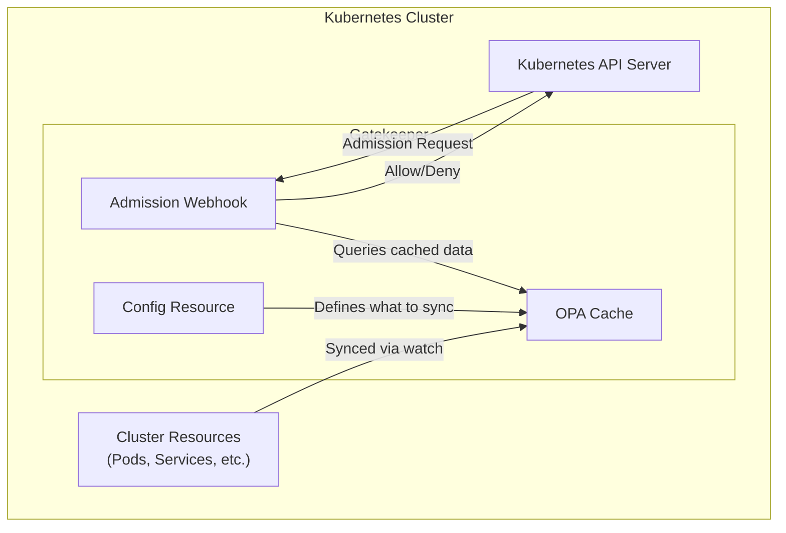
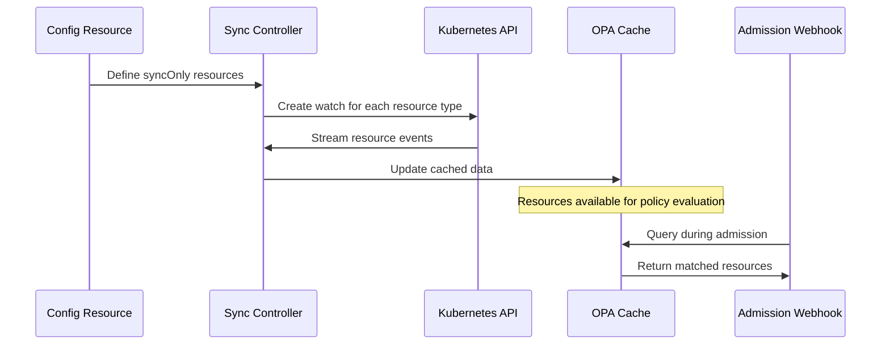
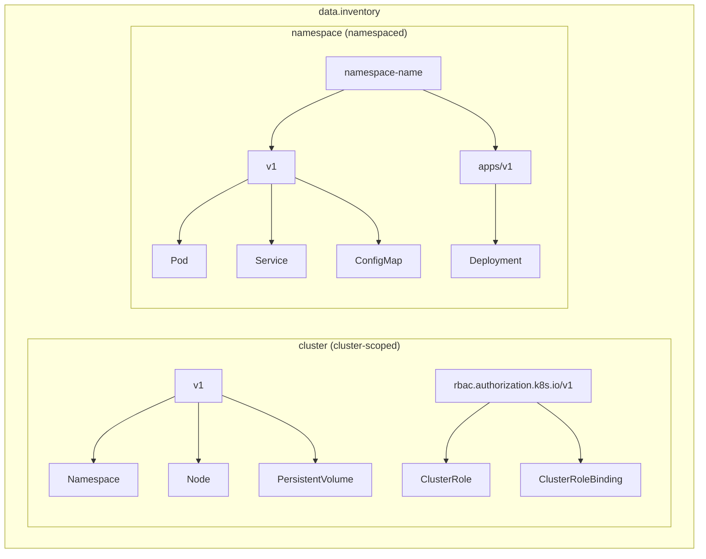

# How to Implement OPA Gatekeeper Config

Author: [nawazdhandala](https://github.com/nawazdhandala)

Tags: OPA, Gatekeeper, Kubernetes, Configuration

Description: Learn how to configure OPA Gatekeeper's Config resource to sync Kubernetes resources for policy evaluation, set up exempt namespaces, and fine-tune webhook behavior.

---

> OPA Gatekeeper enforces policies in Kubernetes, but without proper configuration, your policies cannot access the cluster state they need. The Config resource bridges this gap by syncing Kubernetes resources into Gatekeeper's cache for policy evaluation.

Policies need data. The Config resource makes that data available.

---

## Overview



---

## What is the Config Resource?

The Config resource is a cluster-scoped custom resource that controls how Gatekeeper interacts with your cluster. It defines:

- **Sync configuration** - which resources to cache for policy evaluation
- **Exempt namespaces** - namespaces where policies are not enforced
- **Match conditions** - fine-grained control over webhook behavior

Without a Config resource, Gatekeeper cannot evaluate policies that reference other resources in the cluster.

---

## Basic Config Structure

Create a Config resource to enable resource syncing:

```yaml
# config.yaml
# The Config resource must be named "config" in the "gatekeeper-system" namespace
apiVersion: config.gatekeeper.sh/v1alpha1
kind: Config
metadata:
  name: config
  namespace: gatekeeper-system
spec:
  # Define which resources to sync into the OPA cache
  sync:
    syncOnly:
      # Sync all Namespaces - required for most namespace-based policies
      - group: ""
        version: "v1"
        kind: "Namespace"
      # Sync all Pods - needed for policies that check pod specifications
      - group: ""
        version: "v1"
        kind: "Pod"
      # Sync all Services - useful for network policy validation
      - group: ""
        version: "v1"
        kind: "Service"
```

Apply the configuration:

```bash
kubectl apply -f config.yaml
```

---

## Sync Configuration Deep Dive

### How Sync Works



### Common Resources to Sync

Configure sync based on what your policies need to evaluate:

```yaml
# config-comprehensive.yaml
apiVersion: config.gatekeeper.sh/v1alpha1
kind: Config
metadata:
  name: config
  namespace: gatekeeper-system
spec:
  sync:
    syncOnly:
      # Core resources - commonly needed for most policy scenarios
      - group: ""
        version: "v1"
        kind: "Namespace"
      - group: ""
        version: "v1"
        kind: "Pod"
      - group: ""
        version: "v1"
        kind: "Service"
      - group: ""
        version: "v1"
        kind: "ConfigMap"
      - group: ""
        version: "v1"
        kind: "Secret"

      # Workload resources - for policies validating deployments
      - group: "apps"
        version: "v1"
        kind: "Deployment"
      - group: "apps"
        version: "v1"
        kind: "StatefulSet"
      - group: "apps"
        version: "v1"
        kind: "DaemonSet"

      # Networking resources - for ingress and network policies
      - group: "networking.k8s.io"
        version: "v1"
        kind: "Ingress"
      - group: "networking.k8s.io"
        version: "v1"
        kind: "NetworkPolicy"

      # RBAC resources - for security policies
      - group: "rbac.authorization.k8s.io"
        version: "v1"
        kind: "Role"
      - group: "rbac.authorization.k8s.io"
        version: "v1"
        kind: "RoleBinding"
      - group: "rbac.authorization.k8s.io"
        version: "v1"
        kind: "ClusterRole"
      - group: "rbac.authorization.k8s.io"
        version: "v1"
        kind: "ClusterRoleBinding"
```

---

## Exempt Namespaces

Some namespaces should be excluded from policy enforcement to prevent cluster-critical components from being blocked.

### Basic Exemption

```yaml
# config-with-exemptions.yaml
apiVersion: config.gatekeeper.sh/v1alpha1
kind: Config
metadata:
  name: config
  namespace: gatekeeper-system
spec:
  sync:
    syncOnly:
      - group: ""
        version: "v1"
        kind: "Namespace"
      - group: ""
        version: "v1"
        kind: "Pod"

  # Exempt critical system namespaces from policy enforcement
  match:
    - excludedNamespaces:
        # Kubernetes system namespace - contains critical components
        - "kube-system"
        # Kubernetes public namespace - used for cluster info
        - "kube-public"
        # Kubernetes node lease namespace - used for node heartbeats
        - "kube-node-lease"
        # Gatekeeper's own namespace - prevents self-blocking
        - "gatekeeper-system"
      processes:
        # Exclude from all admission processes
        - "*"
```

### Granular Process Exemption

You can exempt namespaces from specific processes rather than all enforcement:

```yaml
# config-granular-exemptions.yaml
apiVersion: config.gatekeeper.sh/v1alpha1
kind: Config
metadata:
  name: config
  namespace: gatekeeper-system
spec:
  sync:
    syncOnly:
      - group: ""
        version: "v1"
        kind: "Namespace"

  match:
    # Exempt system namespaces from mutation but not validation
    - excludedNamespaces:
        - "kube-system"
        - "gatekeeper-system"
      processes:
        # Only exempt from mutation webhook
        - "mutation-webhook"

    # Exempt monitoring namespace from audit but enforce admission
    - excludedNamespaces:
        - "monitoring"
      processes:
        # Only exempt from background audit process
        - "audit"

    # Completely exempt the sandbox namespace
    - excludedNamespaces:
        - "sandbox"
      processes:
        # Exempt from all processes
        - "*"
```

### Available Processes

The following processes can be exempted:

| Process | Description |
|---------|-------------|
| `*` | All processes |
| `webhook` | Admission webhook (both validating and mutating) |
| `mutation-webhook` | Mutating admission webhook only |
| `audit` | Background audit process |
| `sync` | Resource sync process |

---

## Webhook Match Conditions

Control which resources trigger the admission webhook with match conditions.

### Match by Namespace Labels

```yaml
# config-match-labels.yaml
apiVersion: config.gatekeeper.sh/v1alpha1
kind: Config
metadata:
  name: config
  namespace: gatekeeper-system
spec:
  sync:
    syncOnly:
      - group: ""
        version: "v1"
        kind: "Namespace"
      - group: ""
        version: "v1"
        kind: "Pod"

  match:
    # Only enforce policies in namespaces with specific labels
    - includedNamespaces:
        # Use label selectors instead of hardcoded names
        matchLabels:
          gatekeeper-enabled: "true"
      processes:
        - "webhook"

    # Exempt namespaces labeled as development environments
    - excludedNamespaces:
        matchLabels:
          environment: "development"
      processes:
        - "webhook"
        - "audit"
```

### Match by Namespace Expressions

```yaml
# config-match-expressions.yaml
apiVersion: config.gatekeeper.sh/v1alpha1
kind: Config
metadata:
  name: config
  namespace: gatekeeper-system
spec:
  sync:
    syncOnly:
      - group: ""
        version: "v1"
        kind: "Namespace"

  match:
    # Enforce in production namespaces only
    - includedNamespaces:
        matchExpressions:
          # Match namespaces where environment label is production or staging
          - key: "environment"
            operator: "In"
            values:
              - "production"
              - "staging"
      processes:
        - "webhook"

    # Exempt temporary namespaces
    - excludedNamespaces:
        matchExpressions:
          # Match namespaces with a ttl label (temporary namespaces)
          - key: "ttl"
            operator: "Exists"
      processes:
        - "*"
```

---

## Using Synced Data in Policies

Once resources are synced, you can reference them in your constraint templates.

### Example: Unique Ingress Host Policy

This policy ensures no two Ingress resources use the same hostname.

```yaml
# template-unique-ingress-host.yaml
apiVersion: templates.gatekeeper.sh/v1
kind: ConstraintTemplate
metadata:
  name: uniqueingresshost
spec:
  crd:
    spec:
      names:
        kind: UniqueIngressHost
  targets:
    - target: admission.k8s.gatekeeper.sh
      rego: |
        package uniqueingresshost

        # Violation occurs when a host is already in use by another Ingress
        violation[{"msg": msg}] {
          # Get the host from the incoming Ingress
          input_host := input.review.object.spec.rules[_].host

          # Query synced Ingress resources from the cache
          # data.inventory contains all synced resources
          other := data.inventory.namespace[ns][_].Ingress[name]

          # Skip if comparing to the same Ingress
          other.metadata.name != input.review.object.metadata.name

          # Check if the host already exists
          other_host := other.spec.rules[_].host
          input_host == other_host

          msg := sprintf(
            "Ingress host '%v' is already used by %v/%v",
            [input_host, ns, name]
          )
        }
```

The Config must include Ingress in syncOnly:

```yaml
# config-for-ingress-policy.yaml
apiVersion: config.gatekeeper.sh/v1alpha1
kind: Config
metadata:
  name: config
  namespace: gatekeeper-system
spec:
  sync:
    syncOnly:
      # Required for the UniqueIngressHost policy to query existing Ingresses
      - group: "networking.k8s.io"
        version: "v1"
        kind: "Ingress"
```

### Example: Required Labels from Namespace

This policy ensures pods have labels matching their namespace requirements.

```yaml
# template-required-namespace-labels.yaml
apiVersion: templates.gatekeeper.sh/v1
kind: ConstraintTemplate
metadata:
  name: requirednamespacelabels
spec:
  crd:
    spec:
      names:
        kind: RequiredNamespaceLabels
  targets:
    - target: admission.k8s.gatekeeper.sh
      rego: |
        package requirednamespacelabels

        violation[{"msg": msg}] {
          # Get the namespace of the incoming pod
          ns_name := input.review.object.metadata.namespace

          # Look up the namespace from synced data
          # The path follows: data.inventory.cluster["v1"]["Namespace"][name]
          ns := data.inventory.cluster["v1"]["Namespace"][ns_name]

          # Get required labels annotation from namespace
          required := ns.metadata.annotations["required-pod-labels"]

          # Split the comma-separated list of required labels
          required_labels := split(required, ",")
          label := required_labels[_]

          # Check if the pod has the required label
          not input.review.object.metadata.labels[label]

          msg := sprintf(
            "Pod must have label '%v' as required by namespace '%v'",
            [label, ns_name]
          )
        }
```

Config must sync Namespaces:

```yaml
# config-for-namespace-policy.yaml
apiVersion: config.gatekeeper.sh/v1alpha1
kind: Config
metadata:
  name: config
  namespace: gatekeeper-system
spec:
  sync:
    syncOnly:
      # Required to look up namespace annotations
      - group: ""
        version: "v1"
        kind: "Namespace"
```

---

## Data Inventory Structure

Understanding how synced data is organized helps you write correct policies.



### Accessing Data in Rego

```rego
# Cluster-scoped resources
# Pattern: data.inventory.cluster[group/version][kind][name]

# Get a specific namespace
ns := data.inventory.cluster["v1"]["Namespace"]["production"]

# Get a cluster role
role := data.inventory.cluster["rbac.authorization.k8s.io/v1"]["ClusterRole"]["admin"]

# Namespaced resources
# Pattern: data.inventory.namespace[namespace][group/version][kind][name]

# Get a specific pod
pod := data.inventory.namespace["default"]["v1"]["Pod"]["nginx"]

# Iterate over all pods in a namespace
pods := data.inventory.namespace["production"]["v1"]["Pod"]
pod := pods[pod_name]

# Get a deployment
deploy := data.inventory.namespace["app"]["apps/v1"]["Deployment"]["web"]
```

---

## Performance Considerations

### Sync Only What You Need

Each synced resource type adds memory usage and API server load:

```yaml
# config-minimal.yaml
# Only sync resources that your policies actually use
apiVersion: config.gatekeeper.sh/v1alpha1
kind: Config
metadata:
  name: config
  namespace: gatekeeper-system
spec:
  sync:
    syncOnly:
      # Good: Only sync what policies require
      - group: ""
        version: "v1"
        kind: "Namespace"
      # Avoid syncing large or frequently changing resources
      # unless your policies specifically need them
```

### Resource Usage Guidelines

| Resource Type | Memory Impact | Recommendation |
|---------------|---------------|----------------|
| Namespace | Low | Always sync if using namespace-based policies |
| Pod | High | Sync only if policies check pod specifications |
| Secret | High | Avoid syncing due to security and memory concerns |
| ConfigMap | Medium | Sync only if policies reference ConfigMap data |
| Event | Very High | Never sync - too many events in active clusters |

---

## Troubleshooting

### Verify Sync Status

Check if resources are being synced correctly:

```bash
# Check the Config resource status
kubectl get config config -n gatekeeper-system -o yaml

# Check sync status in Gatekeeper controller logs
kubectl logs -n gatekeeper-system deployment/gatekeeper-controller-manager | grep -i sync

# Verify data is available by checking audit results
kubectl get constraints -o yaml | grep -A 10 "totalViolations"
```

### Common Issues

**Policy cannot find synced data:**

```yaml
# Incorrect: Missing resource in syncOnly
spec:
  sync:
    syncOnly:
      - group: ""
        version: "v1"
        kind: "Namespace"
# Policy tries to access Pods but Pods are not synced
```

**Fix: Add the required resource to syncOnly:**

```yaml
# Correct: Include all resources your policies need
spec:
  sync:
    syncOnly:
      - group: ""
        version: "v1"
        kind: "Namespace"
      - group: ""
        version: "v1"
        kind: "Pod"
```

**Wrong group/version string:**

```yaml
# Incorrect: Using wrong group for Ingress
spec:
  sync:
    syncOnly:
      - group: "extensions"  # Deprecated in recent Kubernetes
        version: "v1beta1"
        kind: "Ingress"
```

**Fix: Use the correct API group:**

```yaml
# Correct: Use the current API group
spec:
  sync:
    syncOnly:
      - group: "networking.k8s.io"
        version: "v1"
        kind: "Ingress"
```

---

## Complete Production Example

A comprehensive Config for a production cluster:

```yaml
# config-production.yaml
apiVersion: config.gatekeeper.sh/v1alpha1
kind: Config
metadata:
  name: config
  namespace: gatekeeper-system
  labels:
    app.kubernetes.io/name: gatekeeper
    app.kubernetes.io/component: config
spec:
  sync:
    syncOnly:
      # Core resources for namespace and workload policies
      - group: ""
        version: "v1"
        kind: "Namespace"
      - group: ""
        version: "v1"
        kind: "Pod"
      - group: ""
        version: "v1"
        kind: "Service"

      # Workload resources for deployment policies
      - group: "apps"
        version: "v1"
        kind: "Deployment"
      - group: "apps"
        version: "v1"
        kind: "StatefulSet"

      # Networking for ingress uniqueness policies
      - group: "networking.k8s.io"
        version: "v1"
        kind: "Ingress"

      # RBAC for security policies
      - group: "rbac.authorization.k8s.io"
        version: "v1"
        kind: "ClusterRole"
      - group: "rbac.authorization.k8s.io"
        version: "v1"
        kind: "ClusterRoleBinding"

  match:
    # Exempt Kubernetes system namespaces
    - excludedNamespaces:
        - "kube-system"
        - "kube-public"
        - "kube-node-lease"
        - "gatekeeper-system"
      processes:
        - "*"

    # Exempt monitoring tools from mutation
    - excludedNamespaces:
        - "monitoring"
        - "logging"
      processes:
        - "mutation-webhook"

    # Only enforce in namespaces labeled for policy enforcement
    - includedNamespaces:
        matchExpressions:
          - key: "policy-enforcement"
            operator: "NotIn"
            values:
              - "disabled"
      processes:
        - "webhook"
```

---

## Best Practices

1. **Start minimal** - only sync resources your policies actually need
2. **Exempt system namespaces** - prevent blocking critical cluster components
3. **Use label selectors** - more flexible than hardcoding namespace names
4. **Monitor memory usage** - syncing too many resources impacts Gatekeeper performance
5. **Test in dry-run** - verify policies work with synced data before enforcement
6. **Document dependencies** - note which Config entries each policy requires

---

## Conclusion

The OPA Gatekeeper Config resource is essential for policies that need cluster state. Key takeaways:

- **Sync configuration** makes Kubernetes resources available to policies
- **Exempt namespaces** prevent blocking critical system components
- **Match conditions** provide fine-grained control over enforcement
- **Data inventory** follows a predictable structure for policy queries

Without proper Config setup, your policies are limited to validating only the incoming resource.

---

*Need to monitor your Kubernetes policy enforcement? [OneUptime](https://oneuptime.com) provides comprehensive monitoring for your cluster security and compliance.*
