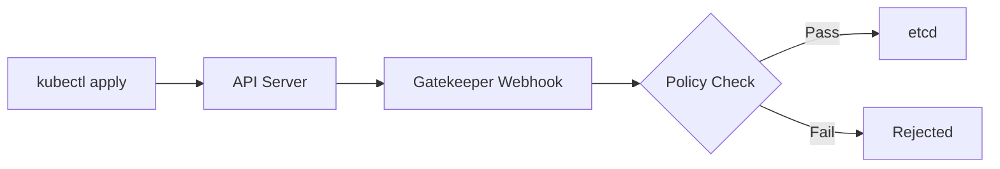
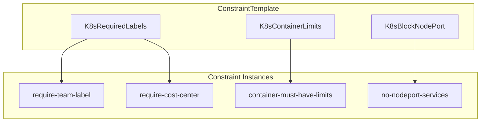
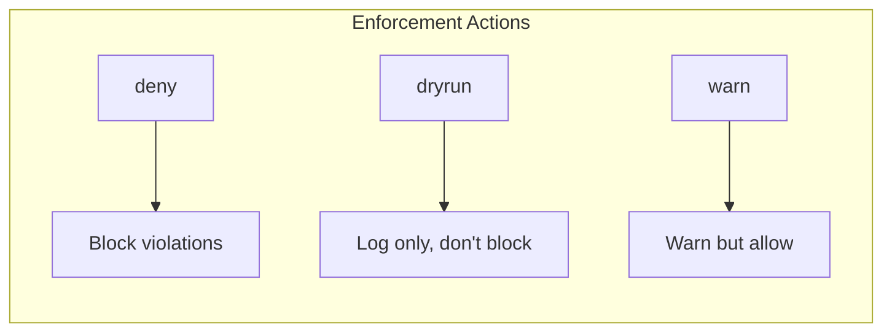
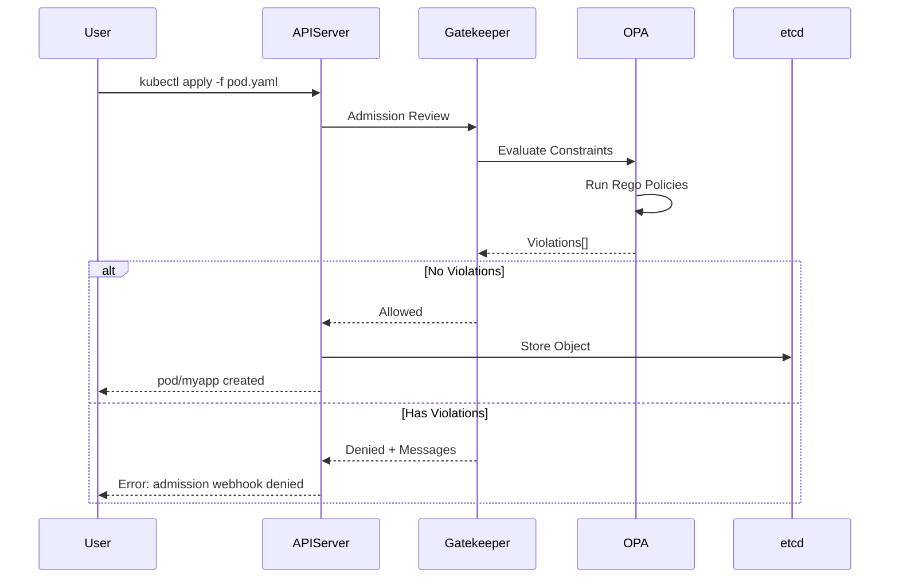

# How to Build OPA Gatekeeper Constraints

Author: [nawazdhandala](https://github.com/nawazdhandala)

Tags: OPA, Gatekeeper, Kubernetes, Policy

Description: Learn to write and deploy custom OPA Gatekeeper constraints to enforce policies across your Kubernetes clusters.

---

Kubernetes gives you a lot of power but very little guardrails by default. OPA Gatekeeper fills that gap by letting you define custom policies that block bad configurations before they hit your cluster.

## What Is OPA Gatekeeper?

Gatekeeper is a policy controller for Kubernetes built on Open Policy Agent (OPA). It acts as an admission controller, intercepting API requests before objects are created or modified.



## Installing Gatekeeper

Deploy Gatekeeper using Helm or the official manifests:

```bash
# Using Helm
helm repo add gatekeeper https://open-policy-agent.github.io/gatekeeper/charts
helm install gatekeeper/gatekeeper --name-template=gatekeeper --namespace gatekeeper-system --create-namespace

# Using manifests
kubectl apply -f https://raw.githubusercontent.com/open-policy-agent/gatekeeper/v3.14.0/deploy/gatekeeper.yaml
```

Verify the installation:

```bash
kubectl get pods -n gatekeeper-system
```

## Understanding ConstraintTemplates and Constraints

Gatekeeper uses two resources to define policies:

1. **ConstraintTemplate** - Defines the policy logic using Rego (OPA's policy language)
2. **Constraint** - Creates instances of a template with specific parameters



## Building Your First ConstraintTemplate

Let's create a template that requires specific labels on all pods.

```yaml
apiVersion: templates.gatekeeper.sh/v1
kind: ConstraintTemplate
metadata:
  name: k8srequiredlabels
spec:
  crd:
    spec:
      names:
        kind: K8sRequiredLabels
      validation:
        openAPIV3Schema:
          type: object
          properties:
            labels:
              type: array
              items:
                type: string
              description: List of required label keys
  targets:
    - target: admission.k8s.gatekeeper.sh
      rego: |
        package k8srequiredlabels

        violation[{"msg": msg}] {
          provided := {label | input.review.object.metadata.labels[label]}
          required := {label | label := input.parameters.labels[_]}
          missing := required - provided
          count(missing) > 0
          msg := sprintf("Missing required labels: %v", [missing])
        }
```

### Breaking Down the Template

**CRD Section**: Defines the schema for constraint parameters. Here we accept an array of label names.

**Targets Section**: Contains the Rego policy. The `violation` rule fires when:
- We extract provided labels from the object
- We extract required labels from parameters
- We find missing labels (required minus provided)
- If any labels are missing, we return a violation message

## Creating a Constraint

Now use the template to enforce specific labels:

```yaml
apiVersion: constraints.gatekeeper.sh/v1beta1
kind: K8sRequiredLabels
metadata:
  name: require-team-label
spec:
  match:
    kinds:
      - apiGroups: [""]
        kinds: ["Pod"]
      - apiGroups: ["apps"]
        kinds: ["Deployment", "StatefulSet", "DaemonSet"]
    namespaces:
      - production
      - staging
    excludedNamespaces:
      - kube-system
      - gatekeeper-system
  parameters:
    labels:
      - team
      - cost-center
```

### Match Configuration

The `match` section controls which resources the constraint applies to:

- **kinds**: Resource types to validate
- **namespaces**: Only apply to these namespaces
- **excludedNamespaces**: Never apply to these namespaces
- **labelSelector**: Match resources with specific labels
- **namespaceSelector**: Match namespaces with specific labels

## Common ConstraintTemplate Examples

### Require Container Resource Limits

```yaml
apiVersion: templates.gatekeeper.sh/v1
kind: ConstraintTemplate
metadata:
  name: k8scontainerlimits
spec:
  crd:
    spec:
      names:
        kind: K8sContainerLimits
      validation:
        openAPIV3Schema:
          type: object
          properties:
            cpu:
              type: string
            memory:
              type: string
  targets:
    - target: admission.k8s.gatekeeper.sh
      rego: |
        package k8scontainerlimits

        violation[{"msg": msg}] {
          container := input.review.object.spec.containers[_]
          not container.resources.limits.cpu
          msg := sprintf("Container %v has no CPU limit", [container.name])
        }

        violation[{"msg": msg}] {
          container := input.review.object.spec.containers[_]
          not container.resources.limits.memory
          msg := sprintf("Container %v has no memory limit", [container.name])
        }
```

Constraint to use it:

```yaml
apiVersion: constraints.gatekeeper.sh/v1beta1
kind: K8sContainerLimits
metadata:
  name: container-must-have-limits
spec:
  match:
    kinds:
      - apiGroups: [""]
        kinds: ["Pod"]
```

### Block NodePort Services

```yaml
apiVersion: templates.gatekeeper.sh/v1
kind: ConstraintTemplate
metadata:
  name: k8sblocknodeport
spec:
  crd:
    spec:
      names:
        kind: K8sBlockNodePort
  targets:
    - target: admission.k8s.gatekeeper.sh
      rego: |
        package k8sblocknodeport

        violation[{"msg": msg}] {
          input.review.object.spec.type == "NodePort"
          msg := "NodePort services are not allowed. Use LoadBalancer or ClusterIP instead."
        }
```

Constraint:

```yaml
apiVersion: constraints.gatekeeper.sh/v1beta1
kind: K8sBlockNodePort
metadata:
  name: block-nodeport-services
spec:
  match:
    kinds:
      - apiGroups: [""]
        kinds: ["Service"]
```

### Require Approved Container Registries

```yaml
apiVersion: templates.gatekeeper.sh/v1
kind: ConstraintTemplate
metadata:
  name: k8sallowedrepos
spec:
  crd:
    spec:
      names:
        kind: K8sAllowedRepos
      validation:
        openAPIV3Schema:
          type: object
          properties:
            repos:
              type: array
              items:
                type: string
  targets:
    - target: admission.k8s.gatekeeper.sh
      rego: |
        package k8sallowedrepos

        violation[{"msg": msg}] {
          container := input.review.object.spec.containers[_]
          not image_from_allowed_repo(container.image)
          msg := sprintf("Container %v uses image %v from unauthorized registry", [container.name, container.image])
        }

        violation[{"msg": msg}] {
          container := input.review.object.spec.initContainers[_]
          not image_from_allowed_repo(container.image)
          msg := sprintf("Init container %v uses image %v from unauthorized registry", [container.name, container.image])
        }

        image_from_allowed_repo(image) {
          repo := input.parameters.repos[_]
          startswith(image, repo)
        }
```

Constraint:

```yaml
apiVersion: constraints.gatekeeper.sh/v1beta1
kind: K8sAllowedRepos
metadata:
  name: allowed-container-registries
spec:
  match:
    kinds:
      - apiGroups: [""]
        kinds: ["Pod"]
  parameters:
    repos:
      - "gcr.io/my-company/"
      - "us-docker.pkg.dev/my-company/"
      - "registry.internal.company.com/"
```

### Block Privileged Containers

```yaml
apiVersion: templates.gatekeeper.sh/v1
kind: ConstraintTemplate
metadata:
  name: k8spsprivileged
spec:
  crd:
    spec:
      names:
        kind: K8sPSPPrivileged
  targets:
    - target: admission.k8s.gatekeeper.sh
      rego: |
        package k8spsprivileged

        violation[{"msg": msg}] {
          container := input.review.object.spec.containers[_]
          container.securityContext.privileged == true
          msg := sprintf("Privileged container not allowed: %v", [container.name])
        }

        violation[{"msg": msg}] {
          container := input.review.object.spec.initContainers[_]
          container.securityContext.privileged == true
          msg := sprintf("Privileged init container not allowed: %v", [container.name])
        }
```

## Enforcement Actions

Gatekeeper supports three enforcement modes:



### Setting Enforcement Action

```yaml
apiVersion: constraints.gatekeeper.sh/v1beta1
kind: K8sRequiredLabels
metadata:
  name: require-team-label
spec:
  enforcementAction: dryrun  # Options: deny, dryrun, warn
  match:
    kinds:
      - apiGroups: [""]
        kinds: ["Pod"]
  parameters:
    labels:
      - team
```

### When to Use Each Mode

**dryrun**: Start here when rolling out new policies. Violations are logged but resources are created normally.

**warn**: Users see warnings but can still create resources. Good for soft enforcement during transition periods.

**deny**: Production mode. Violations block resource creation.

## Audit Mode and Existing Resources

Gatekeeper periodically audits existing resources against constraints. This catches violations that existed before the policy was deployed.

### Check Audit Results

```bash
# Get constraint status
kubectl get k8srequiredlabels require-team-label -o yaml

# Look for violations in status
kubectl describe k8srequiredlabels require-team-label
```

Example output:

```yaml
status:
  auditTimestamp: "2026-01-30T10:15:00Z"
  totalViolations: 3
  violations:
    - enforcementAction: dryrun
      kind: Pod
      message: "Missing required labels: {team}"
      name: legacy-app-abc123
      namespace: production
```

### Configure Audit Interval

```yaml
# In gatekeeper deployment
spec:
  containers:
    - name: manager
      args:
        - --audit-interval=60  # Audit every 60 seconds
        - --audit-from-cache=true  # Use cache for faster audits
```

## Using Parameters Effectively

### Multiple Parameter Types

```yaml
apiVersion: templates.gatekeeper.sh/v1
kind: ConstraintTemplate
metadata:
  name: k8sresourcequota
spec:
  crd:
    spec:
      names:
        kind: K8sResourceQuota
      validation:
        openAPIV3Schema:
          type: object
          properties:
            maxCPU:
              type: string
              description: Maximum CPU limit allowed
            maxMemory:
              type: string
              description: Maximum memory limit allowed
            allowedClasses:
              type: array
              items:
                type: string
              description: Allowed storage classes
            enforceRequests:
              type: boolean
              description: Whether to enforce requests match limits
  targets:
    - target: admission.k8s.gatekeeper.sh
      rego: |
        package k8sresourcequota

        violation[{"msg": msg}] {
          container := input.review.object.spec.containers[_]
          cpu_limit := container.resources.limits.cpu
          max_cpu := input.parameters.maxCPU
          exceeds_limit(cpu_limit, max_cpu)
          msg := sprintf("Container %v CPU limit %v exceeds maximum %v", [container.name, cpu_limit, max_cpu])
        }

        exceeds_limit(limit, max) {
          # Parse and compare values
          limit_value := parse_cpu(limit)
          max_value := parse_cpu(max)
          limit_value > max_value
        }

        parse_cpu(cpu) = result {
          endswith(cpu, "m")
          result := to_number(trim_suffix(cpu, "m"))
        }

        parse_cpu(cpu) = result {
          not endswith(cpu, "m")
          result := to_number(cpu) * 1000
        }
```

### Parameter Validation

The OpenAPI schema validates parameters when you create constraints:

```yaml
validation:
  openAPIV3Schema:
    type: object
    required:
      - labels
    properties:
      labels:
        type: array
        minItems: 1
        items:
          type: string
          pattern: "^[a-z][a-z0-9-]*$"
```

## Testing Constraints Locally

### Using conftest

Test Rego policies before deploying:

```bash
# Install conftest
brew install conftest

# Create test file
cat > policy/k8s-required-labels.rego << 'EOF'
package k8srequiredlabels

violation[{"msg": msg}] {
  provided := {label | input.review.object.metadata.labels[label]}
  required := {label | label := input.parameters.labels[_]}
  missing := required - provided
  count(missing) > 0
  msg := sprintf("Missing required labels: %v", [missing])
}
EOF

# Create test input
cat > test-input.yaml << 'EOF'
review:
  object:
    metadata:
      labels:
        app: myapp
parameters:
  labels:
    - team
    - cost-center
EOF

# Run test
conftest test test-input.yaml -p policy/
```

### Using Gatekeeper's Built-in Testing

```yaml
apiVersion: v1
kind: ConfigMap
metadata:
  name: gatekeeper-test
  namespace: gatekeeper-system
data:
  test.yaml: |
    violations:
      - template: k8srequiredlabels
        constraint: require-team-label
        cases:
          - name: pod-without-labels
            object:
              apiVersion: v1
              kind: Pod
              metadata:
                name: test-pod
            expectViolation: true
```

## Debugging Policies

### Check Constraint Status

```bash
# List all constraints
kubectl get constraints

# Get detailed status
kubectl describe k8srequiredlabels require-team-label
```

### View Gatekeeper Logs

```bash
# Controller manager logs
kubectl logs -n gatekeeper-system -l control-plane=controller-manager

# Audit logs
kubectl logs -n gatekeeper-system -l control-plane=audit-controller
```

### Common Issues

**Policy not triggering:**
- Check `match` configuration matches your resources
- Verify namespace is not excluded
- Ensure template is correctly deployed

**Template not compiling:**
- Check Rego syntax
- Verify package name matches template name (lowercase)
- Look for typos in `input.review.object` paths

**Audit not finding violations:**
- Check `auditFromCache` settings
- Verify audit interval
- Ensure resources exist in matched namespaces

## Best Practices

### 1. Start with Dryrun

Always deploy new constraints in dryrun mode first:

```yaml
spec:
  enforcementAction: dryrun
```

Monitor for a week, review violations, then switch to deny.

### 2. Use Meaningful Violation Messages

```rego
violation[{"msg": msg}] {
  # Bad
  msg := "violation"

  # Good
  msg := sprintf("Pod %v in namespace %v is missing required label 'team'. Add metadata.labels.team to your pod spec.", [input.review.object.metadata.name, input.review.object.metadata.namespace])
}
```

### 3. Exclude System Namespaces

```yaml
spec:
  match:
    excludedNamespaces:
      - kube-system
      - kube-public
      - gatekeeper-system
      - cert-manager
```

### 4. Version Your Templates

```yaml
metadata:
  name: k8srequiredlabels
  annotations:
    policy.gatekeeper.sh/version: "1.2.0"
    policy.gatekeeper.sh/description: "Requires specified labels on resources"
```

### 5. Organize Policies by Category

```
policies/
  security/
    block-privileged.yaml
    allowed-registries.yaml
  compliance/
    required-labels.yaml
    resource-limits.yaml
  operations/
    block-nodeport.yaml
    replica-minimum.yaml
```

## Gatekeeper Admission Flow

Here's how Gatekeeper processes requests:



## Integration with CI/CD

### Pre-commit Validation

```yaml
# .github/workflows/policy-check.yaml
name: Policy Check
on: [pull_request]

jobs:
  gatekeeper:
    runs-on: ubuntu-latest
    steps:
      - uses: actions/checkout@v4

      - name: Install gator
        run: |
          curl -L https://github.com/open-policy-agent/gatekeeper/releases/download/v3.14.0/gator-v3.14.0-linux-amd64.tar.gz | tar xz
          sudo mv gator /usr/local/bin/

      - name: Test policies
        run: |
          gator test --filename=policies/

      - name: Verify manifests
        run: |
          gator verify --filename=manifests/ --filename=policies/
```

---

OPA Gatekeeper gives you declarative policy enforcement that scales across clusters. Start with a few essential policies in dryrun mode, iterate based on audit findings, and gradually expand coverage. The goal is to catch misconfigurations before they become incidents.
