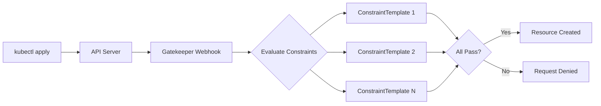
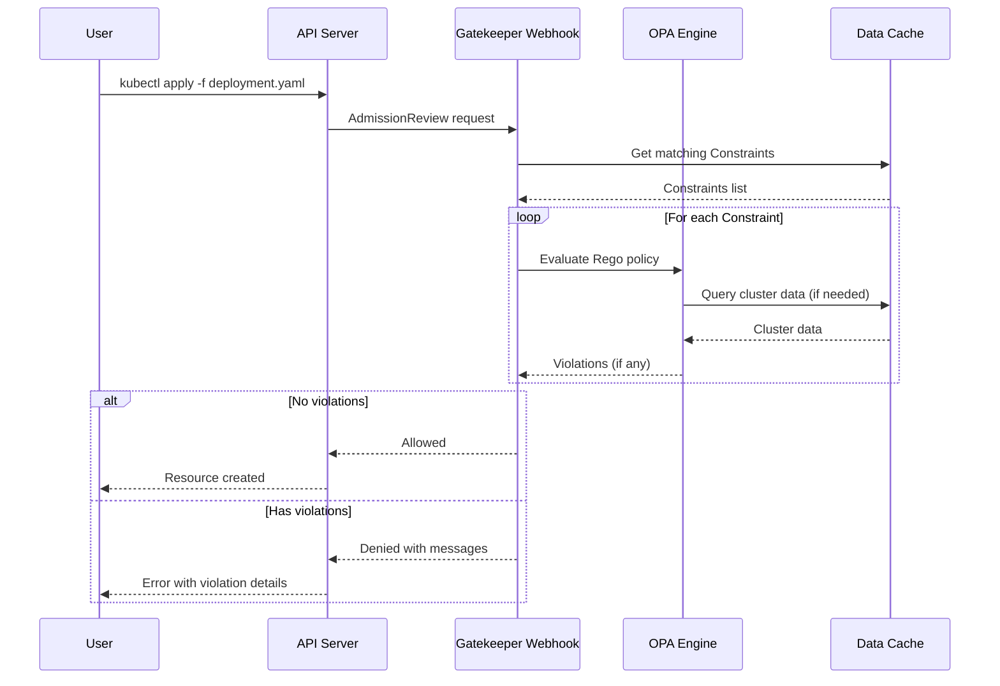

# How to Implement OPA Gatekeeper ConstraintTemplates

Author: [nawazdhandala](https://github.com/nawazdhandala)

Tags: OPA, Gatekeeper, Kubernetes, PolicyAsCode

Description: Learn how to define reusable Kubernetes admission policies using OPA Gatekeeper ConstraintTemplates with Rego.

---

OPA Gatekeeper brings policy-as-code to Kubernetes through an admission controller that validates resources against policies you define. ConstraintTemplates are the heart of Gatekeeper. They let you write reusable policy logic in Rego that can be parameterized and applied across your cluster.

## How Gatekeeper Policy Evaluation Works

When you create or update a Kubernetes resource, the API server sends an admission review to Gatekeeper. Gatekeeper evaluates the resource against all matching Constraints, which are instances of your ConstraintTemplates.



## ConstraintTemplate Structure

A ConstraintTemplate has two main parts: the CRD spec that defines the Constraint API and the Rego code that implements the validation logic.

```yaml
apiVersion: templates.gatekeeper.sh/v1
kind: ConstraintTemplate
metadata:
  name: k8srequiredlabels
  # Annotations for documentation
  annotations:
    description: "Requires resources to have specified labels"
spec:
  crd:
    spec:
      names:
        # The kind for Constraints created from this template
        kind: K8sRequiredLabels
      validation:
        # OpenAPI v3 schema for parameters
        openAPIV3Schema:
          type: object
          properties:
            labels:
              type: array
              description: "List of required label keys"
              items:
                type: string
  targets:
    - target: admission.k8s.gatekeeper.sh
      rego: |
        package k8srequiredlabels

        # Deny if any required label is missing
        violation[{"msg": msg}] {
          # Get the resource being validated
          provided := {label | input.review.object.metadata.labels[label]}

          # Get required labels from constraint parameters
          required := {label | label := input.parameters.labels[_]}

          # Find missing labels
          missing := required - provided

          # Generate violation if any are missing
          count(missing) > 0
          msg := sprintf("Missing required labels: %v", [missing])
        }
```

## Understanding Rego Basics

Rego is OPA's policy language. Here are the key concepts for writing ConstraintTemplates.

### The Input Object

Gatekeeper provides the admission review in `input.review` and your Constraint parameters in `input.parameters`.

```rego
package example

# Access the Kubernetes resource being validated
resource := input.review.object

# Access the resource metadata
name := input.review.object.metadata.name
namespace := input.review.object.metadata.namespace
labels := input.review.object.metadata.labels

# Access the operation type (CREATE, UPDATE, DELETE)
operation := input.review.operation

# Access constraint parameters
my_param := input.parameters.someParam
```

### Writing Violation Rules

The `violation` rule must return a set of objects with a `msg` field. Each object represents one policy violation.

```rego
package example

# Simple violation rule
violation[{"msg": msg}] {
  # Conditions that must all be true for violation
  input.review.object.kind == "Pod"
  not input.review.object.spec.securityContext.runAsNonRoot
  msg := "Pods must run as non-root"
}

# Violation with detailed message
violation[{"msg": msg, "details": details}] {
  container := input.review.object.spec.containers[_]
  not container.resources.limits.memory
  msg := sprintf("Container %v has no memory limit", [container.name])
  details := {"container": container.name}
}
```

### Iteration and Comprehension

Rego uses implicit iteration. When you access an array element with `[_]`, it iterates over all elements.

```rego
package example

# Check all containers in a pod
violation[{"msg": msg}] {
  # Iterate over all containers
  container := input.review.object.spec.containers[_]

  # Check if image uses latest tag
  endswith(container.image, ":latest")

  msg := sprintf("Container %v uses :latest tag", [container.name])
}

# Use comprehension to collect values
all_images := [image |
  container := input.review.object.spec.containers[_]
  image := container.image
]
```

## Parameter Schema Definition

The OpenAPI v3 schema in your ConstraintTemplate defines what parameters Constraints can accept.

### Basic Schema Example

```yaml
spec:
  crd:
    spec:
      names:
        kind: K8sContainerLimits
      validation:
        openAPIV3Schema:
          type: object
          required:
            - cpu
            - memory
          properties:
            cpu:
              type: string
              description: "Maximum CPU limit (e.g., '500m', '2')"
              pattern: "^[0-9]+(m|[.][0-9]+)?$"
            memory:
              type: string
              description: "Maximum memory limit (e.g., '512Mi', '2Gi')"
              pattern: "^[0-9]+(Ki|Mi|Gi|Ti)?$"
            exemptImages:
              type: array
              description: "Images exempt from this policy"
              items:
                type: string
```

### Complex Schema with Nested Objects

```yaml
spec:
  crd:
    spec:
      names:
        kind: K8sAllowedRepos
      validation:
        openAPIV3Schema:
          type: object
          properties:
            repos:
              type: array
              items:
                type: object
                required:
                  - prefix
                properties:
                  prefix:
                    type: string
                    description: "Allowed image registry prefix"
                  allowLatest:
                    type: boolean
                    default: false
                    description: "Whether to allow :latest tag"
```

## Practical ConstraintTemplate Examples

### Require Resource Limits

Ensures all containers have CPU and memory limits defined.

```yaml
apiVersion: templates.gatekeeper.sh/v1
kind: ConstraintTemplate
metadata:
  name: k8scontainerlimits
  annotations:
    description: "Requires containers to have resource limits"
spec:
  crd:
    spec:
      names:
        kind: K8sContainerLimits
      validation:
        openAPIV3Schema:
          type: object
          properties:
            exemptContainers:
              type: array
              items:
                type: string
  targets:
    - target: admission.k8s.gatekeeper.sh
      rego: |
        package k8scontainerlimits

        # Check containers in pod spec
        violation[{"msg": msg}] {
          container := input.review.object.spec.containers[_]
          not is_exempt(container.name)
          not container.resources.limits.cpu
          msg := sprintf("Container %v has no CPU limit", [container.name])
        }

        violation[{"msg": msg}] {
          container := input.review.object.spec.containers[_]
          not is_exempt(container.name)
          not container.resources.limits.memory
          msg := sprintf("Container %v has no memory limit", [container.name])
        }

        # Check init containers too
        violation[{"msg": msg}] {
          container := input.review.object.spec.initContainers[_]
          not is_exempt(container.name)
          not container.resources.limits.cpu
          msg := sprintf("Init container %v has no CPU limit", [container.name])
        }

        violation[{"msg": msg}] {
          container := input.review.object.spec.initContainers[_]
          not is_exempt(container.name)
          not container.resources.limits.memory
          msg := sprintf("Init container %v has no memory limit", [container.name])
        }

        # Helper function to check exemptions
        is_exempt(name) {
          exempt := input.parameters.exemptContainers[_]
          name == exempt
        }
```

### Allowed Image Registries

Restricts container images to approved registries only.

```yaml
apiVersion: templates.gatekeeper.sh/v1
kind: ConstraintTemplate
metadata:
  name: k8sallowedrepos
  annotations:
    description: "Restricts images to allowed registries"
spec:
  crd:
    spec:
      names:
        kind: K8sAllowedRepos
      validation:
        openAPIV3Schema:
          type: object
          required:
            - repos
          properties:
            repos:
              type: array
              items:
                type: string
  targets:
    - target: admission.k8s.gatekeeper.sh
      rego: |
        package k8sallowedrepos

        violation[{"msg": msg}] {
          container := input.review.object.spec.containers[_]
          image := container.image
          not image_allowed(image)
          msg := sprintf(
            "Container %v uses image %v from disallowed registry. Allowed: %v",
            [container.name, image, input.parameters.repos]
          )
        }

        violation[{"msg": msg}] {
          container := input.review.object.spec.initContainers[_]
          image := container.image
          not image_allowed(image)
          msg := sprintf(
            "Init container %v uses image %v from disallowed registry",
            [container.name, image]
          )
        }

        # Check if image starts with any allowed prefix
        image_allowed(image) {
          repo := input.parameters.repos[_]
          startswith(image, repo)
        }
```

### Block Privileged Containers

Prevents containers from running in privileged mode.

```yaml
apiVersion: templates.gatekeeper.sh/v1
kind: ConstraintTemplate
metadata:
  name: k8spsprivileged
  annotations:
    description: "Blocks privileged containers"
spec:
  crd:
    spec:
      names:
        kind: K8sPSPPrivileged
      validation:
        openAPIV3Schema:
          type: object
          properties:
            allowedImages:
              type: array
              description: "Images allowed to run privileged"
              items:
                type: string
  targets:
    - target: admission.k8s.gatekeeper.sh
      rego: |
        package k8spsprivileged

        violation[{"msg": msg}] {
          container := input.review.object.spec.containers[_]
          container.securityContext.privileged == true
          not is_allowed_privileged(container.image)
          msg := sprintf("Privileged container not allowed: %v", [container.name])
        }

        violation[{"msg": msg}] {
          container := input.review.object.spec.initContainers[_]
          container.securityContext.privileged == true
          not is_allowed_privileged(container.image)
          msg := sprintf("Privileged init container not allowed: %v", [container.name])
        }

        # Check if image is in allowlist for privileged execution
        is_allowed_privileged(image) {
          allowed := input.parameters.allowedImages[_]
          image == allowed
        }

        # Also allow if no allowedImages specified and empty
        is_allowed_privileged(_) {
          not input.parameters.allowedImages
        }
```

### Require Pod Disruption Budget

Ensures deployments have associated PodDisruptionBudgets.

```yaml
apiVersion: templates.gatekeeper.sh/v1
kind: ConstraintTemplate
metadata:
  name: k8srequirepdb
  annotations:
    description: "Requires PDB for deployments with multiple replicas"
spec:
  crd:
    spec:
      names:
        kind: K8sRequirePDB
      validation:
        openAPIV3Schema:
          type: object
          properties:
            minReplicas:
              type: integer
              default: 2
              description: "Minimum replicas that require a PDB"
  targets:
    - target: admission.k8s.gatekeeper.sh
      # Use data.inventory to access cluster resources
      libs:
        - |
          package lib.helpers

          # Get PDBs that match a selector
          matching_pdbs(namespace, selector) = pdbs {
            pdbs := [pdb |
              pdb := data.inventory.namespace[namespace]["policy/v1"]["PodDisruptionBudget"][_]
              selector_matches(pdb.spec.selector.matchLabels, selector)
            ]
          }

          # Check if PDB selector matches deployment selector
          selector_matches(pdb_selector, deploy_selector) {
            # All PDB labels must be in deployment
            keys := {k | pdb_selector[k]}
            all_match := {k |
              k := keys[_]
              pdb_selector[k] == deploy_selector[k]
            }
            count(all_match) == count(keys)
          }
      rego: |
        package k8srequirepdb

        import data.lib.helpers

        violation[{"msg": msg}] {
          input.review.object.kind == "Deployment"
          replicas := object.get(input.review.object.spec, "replicas", 1)
          min_replicas := object.get(input.parameters, "minReplicas", 2)
          replicas >= min_replicas

          namespace := input.review.object.metadata.namespace
          selector := input.review.object.spec.selector.matchLabels

          pdbs := helpers.matching_pdbs(namespace, selector)
          count(pdbs) == 0

          msg := sprintf(
            "Deployment %v has %v replicas but no PodDisruptionBudget",
            [input.review.object.metadata.name, replicas]
          )
        }
```

## Creating Constraints from Templates

Once you have a ConstraintTemplate, create Constraints to apply it.

```yaml
# Constraint using the K8sRequiredLabels template
apiVersion: constraints.gatekeeper.sh/v1beta1
kind: K8sRequiredLabels
metadata:
  name: require-team-label
spec:
  # Which resources to validate
  match:
    kinds:
      - apiGroups: [""]
        kinds: ["Namespace"]
      - apiGroups: ["apps"]
        kinds: ["Deployment", "StatefulSet"]
    # Exclude system namespaces
    excludedNamespaces:
      - kube-system
      - gatekeeper-system
  # Parameters defined in the template
  parameters:
    labels:
      - team
      - environment
---
# Constraint for allowed registries
apiVersion: constraints.gatekeeper.sh/v1beta1
kind: K8sAllowedRepos
metadata:
  name: allowed-registries
spec:
  match:
    kinds:
      - apiGroups: [""]
        kinds: ["Pod"]
      - apiGroups: ["apps"]
        kinds: ["Deployment", "DaemonSet", "StatefulSet", "ReplicaSet"]
  parameters:
    repos:
      - gcr.io/my-company/
      - docker.io/library/
      - quay.io/my-org/
---
# Constraint for container limits
apiVersion: constraints.gatekeeper.sh/v1beta1
kind: K8sContainerLimits
metadata:
  name: require-limits
spec:
  match:
    kinds:
      - apiGroups: [""]
        kinds: ["Pod"]
    namespaces:
      - production
      - staging
  parameters:
    exemptContainers:
      - istio-proxy
      - linkerd-proxy
```

## Testing Templates with Gator

Gator is the CLI tool for testing ConstraintTemplates before deployment.

### Install Gator

```bash
# macOS
brew install gator

# Linux
curl -L https://github.com/open-policy-agent/gatekeeper/releases/download/v3.14.0/gator-v3.14.0-linux-amd64.tar.gz | tar xz
sudo mv gator /usr/local/bin/

# Verify installation
gator version
```

### Create Test Suite

```yaml
# tests/require-labels-test.yaml
apiVersion: gator.gatekeeper.sh/v1alpha1
kind: Suite
metadata:
  name: require-labels-test
tests:
  - name: "missing-labels-rejected"
    template: ../templates/k8srequiredlabels.yaml
    constraint: ../constraints/require-team-label.yaml
    cases:
      - name: "deployment-missing-team-label"
        object: deployment-no-labels.yaml
        assertions:
          - violations: yes
            message: "Missing required labels"

      - name: "deployment-with-all-labels"
        object: deployment-with-labels.yaml
        assertions:
          - violations: no
```

### Test Objects

```yaml
# tests/deployment-no-labels.yaml
apiVersion: apps/v1
kind: Deployment
metadata:
  name: test-deployment
  namespace: default
spec:
  replicas: 1
  selector:
    matchLabels:
      app: test
  template:
    metadata:
      labels:
        app: test
    spec:
      containers:
        - name: nginx
          image: nginx:latest
---
# tests/deployment-with-labels.yaml
apiVersion: apps/v1
kind: Deployment
metadata:
  name: test-deployment
  namespace: default
  labels:
    team: platform
    environment: production
spec:
  replicas: 1
  selector:
    matchLabels:
      app: test
  template:
    metadata:
      labels:
        app: test
    spec:
      containers:
        - name: nginx
          image: nginx:latest
```

### Run Tests

```bash
# Run all tests in directory
gator verify tests/

# Run specific test suite
gator verify tests/require-labels-test.yaml

# Verbose output
gator verify tests/ --verbose

# Test a single template and constraint against an object
gator test \
  --template templates/k8srequiredlabels.yaml \
  --constraint constraints/require-team-label.yaml \
  deployment.yaml
```

### Gator in CI Pipeline

```yaml
# .github/workflows/gatekeeper-tests.yaml
name: Gatekeeper Policy Tests

on:
  pull_request:
    paths:
      - 'policies/**'

jobs:
  test:
    runs-on: ubuntu-latest
    steps:
      - uses: actions/checkout@v4

      - name: Install gator
        run: |
          curl -L https://github.com/open-policy-agent/gatekeeper/releases/download/v3.14.0/gator-v3.14.0-linux-amd64.tar.gz | tar xz
          sudo mv gator /usr/local/bin/

      - name: Run policy tests
        run: gator verify policies/tests/

      - name: Validate template syntax
        run: |
          for template in policies/templates/*.yaml; do
            echo "Validating $template"
            gator verify --template "$template"
          done
```

## Policy Evaluation Flow

Understanding how Gatekeeper evaluates policies helps debug issues.



## Debugging ConstraintTemplates

### Check Template Status

```bash
# View all templates
kubectl get constrainttemplates

# Check template status
kubectl describe constrainttemplate k8srequiredlabels

# Look for Rego compilation errors
kubectl get constrainttemplate k8srequiredlabels -o jsonpath='{.status}'
```

### Check Constraint Status

```bash
# List all constraints of a type
kubectl get k8srequiredlabels

# View violations for a constraint
kubectl describe k8srequiredlabels require-team-label

# Get violation count
kubectl get k8srequiredlabels require-team-label -o jsonpath='{.status.totalViolations}'
```

### Enable Audit Mode

Test policies without blocking resources by using dry-run enforcement.

```yaml
apiVersion: constraints.gatekeeper.sh/v1beta1
kind: K8sRequiredLabels
metadata:
  name: require-team-label-dryrun
spec:
  # Audit only, do not block
  enforcementAction: dryrun
  match:
    kinds:
      - apiGroups: ["apps"]
        kinds: ["Deployment"]
  parameters:
    labels:
      - team
```

### View Audit Results

```bash
# Check audit violations
kubectl get k8srequiredlabels require-team-label-dryrun -o yaml | grep -A 50 violations
```

## Best Practices

### Organize Templates and Constraints

```
policies/
  templates/
    k8srequiredlabels.yaml
    k8scontainerlimits.yaml
    k8sallowedrepos.yaml
  constraints/
    production/
      require-labels.yaml
      require-limits.yaml
    staging/
      require-labels.yaml
  tests/
    require-labels-test.yaml
    container-limits-test.yaml
  kustomization.yaml
```

### Use Library Functions

Share common Rego code across templates.

```yaml
apiVersion: templates.gatekeeper.sh/v1
kind: ConstraintTemplate
metadata:
  name: k8sexample
spec:
  crd:
    spec:
      names:
        kind: K8sExample
  targets:
    - target: admission.k8s.gatekeeper.sh
      libs:
        - |
          package lib.core

          # Get default namespace if not specified
          default_namespace(obj) = ns {
            ns := object.get(obj.metadata, "namespace", "default")
          }

          # Check if resource is in system namespace
          is_system_namespace(obj) {
            ns := default_namespace(obj)
            system_namespaces := {"kube-system", "kube-public", "gatekeeper-system"}
            system_namespaces[ns]
          }

          # Get all containers including init containers
          all_containers(obj) = containers {
            containers := array.concat(
              object.get(obj.spec, "containers", []),
              object.get(obj.spec, "initContainers", [])
            )
          }
      rego: |
        package k8sexample

        import data.lib.core

        violation[{"msg": msg}] {
          not core.is_system_namespace(input.review.object)
          # ... rest of policy
        }
```

### Write Descriptive Violation Messages

```rego
package example

# Bad: vague message
violation[{"msg": "Invalid configuration"}] {
  # ...
}

# Good: specific and actionable
violation[{"msg": msg}] {
  container := input.review.object.spec.containers[_]
  not container.resources.limits.memory
  msg := sprintf(
    "Container '%v' in %v '%v/%v' must have memory limits. Add spec.containers[].resources.limits.memory",
    [
      container.name,
      input.review.object.kind,
      input.review.object.metadata.namespace,
      input.review.object.metadata.name
    ]
  )
}
```

### Start with Dry Run

Always test new policies in dry-run mode first.

```bash
# Deploy template
kubectl apply -f templates/

# Deploy constraint in dryrun mode
kubectl apply -f - <<EOF
apiVersion: constraints.gatekeeper.sh/v1beta1
kind: K8sRequiredLabels
metadata:
  name: require-labels-test
spec:
  enforcementAction: dryrun
  match:
    kinds:
      - apiGroups: ["apps"]
        kinds: ["Deployment"]
  parameters:
    labels:
      - team
EOF

# Wait for audit
sleep 60

# Check violations
kubectl get k8srequiredlabels require-labels-test -o jsonpath='{.status.violations}' | jq .

# If acceptable, switch to deny
kubectl patch k8srequiredlabels require-labels-test --type=merge -p '{"spec":{"enforcementAction":"deny"}}'
```

---

ConstraintTemplates give you a powerful way to codify and enforce organizational policies across Kubernetes clusters. Start with simple policies like required labels or allowed registries, test thoroughly with gator, and gradually expand coverage. The key is building a library of reusable templates that encode your security and operational requirements.
