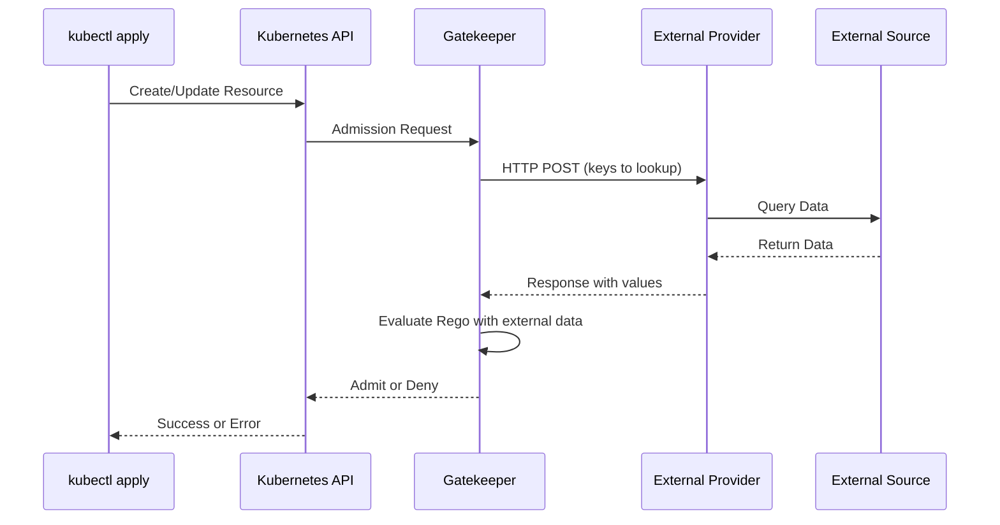
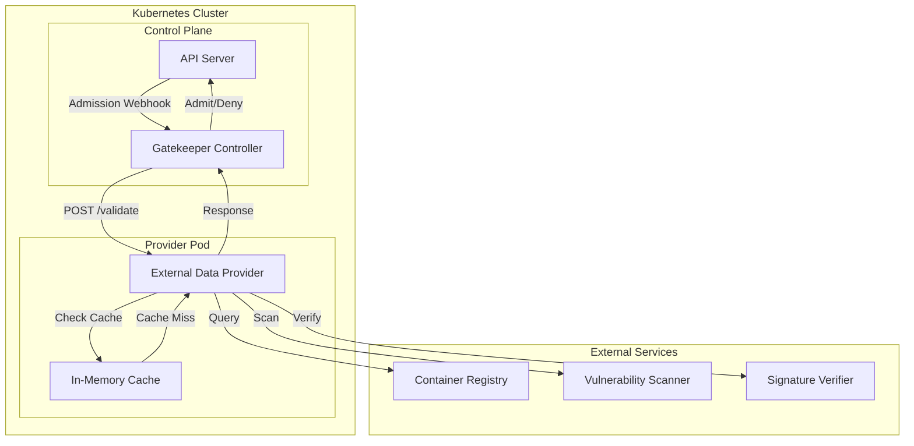

# How to Build OPA Gatekeeper External Data

Author: [nawazdhandala](https://github.com/nawazdhandala)

Tags: OPA, Gatekeeper, Kubernetes, Integration

Description: Learn how to extend OPA Gatekeeper with external data providers to make dynamic policy decisions using real-time data from registries, APIs, and databases.

---

OPA Gatekeeper is powerful for enforcing policies in Kubernetes, but sometimes your policies need data that does not exist inside the cluster. External Data providers let Gatekeeper fetch information from external sources like image registries, vulnerability databases, or custom APIs during policy evaluation.

## Understanding External Data Architecture

External Data allows Gatekeeper to query external HTTP endpoints during constraint evaluation. The data returned from these providers can be used in your Rego policies.



## Prerequisites

External Data requires Gatekeeper v3.7.0 or later. Check your version:

```bash
# Check Gatekeeper version
kubectl get deployment gatekeeper-controller-manager -n gatekeeper-system -o jsonpath='{.spec.template.spec.containers[0].image}'
```

Enable the external data feature:

```bash
# If using Helm, enable external data
helm upgrade gatekeeper gatekeeper/gatekeeper \
  --namespace gatekeeper-system \
  --set externaldataProviderResponseCacheTTL=1m \
  --set enableExternalData=true
```

## Creating an External Data Provider

A Provider resource tells Gatekeeper where to fetch external data.

### Provider Configuration

```yaml
# provider.yaml
apiVersion: externaldata.gatekeeper.sh/v1beta1
kind: Provider
metadata:
  name: image-registry-provider
spec:
  # URL of the external data service
  url: https://external-data-service.policy-system.svc:8443/validate

  # Timeout for HTTP requests (default: 3s)
  timeout: 5s

  # TLS configuration for secure communication
  caBundle: <base64-encoded-ca-cert>

  # Whether to fail open or closed when provider is unavailable
  # failurePolicy: Fail (default) or Ignore
  failurePolicy: Fail

  # Insecure mode for testing (not recommended for production)
  # insecureTLSSkipVerify: false
```

### Provider with mTLS Authentication

```yaml
# provider-mtls.yaml
apiVersion: externaldata.gatekeeper.sh/v1beta1
kind: Provider
metadata:
  name: secure-provider
spec:
  url: https://secure-service.policy-system.svc:8443/validate
  timeout: 10s

  # CA bundle for verifying the provider's certificate
  caBundle: |
    LS0tLS1CRUdJTiBDRVJUSUZJQ0FURS0tLS0t...

  # Client certificate for mTLS (optional)
  # Stored in a Secret referenced by Gatekeeper deployment
  failurePolicy: Fail
```

## Building an External Data Service

The external data service is an HTTP server that responds to Gatekeeper's queries.

### Request and Response Format

Gatekeeper sends POST requests with this structure:

```json
{
  "apiVersion": "externaldata.gatekeeper.sh/v1beta1",
  "kind": "ProviderRequest",
  "request": {
    "keys": ["nginx:1.21", "redis:7.0", "custom-app:v2.3.1"]
  }
}
```

Your service must respond with:

```json
{
  "apiVersion": "externaldata.gatekeeper.sh/v1beta1",
  "kind": "ProviderResponse",
  "response": {
    "items": [
      {
        "key": "nginx:1.21",
        "value": {
          "allowed": true,
          "vulnerabilities": 0,
          "signed": true
        }
      },
      {
        "key": "redis:7.0",
        "value": {
          "allowed": true,
          "vulnerabilities": 2,
          "signed": true
        }
      },
      {
        "key": "custom-app:v2.3.1",
        "value": {
          "allowed": false,
          "vulnerabilities": 15,
          "signed": false
        }
      }
    ],
    "systemError": ""
  }
}
```

### Go Implementation

```go
// main.go - External data provider for image validation
package main

import (
    "context"
    "encoding/json"
    "fmt"
    "log"
    "net/http"
    "time"
)

// ProviderRequest matches Gatekeeper's request format
type ProviderRequest struct {
    APIVersion string `json:"apiVersion"`
    Kind       string `json:"kind"`
    Request    struct {
        Keys []string `json:"keys"`
    } `json:"request"`
}

// ProviderResponse matches Gatekeeper's expected response
type ProviderResponse struct {
    APIVersion string `json:"apiVersion"`
    Kind       string `json:"kind"`
    Response   struct {
        Items       []Item `json:"items"`
        SystemError string `json:"systemError,omitempty"`
    } `json:"response"`
}

// Item represents a single key-value response
type Item struct {
    Key   string      `json:"key"`
    Value interface{} `json:"value"`
    Error string      `json:"error,omitempty"`
}

// ImageValidationResult contains validation details
type ImageValidationResult struct {
    Allowed         bool   `json:"allowed"`
    Vulnerabilities int    `json:"vulnerabilities"`
    Signed          bool   `json:"signed"`
    Registry        string `json:"registry"`
}

// ImageValidator checks images against external sources
type ImageValidator struct {
    allowedRegistries []string
    httpClient        *http.Client
}

// NewImageValidator creates a validator with allowed registries
func NewImageValidator(registries []string) *ImageValidator {
    return &ImageValidator{
        allowedRegistries: registries,
        httpClient: &http.Client{
            Timeout: 10 * time.Second,
        },
    }
}

// ValidateImage checks if an image meets policy requirements
func (v *ImageValidator) ValidateImage(ctx context.Context, image string) ImageValidationResult {
    // Parse the image reference to extract registry
    registry := extractRegistry(image)

    // Check if registry is in allowed list
    allowed := false
    for _, r := range v.allowedRegistries {
        if r == registry {
            allowed = true
            break
        }
    }

    // Query vulnerability database (simplified example)
    vulnCount := queryVulnerabilityDB(image)

    // Check image signature (simplified example)
    signed := checkImageSignature(image)

    return ImageValidationResult{
        Allowed:         allowed && vulnCount < 10 && signed,
        Vulnerabilities: vulnCount,
        Signed:          signed,
        Registry:        registry,
    }
}

// handleValidate processes Gatekeeper's validation requests
func (v *ImageValidator) handleValidate(w http.ResponseWriter, r *http.Request) {
    // Only accept POST requests
    if r.Method != http.MethodPost {
        http.Error(w, "Method not allowed", http.StatusMethodNotAllowed)
        return
    }

    // Parse the incoming request
    var req ProviderRequest
    if err := json.NewDecoder(r.Body).Decode(&req); err != nil {
        sendErrorResponse(w, fmt.Sprintf("Failed to parse request: %v", err))
        return
    }

    log.Printf("Received validation request for %d images", len(req.Request.Keys))

    // Process each image key
    items := make([]Item, 0, len(req.Request.Keys))
    for _, key := range req.Request.Keys {
        result := v.ValidateImage(r.Context(), key)
        items = append(items, Item{
            Key:   key,
            Value: result,
        })
    }

    // Build and send response
    resp := ProviderResponse{
        APIVersion: "externaldata.gatekeeper.sh/v1beta1",
        Kind:       "ProviderResponse",
    }
    resp.Response.Items = items

    w.Header().Set("Content-Type", "application/json")
    json.NewEncoder(w).Encode(resp)
}

// sendErrorResponse returns a system error to Gatekeeper
func sendErrorResponse(w http.ResponseWriter, errMsg string) {
    resp := ProviderResponse{
        APIVersion: "externaldata.gatekeeper.sh/v1beta1",
        Kind:       "ProviderResponse",
    }
    resp.Response.SystemError = errMsg

    w.Header().Set("Content-Type", "application/json")
    w.WriteHeader(http.StatusOK)
    json.NewEncoder(w).Encode(resp)
}

// extractRegistry parses registry from image reference
func extractRegistry(image string) string {
    // Simplified extraction logic
    // In production, use a proper image reference parser
    parts := strings.Split(image, "/")
    if len(parts) > 1 && strings.Contains(parts[0], ".") {
        return parts[0]
    }
    return "docker.io"
}

// queryVulnerabilityDB queries an external vulnerability database
func queryVulnerabilityDB(image string) int {
    // In production, query Trivy, Clair, or another scanner
    return 0
}

// checkImageSignature verifies image signature
func checkImageSignature(image string) bool {
    // In production, verify with cosign or notary
    return true
}

func main() {
    // Define allowed registries
    allowedRegistries := []string{
        "gcr.io",
        "us-docker.pkg.dev",
        "ghcr.io",
        "my-registry.example.com",
    }

    validator := NewImageValidator(allowedRegistries)

    http.HandleFunc("/validate", validator.handleValidate)
    http.HandleFunc("/healthz", func(w http.ResponseWriter, r *http.Request) {
        w.WriteHeader(http.StatusOK)
        w.Write([]byte("ok"))
    })

    log.Println("Starting external data provider on :8443")
    log.Fatal(http.ListenAndServeTLS(":8443", "/certs/tls.crt", "/certs/tls.key", nil))
}
```

### Python Implementation

```python
# provider.py - External data provider for image validation
from flask import Flask, request, jsonify
import requests
import re
from typing import Dict, List, Any
import logging

logging.basicConfig(level=logging.INFO)
logger = logging.getLogger(__name__)

app = Flask(__name__)

# Configuration for allowed registries
ALLOWED_REGISTRIES = [
    "gcr.io",
    "us-docker.pkg.dev",
    "ghcr.io",
    "my-registry.example.com",
]

# Vulnerability threshold
MAX_VULNERABILITIES = 10


def extract_registry(image: str) -> str:
    """Extract registry from image reference."""
    parts = image.split("/")
    if len(parts) > 1 and "." in parts[0]:
        return parts[0]
    return "docker.io"


def query_vulnerability_db(image: str) -> int:
    """
    Query external vulnerability database.
    In production, integrate with Trivy, Clair, or Grype.
    """
    try:
        # Example: Query Trivy server
        # response = requests.post(
        #     "http://trivy-server:4954/scan",
        #     json={"image": image},
        #     timeout=30
        # )
        # return response.json().get("vulnerability_count", 0)
        return 0
    except Exception as e:
        logger.error(f"Vulnerability scan failed for {image}: {e}")
        return -1


def check_image_signature(image: str) -> bool:
    """
    Verify image signature using cosign or similar.
    """
    try:
        # Example: Verify with cosign
        # result = subprocess.run(
        #     ["cosign", "verify", image],
        #     capture_output=True
        # )
        # return result.returncode == 0
        return True
    except Exception as e:
        logger.error(f"Signature check failed for {image}: {e}")
        return False


def validate_image(image: str) -> Dict[str, Any]:
    """Validate a single image against policy requirements."""
    registry = extract_registry(image)

    # Check registry allowlist
    registry_allowed = registry in ALLOWED_REGISTRIES

    # Check vulnerabilities
    vuln_count = query_vulnerability_db(image)
    vuln_ok = vuln_count >= 0 and vuln_count < MAX_VULNERABILITIES

    # Check signature
    signed = check_image_signature(image)

    return {
        "allowed": registry_allowed and vuln_ok and signed,
        "vulnerabilities": vuln_count,
        "signed": signed,
        "registry": registry,
        "registry_allowed": registry_allowed,
    }


@app.route("/validate", methods=["POST"])
def validate():
    """Handle Gatekeeper external data requests."""
    try:
        data = request.get_json()

        # Extract keys (images) to validate
        keys = data.get("request", {}).get("keys", [])
        logger.info(f"Received validation request for {len(keys)} images")

        # Validate each image
        items = []
        for key in keys:
            result = validate_image(key)
            items.append({
                "key": key,
                "value": result,
            })

        # Return response in Gatekeeper's expected format
        return jsonify({
            "apiVersion": "externaldata.gatekeeper.sh/v1beta1",
            "kind": "ProviderResponse",
            "response": {
                "items": items,
                "systemError": "",
            },
        })

    except Exception as e:
        logger.error(f"Validation failed: {e}")
        return jsonify({
            "apiVersion": "externaldata.gatekeeper.sh/v1beta1",
            "kind": "ProviderResponse",
            "response": {
                "items": [],
                "systemError": str(e),
            },
        })


@app.route("/healthz", methods=["GET"])
def healthz():
    """Health check endpoint."""
    return "ok", 200


if __name__ == "__main__":
    # In production, use gunicorn with SSL
    # gunicorn --certfile=/certs/tls.crt --keyfile=/certs/tls.key -b 0.0.0.0:8443 provider:app
    app.run(host="0.0.0.0", port=8443, ssl_context=("certs/tls.crt", "certs/tls.key"))
```

## Deploying the Provider to Kubernetes

```yaml
# deployment.yaml
apiVersion: apps/v1
kind: Deployment
metadata:
  name: image-validator
  namespace: gatekeeper-system
spec:
  replicas: 2
  selector:
    matchLabels:
      app: image-validator
  template:
    metadata:
      labels:
        app: image-validator
    spec:
      containers:
        - name: validator
          image: my-registry.example.com/image-validator:v1.0.0
          ports:
            - containerPort: 8443
          # Mount TLS certificates
          volumeMounts:
            - name: certs
              mountPath: /certs
              readOnly: true
          # Resource limits for stability
          resources:
            requests:
              cpu: 100m
              memory: 128Mi
            limits:
              cpu: 500m
              memory: 256Mi
          # Probes for reliability
          livenessProbe:
            httpGet:
              path: /healthz
              port: 8443
              scheme: HTTPS
            initialDelaySeconds: 5
            periodSeconds: 10
          readinessProbe:
            httpGet:
              path: /healthz
              port: 8443
              scheme: HTTPS
            initialDelaySeconds: 5
            periodSeconds: 5
      volumes:
        - name: certs
          secret:
            secretName: image-validator-tls
---
apiVersion: v1
kind: Service
metadata:
  name: image-validator
  namespace: gatekeeper-system
spec:
  selector:
    app: image-validator
  ports:
    - port: 8443
      targetPort: 8443
```

### Generate TLS Certificates

```bash
#!/bin/bash
# generate-certs.sh - Create self-signed certificates for the provider

# Create certificate authority
openssl genrsa -out ca.key 2048
openssl req -x509 -new -nodes -key ca.key -sha256 -days 365 \
  -out ca.crt -subj "/CN=image-validator-ca"

# Create server certificate
openssl genrsa -out server.key 2048
openssl req -new -key server.key -out server.csr \
  -subj "/CN=image-validator.gatekeeper-system.svc"

# Sign with CA
cat > server-ext.cnf << EOF
authorityKeyIdentifier=keyid,issuer
basicConstraints=CA:FALSE
keyUsage = digitalSignature, keyEncipherment
subjectAltName = @alt_names

[alt_names]
DNS.1 = image-validator
DNS.2 = image-validator.gatekeeper-system
DNS.3 = image-validator.gatekeeper-system.svc
DNS.4 = image-validator.gatekeeper-system.svc.cluster.local
EOF

openssl x509 -req -in server.csr -CA ca.crt -CAkey ca.key -CAcreateserial \
  -out server.crt -days 365 -sha256 -extfile server-ext.cnf

# Create Kubernetes secret
kubectl create secret tls image-validator-tls \
  --cert=server.crt --key=server.key \
  -n gatekeeper-system

# Output CA bundle for Provider resource (base64 encoded)
echo "CA Bundle for Provider:"
cat ca.crt | base64 | tr -d '\n'
```

## Writing Constraints That Use External Data

Now create constraint templates and constraints that leverage the external data.

### Constraint Template

```yaml
# template.yaml
apiVersion: templates.gatekeeper.sh/v1
kind: ConstraintTemplate
metadata:
  name: k8sallowedimages
spec:
  crd:
    spec:
      names:
        kind: K8sAllowedImages
      validation:
        openAPIV3Schema:
          type: object
          properties:
            # Provider name to use for external data
            provider:
              type: string
            # Maximum allowed vulnerabilities
            maxVulnerabilities:
              type: integer
            # Require signed images
            requireSigned:
              type: boolean
  targets:
    - target: admission.k8s.gatekeeper.sh
      rego: |
        package k8sallowedimages

        # Import external data library
        import data.inventory

        # Violation occurs when image is not allowed
        violation[{"msg": msg}] {
          # Get container images from the pod spec
          container := input_containers[_]
          image := container.image

          # Query external provider with the image
          response := external_data({"provider": input.parameters.provider, "keys": [image]})

          # Check for system errors
          response.systemError != ""
          msg := sprintf("External data provider error for image %v: %v", [image, response.systemError])
        }

        violation[{"msg": msg}] {
          container := input_containers[_]
          image := container.image

          # Query external provider
          response := external_data({"provider": input.parameters.provider, "keys": [image]})
          response.systemError == ""

          # Get the validation result for this image
          result := response.responses[image]

          # Check if image is allowed
          result.allowed == false
          msg := sprintf("Image %v is not allowed: registry=%v, vulnerabilities=%v, signed=%v",
            [image, result.registry, result.vulnerabilities, result.signed])
        }

        violation[{"msg": msg}] {
          container := input_containers[_]
          image := container.image

          response := external_data({"provider": input.parameters.provider, "keys": [image]})
          response.systemError == ""

          result := response.responses[image]

          # Check vulnerability count
          max_vulns := input.parameters.maxVulnerabilities
          result.vulnerabilities > max_vulns
          msg := sprintf("Image %v has %v vulnerabilities (max allowed: %v)",
            [image, result.vulnerabilities, max_vulns])
        }

        violation[{"msg": msg}] {
          container := input_containers[_]
          image := container.image

          response := external_data({"provider": input.parameters.provider, "keys": [image]})
          response.systemError == ""

          result := response.responses[image]

          # Check signature if required
          input.parameters.requireSigned == true
          result.signed == false
          msg := sprintf("Image %v is not signed", [image])
        }

        # Helper to get all containers
        input_containers[c] {
          c := input.review.object.spec.containers[_]
        }

        input_containers[c] {
          c := input.review.object.spec.initContainers[_]
        }

        input_containers[c] {
          c := input.review.object.spec.ephemeralContainers[_]
        }
```

### Constraint

```yaml
# constraint.yaml
apiVersion: constraints.gatekeeper.sh/v1beta1
kind: K8sAllowedImages
metadata:
  name: require-validated-images
spec:
  # Apply to Pods
  match:
    kinds:
      - apiGroups: [""]
        kinds: ["Pod"]
    # Exclude system namespaces
    excludedNamespaces:
      - kube-system
      - gatekeeper-system
  parameters:
    # Reference the external data provider
    provider: image-registry-provider
    # Policy parameters
    maxVulnerabilities: 10
    requireSigned: true
```

## Data Flow Architecture



## Implementing Caching

Caching reduces latency and external API calls. Here is a caching implementation:

```go
// cache.go - In-memory cache with TTL
package main

import (
    "sync"
    "time"
)

// CacheItem stores a value with expiration
type CacheItem struct {
    Value      interface{}
    Expiration time.Time
}

// Cache provides thread-safe caching with TTL
type Cache struct {
    items map[string]CacheItem
    mutex sync.RWMutex
    ttl   time.Duration
}

// NewCache creates a cache with the specified TTL
func NewCache(ttl time.Duration) *Cache {
    cache := &Cache{
        items: make(map[string]CacheItem),
        ttl:   ttl,
    }

    // Start background cleanup goroutine
    go cache.cleanup()

    return cache
}

// Get retrieves an item from cache
func (c *Cache) Get(key string) (interface{}, bool) {
    c.mutex.RLock()
    defer c.mutex.RUnlock()

    item, exists := c.items[key]
    if !exists {
        return nil, false
    }

    // Check if expired
    if time.Now().After(item.Expiration) {
        return nil, false
    }

    return item.Value, true
}

// Set stores an item in cache
func (c *Cache) Set(key string, value interface{}) {
    c.mutex.Lock()
    defer c.mutex.Unlock()

    c.items[key] = CacheItem{
        Value:      value,
        Expiration: time.Now().Add(c.ttl),
    }
}

// cleanup removes expired items periodically
func (c *Cache) cleanup() {
    ticker := time.NewTicker(c.ttl / 2)
    defer ticker.Stop()

    for range ticker.C {
        c.mutex.Lock()
        now := time.Now()
        for key, item := range c.items {
            if now.After(item.Expiration) {
                delete(c.items, key)
            }
        }
        c.mutex.Unlock()
    }
}

// Usage in the validator
var imageCache = NewCache(5 * time.Minute)

func (v *ImageValidator) ValidateImageWithCache(ctx context.Context, image string) ImageValidationResult {
    // Check cache first
    if cached, found := imageCache.Get(image); found {
        return cached.(ImageValidationResult)
    }

    // Perform validation
    result := v.ValidateImage(ctx, image)

    // Cache the result
    imageCache.Set(image, result)

    return result
}
```

## Handling Failures

Configure failure behavior based on your security requirements.

### Fail Closed (Default)

```yaml
# Deny admission if provider is unavailable
apiVersion: externaldata.gatekeeper.sh/v1beta1
kind: Provider
metadata:
  name: strict-provider
spec:
  url: https://validator.gatekeeper-system.svc:8443/validate
  timeout: 5s
  failurePolicy: Fail  # Deny on provider failure
```

### Fail Open

```yaml
# Allow admission if provider is unavailable
apiVersion: externaldata.gatekeeper.sh/v1beta1
kind: Provider
metadata:
  name: lenient-provider
spec:
  url: https://validator.gatekeeper-system.svc:8443/validate
  timeout: 5s
  failurePolicy: Ignore  # Allow on provider failure
```

### Circuit Breaker Pattern

```go
// circuit_breaker.go - Prevent cascading failures
package main

import (
    "errors"
    "sync"
    "time"
)

type CircuitState int

const (
    StateClosed CircuitState = iota
    StateOpen
    StateHalfOpen
)

type CircuitBreaker struct {
    mutex           sync.Mutex
    state           CircuitState
    failureCount    int
    successCount    int
    failureThreshold int
    successThreshold int
    timeout         time.Duration
    lastFailureTime time.Time
}

func NewCircuitBreaker(failureThreshold, successThreshold int, timeout time.Duration) *CircuitBreaker {
    return &CircuitBreaker{
        state:            StateClosed,
        failureThreshold: failureThreshold,
        successThreshold: successThreshold,
        timeout:          timeout,
    }
}

var ErrCircuitOpen = errors.New("circuit breaker is open")

func (cb *CircuitBreaker) Execute(fn func() error) error {
    cb.mutex.Lock()

    switch cb.state {
    case StateOpen:
        // Check if timeout has passed
        if time.Since(cb.lastFailureTime) > cb.timeout {
            cb.state = StateHalfOpen
            cb.mutex.Unlock()
        } else {
            cb.mutex.Unlock()
            return ErrCircuitOpen
        }
    case StateClosed, StateHalfOpen:
        cb.mutex.Unlock()
    }

    // Execute the function
    err := fn()

    cb.mutex.Lock()
    defer cb.mutex.Unlock()

    if err != nil {
        cb.failureCount++
        cb.successCount = 0
        cb.lastFailureTime = time.Now()

        if cb.failureCount >= cb.failureThreshold {
            cb.state = StateOpen
        }
        return err
    }

    // Success
    cb.successCount++
    cb.failureCount = 0

    if cb.state == StateHalfOpen && cb.successCount >= cb.successThreshold {
        cb.state = StateClosed
    }

    return nil
}
```

## Use Cases

### Use Case 1: Image Registry Allowlist

Only allow images from approved registries.

```yaml
# Only allow images from specific registries
apiVersion: templates.gatekeeper.sh/v1
kind: ConstraintTemplate
metadata:
  name: k8sregistryallowlist
spec:
  crd:
    spec:
      names:
        kind: K8sRegistryAllowlist
  targets:
    - target: admission.k8s.gatekeeper.sh
      rego: |
        package k8sregistryallowlist

        violation[{"msg": msg}] {
          container := input.review.object.spec.containers[_]
          image := container.image

          # Query registry validator
          response := external_data({"provider": "registry-validator", "keys": [image]})
          response.systemError == ""

          result := response.responses[image]
          result.registry_allowed == false

          msg := sprintf("Image %v is from unauthorized registry: %v", [image, result.registry])
        }
```

### Use Case 2: Vulnerability Scanning

Block images with critical vulnerabilities.

```yaml
# Block images with vulnerabilities above threshold
apiVersion: templates.gatekeeper.sh/v1
kind: ConstraintTemplate
metadata:
  name: k8svulnerabilitycheck
spec:
  crd:
    spec:
      names:
        kind: K8sVulnerabilityCheck
      validation:
        openAPIV3Schema:
          type: object
          properties:
            maxCritical:
              type: integer
            maxHigh:
              type: integer
  targets:
    - target: admission.k8s.gatekeeper.sh
      rego: |
        package k8svulnerabilitycheck

        violation[{"msg": msg}] {
          container := input.review.object.spec.containers[_]
          image := container.image

          # Query vulnerability scanner
          response := external_data({"provider": "vuln-scanner", "keys": [image]})
          response.systemError == ""

          result := response.responses[image]

          # Check critical vulnerabilities
          result.critical > input.parameters.maxCritical
          msg := sprintf("Image %v has %v critical vulnerabilities (max: %v)",
            [image, result.critical, input.parameters.maxCritical])
        }

        violation[{"msg": msg}] {
          container := input.review.object.spec.containers[_]
          image := container.image

          response := external_data({"provider": "vuln-scanner", "keys": [image]})
          response.systemError == ""

          result := response.responses[image]

          # Check high vulnerabilities
          result.high > input.parameters.maxHigh
          msg := sprintf("Image %v has %v high vulnerabilities (max: %v)",
            [image, result.high, input.parameters.maxHigh])
        }
```

### Use Case 3: License Compliance

Verify software licenses in container images.

```yaml
# Check license compliance
apiVersion: templates.gatekeeper.sh/v1
kind: ConstraintTemplate
metadata:
  name: k8slicensecheck
spec:
  crd:
    spec:
      names:
        kind: K8sLicenseCheck
      validation:
        openAPIV3Schema:
          type: object
          properties:
            deniedLicenses:
              type: array
              items:
                type: string
  targets:
    - target: admission.k8s.gatekeeper.sh
      rego: |
        package k8slicensecheck

        violation[{"msg": msg}] {
          container := input.review.object.spec.containers[_]
          image := container.image

          # Query license checker
          response := external_data({"provider": "license-checker", "keys": [image]})
          response.systemError == ""

          result := response.responses[image]

          # Check for denied licenses
          denied := input.parameters.deniedLicenses[_]
          result.licenses[_] == denied

          msg := sprintf("Image %v contains denied license: %v", [image, denied])
        }
```

### Use Case 4: Cost Tracking

Query pricing API to enforce cost policies.

```yaml
# Enforce resource cost limits
apiVersion: templates.gatekeeper.sh/v1
kind: ConstraintTemplate
metadata:
  name: k8scostlimit
spec:
  crd:
    spec:
      names:
        kind: K8sCostLimit
      validation:
        openAPIV3Schema:
          type: object
          properties:
            maxHourlyCost:
              type: number
  targets:
    - target: admission.k8s.gatekeeper.sh
      rego: |
        package k8scostlimit

        violation[{"msg": msg}] {
          # Build cost query key from resource requests
          cpu := input.review.object.spec.containers[0].resources.requests.cpu
          memory := input.review.object.spec.containers[0].resources.requests.memory
          key := sprintf("%v_%v", [cpu, memory])

          # Query cost calculator
          response := external_data({"provider": "cost-calculator", "keys": [key]})
          response.systemError == ""

          result := response.responses[key]

          # Check hourly cost
          result.hourly_cost > input.parameters.maxHourlyCost
          msg := sprintf("Resource request exceeds cost limit: $%v/hour (max: $%v/hour)",
            [result.hourly_cost, input.parameters.maxHourlyCost])
        }
```

## Testing External Data Providers

### Unit Testing

```go
// validator_test.go
package main

import (
    "bytes"
    "encoding/json"
    "net/http"
    "net/http/httptest"
    "testing"
)

func TestValidateEndpoint(t *testing.T) {
    validator := NewImageValidator([]string{"gcr.io", "docker.io"})

    tests := []struct {
        name           string
        images         []string
        expectedAllow  map[string]bool
    }{
        {
            name:   "allowed registry",
            images: []string{"gcr.io/my-project/app:v1"},
            expectedAllow: map[string]bool{
                "gcr.io/my-project/app:v1": true,
            },
        },
        {
            name:   "denied registry",
            images: []string{"malicious-registry.io/app:latest"},
            expectedAllow: map[string]bool{
                "malicious-registry.io/app:latest": false,
            },
        },
    }

    for _, tt := range tests {
        t.Run(tt.name, func(t *testing.T) {
            // Create request
            reqBody := ProviderRequest{
                APIVersion: "externaldata.gatekeeper.sh/v1beta1",
                Kind:       "ProviderRequest",
            }
            reqBody.Request.Keys = tt.images

            body, _ := json.Marshal(reqBody)
            req := httptest.NewRequest(http.MethodPost, "/validate", bytes.NewReader(body))
            w := httptest.NewRecorder()

            // Call handler
            validator.handleValidate(w, req)

            // Parse response
            var resp ProviderResponse
            json.NewDecoder(w.Body).Decode(&resp)

            // Verify results
            for _, item := range resp.Response.Items {
                result := item.Value.(map[string]interface{})
                expected := tt.expectedAllow[item.Key]
                actual := result["allowed"].(bool)

                if actual != expected {
                    t.Errorf("image %s: expected allowed=%v, got %v",
                        item.Key, expected, actual)
                }
            }
        })
    }
}
```

### Integration Testing

```bash
#!/bin/bash
# test-external-data.sh - Integration test for external data

# Deploy test provider
kubectl apply -f provider.yaml
kubectl apply -f deployment.yaml

# Wait for provider to be ready
kubectl wait --for=condition=available deployment/image-validator \
  -n gatekeeper-system --timeout=60s

# Deploy constraint template and constraint
kubectl apply -f template.yaml
kubectl apply -f constraint.yaml

# Test with allowed image
echo "Testing allowed image..."
kubectl run test-allowed --image=gcr.io/google-containers/pause:3.2 \
  --dry-run=server -o yaml 2>&1

# Test with denied image
echo "Testing denied image..."
kubectl run test-denied --image=malicious.io/app:latest \
  --dry-run=server -o yaml 2>&1

# Cleanup
kubectl delete pod test-allowed --ignore-not-found
kubectl delete pod test-denied --ignore-not-found
```

## Monitoring and Observability

### Prometheus Metrics

```go
// metrics.go - Expose provider metrics
package main

import (
    "github.com/prometheus/client_golang/prometheus"
    "github.com/prometheus/client_golang/prometheus/promauto"
)

var (
    requestsTotal = promauto.NewCounterVec(
        prometheus.CounterOpts{
            Name: "external_data_requests_total",
            Help: "Total number of external data requests",
        },
        []string{"status"},
    )

    requestDuration = promauto.NewHistogramVec(
        prometheus.HistogramOpts{
            Name:    "external_data_request_duration_seconds",
            Help:    "Duration of external data requests",
            Buckets: prometheus.DefBuckets,
        },
        []string{"provider"},
    )

    cacheHits = promauto.NewCounter(
        prometheus.CounterOpts{
            Name: "external_data_cache_hits_total",
            Help: "Total number of cache hits",
        },
    )

    cacheMisses = promauto.NewCounter(
        prometheus.CounterOpts{
            Name: "external_data_cache_misses_total",
            Help: "Total number of cache misses",
        },
    )
)
```

### Logging Best Practices

```go
// Structured logging for debugging
log.WithFields(log.Fields{
    "image":           image,
    "registry":        result.Registry,
    "allowed":         result.Allowed,
    "vulnerabilities": result.Vulnerabilities,
    "signed":          result.Signed,
    "latency_ms":      latency.Milliseconds(),
}).Info("Image validation completed")
```

## Summary

OPA Gatekeeper External Data extends policy capabilities beyond static rules. Key takeaways:

1. **Architecture** - External data providers are HTTP services that Gatekeeper queries during admission
2. **Security** - Always use TLS and consider mTLS for production deployments
3. **Reliability** - Implement caching, circuit breakers, and appropriate failure policies
4. **Testing** - Test providers independently before integration with Gatekeeper
5. **Monitoring** - Add metrics and logging to track provider performance

External data opens possibilities for dynamic policies that adapt to real-time information from vulnerability scanners, cost calculators, compliance databases, and custom business logic systems.
