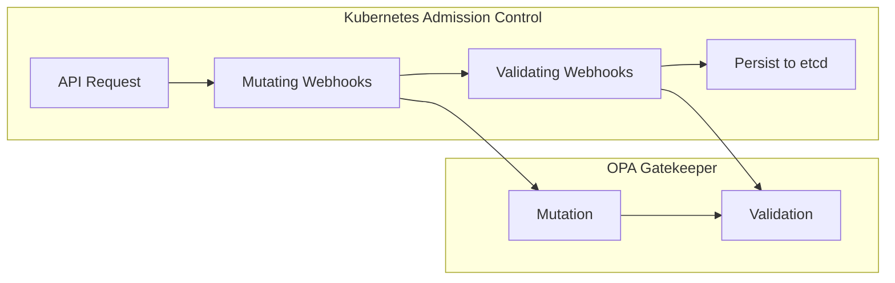
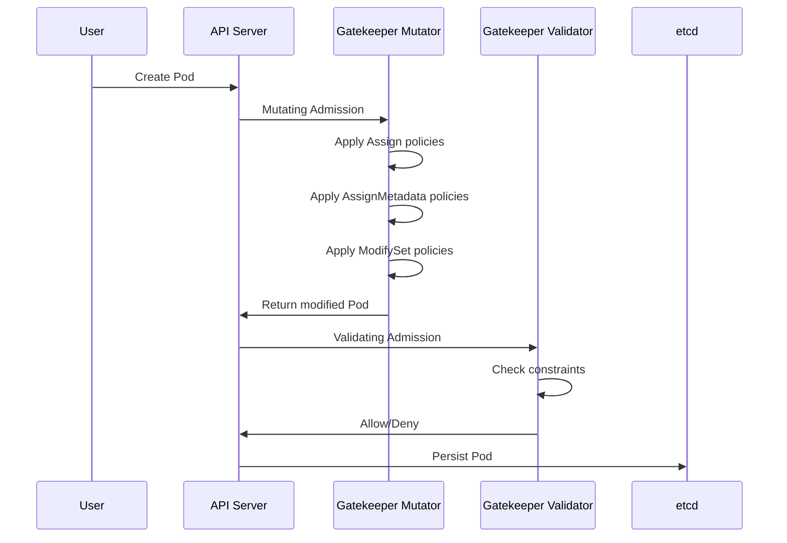
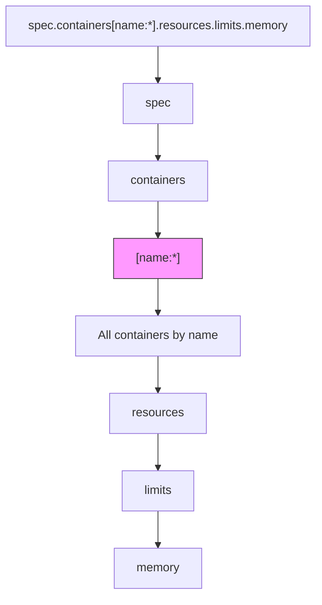
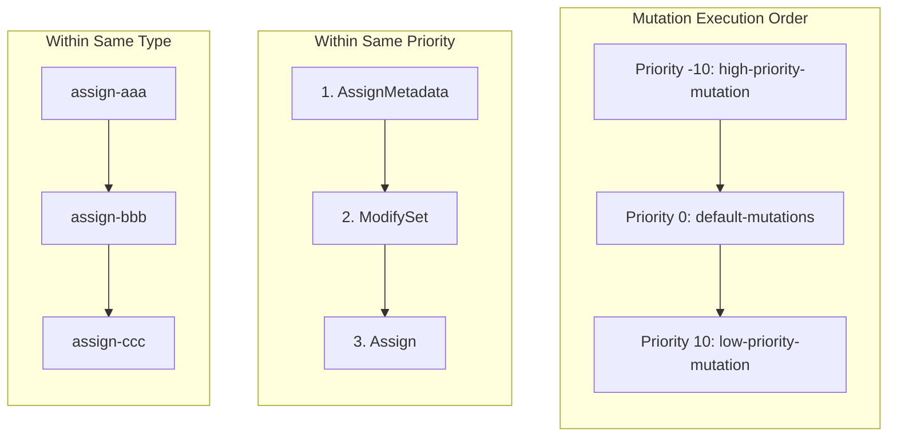

# How to Create OPA Gatekeeper Mutation

Author: [nawazdhandala](https://github.com/nawazdhandala)

Tags: OPA, Gatekeeper, Kubernetes, Mutation

Description: Learn how to use OPA Gatekeeper mutation policies to automatically modify Kubernetes resources during admission.

---

OPA Gatekeeper is known for validating Kubernetes resources, but its mutation feature is equally powerful. Mutations let you automatically modify resources as they are created or updated, ensuring consistency without rejecting requests.

## Understanding Mutation vs Validation

Validation policies reject non-compliant resources. Mutation policies modify resources to make them compliant. Both work during the admission control phase.



## How Gatekeeper Mutation Works

When a resource is submitted to Kubernetes, Gatekeeper intercepts it and applies mutation policies in order. The modified resource then passes through validation.



## Mutation Policy Types

Gatekeeper provides three mutation types:

| Type | Purpose | Use Case |
|------|---------|----------|
| **Assign** | Set or override field values | Add default resource limits |
| **AssignMetadata** | Add labels or annotations | Inject cost center labels |
| **ModifySet** | Add items to lists | Add sidecar containers |

## Enabling Mutation in Gatekeeper

Mutation is disabled by default. Enable it during installation.

```bash
# Install Gatekeeper with mutation enabled
helm install gatekeeper gatekeeper/gatekeeper \
  --namespace gatekeeper-system \
  --create-namespace \
  --set mutations.enabled=true \
  --set mutatingWebhookConfigurationFailurePolicy=Ignore
```

Or patch an existing installation:

```yaml
# gatekeeper-mutation-patch.yaml
apiVersion: apps/v1
kind: Deployment
metadata:
  name: gatekeeper-controller-manager
  namespace: gatekeeper-system
spec:
  template:
    spec:
      containers:
        - name: manager
          args:
            - --operation=mutation-webhook
            - --mutation-enabled=true
```

## Assign: Setting Field Values

Assign policies set or override specific field values in resources.

### Basic Structure

```yaml
apiVersion: mutations.gatekeeper.sh/v1
kind: Assign
metadata:
  name: demo-assign
spec:
  # Where to apply the mutation
  applyTo:
    - groups: [""]
      kinds: ["Pod"]
      versions: ["v1"]

  # Which resources to match
  match:
    scope: Namespaced
    kinds:
      - apiGroups: [""]
        kinds: ["Pod"]
    namespaces: ["production"]

  # What to mutate
  location: "spec.containers[name:*].resources.limits.memory"

  # The value to set
  parameters:
    assign:
      value: "512Mi"
```

### Example: Add Default Resource Limits

This policy adds memory limits to containers that lack them.

```yaml
apiVersion: mutations.gatekeeper.sh/v1
kind: Assign
metadata:
  name: assign-default-memory-limit
spec:
  applyTo:
    - groups: [""]
      kinds: ["Pod"]
      versions: ["v1"]
  match:
    scope: Namespaced
    kinds:
      - apiGroups: [""]
        kinds: ["Pod"]
    # Exclude system namespaces
    excludedNamespaces:
      - kube-system
      - gatekeeper-system
  # Target all containers, set memory limit
  location: "spec.containers[name:*].resources.limits.memory"
  parameters:
    # Only assign if the field does not exist
    pathTests:
      - subPath: "spec.containers[name:*].resources.limits.memory"
        condition: MustNotExist
    assign:
      value: "256Mi"
```

### Example: Set Security Context

Force containers to run as non-root.

```yaml
apiVersion: mutations.gatekeeper.sh/v1
kind: Assign
metadata:
  name: assign-run-as-nonroot
spec:
  applyTo:
    - groups: [""]
      kinds: ["Pod"]
      versions: ["v1"]
  match:
    scope: Namespaced
    kinds:
      - apiGroups: [""]
        kinds: ["Pod"]
  # Set at pod level
  location: "spec.securityContext.runAsNonRoot"
  parameters:
    assign:
      value: true
---
apiVersion: mutations.gatekeeper.sh/v1
kind: Assign
metadata:
  name: assign-container-security-context
spec:
  applyTo:
    - groups: [""]
      kinds: ["Pod"]
      versions: ["v1"]
  match:
    scope: Namespaced
    kinds:
      - apiGroups: [""]
        kinds: ["Pod"]
  # Set at container level
  location: "spec.containers[name:*].securityContext.allowPrivilegeEscalation"
  parameters:
    assign:
      value: false
```

### Example: Set Image Pull Policy

Ensure containers always pull images.

```yaml
apiVersion: mutations.gatekeeper.sh/v1
kind: Assign
metadata:
  name: assign-image-pull-policy
spec:
  applyTo:
    - groups: [""]
      kinds: ["Pod"]
      versions: ["v1"]
  match:
    scope: Namespaced
    kinds:
      - apiGroups: [""]
        kinds: ["Pod"]
    namespaceSelector:
      matchLabels:
        environment: production
  location: "spec.containers[name:*].imagePullPolicy"
  parameters:
    assign:
      value: "Always"
```

## AssignMetadata: Adding Labels and Annotations

AssignMetadata adds labels or annotations to resources. It cannot override existing values.

### Basic Structure

```yaml
apiVersion: mutations.gatekeeper.sh/v1
kind: AssignMetadata
metadata:
  name: demo-assign-metadata
spec:
  match:
    scope: Namespaced
    kinds:
      - apiGroups: [""]
        kinds: ["Pod"]
  # Can only target metadata.labels or metadata.annotations
  location: "metadata.labels.environment"
  parameters:
    assign:
      value: "production"
```

### Example: Add Cost Center Labels

Automatically tag resources for cost allocation.

```yaml
apiVersion: mutations.gatekeeper.sh/v1
kind: AssignMetadata
metadata:
  name: assign-cost-center-label
spec:
  match:
    scope: Namespaced
    kinds:
      - apiGroups: ["*"]
        kinds: ["*"]
    namespaces:
      - team-alpha
  location: "metadata.labels.cost-center"
  parameters:
    assign:
      value: "cc-12345"
---
apiVersion: mutations.gatekeeper.sh/v1
kind: AssignMetadata
metadata:
  name: assign-team-label
spec:
  match:
    scope: Namespaced
    kinds:
      - apiGroups: ["*"]
        kinds: ["*"]
    namespaces:
      - team-alpha
  location: "metadata.labels.team"
  parameters:
    assign:
      value: "alpha"
```

### Example: Add Monitoring Annotations

Inject Prometheus scraping annotations.

```yaml
apiVersion: mutations.gatekeeper.sh/v1
kind: AssignMetadata
metadata:
  name: assign-prometheus-scrape
spec:
  match:
    scope: Namespaced
    kinds:
      - apiGroups: [""]
        kinds: ["Pod"]
    # Only pods with the app label
    labelSelector:
      matchExpressions:
        - key: app
          operator: Exists
  location: "metadata.annotations.prometheus\\.io/scrape"
  parameters:
    assign:
      value: "true"
---
apiVersion: mutations.gatekeeper.sh/v1
kind: AssignMetadata
metadata:
  name: assign-prometheus-port
spec:
  match:
    scope: Namespaced
    kinds:
      - apiGroups: [""]
        kinds: ["Pod"]
    labelSelector:
      matchExpressions:
        - key: app
          operator: Exists
  location: "metadata.annotations.prometheus\\.io/port"
  parameters:
    assign:
      value: "8080"
```

## ModifySet: Adding Items to Lists

ModifySet adds items to list fields without replacing existing items.

### Basic Structure

```yaml
apiVersion: mutations.gatekeeper.sh/v1
kind: ModifySet
metadata:
  name: demo-modify-set
spec:
  applyTo:
    - groups: [""]
      kinds: ["Pod"]
      versions: ["v1"]
  match:
    scope: Namespaced
    kinds:
      - apiGroups: [""]
        kinds: ["Pod"]
  # Target a list field
  location: "spec.tolerations"
  parameters:
    operation: merge
    # Values to add to the list
    values:
      fromList:
        - key: "dedicated"
          operator: "Equal"
          value: "production"
          effect: "NoSchedule"
```

### Example: Add Default Tolerations

Allow pods to schedule on tainted nodes.

```yaml
apiVersion: mutations.gatekeeper.sh/v1
kind: ModifySet
metadata:
  name: add-spot-instance-toleration
spec:
  applyTo:
    - groups: [""]
      kinds: ["Pod"]
      versions: ["v1"]
  match:
    scope: Namespaced
    kinds:
      - apiGroups: [""]
        kinds: ["Pod"]
    # Only for pods with spot-eligible label
    labelSelector:
      matchLabels:
        spot-eligible: "true"
  location: "spec.tolerations"
  parameters:
    operation: merge
    values:
      fromList:
        - key: "kubernetes.azure.com/scalesetpriority"
          operator: "Equal"
          value: "spot"
          effect: "NoSchedule"
```

### Example: Add Image Pull Secrets

Inject registry credentials into pods.

```yaml
apiVersion: mutations.gatekeeper.sh/v1
kind: ModifySet
metadata:
  name: add-image-pull-secret
spec:
  applyTo:
    - groups: [""]
      kinds: ["Pod"]
      versions: ["v1"]
  match:
    scope: Namespaced
    kinds:
      - apiGroups: [""]
        kinds: ["Pod"]
    excludedNamespaces:
      - kube-system
  location: "spec.imagePullSecrets"
  parameters:
    operation: merge
    values:
      fromList:
        - name: "registry-credentials"
```

## Location and Path Expressions

The `location` field uses a path expression syntax to target specific fields.

### Path Syntax

```yaml
# Simple path
location: "spec.replicas"

# Array index
location: "spec.containers[0].image"

# Array with name selector (matches all containers)
location: "spec.containers[name:*].resources.limits.cpu"

# Specific named container
location: "spec.containers[name:nginx].image"

# Nested paths
location: "spec.template.spec.containers[name:*].env"

# Escape special characters with backslash
location: "metadata.annotations.prometheus\\.io/scrape"
```

### Path Expression Diagram



### Common Path Patterns

| Pattern | Description |
|---------|-------------|
| `spec.replicas` | Direct field access |
| `spec.containers[0]` | First container |
| `spec.containers[name:*]` | All containers |
| `spec.containers[name:app]` | Container named "app" |
| `metadata.labels.key` | Label with key "key" |
| `metadata.annotations.key\\.subkey` | Annotation with dots |

## Mutation Ordering and Conflicts

When multiple mutations target the same field, order matters.

### Default Ordering

Gatekeeper processes mutations in this order:

1. **By mutation type**: AssignMetadata, then ModifySet, then Assign
2. **By name**: Alphabetically within each type

### Controlling Order with Priorities

Use the `priority` field to control order. Lower numbers run first.

```yaml
apiVersion: mutations.gatekeeper.sh/v1
kind: Assign
metadata:
  name: high-priority-mutation
spec:
  # Runs before default (0) mutations
  # Lower number = higher priority = runs first
  priority: -10
  applyTo:
    - groups: [""]
      kinds: ["Pod"]
      versions: ["v1"]
  match:
    scope: Namespaced
    kinds:
      - apiGroups: [""]
        kinds: ["Pod"]
  location: "spec.containers[name:*].resources.limits.memory"
  parameters:
    assign:
      value: "1Gi"
---
apiVersion: mutations.gatekeeper.sh/v1
kind: Assign
metadata:
  name: low-priority-mutation
spec:
  # Runs after default mutations
  priority: 10
  applyTo:
    - groups: [""]
      kinds: ["Pod"]
      versions: ["v1"]
  match:
    scope: Namespaced
    kinds:
      - apiGroups: [""]
        kinds: ["Pod"]
  location: "spec.containers[name:*].resources.limits.memory"
  parameters:
    # This will overwrite the high-priority value
    assign:
      value: "512Mi"
```

### Mutation Order Visualization



### Avoiding Conflicts

Use `pathTests` to conditionally apply mutations.

```yaml
apiVersion: mutations.gatekeeper.sh/v1
kind: Assign
metadata:
  name: assign-memory-if-missing
spec:
  applyTo:
    - groups: [""]
      kinds: ["Pod"]
      versions: ["v1"]
  match:
    scope: Namespaced
    kinds:
      - apiGroups: [""]
        kinds: ["Pod"]
  location: "spec.containers[name:*].resources.limits.memory"
  parameters:
    pathTests:
      # Only mutate if memory limit is not already set
      - subPath: "spec.containers[name:*].resources.limits.memory"
        condition: MustNotExist
    assign:
      value: "256Mi"
```

## Testing Mutation Policies

### Using kubectl to Test

Create a dry-run to see what mutations will be applied.

```bash
# Create a test pod manifest
cat <<EOF > test-pod.yaml
apiVersion: v1
kind: Pod
metadata:
  name: test-pod
  namespace: default
spec:
  containers:
    - name: nginx
      image: nginx:latest
EOF

# Apply with dry-run to see mutations
kubectl apply -f test-pod.yaml --dry-run=server -o yaml
```

### Using Gatekeeper's Expand Resource

Test mutations without creating resources.

```yaml
apiVersion: expansion.gatekeeper.sh/v1beta1
kind: ExpansionTemplate
metadata:
  name: test-expand
spec:
  templateSource: "spec.template"
  generatedGVK:
    kind: Pod
    group: ""
    version: v1
```

### Unit Testing with Gator

The `gator` CLI lets you test mutations locally.

```bash
# Install gator
go install github.com/open-policy-agent/gatekeeper/v3/cmd/gator@latest

# Create test suite
cat <<EOF > mutation-test.yaml
apiVersion: test.gatekeeper.sh/v1alpha1
kind: Suite
metadata:
  name: mutation-test
tests:
  - name: test-memory-limit-mutation
    template: assign-default-memory-limit.yaml
    cases:
      - name: pod-without-limits-gets-mutated
        object: test-pod.yaml
        assertions:
          - violations: no
EOF

# Run tests
gator verify mutation-test.yaml
```

### Create a Test Script

```bash
#!/bin/bash
# test-mutations.sh

set -e

echo "Testing OPA Gatekeeper Mutations"
echo "================================"

# Create test namespace
kubectl create namespace mutation-test --dry-run=client -o yaml | kubectl apply -f -

# Apply mutation policies
kubectl apply -f mutations/

# Wait for policies to sync
sleep 5

# Test 1: Pod without memory limits
echo -e "\nTest 1: Pod without memory limits"
cat <<EOF | kubectl apply -n mutation-test --dry-run=server -o yaml -f -
apiVersion: v1
kind: Pod
metadata:
  name: test-no-limits
spec:
  containers:
    - name: app
      image: nginx
EOF

# Test 2: Pod with existing limits (should not be overwritten)
echo -e "\nTest 2: Pod with existing limits"
cat <<EOF | kubectl apply -n mutation-test --dry-run=server -o yaml -f -
apiVersion: v1
kind: Pod
metadata:
  name: test-with-limits
spec:
  containers:
    - name: app
      image: nginx
      resources:
        limits:
          memory: "1Gi"
EOF

# Test 3: Check labels are added
echo -e "\nTest 3: Check labels are added"
cat <<EOF | kubectl apply -n mutation-test --dry-run=server -o yaml -f -
apiVersion: v1
kind: Pod
metadata:
  name: test-labels
spec:
  containers:
    - name: app
      image: nginx
EOF

echo -e "\nAll tests completed!"
```

## Debugging Mutations

### Check Mutation Status

```bash
# List all mutation policies
kubectl get assign,assignmetadata,modifyset -A

# Check mutation status
kubectl get assign <name> -o yaml

# View mutation webhook configuration
kubectl get mutatingwebhookconfigurations gatekeeper-mutating-webhook-configuration -o yaml
```

### View Gatekeeper Logs

```bash
# View controller manager logs
kubectl logs -n gatekeeper-system -l control-plane=controller-manager -f

# Filter for mutation messages
kubectl logs -n gatekeeper-system -l control-plane=controller-manager | grep -i mutation
```

### Common Issues

**Mutation not applied:**
- Check that mutation is enabled in Gatekeeper
- Verify the `match` criteria includes your resource
- Ensure namespace is not excluded
- Check the `applyTo` field matches your resource GVK

**Mutation conflicts:**
- Review priority settings
- Use `pathTests` with `MustNotExist` condition
- Check alphabetical ordering of mutation names

**Unexpected values:**
- Later mutations may overwrite earlier ones
- Check all mutations targeting the same path
- Use `kubectl apply --dry-run=server -o yaml` to see final result

## Complete Example: Production-Ready Mutations

Here is a complete set of mutations for a production cluster.

```yaml
# 01-assign-resource-limits.yaml
# Add default resource limits to all containers
apiVersion: mutations.gatekeeper.sh/v1
kind: Assign
metadata:
  name: assign-default-cpu-request
spec:
  applyTo:
    - groups: [""]
      kinds: ["Pod"]
      versions: ["v1"]
  match:
    scope: Namespaced
    kinds:
      - apiGroups: [""]
        kinds: ["Pod"]
    excludedNamespaces:
      - kube-system
      - gatekeeper-system
      - monitoring
  location: "spec.containers[name:*].resources.requests.cpu"
  parameters:
    pathTests:
      - subPath: "spec.containers[name:*].resources.requests.cpu"
        condition: MustNotExist
    assign:
      value: "100m"
---
apiVersion: mutations.gatekeeper.sh/v1
kind: Assign
metadata:
  name: assign-default-memory-request
spec:
  applyTo:
    - groups: [""]
      kinds: ["Pod"]
      versions: ["v1"]
  match:
    scope: Namespaced
    kinds:
      - apiGroups: [""]
        kinds: ["Pod"]
    excludedNamespaces:
      - kube-system
      - gatekeeper-system
      - monitoring
  location: "spec.containers[name:*].resources.requests.memory"
  parameters:
    pathTests:
      - subPath: "spec.containers[name:*].resources.requests.memory"
        condition: MustNotExist
    assign:
      value: "128Mi"
---
apiVersion: mutations.gatekeeper.sh/v1
kind: Assign
metadata:
  name: assign-default-memory-limit
spec:
  applyTo:
    - groups: [""]
      kinds: ["Pod"]
      versions: ["v1"]
  match:
    scope: Namespaced
    kinds:
      - apiGroups: [""]
        kinds: ["Pod"]
    excludedNamespaces:
      - kube-system
      - gatekeeper-system
      - monitoring
  location: "spec.containers[name:*].resources.limits.memory"
  parameters:
    pathTests:
      - subPath: "spec.containers[name:*].resources.limits.memory"
        condition: MustNotExist
    assign:
      value: "256Mi"
---
# 02-assign-security-context.yaml
# Enforce security best practices
apiVersion: mutations.gatekeeper.sh/v1
kind: Assign
metadata:
  name: assign-readonly-root-filesystem
spec:
  applyTo:
    - groups: [""]
      kinds: ["Pod"]
      versions: ["v1"]
  match:
    scope: Namespaced
    kinds:
      - apiGroups: [""]
        kinds: ["Pod"]
    excludedNamespaces:
      - kube-system
  location: "spec.containers[name:*].securityContext.readOnlyRootFilesystem"
  parameters:
    pathTests:
      - subPath: "spec.containers[name:*].securityContext.readOnlyRootFilesystem"
        condition: MustNotExist
    assign:
      value: true
---
apiVersion: mutations.gatekeeper.sh/v1
kind: Assign
metadata:
  name: assign-drop-all-capabilities
spec:
  applyTo:
    - groups: [""]
      kinds: ["Pod"]
      versions: ["v1"]
  match:
    scope: Namespaced
    kinds:
      - apiGroups: [""]
        kinds: ["Pod"]
    excludedNamespaces:
      - kube-system
  location: "spec.containers[name:*].securityContext.capabilities.drop"
  parameters:
    pathTests:
      - subPath: "spec.containers[name:*].securityContext.capabilities.drop"
        condition: MustNotExist
    assign:
      value:
        - ALL
---
# 03-assign-metadata.yaml
# Add organizational labels
apiVersion: mutations.gatekeeper.sh/v1
kind: AssignMetadata
metadata:
  name: assign-managed-by-label
spec:
  match:
    scope: Namespaced
    kinds:
      - apiGroups: ["*"]
        kinds: ["*"]
    excludedNamespaces:
      - kube-system
      - gatekeeper-system
  location: "metadata.labels.app\\.kubernetes\\.io/managed-by"
  parameters:
    assign:
      value: "gatekeeper"
---
# 04-modify-set-tolerations.yaml
# Add common tolerations
apiVersion: mutations.gatekeeper.sh/v1
kind: ModifySet
metadata:
  name: add-default-tolerations
spec:
  applyTo:
    - groups: [""]
      kinds: ["Pod"]
      versions: ["v1"]
  match:
    scope: Namespaced
    kinds:
      - apiGroups: [""]
        kinds: ["Pod"]
    excludedNamespaces:
      - kube-system
  location: "spec.tolerations"
  parameters:
    operation: merge
    values:
      fromList:
        # Tolerate node not ready briefly
        - key: "node.kubernetes.io/not-ready"
          operator: "Exists"
          effect: "NoExecute"
          tolerationSeconds: 60
        # Tolerate node unreachable briefly
        - key: "node.kubernetes.io/unreachable"
          operator: "Exists"
          effect: "NoExecute"
          tolerationSeconds: 60
```

## Best Practices

### Design Principles

1. **Use MustNotExist conditions** - Avoid overwriting intentional values
2. **Exclude system namespaces** - Never mutate kube-system resources
3. **Set sensible defaults** - Mutations should provide safe fallbacks
4. **Document mutations** - Add comments explaining why each mutation exists
5. **Test before deploying** - Use dry-run and gator to verify behavior

### Naming Conventions

```yaml
# Good: descriptive names with type prefix
assign-default-memory-limit
assignmetadata-cost-center-label
modifyset-registry-pull-secrets

# Bad: vague names
mutation1
my-mutation
test
```

### Organizing Mutations

```
mutations/
  00-priorities.md          # Document priority scheme
  01-resource-defaults/     # Resource requests and limits
    assign-cpu-request.yaml
    assign-memory-limit.yaml
  02-security/              # Security context mutations
    assign-nonroot.yaml
    assign-readonly-fs.yaml
  03-metadata/              # Labels and annotations
    assignmetadata-team.yaml
    assignmetadata-cost.yaml
  04-tolerations/           # Tolerations and affinities
    modifyset-spot-tolerations.yaml
```

---

OPA Gatekeeper mutations transform how you manage Kubernetes configuration. Instead of rejecting pods that lack resource limits, mutate them to have sensible defaults. Instead of requiring teams to add cost center labels manually, inject them automatically. Combine mutations with validation constraints for a comprehensive policy framework that makes the right thing the easy thing.
