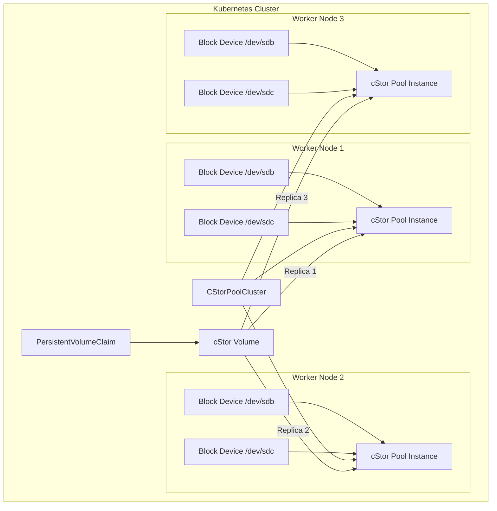
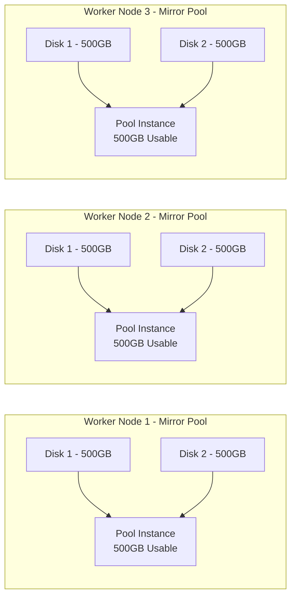
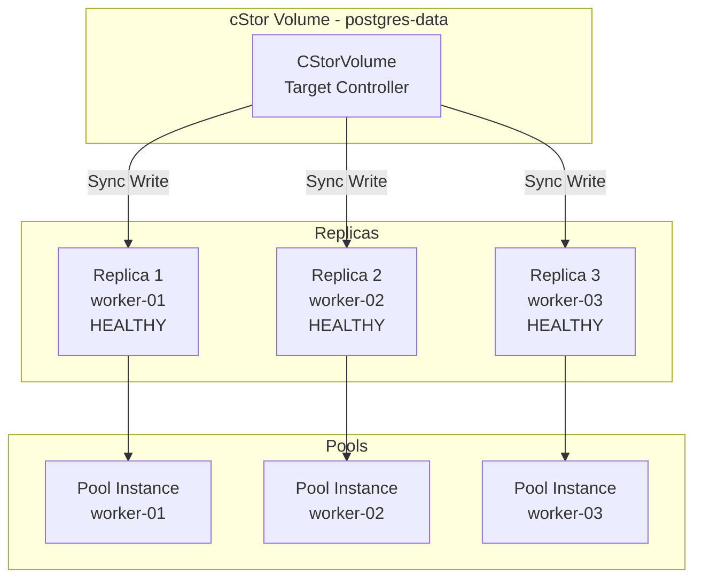
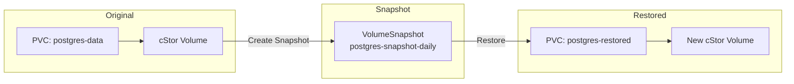
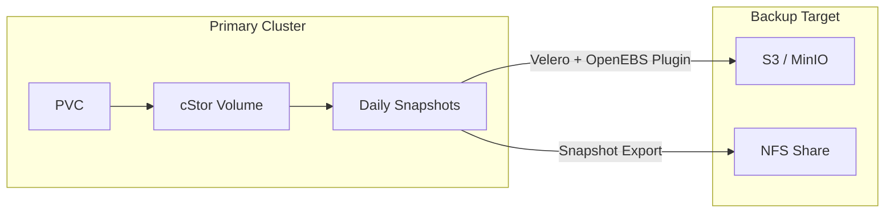

# How to Build OpenEBS cStor Pools

Author: [nawazdhandala](https://github.com/nawazdhandala)

Tags: OpenEBS, Kubernetes, Storage, cStor

Description: A complete guide to building and managing OpenEBS cStor pools in Kubernetes, covering pool architecture, RAID configurations, replica management, and production best practices for enterprise storage.

---

cStor is the production-grade storage engine in OpenEBS that provides replicated block storage with ZFS-like features. Unlike simple local volumes, cStor pools aggregate block devices across your Kubernetes nodes into resilient storage pools that can survive disk and node failures. This guide walks you through building cStor pools from scratch, configuring them for your workload requirements, and operating them in production.

## What is cStor?

cStor (Container Storage for OpenEBS) is a storage engine that creates pools from block devices and carves out thin-provisioned volumes with synchronous replication. It is built on a customized version of OpenZFS, giving you features like:

- Synchronous data replication across nodes
- Copy-on-write snapshots and clones
- Data compression and checksumming
- Thin provisioning with on-demand allocation



## Prerequisites

Before building cStor pools, prepare your cluster with these requirements.

### Install iSCSI on All Nodes

cStor uses iSCSI to expose volumes to pods. Install the iSCSI initiator on every worker node:

```bash
# Ubuntu/Debian
sudo apt update
sudo apt install -y open-iscsi
sudo systemctl enable --now iscsid

# RHEL/CentOS/Rocky
sudo dnf install -y iscsi-initiator-utils
sudo systemctl enable --now iscsid

# Verify iSCSI is running
systemctl status iscsid
```

### Prepare Block Devices

Identify unused block devices on your nodes. These should be raw devices without partitions or filesystems:

```bash
# List all block devices
lsblk

# Example output:
# NAME   MAJ:MIN RM   SIZE RO TYPE MOUNTPOINT
# sda      8:0    0   100G  0 disk
# |-sda1   8:1    0    99G  0 part /
# |-sda2   8:2    0     1G  0 part [SWAP]
# sdb      8:16   0   500G  0 disk           # Available for cStor
# sdc      8:32   0   500G  0 disk           # Available for cStor

# Verify device is empty (no filesystem)
sudo file -s /dev/sdb
# Output should be: /dev/sdb: data (meaning no filesystem)
```

### Install OpenEBS with cStor

Deploy OpenEBS using Helm with cStor enabled:

```bash
# Add OpenEBS Helm repository
helm repo add openebs https://openebs.github.io/charts
helm repo update

# Install OpenEBS with cStor operator
helm install openebs openebs/openebs \
    --namespace openebs \
    --create-namespace \
    --set cstor.enabled=true \
    --set ndm.enabled=true \
    --set localprovisioner.enabled=false \
    --set mayastor.enabled=false

# Wait for all pods to be ready
kubectl -n openebs wait --for=condition=Ready pods --all --timeout=300s

# Verify cStor components
kubectl -n openebs get pods | grep cstor
```

You should see the cStor operator, CSI controller, and node components running.

## Understanding Block Device Discovery

OpenEBS Node Device Manager (NDM) automatically discovers block devices and creates BlockDevice custom resources.

```bash
# List discovered block devices
kubectl get blockdevices -n openebs

# Example output:
# NAME                                           NODENAME    SIZE          CLAIMSTATE   STATUS
# blockdevice-1a2b3c4d-5e6f-7g8h-9i0j-k1l2m3n4   worker-01   536870912000  Unclaimed    Active
# blockdevice-2b3c4d5e-6f7g-8h9i-0j1k-l2m3n4o5   worker-01   536870912000  Unclaimed    Active
# blockdevice-3c4d5e6f-7g8h-9i0j-1k2l-m3n4o5p6   worker-02   536870912000  Unclaimed    Active
# blockdevice-4d5e6f7g-8h9i-0j1k-2l3m-n4o5p6q7   worker-02   536870912000  Unclaimed    Active
# blockdevice-5e6f7g8h-9i0j-1k2l-3m4n-o5p6q7r8   worker-03   536870912000  Unclaimed    Active
# blockdevice-6f7g8h9i-0j1k-2l3m-4n5o-p6q7r8s9   worker-03   536870912000  Unclaimed    Active
```

Get detailed information about a specific block device:

```bash
kubectl get blockdevice blockdevice-1a2b3c4d-5e6f-7g8h-9i0j-k1l2m3n4 \
    -n openebs -o yaml
```

Key fields to check:
- `status.claimState`: Should be "Unclaimed" for available devices
- `status.state`: Should be "Active"
- `spec.capacity.storage`: Device size
- `spec.path`: The device path (e.g., /dev/sdb)
- `spec.nodeAttributes.nodeName`: Which node owns this device

## Building Your First cStor Pool Cluster

A CStorPoolCluster (CSPC) defines how to create pool instances across your nodes.

### Simple Stripe Configuration

Start with a basic striped pool using one device per node:

```yaml
# cspc-stripe.yaml
apiVersion: cstor.openebs.io/v1
kind: CStorPoolCluster
metadata:
  name: cstor-pool-stripe
  namespace: openebs
spec:
  pools:
    - nodeSelector:
        kubernetes.io/hostname: "worker-01"
      dataRaidGroups:
        - blockDevices:
            - blockDeviceName: "blockdevice-1a2b3c4d-5e6f-7g8h-9i0j-k1l2m3n4"
      poolConfig:
        dataRaidGroupType: "stripe"

    - nodeSelector:
        kubernetes.io/hostname: "worker-02"
      dataRaidGroups:
        - blockDevices:
            - blockDeviceName: "blockdevice-3c4d5e6f-7g8h-9i0j-1k2l-m3n4o5p6"
      poolConfig:
        dataRaidGroupType: "stripe"

    - nodeSelector:
        kubernetes.io/hostname: "worker-03"
      dataRaidGroups:
        - blockDevices:
            - blockDeviceName: "blockdevice-5e6f7g8h-9i0j-1k2l-3m4n-o5p6q7r8"
      poolConfig:
        dataRaidGroupType: "stripe"
```

Apply the configuration:

```bash
kubectl apply -f cspc-stripe.yaml

# Watch pool creation
kubectl -n openebs get cspc,cspi -w

# Expected output after creation:
# NAME                                          HEALTHYINSTANCES   PROVISIONEDINSTANCES   DESIREDINSTANCES   AGE
# cstorpoolcluster.cstor.openebs.io/cstor-pool-stripe   3                  3                      3                  2m
#
# NAME                                                 HOSTNAME    FREE          CAPACITY      READONLY   PROVISIONEDREPLICAS   HEALTHYREPLICAS   STATUS   AGE
# cstorpoolinstance.cstor.openebs.io/cstor-pool-stripe-abc1   worker-01   499Gi         500Gi         false      0                     0                 ONLINE   2m
# cstorpoolinstance.cstor.openebs.io/cstor-pool-stripe-def2   worker-02   499Gi         500Gi         false      0                     0                 ONLINE   2m
# cstorpoolinstance.cstor.openebs.io/cstor-pool-stripe-ghi3   worker-03   499Gi         500Gi         false      0                     0                 ONLINE   2m
```

### Mirror Configuration for Local Redundancy

Mirror provides local disk redundancy within each node:

```yaml
# cspc-mirror.yaml
apiVersion: cstor.openebs.io/v1
kind: CStorPoolCluster
metadata:
  name: cstor-pool-mirror
  namespace: openebs
spec:
  pools:
    - nodeSelector:
        kubernetes.io/hostname: "worker-01"
      dataRaidGroups:
        - blockDevices:
            - blockDeviceName: "blockdevice-1a2b3c4d-5e6f-7g8h-9i0j-k1l2m3n4"
            - blockDeviceName: "blockdevice-2b3c4d5e-6f7g-8h9i-0j1k-l2m3n4o5"
      poolConfig:
        dataRaidGroupType: "mirror"

    - nodeSelector:
        kubernetes.io/hostname: "worker-02"
      dataRaidGroups:
        - blockDevices:
            - blockDeviceName: "blockdevice-3c4d5e6f-7g8h-9i0j-1k2l-m3n4o5p6"
            - blockDeviceName: "blockdevice-4d5e6f7g-8h9i-0j1k-2l3m-n4o5p6q7"
      poolConfig:
        dataRaidGroupType: "mirror"

    - nodeSelector:
        kubernetes.io/hostname: "worker-03"
      dataRaidGroups:
        - blockDevices:
            - blockDeviceName: "blockdevice-5e6f7g8h-9i0j-1k2l-3m4n-o5p6q7r8"
            - blockDeviceName: "blockdevice-6f7g8h9i-0j1k-2l3m-4n5o-p6q7r8s9"
      poolConfig:
        dataRaidGroupType: "mirror"
```



### RAIDZ Configuration for Capacity Efficiency

RAIDZ provides parity-based redundancy with better capacity efficiency:

```yaml
# cspc-raidz.yaml
apiVersion: cstor.openebs.io/v1
kind: CStorPoolCluster
metadata:
  name: cstor-pool-raidz
  namespace: openebs
spec:
  pools:
    - nodeSelector:
        kubernetes.io/hostname: "worker-01"
      dataRaidGroups:
        - blockDevices:
            - blockDeviceName: "blockdevice-aaa111"
            - blockDeviceName: "blockdevice-bbb222"
            - blockDeviceName: "blockdevice-ccc333"
      poolConfig:
        dataRaidGroupType: "raidz"  # Single parity, tolerates 1 disk failure

    - nodeSelector:
        kubernetes.io/hostname: "worker-02"
      dataRaidGroups:
        - blockDevices:
            - blockDeviceName: "blockdevice-ddd444"
            - blockDeviceName: "blockdevice-eee555"
            - blockDeviceName: "blockdevice-fff666"
      poolConfig:
        dataRaidGroupType: "raidz"
```

RAID configuration comparison:

| Configuration | Minimum Disks | Usable Capacity | Disk Fault Tolerance |
|--------------|---------------|-----------------|---------------------|
| stripe | 1 | 100% | 0 disks |
| mirror | 2 | 50% | n-1 disks |
| raidz | 3 | (n-1)/n | 1 disk |
| raidz2 | 4 | (n-2)/n | 2 disks |

## Creating Storage Classes

Once your pool is ready, create a StorageClass to provision volumes:

```yaml
# storageclass-cstor.yaml
apiVersion: storage.k8s.io/v1
kind: StorageClass
metadata:
  name: cstor-csi-3-replicas
provisioner: cstor.csi.openebs.io
allowVolumeExpansion: true
parameters:
  cas-type: cstor
  cstorPoolCluster: cstor-pool-stripe
  replicaCount: "3"
reclaimPolicy: Delete
volumeBindingMode: Immediate
```

Create additional storage classes for different use cases:

```yaml
# storageclass-cstor-1-replica.yaml
apiVersion: storage.k8s.io/v1
kind: StorageClass
metadata:
  name: cstor-csi-1-replica
provisioner: cstor.csi.openebs.io
allowVolumeExpansion: true
parameters:
  cas-type: cstor
  cstorPoolCluster: cstor-pool-stripe
  replicaCount: "1"
reclaimPolicy: Delete
volumeBindingMode: Immediate
---
# storageclass-cstor-retain.yaml
apiVersion: storage.k8s.io/v1
kind: StorageClass
metadata:
  name: cstor-csi-retain
provisioner: cstor.csi.openebs.io
allowVolumeExpansion: true
parameters:
  cas-type: cstor
  cstorPoolCluster: cstor-pool-stripe
  replicaCount: "3"
reclaimPolicy: Retain
volumeBindingMode: Immediate
```

Apply and verify:

```bash
kubectl apply -f storageclass-cstor.yaml

# List storage classes
kubectl get storageclass | grep cstor
```

## Deploying Workloads with cStor Volumes

### PostgreSQL with Replicated Storage

```yaml
# postgres-cstor.yaml
apiVersion: v1
kind: PersistentVolumeClaim
metadata:
  name: postgres-data
  namespace: database
spec:
  storageClassName: cstor-csi-3-replicas
  accessModes:
    - ReadWriteOnce
  resources:
    requests:
      storage: 50Gi
---
apiVersion: apps/v1
kind: StatefulSet
metadata:
  name: postgres
  namespace: database
spec:
  serviceName: postgres
  replicas: 1
  selector:
    matchLabels:
      app: postgres
  template:
    metadata:
      labels:
        app: postgres
    spec:
      containers:
        - name: postgres
          image: postgres:16
          ports:
            - containerPort: 5432
          env:
            - name: POSTGRES_PASSWORD
              valueFrom:
                secretKeyRef:
                  name: postgres-secret
                  key: password
            - name: PGDATA
              value: /var/lib/postgresql/data/pgdata
          volumeMounts:
            - name: data
              mountPath: /var/lib/postgresql/data
          resources:
            requests:
              memory: "1Gi"
              cpu: "500m"
            limits:
              memory: "2Gi"
              cpu: "1000m"
      volumes:
        - name: data
          persistentVolumeClaim:
            claimName: postgres-data
```

Apply and verify:

```bash
kubectl create namespace database
kubectl create secret generic postgres-secret \
    --namespace database \
    --from-literal=password=supersecretpassword

kubectl apply -f postgres-cstor.yaml

# Check PVC and volume status
kubectl -n database get pvc
kubectl get cstorvolume -n openebs
kubectl get cstorvolumereplica -n openebs
```

## Managing cStor Volumes

### Volume Replica Visualization



### Check Volume Health

```bash
# List all cStor volumes
kubectl get cstorvolume -n openebs

# Example output:
# NAME                                       CAPACITY   STATUS    AGE
# pvc-abc12345-def6-7890-ghij-klmnopqrstuv   50Gi       Healthy   1h

# Check volume replicas
kubectl get cstorvolumereplica -n openebs -o wide

# Example output:
# NAME                                                          ALLOCATED   USED    STATUS    AGE
# pvc-abc12345-def6-7890-ghij-klmnopqrstuv-cstor-pool-stripe-abc1   2.5Gi       3Gi     Healthy   1h
# pvc-abc12345-def6-7890-ghij-klmnopqrstuv-cstor-pool-stripe-def2   2.5Gi       3Gi     Healthy   1h
# pvc-abc12345-def6-7890-ghij-klmnopqrstuv-cstor-pool-stripe-ghi3   2.5Gi       3Gi     Healthy   1h

# Get detailed volume information
kubectl describe cstorvolume pvc-abc12345-def6-7890-ghij-klmnopqrstuv -n openebs
```

### Expand a cStor Volume

cStor supports online volume expansion:

```bash
# Edit the PVC to increase size
kubectl patch pvc postgres-data -n database -p '{"spec":{"resources":{"requests":{"storage":"100Gi"}}}}'

# Monitor expansion progress
kubectl get pvc postgres-data -n database -w

# Verify new size
kubectl get cstorvolume -n openebs
```

## Snapshots and Clones

### Create Volume Snapshot Class

```yaml
# snapshotclass-cstor.yaml
apiVersion: snapshot.storage.k8s.io/v1
kind: VolumeSnapshotClass
metadata:
  name: cstor-snapshot-class
driver: cstor.csi.openebs.io
deletionPolicy: Delete
```

### Take a Snapshot

```yaml
# snapshot-postgres.yaml
apiVersion: snapshot.storage.k8s.io/v1
kind: VolumeSnapshot
metadata:
  name: postgres-snapshot-daily
  namespace: database
spec:
  volumeSnapshotClassName: cstor-snapshot-class
  source:
    persistentVolumeClaimName: postgres-data
```

Apply and verify:

```bash
kubectl apply -f snapshot-postgres.yaml

# Check snapshot status
kubectl get volumesnapshot -n database
kubectl get volumesnapshotcontent
```

### Restore from Snapshot

```yaml
# pvc-from-snapshot.yaml
apiVersion: v1
kind: PersistentVolumeClaim
metadata:
  name: postgres-restored
  namespace: database
spec:
  storageClassName: cstor-csi-3-replicas
  dataSource:
    name: postgres-snapshot-daily
    kind: VolumeSnapshot
    apiGroup: snapshot.storage.k8s.io
  accessModes:
    - ReadWriteOnce
  resources:
    requests:
      storage: 50Gi
```



## Pool Maintenance Operations

### Adding Devices to an Existing Pool

You can expand a pool by adding more devices:

```bash
# First, identify new block devices
kubectl get blockdevices -n openebs | grep Unclaimed

# Edit the CSPC to add new devices
kubectl edit cspc cstor-pool-stripe -n openebs
```

Add a new device to an existing pool instance:

```yaml
# In the pool spec, add additional blockDevices
spec:
  pools:
    - nodeSelector:
        kubernetes.io/hostname: "worker-01"
      dataRaidGroups:
        - blockDevices:
            - blockDeviceName: "blockdevice-existing"
            - blockDeviceName: "blockdevice-new"  # Add this line
      poolConfig:
        dataRaidGroupType: "stripe"
```

### Replacing a Failed Disk

When a disk fails, replace it with a healthy one:

```bash
# Identify the failed block device
kubectl get blockdevices -n openebs | grep -v Active

# Check pool health
kubectl get cspi -n openebs

# Replace the block device in CSPC
kubectl edit cspc cstor-pool-stripe -n openebs
# Change the blockDeviceName from the failed device to the replacement
```

### Scaling Pool Instances

Add a new pool instance on a new node:

```yaml
# Add this to your existing CSPC spec
spec:
  pools:
    # ... existing pools ...
    - nodeSelector:
        kubernetes.io/hostname: "worker-04"  # New node
      dataRaidGroups:
        - blockDevices:
            - blockDeviceName: "blockdevice-new-node"
      poolConfig:
        dataRaidGroupType: "stripe"
```

## Monitoring cStor Pools

### Prometheus Metrics

cStor exports metrics for monitoring. Create a ServiceMonitor:

```yaml
# servicemonitor-cstor.yaml
apiVersion: monitoring.coreos.com/v1
kind: ServiceMonitor
metadata:
  name: cstor-pool-metrics
  namespace: openebs
spec:
  selector:
    matchLabels:
      app: cstor-pool
  namespaceSelector:
    matchNames:
      - openebs
  endpoints:
    - port: exporter
      interval: 30s
```

Key metrics to track:

| Metric | Description | Alert Threshold |
|--------|-------------|-----------------|
| `openebs_pool_status` | Pool health status | != 1 (not online) |
| `openebs_pool_used_capacity_percent` | Pool capacity utilization | > 80% |
| `openebs_volume_replica_status` | Replica health | != 1 (not healthy) |
| `openebs_pool_read_latency` | Read latency | > 10ms |
| `openebs_pool_write_latency` | Write latency | > 20ms |

### Alerting Rules

```yaml
# alerts-cstor.yaml
apiVersion: monitoring.coreos.com/v1
kind: PrometheusRule
metadata:
  name: cstor-alerts
  namespace: openebs
spec:
  groups:
    - name: cstor.rules
      rules:
        - alert: CStorPoolDegraded
          expr: openebs_pool_status != 1
          for: 5m
          labels:
            severity: critical
          annotations:
            summary: "cStor pool {{ $labels.pool_name }} is degraded"

        - alert: CStorPoolCapacityHigh
          expr: openebs_pool_used_capacity_percent > 80
          for: 10m
          labels:
            severity: warning
          annotations:
            summary: "cStor pool {{ $labels.pool_name }} is over 80% full"

        - alert: CStorVolumeReplicaDegraded
          expr: openebs_volume_replica_status != 1
          for: 5m
          labels:
            severity: critical
          annotations:
            summary: "cStor volume replica {{ $labels.volume_name }} is unhealthy"
```

## Troubleshooting Common Issues

### Pool Instance Not Coming Online

```bash
# Check pool instance status
kubectl get cspi -n openebs -o wide

# Check pool pod logs
kubectl logs -n openebs -l app=cstor-pool --tail=100

# Common causes:
# 1. Block device in use by another process
# 2. iSCSI not running on the node
# 3. Insufficient memory for ZFS ARC cache
```

### Volume Stuck in Pending State

```bash
# Check volume status
kubectl describe cstorvolume <volume-name> -n openebs

# Check CSI controller logs
kubectl logs -n openebs -l app=openebs-cstor-csi-controller --tail=100

# Common causes:
# 1. Not enough healthy pool instances for replica count
# 2. Pool capacity exhausted
# 3. CSI driver not ready
```

### Replica Rebuild Taking Too Long

```bash
# Monitor rebuild progress
kubectl get cvr -n openebs -w

# Check replica status
kubectl describe cvr <replica-name> -n openebs

# Increase rebuild rate if needed (edit pool pod)
# Default is conservative to avoid impacting production I/O
```

## Production Best Practices

### Pool Design Recommendations

1. **Separate pools for different workload tiers**: Create dedicated pools for high-IOPS workloads versus bulk storage.

2. **Use mirror for databases**: Mirror provides better rebuild times than RAIDZ for latency-sensitive workloads.

3. **Match replica count to pool instances**: If you have 3 pool instances, use 3 replicas for maximum redundancy.

4. **Reserve capacity**: Keep pools below 80% utilization. ZFS performance degrades as pools fill up.

### Backup Strategy



Use Velero with the OpenEBS plugin for automated backups:

```bash
# Install Velero with OpenEBS plugin
velero install \
    --provider aws \
    --plugins velero/velero-plugin-for-aws:v1.8.0,openebs/velero-plugin:3.5.0 \
    --bucket velero-backup \
    --secret-file ./credentials-velero \
    --backup-location-config region=us-east-1

# Create a backup schedule
velero schedule create daily-backup \
    --schedule="0 2 * * *" \
    --include-namespaces database \
    --snapshot-volumes
```

### Capacity Planning

```yaml
# resource-quota-cstor.yaml
apiVersion: v1
kind: ResourceQuota
metadata:
  name: storage-quota
  namespace: database
spec:
  hard:
    requests.storage: "500Gi"
    persistentvolumeclaims: "10"
```

## Summary

Building cStor pools requires careful planning around disk selection, RAID configuration, and replica placement. The key steps are:

1. **Prepare nodes** with iSCSI and identify available block devices
2. **Create a CStorPoolCluster** with appropriate RAID configuration per node
3. **Define StorageClasses** with replica counts matching your availability requirements
4. **Deploy workloads** using the cStor storage class
5. **Monitor pool health** and set up alerts for degraded states
6. **Plan for maintenance** including disk replacement and pool expansion

cStor provides enterprise-grade storage features without the complexity of external storage arrays. Match your RAID configuration to your workload: stripe for maximum performance, mirror for databases, and RAIDZ for bulk storage. Monitor your pools continuously and test your recovery procedures before you need them.
