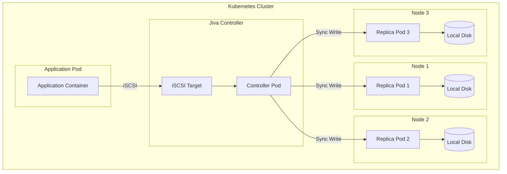
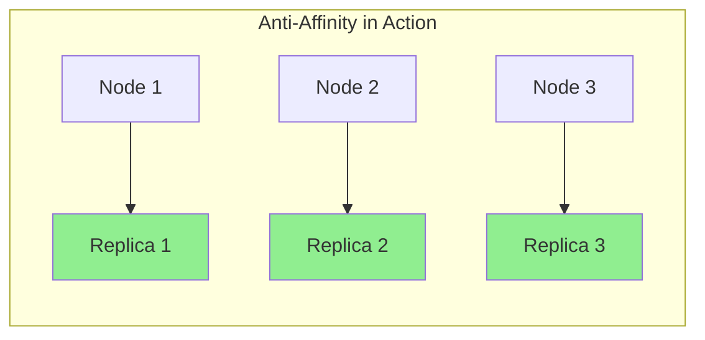
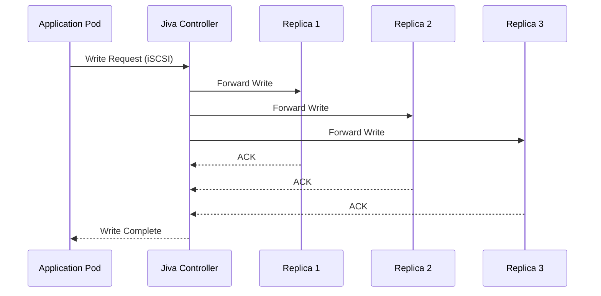
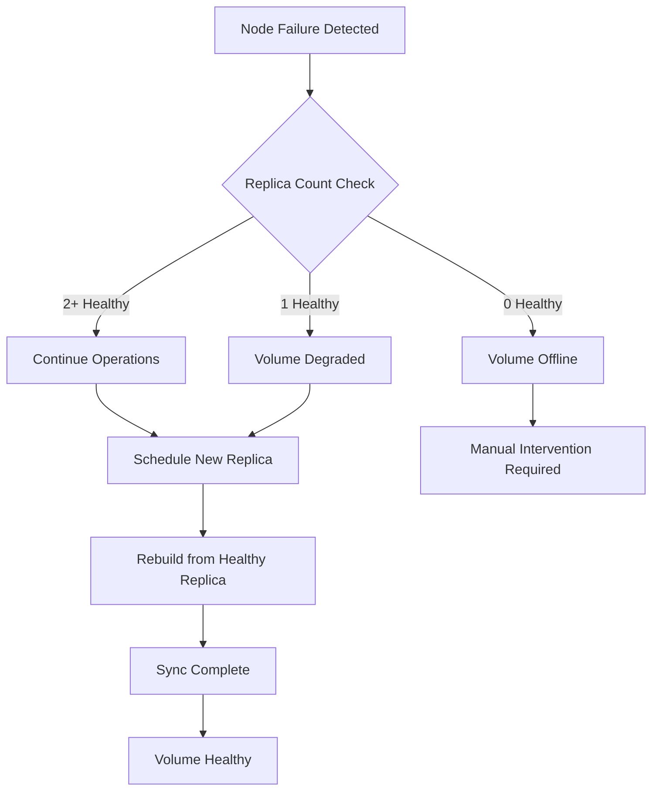
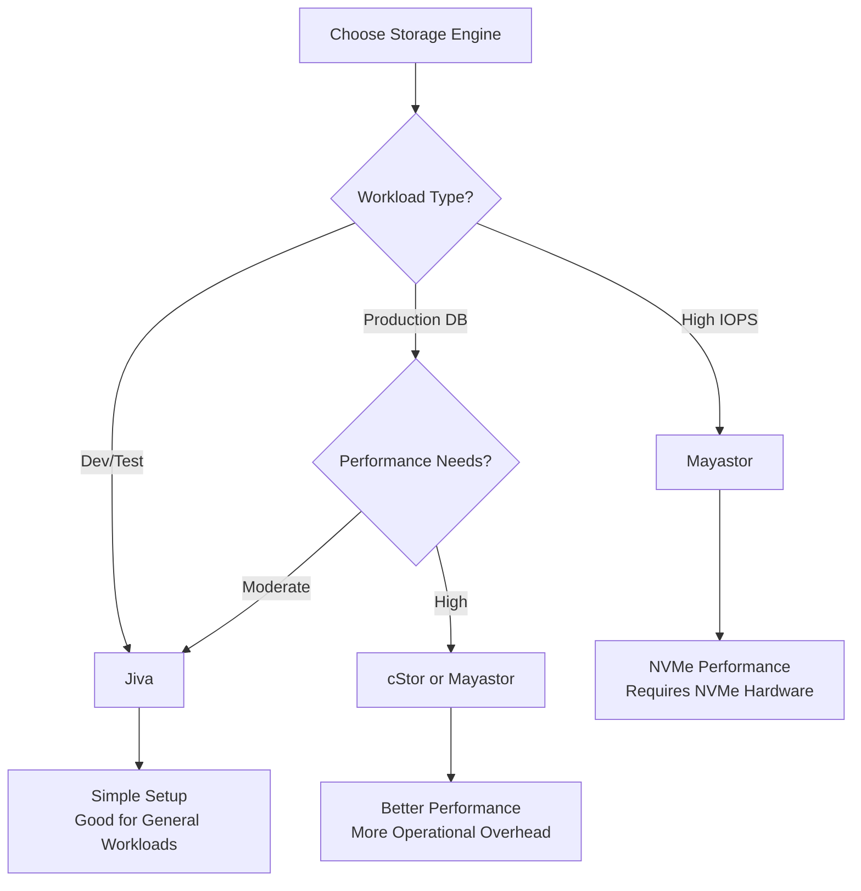

# How to Build OpenEBS Jiva Volumes

Author: [nawazdhandala](https://github.com/nawazdhandala)

Tags: OpenEBS, Kubernetes, Storage, Jiva

Description: A comprehensive guide to building and managing OpenEBS Jiva volumes in Kubernetes. Learn the architecture, installation, configuration, and best practices for running replicated block storage with Jiva.

---

Kubernetes storage comes in many flavors, but not every workload needs the complexity of distributed storage systems like Ceph. Sometimes you want replicated block storage that is simple to deploy, easy to understand, and works out of the box. That is where OpenEBS Jiva comes in.

Jiva is one of the storage engines within the OpenEBS project. It provides synchronous replication across multiple nodes using a userspace implementation, making it ideal for development clusters, smaller production workloads, and teams that want storage HA without the operational overhead of enterprise solutions.

## What is OpenEBS Jiva?

Jiva is a lightweight, containerized storage engine that runs entirely in userspace. Unlike kernel-based storage solutions, Jiva does not require special kernel modules or privileged access to raw block devices. It uses iSCSI to expose volumes to pods and replicates data synchronously across multiple nodes.



### Key Components

- **Jiva Controller**: A single pod that exposes an iSCSI target and coordinates writes to all replicas.
- **Jiva Replicas**: Multiple pods (typically three) that store the actual data on local storage paths.
- **OpenEBS Operator**: Manages the lifecycle of Jiva volumes through Kubernetes CRDs.

## Prerequisites

Before deploying Jiva, ensure your cluster meets these requirements:

1. **Kubernetes 1.21 or later** with CSI support enabled
2. **iSCSI initiator tools** installed on all worker nodes
3. **At least three worker nodes** for proper replication (single-node works for testing)
4. **Local storage paths** available on each node for replica data

### Installing iSCSI Initiator Tools

On Ubuntu/Debian nodes:

```bash
sudo apt-get update
sudo apt-get install -y open-iscsi
sudo systemctl enable --now iscsid
```

On RHEL/CentOS nodes:

```bash
sudo yum install -y iscsi-initiator-utils
sudo systemctl enable --now iscsid
```

Verify the iSCSI service is running:

```bash
systemctl status iscsid
```

## Installing OpenEBS with Jiva

OpenEBS provides multiple installation methods. We will use Helm for a production-ready setup.

### Step 1: Add the OpenEBS Helm Repository

```bash
helm repo add openebs https://openebs.github.io/openebs
helm repo update
```

### Step 2: Install OpenEBS with Jiva Enabled

Create a values file to configure the installation:

```yaml
# openebs-values.yaml
localprovisioner:
  enabled: true
  basePath: "/var/openebs/local"

jiva:
  enabled: true
  replicas: 3
  defaultPolicy:
    replicas: 3
  defaultStoragePath: "/var/openebs"

cstor:
  enabled: false

mayastor:
  enabled: false
```

Install OpenEBS:

```bash
kubectl create namespace openebs

helm install openebs openebs/openebs \
  --namespace openebs \
  --values openebs-values.yaml \
  --wait
```

### Step 3: Verify the Installation

Check that all OpenEBS pods are running:

```bash
kubectl get pods -n openebs
```

Expected output:

```
NAME                                           READY   STATUS    RESTARTS   AGE
openebs-localpv-provisioner-7b8c5d4d9f-x2j4k   1/1     Running   0          2m
openebs-jiva-csi-controller-0                  5/5     Running   0          2m
openebs-jiva-csi-node-4h2x7                    2/2     Running   0          2m
openebs-jiva-csi-node-8k3n9                    2/2     Running   0          2m
openebs-jiva-csi-node-p5m2r                    2/2     Running   0          2m
openebs-jiva-operator-6f8d7c9b5-qr4wt          1/1     Running   0          2m
```

## Creating a Jiva StorageClass

StorageClasses define the parameters for dynamically provisioned volumes. Here is a production-ready Jiva StorageClass:

```yaml
# jiva-storageclass.yaml
apiVersion: storage.k8s.io/v1
kind: StorageClass
metadata:
  name: openebs-jiva
  annotations:
    storageclass.kubernetes.io/is-default-class: "false"
provisioner: jiva.csi.openebs.io
allowVolumeExpansion: true
parameters:
  cas-type: jiva
  replicaCount: "3"
  policy: "openebs-jiva-default-policy"
volumeBindingMode: WaitForFirstConsumer
reclaimPolicy: Delete
```

Apply the StorageClass:

```bash
kubectl apply -f jiva-storageclass.yaml
```

### Understanding the Parameters

| Parameter | Description |
|-----------|-------------|
| `replicaCount` | Number of data replicas (use 3 for production) |
| `policy` | References a JivaVolumePolicy CRD for advanced settings |
| `volumeBindingMode` | `WaitForFirstConsumer` delays binding until a pod uses the PVC |
| `allowVolumeExpansion` | Enables online volume resizing |

## Creating a JivaVolumePolicy

JivaVolumePolicy CRDs allow fine-grained control over volume behavior:

```yaml
# jiva-policy.yaml
apiVersion: openebs.io/v1alpha1
kind: JivaVolumePolicy
metadata:
  name: openebs-jiva-default-policy
  namespace: openebs
spec:
  replicaSC: openebs-hostpath
  target:
    replicationFactor: 3
    disableMonitor: false
    auxResources:
      limits:
        cpu: "100m"
        memory: "128Mi"
      requests:
        cpu: "50m"
        memory: "64Mi"
    resources:
      limits:
        cpu: "500m"
        memory: "512Mi"
      requests:
        cpu: "100m"
        memory: "128Mi"
    tolerations: []
    affinity: {}
  replica:
    resources:
      limits:
        cpu: "200m"
        memory: "256Mi"
      requests:
        cpu: "50m"
        memory: "64Mi"
    tolerations: []
    affinity:
      podAntiAffinity:
        requiredDuringSchedulingIgnoredDuringExecution:
        - labelSelector:
            matchLabels:
              openebs.io/component: jiva-replica
          topologyKey: kubernetes.io/hostname
```

Apply the policy:

```bash
kubectl apply -f jiva-policy.yaml
```

### Policy Highlights

The `podAntiAffinity` rule ensures replicas are spread across different nodes:



This prevents a single node failure from taking down multiple replicas.

## Deploying an Application with Jiva Storage

Let us deploy a sample application that uses Jiva storage.

### Step 1: Create a PersistentVolumeClaim

```yaml
# jiva-pvc.yaml
apiVersion: v1
kind: PersistentVolumeClaim
metadata:
  name: demo-jiva-pvc
  namespace: default
spec:
  storageClassName: openebs-jiva
  accessModes:
    - ReadWriteOnce
  resources:
    requests:
      storage: 10Gi
```

### Step 2: Deploy a StatefulSet Using the PVC

```yaml
# demo-app.yaml
apiVersion: apps/v1
kind: StatefulSet
metadata:
  name: demo-app
  namespace: default
spec:
  serviceName: demo-app
  replicas: 1
  selector:
    matchLabels:
      app: demo-app
  template:
    metadata:
      labels:
        app: demo-app
    spec:
      containers:
      - name: app
        image: busybox:1.36
        command: ["/bin/sh", "-c"]
        args:
          - |
            while true; do
              echo "$(date): Writing to Jiva volume" >> /data/log.txt
              sleep 10
            done
        volumeMounts:
        - name: data
          mountPath: /data
        resources:
          limits:
            cpu: "100m"
            memory: "128Mi"
          requests:
            cpu: "50m"
            memory: "64Mi"
  volumeClaimTemplates:
  - metadata:
      name: data
    spec:
      storageClassName: openebs-jiva
      accessModes:
        - ReadWriteOnce
      resources:
        requests:
          storage: 10Gi
```

Apply both manifests:

```bash
kubectl apply -f jiva-pvc.yaml
kubectl apply -f demo-app.yaml
```

### Step 3: Verify Volume Provisioning

Check the PVC status:

```bash
kubectl get pvc demo-jiva-pvc
```

Output:

```
NAME            STATUS   VOLUME                                     CAPACITY   ACCESS MODES   STORAGECLASS    AGE
demo-jiva-pvc   Bound    pvc-a1b2c3d4-e5f6-7890-abcd-ef1234567890   10Gi       RWO            openebs-jiva    30s
```

Inspect the Jiva volume:

```bash
kubectl get jivavolume -n openebs
```

Output:

```
NAME                                       REPLICACOUNT   PHASE     STATUS
pvc-a1b2c3d4-e5f6-7890-abcd-ef1234567890   3              Syncing   RW
```

## Understanding the Jiva Data Path

When an application writes data to a Jiva volume, here is what happens:



Key characteristics:

- **Synchronous replication**: The controller waits for all replicas to acknowledge before confirming the write.
- **Strong consistency**: All replicas have the same data at any point in time.
- **Quorum-based reads**: Reads come from any healthy replica.

## Monitoring Jiva Volumes

OpenEBS exposes Prometheus metrics for monitoring. Here is how to scrape them.

### Enable Metrics Collection

Add annotations to the Jiva controller pods:

```yaml
# In your JivaVolumePolicy
spec:
  target:
    disableMonitor: false
```

### Key Metrics to Watch

| Metric | Description |
|--------|-------------|
| `openebs_actual_used` | Actual disk space used by the volume |
| `openebs_read_iops` | Read operations per second |
| `openebs_write_iops` | Write operations per second |
| `openebs_read_latency` | Average read latency in milliseconds |
| `openebs_write_latency` | Average write latency in milliseconds |
| `openebs_replica_status` | Health status of each replica |

### Sample Prometheus Alert Rules

```yaml
# jiva-alerts.yaml
apiVersion: monitoring.coreos.com/v1
kind: PrometheusRule
metadata:
  name: jiva-volume-alerts
  namespace: monitoring
spec:
  groups:
  - name: jiva.rules
    rules:
    - alert: JivaVolumeReplicaDegraded
      expr: openebs_replica_status{status="Degraded"} == 1
      for: 5m
      labels:
        severity: warning
      annotations:
        summary: "Jiva volume replica degraded"
        description: "Volume {{ $labels.volume }} has a degraded replica"

    - alert: JivaVolumeHighLatency
      expr: openebs_write_latency > 100
      for: 10m
      labels:
        severity: warning
      annotations:
        summary: "Jiva volume write latency high"
        description: "Volume {{ $labels.volume }} write latency is {{ $value }}ms"
```

## Handling Failures and Recovery

Jiva handles node and replica failures gracefully. Here is the recovery flow:



### Forcing a Replica Rebuild

If a replica becomes stale, you can force a rebuild:

```bash
# Get the JivaVolume name
kubectl get jivavolume -n openebs

# Delete the stale replica pod (controller will recreate it)
kubectl delete pod <replica-pod-name> -n openebs
```

The new replica will automatically sync from healthy replicas.

### Checking Replica Sync Status

```bash
kubectl describe jivavolume <volume-name> -n openebs
```

Look for the `ReplicaStatuses` section:

```yaml
Status:
  Phase: Syncing
  Replica Statuses:
  - Address: tcp://10.244.1.5:9502
    Mode: RW
  - Address: tcp://10.244.2.8:9502
    Mode: RW
  - Address: tcp://10.244.3.12:9502
    Mode: WO  # Write-Only means rebuilding
```

## Volume Expansion

Jiva supports online volume expansion. Here is how to resize a volume:

```bash
# Edit the PVC to increase storage
kubectl patch pvc demo-jiva-pvc -p '{"spec":{"resources":{"requests":{"storage":"20Gi"}}}}'
```

Monitor the expansion:

```bash
kubectl get pvc demo-jiva-pvc -w
```

The volume will expand without downtime. The filesystem inside the pod will automatically resize on the next mount or when using resize-capable filesystems like ext4 or xfs.

## Backup and Restore with Velero

Jiva integrates with Velero for backup and disaster recovery.

### Install Velero with OpenEBS Plugin

```bash
velero install \
  --provider aws \
  --plugins velero/velero-plugin-for-aws:v1.8.0 \
  --bucket my-backup-bucket \
  --backup-location-config region=us-east-1 \
  --snapshot-location-config region=us-east-1 \
  --use-volume-snapshots=true \
  --features=EnableCSI
```

### Create a Backup

```bash
velero backup create demo-backup \
  --include-namespaces default \
  --include-resources pvc,pv \
  --wait
```

### Restore from Backup

```bash
velero restore create --from-backup demo-backup
```

## Performance Tuning

Jiva performance depends on network and disk speed. Here are tuning recommendations:

### Network Optimization

1. **Use dedicated storage network**: If possible, isolate storage traffic from application traffic.
2. **Enable jumbo frames**: Set MTU to 9000 on storage network interfaces.
3. **Place replicas close to the controller**: Minimize network hops.

### Disk Optimization

1. **Use SSDs for replica storage**: HDDs introduce significant latency.
2. **Separate system and storage disks**: Avoid I/O contention.
3. **Monitor disk utilization**: Alert when disks are over 80% full.

### Resource Limits

Adjust controller and replica resources based on workload:

```yaml
# High-throughput workload
spec:
  target:
    resources:
      limits:
        cpu: "1000m"
        memory: "1Gi"
      requests:
        cpu: "500m"
        memory: "512Mi"
  replica:
    resources:
      limits:
        cpu: "500m"
        memory: "512Mi"
      requests:
        cpu: "250m"
        memory: "256Mi"
```

## When to Use Jiva vs Other OpenEBS Engines



### Jiva is Best For

- Development and testing environments
- Moderate I/O workloads (web applications, microservices)
- Teams wanting simple operations
- Clusters without NVMe hardware

### Consider Alternatives When

- You need very high IOPS (use Mayastor)
- You need advanced features like snapshots and clones (use cStor)
- You are running latency-sensitive databases (use local PVs or Mayastor)

## Troubleshooting Common Issues

### Issue: PVC Stuck in Pending

Check events:

```bash
kubectl describe pvc <pvc-name>
```

Common causes:

1. **No matching nodes**: Ensure nodes have the required storage path.
2. **Insufficient resources**: Check if nodes can schedule controller and replica pods.
3. **iSCSI not installed**: Verify iscsid is running on all nodes.

### Issue: Volume in Degraded State

```bash
kubectl get jivavolume -n openebs -o yaml
```

Look for replica issues:

1. **Node down**: Wait for node recovery or delete stale replica.
2. **Disk full**: Expand the underlying storage or add capacity.
3. **Network partition**: Check connectivity between controller and replicas.

### Issue: Slow Performance

1. Check replica placement - ensure they are on different nodes
2. Verify network latency between nodes
3. Monitor disk I/O on replica nodes
4. Review resource limits on controller and replica pods

## Cleanup

To remove Jiva volumes and OpenEBS:

```bash
# Delete test resources
kubectl delete statefulset demo-app
kubectl delete pvc demo-jiva-pvc

# Wait for volumes to be deleted
kubectl get jivavolume -n openebs

# Uninstall OpenEBS
helm uninstall openebs -n openebs

# Remove the namespace
kubectl delete namespace openebs
```

## Summary

OpenEBS Jiva provides a straightforward path to replicated block storage in Kubernetes. It trades raw performance for operational simplicity, making it ideal for teams that want storage HA without becoming storage experts.

Key takeaways:

1. **Install iSCSI tools** on all nodes before deploying Jiva
2. **Use anti-affinity rules** to spread replicas across nodes
3. **Monitor replica status** and set up alerts for degraded volumes
4. **Plan for capacity** - Jiva stores full copies on each replica
5. **Test failover** regularly to ensure your recovery procedures work

For production workloads requiring higher performance, consider OpenEBS Mayastor or cStor. But for many use cases, Jiva delivers exactly what you need: reliable, replicated storage that just works.
