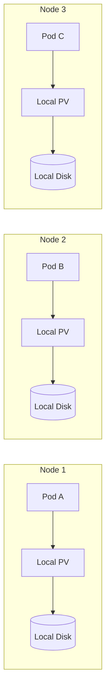
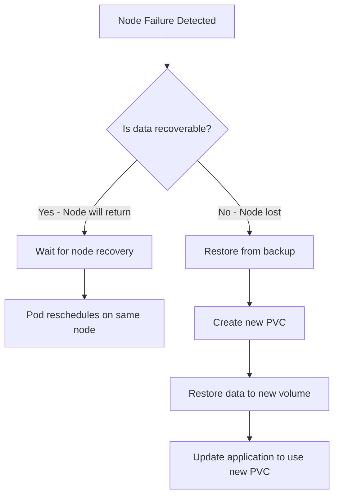

# How to Implement OpenEBS Local PV

Author: [nawazdhandala](https://github.com/nawazdhandala)

Tags: OpenEBS, Kubernetes, Storage, Local PV

Description: A comprehensive guide to implementing OpenEBS Local PV for high-performance local persistent storage in Kubernetes, covering hostpath and device provisioners, storage classes, and production best practices.

---

When your workloads need raw disk speed without the overhead of network-replicated storage, OpenEBS Local PV delivers exactly that. It turns local disks or directories on Kubernetes nodes into persistent volumes that stay bound to specific nodes, giving databases and caches the low-latency storage they crave.

This guide walks through everything you need to deploy OpenEBS Local PV in production: from installation to storage classes, practical examples, and monitoring strategies.

## What is OpenEBS Local PV?

OpenEBS Local PV is a Container Storage Interface (CSI) driver that provisions persistent volumes using local storage on Kubernetes nodes. Unlike replicated storage solutions, Local PV does not copy data across nodes. Instead, it binds pods to the node where their data lives.



### Two Provisioner Types

OpenEBS Local PV offers two provisioners:

| Provisioner | Storage Type | Use Case | Performance |
|-------------|--------------|----------|-------------|
| **Hostpath** | Directory on node filesystem | Development, CI/CD, ephemeral workloads | Limited by node filesystem |
| **Device** | Raw block device | Production databases, high-IOPS workloads | Full device bandwidth |

The hostpath provisioner creates directories under a base path (typically `/var/openebs/local`), while the device provisioner uses entire block devices for maximum throughput.

## Prerequisites

Before installing OpenEBS Local PV, ensure your cluster meets these requirements:

- Kubernetes 1.21 or later
- Helm 3.x installed
- `kubectl` configured with cluster admin access
- For device provisioner: unformatted block devices on worker nodes
- iSCSI client utilities (some installations require these)

Check your Kubernetes version:

```bash
kubectl version --short
```

Verify Helm is installed:

```bash
helm version
```

## Installing OpenEBS Local PV

OpenEBS provides multiple installation methods. The Helm chart approach gives you the most control over configuration.

### Step 1: Add the OpenEBS Helm Repository

```bash
helm repo add openebs https://openebs.github.io/openebs
helm repo update
```

### Step 2: Install OpenEBS with Local PV Only

For clusters that only need Local PV (without Mayastor or cStor), use a minimal installation:

```bash
helm install openebs openebs/openebs \
  --namespace openebs \
  --create-namespace \
  --set engines.local.lvm.enabled=false \
  --set engines.local.zfs.enabled=false \
  --set engines.replicated.mayastor.enabled=false
```

This installs only the Local PV hostpath and device provisioners, keeping your cluster lean.

### Step 3: Verify the Installation

Check that the OpenEBS pods are running:

```bash
kubectl get pods -n openebs
```

Expected output:

```
NAME                                              READY   STATUS    RESTARTS   AGE
openebs-localpv-provisioner-5b4f7d9c8b-xk2mj     1/1     Running   0          2m
openebs-ndm-cluster-exporter-7f8c9d6b4-9pqrs     1/1     Running   0          2m
openebs-ndm-node-exporter-4xk8p                   1/1     Running   0          2m
openebs-ndm-node-exporter-7r2nq                   1/1     Running   0          2m
openebs-ndm-node-exporter-bz9mc                   1/1     Running   0          2m
openebs-ndm-operator-6c4d8f9b7-j4qwz             1/1     Running   0          2m
```

Verify the default storage classes were created:

```bash
kubectl get storageclass | grep openebs
```

## Configuring Storage Classes

Storage classes define how volumes get provisioned. OpenEBS Local PV creates default classes, but production deployments benefit from custom configurations.

### Hostpath Storage Class

The hostpath provisioner is ideal for development and workloads that tolerate node-local storage semantics.

```yaml
apiVersion: storage.k8s.io/v1
kind: StorageClass
metadata:
  name: openebs-hostpath-ssd
  annotations:
    openebs.io/cas-type: local
    cas.openebs.io/config: |
      - name: StorageType
        value: hostpath
      - name: BasePath
        value: /mnt/fast-ssd/openebs
provisioner: openebs.io/local
reclaimPolicy: Delete
volumeBindingMode: WaitForFirstConsumer
allowVolumeExpansion: true
```

Apply this configuration:

```bash
kubectl apply -f hostpath-storageclass.yaml
```

Key configuration options:

- **BasePath**: Directory where PV subdirectories get created. Use fast storage paths for performance-sensitive workloads.
- **volumeBindingMode: WaitForFirstConsumer**: Delays volume binding until a pod uses the PVC, ensuring the volume gets created on the right node.
- **reclaimPolicy**: `Delete` removes the volume when the PVC is deleted; `Retain` preserves data for manual recovery.

### Device Storage Class

The device provisioner delivers maximum performance by giving pods exclusive access to block devices.

First, identify available block devices using Node Device Manager (NDM):

```bash
kubectl get blockdevices -n openebs
```

Example output:

```
NAME                                           NODENAME    SIZE          CLAIMSTATE   STATUS   AGE
blockdevice-1234567890abcdef12345678           worker-1    107374182400  Unclaimed    Active   5m
blockdevice-abcdef1234567890abcdef12           worker-2    107374182400  Unclaimed    Active   5m
blockdevice-567890abcdef1234567890ab           worker-3    107374182400  Unclaimed    Active   5m
```

Create a device storage class:

```yaml
apiVersion: storage.k8s.io/v1
kind: StorageClass
metadata:
  name: openebs-device-nvme
  annotations:
    openebs.io/cas-type: local
    cas.openebs.io/config: |
      - name: StorageType
        value: device
      - name: FSType
        value: ext4
provisioner: openebs.io/local
reclaimPolicy: Delete
volumeBindingMode: WaitForFirstConsumer
```

Apply it:

```bash
kubectl apply -f device-storageclass.yaml
```

The device provisioner automatically selects an unclaimed block device when a PVC requests storage.

## Practical Examples

### Example 1: PostgreSQL with Hostpath Local PV

This example deploys PostgreSQL using the hostpath provisioner, suitable for development or single-node production setups.

```yaml
apiVersion: v1
kind: PersistentVolumeClaim
metadata:
  name: postgres-data
spec:
  accessModes:
    - ReadWriteOnce
  storageClassName: openebs-hostpath
  resources:
    requests:
      storage: 20Gi
---
apiVersion: apps/v1
kind: StatefulSet
metadata:
  name: postgres
spec:
  serviceName: postgres
  replicas: 1
  selector:
    matchLabels:
      app: postgres
  template:
    metadata:
      labels:
        app: postgres
    spec:
      containers:
        - name: postgres
          image: postgres:16
          ports:
            - containerPort: 5432
          env:
            - name: POSTGRES_PASSWORD
              valueFrom:
                secretKeyRef:
                  name: postgres-secret
                  key: password
            - name: PGDATA
              value: /var/lib/postgresql/data/pgdata
          volumeMounts:
            - name: postgres-storage
              mountPath: /var/lib/postgresql/data
          resources:
            requests:
              memory: "512Mi"
              cpu: "500m"
            limits:
              memory: "1Gi"
              cpu: "1000m"
      volumes:
        - name: postgres-storage
          persistentVolumeClaim:
            claimName: postgres-data
```

Create the secret first:

```bash
kubectl create secret generic postgres-secret \
  --from-literal=password=your-secure-password
```

Deploy PostgreSQL:

```bash
kubectl apply -f postgres-statefulset.yaml
```

### Example 2: Redis with Device Local PV for High Performance

For latency-sensitive workloads like Redis, the device provisioner provides direct block device access.

```yaml
apiVersion: v1
kind: PersistentVolumeClaim
metadata:
  name: redis-data
spec:
  accessModes:
    - ReadWriteOnce
  storageClassName: openebs-device-nvme
  resources:
    requests:
      storage: 50Gi
---
apiVersion: apps/v1
kind: Deployment
metadata:
  name: redis
spec:
  replicas: 1
  selector:
    matchLabels:
      app: redis
  template:
    metadata:
      labels:
        app: redis
    spec:
      containers:
        - name: redis
          image: redis:7-alpine
          command:
            - redis-server
            - --appendonly
            - "yes"
            - --appendfsync
            - everysec
          ports:
            - containerPort: 6379
          volumeMounts:
            - name: redis-data
              mountPath: /data
          resources:
            requests:
              memory: "256Mi"
              cpu: "250m"
            limits:
              memory: "1Gi"
              cpu: "1000m"
      volumes:
        - name: redis-data
          persistentVolumeClaim:
            claimName: redis-data
```

### Example 3: Elasticsearch Cluster with Node Affinity

For distributed workloads like Elasticsearch, combine Local PV with pod anti-affinity to spread data across nodes.

```yaml
apiVersion: apps/v1
kind: StatefulSet
metadata:
  name: elasticsearch
spec:
  serviceName: elasticsearch
  replicas: 3
  selector:
    matchLabels:
      app: elasticsearch
  template:
    metadata:
      labels:
        app: elasticsearch
    spec:
      affinity:
        podAntiAffinity:
          requiredDuringSchedulingIgnoredDuringExecution:
            - labelSelector:
                matchExpressions:
                  - key: app
                    operator: In
                    values:
                      - elasticsearch
              topologyKey: kubernetes.io/hostname
      initContainers:
        - name: fix-permissions
          image: busybox
          command: ["sh", "-c", "chown -R 1000:1000 /usr/share/elasticsearch/data"]
          volumeMounts:
            - name: data
              mountPath: /usr/share/elasticsearch/data
      containers:
        - name: elasticsearch
          image: docker.elastic.co/elasticsearch/elasticsearch:8.11.0
          env:
            - name: discovery.type
              value: multi-node
            - name: cluster.name
              value: k8s-logs
            - name: node.name
              valueFrom:
                fieldRef:
                  fieldPath: metadata.name
            - name: discovery.seed_hosts
              value: "elasticsearch-0.elasticsearch,elasticsearch-1.elasticsearch,elasticsearch-2.elasticsearch"
            - name: cluster.initial_master_nodes
              value: "elasticsearch-0,elasticsearch-1,elasticsearch-2"
            - name: ES_JAVA_OPTS
              value: "-Xms512m -Xmx512m"
            - name: xpack.security.enabled
              value: "false"
          ports:
            - containerPort: 9200
              name: http
            - containerPort: 9300
              name: transport
          volumeMounts:
            - name: data
              mountPath: /usr/share/elasticsearch/data
          resources:
            requests:
              memory: "1Gi"
              cpu: "500m"
            limits:
              memory: "2Gi"
              cpu: "1000m"
  volumeClaimTemplates:
    - metadata:
        name: data
      spec:
        accessModes:
          - ReadWriteOnce
        storageClassName: openebs-device-nvme
        resources:
          requests:
            storage: 100Gi
```

## Architecture Deep Dive

Understanding how OpenEBS Local PV works helps you troubleshoot issues and optimize performance.

```mermaid
flowchart TB
    subgraph Kubernetes["Kubernetes Control Plane"]
        API[API Server]
        Scheduler[Scheduler]
    end

    subgraph OpenEBS["OpenEBS Components"]
        Provisioner[Local PV Provisioner]
        NDM[Node Device Manager]
        Exporter[NDM Exporter]
    end

    subgraph Worker["Worker Node"]
        Kubelet[Kubelet]
        CSIDriver[CSI Node Driver]
        Hostpath[/var/openebs/local]
        Device[(Block Device)]
    end

    API --> Provisioner
    Provisioner --> API
    NDM --> API
    NDM --> Device
    Exporter --> NDM

    Scheduler --> API
    API --> Kubelet
    Kubelet --> CSIDriver
    CSIDriver --> Hostpath
    CSIDriver --> Device
```

### Volume Lifecycle

1. **PVC Creation**: A user creates a PersistentVolumeClaim requesting storage.
2. **Scheduler Decision**: With `WaitForFirstConsumer`, the scheduler places the pod first, then provisions the volume on that node.
3. **Volume Provisioning**: The Local PV provisioner creates either a directory (hostpath) or formats a block device.
4. **Volume Binding**: The PV binds to the PVC, and the pod mounts the volume.
5. **Node Affinity**: The PV includes a node affinity rule ensuring future pods using this PVC land on the same node.

### Node Device Manager (NDM)

NDM discovers and manages block devices across your cluster:

```bash
# List all discovered block devices
kubectl get blockdevices -n openebs -o wide

# Get details about a specific device
kubectl describe blockdevice blockdevice-1234567890abcdef -n openebs
```

NDM filters out:

- Boot devices and partitions
- Devices with existing filesystems (unless configured otherwise)
- Loop devices and LVM volumes

Configure NDM filters via the ConfigMap:

```yaml
apiVersion: v1
kind: ConfigMap
metadata:
  name: openebs-ndm-config
  namespace: openebs
data:
  node-disk-manager.config: |
    filterconfigs:
      - key: os-disk-exclude-filter
        name: os disk exclude filter
        state: true
        exclude: "/,/boot"
      - key: vendor-filter
        name: vendor filter
        state: true
        include: ""
        exclude: "CLOUDBYT,OpenEBS"
      - key: path-filter
        name: path filter
        state: true
        include: ""
        exclude: "loop,fd0,sr0,/dev/ram,/dev/dm-,/dev/md"
```

## Monitoring and Observability

Production deployments need visibility into storage health and performance.

### Prometheus Metrics

OpenEBS exports metrics through the NDM exporter. Add this ServiceMonitor if you use the Prometheus Operator:

```yaml
apiVersion: monitoring.coreos.com/v1
kind: ServiceMonitor
metadata:
  name: openebs-ndm
  namespace: openebs
spec:
  selector:
    matchLabels:
      app: openebs-ndm-exporter
  endpoints:
    - port: metrics
      interval: 30s
```

Key metrics to monitor:

| Metric | Description |
|--------|-------------|
| `openebs_ndm_block_device_state` | Device state (Active, Inactive, Unknown) |
| `openebs_ndm_block_device_capacity_bytes` | Total capacity of each device |
| `openebs_ndm_block_device_used_bytes` | Used capacity |
| `openebs_pv_capacity_bytes` | Provisioned PV capacity |

### Alerting Rules

Set up alerts for storage issues:

```yaml
apiVersion: monitoring.coreos.com/v1
kind: PrometheusRule
metadata:
  name: openebs-localpv-alerts
  namespace: openebs
spec:
  groups:
    - name: openebs-localpv
      rules:
        - alert: OpenEBSLocalPVSpaceLow
          expr: |
            (1 - (node_filesystem_avail_bytes{mountpoint=~"/var/openebs.*"}
            / node_filesystem_size_bytes{mountpoint=~"/var/openebs.*"})) > 0.85
          for: 5m
          labels:
            severity: warning
          annotations:
            summary: "OpenEBS Local PV space low on {{ $labels.instance }}"
            description: "Local PV storage on {{ $labels.mountpoint }} is {{ $value | humanizePercentage }} full"

        - alert: OpenEBSBlockDeviceInactive
          expr: openebs_ndm_block_device_state != 1
          for: 5m
          labels:
            severity: critical
          annotations:
            summary: "OpenEBS block device inactive"
            description: "Block device {{ $labels.blockdevice }} is not in Active state"
```

### Integration with OneUptime

Export your OpenEBS metrics to OneUptime for centralized observability:

```yaml
apiVersion: v1
kind: ConfigMap
metadata:
  name: otel-collector-config
  namespace: monitoring
data:
  config.yaml: |
    receivers:
      prometheus:
        config:
          scrape_configs:
            - job_name: 'openebs-ndm'
              kubernetes_sd_configs:
                - role: pod
              relabel_configs:
                - source_labels: [__meta_kubernetes_pod_label_app]
                  regex: openebs-ndm-exporter
                  action: keep

    exporters:
      otlp:
        endpoint: "https://otlp.oneuptime.com:4317"
        headers:
          x-oneuptime-token: "${ONEUPTIME_TOKEN}"

    service:
      pipelines:
        metrics:
          receivers: [prometheus]
          exporters: [otlp]
```

## Best Practices for Production

### 1. Use Dedicated Storage Nodes

Label nodes with fast storage for Local PV workloads:

```bash
kubectl label nodes worker-1 worker-2 worker-3 storage-tier=nvme
```

Configure your storage class to target these nodes:

```yaml
apiVersion: storage.k8s.io/v1
kind: StorageClass
metadata:
  name: openebs-localpv-nvme
  annotations:
    cas.openebs.io/config: |
      - name: StorageType
        value: device
      - name: NodeAffinityLabels
        value: "storage-tier=nvme"
provisioner: openebs.io/local
volumeBindingMode: WaitForFirstConsumer
```

### 2. Implement Backup Strategies

Local PV does not replicate data. Implement application-level backups:

```yaml
apiVersion: batch/v1
kind: CronJob
metadata:
  name: postgres-backup
spec:
  schedule: "0 2 * * *"
  jobTemplate:
    spec:
      template:
        spec:
          containers:
            - name: backup
              image: postgres:16
              command:
                - /bin/sh
                - -c
                - |
                  pg_dump -h postgres -U postgres mydb | \
                  gzip > /backup/mydb-$(date +%Y%m%d).sql.gz
              env:
                - name: PGPASSWORD
                  valueFrom:
                    secretKeyRef:
                      name: postgres-secret
                      key: password
              volumeMounts:
                - name: backup-volume
                  mountPath: /backup
          volumes:
            - name: backup-volume
              persistentVolumeClaim:
                claimName: backup-storage
          restartPolicy: OnFailure
```

### 3. Plan for Node Failures

Since Local PV ties data to specific nodes, plan your failure response:



For critical workloads:

- Use pod disruption budgets to prevent voluntary evictions
- Configure node health monitoring with aggressive timeouts
- Keep recent backups in object storage (S3, MinIO, or similar)

### 4. Set Resource Quotas

Prevent storage exhaustion with quotas:

```yaml
apiVersion: v1
kind: ResourceQuota
metadata:
  name: storage-quota
  namespace: production
spec:
  hard:
    persistentvolumeclaims: "20"
    requests.storage: "500Gi"
```

### 5. Monitor Filesystem Health

Check filesystem health on hostpath provisioner nodes:

```bash
# Check filesystem usage
df -h /var/openebs/local

# Check for filesystem errors
dmesg | grep -i "ext4\|xfs\|error"

# Verify mount options include data integrity settings
mount | grep openebs
```

## Troubleshooting Common Issues

### PVC Stuck in Pending

Check the provisioner logs:

```bash
kubectl logs -n openebs -l app=openebs-localpv-provisioner
```

Common causes:

- No available nodes match the storage class requirements
- Block devices are all claimed
- Insufficient space on the hostpath directory

### Pod Stuck in ContainerCreating

Inspect the pod events:

```bash
kubectl describe pod <pod-name>
```

Check the CSI driver logs:

```bash
kubectl logs -n openebs -l app=openebs-csi-node
```

### Block Device Not Appearing

Verify NDM is discovering devices:

```bash
kubectl logs -n openebs -l app=openebs-ndm
```

Check if the device is filtered:

```bash
kubectl get configmap openebs-ndm-config -n openebs -o yaml
```

## Comparison with Other Local Storage Options

| Feature | OpenEBS Local PV | Kubernetes Local PV | TopoLVM |
|---------|------------------|---------------------|---------|
| Dynamic Provisioning | Yes | No | Yes |
| Device Discovery | Automatic (NDM) | Manual | Manual |
| Volume Expansion | Yes (hostpath) | No | Yes |
| Filesystem Choice | ext4, xfs | Manual | ext4, xfs |
| LVM Support | Separate driver | No | Native |
| Maintenance Overhead | Low | Lowest | Medium |

OpenEBS Local PV strikes a balance between automation and simplicity, making it ideal for teams that want dynamic provisioning without managing complex storage backends.

## Summary

OpenEBS Local PV provides a production-ready path to high-performance local storage in Kubernetes. The hostpath provisioner handles development and moderate workloads, while the device provisioner delivers maximum throughput for databases and caches.

Key takeaways:

- Use `WaitForFirstConsumer` volume binding mode to ensure volumes land on the right nodes
- Choose hostpath for flexibility and device for performance
- Implement backup strategies since local storage does not replicate
- Monitor storage health and capacity with Prometheus and OneUptime
- Plan your node failure response before you need it

Local storage is not a replacement for replicated solutions, but when your workload needs every microsecond of latency, OpenEBS Local PV delivers the performance without the complexity of distributed storage systems.
